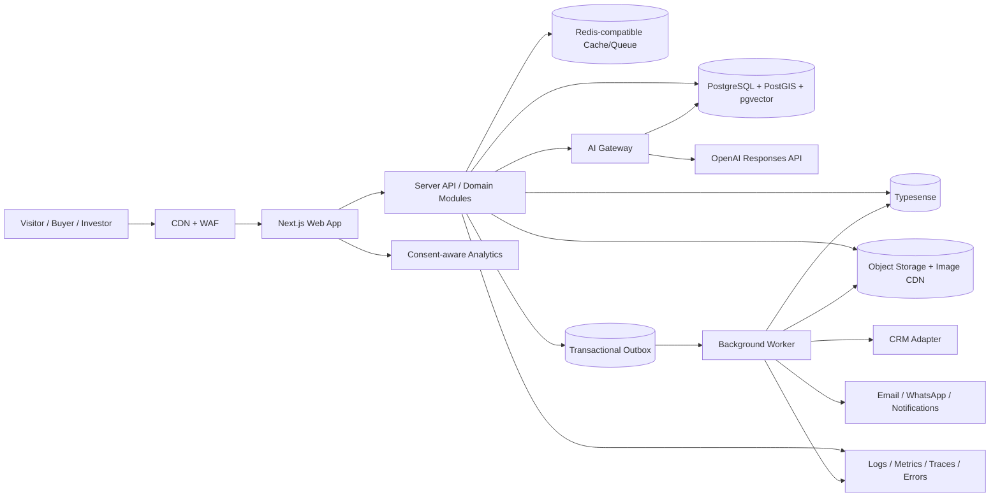
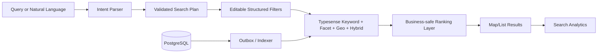
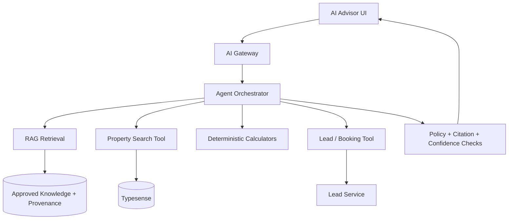

# INVESTMENT EXPERTS — NEXT-GENERATION DUBAI REAL ESTATE DIGITAL PLATFORM
## Research, Competitive Audit, Product Architecture & Implementation-Ready Master Blueprint

**Blueprint version:** 1.0
**Research cut-off:** 2026-09-19 (Asia/Dubai)
**Primary market:** Dubai and wider UAE
**Artifact format:** Markdown source of truth for product, design, engineering, data, AI, CRM, SEO, security, DevOps, QA, migration and launch
**Governing input:** user-provided 75-phase specification in `Pasted markdown(3).md`

### Document Control

- Use this document as the authoritative implementation specification unless a later approved ADR or blueprint revision explicitly supersedes it.
- Do not silently remove customer-visible capabilities because implementation is difficult; mark blockers and preserve the intended outcome.
- Distinguish verified fact, observed website behavior, recommendation, assumption, estimate and item requiring legal/vendor verification.
- Never place secrets, privileged service-role credentials, CRM tokens or unrestricted API keys in browser-delivered code.
- All material architecture changes require an ADR with decision, alternatives, consequences, migration impact and rollback plan.
- Production readiness requires every P0 launch gate in this document to pass with evidence.

### Evidence Labels

- `VERIFIED` — supported by an official/primary source or directly observed public website behavior on the research date.
- `OBSERVED CLAIM` — a statement shown by a company on its own website; useful for UX analysis but not independently validated.
- `RECOMMENDATION` — proposed design or architecture decision for Investment Experts.
- `ASSUMPTION` — placeholder where private business/CRM/content facts were not available and must be confirmed before implementation.
- `ESTIMATE` — non-guaranteed target or projection that must be validated with real data.
- `LEGAL REVIEW` — requirement that needs qualified UAE counsel/privacy review before production use.

# OUTPUT 1 — EXECUTIVE FINDINGS

### F01 — P0
- The current public Investment Experts experience communicates premium Dubai investment positioning but does not expose the depth of searchable inventory, filtering, map discovery, market tooling and entity-rich landing pages expected from leading UAE portals.

### F02 — P0
- The strongest benchmark pattern is not a single visual style; it is the combination of fast property discovery, deep project/community/developer content, persistent conversion paths and credible market intelligence.

### F03 — P0
- Investment Experts should not try to become a generic classifieds portal. The differentiated product should combine curated inventory, advisor-led conversion and an evidence-oriented investment-intelligence layer.

### F04 — P1
- Natural-language property discovery should translate user intent into transparent structured filters, then let users edit those filters rather than hiding logic inside an opaque chatbot.

### F05 — P0
- The AI Property Advisor should use tools and approved first-party knowledge; it must not invent availability, price, ROI, legal rules, visa eligibility or developer facts.

### F06 — P0
- The canonical property/project/developer/community data model must live in PostgreSQL; search engines, vector indexes, caches and analytics systems are derived projections, never the system of record.

### F07 — P0
- A modular monolith plus dedicated background worker is the preferred launch topology. Premature microservices would raise operational cost and implementation risk without creating user value.

### F08 — P0
- Search should combine deterministic filters, typo-tolerant full-text/faceted search, geo search and optional semantic retrieval. Every AI-derived criterion should compile into an auditable search plan.

### F09 — P0
- Lead capture must retain property/search/session attribution and continue to function during CRM outages through local persistence, transactional outbox, retry and dead-letter workflows.

### F10 — P0
- SEO growth depends on high-quality entity pages and controlled programmatic landing pages, not uncontrolled faceted-index expansion. Thin/duplicate pages must default to non-indexable.

### F11 — P1
- Dubai market intelligence can be strengthened with maintainable official/open datasets such as Dubai Land Department transaction/rent/project data, subject to terms and provenance controls.

### F12 — P0
- International-buyer content requires source provenance, freshness dates and an editorial/legal workflow because regulations, fees and residency rules can change.

### F13 — P0
- The design direction should be premium editorial luxury with technology-grade interaction clarity: large imagery, disciplined typography, restrained motion, dense information only where it improves decisions.

### F14 — P0
- Mobile should be designed as a first-class property-shopping workflow with bottom-sheet filters, sticky contextual actions, thumb-friendly galleries and map/list handoff—not a shrunken desktop.

### F15 — P0
- Performance, accessibility, security, privacy, analytics and observability are release criteria, not post-launch cleanup tasks.

## Recommended Product Positioning

> **Investment Experts should become a premium Dubai property decision platform: curated real-estate inventory + investment evidence + human advisory + AI-assisted discovery, connected end-to-end to lead operations.**

### Three Strategic Moats

- **Advisory moat:** human expertise, agent specialization, consultation journeys, service continuity and CRM-assisted follow-up.
- **Data moat:** normalized property/project/community/developer data, transaction context, provenance, freshness and historical change tracking.
- **Experience moat:** premium discovery, comparison, calculators, natural-language search and decision-support that remain fast and comprehensible on mobile.

# OUTPUT 2 — COMPETITOR & GLOBAL BENCHMARK ANALYSIS

## Research Method

### Methodology

- Inspected publicly accessible homepage, search/listing, off-plan/project, agent, area/community, content, conversion and utility patterns where exposed.
- Treated competitor claims as observations, not independent truth.
- Compared patterns by user value, conversion clarity, data depth, SEO surface, performance risk and applicability to Investment Experts.
- Used global benchmarks for inspiration while explicitly prohibiting cloning of visual identity, copy, artwork or proprietary interaction patterns.

### AX CAPITAL

- **Category:** Dubai/UAE brokerage
- **Observed strength:** Strong multi-path search, off-plan/secondary segmentation, map/filter discovery, agent/language discovery, area guides and investment-facing merchandising.
- **Investment Experts lesson:** Adopt the information density and advisor discoverability; simplify where portal complexity would dilute curated advisory positioning.
- **Reference:** https://www.axcapital.ae/

### Peace Homes Development

- **Category:** Dubai developer
- **Observed strength:** Project-first storytelling, immersive development presentation, floor-plan/media emphasis and direct registration journeys.
- **Investment Experts lesson:** Use richer project storytelling and conversion modules for exclusive/featured developments; do not imitate developer-specific branding.
- **Reference:** https://peacehomesdevelopment.com/

### Skyloov

- **Category:** UAE property portal
- **Observed strength:** Portal-style Buy/Rent/Short Term/New Projects structure with broad location/property filters and account/app expectations.
- **Investment Experts lesson:** Borrow search conventions users already understand while avoiding commodity marketplace positioning.
- **Reference:** https://www.skyloov.com/

### Elite Property Dubai

- **Category:** Dubai boutique brokerage
- **Observed strength:** Premium boutique/advisory positioning, ready/off-plan/global investment paths and curated portfolio merchandising.
- **Investment Experts lesson:** Useful reference for balancing luxury identity with commercial search and advisory calls to action.
- **Reference:** https://www.elitepropertydxb.com/

### Betterhomes

- **Category:** UAE brokerage
- **Observed strength:** Large searchable inventory, structured listing cards, off-plan pages, agent/content ecosystem and established market-guide structure.
- **Investment Experts lesson:** Use entity depth and indexable market/content architecture as reference; Investment Experts should differentiate with evidence-led investment intelligence.
- **Reference:** https://www.bhomes.com/en

### Property Finder

- **Category:** Regional portal
- **Observed strength:** Mature search, transaction exploration, mortgage/rent-vs-buy tools, market reports, area insights, saved/tracked property workflows.
- **Investment Experts lesson:** Benchmark task completeness and data utilities; do not attempt to reproduce portal scale at launch.
- **Reference:** https://www.propertyfinder.ae/

### Bayut

- **Category:** Regional portal
- **Observed strength:** Map-centric discovery, valuation/estimate tools, agent trust surfaces, search innovation and new-project discovery.
- **Investment Experts lesson:** Benchmark map/list continuity, trust signals and utility tooling.
- **Reference:** https://www.bayut.com/

### The Modern House

- **Category:** Global design-led brokerage
- **Observed strength:** Editorial, architecture-led premium storytelling and highly distinctive property presentation.
- **Investment Experts lesson:** Reference for editorial restraint, photography hierarchy and premium narrative.
- **Reference:** https://www.themodernhouse.com/

### Knight Frank

- **Category:** Global brokerage/research
- **Observed strength:** Research authority, global market coverage, prime-property positioning and report-led trust.
- **Investment Experts lesson:** Reference for market-intelligence credibility, report taxonomy and thought-leadership UX.
- **Reference:** https://www.knightfrank.com/

### Homes.com / Realtor.com AI patterns

- **Category:** US portals
- **Observed strength:** Conversational/natural-language property discovery patterns show growing user expectation for intent-led search.
- **Investment Experts lesson:** Use conversational search as a layer over structured filters, never as a replacement for deterministic search.
- **Reference:** https://www.homes.com/

## Deep Benchmark Lens

### AX CAPITAL — transferable patterns
- **Brand:** premium brokerage framing with strong Dubai market specialization rather than generic classifieds identity.
- **Discovery:** multiple search entry modes, strong filters, map support and clear off-plan/secondary segmentation reduce early ambiguity.
- **Entity depth:** areas, listings and agents are discoverable as meaningful destinations rather than only card metadata.
- **Advisor trust:** language/specialization discovery helps international users locate a relevant human expert.
- **Conversion:** inquiry and advisor contact stay close to property/project intent.
- **Opportunity for IE:** retain sophisticated search but add stronger evidence/provenance and curated investor reasoning.

### Peace Homes Development — transferable patterns
- **Brand:** project storytelling behaves more like a premium product launch than a conventional listing directory.
- **Media:** floor plans, architectural imagery, immersive visual modules and project-specific narratives support emotional evaluation.
- **Conversion:** registration flows are attached directly to development interest.
- **Opportunity for IE:** use this richness for exclusive/featured projects while maintaining brokerage-wide search continuity.

### Skyloov — transferable patterns
- **Discovery:** familiar portal taxonomy across Buy, Rent, Short Term and New Projects lowers learning cost.
- **Filtering:** users expect property type, location, bed/bath and price filtering as baseline utility.
- **Account expectation:** portal experiences normalize saving and returning to inventory.
- **Opportunity for IE:** meet these baseline conventions but differentiate through curation, advisory and investment intelligence.

### Elite Property Dubai — transferable patterns
- **Positioning:** boutique/premium advisory and investment framing can coexist with transactional property discovery.
- **Portfolio:** ready and off-plan inventory receive distinct merchandising while staying under one brand system.
- **Services:** broader advisory/service pathways support higher-value client relationships beyond a single inquiry.
- **Opportunity for IE:** emulate the clarity of service segmentation without copying visual identity or claims.

### Betterhomes — transferable patterns
- **Inventory:** broad structured inventory and cards create confidence that search is a real product, not decorative navigation.
- **SEO/content:** area, off-plan and market content creates multiple high-intent organic entry points.
- **Operations signal:** mature agent/content/listing ecosystems imply the need for strong internal data/admin workflows.
- **Opportunity for IE:** use entity-rich SEO and inventory depth while keeping the customer experience more curated and investment-aware.

### Property Finder — portal benchmark
- **Task completeness:** search, saved/tracked property behavior, mortgage/rent-vs-buy tools, transaction exploration, market reports and area insights support the entire research journey.
- **Data utility:** transaction/market tools demonstrate that decision support can create return visits independent of current inventory.
- **Opportunity for IE:** reproduce only the high-value decision utilities relevant to an advisory brokerage; avoid trying to match marketplace scale.

### Bayut — portal benchmark
- **Map/search:** map-based exploration and advanced search utilities make location a first-class discovery dimension.
- **Trust/utility:** valuation and agent-oriented trust surfaces reduce information asymmetry.
- **Opportunity for IE:** make map/list continuity and evidence-rich decision tools first-class, with simpler premium presentation.

### Luxhabitat — Dubai luxury benchmark
- **Curation:** the public experience explicitly frames itself as a curated luxury marketplace and connects portfolio quality to architecture, design, quality and location.
- **Editorial engine:** its Journal separates market, neighbourhoods, design/architecture, lifestyle, guides and industry topics, showing how premium inventory can coexist with an authority-building editorial product.
- **Inventory:** public luxury-for-sale pages expose large structured inventories while keeping a luxury visual language.
- **Opportunity for IE:** combine curated premium inventory with stronger methodology/provenance on investment intelligence and deeper advisor continuity.

### Christie’s International Real Estate — global luxury benchmark
- **Editorial/lifestyle:** flagship magazine and lifestyle content expand the relationship beyond a search transaction.
- **Research:** global luxury reports create an authority layer around the property catalog.
- **Development marketing:** premium development presentation is treated as a distinct service.
- **Opportunity for IE:** use editorial authority and report-led trust, localized to Dubai/UAE decision needs.

### Sotheby’s International Realty — global luxury benchmark
- **Research authority:** recurring Luxury Outlook reporting combines global market perspective with advisor network insight.
- **Brand continuity:** property marketing, editorial and research operate inside one premium identity.
- **Opportunity for IE:** create a smaller but highly credible Dubai-focused research franchise using transparent data sources and methodology.

### The Modern House — editorial benchmark
- **Design restraint:** architecture-led storytelling demonstrates that premium does not require dense ornamentation.
- **Content/property relationship:** editorial perspective gives the brand a recognizable worldview rather than only a catalog.
- **Opportunity for IE:** use restrained typography, imagery and narrative while retaining stronger search/conversion utility than an editorial-first brokerage.

### Knight Frank — research benchmark
- **Authority:** research and reports support trust, international context and long-term market engagement.
- **Opportunity for IE:** build maintainable Dubai reports, community intelligence and investor education rather than isolated SEO blog posts.

### Benchmark Synthesis
- No single benchmark should be copied. The target combines **portal-grade task completion**, **developer-grade project storytelling**, **luxury-brokerage editorial polish**, **research-house authority**, and **Investment Experts-specific advisory continuity**.
- The strongest defensible difference is the proposed **Investment Evidence Layer**: every important number, project fact and AI answer can expose source, freshness, methodology and confidence rather than relying on promotional language.

## Benchmark Capability Matrix

| Capability | AX CAPITAL | Peace Homes | Skyloov | Elite DXB | Betterhomes | Property Finder | Bayut | Target IE |
|---|---|---|---|---|---|---|---|---|
| Premium editorial brand | Strong | Strong developer-led | Medium | Strong | Strong | Medium | Medium | Strong + distinctive |
| Structured property search | Strong | Limited project-centric | Strong | Strong | Strong | Very strong | Very strong | Very strong |
| Map discovery | Strong | Low relevance | Strong | Moderate | Moderate | Strong | Strong | Strong |
| Off-plan discovery | Strong | Native focus | Strong | Strong | Strong | Strong | Strong | Best-in-class curated |
| Community/area intelligence | Strong | Project context | Moderate | Moderate | Strong | Strong | Strong | Deep + investment context |
| Developer intelligence | Strong | Own developments | Moderate | Moderate | Strong | Strong | Strong | Deep + provenance |
| Agent discoverability | Strong | Low relevance | Moderate | Strong | Strong | Strong | Strong | Specialization-led |
| Market intelligence | Moderate | Low | Moderate | Moderate | Strong | Very strong | Very strong | Evidence-led |
| Investor calculators | Moderate | Payment-plan led | Limited | Moderate | Moderate | Strong | Strong | Integrated decision suite |
| AI/natural-language search | Emerging | Limited | Limited | Limited | Limited | Emerging | Emerging | Native + transparent |
| CRM conversion continuity | Strong signals | Strong registration | Portal lead flows | Strong advisory | Strong | Strong | Strong | First-party durable lead layer |
| Programmatic SEO potential | Strong | Project-led | Strong | Moderate | Strong | Very strong | Very strong | Controlled, quality-gated |

## Patterns Worth Synthesizing

1. Portal-grade faceted search without portal-grade visual clutter.
2. Developer-grade project storytelling for high-value off-plan launches.
3. Editorial luxury presentation for premium listings and communities.
4. Research-house credibility for market reports and international-buyer education.
5. Persistent contact continuity through WhatsApp, call and consultation booking.
6. Map/list synchronization with visible result counts and stable URL state.
7. Agent profiles that explain specialization, languages and market focus rather than functioning as a staff gallery.
8. Decision tools that expose assumptions and source data instead of presenting opaque yield/ROI promises.

# OUTPUT 3 — INVESTMENT EXPERTS EXISTING-SITE AUDIT

### Verified / Directly Observed Public-Site Findings

- Homepage positioning centers on premium Dubai real estate and investment opportunities.
- The public homepage presents headline business statistics and service categories; these are company-published claims and should be treated as such until internally validated.
- Navigation currently exposes Buy, Rent, Projects and Team as primary destinations.
- Publicly crawlable Buy, Rent and Projects routes observed during research expose substantially less inventory/search content than mature benchmark portals.
- The Team page gives Investment Experts a useful base for advisor-led trust, but agent data should be normalized and connected to specialties, languages, communities, projects and lead routing.
- Contact is primarily a conventional form flow; the new platform should preserve simple contact while adding context-rich consultation and property-specific lead paths.

### Brand & Trust

- Premium positioning exists but needs a more ownable visual/content system.
- Convert generic credibility signals into verifiable proof: awards, registrations, developer partnerships, transaction experience, testimonials with consent and source.
- Use consistent voice: expert, evidence-aware, calm, not hype-driven.

### Information Architecture

- Current primary paths are too shallow for the breadth of investor and buyer intent.
- Introduce first-class entities: Properties, Projects, Communities, Developers, Agents, Market Intelligence, Investment Guides and Tools.
- Use goal-based navigation for Buy, Rent, Off-Plan, Sell/List, Invest and International Buyers.

### Property Discovery

- Make search the product core rather than a secondary page.
- Support deterministic filters, autocomplete, geo search, map/list, saved search, comparison and natural-language intent parsing.
- Preserve URL-addressable search state for sharing, analytics and SEO-safe canonicalization.

### Project Experience

- Replace thin project browsing with structured development pages.
- Include payment-plan, handover, unit mix, developer, construction/progress provenance, gallery, floor plans, map, related inventory and advisor CTA.
- Treat brochure claims as source documents with freshness/version metadata.

### Conversion

- Retain low-friction WhatsApp/call but attach lead context.
- Every lead should include page, entity, campaign, referrer, search criteria and consent evidence.
- Forms should progressively ask only what is needed for the current intent.

### Mobile

- Design mobile-specific search, filter sheets, galleries and sticky actions.
- Avoid fixed overlays that obscure content.
- Target one-handed flows and restore state after modal/filter interactions.

### Content & SEO

- Create topic/entity clusters rather than isolated blog posts.
- Build indexable community/developer/project/guide pages with internal-link rules.
- Do not index low-value filter combinations by default.

### Performance

- Set explicit Core Web Vitals and media budgets.
- Use responsive images, route-level JS budgets, server rendering and third-party-script governance.
- Measure real-user p75, not only lab scores.

### Security & Privacy

- Protect forms, APIs, admin and integrations with least privilege.
- Capture consent purpose/version/time/source.
- Create retention/deletion/export workflows and legal review for UAE/international obligations.

### Operations

- Create admin workflows for property freshness, duplicate detection, content review and CRM sync.
- Add observability for search, AI, lead, media and integration health.
- Use safe migrations, backups, incident response and rollback gates.

## Page-by-Page Public-Site Audit — Observed 2026-09-19

### Homepage `/`
- **Observed:** primary navigation exposes Buy, Rent, Projects and Team, plus phone/contact actions.
- **Observed:** hero positioning centers on investing in Dubai and promotes off-plan, ready villas and exclusive investment deals.
- **Observed claim:** the page displays 500+ properties sold, AED 2B+ total sales value, 98% client satisfaction and 15+ years experience; these are company-published figures and require internal evidence before reuse as verified claims.
- **Strength:** clear Dubai investment positioning and simple access to human contact.
- **Gap:** property discovery is not yet the dominant interactive product above the fold; featured-property and market-insight promises are not matched by deep crawler-visible inventory/data surfaces.
- **Recommendation:** replace generic hero CTA hierarchy with a high-performance search/advisor entry point, curated opportunities and verifiable trust evidence.

### Buy `/properties`
- **Observed crawler-visible state:** page title is “Properties for Sale,” followed by newsletter/footer content; mature searchable inventory, filters, result cards and indexable supporting content were not exposed in the public snapshot reviewed.
- **Risk:** a high-intent Buy route that appears thin to users/crawlers leaks demand and weakens SEO breadth.
- **Recommendation:** make this a full search/results product with structured filters, map/list, URL state, sorting, pagination, saved search, no-result recovery and supporting curated SEO content.

### Rent `/rentals`
- **Observed crawler-visible state:** page title is “Properties for Rent,” followed primarily by newsletter/footer content.
- **Risk:** rental intent has no visible inventory/search depth comparable with established Dubai property experiences.
- **Recommendation:** ship rent-specific search semantics, annual/monthly price normalization, furnishing/availability filters, map discovery and inquiry/viewing actions.

### Projects `/projects`
- **Observed crawler-visible state:** page title is “Off-Plan Projects,” followed by newsletter/footer content; no deep project catalog was exposed in the reviewed public snapshot.
- **Risk:** off-plan is central to the brand message yet the dedicated route does not visibly demonstrate project choice, developer depth, handover/payment-plan filtering or current inventory.
- **Recommendation:** make Projects a first-class discovery engine with developer/community/handover/payment-plan filters and rich project detail pages.

### Team `/team`
- **Observed:** the public team route exposes 25+ expert-agent positioning and a long directory of staff/agents with roles and country markers.
- **Strength:** this is a useful base for human trust and advisor-led conversion.
- **Gap:** a staff directory is not yet an advisor discovery system; specialties, languages, communities, project expertise, active listings, response expectations and direct advisor journeys should be normalized.
- **Recommendation:** convert agent cards into searchable profiles linked to inventory, content, languages/specialties and lead-routing capacity.

### Contact `/contact`
- **Observed:** contact information plus a conventional name/email/phone/subject/message form.
- **Strength:** low-complexity general contact path remains important.
- **Gap:** generic contact loses high-value context that is already known from property/project/search behavior.
- **Recommendation:** retain general contact but add contextual inquiry, viewing, valuation and consultation flows that persist entity/search/attribution/consent context into CRM.

### Cross-Site Audit Conclusion
- The existing public site is best treated as a **brand and contact foundation**, not as the architecture to incrementally decorate.
- The redesign should preserve valuable URLs/brand equity but replace thin discovery surfaces with a coherent property data/search/content/advisory platform.
- Because the observations above are based on publicly crawlable output, implementation discovery must also inspect the actual source repository/CMS/CRM before migration decisions; hidden client-side or authenticated capabilities should not be assumed absent without code/data access.

# OUTPUT 4 — GAP ANALYSIS: KEEP / IMPROVE / REPLACE / ADD

## KEEP

- Premium Dubai/UAE focus
- Investment-advisory positioning
- Existing brand/company identity assets that pass quality review
- Direct contact options
- Team/advisor presence
- Existing high-value content/URLs with organic equity
- Existing analytics/search-console history
- Existing valid lead and CRM data

## IMPROVE

- Homepage hierarchy and search prominence
- Team profiles into advisor discovery
- Property/project data completeness
- Lead forms and attribution
- Photography/media governance
- Navigation and mobile IA
- SEO metadata and internal linking
- Trust evidence and claim provenance
- WhatsApp/call tracking
- Content publishing workflow

## REPLACE

- Thin or placeholder inventory experiences
- Ad-hoc data models that cannot represent projects/units/payment plans/history
- Uncontrolled client-side data fetching for SEO-critical pages
- Any privileged key exposed to browser code
- Synchronous CRM dependency in user-facing lead submission
- Index-every-filter SEO behavior
- Non-versioned brochure/knowledge ingestion
- Manual-only redirects and sitemap maintenance

## ADD

- Structured property search + map
- Natural-language search compiler
- AI Property Advisor
- Property/project/community/developer comparison
- ROI/yield/mortgage/payment-plan calculators
- Market Intelligence Hub
- International Buyer Hub
- Golden Visa/regulatory content governance
- Favorites/recent/saved search accounts
- Property alerts
- CRM integration layer + outbox
- Admin/CMS + approval workflow
- DLD/open-data ingestion with provenance
- RAG knowledge system
- Multilingual/RTL architecture
- Experimentation and feature flags
- Consent center
- Audit log and role-based admin
- Observability dashboards
- Automated SEO/structured-data validation

## Priority Definitions

- **P0:** Foundation or launch-critical; absence creates broken core journeys, unacceptable risk or inability to operate.
- **P1:** High-value launch capability; include where feasible without compromising P0 quality.
- **P2:** Post-launch enhancement supported by the architecture.
- **P3:** Future innovation or scale optimization; preserve contracts/data paths now when inexpensive.

# OUTPUT 5 — NEXT-GENERATION PRODUCT VISION

### North-Star Experience

- A visitor can describe what they want in natural language or structured filters and immediately receive transparent, editable criteria and relevant inventory.
- Every property/project page answers both lifestyle and investment questions with source-aware facts, not promotional ambiguity.
- A visitor can compare opportunities, test scenarios, save searches and move into a human consultation without losing context.
- An advisor receives a lead with enough intent context to respond intelligently instead of asking the customer to repeat everything.
- Content teams can publish and update projects, communities, developer profiles, reports and guides without engineering intervention while governance remains enforceable.
- Engineering can change providers for CRM, AI, maps, analytics and search without rewriting product logic because integrations sit behind explicit adapters.

## Product Pillars

- **Premium Discovery:** Fast visual search, map/list, curated opportunities, rich project/property pages.
- **Investment Evidence:** Provenance, historical context, calculators, assumptions, risk notes and market data.
- **Advisor Continuity:** Agent specialization, consultation booking, lead context, CRM workflows and response monitoring.
- **AI Assistance:** Natural-language search, RAG answers, comparisons, explanations and guided lead qualification with guardrails.
- **Market Authority:** Community/developer intelligence, reports, guides and first-party data products.
- **Operational Excellence:** Admin, ingestion, data quality, observability, security, privacy and reliable integrations.

# OUTPUT 6 — PROPOSED TECHNOLOGY ARCHITECTURE

## Current Technology Verification — 2026-09-19

### Next.js

- **Status:** VERIFIED
- **Fact:** 16.3.3 is identified by the official Next.js August 2026 security release as Active LTS. Pin exact patch versions and follow security advisories.
- **Primary source:** https://nextjs.org/blog

### React

- **Status:** VERIFIED
- **Fact:** React 19.3 was released 2026-09-09. Use only stable APIs needed by the product; do not add animation features solely because they are new.
- **Primary source:** https://react.dev/blog/2026/09/09/react-19-3

### PostgreSQL

- **Status:** VERIFIED
- **Fact:** Upstream PostgreSQL 18.6 was released 2026-08-13. Managed-provider supported versions may differ; provision the newest supported stable version that passes extension compatibility.
- **Primary source:** https://www.postgresql.org/docs/release/18.6/

### Typesense

- **Status:** VERIFIED
- **Fact:** v30.2 documentation is current and supports typo tolerance, facets/filtering, geo, vector and hybrid search.
- **Primary source:** https://typesense.org/docs/30.2/api/

### OpenAI API

- **Status:** VERIFIED
- **Fact:** Responses API supports model responses plus built-in/custom tools including function calling; use a model registry/configuration rather than hard-coded model names in business logic.
- **Primary source:** https://platform.openai.com/docs/quickstart/make-your-first-api-request

### Dubai Land Department

- **Status:** VERIFIED
- **Fact:** Public real-estate data surfaces include Transactions, Rents, Project, Valuations, Land, Building, Unit, Broker and Developer datasets, with downloadable records on the public portal.
- **Primary source:** https://dubailand.gov.ae/en/open-data/real-estate-data/

### UAE privacy

- **Status:** VERIFIED
- **Fact:** UAE federal Personal Data Protection Law is a core legal baseline for electronic personal-data processing; implementation details require counsel review.
- **Primary source:** https://u.ae/en/about-the-uae/digital-uae/data/data-protection-laws

### WCAG

- **Status:** VERIFIED
- **Fact:** WCAG 2.2 is the W3C Recommendation baseline; target AA for the product.
- **Primary source:** https://www.w3.org/TR/WCAG22/

## Recommended Launch Stack

### Web application

- **Recommendation:** Next.js 16.3.3 Active LTS + React 19.3 + TypeScript strict
- **Reason:** SEO-first rendering, server components where appropriate, route-level caching and strong AI-coding-agent compatibility.

### Styling/design system

- **Recommendation:** Tailwind CSS 4.x + CSS variables/tokens + accessible primitives
- **Reason:** Fast implementation with an explicit brand token layer; avoid framework-default visual identity.

### Primary database

- **Recommendation:** Supabase-managed PostgreSQL
- **Reason:** Relational source of truth, Auth/RLS integration, extensions, managed backups and rapid initial operations.

### Geo

- **Recommendation:** PostGIS in PostgreSQL
- **Reason:** Canonical coordinates, boundaries, distance queries and spatial validation.

### Vector/RAG store

- **Recommendation:** pgvector in PostgreSQL initially
- **Reason:** Keeps approved knowledge/provenance close to canonical content; external vector service only if scale proves necessary.

### Search index

- **Recommendation:** Typesense 30.x
- **Reason:** Typo-tolerant faceted search, geo filtering and optional hybrid semantic retrieval with lower operational complexity than Elasticsearch-class stacks.

### Cache/queue backing

- **Recommendation:** Managed Redis-compatible service
- **Reason:** Caching, BullMQ-compatible jobs, rate limits and ephemeral coordination; never canonical business storage.

### Background jobs

- **Recommendation:** Dedicated Node.js worker + BullMQ-compatible queues
- **Reason:** Imports, indexing, CRM sync, AI ingestion, media jobs, emails and retryable workflows independent of request lifetime.

### Object/media storage

- **Recommendation:** S3-compatible object storage / Supabase Storage with CDN image transformation
- **Reason:** Versioned originals, responsive derivatives, brochures and floor plans with signed/admin upload paths.

### Maps

- **Recommendation:** Mapbox GL JS behind a provider abstraction
- **Reason:** Rich map UX; provider contract allows cost/licensing-driven migration.

### AI orchestration

- **Recommendation:** OpenAI Responses API through server-side AI gateway
- **Reason:** Tool calling, model routing, RAG, policy, tracing and cost governance with provider abstraction.

### CMS/Admin

- **Recommendation:** Integrated custom admin over canonical DB + workflow tables
- **Reason:** Avoids content/inventory split-brain and enables property-specific governance.

### Analytics

- **Recommendation:** GA4 for acquisition + product analytics provider + first-party event stream
- **Reason:** Separate marketing attribution from product behavior; consent-aware tracking.

### Observability

- **Recommendation:** OpenTelemetry-compatible tracing + error tracking + logs + uptime checks
- **Reason:** Correlate user request, search, lead, AI and CRM operations.

### Hosting

- **Recommendation:** Vercel-compatible Next.js frontend + managed DB/search/Redis + worker runtime
- **Reason:** Cost-efficient initial operations; provider boundaries prevent lock-in from entering domain logic.

### CI/CD

- **Recommendation:** GitHub Actions + preview environments + migration gates
- **Reason:** PR quality checks, security scans, preview validation and controlled production rollout.

## Architecture Principles

- Canonical business data lives in PostgreSQL.
- Search indexes, caches and vector representations are rebuildable projections.
- External providers are accessed through typed adapters; domain code never depends on provider-specific payloads.
- Use a modular monolith for web/API domain logic and a separately deployable worker for asynchronous jobs.
- Write lead/business state locally before attempting remote CRM delivery.
- Use the transactional outbox pattern for durable cross-system events.
- Every webhook receiver is authenticated where possible, idempotent and replay-safe.
- Every expensive or untrusted request has timeouts, limits and observable failure behavior.
- Feature flags govern risky rollouts; schema migrations are backwards-compatible across rolling deployments.
- AI is advisory/orchestration infrastructure, never the source of truth for price, availability or regulations.

## Overall Architecture Diagram

## Search Architecture Diagram

## AI Advisor Architecture Diagram

# OUTPUT 7 — UX/UI STRATEGY

### Experience Direction

- Visual character: refined Dubai luxury, architectural confidence and editorial restraint; avoid generic black-and-gold cliché as the only premium signal.
- Hierarchy: one dominant action per viewport zone; property search and advisory actions remain obvious without turning every section into a lead form.
- Photography: property and city imagery must carry the brand; UI chrome remains quiet and highly legible.
- Motion: subtle state transitions, gallery continuity, filter affordances and content reveals; never sacrifice INP or accessibility for cinematic effects.
- Density: discovery/results can be information-dense; brand/editorial pages should use more whitespace and narrative rhythm.
- Mobile: bottom-sheet filters, sticky context actions, swipeable but accessible galleries, compact compare/favorite controls and persistent search state.

## Design Tokens

- **Color / ink:** Near-black neutral for core text; avoid pure black for large surfaces unless validated.
- **Color / canvas:** Warm neutral or clean off-white supporting premium imagery.
- **Color / accent:** Single distinctive brand accent derived from approved Investment Experts identity; use sparingly for actions and selected states.
- **Color / status:** Semantic success/warning/error/info tokens independent from brand colors.
- **Typography / display:** High-character premium display face with tested Arabic pairing; performance-budget font files.
- **Typography / UI:** Highly legible sans-serif with tabular numerals where financial data appears.
- **Spacing:** 4px base scale with semantic spacing aliases; components use tokens, not arbitrary pixel values.
- **Radius:** Small/medium radii; property imagery may use larger radius only where brand system calls for it.
- **Elevation:** Minimal shadow system; prefer borders, tonal surfaces and depth only where interaction hierarchy needs it.
- **Motion:** 120–220ms UI transitions; longer editorial motion allowed only outside critical interaction paths and disabled for reduced motion.

## Accessibility Standard

- Target WCAG 2.2 AA for all production experiences.
- Every interactive element reachable and operable by keyboard.
- Visible focus states must not be removed or obscured by sticky UI.
- Modals/drawers trap focus correctly and restore focus on close.
- Form errors are programmatically associated with controls and summarized for long forms.
- Color is never the only indicator of state.
- Map features have equivalent list/search access.
- Carousels/galleries expose controls and pause/stop behavior; no essential information is auto-rotated.
- `prefers-reduced-motion` removes non-essential animation.
- Arabic/RTL layouts are mirrored intentionally rather than mechanically.

# OUTPUT 8 — FEATURE ARCHITECTURE

### Intelligent Search — P0

- Structured + natural-language search, autocomplete, typo tolerance, geo, facets, URL state, saved search.

### Map Discovery — P0

- Clustered markers, synchronized list, search-this-area, community boundaries, POIs and mobile map sheet.

### Property Detail — P0

- Gallery, facts, availability, agent, location, financial context, documents, similar properties and context-rich lead actions.

### Project Detail — P0

- Developer, handover, unit mix, payment plans, floor plans, construction/progress source, brochure, map and available units.

### Community Intelligence — P1

- Lifestyle, stock, pricing/rent context, nearby amenities, transport, schools, market data and relevant inventory.

### Developer Intelligence — P1

- Profile, current/completed projects, locations, payment plans, source-backed delivery information and related content.

### AI Property Advisor — P1

- Requirement discovery, property search, comparisons, source-backed answers, calculators, lead capture and human handoff.

### Investor Calculators — P1

- Yield, ROI scenario, mortgage, payment plan, currency and comparison with visible assumptions.

### Market Intelligence — P1

- DLD-supported data products, reports, trends and downloadable/lead-generating research.

### Accounts — P1

- Favorites, saved searches, alerts, comparisons, recent items and preferences.

### International Buyer Hub — P1

- Buying process, fees, financing, remote purchase, ownership/regulatory content with source/freshness governance.

### Sell/List Property — P0

- Valuation/request path, seller qualification, property capture, consent and CRM routing.

### Advisor Directory — P0

- Specialty/language/community/project searchable profiles and advisor-specific lead attribution.

### CMS/Admin — P0

- Inventory/content/SEO/media/AI knowledge/users/roles/integrations/audit operations.

### Personalization — P2

- Consent-aware recommendations from views, searches, favorites and declared preferences.

### Experimentation — P2

- Feature flags and controlled A/B tests with guardrails and performance budgets.

### Multilingual — P1

- English foundation, Arabic-ready RTL, expandable locale architecture for Russian/Chinese/French/Hindi.

### Notifications — P2

- Email/WhatsApp/SMS/browser where consent and provider policies allow; price/new-match/viewing events.

# OUTPUT 9 — COMPLETE DATABASE + API + INTEGRATION ARCHITECTURE

## Database Conventions

- Use UUID/ULID-style opaque identifiers consistently; expose slugs separately for SEO routes.
- Every mutable business row includes `created_at`, `updated_at` and actor/source metadata where useful.
- Use timestamptz in UTC in storage; localize only at presentation boundaries.
- Use integer minor units or high-precision numeric for money; never floating-point currency math.
- Use ISO 4217 currency codes and explicit area-unit conversions.
- Soft deletion is selective, not universal; financial/audit/integration history may require immutable retention policies.
- Enforce tenant/org scope on private/admin/CRM data with RLS and service-layer authorization.
- Public content views use explicit publication state and safe projection, not direct unrestricted table access.
- Use partial/compound indexes based on proven query patterns; verify with EXPLAIN ANALYZE before speculative indexing.
- Use check constraints/enums/reference tables for bounded states; avoid free-text workflow states.
- All search-index mutations originate from an outbox/event after DB commit.
- All imported records retain source system, source key, checksum and last-seen timestamps for reconciliation.

# OUTPUT 10 — 5,000+ LINE MASTER WEBSITE BLUEPRINT

## PART A — PAGE-BY-PAGE IMPLEMENTATION SPECIFICATIONS

### A01. Homepage

- **Route:** `/`
- **Priority:** P0
- **Primary intent:** Discovery + brand trust
- **Primary entities:** properties, projects, communities, developers, market_reports
- **Primary CTA:** Search properties
- **SEO intent:** Dubai real estate, off-plan and investment opportunities
- Server-render the meaningful initial state when the route is indexable; do not require client JavaScript to reveal core text/content.
- Define one explicit H1; subordinate headings follow semantic order and must not be selected for visual size alone.
- Use breadcrumbs for nested public entity/content pages; account/application pages may omit public breadcrumbs.
- Expose loading skeletons that approximate final layout to minimize CLS.
- Expose useful empty-state recovery actions rather than blank containers or dead ends.
- Define explicit API error state with retry only for idempotent reads; mutation retry behavior must avoid duplicate leads/bookings.
- Track `page_view` plus page-specific entity/impression events with consent-aware analytics.
- Record campaign/referrer/session context on lead-capable routes in a first-party attribution context.
- Do not render unsupported market/ROI claims; show source, date and methodology for quantitative assertions.
- All interactive controls require keyboard focus, accessible names and minimum touch target guidance.
- Mobile layout is separately validated at 320, 375, 390 and 430px widths.
- Desktop layout is validated at tablet, small laptop, desktop and large desktop ranges.
- All images use responsive sizing, reserved aspect ratio and meaningful alternative text when informative.
- Critical CTA remains visible/contextual without obscuring content or violating consent expectations.
- Cache public read models according to freshness class; invalidate from domain events rather than arbitrary long TTL alone.
- Canonical URL excludes tracking parameters and non-indexable UI state.
- Structured data is emitted only when page content actually satisfies the chosen Schema.org type.
- Noindex private/account routes, internal search states and low-value combinations unless explicitly approved by SEO governance.
- QA must include keyboard navigation, screen-reader semantics, form error behavior, mobile viewport and no-JS/slow-network resilience where relevant.
- Acceptance: primary task can be completed end to end with production data and all analytics/security/monitoring hooks active.

### A02. Buy Hub

- **Route:** `/buy`
- **Priority:** P0
- **Primary intent:** Buyer discovery
- **Primary entities:** properties, communities
- **Primary CTA:** Explore properties
- **SEO intent:** Properties for sale in Dubai
- Server-render the meaningful initial state when the route is indexable; do not require client JavaScript to reveal core text/content.
- Define one explicit H1; subordinate headings follow semantic order and must not be selected for visual size alone.
- Use breadcrumbs for nested public entity/content pages; account/application pages may omit public breadcrumbs.
- Expose loading skeletons that approximate final layout to minimize CLS.
- Expose useful empty-state recovery actions rather than blank containers or dead ends.
- Define explicit API error state with retry only for idempotent reads; mutation retry behavior must avoid duplicate leads/bookings.
- Track `page_view` plus page-specific entity/impression events with consent-aware analytics.
- Record campaign/referrer/session context on lead-capable routes in a first-party attribution context.
- Do not render unsupported market/ROI claims; show source, date and methodology for quantitative assertions.
- All interactive controls require keyboard focus, accessible names and minimum touch target guidance.
- Mobile layout is separately validated at 320, 375, 390 and 430px widths.
- Desktop layout is validated at tablet, small laptop, desktop and large desktop ranges.
- All images use responsive sizing, reserved aspect ratio and meaningful alternative text when informative.
- Critical CTA remains visible/contextual without obscuring content or violating consent expectations.
- Cache public read models according to freshness class; invalidate from domain events rather than arbitrary long TTL alone.
- Canonical URL excludes tracking parameters and non-indexable UI state.
- Structured data is emitted only when page content actually satisfies the chosen Schema.org type.
- Noindex private/account routes, internal search states and low-value combinations unless explicitly approved by SEO governance.
- QA must include keyboard navigation, screen-reader semantics, form error behavior, mobile viewport and no-JS/slow-network resilience where relevant.
- Acceptance: primary task can be completed end to end with production data and all analytics/security/monitoring hooks active.

### A03. Rent Hub

- **Route:** `/rent`
- **Priority:** P0
- **Primary intent:** Tenant discovery
- **Primary entities:** listings, communities
- **Primary CTA:** Explore rentals
- **SEO intent:** Properties for rent in Dubai
- Server-render the meaningful initial state when the route is indexable; do not require client JavaScript to reveal core text/content.
- Define one explicit H1; subordinate headings follow semantic order and must not be selected for visual size alone.
- Use breadcrumbs for nested public entity/content pages; account/application pages may omit public breadcrumbs.
- Expose loading skeletons that approximate final layout to minimize CLS.
- Expose useful empty-state recovery actions rather than blank containers or dead ends.
- Define explicit API error state with retry only for idempotent reads; mutation retry behavior must avoid duplicate leads/bookings.
- Track `page_view` plus page-specific entity/impression events with consent-aware analytics.
- Record campaign/referrer/session context on lead-capable routes in a first-party attribution context.
- Do not render unsupported market/ROI claims; show source, date and methodology for quantitative assertions.
- All interactive controls require keyboard focus, accessible names and minimum touch target guidance.
- Mobile layout is separately validated at 320, 375, 390 and 430px widths.
- Desktop layout is validated at tablet, small laptop, desktop and large desktop ranges.
- All images use responsive sizing, reserved aspect ratio and meaningful alternative text when informative.
- Critical CTA remains visible/contextual without obscuring content or violating consent expectations.
- Cache public read models according to freshness class; invalidate from domain events rather than arbitrary long TTL alone.
- Canonical URL excludes tracking parameters and non-indexable UI state.
- Structured data is emitted only when page content actually satisfies the chosen Schema.org type.
- Noindex private/account routes, internal search states and low-value combinations unless explicitly approved by SEO governance.
- QA must include keyboard navigation, screen-reader semantics, form error behavior, mobile viewport and no-JS/slow-network resilience where relevant.
- Acceptance: primary task can be completed end to end with production data and all analytics/security/monitoring hooks active.

### A04. Off-Plan Hub

- **Route:** `/off-plan`
- **Priority:** P0
- **Primary intent:** Off-plan investor discovery
- **Primary entities:** projects, developers, payment_plans
- **Primary CTA:** Explore projects
- **SEO intent:** Off-plan projects in Dubai
- Server-render the meaningful initial state when the route is indexable; do not require client JavaScript to reveal core text/content.
- Define one explicit H1; subordinate headings follow semantic order and must not be selected for visual size alone.
- Use breadcrumbs for nested public entity/content pages; account/application pages may omit public breadcrumbs.
- Expose loading skeletons that approximate final layout to minimize CLS.
- Expose useful empty-state recovery actions rather than blank containers or dead ends.
- Define explicit API error state with retry only for idempotent reads; mutation retry behavior must avoid duplicate leads/bookings.
- Track `page_view` plus page-specific entity/impression events with consent-aware analytics.
- Record campaign/referrer/session context on lead-capable routes in a first-party attribution context.
- Do not render unsupported market/ROI claims; show source, date and methodology for quantitative assertions.
- All interactive controls require keyboard focus, accessible names and minimum touch target guidance.
- Mobile layout is separately validated at 320, 375, 390 and 430px widths.
- Desktop layout is validated at tablet, small laptop, desktop and large desktop ranges.
- All images use responsive sizing, reserved aspect ratio and meaningful alternative text when informative.
- Critical CTA remains visible/contextual without obscuring content or violating consent expectations.
- Cache public read models according to freshness class; invalidate from domain events rather than arbitrary long TTL alone.
- Canonical URL excludes tracking parameters and non-indexable UI state.
- Structured data is emitted only when page content actually satisfies the chosen Schema.org type.
- Noindex private/account routes, internal search states and low-value combinations unless explicitly approved by SEO governance.
- QA must include keyboard navigation, screen-reader semantics, form error behavior, mobile viewport and no-JS/slow-network resilience where relevant.
- Acceptance: primary task can be completed end to end with production data and all analytics/security/monitoring hooks active.

### A05. New Projects

- **Route:** `/projects`
- **Priority:** P0
- **Primary intent:** Project discovery
- **Primary entities:** projects, developers
- **Primary CTA:** View projects
- **SEO intent:** New real estate projects in Dubai
- Server-render the meaningful initial state when the route is indexable; do not require client JavaScript to reveal core text/content.
- Define one explicit H1; subordinate headings follow semantic order and must not be selected for visual size alone.
- Use breadcrumbs for nested public entity/content pages; account/application pages may omit public breadcrumbs.
- Expose loading skeletons that approximate final layout to minimize CLS.
- Expose useful empty-state recovery actions rather than blank containers or dead ends.
- Define explicit API error state with retry only for idempotent reads; mutation retry behavior must avoid duplicate leads/bookings.
- Track `page_view` plus page-specific entity/impression events with consent-aware analytics.
- Record campaign/referrer/session context on lead-capable routes in a first-party attribution context.
- Do not render unsupported market/ROI claims; show source, date and methodology for quantitative assertions.
- All interactive controls require keyboard focus, accessible names and minimum touch target guidance.
- Mobile layout is separately validated at 320, 375, 390 and 430px widths.
- Desktop layout is validated at tablet, small laptop, desktop and large desktop ranges.
- All images use responsive sizing, reserved aspect ratio and meaningful alternative text when informative.
- Critical CTA remains visible/contextual without obscuring content or violating consent expectations.
- Cache public read models according to freshness class; invalidate from domain events rather than arbitrary long TTL alone.
- Canonical URL excludes tracking parameters and non-indexable UI state.
- Structured data is emitted only when page content actually satisfies the chosen Schema.org type.
- Noindex private/account routes, internal search states and low-value combinations unless explicitly approved by SEO governance.
- QA must include keyboard navigation, screen-reader semantics, form error behavior, mobile viewport and no-JS/slow-network resilience where relevant.
- Acceptance: primary task can be completed end to end with production data and all analytics/security/monitoring hooks active.

### A06. Property Search

- **Route:** `/properties`
- **Priority:** P0
- **Primary intent:** Inventory search
- **Primary entities:** listings, properties, communities
- **Primary CTA:** View property
- **SEO intent:** Dubai property search
- Server-render the meaningful initial state when the route is indexable; do not require client JavaScript to reveal core text/content.
- Define one explicit H1; subordinate headings follow semantic order and must not be selected for visual size alone.
- Use breadcrumbs for nested public entity/content pages; account/application pages may omit public breadcrumbs.
- Expose loading skeletons that approximate final layout to minimize CLS.
- Expose useful empty-state recovery actions rather than blank containers or dead ends.
- Define explicit API error state with retry only for idempotent reads; mutation retry behavior must avoid duplicate leads/bookings.
- Track `page_view` plus page-specific entity/impression events with consent-aware analytics.
- Record campaign/referrer/session context on lead-capable routes in a first-party attribution context.
- Do not render unsupported market/ROI claims; show source, date and methodology for quantitative assertions.
- All interactive controls require keyboard focus, accessible names and minimum touch target guidance.
- Mobile layout is separately validated at 320, 375, 390 and 430px widths.
- Desktop layout is validated at tablet, small laptop, desktop and large desktop ranges.
- All images use responsive sizing, reserved aspect ratio and meaningful alternative text when informative.
- Critical CTA remains visible/contextual without obscuring content or violating consent expectations.
- Cache public read models according to freshness class; invalidate from domain events rather than arbitrary long TTL alone.
- Canonical URL excludes tracking parameters and non-indexable UI state.
- Structured data is emitted only when page content actually satisfies the chosen Schema.org type.
- Noindex private/account routes, internal search states and low-value combinations unless explicitly approved by SEO governance.
- QA must include keyboard navigation, screen-reader semantics, form error behavior, mobile viewport and no-JS/slow-network resilience where relevant.
- Acceptance: primary task can be completed end to end with production data and all analytics/security/monitoring hooks active.

### A07. Search Map

- **Route:** `/properties/map`
- **Priority:** P0
- **Primary intent:** Geo discovery
- **Primary entities:** listings, locations, communities
- **Primary CTA:** View result
- **SEO intent:** Dubai property map search
- Server-render the meaningful initial state when the route is indexable; do not require client JavaScript to reveal core text/content.
- Define one explicit H1; subordinate headings follow semantic order and must not be selected for visual size alone.
- Use breadcrumbs for nested public entity/content pages; account/application pages may omit public breadcrumbs.
- Expose loading skeletons that approximate final layout to minimize CLS.
- Expose useful empty-state recovery actions rather than blank containers or dead ends.
- Define explicit API error state with retry only for idempotent reads; mutation retry behavior must avoid duplicate leads/bookings.
- Track `page_view` plus page-specific entity/impression events with consent-aware analytics.
- Record campaign/referrer/session context on lead-capable routes in a first-party attribution context.
- Do not render unsupported market/ROI claims; show source, date and methodology for quantitative assertions.
- All interactive controls require keyboard focus, accessible names and minimum touch target guidance.
- Mobile layout is separately validated at 320, 375, 390 and 430px widths.
- Desktop layout is validated at tablet, small laptop, desktop and large desktop ranges.
- All images use responsive sizing, reserved aspect ratio and meaningful alternative text when informative.
- Critical CTA remains visible/contextual without obscuring content or violating consent expectations.
- Cache public read models according to freshness class; invalidate from domain events rather than arbitrary long TTL alone.
- Canonical URL excludes tracking parameters and non-indexable UI state.
- Structured data is emitted only when page content actually satisfies the chosen Schema.org type.
- Noindex private/account routes, internal search states and low-value combinations unless explicitly approved by SEO governance.
- QA must include keyboard navigation, screen-reader semantics, form error behavior, mobile viewport and no-JS/slow-network resilience where relevant.
- Acceptance: primary task can be completed end to end with production data and all analytics/security/monitoring hooks active.

### A08. Property Detail

- **Route:** `/properties/[slug]`
- **Priority:** P0
- **Primary intent:** Property decision
- **Primary entities:** properties, listings, media, agents
- **Primary CTA:** Enquire / WhatsApp
- **SEO intent:** Property-specific intent
- Server-render the meaningful initial state when the route is indexable; do not require client JavaScript to reveal core text/content.
- Define one explicit H1; subordinate headings follow semantic order and must not be selected for visual size alone.
- Use breadcrumbs for nested public entity/content pages; account/application pages may omit public breadcrumbs.
- Expose loading skeletons that approximate final layout to minimize CLS.
- Expose useful empty-state recovery actions rather than blank containers or dead ends.
- Define explicit API error state with retry only for idempotent reads; mutation retry behavior must avoid duplicate leads/bookings.
- Track `page_view` plus page-specific entity/impression events with consent-aware analytics.
- Record campaign/referrer/session context on lead-capable routes in a first-party attribution context.
- Do not render unsupported market/ROI claims; show source, date and methodology for quantitative assertions.
- All interactive controls require keyboard focus, accessible names and minimum touch target guidance.
- Mobile layout is separately validated at 320, 375, 390 and 430px widths.
- Desktop layout is validated at tablet, small laptop, desktop and large desktop ranges.
- All images use responsive sizing, reserved aspect ratio and meaningful alternative text when informative.
- Critical CTA remains visible/contextual without obscuring content or violating consent expectations.
- Cache public read models according to freshness class; invalidate from domain events rather than arbitrary long TTL alone.
- Canonical URL excludes tracking parameters and non-indexable UI state.
- Structured data is emitted only when page content actually satisfies the chosen Schema.org type.
- Noindex private/account routes, internal search states and low-value combinations unless explicitly approved by SEO governance.
- QA must include keyboard navigation, screen-reader semantics, form error behavior, mobile viewport and no-JS/slow-network resilience where relevant.
- Acceptance: primary task can be completed end to end with production data and all analytics/security/monitoring hooks active.

### A09. Project Detail

- **Route:** `/projects/[slug]`
- **Priority:** P0
- **Primary intent:** Off-plan decision
- **Primary entities:** projects, units, developer, payment_plans
- **Primary CTA:** Request availability
- **SEO intent:** Project-specific intent
- Server-render the meaningful initial state when the route is indexable; do not require client JavaScript to reveal core text/content.
- Define one explicit H1; subordinate headings follow semantic order and must not be selected for visual size alone.
- Use breadcrumbs for nested public entity/content pages; account/application pages may omit public breadcrumbs.
- Expose loading skeletons that approximate final layout to minimize CLS.
- Expose useful empty-state recovery actions rather than blank containers or dead ends.
- Define explicit API error state with retry only for idempotent reads; mutation retry behavior must avoid duplicate leads/bookings.
- Track `page_view` plus page-specific entity/impression events with consent-aware analytics.
- Record campaign/referrer/session context on lead-capable routes in a first-party attribution context.
- Do not render unsupported market/ROI claims; show source, date and methodology for quantitative assertions.
- All interactive controls require keyboard focus, accessible names and minimum touch target guidance.
- Mobile layout is separately validated at 320, 375, 390 and 430px widths.
- Desktop layout is validated at tablet, small laptop, desktop and large desktop ranges.
- All images use responsive sizing, reserved aspect ratio and meaningful alternative text when informative.
- Critical CTA remains visible/contextual without obscuring content or violating consent expectations.
- Cache public read models according to freshness class; invalidate from domain events rather than arbitrary long TTL alone.
- Canonical URL excludes tracking parameters and non-indexable UI state.
- Structured data is emitted only when page content actually satisfies the chosen Schema.org type.
- Noindex private/account routes, internal search states and low-value combinations unless explicitly approved by SEO governance.
- QA must include keyboard navigation, screen-reader semantics, form error behavior, mobile viewport and no-JS/slow-network resilience where relevant.
- Acceptance: primary task can be completed end to end with production data and all analytics/security/monitoring hooks active.

### A10. Developer Index

- **Route:** `/developers`
- **Priority:** P0
- **Primary intent:** Developer discovery
- **Primary entities:** developers, projects
- **Primary CTA:** View developer
- **SEO intent:** Dubai property developers
- Server-render the meaningful initial state when the route is indexable; do not require client JavaScript to reveal core text/content.
- Define one explicit H1; subordinate headings follow semantic order and must not be selected for visual size alone.
- Use breadcrumbs for nested public entity/content pages; account/application pages may omit public breadcrumbs.
- Expose loading skeletons that approximate final layout to minimize CLS.
- Expose useful empty-state recovery actions rather than blank containers or dead ends.
- Define explicit API error state with retry only for idempotent reads; mutation retry behavior must avoid duplicate leads/bookings.
- Track `page_view` plus page-specific entity/impression events with consent-aware analytics.
- Record campaign/referrer/session context on lead-capable routes in a first-party attribution context.
- Do not render unsupported market/ROI claims; show source, date and methodology for quantitative assertions.
- All interactive controls require keyboard focus, accessible names and minimum touch target guidance.
- Mobile layout is separately validated at 320, 375, 390 and 430px widths.
- Desktop layout is validated at tablet, small laptop, desktop and large desktop ranges.
- All images use responsive sizing, reserved aspect ratio and meaningful alternative text when informative.
- Critical CTA remains visible/contextual without obscuring content or violating consent expectations.
- Cache public read models according to freshness class; invalidate from domain events rather than arbitrary long TTL alone.
- Canonical URL excludes tracking parameters and non-indexable UI state.
- Structured data is emitted only when page content actually satisfies the chosen Schema.org type.
- Noindex private/account routes, internal search states and low-value combinations unless explicitly approved by SEO governance.
- QA must include keyboard navigation, screen-reader semantics, form error behavior, mobile viewport and no-JS/slow-network resilience where relevant.
- Acceptance: primary task can be completed end to end with production data and all analytics/security/monitoring hooks active.

### A11. Developer Detail

- **Route:** `/developers/[slug]`
- **Priority:** P0
- **Primary intent:** Developer intelligence
- **Primary entities:** developers, projects, content
- **Primary CTA:** Explore projects
- **SEO intent:** Developer-specific intent
- Server-render the meaningful initial state when the route is indexable; do not require client JavaScript to reveal core text/content.
- Define one explicit H1; subordinate headings follow semantic order and must not be selected for visual size alone.
- Use breadcrumbs for nested public entity/content pages; account/application pages may omit public breadcrumbs.
- Expose loading skeletons that approximate final layout to minimize CLS.
- Expose useful empty-state recovery actions rather than blank containers or dead ends.
- Define explicit API error state with retry only for idempotent reads; mutation retry behavior must avoid duplicate leads/bookings.
- Track `page_view` plus page-specific entity/impression events with consent-aware analytics.
- Record campaign/referrer/session context on lead-capable routes in a first-party attribution context.
- Do not render unsupported market/ROI claims; show source, date and methodology for quantitative assertions.
- All interactive controls require keyboard focus, accessible names and minimum touch target guidance.
- Mobile layout is separately validated at 320, 375, 390 and 430px widths.
- Desktop layout is validated at tablet, small laptop, desktop and large desktop ranges.
- All images use responsive sizing, reserved aspect ratio and meaningful alternative text when informative.
- Critical CTA remains visible/contextual without obscuring content or violating consent expectations.
- Cache public read models according to freshness class; invalidate from domain events rather than arbitrary long TTL alone.
- Canonical URL excludes tracking parameters and non-indexable UI state.
- Structured data is emitted only when page content actually satisfies the chosen Schema.org type.
- Noindex private/account routes, internal search states and low-value combinations unless explicitly approved by SEO governance.
- QA must include keyboard navigation, screen-reader semantics, form error behavior, mobile viewport and no-JS/slow-network resilience where relevant.
- Acceptance: primary task can be completed end to end with production data and all analytics/security/monitoring hooks active.

### A12. Community Index

- **Route:** `/communities`
- **Priority:** P0
- **Primary intent:** Area discovery
- **Primary entities:** communities, locations
- **Primary CTA:** Explore community
- **SEO intent:** Dubai communities
- Server-render the meaningful initial state when the route is indexable; do not require client JavaScript to reveal core text/content.
- Define one explicit H1; subordinate headings follow semantic order and must not be selected for visual size alone.
- Use breadcrumbs for nested public entity/content pages; account/application pages may omit public breadcrumbs.
- Expose loading skeletons that approximate final layout to minimize CLS.
- Expose useful empty-state recovery actions rather than blank containers or dead ends.
- Define explicit API error state with retry only for idempotent reads; mutation retry behavior must avoid duplicate leads/bookings.
- Track `page_view` plus page-specific entity/impression events with consent-aware analytics.
- Record campaign/referrer/session context on lead-capable routes in a first-party attribution context.
- Do not render unsupported market/ROI claims; show source, date and methodology for quantitative assertions.
- All interactive controls require keyboard focus, accessible names and minimum touch target guidance.
- Mobile layout is separately validated at 320, 375, 390 and 430px widths.
- Desktop layout is validated at tablet, small laptop, desktop and large desktop ranges.
- All images use responsive sizing, reserved aspect ratio and meaningful alternative text when informative.
- Critical CTA remains visible/contextual without obscuring content or violating consent expectations.
- Cache public read models according to freshness class; invalidate from domain events rather than arbitrary long TTL alone.
- Canonical URL excludes tracking parameters and non-indexable UI state.
- Structured data is emitted only when page content actually satisfies the chosen Schema.org type.
- Noindex private/account routes, internal search states and low-value combinations unless explicitly approved by SEO governance.
- QA must include keyboard navigation, screen-reader semantics, form error behavior, mobile viewport and no-JS/slow-network resilience where relevant.
- Acceptance: primary task can be completed end to end with production data and all analytics/security/monitoring hooks active.

### A13. Community Detail

- **Route:** `/communities/[slug]`
- **Priority:** P0
- **Primary intent:** Area decision
- **Primary entities:** communities, listings, projects, market_data
- **Primary CTA:** View properties
- **SEO intent:** Community-specific intent
- Server-render the meaningful initial state when the route is indexable; do not require client JavaScript to reveal core text/content.
- Define one explicit H1; subordinate headings follow semantic order and must not be selected for visual size alone.
- Use breadcrumbs for nested public entity/content pages; account/application pages may omit public breadcrumbs.
- Expose loading skeletons that approximate final layout to minimize CLS.
- Expose useful empty-state recovery actions rather than blank containers or dead ends.
- Define explicit API error state with retry only for idempotent reads; mutation retry behavior must avoid duplicate leads/bookings.
- Track `page_view` plus page-specific entity/impression events with consent-aware analytics.
- Record campaign/referrer/session context on lead-capable routes in a first-party attribution context.
- Do not render unsupported market/ROI claims; show source, date and methodology for quantitative assertions.
- All interactive controls require keyboard focus, accessible names and minimum touch target guidance.
- Mobile layout is separately validated at 320, 375, 390 and 430px widths.
- Desktop layout is validated at tablet, small laptop, desktop and large desktop ranges.
- All images use responsive sizing, reserved aspect ratio and meaningful alternative text when informative.
- Critical CTA remains visible/contextual without obscuring content or violating consent expectations.
- Cache public read models according to freshness class; invalidate from domain events rather than arbitrary long TTL alone.
- Canonical URL excludes tracking parameters and non-indexable UI state.
- Structured data is emitted only when page content actually satisfies the chosen Schema.org type.
- Noindex private/account routes, internal search states and low-value combinations unless explicitly approved by SEO governance.
- QA must include keyboard navigation, screen-reader semantics, form error behavior, mobile viewport and no-JS/slow-network resilience where relevant.
- Acceptance: primary task can be completed end to end with production data and all analytics/security/monitoring hooks active.

### A14. Area Comparison

- **Route:** `/compare/areas`
- **Priority:** P0
- **Primary intent:** Area decision support
- **Primary entities:** communities, market_metrics
- **Primary CTA:** Compare
- **SEO intent:** Compare Dubai communities
- Server-render the meaningful initial state when the route is indexable; do not require client JavaScript to reveal core text/content.
- Define one explicit H1; subordinate headings follow semantic order and must not be selected for visual size alone.
- Use breadcrumbs for nested public entity/content pages; account/application pages may omit public breadcrumbs.
- Expose loading skeletons that approximate final layout to minimize CLS.
- Expose useful empty-state recovery actions rather than blank containers or dead ends.
- Define explicit API error state with retry only for idempotent reads; mutation retry behavior must avoid duplicate leads/bookings.
- Track `page_view` plus page-specific entity/impression events with consent-aware analytics.
- Record campaign/referrer/session context on lead-capable routes in a first-party attribution context.
- Do not render unsupported market/ROI claims; show source, date and methodology for quantitative assertions.
- All interactive controls require keyboard focus, accessible names and minimum touch target guidance.
- Mobile layout is separately validated at 320, 375, 390 and 430px widths.
- Desktop layout is validated at tablet, small laptop, desktop and large desktop ranges.
- All images use responsive sizing, reserved aspect ratio and meaningful alternative text when informative.
- Critical CTA remains visible/contextual without obscuring content or violating consent expectations.
- Cache public read models according to freshness class; invalidate from domain events rather than arbitrary long TTL alone.
- Canonical URL excludes tracking parameters and non-indexable UI state.
- Structured data is emitted only when page content actually satisfies the chosen Schema.org type.
- Noindex private/account routes, internal search states and low-value combinations unless explicitly approved by SEO governance.
- QA must include keyboard navigation, screen-reader semantics, form error behavior, mobile viewport and no-JS/slow-network resilience where relevant.
- Acceptance: primary task can be completed end to end with production data and all analytics/security/monitoring hooks active.

### A15. Property Comparison

- **Route:** `/compare/properties`
- **Priority:** P0
- **Primary intent:** Property decision support
- **Primary entities:** properties, projects
- **Primary CTA:** Book consultation
- **SEO intent:** Compare Dubai properties
- Server-render the meaningful initial state when the route is indexable; do not require client JavaScript to reveal core text/content.
- Define one explicit H1; subordinate headings follow semantic order and must not be selected for visual size alone.
- Use breadcrumbs for nested public entity/content pages; account/application pages may omit public breadcrumbs.
- Expose loading skeletons that approximate final layout to minimize CLS.
- Expose useful empty-state recovery actions rather than blank containers or dead ends.
- Define explicit API error state with retry only for idempotent reads; mutation retry behavior must avoid duplicate leads/bookings.
- Track `page_view` plus page-specific entity/impression events with consent-aware analytics.
- Record campaign/referrer/session context on lead-capable routes in a first-party attribution context.
- Do not render unsupported market/ROI claims; show source, date and methodology for quantitative assertions.
- All interactive controls require keyboard focus, accessible names and minimum touch target guidance.
- Mobile layout is separately validated at 320, 375, 390 and 430px widths.
- Desktop layout is validated at tablet, small laptop, desktop and large desktop ranges.
- All images use responsive sizing, reserved aspect ratio and meaningful alternative text when informative.
- Critical CTA remains visible/contextual without obscuring content or violating consent expectations.
- Cache public read models according to freshness class; invalidate from domain events rather than arbitrary long TTL alone.
- Canonical URL excludes tracking parameters and non-indexable UI state.
- Structured data is emitted only when page content actually satisfies the chosen Schema.org type.
- Noindex private/account routes, internal search states and low-value combinations unless explicitly approved by SEO governance.
- QA must include keyboard navigation, screen-reader semantics, form error behavior, mobile viewport and no-JS/slow-network resilience where relevant.
- Acceptance: primary task can be completed end to end with production data and all analytics/security/monitoring hooks active.

### A16. Agent Directory

- **Route:** `/agents`
- **Priority:** P0
- **Primary intent:** Advisor discovery
- **Primary entities:** agents
- **Primary CTA:** Choose advisor
- **SEO intent:** Dubai real estate agents
- Server-render the meaningful initial state when the route is indexable; do not require client JavaScript to reveal core text/content.
- Define one explicit H1; subordinate headings follow semantic order and must not be selected for visual size alone.
- Use breadcrumbs for nested public entity/content pages; account/application pages may omit public breadcrumbs.
- Expose loading skeletons that approximate final layout to minimize CLS.
- Expose useful empty-state recovery actions rather than blank containers or dead ends.
- Define explicit API error state with retry only for idempotent reads; mutation retry behavior must avoid duplicate leads/bookings.
- Track `page_view` plus page-specific entity/impression events with consent-aware analytics.
- Record campaign/referrer/session context on lead-capable routes in a first-party attribution context.
- Do not render unsupported market/ROI claims; show source, date and methodology for quantitative assertions.
- All interactive controls require keyboard focus, accessible names and minimum touch target guidance.
- Mobile layout is separately validated at 320, 375, 390 and 430px widths.
- Desktop layout is validated at tablet, small laptop, desktop and large desktop ranges.
- All images use responsive sizing, reserved aspect ratio and meaningful alternative text when informative.
- Critical CTA remains visible/contextual without obscuring content or violating consent expectations.
- Cache public read models according to freshness class; invalidate from domain events rather than arbitrary long TTL alone.
- Canonical URL excludes tracking parameters and non-indexable UI state.
- Structured data is emitted only when page content actually satisfies the chosen Schema.org type.
- Noindex private/account routes, internal search states and low-value combinations unless explicitly approved by SEO governance.
- QA must include keyboard navigation, screen-reader semantics, form error behavior, mobile viewport and no-JS/slow-network resilience where relevant.
- Acceptance: primary task can be completed end to end with production data and all analytics/security/monitoring hooks active.

### A17. Agent Profile

- **Route:** `/agents/[slug]`
- **Priority:** P0
- **Primary intent:** Advisor trust/conversion
- **Primary entities:** agents, listings, testimonials
- **Primary CTA:** Contact advisor
- **SEO intent:** Agent-specific intent
- Server-render the meaningful initial state when the route is indexable; do not require client JavaScript to reveal core text/content.
- Define one explicit H1; subordinate headings follow semantic order and must not be selected for visual size alone.
- Use breadcrumbs for nested public entity/content pages; account/application pages may omit public breadcrumbs.
- Expose loading skeletons that approximate final layout to minimize CLS.
- Expose useful empty-state recovery actions rather than blank containers or dead ends.
- Define explicit API error state with retry only for idempotent reads; mutation retry behavior must avoid duplicate leads/bookings.
- Track `page_view` plus page-specific entity/impression events with consent-aware analytics.
- Record campaign/referrer/session context on lead-capable routes in a first-party attribution context.
- Do not render unsupported market/ROI claims; show source, date and methodology for quantitative assertions.
- All interactive controls require keyboard focus, accessible names and minimum touch target guidance.
- Mobile layout is separately validated at 320, 375, 390 and 430px widths.
- Desktop layout is validated at tablet, small laptop, desktop and large desktop ranges.
- All images use responsive sizing, reserved aspect ratio and meaningful alternative text when informative.
- Critical CTA remains visible/contextual without obscuring content or violating consent expectations.
- Cache public read models according to freshness class; invalidate from domain events rather than arbitrary long TTL alone.
- Canonical URL excludes tracking parameters and non-indexable UI state.
- Structured data is emitted only when page content actually satisfies the chosen Schema.org type.
- Noindex private/account routes, internal search states and low-value combinations unless explicitly approved by SEO governance.
- QA must include keyboard navigation, screen-reader semantics, form error behavior, mobile viewport and no-JS/slow-network resilience where relevant.
- Acceptance: primary task can be completed end to end with production data and all analytics/security/monitoring hooks active.

### A18. Investment Hub

- **Route:** `/invest`
- **Priority:** P0
- **Primary intent:** Investor education/discovery
- **Primary entities:** projects, properties, market_reports
- **Primary CTA:** Talk to advisor
- **SEO intent:** Dubai property investment
- Server-render the meaningful initial state when the route is indexable; do not require client JavaScript to reveal core text/content.
- Define one explicit H1; subordinate headings follow semantic order and must not be selected for visual size alone.
- Use breadcrumbs for nested public entity/content pages; account/application pages may omit public breadcrumbs.
- Expose loading skeletons that approximate final layout to minimize CLS.
- Expose useful empty-state recovery actions rather than blank containers or dead ends.
- Define explicit API error state with retry only for idempotent reads; mutation retry behavior must avoid duplicate leads/bookings.
- Track `page_view` plus page-specific entity/impression events with consent-aware analytics.
- Record campaign/referrer/session context on lead-capable routes in a first-party attribution context.
- Do not render unsupported market/ROI claims; show source, date and methodology for quantitative assertions.
- All interactive controls require keyboard focus, accessible names and minimum touch target guidance.
- Mobile layout is separately validated at 320, 375, 390 and 430px widths.
- Desktop layout is validated at tablet, small laptop, desktop and large desktop ranges.
- All images use responsive sizing, reserved aspect ratio and meaningful alternative text when informative.
- Critical CTA remains visible/contextual without obscuring content or violating consent expectations.
- Cache public read models according to freshness class; invalidate from domain events rather than arbitrary long TTL alone.
- Canonical URL excludes tracking parameters and non-indexable UI state.
- Structured data is emitted only when page content actually satisfies the chosen Schema.org type.
- Noindex private/account routes, internal search states and low-value combinations unless explicitly approved by SEO governance.
- QA must include keyboard navigation, screen-reader semantics, form error behavior, mobile viewport and no-JS/slow-network resilience where relevant.
- Acceptance: primary task can be completed end to end with production data and all analytics/security/monitoring hooks active.

### A19. Investment Opportunities

- **Route:** `/invest/opportunities`
- **Priority:** P1/P2 by roadmap
- **Primary intent:** Curated investment discovery
- **Primary entities:** properties, projects, metrics
- **Primary CTA:** Compare opportunities
- **SEO intent:** Dubai investment opportunities
- Server-render the meaningful initial state when the route is indexable; do not require client JavaScript to reveal core text/content.
- Define one explicit H1; subordinate headings follow semantic order and must not be selected for visual size alone.
- Use breadcrumbs for nested public entity/content pages; account/application pages may omit public breadcrumbs.
- Expose loading skeletons that approximate final layout to minimize CLS.
- Expose useful empty-state recovery actions rather than blank containers or dead ends.
- Define explicit API error state with retry only for idempotent reads; mutation retry behavior must avoid duplicate leads/bookings.
- Track `page_view` plus page-specific entity/impression events with consent-aware analytics.
- Record campaign/referrer/session context on lead-capable routes in a first-party attribution context.
- Do not render unsupported market/ROI claims; show source, date and methodology for quantitative assertions.
- All interactive controls require keyboard focus, accessible names and minimum touch target guidance.
- Mobile layout is separately validated at 320, 375, 390 and 430px widths.
- Desktop layout is validated at tablet, small laptop, desktop and large desktop ranges.
- All images use responsive sizing, reserved aspect ratio and meaningful alternative text when informative.
- Critical CTA remains visible/contextual without obscuring content or violating consent expectations.
- Cache public read models according to freshness class; invalidate from domain events rather than arbitrary long TTL alone.
- Canonical URL excludes tracking parameters and non-indexable UI state.
- Structured data is emitted only when page content actually satisfies the chosen Schema.org type.
- Noindex private/account routes, internal search states and low-value combinations unless explicitly approved by SEO governance.
- QA must include keyboard navigation, screen-reader semantics, form error behavior, mobile viewport and no-JS/slow-network resilience where relevant.
- Acceptance: primary task can be completed end to end with production data and all analytics/security/monitoring hooks active.

### A20. ROI Calculator

- **Route:** `/tools/roi-calculator`
- **Priority:** P1/P2 by roadmap
- **Primary intent:** Scenario analysis
- **Primary entities:** market_metrics
- **Primary CTA:** Save scenario
- **SEO intent:** Dubai property ROI calculator
- Server-render the meaningful initial state when the route is indexable; do not require client JavaScript to reveal core text/content.
- Define one explicit H1; subordinate headings follow semantic order and must not be selected for visual size alone.
- Use breadcrumbs for nested public entity/content pages; account/application pages may omit public breadcrumbs.
- Expose loading skeletons that approximate final layout to minimize CLS.
- Expose useful empty-state recovery actions rather than blank containers or dead ends.
- Define explicit API error state with retry only for idempotent reads; mutation retry behavior must avoid duplicate leads/bookings.
- Track `page_view` plus page-specific entity/impression events with consent-aware analytics.
- Record campaign/referrer/session context on lead-capable routes in a first-party attribution context.
- Do not render unsupported market/ROI claims; show source, date and methodology for quantitative assertions.
- All interactive controls require keyboard focus, accessible names and minimum touch target guidance.
- Mobile layout is separately validated at 320, 375, 390 and 430px widths.
- Desktop layout is validated at tablet, small laptop, desktop and large desktop ranges.
- All images use responsive sizing, reserved aspect ratio and meaningful alternative text when informative.
- Critical CTA remains visible/contextual without obscuring content or violating consent expectations.
- Cache public read models according to freshness class; invalidate from domain events rather than arbitrary long TTL alone.
- Canonical URL excludes tracking parameters and non-indexable UI state.
- Structured data is emitted only when page content actually satisfies the chosen Schema.org type.
- Noindex private/account routes, internal search states and low-value combinations unless explicitly approved by SEO governance.
- QA must include keyboard navigation, screen-reader semantics, form error behavior, mobile viewport and no-JS/slow-network resilience where relevant.
- Acceptance: primary task can be completed end to end with production data and all analytics/security/monitoring hooks active.

### A21. Rental Yield Calculator

- **Route:** `/tools/rental-yield`
- **Priority:** P1/P2 by roadmap
- **Primary intent:** Scenario analysis
- **Primary entities:** market_metrics
- **Primary CTA:** Find matching properties
- **SEO intent:** Dubai rental yield calculator
- Server-render the meaningful initial state when the route is indexable; do not require client JavaScript to reveal core text/content.
- Define one explicit H1; subordinate headings follow semantic order and must not be selected for visual size alone.
- Use breadcrumbs for nested public entity/content pages; account/application pages may omit public breadcrumbs.
- Expose loading skeletons that approximate final layout to minimize CLS.
- Expose useful empty-state recovery actions rather than blank containers or dead ends.
- Define explicit API error state with retry only for idempotent reads; mutation retry behavior must avoid duplicate leads/bookings.
- Track `page_view` plus page-specific entity/impression events with consent-aware analytics.
- Record campaign/referrer/session context on lead-capable routes in a first-party attribution context.
- Do not render unsupported market/ROI claims; show source, date and methodology for quantitative assertions.
- All interactive controls require keyboard focus, accessible names and minimum touch target guidance.
- Mobile layout is separately validated at 320, 375, 390 and 430px widths.
- Desktop layout is validated at tablet, small laptop, desktop and large desktop ranges.
- All images use responsive sizing, reserved aspect ratio and meaningful alternative text when informative.
- Critical CTA remains visible/contextual without obscuring content or violating consent expectations.
- Cache public read models according to freshness class; invalidate from domain events rather than arbitrary long TTL alone.
- Canonical URL excludes tracking parameters and non-indexable UI state.
- Structured data is emitted only when page content actually satisfies the chosen Schema.org type.
- Noindex private/account routes, internal search states and low-value combinations unless explicitly approved by SEO governance.
- QA must include keyboard navigation, screen-reader semantics, form error behavior, mobile viewport and no-JS/slow-network resilience where relevant.
- Acceptance: primary task can be completed end to end with production data and all analytics/security/monitoring hooks active.

### A22. Mortgage Calculator

- **Route:** `/tools/mortgage`
- **Priority:** P1/P2 by roadmap
- **Primary intent:** Financing estimate
- **Primary entities:** none
- **Primary CTA:** Speak to mortgage advisor
- **SEO intent:** UAE mortgage calculator
- Server-render the meaningful initial state when the route is indexable; do not require client JavaScript to reveal core text/content.
- Define one explicit H1; subordinate headings follow semantic order and must not be selected for visual size alone.
- Use breadcrumbs for nested public entity/content pages; account/application pages may omit public breadcrumbs.
- Expose loading skeletons that approximate final layout to minimize CLS.
- Expose useful empty-state recovery actions rather than blank containers or dead ends.
- Define explicit API error state with retry only for idempotent reads; mutation retry behavior must avoid duplicate leads/bookings.
- Track `page_view` plus page-specific entity/impression events with consent-aware analytics.
- Record campaign/referrer/session context on lead-capable routes in a first-party attribution context.
- Do not render unsupported market/ROI claims; show source, date and methodology for quantitative assertions.
- All interactive controls require keyboard focus, accessible names and minimum touch target guidance.
- Mobile layout is separately validated at 320, 375, 390 and 430px widths.
- Desktop layout is validated at tablet, small laptop, desktop and large desktop ranges.
- All images use responsive sizing, reserved aspect ratio and meaningful alternative text when informative.
- Critical CTA remains visible/contextual without obscuring content or violating consent expectations.
- Cache public read models according to freshness class; invalidate from domain events rather than arbitrary long TTL alone.
- Canonical URL excludes tracking parameters and non-indexable UI state.
- Structured data is emitted only when page content actually satisfies the chosen Schema.org type.
- Noindex private/account routes, internal search states and low-value combinations unless explicitly approved by SEO governance.
- QA must include keyboard navigation, screen-reader semantics, form error behavior, mobile viewport and no-JS/slow-network resilience where relevant.
- Acceptance: primary task can be completed end to end with production data and all analytics/security/monitoring hooks active.

### A23. Payment Plan Calculator

- **Route:** `/tools/payment-plan`
- **Priority:** P1/P2 by roadmap
- **Primary intent:** Cash-flow planning
- **Primary entities:** payment_plans
- **Primary CTA:** Request plan
- **SEO intent:** Dubai off-plan payment plan calculator
- Server-render the meaningful initial state when the route is indexable; do not require client JavaScript to reveal core text/content.
- Define one explicit H1; subordinate headings follow semantic order and must not be selected for visual size alone.
- Use breadcrumbs for nested public entity/content pages; account/application pages may omit public breadcrumbs.
- Expose loading skeletons that approximate final layout to minimize CLS.
- Expose useful empty-state recovery actions rather than blank containers or dead ends.
- Define explicit API error state with retry only for idempotent reads; mutation retry behavior must avoid duplicate leads/bookings.
- Track `page_view` plus page-specific entity/impression events with consent-aware analytics.
- Record campaign/referrer/session context on lead-capable routes in a first-party attribution context.
- Do not render unsupported market/ROI claims; show source, date and methodology for quantitative assertions.
- All interactive controls require keyboard focus, accessible names and minimum touch target guidance.
- Mobile layout is separately validated at 320, 375, 390 and 430px widths.
- Desktop layout is validated at tablet, small laptop, desktop and large desktop ranges.
- All images use responsive sizing, reserved aspect ratio and meaningful alternative text when informative.
- Critical CTA remains visible/contextual without obscuring content or violating consent expectations.
- Cache public read models according to freshness class; invalidate from domain events rather than arbitrary long TTL alone.
- Canonical URL excludes tracking parameters and non-indexable UI state.
- Structured data is emitted only when page content actually satisfies the chosen Schema.org type.
- Noindex private/account routes, internal search states and low-value combinations unless explicitly approved by SEO governance.
- QA must include keyboard navigation, screen-reader semantics, form error behavior, mobile viewport and no-JS/slow-network resilience where relevant.
- Acceptance: primary task can be completed end to end with production data and all analytics/security/monitoring hooks active.

### A24. Currency Tool

- **Route:** `/tools/currency`
- **Priority:** P1/P2 by roadmap
- **Primary intent:** International buyer utility
- **Primary entities:** exchange_rates
- **Primary CTA:** View properties
- **SEO intent:** AED property currency converter
- Server-render the meaningful initial state when the route is indexable; do not require client JavaScript to reveal core text/content.
- Define one explicit H1; subordinate headings follow semantic order and must not be selected for visual size alone.
- Use breadcrumbs for nested public entity/content pages; account/application pages may omit public breadcrumbs.
- Expose loading skeletons that approximate final layout to minimize CLS.
- Expose useful empty-state recovery actions rather than blank containers or dead ends.
- Define explicit API error state with retry only for idempotent reads; mutation retry behavior must avoid duplicate leads/bookings.
- Track `page_view` plus page-specific entity/impression events with consent-aware analytics.
- Record campaign/referrer/session context on lead-capable routes in a first-party attribution context.
- Do not render unsupported market/ROI claims; show source, date and methodology for quantitative assertions.
- All interactive controls require keyboard focus, accessible names and minimum touch target guidance.
- Mobile layout is separately validated at 320, 375, 390 and 430px widths.
- Desktop layout is validated at tablet, small laptop, desktop and large desktop ranges.
- All images use responsive sizing, reserved aspect ratio and meaningful alternative text when informative.
- Critical CTA remains visible/contextual without obscuring content or violating consent expectations.
- Cache public read models according to freshness class; invalidate from domain events rather than arbitrary long TTL alone.
- Canonical URL excludes tracking parameters and non-indexable UI state.
- Structured data is emitted only when page content actually satisfies the chosen Schema.org type.
- Noindex private/account routes, internal search states and low-value combinations unless explicitly approved by SEO governance.
- QA must include keyboard navigation, screen-reader semantics, form error behavior, mobile viewport and no-JS/slow-network resilience where relevant.
- Acceptance: primary task can be completed end to end with production data and all analytics/security/monitoring hooks active.

### A25. Market Intelligence Hub

- **Route:** `/market-intelligence`
- **Priority:** P1/P2 by roadmap
- **Primary intent:** Research discovery
- **Primary entities:** market_reports, market_metrics
- **Primary CTA:** Read report
- **SEO intent:** Dubai property market insights
- Server-render the meaningful initial state when the route is indexable; do not require client JavaScript to reveal core text/content.
- Define one explicit H1; subordinate headings follow semantic order and must not be selected for visual size alone.
- Use breadcrumbs for nested public entity/content pages; account/application pages may omit public breadcrumbs.
- Expose loading skeletons that approximate final layout to minimize CLS.
- Expose useful empty-state recovery actions rather than blank containers or dead ends.
- Define explicit API error state with retry only for idempotent reads; mutation retry behavior must avoid duplicate leads/bookings.
- Track `page_view` plus page-specific entity/impression events with consent-aware analytics.
- Record campaign/referrer/session context on lead-capable routes in a first-party attribution context.
- Do not render unsupported market/ROI claims; show source, date and methodology for quantitative assertions.
- All interactive controls require keyboard focus, accessible names and minimum touch target guidance.
- Mobile layout is separately validated at 320, 375, 390 and 430px widths.
- Desktop layout is validated at tablet, small laptop, desktop and large desktop ranges.
- All images use responsive sizing, reserved aspect ratio and meaningful alternative text when informative.
- Critical CTA remains visible/contextual without obscuring content or violating consent expectations.
- Cache public read models according to freshness class; invalidate from domain events rather than arbitrary long TTL alone.
- Canonical URL excludes tracking parameters and non-indexable UI state.
- Structured data is emitted only when page content actually satisfies the chosen Schema.org type.
- Noindex private/account routes, internal search states and low-value combinations unless explicitly approved by SEO governance.
- QA must include keyboard navigation, screen-reader semantics, form error behavior, mobile viewport and no-JS/slow-network resilience where relevant.
- Acceptance: primary task can be completed end to end with production data and all analytics/security/monitoring hooks active.

### A26. Market Report

- **Route:** `/market-intelligence/reports/[slug]`
- **Priority:** P1/P2 by roadmap
- **Primary intent:** Research consumption
- **Primary entities:** market_reports, charts
- **Primary CTA:** Download / consult
- **SEO intent:** Dubai real estate market report
- Server-render the meaningful initial state when the route is indexable; do not require client JavaScript to reveal core text/content.
- Define one explicit H1; subordinate headings follow semantic order and must not be selected for visual size alone.
- Use breadcrumbs for nested public entity/content pages; account/application pages may omit public breadcrumbs.
- Expose loading skeletons that approximate final layout to minimize CLS.
- Expose useful empty-state recovery actions rather than blank containers or dead ends.
- Define explicit API error state with retry only for idempotent reads; mutation retry behavior must avoid duplicate leads/bookings.
- Track `page_view` plus page-specific entity/impression events with consent-aware analytics.
- Record campaign/referrer/session context on lead-capable routes in a first-party attribution context.
- Do not render unsupported market/ROI claims; show source, date and methodology for quantitative assertions.
- All interactive controls require keyboard focus, accessible names and minimum touch target guidance.
- Mobile layout is separately validated at 320, 375, 390 and 430px widths.
- Desktop layout is validated at tablet, small laptop, desktop and large desktop ranges.
- All images use responsive sizing, reserved aspect ratio and meaningful alternative text when informative.
- Critical CTA remains visible/contextual without obscuring content or violating consent expectations.
- Cache public read models according to freshness class; invalidate from domain events rather than arbitrary long TTL alone.
- Canonical URL excludes tracking parameters and non-indexable UI state.
- Structured data is emitted only when page content actually satisfies the chosen Schema.org type.
- Noindex private/account routes, internal search states and low-value combinations unless explicitly approved by SEO governance.
- QA must include keyboard navigation, screen-reader semantics, form error behavior, mobile viewport and no-JS/slow-network resilience where relevant.
- Acceptance: primary task can be completed end to end with production data and all analytics/security/monitoring hooks active.

### A27. Transactions Explorer

- **Route:** `/market-intelligence/transactions`
- **Priority:** P1/P2 by roadmap
- **Primary intent:** Evidence exploration
- **Primary entities:** market_transactions
- **Primary CTA:** Compare areas
- **SEO intent:** Dubai property transactions
- Server-render the meaningful initial state when the route is indexable; do not require client JavaScript to reveal core text/content.
- Define one explicit H1; subordinate headings follow semantic order and must not be selected for visual size alone.
- Use breadcrumbs for nested public entity/content pages; account/application pages may omit public breadcrumbs.
- Expose loading skeletons that approximate final layout to minimize CLS.
- Expose useful empty-state recovery actions rather than blank containers or dead ends.
- Define explicit API error state with retry only for idempotent reads; mutation retry behavior must avoid duplicate leads/bookings.
- Track `page_view` plus page-specific entity/impression events with consent-aware analytics.
- Record campaign/referrer/session context on lead-capable routes in a first-party attribution context.
- Do not render unsupported market/ROI claims; show source, date and methodology for quantitative assertions.
- All interactive controls require keyboard focus, accessible names and minimum touch target guidance.
- Mobile layout is separately validated at 320, 375, 390 and 430px widths.
- Desktop layout is validated at tablet, small laptop, desktop and large desktop ranges.
- All images use responsive sizing, reserved aspect ratio and meaningful alternative text when informative.
- Critical CTA remains visible/contextual without obscuring content or violating consent expectations.
- Cache public read models according to freshness class; invalidate from domain events rather than arbitrary long TTL alone.
- Canonical URL excludes tracking parameters and non-indexable UI state.
- Structured data is emitted only when page content actually satisfies the chosen Schema.org type.
- Noindex private/account routes, internal search states and low-value combinations unless explicitly approved by SEO governance.
- QA must include keyboard navigation, screen-reader semantics, form error behavior, mobile viewport and no-JS/slow-network resilience where relevant.
- Acceptance: primary task can be completed end to end with production data and all analytics/security/monitoring hooks active.

### A28. Rental Trends

- **Route:** `/market-intelligence/rents`
- **Priority:** P1/P2 by roadmap
- **Primary intent:** Evidence exploration
- **Primary entities:** market_rents
- **Primary CTA:** Explore communities
- **SEO intent:** Dubai rental trends
- Server-render the meaningful initial state when the route is indexable; do not require client JavaScript to reveal core text/content.
- Define one explicit H1; subordinate headings follow semantic order and must not be selected for visual size alone.
- Use breadcrumbs for nested public entity/content pages; account/application pages may omit public breadcrumbs.
- Expose loading skeletons that approximate final layout to minimize CLS.
- Expose useful empty-state recovery actions rather than blank containers or dead ends.
- Define explicit API error state with retry only for idempotent reads; mutation retry behavior must avoid duplicate leads/bookings.
- Track `page_view` plus page-specific entity/impression events with consent-aware analytics.
- Record campaign/referrer/session context on lead-capable routes in a first-party attribution context.
- Do not render unsupported market/ROI claims; show source, date and methodology for quantitative assertions.
- All interactive controls require keyboard focus, accessible names and minimum touch target guidance.
- Mobile layout is separately validated at 320, 375, 390 and 430px widths.
- Desktop layout is validated at tablet, small laptop, desktop and large desktop ranges.
- All images use responsive sizing, reserved aspect ratio and meaningful alternative text when informative.
- Critical CTA remains visible/contextual without obscuring content or violating consent expectations.
- Cache public read models according to freshness class; invalidate from domain events rather than arbitrary long TTL alone.
- Canonical URL excludes tracking parameters and non-indexable UI state.
- Structured data is emitted only when page content actually satisfies the chosen Schema.org type.
- Noindex private/account routes, internal search states and low-value combinations unless explicitly approved by SEO governance.
- QA must include keyboard navigation, screen-reader semantics, form error behavior, mobile viewport and no-JS/slow-network resilience where relevant.
- Acceptance: primary task can be completed end to end with production data and all analytics/security/monitoring hooks active.

### A29. Buying Guide

- **Route:** `/guides/buying-property-dubai`
- **Priority:** P1/P2 by roadmap
- **Primary intent:** Buyer education
- **Primary entities:** content
- **Primary CTA:** Book consultation
- **SEO intent:** How to buy property in Dubai
- Server-render the meaningful initial state when the route is indexable; do not require client JavaScript to reveal core text/content.
- Define one explicit H1; subordinate headings follow semantic order and must not be selected for visual size alone.
- Use breadcrumbs for nested public entity/content pages; account/application pages may omit public breadcrumbs.
- Expose loading skeletons that approximate final layout to minimize CLS.
- Expose useful empty-state recovery actions rather than blank containers or dead ends.
- Define explicit API error state with retry only for idempotent reads; mutation retry behavior must avoid duplicate leads/bookings.
- Track `page_view` plus page-specific entity/impression events with consent-aware analytics.
- Record campaign/referrer/session context on lead-capable routes in a first-party attribution context.
- Do not render unsupported market/ROI claims; show source, date and methodology for quantitative assertions.
- All interactive controls require keyboard focus, accessible names and minimum touch target guidance.
- Mobile layout is separately validated at 320, 375, 390 and 430px widths.
- Desktop layout is validated at tablet, small laptop, desktop and large desktop ranges.
- All images use responsive sizing, reserved aspect ratio and meaningful alternative text when informative.
- Critical CTA remains visible/contextual without obscuring content or violating consent expectations.
- Cache public read models according to freshness class; invalidate from domain events rather than arbitrary long TTL alone.
- Canonical URL excludes tracking parameters and non-indexable UI state.
- Structured data is emitted only when page content actually satisfies the chosen Schema.org type.
- Noindex private/account routes, internal search states and low-value combinations unless explicitly approved by SEO governance.
- QA must include keyboard navigation, screen-reader semantics, form error behavior, mobile viewport and no-JS/slow-network resilience where relevant.
- Acceptance: primary task can be completed end to end with production data and all analytics/security/monitoring hooks active.

### A30. Selling Guide

- **Route:** `/guides/selling-property-dubai`
- **Priority:** P1/P2 by roadmap
- **Primary intent:** Seller education
- **Primary entities:** content
- **Primary CTA:** Request valuation
- **SEO intent:** Sell property in Dubai
- Server-render the meaningful initial state when the route is indexable; do not require client JavaScript to reveal core text/content.
- Define one explicit H1; subordinate headings follow semantic order and must not be selected for visual size alone.
- Use breadcrumbs for nested public entity/content pages; account/application pages may omit public breadcrumbs.
- Expose loading skeletons that approximate final layout to minimize CLS.
- Expose useful empty-state recovery actions rather than blank containers or dead ends.
- Define explicit API error state with retry only for idempotent reads; mutation retry behavior must avoid duplicate leads/bookings.
- Track `page_view` plus page-specific entity/impression events with consent-aware analytics.
- Record campaign/referrer/session context on lead-capable routes in a first-party attribution context.
- Do not render unsupported market/ROI claims; show source, date and methodology for quantitative assertions.
- All interactive controls require keyboard focus, accessible names and minimum touch target guidance.
- Mobile layout is separately validated at 320, 375, 390 and 430px widths.
- Desktop layout is validated at tablet, small laptop, desktop and large desktop ranges.
- All images use responsive sizing, reserved aspect ratio and meaningful alternative text when informative.
- Critical CTA remains visible/contextual without obscuring content or violating consent expectations.
- Cache public read models according to freshness class; invalidate from domain events rather than arbitrary long TTL alone.
- Canonical URL excludes tracking parameters and non-indexable UI state.
- Structured data is emitted only when page content actually satisfies the chosen Schema.org type.
- Noindex private/account routes, internal search states and low-value combinations unless explicitly approved by SEO governance.
- QA must include keyboard navigation, screen-reader semantics, form error behavior, mobile viewport and no-JS/slow-network resilience where relevant.
- Acceptance: primary task can be completed end to end with production data and all analytics/security/monitoring hooks active.

### A31. Off-Plan Guide

- **Route:** `/guides/off-plan`
- **Priority:** P1/P2 by roadmap
- **Primary intent:** Investor education
- **Primary entities:** content
- **Primary CTA:** Explore off-plan
- **SEO intent:** Dubai off-plan property guide
- Server-render the meaningful initial state when the route is indexable; do not require client JavaScript to reveal core text/content.
- Define one explicit H1; subordinate headings follow semantic order and must not be selected for visual size alone.
- Use breadcrumbs for nested public entity/content pages; account/application pages may omit public breadcrumbs.
- Expose loading skeletons that approximate final layout to minimize CLS.
- Expose useful empty-state recovery actions rather than blank containers or dead ends.
- Define explicit API error state with retry only for idempotent reads; mutation retry behavior must avoid duplicate leads/bookings.
- Track `page_view` plus page-specific entity/impression events with consent-aware analytics.
- Record campaign/referrer/session context on lead-capable routes in a first-party attribution context.
- Do not render unsupported market/ROI claims; show source, date and methodology for quantitative assertions.
- All interactive controls require keyboard focus, accessible names and minimum touch target guidance.
- Mobile layout is separately validated at 320, 375, 390 and 430px widths.
- Desktop layout is validated at tablet, small laptop, desktop and large desktop ranges.
- All images use responsive sizing, reserved aspect ratio and meaningful alternative text when informative.
- Critical CTA remains visible/contextual without obscuring content or violating consent expectations.
- Cache public read models according to freshness class; invalidate from domain events rather than arbitrary long TTL alone.
- Canonical URL excludes tracking parameters and non-indexable UI state.
- Structured data is emitted only when page content actually satisfies the chosen Schema.org type.
- Noindex private/account routes, internal search states and low-value combinations unless explicitly approved by SEO governance.
- QA must include keyboard navigation, screen-reader semantics, form error behavior, mobile viewport and no-JS/slow-network resilience where relevant.
- Acceptance: primary task can be completed end to end with production data and all analytics/security/monitoring hooks active.

### A32. International Buyer Hub

- **Route:** `/international-buyers`
- **Priority:** P1/P2 by roadmap
- **Primary intent:** Overseas buyer education
- **Primary entities:** content, market_reports
- **Primary CTA:** Book international consultation
- **SEO intent:** Buy Dubai property from abroad
- Server-render the meaningful initial state when the route is indexable; do not require client JavaScript to reveal core text/content.
- Define one explicit H1; subordinate headings follow semantic order and must not be selected for visual size alone.
- Use breadcrumbs for nested public entity/content pages; account/application pages may omit public breadcrumbs.
- Expose loading skeletons that approximate final layout to minimize CLS.
- Expose useful empty-state recovery actions rather than blank containers or dead ends.
- Define explicit API error state with retry only for idempotent reads; mutation retry behavior must avoid duplicate leads/bookings.
- Track `page_view` plus page-specific entity/impression events with consent-aware analytics.
- Record campaign/referrer/session context on lead-capable routes in a first-party attribution context.
- Do not render unsupported market/ROI claims; show source, date and methodology for quantitative assertions.
- All interactive controls require keyboard focus, accessible names and minimum touch target guidance.
- Mobile layout is separately validated at 320, 375, 390 and 430px widths.
- Desktop layout is validated at tablet, small laptop, desktop and large desktop ranges.
- All images use responsive sizing, reserved aspect ratio and meaningful alternative text when informative.
- Critical CTA remains visible/contextual without obscuring content or violating consent expectations.
- Cache public read models according to freshness class; invalidate from domain events rather than arbitrary long TTL alone.
- Canonical URL excludes tracking parameters and non-indexable UI state.
- Structured data is emitted only when page content actually satisfies the chosen Schema.org type.
- Noindex private/account routes, internal search states and low-value combinations unless explicitly approved by SEO governance.
- QA must include keyboard navigation, screen-reader semantics, form error behavior, mobile viewport and no-JS/slow-network resilience where relevant.
- Acceptance: primary task can be completed end to end with production data and all analytics/security/monitoring hooks active.

### A33. Golden Visa Guide

- **Route:** `/guides/golden-visa-property`
- **Priority:** P1/P2 by roadmap
- **Primary intent:** Regulation-aware education
- **Primary entities:** content_sources
- **Primary CTA:** Talk to advisor
- **SEO intent:** UAE property Golden Visa guide
- Server-render the meaningful initial state when the route is indexable; do not require client JavaScript to reveal core text/content.
- Define one explicit H1; subordinate headings follow semantic order and must not be selected for visual size alone.
- Use breadcrumbs for nested public entity/content pages; account/application pages may omit public breadcrumbs.
- Expose loading skeletons that approximate final layout to minimize CLS.
- Expose useful empty-state recovery actions rather than blank containers or dead ends.
- Define explicit API error state with retry only for idempotent reads; mutation retry behavior must avoid duplicate leads/bookings.
- Track `page_view` plus page-specific entity/impression events with consent-aware analytics.
- Record campaign/referrer/session context on lead-capable routes in a first-party attribution context.
- Do not render unsupported market/ROI claims; show source, date and methodology for quantitative assertions.
- All interactive controls require keyboard focus, accessible names and minimum touch target guidance.
- Mobile layout is separately validated at 320, 375, 390 and 430px widths.
- Desktop layout is validated at tablet, small laptop, desktop and large desktop ranges.
- All images use responsive sizing, reserved aspect ratio and meaningful alternative text when informative.
- Critical CTA remains visible/contextual without obscuring content or violating consent expectations.
- Cache public read models according to freshness class; invalidate from domain events rather than arbitrary long TTL alone.
- Canonical URL excludes tracking parameters and non-indexable UI state.
- Structured data is emitted only when page content actually satisfies the chosen Schema.org type.
- Noindex private/account routes, internal search states and low-value combinations unless explicitly approved by SEO governance.
- QA must include keyboard navigation, screen-reader semantics, form error behavior, mobile viewport and no-JS/slow-network resilience where relevant.
- Acceptance: primary task can be completed end to end with production data and all analytics/security/monitoring hooks active.

### A34. Sell Property

- **Route:** `/sell`
- **Priority:** P0
- **Primary intent:** Seller lead generation
- **Primary entities:** lead_forms
- **Primary CTA:** Request valuation
- **SEO intent:** Sell my property in Dubai
- Server-render the meaningful initial state when the route is indexable; do not require client JavaScript to reveal core text/content.
- Define one explicit H1; subordinate headings follow semantic order and must not be selected for visual size alone.
- Use breadcrumbs for nested public entity/content pages; account/application pages may omit public breadcrumbs.
- Expose loading skeletons that approximate final layout to minimize CLS.
- Expose useful empty-state recovery actions rather than blank containers or dead ends.
- Define explicit API error state with retry only for idempotent reads; mutation retry behavior must avoid duplicate leads/bookings.
- Track `page_view` plus page-specific entity/impression events with consent-aware analytics.
- Record campaign/referrer/session context on lead-capable routes in a first-party attribution context.
- Do not render unsupported market/ROI claims; show source, date and methodology for quantitative assertions.
- All interactive controls require keyboard focus, accessible names and minimum touch target guidance.
- Mobile layout is separately validated at 320, 375, 390 and 430px widths.
- Desktop layout is validated at tablet, small laptop, desktop and large desktop ranges.
- All images use responsive sizing, reserved aspect ratio and meaningful alternative text when informative.
- Critical CTA remains visible/contextual without obscuring content or violating consent expectations.
- Cache public read models according to freshness class; invalidate from domain events rather than arbitrary long TTL alone.
- Canonical URL excludes tracking parameters and non-indexable UI state.
- Structured data is emitted only when page content actually satisfies the chosen Schema.org type.
- Noindex private/account routes, internal search states and low-value combinations unless explicitly approved by SEO governance.
- QA must include keyboard navigation, screen-reader semantics, form error behavior, mobile viewport and no-JS/slow-network resilience where relevant.
- Acceptance: primary task can be completed end to end with production data and all analytics/security/monitoring hooks active.

### A35. List Property

- **Route:** `/list-property`
- **Priority:** P1/P2 by roadmap
- **Primary intent:** Listing intake
- **Primary entities:** lead_forms, properties
- **Primary CTA:** Submit property
- **SEO intent:** List property in Dubai
- Server-render the meaningful initial state when the route is indexable; do not require client JavaScript to reveal core text/content.
- Define one explicit H1; subordinate headings follow semantic order and must not be selected for visual size alone.
- Use breadcrumbs for nested public entity/content pages; account/application pages may omit public breadcrumbs.
- Expose loading skeletons that approximate final layout to minimize CLS.
- Expose useful empty-state recovery actions rather than blank containers or dead ends.
- Define explicit API error state with retry only for idempotent reads; mutation retry behavior must avoid duplicate leads/bookings.
- Track `page_view` plus page-specific entity/impression events with consent-aware analytics.
- Record campaign/referrer/session context on lead-capable routes in a first-party attribution context.
- Do not render unsupported market/ROI claims; show source, date and methodology for quantitative assertions.
- All interactive controls require keyboard focus, accessible names and minimum touch target guidance.
- Mobile layout is separately validated at 320, 375, 390 and 430px widths.
- Desktop layout is validated at tablet, small laptop, desktop and large desktop ranges.
- All images use responsive sizing, reserved aspect ratio and meaningful alternative text when informative.
- Critical CTA remains visible/contextual without obscuring content or violating consent expectations.
- Cache public read models according to freshness class; invalidate from domain events rather than arbitrary long TTL alone.
- Canonical URL excludes tracking parameters and non-indexable UI state.
- Structured data is emitted only when page content actually satisfies the chosen Schema.org type.
- Noindex private/account routes, internal search states and low-value combinations unless explicitly approved by SEO governance.
- QA must include keyboard navigation, screen-reader semantics, form error behavior, mobile viewport and no-JS/slow-network resilience where relevant.
- Acceptance: primary task can be completed end to end with production data and all analytics/security/monitoring hooks active.

### A36. Valuation Request

- **Route:** `/valuation`
- **Priority:** P1/P2 by roadmap
- **Primary intent:** Seller qualification
- **Primary entities:** lead_forms
- **Primary CTA:** Request valuation
- **SEO intent:** Dubai property valuation
- Server-render the meaningful initial state when the route is indexable; do not require client JavaScript to reveal core text/content.
- Define one explicit H1; subordinate headings follow semantic order and must not be selected for visual size alone.
- Use breadcrumbs for nested public entity/content pages; account/application pages may omit public breadcrumbs.
- Expose loading skeletons that approximate final layout to minimize CLS.
- Expose useful empty-state recovery actions rather than blank containers or dead ends.
- Define explicit API error state with retry only for idempotent reads; mutation retry behavior must avoid duplicate leads/bookings.
- Track `page_view` plus page-specific entity/impression events with consent-aware analytics.
- Record campaign/referrer/session context on lead-capable routes in a first-party attribution context.
- Do not render unsupported market/ROI claims; show source, date and methodology for quantitative assertions.
- All interactive controls require keyboard focus, accessible names and minimum touch target guidance.
- Mobile layout is separately validated at 320, 375, 390 and 430px widths.
- Desktop layout is validated at tablet, small laptop, desktop and large desktop ranges.
- All images use responsive sizing, reserved aspect ratio and meaningful alternative text when informative.
- Critical CTA remains visible/contextual without obscuring content or violating consent expectations.
- Cache public read models according to freshness class; invalidate from domain events rather than arbitrary long TTL alone.
- Canonical URL excludes tracking parameters and non-indexable UI state.
- Structured data is emitted only when page content actually satisfies the chosen Schema.org type.
- Noindex private/account routes, internal search states and low-value combinations unless explicitly approved by SEO governance.
- QA must include keyboard navigation, screen-reader semantics, form error behavior, mobile viewport and no-JS/slow-network resilience where relevant.
- Acceptance: primary task can be completed end to end with production data and all analytics/security/monitoring hooks active.

### A37. About

- **Route:** `/about`
- **Priority:** P1/P2 by roadmap
- **Primary intent:** Company trust
- **Primary entities:** content
- **Primary CTA:** Meet the team
- **SEO intent:** Investment Experts Real Estate Dubai
- Server-render the meaningful initial state when the route is indexable; do not require client JavaScript to reveal core text/content.
- Define one explicit H1; subordinate headings follow semantic order and must not be selected for visual size alone.
- Use breadcrumbs for nested public entity/content pages; account/application pages may omit public breadcrumbs.
- Expose loading skeletons that approximate final layout to minimize CLS.
- Expose useful empty-state recovery actions rather than blank containers or dead ends.
- Define explicit API error state with retry only for idempotent reads; mutation retry behavior must avoid duplicate leads/bookings.
- Track `page_view` plus page-specific entity/impression events with consent-aware analytics.
- Record campaign/referrer/session context on lead-capable routes in a first-party attribution context.
- Do not render unsupported market/ROI claims; show source, date and methodology for quantitative assertions.
- All interactive controls require keyboard focus, accessible names and minimum touch target guidance.
- Mobile layout is separately validated at 320, 375, 390 and 430px widths.
- Desktop layout is validated at tablet, small laptop, desktop and large desktop ranges.
- All images use responsive sizing, reserved aspect ratio and meaningful alternative text when informative.
- Critical CTA remains visible/contextual without obscuring content or violating consent expectations.
- Cache public read models according to freshness class; invalidate from domain events rather than arbitrary long TTL alone.
- Canonical URL excludes tracking parameters and non-indexable UI state.
- Structured data is emitted only when page content actually satisfies the chosen Schema.org type.
- Noindex private/account routes, internal search states and low-value combinations unless explicitly approved by SEO governance.
- QA must include keyboard navigation, screen-reader semantics, form error behavior, mobile viewport and no-JS/slow-network resilience where relevant.
- Acceptance: primary task can be completed end to end with production data and all analytics/security/monitoring hooks active.

### A38. Team

- **Route:** `/team`
- **Priority:** P1/P2 by roadmap
- **Primary intent:** Company people
- **Primary entities:** agents
- **Primary CTA:** View advisor
- **SEO intent:** Investment Experts team
- Server-render the meaningful initial state when the route is indexable; do not require client JavaScript to reveal core text/content.
- Define one explicit H1; subordinate headings follow semantic order and must not be selected for visual size alone.
- Use breadcrumbs for nested public entity/content pages; account/application pages may omit public breadcrumbs.
- Expose loading skeletons that approximate final layout to minimize CLS.
- Expose useful empty-state recovery actions rather than blank containers or dead ends.
- Define explicit API error state with retry only for idempotent reads; mutation retry behavior must avoid duplicate leads/bookings.
- Track `page_view` plus page-specific entity/impression events with consent-aware analytics.
- Record campaign/referrer/session context on lead-capable routes in a first-party attribution context.
- Do not render unsupported market/ROI claims; show source, date and methodology for quantitative assertions.
- All interactive controls require keyboard focus, accessible names and minimum touch target guidance.
- Mobile layout is separately validated at 320, 375, 390 and 430px widths.
- Desktop layout is validated at tablet, small laptop, desktop and large desktop ranges.
- All images use responsive sizing, reserved aspect ratio and meaningful alternative text when informative.
- Critical CTA remains visible/contextual without obscuring content or violating consent expectations.
- Cache public read models according to freshness class; invalidate from domain events rather than arbitrary long TTL alone.
- Canonical URL excludes tracking parameters and non-indexable UI state.
- Structured data is emitted only when page content actually satisfies the chosen Schema.org type.
- Noindex private/account routes, internal search states and low-value combinations unless explicitly approved by SEO governance.
- QA must include keyboard navigation, screen-reader semantics, form error behavior, mobile viewport and no-JS/slow-network resilience where relevant.
- Acceptance: primary task can be completed end to end with production data and all analytics/security/monitoring hooks active.

### A39. Careers

- **Route:** `/careers`
- **Priority:** P1/P2 by roadmap
- **Primary intent:** Recruitment
- **Primary entities:** content
- **Primary CTA:** Apply
- **SEO intent:** Real estate careers Dubai
- Server-render the meaningful initial state when the route is indexable; do not require client JavaScript to reveal core text/content.
- Define one explicit H1; subordinate headings follow semantic order and must not be selected for visual size alone.
- Use breadcrumbs for nested public entity/content pages; account/application pages may omit public breadcrumbs.
- Expose loading skeletons that approximate final layout to minimize CLS.
- Expose useful empty-state recovery actions rather than blank containers or dead ends.
- Define explicit API error state with retry only for idempotent reads; mutation retry behavior must avoid duplicate leads/bookings.
- Track `page_view` plus page-specific entity/impression events with consent-aware analytics.
- Record campaign/referrer/session context on lead-capable routes in a first-party attribution context.
- Do not render unsupported market/ROI claims; show source, date and methodology for quantitative assertions.
- All interactive controls require keyboard focus, accessible names and minimum touch target guidance.
- Mobile layout is separately validated at 320, 375, 390 and 430px widths.
- Desktop layout is validated at tablet, small laptop, desktop and large desktop ranges.
- All images use responsive sizing, reserved aspect ratio and meaningful alternative text when informative.
- Critical CTA remains visible/contextual without obscuring content or violating consent expectations.
- Cache public read models according to freshness class; invalidate from domain events rather than arbitrary long TTL alone.
- Canonical URL excludes tracking parameters and non-indexable UI state.
- Structured data is emitted only when page content actually satisfies the chosen Schema.org type.
- Noindex private/account routes, internal search states and low-value combinations unless explicitly approved by SEO governance.
- QA must include keyboard navigation, screen-reader semantics, form error behavior, mobile viewport and no-JS/slow-network resilience where relevant.
- Acceptance: primary task can be completed end to end with production data and all analytics/security/monitoring hooks active.

### A40. Contact

- **Route:** `/contact`
- **Priority:** P0
- **Primary intent:** General conversion
- **Primary entities:** lead_forms
- **Primary CTA:** Send enquiry
- **SEO intent:** Contact Investment Experts
- Server-render the meaningful initial state when the route is indexable; do not require client JavaScript to reveal core text/content.
- Define one explicit H1; subordinate headings follow semantic order and must not be selected for visual size alone.
- Use breadcrumbs for nested public entity/content pages; account/application pages may omit public breadcrumbs.
- Expose loading skeletons that approximate final layout to minimize CLS.
- Expose useful empty-state recovery actions rather than blank containers or dead ends.
- Define explicit API error state with retry only for idempotent reads; mutation retry behavior must avoid duplicate leads/bookings.
- Track `page_view` plus page-specific entity/impression events with consent-aware analytics.
- Record campaign/referrer/session context on lead-capable routes in a first-party attribution context.
- Do not render unsupported market/ROI claims; show source, date and methodology for quantitative assertions.
- All interactive controls require keyboard focus, accessible names and minimum touch target guidance.
- Mobile layout is separately validated at 320, 375, 390 and 430px widths.
- Desktop layout is validated at tablet, small laptop, desktop and large desktop ranges.
- All images use responsive sizing, reserved aspect ratio and meaningful alternative text when informative.
- Critical CTA remains visible/contextual without obscuring content or violating consent expectations.
- Cache public read models according to freshness class; invalidate from domain events rather than arbitrary long TTL alone.
- Canonical URL excludes tracking parameters and non-indexable UI state.
- Structured data is emitted only when page content actually satisfies the chosen Schema.org type.
- Noindex private/account routes, internal search states and low-value combinations unless explicitly approved by SEO governance.
- QA must include keyboard navigation, screen-reader semantics, form error behavior, mobile viewport and no-JS/slow-network resilience where relevant.
- Acceptance: primary task can be completed end to end with production data and all analytics/security/monitoring hooks active.

### A41. Insights Index

- **Route:** `/insights`
- **Priority:** P1/P2 by roadmap
- **Primary intent:** Authority/content discovery
- **Primary entities:** content
- **Primary CTA:** Read insight
- **SEO intent:** Dubai real estate insights
- Server-render the meaningful initial state when the route is indexable; do not require client JavaScript to reveal core text/content.
- Define one explicit H1; subordinate headings follow semantic order and must not be selected for visual size alone.
- Use breadcrumbs for nested public entity/content pages; account/application pages may omit public breadcrumbs.
- Expose loading skeletons that approximate final layout to minimize CLS.
- Expose useful empty-state recovery actions rather than blank containers or dead ends.
- Define explicit API error state with retry only for idempotent reads; mutation retry behavior must avoid duplicate leads/bookings.
- Track `page_view` plus page-specific entity/impression events with consent-aware analytics.
- Record campaign/referrer/session context on lead-capable routes in a first-party attribution context.
- Do not render unsupported market/ROI claims; show source, date and methodology for quantitative assertions.
- All interactive controls require keyboard focus, accessible names and minimum touch target guidance.
- Mobile layout is separately validated at 320, 375, 390 and 430px widths.
- Desktop layout is validated at tablet, small laptop, desktop and large desktop ranges.
- All images use responsive sizing, reserved aspect ratio and meaningful alternative text when informative.
- Critical CTA remains visible/contextual without obscuring content or violating consent expectations.
- Cache public read models according to freshness class; invalidate from domain events rather than arbitrary long TTL alone.
- Canonical URL excludes tracking parameters and non-indexable UI state.
- Structured data is emitted only when page content actually satisfies the chosen Schema.org type.
- Noindex private/account routes, internal search states and low-value combinations unless explicitly approved by SEO governance.
- QA must include keyboard navigation, screen-reader semantics, form error behavior, mobile viewport and no-JS/slow-network resilience where relevant.
- Acceptance: primary task can be completed end to end with production data and all analytics/security/monitoring hooks active.

### A42. Article

- **Route:** `/insights/[slug]`
- **Priority:** P1/P2 by roadmap
- **Primary intent:** Content consumption
- **Primary entities:** content, authors
- **Primary CTA:** Related property / consult
- **SEO intent:** Article-specific intent
- Server-render the meaningful initial state when the route is indexable; do not require client JavaScript to reveal core text/content.
- Define one explicit H1; subordinate headings follow semantic order and must not be selected for visual size alone.
- Use breadcrumbs for nested public entity/content pages; account/application pages may omit public breadcrumbs.
- Expose loading skeletons that approximate final layout to minimize CLS.
- Expose useful empty-state recovery actions rather than blank containers or dead ends.
- Define explicit API error state with retry only for idempotent reads; mutation retry behavior must avoid duplicate leads/bookings.
- Track `page_view` plus page-specific entity/impression events with consent-aware analytics.
- Record campaign/referrer/session context on lead-capable routes in a first-party attribution context.
- Do not render unsupported market/ROI claims; show source, date and methodology for quantitative assertions.
- All interactive controls require keyboard focus, accessible names and minimum touch target guidance.
- Mobile layout is separately validated at 320, 375, 390 and 430px widths.
- Desktop layout is validated at tablet, small laptop, desktop and large desktop ranges.
- All images use responsive sizing, reserved aspect ratio and meaningful alternative text when informative.
- Critical CTA remains visible/contextual without obscuring content or violating consent expectations.
- Cache public read models according to freshness class; invalidate from domain events rather than arbitrary long TTL alone.
- Canonical URL excludes tracking parameters and non-indexable UI state.
- Structured data is emitted only when page content actually satisfies the chosen Schema.org type.
- Noindex private/account routes, internal search states and low-value combinations unless explicitly approved by SEO governance.
- QA must include keyboard navigation, screen-reader semantics, form error behavior, mobile viewport and no-JS/slow-network resilience where relevant.
- Acceptance: primary task can be completed end to end with production data and all analytics/security/monitoring hooks active.

### A43. FAQ Hub

- **Route:** `/faq`
- **Priority:** P1/P2 by roadmap
- **Primary intent:** Support/SEO
- **Primary entities:** faqs
- **Primary CTA:** Contact us
- **SEO intent:** Dubai real estate questions
- Server-render the meaningful initial state when the route is indexable; do not require client JavaScript to reveal core text/content.
- Define one explicit H1; subordinate headings follow semantic order and must not be selected for visual size alone.
- Use breadcrumbs for nested public entity/content pages; account/application pages may omit public breadcrumbs.
- Expose loading skeletons that approximate final layout to minimize CLS.
- Expose useful empty-state recovery actions rather than blank containers or dead ends.
- Define explicit API error state with retry only for idempotent reads; mutation retry behavior must avoid duplicate leads/bookings.
- Track `page_view` plus page-specific entity/impression events with consent-aware analytics.
- Record campaign/referrer/session context on lead-capable routes in a first-party attribution context.
- Do not render unsupported market/ROI claims; show source, date and methodology for quantitative assertions.
- All interactive controls require keyboard focus, accessible names and minimum touch target guidance.
- Mobile layout is separately validated at 320, 375, 390 and 430px widths.
- Desktop layout is validated at tablet, small laptop, desktop and large desktop ranges.
- All images use responsive sizing, reserved aspect ratio and meaningful alternative text when informative.
- Critical CTA remains visible/contextual without obscuring content or violating consent expectations.
- Cache public read models according to freshness class; invalidate from domain events rather than arbitrary long TTL alone.
- Canonical URL excludes tracking parameters and non-indexable UI state.
- Structured data is emitted only when page content actually satisfies the chosen Schema.org type.
- Noindex private/account routes, internal search states and low-value combinations unless explicitly approved by SEO governance.
- QA must include keyboard navigation, screen-reader semantics, form error behavior, mobile viewport and no-JS/slow-network resilience where relevant.
- Acceptance: primary task can be completed end to end with production data and all analytics/security/monitoring hooks active.

### A44. Favorites

- **Route:** `/account/favorites`
- **Priority:** P1/P2 by roadmap
- **Primary intent:** Returning-user utility
- **Primary entities:** favorites
- **Primary CTA:** Compare / enquire
- **SEO intent:** noindex account
- Server-render the meaningful initial state when the route is indexable; do not require client JavaScript to reveal core text/content.
- Define one explicit H1; subordinate headings follow semantic order and must not be selected for visual size alone.
- Use breadcrumbs for nested public entity/content pages; account/application pages may omit public breadcrumbs.
- Expose loading skeletons that approximate final layout to minimize CLS.
- Expose useful empty-state recovery actions rather than blank containers or dead ends.
- Define explicit API error state with retry only for idempotent reads; mutation retry behavior must avoid duplicate leads/bookings.
- Track `page_view` plus page-specific entity/impression events with consent-aware analytics.
- Record campaign/referrer/session context on lead-capable routes in a first-party attribution context.
- Do not render unsupported market/ROI claims; show source, date and methodology for quantitative assertions.
- All interactive controls require keyboard focus, accessible names and minimum touch target guidance.
- Mobile layout is separately validated at 320, 375, 390 and 430px widths.
- Desktop layout is validated at tablet, small laptop, desktop and large desktop ranges.
- All images use responsive sizing, reserved aspect ratio and meaningful alternative text when informative.
- Critical CTA remains visible/contextual without obscuring content or violating consent expectations.
- Cache public read models according to freshness class; invalidate from domain events rather than arbitrary long TTL alone.
- Canonical URL excludes tracking parameters and non-indexable UI state.
- Structured data is emitted only when page content actually satisfies the chosen Schema.org type.
- Noindex private/account routes, internal search states and low-value combinations unless explicitly approved by SEO governance.
- QA must include keyboard navigation, screen-reader semantics, form error behavior, mobile viewport and no-JS/slow-network resilience where relevant.
- Acceptance: primary task can be completed end to end with production data and all analytics/security/monitoring hooks active.

### A45. Saved Searches

- **Route:** `/account/saved-searches`
- **Priority:** P1/P2 by roadmap
- **Primary intent:** Returning-user utility
- **Primary entities:** saved_searches
- **Primary CTA:** Run search
- **SEO intent:** noindex account
- Server-render the meaningful initial state when the route is indexable; do not require client JavaScript to reveal core text/content.
- Define one explicit H1; subordinate headings follow semantic order and must not be selected for visual size alone.
- Use breadcrumbs for nested public entity/content pages; account/application pages may omit public breadcrumbs.
- Expose loading skeletons that approximate final layout to minimize CLS.
- Expose useful empty-state recovery actions rather than blank containers or dead ends.
- Define explicit API error state with retry only for idempotent reads; mutation retry behavior must avoid duplicate leads/bookings.
- Track `page_view` plus page-specific entity/impression events with consent-aware analytics.
- Record campaign/referrer/session context on lead-capable routes in a first-party attribution context.
- Do not render unsupported market/ROI claims; show source, date and methodology for quantitative assertions.
- All interactive controls require keyboard focus, accessible names and minimum touch target guidance.
- Mobile layout is separately validated at 320, 375, 390 and 430px widths.
- Desktop layout is validated at tablet, small laptop, desktop and large desktop ranges.
- All images use responsive sizing, reserved aspect ratio and meaningful alternative text when informative.
- Critical CTA remains visible/contextual without obscuring content or violating consent expectations.
- Cache public read models according to freshness class; invalidate from domain events rather than arbitrary long TTL alone.
- Canonical URL excludes tracking parameters and non-indexable UI state.
- Structured data is emitted only when page content actually satisfies the chosen Schema.org type.
- Noindex private/account routes, internal search states and low-value combinations unless explicitly approved by SEO governance.
- QA must include keyboard navigation, screen-reader semantics, form error behavior, mobile viewport and no-JS/slow-network resilience where relevant.
- Acceptance: primary task can be completed end to end with production data and all analytics/security/monitoring hooks active.

### A46. Alerts

- **Route:** `/account/alerts`
- **Priority:** P1/P2 by roadmap
- **Primary intent:** Notification control
- **Primary entities:** notification_subscriptions
- **Primary CTA:** Manage alerts
- **SEO intent:** noindex account
- Server-render the meaningful initial state when the route is indexable; do not require client JavaScript to reveal core text/content.
- Define one explicit H1; subordinate headings follow semantic order and must not be selected for visual size alone.
- Use breadcrumbs for nested public entity/content pages; account/application pages may omit public breadcrumbs.
- Expose loading skeletons that approximate final layout to minimize CLS.
- Expose useful empty-state recovery actions rather than blank containers or dead ends.
- Define explicit API error state with retry only for idempotent reads; mutation retry behavior must avoid duplicate leads/bookings.
- Track `page_view` plus page-specific entity/impression events with consent-aware analytics.
- Record campaign/referrer/session context on lead-capable routes in a first-party attribution context.
- Do not render unsupported market/ROI claims; show source, date and methodology for quantitative assertions.
- All interactive controls require keyboard focus, accessible names and minimum touch target guidance.
- Mobile layout is separately validated at 320, 375, 390 and 430px widths.
- Desktop layout is validated at tablet, small laptop, desktop and large desktop ranges.
- All images use responsive sizing, reserved aspect ratio and meaningful alternative text when informative.
- Critical CTA remains visible/contextual without obscuring content or violating consent expectations.
- Cache public read models according to freshness class; invalidate from domain events rather than arbitrary long TTL alone.
- Canonical URL excludes tracking parameters and non-indexable UI state.
- Structured data is emitted only when page content actually satisfies the chosen Schema.org type.
- Noindex private/account routes, internal search states and low-value combinations unless explicitly approved by SEO governance.
- QA must include keyboard navigation, screen-reader semantics, form error behavior, mobile viewport and no-JS/slow-network resilience where relevant.
- Acceptance: primary task can be completed end to end with production data and all analytics/security/monitoring hooks active.

### A47. Account Preferences

- **Route:** `/account/preferences`
- **Priority:** P1/P2 by roadmap
- **Primary intent:** Preference control
- **Primary entities:** profiles, consents
- **Primary CTA:** Save preferences
- **SEO intent:** noindex account
- Server-render the meaningful initial state when the route is indexable; do not require client JavaScript to reveal core text/content.
- Define one explicit H1; subordinate headings follow semantic order and must not be selected for visual size alone.
- Use breadcrumbs for nested public entity/content pages; account/application pages may omit public breadcrumbs.
- Expose loading skeletons that approximate final layout to minimize CLS.
- Expose useful empty-state recovery actions rather than blank containers or dead ends.
- Define explicit API error state with retry only for idempotent reads; mutation retry behavior must avoid duplicate leads/bookings.
- Track `page_view` plus page-specific entity/impression events with consent-aware analytics.
- Record campaign/referrer/session context on lead-capable routes in a first-party attribution context.
- Do not render unsupported market/ROI claims; show source, date and methodology for quantitative assertions.
- All interactive controls require keyboard focus, accessible names and minimum touch target guidance.
- Mobile layout is separately validated at 320, 375, 390 and 430px widths.
- Desktop layout is validated at tablet, small laptop, desktop and large desktop ranges.
- All images use responsive sizing, reserved aspect ratio and meaningful alternative text when informative.
- Critical CTA remains visible/contextual without obscuring content or violating consent expectations.
- Cache public read models according to freshness class; invalidate from domain events rather than arbitrary long TTL alone.
- Canonical URL excludes tracking parameters and non-indexable UI state.
- Structured data is emitted only when page content actually satisfies the chosen Schema.org type.
- Noindex private/account routes, internal search states and low-value combinations unless explicitly approved by SEO governance.
- QA must include keyboard navigation, screen-reader semantics, form error behavior, mobile viewport and no-JS/slow-network resilience where relevant.
- Acceptance: primary task can be completed end to end with production data and all analytics/security/monitoring hooks active.

### A48. AI Advisor

- **Route:** `/advisor`
- **Priority:** P1/P2 by roadmap
- **Primary intent:** Guided discovery
- **Primary entities:** ai_conversations, search
- **Primary CTA:** Show recommendations
- **SEO intent:** noindex application
- Server-render the meaningful initial state when the route is indexable; do not require client JavaScript to reveal core text/content.
- Define one explicit H1; subordinate headings follow semantic order and must not be selected for visual size alone.
- Use breadcrumbs for nested public entity/content pages; account/application pages may omit public breadcrumbs.
- Expose loading skeletons that approximate final layout to minimize CLS.
- Expose useful empty-state recovery actions rather than blank containers or dead ends.
- Define explicit API error state with retry only for idempotent reads; mutation retry behavior must avoid duplicate leads/bookings.
- Track `page_view` plus page-specific entity/impression events with consent-aware analytics.
- Record campaign/referrer/session context on lead-capable routes in a first-party attribution context.
- Do not render unsupported market/ROI claims; show source, date and methodology for quantitative assertions.
- All interactive controls require keyboard focus, accessible names and minimum touch target guidance.
- Mobile layout is separately validated at 320, 375, 390 and 430px widths.
- Desktop layout is validated at tablet, small laptop, desktop and large desktop ranges.
- All images use responsive sizing, reserved aspect ratio and meaningful alternative text when informative.
- Critical CTA remains visible/contextual without obscuring content or violating consent expectations.
- Cache public read models according to freshness class; invalidate from domain events rather than arbitrary long TTL alone.
- Canonical URL excludes tracking parameters and non-indexable UI state.
- Structured data is emitted only when page content actually satisfies the chosen Schema.org type.
- Noindex private/account routes, internal search states and low-value combinations unless explicitly approved by SEO governance.
- QA must include keyboard navigation, screen-reader semantics, form error behavior, mobile viewport and no-JS/slow-network resilience where relevant.
- Acceptance: primary task can be completed end to end with production data and all analytics/security/monitoring hooks active.

### A49. Book Consultation

- **Route:** `/book`
- **Priority:** P1/P2 by roadmap
- **Primary intent:** Consultation conversion
- **Primary entities:** bookings, agents
- **Primary CTA:** Confirm booking
- **SEO intent:** Book Dubai property consultation
- Server-render the meaningful initial state when the route is indexable; do not require client JavaScript to reveal core text/content.
- Define one explicit H1; subordinate headings follow semantic order and must not be selected for visual size alone.
- Use breadcrumbs for nested public entity/content pages; account/application pages may omit public breadcrumbs.
- Expose loading skeletons that approximate final layout to minimize CLS.
- Expose useful empty-state recovery actions rather than blank containers or dead ends.
- Define explicit API error state with retry only for idempotent reads; mutation retry behavior must avoid duplicate leads/bookings.
- Track `page_view` plus page-specific entity/impression events with consent-aware analytics.
- Record campaign/referrer/session context on lead-capable routes in a first-party attribution context.
- Do not render unsupported market/ROI claims; show source, date and methodology for quantitative assertions.
- All interactive controls require keyboard focus, accessible names and minimum touch target guidance.
- Mobile layout is separately validated at 320, 375, 390 and 430px widths.
- Desktop layout is validated at tablet, small laptop, desktop and large desktop ranges.
- All images use responsive sizing, reserved aspect ratio and meaningful alternative text when informative.
- Critical CTA remains visible/contextual without obscuring content or violating consent expectations.
- Cache public read models according to freshness class; invalidate from domain events rather than arbitrary long TTL alone.
- Canonical URL excludes tracking parameters and non-indexable UI state.
- Structured data is emitted only when page content actually satisfies the chosen Schema.org type.
- Noindex private/account routes, internal search states and low-value combinations unless explicitly approved by SEO governance.
- QA must include keyboard navigation, screen-reader semantics, form error behavior, mobile viewport and no-JS/slow-network resilience where relevant.
- Acceptance: primary task can be completed end to end with production data and all analytics/security/monitoring hooks active.

### A50. Privacy Center

- **Route:** `/privacy`
- **Priority:** P0
- **Primary intent:** Privacy control
- **Primary entities:** consents, data_requests
- **Primary CTA:** Manage privacy
- **SEO intent:** Privacy policy and controls
- Server-render the meaningful initial state when the route is indexable; do not require client JavaScript to reveal core text/content.
- Define one explicit H1; subordinate headings follow semantic order and must not be selected for visual size alone.
- Use breadcrumbs for nested public entity/content pages; account/application pages may omit public breadcrumbs.
- Expose loading skeletons that approximate final layout to minimize CLS.
- Expose useful empty-state recovery actions rather than blank containers or dead ends.
- Define explicit API error state with retry only for idempotent reads; mutation retry behavior must avoid duplicate leads/bookings.
- Track `page_view` plus page-specific entity/impression events with consent-aware analytics.
- Record campaign/referrer/session context on lead-capable routes in a first-party attribution context.
- Do not render unsupported market/ROI claims; show source, date and methodology for quantitative assertions.
- All interactive controls require keyboard focus, accessible names and minimum touch target guidance.
- Mobile layout is separately validated at 320, 375, 390 and 430px widths.
- Desktop layout is validated at tablet, small laptop, desktop and large desktop ranges.
- All images use responsive sizing, reserved aspect ratio and meaningful alternative text when informative.
- Critical CTA remains visible/contextual without obscuring content or violating consent expectations.
- Cache public read models according to freshness class; invalidate from domain events rather than arbitrary long TTL alone.
- Canonical URL excludes tracking parameters and non-indexable UI state.
- Structured data is emitted only when page content actually satisfies the chosen Schema.org type.
- Noindex private/account routes, internal search states and low-value combinations unless explicitly approved by SEO governance.
- QA must include keyboard navigation, screen-reader semantics, form error behavior, mobile viewport and no-JS/slow-network resilience where relevant.
- Acceptance: primary task can be completed end to end with production data and all analytics/security/monitoring hooks active.

### A51. Terms

- **Route:** `/terms`
- **Priority:** P1/P2 by roadmap
- **Primary intent:** Legal information
- **Primary entities:** content
- **Primary CTA:** Contact
- **SEO intent:** Terms and conditions
- Server-render the meaningful initial state when the route is indexable; do not require client JavaScript to reveal core text/content.
- Define one explicit H1; subordinate headings follow semantic order and must not be selected for visual size alone.
- Use breadcrumbs for nested public entity/content pages; account/application pages may omit public breadcrumbs.
- Expose loading skeletons that approximate final layout to minimize CLS.
- Expose useful empty-state recovery actions rather than blank containers or dead ends.
- Define explicit API error state with retry only for idempotent reads; mutation retry behavior must avoid duplicate leads/bookings.
- Track `page_view` plus page-specific entity/impression events with consent-aware analytics.
- Record campaign/referrer/session context on lead-capable routes in a first-party attribution context.
- Do not render unsupported market/ROI claims; show source, date and methodology for quantitative assertions.
- All interactive controls require keyboard focus, accessible names and minimum touch target guidance.
- Mobile layout is separately validated at 320, 375, 390 and 430px widths.
- Desktop layout is validated at tablet, small laptop, desktop and large desktop ranges.
- All images use responsive sizing, reserved aspect ratio and meaningful alternative text when informative.
- Critical CTA remains visible/contextual without obscuring content or violating consent expectations.
- Cache public read models according to freshness class; invalidate from domain events rather than arbitrary long TTL alone.
- Canonical URL excludes tracking parameters and non-indexable UI state.
- Structured data is emitted only when page content actually satisfies the chosen Schema.org type.
- Noindex private/account routes, internal search states and low-value combinations unless explicitly approved by SEO governance.
- QA must include keyboard navigation, screen-reader semantics, form error behavior, mobile viewport and no-JS/slow-network resilience where relevant.
- Acceptance: primary task can be completed end to end with production data and all analytics/security/monitoring hooks active.

### A52. Cookie Settings

- **Route:** `/cookies`
- **Priority:** P1/P2 by roadmap
- **Primary intent:** Consent control
- **Primary entities:** consents
- **Primary CTA:** Save choices
- **SEO intent:** Cookie preferences
- Server-render the meaningful initial state when the route is indexable; do not require client JavaScript to reveal core text/content.
- Define one explicit H1; subordinate headings follow semantic order and must not be selected for visual size alone.
- Use breadcrumbs for nested public entity/content pages; account/application pages may omit public breadcrumbs.
- Expose loading skeletons that approximate final layout to minimize CLS.
- Expose useful empty-state recovery actions rather than blank containers or dead ends.
- Define explicit API error state with retry only for idempotent reads; mutation retry behavior must avoid duplicate leads/bookings.
- Track `page_view` plus page-specific entity/impression events with consent-aware analytics.
- Record campaign/referrer/session context on lead-capable routes in a first-party attribution context.
- Do not render unsupported market/ROI claims; show source, date and methodology for quantitative assertions.
- All interactive controls require keyboard focus, accessible names and minimum touch target guidance.
- Mobile layout is separately validated at 320, 375, 390 and 430px widths.
- Desktop layout is validated at tablet, small laptop, desktop and large desktop ranges.
- All images use responsive sizing, reserved aspect ratio and meaningful alternative text when informative.
- Critical CTA remains visible/contextual without obscuring content or violating consent expectations.
- Cache public read models according to freshness class; invalidate from domain events rather than arbitrary long TTL alone.
- Canonical URL excludes tracking parameters and non-indexable UI state.
- Structured data is emitted only when page content actually satisfies the chosen Schema.org type.
- Noindex private/account routes, internal search states and low-value combinations unless explicitly approved by SEO governance.
- QA must include keyboard navigation, screen-reader semantics, form error behavior, mobile viewport and no-JS/slow-network resilience where relevant.
- Acceptance: primary task can be completed end to end with production data and all analytics/security/monitoring hooks active.

### A53. 404

- **Route:** `/404`
- **Priority:** P0
- **Primary intent:** Recovery
- **Primary entities:** none
- **Primary CTA:** Search properties
- **SEO intent:** noindex
- Server-render the meaningful initial state when the route is indexable; do not require client JavaScript to reveal core text/content.
- Define one explicit H1; subordinate headings follow semantic order and must not be selected for visual size alone.
- Use breadcrumbs for nested public entity/content pages; account/application pages may omit public breadcrumbs.
- Expose loading skeletons that approximate final layout to minimize CLS.
- Expose useful empty-state recovery actions rather than blank containers or dead ends.
- Define explicit API error state with retry only for idempotent reads; mutation retry behavior must avoid duplicate leads/bookings.
- Track `page_view` plus page-specific entity/impression events with consent-aware analytics.
- Record campaign/referrer/session context on lead-capable routes in a first-party attribution context.
- Do not render unsupported market/ROI claims; show source, date and methodology for quantitative assertions.
- All interactive controls require keyboard focus, accessible names and minimum touch target guidance.
- Mobile layout is separately validated at 320, 375, 390 and 430px widths.
- Desktop layout is validated at tablet, small laptop, desktop and large desktop ranges.
- All images use responsive sizing, reserved aspect ratio and meaningful alternative text when informative.
- Critical CTA remains visible/contextual without obscuring content or violating consent expectations.
- Cache public read models according to freshness class; invalidate from domain events rather than arbitrary long TTL alone.
- Canonical URL excludes tracking parameters and non-indexable UI state.
- Structured data is emitted only when page content actually satisfies the chosen Schema.org type.
- Noindex private/account routes, internal search states and low-value combinations unless explicitly approved by SEO governance.
- QA must include keyboard navigation, screen-reader semantics, form error behavior, mobile viewport and no-JS/slow-network resilience where relevant.
- Acceptance: primary task can be completed end to end with production data and all analytics/security/monitoring hooks active.

## PART B — DESIGN-SYSTEM COMPONENT CONTRACTS

### B01. Global Header

- Define typed props/data contract; prohibit untyped arbitrary payloads crossing feature boundaries.
- Define default, hover, focus-visible, active, disabled, loading, empty and error states where applicable.
- Define compact/mobile and desktop layout behavior explicitly.
- Use semantic HTML before ARIA; ARIA only supplements missing native semantics.
- Expose instrumentation hook with stable component/event name; do not bind analytics directly to visual CSS selectors.
- Respect design tokens for spacing, type, color, radius and motion; no one-off hardcoded visual constants without design-system exception.
- Avoid hydration for static presentation components; use client boundaries only when interaction/state requires them.
- Reserve media dimensions to prevent layout shift and use lazy loading below the fold.
- Localize all user-facing copy and number/currency/date output through locale utilities.
- Support RTL when the component contains directional layout or icons.
- Unit/component tests cover state transitions and accessibility-critical behavior.
- Visual regression covers high-value variants at mobile and desktop widths.

### B02. Mega Navigation

- Define typed props/data contract; prohibit untyped arbitrary payloads crossing feature boundaries.
- Define default, hover, focus-visible, active, disabled, loading, empty and error states where applicable.
- Define compact/mobile and desktop layout behavior explicitly.
- Use semantic HTML before ARIA; ARIA only supplements missing native semantics.
- Expose instrumentation hook with stable component/event name; do not bind analytics directly to visual CSS selectors.
- Respect design tokens for spacing, type, color, radius and motion; no one-off hardcoded visual constants without design-system exception.
- Avoid hydration for static presentation components; use client boundaries only when interaction/state requires them.
- Reserve media dimensions to prevent layout shift and use lazy loading below the fold.
- Localize all user-facing copy and number/currency/date output through locale utilities.
- Support RTL when the component contains directional layout or icons.
- Unit/component tests cover state transitions and accessibility-critical behavior.
- Visual regression covers high-value variants at mobile and desktop widths.

### B03. Mobile Navigation

- Define typed props/data contract; prohibit untyped arbitrary payloads crossing feature boundaries.
- Define default, hover, focus-visible, active, disabled, loading, empty and error states where applicable.
- Define compact/mobile and desktop layout behavior explicitly.
- Use semantic HTML before ARIA; ARIA only supplements missing native semantics.
- Expose instrumentation hook with stable component/event name; do not bind analytics directly to visual CSS selectors.
- Respect design tokens for spacing, type, color, radius and motion; no one-off hardcoded visual constants without design-system exception.
- Avoid hydration for static presentation components; use client boundaries only when interaction/state requires them.
- Reserve media dimensions to prevent layout shift and use lazy loading below the fold.
- Localize all user-facing copy and number/currency/date output through locale utilities.
- Support RTL when the component contains directional layout or icons.
- Unit/component tests cover state transitions and accessibility-critical behavior.
- Visual regression covers high-value variants at mobile and desktop widths.

### B04. Global Search Launcher

- Define typed props/data contract; prohibit untyped arbitrary payloads crossing feature boundaries.
- Define default, hover, focus-visible, active, disabled, loading, empty and error states where applicable.
- Define compact/mobile and desktop layout behavior explicitly.
- Use semantic HTML before ARIA; ARIA only supplements missing native semantics.
- Expose instrumentation hook with stable component/event name; do not bind analytics directly to visual CSS selectors.
- Respect design tokens for spacing, type, color, radius and motion; no one-off hardcoded visual constants without design-system exception.
- Avoid hydration for static presentation components; use client boundaries only when interaction/state requires them.
- Reserve media dimensions to prevent layout shift and use lazy loading below the fold.
- Localize all user-facing copy and number/currency/date output through locale utilities.
- Support RTL when the component contains directional layout or icons.
- Unit/component tests cover state transitions and accessibility-critical behavior.
- Visual regression covers high-value variants at mobile and desktop widths.

### B05. Hero Search

- Define typed props/data contract; prohibit untyped arbitrary payloads crossing feature boundaries.
- Define default, hover, focus-visible, active, disabled, loading, empty and error states where applicable.
- Define compact/mobile and desktop layout behavior explicitly.
- Use semantic HTML before ARIA; ARIA only supplements missing native semantics.
- Expose instrumentation hook with stable component/event name; do not bind analytics directly to visual CSS selectors.
- Respect design tokens for spacing, type, color, radius and motion; no one-off hardcoded visual constants without design-system exception.
- Avoid hydration for static presentation components; use client boundaries only when interaction/state requires them.
- Reserve media dimensions to prevent layout shift and use lazy loading below the fold.
- Localize all user-facing copy and number/currency/date output through locale utilities.
- Support RTL when the component contains directional layout or icons.
- Unit/component tests cover state transitions and accessibility-critical behavior.
- Visual regression covers high-value variants at mobile and desktop widths.

### B06. Natural-Language Search Box

- Define typed props/data contract; prohibit untyped arbitrary payloads crossing feature boundaries.
- Define default, hover, focus-visible, active, disabled, loading, empty and error states where applicable.
- Define compact/mobile and desktop layout behavior explicitly.
- Use semantic HTML before ARIA; ARIA only supplements missing native semantics.
- Expose instrumentation hook with stable component/event name; do not bind analytics directly to visual CSS selectors.
- Respect design tokens for spacing, type, color, radius and motion; no one-off hardcoded visual constants without design-system exception.
- Avoid hydration for static presentation components; use client boundaries only when interaction/state requires them.
- Reserve media dimensions to prevent layout shift and use lazy loading below the fold.
- Localize all user-facing copy and number/currency/date output through locale utilities.
- Support RTL when the component contains directional layout or icons.
- Unit/component tests cover state transitions and accessibility-critical behavior.
- Visual regression covers high-value variants at mobile and desktop widths.

### B07. Autocomplete Panel

- Define typed props/data contract; prohibit untyped arbitrary payloads crossing feature boundaries.
- Define default, hover, focus-visible, active, disabled, loading, empty and error states where applicable.
- Define compact/mobile and desktop layout behavior explicitly.
- Use semantic HTML before ARIA; ARIA only supplements missing native semantics.
- Expose instrumentation hook with stable component/event name; do not bind analytics directly to visual CSS selectors.
- Respect design tokens for spacing, type, color, radius and motion; no one-off hardcoded visual constants without design-system exception.
- Avoid hydration for static presentation components; use client boundaries only when interaction/state requires them.
- Reserve media dimensions to prevent layout shift and use lazy loading below the fold.
- Localize all user-facing copy and number/currency/date output through locale utilities.
- Support RTL when the component contains directional layout or icons.
- Unit/component tests cover state transitions and accessibility-critical behavior.
- Visual regression covers high-value variants at mobile and desktop widths.

### B08. Filter Bar

- Define typed props/data contract; prohibit untyped arbitrary payloads crossing feature boundaries.
- Define default, hover, focus-visible, active, disabled, loading, empty and error states where applicable.
- Define compact/mobile and desktop layout behavior explicitly.
- Use semantic HTML before ARIA; ARIA only supplements missing native semantics.
- Expose instrumentation hook with stable component/event name; do not bind analytics directly to visual CSS selectors.
- Respect design tokens for spacing, type, color, radius and motion; no one-off hardcoded visual constants without design-system exception.
- Avoid hydration for static presentation components; use client boundaries only when interaction/state requires them.
- Reserve media dimensions to prevent layout shift and use lazy loading below the fold.
- Localize all user-facing copy and number/currency/date output through locale utilities.
- Support RTL when the component contains directional layout or icons.
- Unit/component tests cover state transitions and accessibility-critical behavior.
- Visual regression covers high-value variants at mobile and desktop widths.

### B09. Filter Drawer

- Define typed props/data contract; prohibit untyped arbitrary payloads crossing feature boundaries.
- Define default, hover, focus-visible, active, disabled, loading, empty and error states where applicable.
- Define compact/mobile and desktop layout behavior explicitly.
- Use semantic HTML before ARIA; ARIA only supplements missing native semantics.
- Expose instrumentation hook with stable component/event name; do not bind analytics directly to visual CSS selectors.
- Respect design tokens for spacing, type, color, radius and motion; no one-off hardcoded visual constants without design-system exception.
- Avoid hydration for static presentation components; use client boundaries only when interaction/state requires them.
- Reserve media dimensions to prevent layout shift and use lazy loading below the fold.
- Localize all user-facing copy and number/currency/date output through locale utilities.
- Support RTL when the component contains directional layout or icons.
- Unit/component tests cover state transitions and accessibility-critical behavior.
- Visual regression covers high-value variants at mobile and desktop widths.

### B10. Mobile Filter Sheet

- Define typed props/data contract; prohibit untyped arbitrary payloads crossing feature boundaries.
- Define default, hover, focus-visible, active, disabled, loading, empty and error states where applicable.
- Define compact/mobile and desktop layout behavior explicitly.
- Use semantic HTML before ARIA; ARIA only supplements missing native semantics.
- Expose instrumentation hook with stable component/event name; do not bind analytics directly to visual CSS selectors.
- Respect design tokens for spacing, type, color, radius and motion; no one-off hardcoded visual constants without design-system exception.
- Avoid hydration for static presentation components; use client boundaries only when interaction/state requires them.
- Reserve media dimensions to prevent layout shift and use lazy loading below the fold.
- Localize all user-facing copy and number/currency/date output through locale utilities.
- Support RTL when the component contains directional layout or icons.
- Unit/component tests cover state transitions and accessibility-critical behavior.
- Visual regression covers high-value variants at mobile and desktop widths.

### B11. Sort Control

- Define typed props/data contract; prohibit untyped arbitrary payloads crossing feature boundaries.
- Define default, hover, focus-visible, active, disabled, loading, empty and error states where applicable.
- Define compact/mobile and desktop layout behavior explicitly.
- Use semantic HTML before ARIA; ARIA only supplements missing native semantics.
- Expose instrumentation hook with stable component/event name; do not bind analytics directly to visual CSS selectors.
- Respect design tokens for spacing, type, color, radius and motion; no one-off hardcoded visual constants without design-system exception.
- Avoid hydration for static presentation components; use client boundaries only when interaction/state requires them.
- Reserve media dimensions to prevent layout shift and use lazy loading below the fold.
- Localize all user-facing copy and number/currency/date output through locale utilities.
- Support RTL when the component contains directional layout or icons.
- Unit/component tests cover state transitions and accessibility-critical behavior.
- Visual regression covers high-value variants at mobile and desktop widths.

### B12. Result Count

- Define typed props/data contract; prohibit untyped arbitrary payloads crossing feature boundaries.
- Define default, hover, focus-visible, active, disabled, loading, empty and error states where applicable.
- Define compact/mobile and desktop layout behavior explicitly.
- Use semantic HTML before ARIA; ARIA only supplements missing native semantics.
- Expose instrumentation hook with stable component/event name; do not bind analytics directly to visual CSS selectors.
- Respect design tokens for spacing, type, color, radius and motion; no one-off hardcoded visual constants without design-system exception.
- Avoid hydration for static presentation components; use client boundaries only when interaction/state requires them.
- Reserve media dimensions to prevent layout shift and use lazy loading below the fold.
- Localize all user-facing copy and number/currency/date output through locale utilities.
- Support RTL when the component contains directional layout or icons.
- Unit/component tests cover state transitions and accessibility-critical behavior.
- Visual regression covers high-value variants at mobile and desktop widths.

### B13. Property Card

- Define typed props/data contract; prohibit untyped arbitrary payloads crossing feature boundaries.
- Define default, hover, focus-visible, active, disabled, loading, empty and error states where applicable.
- Define compact/mobile and desktop layout behavior explicitly.
- Use semantic HTML before ARIA; ARIA only supplements missing native semantics.
- Expose instrumentation hook with stable component/event name; do not bind analytics directly to visual CSS selectors.
- Respect design tokens for spacing, type, color, radius and motion; no one-off hardcoded visual constants without design-system exception.
- Avoid hydration for static presentation components; use client boundaries only when interaction/state requires them.
- Reserve media dimensions to prevent layout shift and use lazy loading below the fold.
- Localize all user-facing copy and number/currency/date output through locale utilities.
- Support RTL when the component contains directional layout or icons.
- Unit/component tests cover state transitions and accessibility-critical behavior.
- Visual regression covers high-value variants at mobile and desktop widths.

### B14. Project Card

- Define typed props/data contract; prohibit untyped arbitrary payloads crossing feature boundaries.
- Define default, hover, focus-visible, active, disabled, loading, empty and error states where applicable.
- Define compact/mobile and desktop layout behavior explicitly.
- Use semantic HTML before ARIA; ARIA only supplements missing native semantics.
- Expose instrumentation hook with stable component/event name; do not bind analytics directly to visual CSS selectors.
- Respect design tokens for spacing, type, color, radius and motion; no one-off hardcoded visual constants without design-system exception.
- Avoid hydration for static presentation components; use client boundaries only when interaction/state requires them.
- Reserve media dimensions to prevent layout shift and use lazy loading below the fold.
- Localize all user-facing copy and number/currency/date output through locale utilities.
- Support RTL when the component contains directional layout or icons.
- Unit/component tests cover state transitions and accessibility-critical behavior.
- Visual regression covers high-value variants at mobile and desktop widths.

### B15. Community Card

- Define typed props/data contract; prohibit untyped arbitrary payloads crossing feature boundaries.
- Define default, hover, focus-visible, active, disabled, loading, empty and error states where applicable.
- Define compact/mobile and desktop layout behavior explicitly.
- Use semantic HTML before ARIA; ARIA only supplements missing native semantics.
- Expose instrumentation hook with stable component/event name; do not bind analytics directly to visual CSS selectors.
- Respect design tokens for spacing, type, color, radius and motion; no one-off hardcoded visual constants without design-system exception.
- Avoid hydration for static presentation components; use client boundaries only when interaction/state requires them.
- Reserve media dimensions to prevent layout shift and use lazy loading below the fold.
- Localize all user-facing copy and number/currency/date output through locale utilities.
- Support RTL when the component contains directional layout or icons.
- Unit/component tests cover state transitions and accessibility-critical behavior.
- Visual regression covers high-value variants at mobile and desktop widths.

### B16. Developer Card

- Define typed props/data contract; prohibit untyped arbitrary payloads crossing feature boundaries.
- Define default, hover, focus-visible, active, disabled, loading, empty and error states where applicable.
- Define compact/mobile and desktop layout behavior explicitly.
- Use semantic HTML before ARIA; ARIA only supplements missing native semantics.
- Expose instrumentation hook with stable component/event name; do not bind analytics directly to visual CSS selectors.
- Respect design tokens for spacing, type, color, radius and motion; no one-off hardcoded visual constants without design-system exception.
- Avoid hydration for static presentation components; use client boundaries only when interaction/state requires them.
- Reserve media dimensions to prevent layout shift and use lazy loading below the fold.
- Localize all user-facing copy and number/currency/date output through locale utilities.
- Support RTL when the component contains directional layout or icons.
- Unit/component tests cover state transitions and accessibility-critical behavior.
- Visual regression covers high-value variants at mobile and desktop widths.

### B17. Agent Card

- Define typed props/data contract; prohibit untyped arbitrary payloads crossing feature boundaries.
- Define default, hover, focus-visible, active, disabled, loading, empty and error states where applicable.
- Define compact/mobile and desktop layout behavior explicitly.
- Use semantic HTML before ARIA; ARIA only supplements missing native semantics.
- Expose instrumentation hook with stable component/event name; do not bind analytics directly to visual CSS selectors.
- Respect design tokens for spacing, type, color, radius and motion; no one-off hardcoded visual constants without design-system exception.
- Avoid hydration for static presentation components; use client boundaries only when interaction/state requires them.
- Reserve media dimensions to prevent layout shift and use lazy loading below the fold.
- Localize all user-facing copy and number/currency/date output through locale utilities.
- Support RTL when the component contains directional layout or icons.
- Unit/component tests cover state transitions and accessibility-critical behavior.
- Visual regression covers high-value variants at mobile and desktop widths.

### B18. Market Metric Card

- Define typed props/data contract; prohibit untyped arbitrary payloads crossing feature boundaries.
- Define default, hover, focus-visible, active, disabled, loading, empty and error states where applicable.
- Define compact/mobile and desktop layout behavior explicitly.
- Use semantic HTML before ARIA; ARIA only supplements missing native semantics.
- Expose instrumentation hook with stable component/event name; do not bind analytics directly to visual CSS selectors.
- Respect design tokens for spacing, type, color, radius and motion; no one-off hardcoded visual constants without design-system exception.
- Avoid hydration for static presentation components; use client boundaries only when interaction/state requires them.
- Reserve media dimensions to prevent layout shift and use lazy loading below the fold.
- Localize all user-facing copy and number/currency/date output through locale utilities.
- Support RTL when the component contains directional layout or icons.
- Unit/component tests cover state transitions and accessibility-critical behavior.
- Visual regression covers high-value variants at mobile and desktop widths.

### B19. Comparison Tray

- Define typed props/data contract; prohibit untyped arbitrary payloads crossing feature boundaries.
- Define default, hover, focus-visible, active, disabled, loading, empty and error states where applicable.
- Define compact/mobile and desktop layout behavior explicitly.
- Use semantic HTML before ARIA; ARIA only supplements missing native semantics.
- Expose instrumentation hook with stable component/event name; do not bind analytics directly to visual CSS selectors.
- Respect design tokens for spacing, type, color, radius and motion; no one-off hardcoded visual constants without design-system exception.
- Avoid hydration for static presentation components; use client boundaries only when interaction/state requires them.
- Reserve media dimensions to prevent layout shift and use lazy loading below the fold.
- Localize all user-facing copy and number/currency/date output through locale utilities.
- Support RTL when the component contains directional layout or icons.
- Unit/component tests cover state transitions and accessibility-critical behavior.
- Visual regression covers high-value variants at mobile and desktop widths.

### B20. Favorite Button

- Define typed props/data contract; prohibit untyped arbitrary payloads crossing feature boundaries.
- Define default, hover, focus-visible, active, disabled, loading, empty and error states where applicable.
- Define compact/mobile and desktop layout behavior explicitly.
- Use semantic HTML before ARIA; ARIA only supplements missing native semantics.
- Expose instrumentation hook with stable component/event name; do not bind analytics directly to visual CSS selectors.
- Respect design tokens for spacing, type, color, radius and motion; no one-off hardcoded visual constants without design-system exception.
- Avoid hydration for static presentation components; use client boundaries only when interaction/state requires them.
- Reserve media dimensions to prevent layout shift and use lazy loading below the fold.
- Localize all user-facing copy and number/currency/date output through locale utilities.
- Support RTL when the component contains directional layout or icons.
- Unit/component tests cover state transitions and accessibility-critical behavior.
- Visual regression covers high-value variants at mobile and desktop widths.

### B21. Share Menu

- Define typed props/data contract; prohibit untyped arbitrary payloads crossing feature boundaries.
- Define default, hover, focus-visible, active, disabled, loading, empty and error states where applicable.
- Define compact/mobile and desktop layout behavior explicitly.
- Use semantic HTML before ARIA; ARIA only supplements missing native semantics.
- Expose instrumentation hook with stable component/event name; do not bind analytics directly to visual CSS selectors.
- Respect design tokens for spacing, type, color, radius and motion; no one-off hardcoded visual constants without design-system exception.
- Avoid hydration for static presentation components; use client boundaries only when interaction/state requires them.
- Reserve media dimensions to prevent layout shift and use lazy loading below the fold.
- Localize all user-facing copy and number/currency/date output through locale utilities.
- Support RTL when the component contains directional layout or icons.
- Unit/component tests cover state transitions and accessibility-critical behavior.
- Visual regression covers high-value variants at mobile and desktop widths.

### B22. Map Canvas

- Define typed props/data contract; prohibit untyped arbitrary payloads crossing feature boundaries.
- Define default, hover, focus-visible, active, disabled, loading, empty and error states where applicable.
- Define compact/mobile and desktop layout behavior explicitly.
- Use semantic HTML before ARIA; ARIA only supplements missing native semantics.
- Expose instrumentation hook with stable component/event name; do not bind analytics directly to visual CSS selectors.
- Respect design tokens for spacing, type, color, radius and motion; no one-off hardcoded visual constants without design-system exception.
- Avoid hydration for static presentation components; use client boundaries only when interaction/state requires them.
- Reserve media dimensions to prevent layout shift and use lazy loading below the fold.
- Localize all user-facing copy and number/currency/date output through locale utilities.
- Support RTL when the component contains directional layout or icons.
- Unit/component tests cover state transitions and accessibility-critical behavior.
- Visual regression covers high-value variants at mobile and desktop widths.

### B23. Map Marker

- Define typed props/data contract; prohibit untyped arbitrary payloads crossing feature boundaries.
- Define default, hover, focus-visible, active, disabled, loading, empty and error states where applicable.
- Define compact/mobile and desktop layout behavior explicitly.
- Use semantic HTML before ARIA; ARIA only supplements missing native semantics.
- Expose instrumentation hook with stable component/event name; do not bind analytics directly to visual CSS selectors.
- Respect design tokens for spacing, type, color, radius and motion; no one-off hardcoded visual constants without design-system exception.
- Avoid hydration for static presentation components; use client boundaries only when interaction/state requires them.
- Reserve media dimensions to prevent layout shift and use lazy loading below the fold.
- Localize all user-facing copy and number/currency/date output through locale utilities.
- Support RTL when the component contains directional layout or icons.
- Unit/component tests cover state transitions and accessibility-critical behavior.
- Visual regression covers high-value variants at mobile and desktop widths.

### B24. Marker Cluster

- Define typed props/data contract; prohibit untyped arbitrary payloads crossing feature boundaries.
- Define default, hover, focus-visible, active, disabled, loading, empty and error states where applicable.
- Define compact/mobile and desktop layout behavior explicitly.
- Use semantic HTML before ARIA; ARIA only supplements missing native semantics.
- Expose instrumentation hook with stable component/event name; do not bind analytics directly to visual CSS selectors.
- Respect design tokens for spacing, type, color, radius and motion; no one-off hardcoded visual constants without design-system exception.
- Avoid hydration for static presentation components; use client boundaries only when interaction/state requires them.
- Reserve media dimensions to prevent layout shift and use lazy loading below the fold.
- Localize all user-facing copy and number/currency/date output through locale utilities.
- Support RTL when the component contains directional layout or icons.
- Unit/component tests cover state transitions and accessibility-critical behavior.
- Visual regression covers high-value variants at mobile and desktop widths.

### B25. Search This Area Control

- Define typed props/data contract; prohibit untyped arbitrary payloads crossing feature boundaries.
- Define default, hover, focus-visible, active, disabled, loading, empty and error states where applicable.
- Define compact/mobile and desktop layout behavior explicitly.
- Use semantic HTML before ARIA; ARIA only supplements missing native semantics.
- Expose instrumentation hook with stable component/event name; do not bind analytics directly to visual CSS selectors.
- Respect design tokens for spacing, type, color, radius and motion; no one-off hardcoded visual constants without design-system exception.
- Avoid hydration for static presentation components; use client boundaries only when interaction/state requires them.
- Reserve media dimensions to prevent layout shift and use lazy loading below the fold.
- Localize all user-facing copy and number/currency/date output through locale utilities.
- Support RTL when the component contains directional layout or icons.
- Unit/component tests cover state transitions and accessibility-critical behavior.
- Visual regression covers high-value variants at mobile and desktop widths.

### B26. Gallery

- Define typed props/data contract; prohibit untyped arbitrary payloads crossing feature boundaries.
- Define default, hover, focus-visible, active, disabled, loading, empty and error states where applicable.
- Define compact/mobile and desktop layout behavior explicitly.
- Use semantic HTML before ARIA; ARIA only supplements missing native semantics.
- Expose instrumentation hook with stable component/event name; do not bind analytics directly to visual CSS selectors.
- Respect design tokens for spacing, type, color, radius and motion; no one-off hardcoded visual constants without design-system exception.
- Avoid hydration for static presentation components; use client boundaries only when interaction/state requires them.
- Reserve media dimensions to prevent layout shift and use lazy loading below the fold.
- Localize all user-facing copy and number/currency/date output through locale utilities.
- Support RTL when the component contains directional layout or icons.
- Unit/component tests cover state transitions and accessibility-critical behavior.
- Visual regression covers high-value variants at mobile and desktop widths.

### B27. Lightbox

- Define typed props/data contract; prohibit untyped arbitrary payloads crossing feature boundaries.
- Define default, hover, focus-visible, active, disabled, loading, empty and error states where applicable.
- Define compact/mobile and desktop layout behavior explicitly.
- Use semantic HTML before ARIA; ARIA only supplements missing native semantics.
- Expose instrumentation hook with stable component/event name; do not bind analytics directly to visual CSS selectors.
- Respect design tokens for spacing, type, color, radius and motion; no one-off hardcoded visual constants without design-system exception.
- Avoid hydration for static presentation components; use client boundaries only when interaction/state requires them.
- Reserve media dimensions to prevent layout shift and use lazy loading below the fold.
- Localize all user-facing copy and number/currency/date output through locale utilities.
- Support RTL when the component contains directional layout or icons.
- Unit/component tests cover state transitions and accessibility-critical behavior.
- Visual regression covers high-value variants at mobile and desktop widths.

### B28. Video Player

- Define typed props/data contract; prohibit untyped arbitrary payloads crossing feature boundaries.
- Define default, hover, focus-visible, active, disabled, loading, empty and error states where applicable.
- Define compact/mobile and desktop layout behavior explicitly.
- Use semantic HTML before ARIA; ARIA only supplements missing native semantics.
- Expose instrumentation hook with stable component/event name; do not bind analytics directly to visual CSS selectors.
- Respect design tokens for spacing, type, color, radius and motion; no one-off hardcoded visual constants without design-system exception.
- Avoid hydration for static presentation components; use client boundaries only when interaction/state requires them.
- Reserve media dimensions to prevent layout shift and use lazy loading below the fold.
- Localize all user-facing copy and number/currency/date output through locale utilities.
- Support RTL when the component contains directional layout or icons.
- Unit/component tests cover state transitions and accessibility-critical behavior.
- Visual regression covers high-value variants at mobile and desktop widths.

### B29. Virtual Tour Embed

- Define typed props/data contract; prohibit untyped arbitrary payloads crossing feature boundaries.
- Define default, hover, focus-visible, active, disabled, loading, empty and error states where applicable.
- Define compact/mobile and desktop layout behavior explicitly.
- Use semantic HTML before ARIA; ARIA only supplements missing native semantics.
- Expose instrumentation hook with stable component/event name; do not bind analytics directly to visual CSS selectors.
- Respect design tokens for spacing, type, color, radius and motion; no one-off hardcoded visual constants without design-system exception.
- Avoid hydration for static presentation components; use client boundaries only when interaction/state requires them.
- Reserve media dimensions to prevent layout shift and use lazy loading below the fold.
- Localize all user-facing copy and number/currency/date output through locale utilities.
- Support RTL when the component contains directional layout or icons.
- Unit/component tests cover state transitions and accessibility-critical behavior.
- Visual regression covers high-value variants at mobile and desktop widths.

### B30. Floor Plan Viewer

- Define typed props/data contract; prohibit untyped arbitrary payloads crossing feature boundaries.
- Define default, hover, focus-visible, active, disabled, loading, empty and error states where applicable.
- Define compact/mobile and desktop layout behavior explicitly.
- Use semantic HTML before ARIA; ARIA only supplements missing native semantics.
- Expose instrumentation hook with stable component/event name; do not bind analytics directly to visual CSS selectors.
- Respect design tokens for spacing, type, color, radius and motion; no one-off hardcoded visual constants without design-system exception.
- Avoid hydration for static presentation components; use client boundaries only when interaction/state requires them.
- Reserve media dimensions to prevent layout shift and use lazy loading below the fold.
- Localize all user-facing copy and number/currency/date output through locale utilities.
- Support RTL when the component contains directional layout or icons.
- Unit/component tests cover state transitions and accessibility-critical behavior.
- Visual regression covers high-value variants at mobile and desktop widths.

### B31. Payment Plan Table

- Define typed props/data contract; prohibit untyped arbitrary payloads crossing feature boundaries.
- Define default, hover, focus-visible, active, disabled, loading, empty and error states where applicable.
- Define compact/mobile and desktop layout behavior explicitly.
- Use semantic HTML before ARIA; ARIA only supplements missing native semantics.
- Expose instrumentation hook with stable component/event name; do not bind analytics directly to visual CSS selectors.
- Respect design tokens for spacing, type, color, radius and motion; no one-off hardcoded visual constants without design-system exception.
- Avoid hydration for static presentation components; use client boundaries only when interaction/state requires them.
- Reserve media dimensions to prevent layout shift and use lazy loading below the fold.
- Localize all user-facing copy and number/currency/date output through locale utilities.
- Support RTL when the component contains directional layout or icons.
- Unit/component tests cover state transitions and accessibility-critical behavior.
- Visual regression covers high-value variants at mobile and desktop widths.

### B32. Price History Chart

- Define typed props/data contract; prohibit untyped arbitrary payloads crossing feature boundaries.
- Define default, hover, focus-visible, active, disabled, loading, empty and error states where applicable.
- Define compact/mobile and desktop layout behavior explicitly.
- Use semantic HTML before ARIA; ARIA only supplements missing native semantics.
- Expose instrumentation hook with stable component/event name; do not bind analytics directly to visual CSS selectors.
- Respect design tokens for spacing, type, color, radius and motion; no one-off hardcoded visual constants without design-system exception.
- Avoid hydration for static presentation components; use client boundaries only when interaction/state requires them.
- Reserve media dimensions to prevent layout shift and use lazy loading below the fold.
- Localize all user-facing copy and number/currency/date output through locale utilities.
- Support RTL when the component contains directional layout or icons.
- Unit/component tests cover state transitions and accessibility-critical behavior.
- Visual regression covers high-value variants at mobile and desktop widths.

### B33. Yield Scenario Module

- Define typed props/data contract; prohibit untyped arbitrary payloads crossing feature boundaries.
- Define default, hover, focus-visible, active, disabled, loading, empty and error states where applicable.
- Define compact/mobile and desktop layout behavior explicitly.
- Use semantic HTML before ARIA; ARIA only supplements missing native semantics.
- Expose instrumentation hook with stable component/event name; do not bind analytics directly to visual CSS selectors.
- Respect design tokens for spacing, type, color, radius and motion; no one-off hardcoded visual constants without design-system exception.
- Avoid hydration for static presentation components; use client boundaries only when interaction/state requires them.
- Reserve media dimensions to prevent layout shift and use lazy loading below the fold.
- Localize all user-facing copy and number/currency/date output through locale utilities.
- Support RTL when the component contains directional layout or icons.
- Unit/component tests cover state transitions and accessibility-critical behavior.
- Visual regression covers high-value variants at mobile and desktop widths.

### B34. Mortgage Calculator

- Define typed props/data contract; prohibit untyped arbitrary payloads crossing feature boundaries.
- Define default, hover, focus-visible, active, disabled, loading, empty and error states where applicable.
- Define compact/mobile and desktop layout behavior explicitly.
- Use semantic HTML before ARIA; ARIA only supplements missing native semantics.
- Expose instrumentation hook with stable component/event name; do not bind analytics directly to visual CSS selectors.
- Respect design tokens for spacing, type, color, radius and motion; no one-off hardcoded visual constants without design-system exception.
- Avoid hydration for static presentation components; use client boundaries only when interaction/state requires them.
- Reserve media dimensions to prevent layout shift and use lazy loading below the fold.
- Localize all user-facing copy and number/currency/date output through locale utilities.
- Support RTL when the component contains directional layout or icons.
- Unit/component tests cover state transitions and accessibility-critical behavior.
- Visual regression covers high-value variants at mobile and desktop widths.

### B35. ROI Calculator

- Define typed props/data contract; prohibit untyped arbitrary payloads crossing feature boundaries.
- Define default, hover, focus-visible, active, disabled, loading, empty and error states where applicable.
- Define compact/mobile and desktop layout behavior explicitly.
- Use semantic HTML before ARIA; ARIA only supplements missing native semantics.
- Expose instrumentation hook with stable component/event name; do not bind analytics directly to visual CSS selectors.
- Respect design tokens for spacing, type, color, radius and motion; no one-off hardcoded visual constants without design-system exception.
- Avoid hydration for static presentation components; use client boundaries only when interaction/state requires them.
- Reserve media dimensions to prevent layout shift and use lazy loading below the fold.
- Localize all user-facing copy and number/currency/date output through locale utilities.
- Support RTL when the component contains directional layout or icons.
- Unit/component tests cover state transitions and accessibility-critical behavior.
- Visual regression covers high-value variants at mobile and desktop widths.

### B36. Currency Selector

- Define typed props/data contract; prohibit untyped arbitrary payloads crossing feature boundaries.
- Define default, hover, focus-visible, active, disabled, loading, empty and error states where applicable.
- Define compact/mobile and desktop layout behavior explicitly.
- Use semantic HTML before ARIA; ARIA only supplements missing native semantics.
- Expose instrumentation hook with stable component/event name; do not bind analytics directly to visual CSS selectors.
- Respect design tokens for spacing, type, color, radius and motion; no one-off hardcoded visual constants without design-system exception.
- Avoid hydration for static presentation components; use client boundaries only when interaction/state requires them.
- Reserve media dimensions to prevent layout shift and use lazy loading below the fold.
- Localize all user-facing copy and number/currency/date output through locale utilities.
- Support RTL when the component contains directional layout or icons.
- Unit/component tests cover state transitions and accessibility-critical behavior.
- Visual regression covers high-value variants at mobile and desktop widths.

### B37. Lead Form

- Define typed props/data contract; prohibit untyped arbitrary payloads crossing feature boundaries.
- Define default, hover, focus-visible, active, disabled, loading, empty and error states where applicable.
- Define compact/mobile and desktop layout behavior explicitly.
- Use semantic HTML before ARIA; ARIA only supplements missing native semantics.
- Expose instrumentation hook with stable component/event name; do not bind analytics directly to visual CSS selectors.
- Respect design tokens for spacing, type, color, radius and motion; no one-off hardcoded visual constants without design-system exception.
- Avoid hydration for static presentation components; use client boundaries only when interaction/state requires them.
- Reserve media dimensions to prevent layout shift and use lazy loading below the fold.
- Localize all user-facing copy and number/currency/date output through locale utilities.
- Support RTL when the component contains directional layout or icons.
- Unit/component tests cover state transitions and accessibility-critical behavior.
- Visual regression covers high-value variants at mobile and desktop widths.

### B38. WhatsApp CTA

- Define typed props/data contract; prohibit untyped arbitrary payloads crossing feature boundaries.
- Define default, hover, focus-visible, active, disabled, loading, empty and error states where applicable.
- Define compact/mobile and desktop layout behavior explicitly.
- Use semantic HTML before ARIA; ARIA only supplements missing native semantics.
- Expose instrumentation hook with stable component/event name; do not bind analytics directly to visual CSS selectors.
- Respect design tokens for spacing, type, color, radius and motion; no one-off hardcoded visual constants without design-system exception.
- Avoid hydration for static presentation components; use client boundaries only when interaction/state requires them.
- Reserve media dimensions to prevent layout shift and use lazy loading below the fold.
- Localize all user-facing copy and number/currency/date output through locale utilities.
- Support RTL when the component contains directional layout or icons.
- Unit/component tests cover state transitions and accessibility-critical behavior.
- Visual regression covers high-value variants at mobile and desktop widths.

### B39. Call CTA

- Define typed props/data contract; prohibit untyped arbitrary payloads crossing feature boundaries.
- Define default, hover, focus-visible, active, disabled, loading, empty and error states where applicable.
- Define compact/mobile and desktop layout behavior explicitly.
- Use semantic HTML before ARIA; ARIA only supplements missing native semantics.
- Expose instrumentation hook with stable component/event name; do not bind analytics directly to visual CSS selectors.
- Respect design tokens for spacing, type, color, radius and motion; no one-off hardcoded visual constants without design-system exception.
- Avoid hydration for static presentation components; use client boundaries only when interaction/state requires them.
- Reserve media dimensions to prevent layout shift and use lazy loading below the fold.
- Localize all user-facing copy and number/currency/date output through locale utilities.
- Support RTL when the component contains directional layout or icons.
- Unit/component tests cover state transitions and accessibility-critical behavior.
- Visual regression covers high-value variants at mobile and desktop widths.

### B40. Consultation Scheduler

- Define typed props/data contract; prohibit untyped arbitrary payloads crossing feature boundaries.
- Define default, hover, focus-visible, active, disabled, loading, empty and error states where applicable.
- Define compact/mobile and desktop layout behavior explicitly.
- Use semantic HTML before ARIA; ARIA only supplements missing native semantics.
- Expose instrumentation hook with stable component/event name; do not bind analytics directly to visual CSS selectors.
- Respect design tokens for spacing, type, color, radius and motion; no one-off hardcoded visual constants without design-system exception.
- Avoid hydration for static presentation components; use client boundaries only when interaction/state requires them.
- Reserve media dimensions to prevent layout shift and use lazy loading below the fold.
- Localize all user-facing copy and number/currency/date output through locale utilities.
- Support RTL when the component contains directional layout or icons.
- Unit/component tests cover state transitions and accessibility-critical behavior.
- Visual regression covers high-value variants at mobile and desktop widths.

### B41. Agent Contact Panel

- Define typed props/data contract; prohibit untyped arbitrary payloads crossing feature boundaries.
- Define default, hover, focus-visible, active, disabled, loading, empty and error states where applicable.
- Define compact/mobile and desktop layout behavior explicitly.
- Use semantic HTML before ARIA; ARIA only supplements missing native semantics.
- Expose instrumentation hook with stable component/event name; do not bind analytics directly to visual CSS selectors.
- Respect design tokens for spacing, type, color, radius and motion; no one-off hardcoded visual constants without design-system exception.
- Avoid hydration for static presentation components; use client boundaries only when interaction/state requires them.
- Reserve media dimensions to prevent layout shift and use lazy loading below the fold.
- Localize all user-facing copy and number/currency/date output through locale utilities.
- Support RTL when the component contains directional layout or icons.
- Unit/component tests cover state transitions and accessibility-critical behavior.
- Visual regression covers high-value variants at mobile and desktop widths.

### B42. Brochure Download Gate

- Define typed props/data contract; prohibit untyped arbitrary payloads crossing feature boundaries.
- Define default, hover, focus-visible, active, disabled, loading, empty and error states where applicable.
- Define compact/mobile and desktop layout behavior explicitly.
- Use semantic HTML before ARIA; ARIA only supplements missing native semantics.
- Expose instrumentation hook with stable component/event name; do not bind analytics directly to visual CSS selectors.
- Respect design tokens for spacing, type, color, radius and motion; no one-off hardcoded visual constants without design-system exception.
- Avoid hydration for static presentation components; use client boundaries only when interaction/state requires them.
- Reserve media dimensions to prevent layout shift and use lazy loading below the fold.
- Localize all user-facing copy and number/currency/date output through locale utilities.
- Support RTL when the component contains directional layout or icons.
- Unit/component tests cover state transitions and accessibility-critical behavior.
- Visual regression covers high-value variants at mobile and desktop widths.

### B43. AI Advisor Launcher

- Define typed props/data contract; prohibit untyped arbitrary payloads crossing feature boundaries.
- Define default, hover, focus-visible, active, disabled, loading, empty and error states where applicable.
- Define compact/mobile and desktop layout behavior explicitly.
- Use semantic HTML before ARIA; ARIA only supplements missing native semantics.
- Expose instrumentation hook with stable component/event name; do not bind analytics directly to visual CSS selectors.
- Respect design tokens for spacing, type, color, radius and motion; no one-off hardcoded visual constants without design-system exception.
- Avoid hydration for static presentation components; use client boundaries only when interaction/state requires them.
- Reserve media dimensions to prevent layout shift and use lazy loading below the fold.
- Localize all user-facing copy and number/currency/date output through locale utilities.
- Support RTL when the component contains directional layout or icons.
- Unit/component tests cover state transitions and accessibility-critical behavior.
- Visual regression covers high-value variants at mobile and desktop widths.

### B44. AI Conversation Panel

- Define typed props/data contract; prohibit untyped arbitrary payloads crossing feature boundaries.
- Define default, hover, focus-visible, active, disabled, loading, empty and error states where applicable.
- Define compact/mobile and desktop layout behavior explicitly.
- Use semantic HTML before ARIA; ARIA only supplements missing native semantics.
- Expose instrumentation hook with stable component/event name; do not bind analytics directly to visual CSS selectors.
- Respect design tokens for spacing, type, color, radius and motion; no one-off hardcoded visual constants without design-system exception.
- Avoid hydration for static presentation components; use client boundaries only when interaction/state requires them.
- Reserve media dimensions to prevent layout shift and use lazy loading below the fold.
- Localize all user-facing copy and number/currency/date output through locale utilities.
- Support RTL when the component contains directional layout or icons.
- Unit/component tests cover state transitions and accessibility-critical behavior.
- Visual regression covers high-value variants at mobile and desktop widths.

### B45. AI Citation Drawer

- Define typed props/data contract; prohibit untyped arbitrary payloads crossing feature boundaries.
- Define default, hover, focus-visible, active, disabled, loading, empty and error states where applicable.
- Define compact/mobile and desktop layout behavior explicitly.
- Use semantic HTML before ARIA; ARIA only supplements missing native semantics.
- Expose instrumentation hook with stable component/event name; do not bind analytics directly to visual CSS selectors.
- Respect design tokens for spacing, type, color, radius and motion; no one-off hardcoded visual constants without design-system exception.
- Avoid hydration for static presentation components; use client boundaries only when interaction/state requires them.
- Reserve media dimensions to prevent layout shift and use lazy loading below the fold.
- Localize all user-facing copy and number/currency/date output through locale utilities.
- Support RTL when the component contains directional layout or icons.
- Unit/component tests cover state transitions and accessibility-critical behavior.
- Visual regression covers high-value variants at mobile and desktop widths.

### B46. Recommendation Card

- Define typed props/data contract; prohibit untyped arbitrary payloads crossing feature boundaries.
- Define default, hover, focus-visible, active, disabled, loading, empty and error states where applicable.
- Define compact/mobile and desktop layout behavior explicitly.
- Use semantic HTML before ARIA; ARIA only supplements missing native semantics.
- Expose instrumentation hook with stable component/event name; do not bind analytics directly to visual CSS selectors.
- Respect design tokens for spacing, type, color, radius and motion; no one-off hardcoded visual constants without design-system exception.
- Avoid hydration for static presentation components; use client boundaries only when interaction/state requires them.
- Reserve media dimensions to prevent layout shift and use lazy loading below the fold.
- Localize all user-facing copy and number/currency/date output through locale utilities.
- Support RTL when the component contains directional layout or icons.
- Unit/component tests cover state transitions and accessibility-critical behavior.
- Visual regression covers high-value variants at mobile and desktop widths.

### B47. Data Provenance Badge

- Define typed props/data contract; prohibit untyped arbitrary payloads crossing feature boundaries.
- Define default, hover, focus-visible, active, disabled, loading, empty and error states where applicable.
- Define compact/mobile and desktop layout behavior explicitly.
- Use semantic HTML before ARIA; ARIA only supplements missing native semantics.
- Expose instrumentation hook with stable component/event name; do not bind analytics directly to visual CSS selectors.
- Respect design tokens for spacing, type, color, radius and motion; no one-off hardcoded visual constants without design-system exception.
- Avoid hydration for static presentation components; use client boundaries only when interaction/state requires them.
- Reserve media dimensions to prevent layout shift and use lazy loading below the fold.
- Localize all user-facing copy and number/currency/date output through locale utilities.
- Support RTL when the component contains directional layout or icons.
- Unit/component tests cover state transitions and accessibility-critical behavior.
- Visual regression covers high-value variants at mobile and desktop widths.

### B48. Breadcrumbs

- Define typed props/data contract; prohibit untyped arbitrary payloads crossing feature boundaries.
- Define default, hover, focus-visible, active, disabled, loading, empty and error states where applicable.
- Define compact/mobile and desktop layout behavior explicitly.
- Use semantic HTML before ARIA; ARIA only supplements missing native semantics.
- Expose instrumentation hook with stable component/event name; do not bind analytics directly to visual CSS selectors.
- Respect design tokens for spacing, type, color, radius and motion; no one-off hardcoded visual constants without design-system exception.
- Avoid hydration for static presentation components; use client boundaries only when interaction/state requires them.
- Reserve media dimensions to prevent layout shift and use lazy loading below the fold.
- Localize all user-facing copy and number/currency/date output through locale utilities.
- Support RTL when the component contains directional layout or icons.
- Unit/component tests cover state transitions and accessibility-critical behavior.
- Visual regression covers high-value variants at mobile and desktop widths.

### B49. Pagination

- Define typed props/data contract; prohibit untyped arbitrary payloads crossing feature boundaries.
- Define default, hover, focus-visible, active, disabled, loading, empty and error states where applicable.
- Define compact/mobile and desktop layout behavior explicitly.
- Use semantic HTML before ARIA; ARIA only supplements missing native semantics.
- Expose instrumentation hook with stable component/event name; do not bind analytics directly to visual CSS selectors.
- Respect design tokens for spacing, type, color, radius and motion; no one-off hardcoded visual constants without design-system exception.
- Avoid hydration for static presentation components; use client boundaries only when interaction/state requires them.
- Reserve media dimensions to prevent layout shift and use lazy loading below the fold.
- Localize all user-facing copy and number/currency/date output through locale utilities.
- Support RTL when the component contains directional layout or icons.
- Unit/component tests cover state transitions and accessibility-critical behavior.
- Visual regression covers high-value variants at mobile and desktop widths.

### B50. Infinite Result Loader

- Define typed props/data contract; prohibit untyped arbitrary payloads crossing feature boundaries.
- Define default, hover, focus-visible, active, disabled, loading, empty and error states where applicable.
- Define compact/mobile and desktop layout behavior explicitly.
- Use semantic HTML before ARIA; ARIA only supplements missing native semantics.
- Expose instrumentation hook with stable component/event name; do not bind analytics directly to visual CSS selectors.
- Respect design tokens for spacing, type, color, radius and motion; no one-off hardcoded visual constants without design-system exception.
- Avoid hydration for static presentation components; use client boundaries only when interaction/state requires them.
- Reserve media dimensions to prevent layout shift and use lazy loading below the fold.
- Localize all user-facing copy and number/currency/date output through locale utilities.
- Support RTL when the component contains directional layout or icons.
- Unit/component tests cover state transitions and accessibility-critical behavior.
- Visual regression covers high-value variants at mobile and desktop widths.

### B51. Tabs

- Define typed props/data contract; prohibit untyped arbitrary payloads crossing feature boundaries.
- Define default, hover, focus-visible, active, disabled, loading, empty and error states where applicable.
- Define compact/mobile and desktop layout behavior explicitly.
- Use semantic HTML before ARIA; ARIA only supplements missing native semantics.
- Expose instrumentation hook with stable component/event name; do not bind analytics directly to visual CSS selectors.
- Respect design tokens for spacing, type, color, radius and motion; no one-off hardcoded visual constants without design-system exception.
- Avoid hydration for static presentation components; use client boundaries only when interaction/state requires them.
- Reserve media dimensions to prevent layout shift and use lazy loading below the fold.
- Localize all user-facing copy and number/currency/date output through locale utilities.
- Support RTL when the component contains directional layout or icons.
- Unit/component tests cover state transitions and accessibility-critical behavior.
- Visual regression covers high-value variants at mobile and desktop widths.

### B52. Accordion

- Define typed props/data contract; prohibit untyped arbitrary payloads crossing feature boundaries.
- Define default, hover, focus-visible, active, disabled, loading, empty and error states where applicable.
- Define compact/mobile and desktop layout behavior explicitly.
- Use semantic HTML before ARIA; ARIA only supplements missing native semantics.
- Expose instrumentation hook with stable component/event name; do not bind analytics directly to visual CSS selectors.
- Respect design tokens for spacing, type, color, radius and motion; no one-off hardcoded visual constants without design-system exception.
- Avoid hydration for static presentation components; use client boundaries only when interaction/state requires them.
- Reserve media dimensions to prevent layout shift and use lazy loading below the fold.
- Localize all user-facing copy and number/currency/date output through locale utilities.
- Support RTL when the component contains directional layout or icons.
- Unit/component tests cover state transitions and accessibility-critical behavior.
- Visual regression covers high-value variants at mobile and desktop widths.

### B53. Modal

- Define typed props/data contract; prohibit untyped arbitrary payloads crossing feature boundaries.
- Define default, hover, focus-visible, active, disabled, loading, empty and error states where applicable.
- Define compact/mobile and desktop layout behavior explicitly.
- Use semantic HTML before ARIA; ARIA only supplements missing native semantics.
- Expose instrumentation hook with stable component/event name; do not bind analytics directly to visual CSS selectors.
- Respect design tokens for spacing, type, color, radius and motion; no one-off hardcoded visual constants without design-system exception.
- Avoid hydration for static presentation components; use client boundaries only when interaction/state requires them.
- Reserve media dimensions to prevent layout shift and use lazy loading below the fold.
- Localize all user-facing copy and number/currency/date output through locale utilities.
- Support RTL when the component contains directional layout or icons.
- Unit/component tests cover state transitions and accessibility-critical behavior.
- Visual regression covers high-value variants at mobile and desktop widths.

### B54. Drawer

- Define typed props/data contract; prohibit untyped arbitrary payloads crossing feature boundaries.
- Define default, hover, focus-visible, active, disabled, loading, empty and error states where applicable.
- Define compact/mobile and desktop layout behavior explicitly.
- Use semantic HTML before ARIA; ARIA only supplements missing native semantics.
- Expose instrumentation hook with stable component/event name; do not bind analytics directly to visual CSS selectors.
- Respect design tokens for spacing, type, color, radius and motion; no one-off hardcoded visual constants without design-system exception.
- Avoid hydration for static presentation components; use client boundaries only when interaction/state requires them.
- Reserve media dimensions to prevent layout shift and use lazy loading below the fold.
- Localize all user-facing copy and number/currency/date output through locale utilities.
- Support RTL when the component contains directional layout or icons.
- Unit/component tests cover state transitions and accessibility-critical behavior.
- Visual regression covers high-value variants at mobile and desktop widths.

### B55. Toast

- Define typed props/data contract; prohibit untyped arbitrary payloads crossing feature boundaries.
- Define default, hover, focus-visible, active, disabled, loading, empty and error states where applicable.
- Define compact/mobile and desktop layout behavior explicitly.
- Use semantic HTML before ARIA; ARIA only supplements missing native semantics.
- Expose instrumentation hook with stable component/event name; do not bind analytics directly to visual CSS selectors.
- Respect design tokens for spacing, type, color, radius and motion; no one-off hardcoded visual constants without design-system exception.
- Avoid hydration for static presentation components; use client boundaries only when interaction/state requires them.
- Reserve media dimensions to prevent layout shift and use lazy loading below the fold.
- Localize all user-facing copy and number/currency/date output through locale utilities.
- Support RTL when the component contains directional layout or icons.
- Unit/component tests cover state transitions and accessibility-critical behavior.
- Visual regression covers high-value variants at mobile and desktop widths.

### B56. Alert

- Define typed props/data contract; prohibit untyped arbitrary payloads crossing feature boundaries.
- Define default, hover, focus-visible, active, disabled, loading, empty and error states where applicable.
- Define compact/mobile and desktop layout behavior explicitly.
- Use semantic HTML before ARIA; ARIA only supplements missing native semantics.
- Expose instrumentation hook with stable component/event name; do not bind analytics directly to visual CSS selectors.
- Respect design tokens for spacing, type, color, radius and motion; no one-off hardcoded visual constants without design-system exception.
- Avoid hydration for static presentation components; use client boundaries only when interaction/state requires them.
- Reserve media dimensions to prevent layout shift and use lazy loading below the fold.
- Localize all user-facing copy and number/currency/date output through locale utilities.
- Support RTL when the component contains directional layout or icons.
- Unit/component tests cover state transitions and accessibility-critical behavior.
- Visual regression covers high-value variants at mobile and desktop widths.

### B57. Skeleton

- Define typed props/data contract; prohibit untyped arbitrary payloads crossing feature boundaries.
- Define default, hover, focus-visible, active, disabled, loading, empty and error states where applicable.
- Define compact/mobile and desktop layout behavior explicitly.
- Use semantic HTML before ARIA; ARIA only supplements missing native semantics.
- Expose instrumentation hook with stable component/event name; do not bind analytics directly to visual CSS selectors.
- Respect design tokens for spacing, type, color, radius and motion; no one-off hardcoded visual constants without design-system exception.
- Avoid hydration for static presentation components; use client boundaries only when interaction/state requires them.
- Reserve media dimensions to prevent layout shift and use lazy loading below the fold.
- Localize all user-facing copy and number/currency/date output through locale utilities.
- Support RTL when the component contains directional layout or icons.
- Unit/component tests cover state transitions and accessibility-critical behavior.
- Visual regression covers high-value variants at mobile and desktop widths.

### B58. Empty State

- Define typed props/data contract; prohibit untyped arbitrary payloads crossing feature boundaries.
- Define default, hover, focus-visible, active, disabled, loading, empty and error states where applicable.
- Define compact/mobile and desktop layout behavior explicitly.
- Use semantic HTML before ARIA; ARIA only supplements missing native semantics.
- Expose instrumentation hook with stable component/event name; do not bind analytics directly to visual CSS selectors.
- Respect design tokens for spacing, type, color, radius and motion; no one-off hardcoded visual constants without design-system exception.
- Avoid hydration for static presentation components; use client boundaries only when interaction/state requires them.
- Reserve media dimensions to prevent layout shift and use lazy loading below the fold.
- Localize all user-facing copy and number/currency/date output through locale utilities.
- Support RTL when the component contains directional layout or icons.
- Unit/component tests cover state transitions and accessibility-critical behavior.
- Visual regression covers high-value variants at mobile and desktop widths.

### B59. Error State

- Define typed props/data contract; prohibit untyped arbitrary payloads crossing feature boundaries.
- Define default, hover, focus-visible, active, disabled, loading, empty and error states where applicable.
- Define compact/mobile and desktop layout behavior explicitly.
- Use semantic HTML before ARIA; ARIA only supplements missing native semantics.
- Expose instrumentation hook with stable component/event name; do not bind analytics directly to visual CSS selectors.
- Respect design tokens for spacing, type, color, radius and motion; no one-off hardcoded visual constants without design-system exception.
- Avoid hydration for static presentation components; use client boundaries only when interaction/state requires them.
- Reserve media dimensions to prevent layout shift and use lazy loading below the fold.
- Localize all user-facing copy and number/currency/date output through locale utilities.
- Support RTL when the component contains directional layout or icons.
- Unit/component tests cover state transitions and accessibility-critical behavior.
- Visual regression covers high-value variants at mobile and desktop widths.

### B60. Cookie Banner

- Define typed props/data contract; prohibit untyped arbitrary payloads crossing feature boundaries.
- Define default, hover, focus-visible, active, disabled, loading, empty and error states where applicable.
- Define compact/mobile and desktop layout behavior explicitly.
- Use semantic HTML before ARIA; ARIA only supplements missing native semantics.
- Expose instrumentation hook with stable component/event name; do not bind analytics directly to visual CSS selectors.
- Respect design tokens for spacing, type, color, radius and motion; no one-off hardcoded visual constants without design-system exception.
- Avoid hydration for static presentation components; use client boundaries only when interaction/state requires them.
- Reserve media dimensions to prevent layout shift and use lazy loading below the fold.
- Localize all user-facing copy and number/currency/date output through locale utilities.
- Support RTL when the component contains directional layout or icons.
- Unit/component tests cover state transitions and accessibility-critical behavior.
- Visual regression covers high-value variants at mobile and desktop widths.

### B61. Consent Center

- Define typed props/data contract; prohibit untyped arbitrary payloads crossing feature boundaries.
- Define default, hover, focus-visible, active, disabled, loading, empty and error states where applicable.
- Define compact/mobile and desktop layout behavior explicitly.
- Use semantic HTML before ARIA; ARIA only supplements missing native semantics.
- Expose instrumentation hook with stable component/event name; do not bind analytics directly to visual CSS selectors.
- Respect design tokens for spacing, type, color, radius and motion; no one-off hardcoded visual constants without design-system exception.
- Avoid hydration for static presentation components; use client boundaries only when interaction/state requires them.
- Reserve media dimensions to prevent layout shift and use lazy loading below the fold.
- Localize all user-facing copy and number/currency/date output through locale utilities.
- Support RTL when the component contains directional layout or icons.
- Unit/component tests cover state transitions and accessibility-critical behavior.
- Visual regression covers high-value variants at mobile and desktop widths.

### B62. Newsletter Form

- Define typed props/data contract; prohibit untyped arbitrary payloads crossing feature boundaries.
- Define default, hover, focus-visible, active, disabled, loading, empty and error states where applicable.
- Define compact/mobile and desktop layout behavior explicitly.
- Use semantic HTML before ARIA; ARIA only supplements missing native semantics.
- Expose instrumentation hook with stable component/event name; do not bind analytics directly to visual CSS selectors.
- Respect design tokens for spacing, type, color, radius and motion; no one-off hardcoded visual constants without design-system exception.
- Avoid hydration for static presentation components; use client boundaries only when interaction/state requires them.
- Reserve media dimensions to prevent layout shift and use lazy loading below the fold.
- Localize all user-facing copy and number/currency/date output through locale utilities.
- Support RTL when the component contains directional layout or icons.
- Unit/component tests cover state transitions and accessibility-critical behavior.
- Visual regression covers high-value variants at mobile and desktop widths.

### B63. Footer

- Define typed props/data contract; prohibit untyped arbitrary payloads crossing feature boundaries.
- Define default, hover, focus-visible, active, disabled, loading, empty and error states where applicable.
- Define compact/mobile and desktop layout behavior explicitly.
- Use semantic HTML before ARIA; ARIA only supplements missing native semantics.
- Expose instrumentation hook with stable component/event name; do not bind analytics directly to visual CSS selectors.
- Respect design tokens for spacing, type, color, radius and motion; no one-off hardcoded visual constants without design-system exception.
- Avoid hydration for static presentation components; use client boundaries only when interaction/state requires them.
- Reserve media dimensions to prevent layout shift and use lazy loading below the fold.
- Localize all user-facing copy and number/currency/date output through locale utilities.
- Support RTL when the component contains directional layout or icons.
- Unit/component tests cover state transitions and accessibility-critical behavior.
- Visual regression covers high-value variants at mobile and desktop widths.

### B64. Admin Data Table

- Define typed props/data contract; prohibit untyped arbitrary payloads crossing feature boundaries.
- Define default, hover, focus-visible, active, disabled, loading, empty and error states where applicable.
- Define compact/mobile and desktop layout behavior explicitly.
- Use semantic HTML before ARIA; ARIA only supplements missing native semantics.
- Expose instrumentation hook with stable component/event name; do not bind analytics directly to visual CSS selectors.
- Respect design tokens for spacing, type, color, radius and motion; no one-off hardcoded visual constants without design-system exception.
- Avoid hydration for static presentation components; use client boundaries only when interaction/state requires them.
- Reserve media dimensions to prevent layout shift and use lazy loading below the fold.
- Localize all user-facing copy and number/currency/date output through locale utilities.
- Support RTL when the component contains directional layout or icons.
- Unit/component tests cover state transitions and accessibility-critical behavior.
- Visual regression covers high-value variants at mobile and desktop widths.

### B65. Admin Entity Editor

- Define typed props/data contract; prohibit untyped arbitrary payloads crossing feature boundaries.
- Define default, hover, focus-visible, active, disabled, loading, empty and error states where applicable.
- Define compact/mobile and desktop layout behavior explicitly.
- Use semantic HTML before ARIA; ARIA only supplements missing native semantics.
- Expose instrumentation hook with stable component/event name; do not bind analytics directly to visual CSS selectors.
- Respect design tokens for spacing, type, color, radius and motion; no one-off hardcoded visual constants without design-system exception.
- Avoid hydration for static presentation components; use client boundaries only when interaction/state requires them.
- Reserve media dimensions to prevent layout shift and use lazy loading below the fold.
- Localize all user-facing copy and number/currency/date output through locale utilities.
- Support RTL when the component contains directional layout or icons.
- Unit/component tests cover state transitions and accessibility-critical behavior.
- Visual regression covers high-value variants at mobile and desktop widths.

### B66. Admin Approval Queue

- Define typed props/data contract; prohibit untyped arbitrary payloads crossing feature boundaries.
- Define default, hover, focus-visible, active, disabled, loading, empty and error states where applicable.
- Define compact/mobile and desktop layout behavior explicitly.
- Use semantic HTML before ARIA; ARIA only supplements missing native semantics.
- Expose instrumentation hook with stable component/event name; do not bind analytics directly to visual CSS selectors.
- Respect design tokens for spacing, type, color, radius and motion; no one-off hardcoded visual constants without design-system exception.
- Avoid hydration for static presentation components; use client boundaries only when interaction/state requires them.
- Reserve media dimensions to prevent layout shift and use lazy loading below the fold.
- Localize all user-facing copy and number/currency/date output through locale utilities.
- Support RTL when the component contains directional layout or icons.
- Unit/component tests cover state transitions and accessibility-critical behavior.
- Visual regression covers high-value variants at mobile and desktop widths.

### B67. Audit Log Viewer

- Define typed props/data contract; prohibit untyped arbitrary payloads crossing feature boundaries.
- Define default, hover, focus-visible, active, disabled, loading, empty and error states where applicable.
- Define compact/mobile and desktop layout behavior explicitly.
- Use semantic HTML before ARIA; ARIA only supplements missing native semantics.
- Expose instrumentation hook with stable component/event name; do not bind analytics directly to visual CSS selectors.
- Respect design tokens for spacing, type, color, radius and motion; no one-off hardcoded visual constants without design-system exception.
- Avoid hydration for static presentation components; use client boundaries only when interaction/state requires them.
- Reserve media dimensions to prevent layout shift and use lazy loading below the fold.
- Localize all user-facing copy and number/currency/date output through locale utilities.
- Support RTL when the component contains directional layout or icons.
- Unit/component tests cover state transitions and accessibility-critical behavior.
- Visual regression covers high-value variants at mobile and desktop widths.

## PART C — RELATIONAL DATABASE SPECIFICATION

### C001. `organizations`

- **Purpose:** Canonical storage for the `organizations` domain concern; exact ownership belongs to the corresponding domain module.
- Minimum columns: `id`, domain-specific foreign keys/attributes, workflow state where applicable, `created_at`, `updated_at`; finalize exact column set through migration review before feature implementation.
- Primary key must be opaque and stable; public SEO identity uses a separate slug/reference when applicable.
- Foreign keys enforce referential integrity unless asynchronous external identifiers intentionally cannot be FK constrained.
- Add uniqueness constraints for business identifiers that are required to be idempotent.
- Add check constraints for numeric ranges, percentages, monetary non-negativity and bounded workflow states.
- Indexes must match documented query patterns; avoid indexing every column by default.
- Private/tenant rows require explicit organization scope and RLS policy where accessed through Supabase-facing APIs.
- Public read access should use safe projections/views or server APIs; drafts/private notes never leak through public queries.
- Mutation path emits a domain/outbox event when search, CRM, notifications, cache or analytics projections must change.
- Audit strategy: capture actor/source and material state transitions; redact secrets and unnecessary personal data.
- Retention strategy must classify operational, analytical, legal and user-deletable fields before production.

### C002. `users`

- **Purpose:** Canonical storage for the `users` domain concern; exact ownership belongs to the corresponding domain module.
- Minimum columns: `id`, domain-specific foreign keys/attributes, workflow state where applicable, `created_at`, `updated_at`; finalize exact column set through migration review before feature implementation.
- Primary key must be opaque and stable; public SEO identity uses a separate slug/reference when applicable.
- Foreign keys enforce referential integrity unless asynchronous external identifiers intentionally cannot be FK constrained.
- Add uniqueness constraints for business identifiers that are required to be idempotent.
- Add check constraints for numeric ranges, percentages, monetary non-negativity and bounded workflow states.
- Indexes must match documented query patterns; avoid indexing every column by default.
- Private/tenant rows require explicit organization scope and RLS policy where accessed through Supabase-facing APIs.
- Public read access should use safe projections/views or server APIs; drafts/private notes never leak through public queries.
- Mutation path emits a domain/outbox event when search, CRM, notifications, cache or analytics projections must change.
- Audit strategy: capture actor/source and material state transitions; redact secrets and unnecessary personal data.
- Retention strategy must classify operational, analytical, legal and user-deletable fields before production.

### C003. `user_profiles`

- **Purpose:** Canonical storage for the `user_profiles` domain concern; exact ownership belongs to the corresponding domain module.
- Minimum columns: `id`, domain-specific foreign keys/attributes, workflow state where applicable, `created_at`, `updated_at`; finalize exact column set through migration review before feature implementation.
- Primary key must be opaque and stable; public SEO identity uses a separate slug/reference when applicable.
- Foreign keys enforce referential integrity unless asynchronous external identifiers intentionally cannot be FK constrained.
- Add uniqueness constraints for business identifiers that are required to be idempotent.
- Add check constraints for numeric ranges, percentages, monetary non-negativity and bounded workflow states.
- Indexes must match documented query patterns; avoid indexing every column by default.
- Private/tenant rows require explicit organization scope and RLS policy where accessed through Supabase-facing APIs.
- Public read access should use safe projections/views or server APIs; drafts/private notes never leak through public queries.
- Mutation path emits a domain/outbox event when search, CRM, notifications, cache or analytics projections must change.
- Audit strategy: capture actor/source and material state transitions; redact secrets and unnecessary personal data.
- Retention strategy must classify operational, analytical, legal and user-deletable fields before production.

### C004. `roles`

- **Purpose:** Canonical storage for the `roles` domain concern; exact ownership belongs to the corresponding domain module.
- Minimum columns: `id`, domain-specific foreign keys/attributes, workflow state where applicable, `created_at`, `updated_at`; finalize exact column set through migration review before feature implementation.
- Primary key must be opaque and stable; public SEO identity uses a separate slug/reference when applicable.
- Foreign keys enforce referential integrity unless asynchronous external identifiers intentionally cannot be FK constrained.
- Add uniqueness constraints for business identifiers that are required to be idempotent.
- Add check constraints for numeric ranges, percentages, monetary non-negativity and bounded workflow states.
- Indexes must match documented query patterns; avoid indexing every column by default.
- Private/tenant rows require explicit organization scope and RLS policy where accessed through Supabase-facing APIs.
- Public read access should use safe projections/views or server APIs; drafts/private notes never leak through public queries.
- Mutation path emits a domain/outbox event when search, CRM, notifications, cache or analytics projections must change.
- Audit strategy: capture actor/source and material state transitions; redact secrets and unnecessary personal data.
- Retention strategy must classify operational, analytical, legal and user-deletable fields before production.

### C005. `permissions`

- **Purpose:** Canonical storage for the `permissions` domain concern; exact ownership belongs to the corresponding domain module.
- Minimum columns: `id`, domain-specific foreign keys/attributes, workflow state where applicable, `created_at`, `updated_at`; finalize exact column set through migration review before feature implementation.
- Primary key must be opaque and stable; public SEO identity uses a separate slug/reference when applicable.
- Foreign keys enforce referential integrity unless asynchronous external identifiers intentionally cannot be FK constrained.
- Add uniqueness constraints for business identifiers that are required to be idempotent.
- Add check constraints for numeric ranges, percentages, monetary non-negativity and bounded workflow states.
- Indexes must match documented query patterns; avoid indexing every column by default.
- Private/tenant rows require explicit organization scope and RLS policy where accessed through Supabase-facing APIs.
- Public read access should use safe projections/views or server APIs; drafts/private notes never leak through public queries.
- Mutation path emits a domain/outbox event when search, CRM, notifications, cache or analytics projections must change.
- Audit strategy: capture actor/source and material state transitions; redact secrets and unnecessary personal data.
- Retention strategy must classify operational, analytical, legal and user-deletable fields before production.

### C006. `role_permissions`

- **Purpose:** Canonical storage for the `role_permissions` domain concern; exact ownership belongs to the corresponding domain module.
- Minimum columns: `id`, domain-specific foreign keys/attributes, workflow state where applicable, `created_at`, `updated_at`; finalize exact column set through migration review before feature implementation.
- Primary key must be opaque and stable; public SEO identity uses a separate slug/reference when applicable.
- Foreign keys enforce referential integrity unless asynchronous external identifiers intentionally cannot be FK constrained.
- Add uniqueness constraints for business identifiers that are required to be idempotent.
- Add check constraints for numeric ranges, percentages, monetary non-negativity and bounded workflow states.
- Indexes must match documented query patterns; avoid indexing every column by default.
- Private/tenant rows require explicit organization scope and RLS policy where accessed through Supabase-facing APIs.
- Public read access should use safe projections/views or server APIs; drafts/private notes never leak through public queries.
- Mutation path emits a domain/outbox event when search, CRM, notifications, cache or analytics projections must change.
- Audit strategy: capture actor/source and material state transitions; redact secrets and unnecessary personal data.
- Retention strategy must classify operational, analytical, legal and user-deletable fields before production.

### C007. `user_roles`

- **Purpose:** Canonical storage for the `user_roles` domain concern; exact ownership belongs to the corresponding domain module.
- Minimum columns: `id`, domain-specific foreign keys/attributes, workflow state where applicable, `created_at`, `updated_at`; finalize exact column set through migration review before feature implementation.
- Primary key must be opaque and stable; public SEO identity uses a separate slug/reference when applicable.
- Foreign keys enforce referential integrity unless asynchronous external identifiers intentionally cannot be FK constrained.
- Add uniqueness constraints for business identifiers that are required to be idempotent.
- Add check constraints for numeric ranges, percentages, monetary non-negativity and bounded workflow states.
- Indexes must match documented query patterns; avoid indexing every column by default.
- Private/tenant rows require explicit organization scope and RLS policy where accessed through Supabase-facing APIs.
- Public read access should use safe projections/views or server APIs; drafts/private notes never leak through public queries.
- Mutation path emits a domain/outbox event when search, CRM, notifications, cache or analytics projections must change.
- Audit strategy: capture actor/source and material state transitions; redact secrets and unnecessary personal data.
- Retention strategy must classify operational, analytical, legal and user-deletable fields before production.

### C008. `agents`

- **Purpose:** Canonical storage for the `agents` domain concern; exact ownership belongs to the corresponding domain module.
- Minimum columns:
  - `id uuid pk`
  - `user_id uuid nullable fk`
  - `name text`
  - `slug text unique`
  - `job_title text`
  - `bio text`
  - `phone_e164 text nullable`
  - `whatsapp_e164 text nullable`
  - `email citext nullable`
  - `active boolean`
  - `lead_capacity_state code`
- Primary key must be opaque and stable; public SEO identity uses a separate slug/reference when applicable.
- Foreign keys enforce referential integrity unless asynchronous external identifiers intentionally cannot be FK constrained.
- Add uniqueness constraints for business identifiers that are required to be idempotent.
- Add check constraints for numeric ranges, percentages, monetary non-negativity and bounded workflow states.
- Indexes must match documented query patterns; avoid indexing every column by default.
- Private/tenant rows require explicit organization scope and RLS policy where accessed through Supabase-facing APIs.
- Public read access should use safe projections/views or server APIs; drafts/private notes never leak through public queries.
- Mutation path emits a domain/outbox event when search, CRM, notifications, cache or analytics projections must change.
- Audit strategy: capture actor/source and material state transitions; redact secrets and unnecessary personal data.
- Retention strategy must classify operational, analytical, legal and user-deletable fields before production.

### C009. `agent_languages`

- **Purpose:** Canonical storage for the `agent_languages` domain concern; exact ownership belongs to the corresponding domain module.
- Minimum columns: `id`, domain-specific foreign keys/attributes, workflow state where applicable, `created_at`, `updated_at`; finalize exact column set through migration review before feature implementation.
- Primary key must be opaque and stable; public SEO identity uses a separate slug/reference when applicable.
- Foreign keys enforce referential integrity unless asynchronous external identifiers intentionally cannot be FK constrained.
- Add uniqueness constraints for business identifiers that are required to be idempotent.
- Add check constraints for numeric ranges, percentages, monetary non-negativity and bounded workflow states.
- Indexes must match documented query patterns; avoid indexing every column by default.
- Private/tenant rows require explicit organization scope and RLS policy where accessed through Supabase-facing APIs.
- Public read access should use safe projections/views or server APIs; drafts/private notes never leak through public queries.
- Mutation path emits a domain/outbox event when search, CRM, notifications, cache or analytics projections must change.
- Audit strategy: capture actor/source and material state transitions; redact secrets and unnecessary personal data.
- Retention strategy must classify operational, analytical, legal and user-deletable fields before production.

### C010. `agent_specialties`

- **Purpose:** Canonical storage for the `agent_specialties` domain concern; exact ownership belongs to the corresponding domain module.
- Minimum columns: `id`, domain-specific foreign keys/attributes, workflow state where applicable, `created_at`, `updated_at`; finalize exact column set through migration review before feature implementation.
- Primary key must be opaque and stable; public SEO identity uses a separate slug/reference when applicable.
- Foreign keys enforce referential integrity unless asynchronous external identifiers intentionally cannot be FK constrained.
- Add uniqueness constraints for business identifiers that are required to be idempotent.
- Add check constraints for numeric ranges, percentages, monetary non-negativity and bounded workflow states.
- Indexes must match documented query patterns; avoid indexing every column by default.
- Private/tenant rows require explicit organization scope and RLS policy where accessed through Supabase-facing APIs.
- Public read access should use safe projections/views or server APIs; drafts/private notes never leak through public queries.
- Mutation path emits a domain/outbox event when search, CRM, notifications, cache or analytics projections must change.
- Audit strategy: capture actor/source and material state transitions; redact secrets and unnecessary personal data.
- Retention strategy must classify operational, analytical, legal and user-deletable fields before production.

### C011. `agent_communities`

- **Purpose:** Canonical storage for the `agent_communities` domain concern; exact ownership belongs to the corresponding domain module.
- Minimum columns: `id`, domain-specific foreign keys/attributes, workflow state where applicable, `created_at`, `updated_at`; finalize exact column set through migration review before feature implementation.
- Primary key must be opaque and stable; public SEO identity uses a separate slug/reference when applicable.
- Foreign keys enforce referential integrity unless asynchronous external identifiers intentionally cannot be FK constrained.
- Add uniqueness constraints for business identifiers that are required to be idempotent.
- Add check constraints for numeric ranges, percentages, monetary non-negativity and bounded workflow states.
- Indexes must match documented query patterns; avoid indexing every column by default.
- Private/tenant rows require explicit organization scope and RLS policy where accessed through Supabase-facing APIs.
- Public read access should use safe projections/views or server APIs; drafts/private notes never leak through public queries.
- Mutation path emits a domain/outbox event when search, CRM, notifications, cache or analytics projections must change.
- Audit strategy: capture actor/source and material state transitions; redact secrets and unnecessary personal data.
- Retention strategy must classify operational, analytical, legal and user-deletable fields before production.

### C012. `contacts`

- **Purpose:** Canonical storage for the `contacts` domain concern; exact ownership belongs to the corresponding domain module.
- Minimum columns: `id`, domain-specific foreign keys/attributes, workflow state where applicable, `created_at`, `updated_at`; finalize exact column set through migration review before feature implementation.
- Primary key must be opaque and stable; public SEO identity uses a separate slug/reference when applicable.
- Foreign keys enforce referential integrity unless asynchronous external identifiers intentionally cannot be FK constrained.
- Add uniqueness constraints for business identifiers that are required to be idempotent.
- Add check constraints for numeric ranges, percentages, monetary non-negativity and bounded workflow states.
- Indexes must match documented query patterns; avoid indexing every column by default.
- Private/tenant rows require explicit organization scope and RLS policy where accessed through Supabase-facing APIs.
- Public read access should use safe projections/views or server APIs; drafts/private notes never leak through public queries.
- Mutation path emits a domain/outbox event when search, CRM, notifications, cache or analytics projections must change.
- Audit strategy: capture actor/source and material state transitions; redact secrets and unnecessary personal data.
- Retention strategy must classify operational, analytical, legal and user-deletable fields before production.

### C013. `leads`

- **Purpose:** Canonical storage for the `leads` domain concern; exact ownership belongs to the corresponding domain module.
- Minimum columns:
  - `id uuid pk`
  - `organization_id uuid fk`
  - `contact_id uuid fk`
  - `intent code`
  - `status code`
  - `source_channel code`
  - `primary_entity_type code nullable`
  - `primary_entity_id uuid nullable`
  - `owner_agent_id uuid nullable`
  - `created_at timestamptz`
  - `updated_at timestamptz`
- Primary key must be opaque and stable; public SEO identity uses a separate slug/reference when applicable.
- Foreign keys enforce referential integrity unless asynchronous external identifiers intentionally cannot be FK constrained.
- Add uniqueness constraints for business identifiers that are required to be idempotent.
- Add check constraints for numeric ranges, percentages, monetary non-negativity and bounded workflow states.
- Indexes must match documented query patterns; avoid indexing every column by default.
- Private/tenant rows require explicit organization scope and RLS policy where accessed through Supabase-facing APIs.
- Public read access should use safe projections/views or server APIs; drafts/private notes never leak through public queries.
- Mutation path emits a domain/outbox event when search, CRM, notifications, cache or analytics projections must change.
- Audit strategy: capture actor/source and material state transitions; redact secrets and unnecessary personal data.
- Retention strategy must classify operational, analytical, legal and user-deletable fields before production.

### C014. `lead_context`

- **Purpose:** Canonical storage for the `lead_context` domain concern; exact ownership belongs to the corresponding domain module.
- Minimum columns:
  - `lead_id uuid pk/fk`
  - `landing_url text`
  - `referrer text`
  - `utm_source text nullable`
  - `utm_medium text nullable`
  - `utm_campaign text nullable`
  - `search_state jsonb nullable`
  - `session_id uuid nullable`
  - `locale text`
  - `device_class text nullable`
- Primary key must be opaque and stable; public SEO identity uses a separate slug/reference when applicable.
- Foreign keys enforce referential integrity unless asynchronous external identifiers intentionally cannot be FK constrained.
- Add uniqueness constraints for business identifiers that are required to be idempotent.
- Add check constraints for numeric ranges, percentages, monetary non-negativity and bounded workflow states.
- Indexes must match documented query patterns; avoid indexing every column by default.
- Private/tenant rows require explicit organization scope and RLS policy where accessed through Supabase-facing APIs.
- Public read access should use safe projections/views or server APIs; drafts/private notes never leak through public queries.
- Mutation path emits a domain/outbox event when search, CRM, notifications, cache or analytics projections must change.
- Audit strategy: capture actor/source and material state transitions; redact secrets and unnecessary personal data.
- Retention strategy must classify operational, analytical, legal and user-deletable fields before production.

### C015. `lead_events`

- **Purpose:** Canonical storage for the `lead_events` domain concern; exact ownership belongs to the corresponding domain module.
- Minimum columns: `id`, domain-specific foreign keys/attributes, workflow state where applicable, `created_at`, `updated_at`; finalize exact column set through migration review before feature implementation.
- Primary key must be opaque and stable; public SEO identity uses a separate slug/reference when applicable.
- Foreign keys enforce referential integrity unless asynchronous external identifiers intentionally cannot be FK constrained.
- Add uniqueness constraints for business identifiers that are required to be idempotent.
- Add check constraints for numeric ranges, percentages, monetary non-negativity and bounded workflow states.
- Indexes must match documented query patterns; avoid indexing every column by default.
- Private/tenant rows require explicit organization scope and RLS policy where accessed through Supabase-facing APIs.
- Public read access should use safe projections/views or server APIs; drafts/private notes never leak through public queries.
- Mutation path emits a domain/outbox event when search, CRM, notifications, cache or analytics projections must change.
- Audit strategy: capture actor/source and material state transitions; redact secrets and unnecessary personal data.
- Retention strategy must classify operational, analytical, legal and user-deletable fields before production.

### C016. `lead_assignments`

- **Purpose:** Canonical storage for the `lead_assignments` domain concern; exact ownership belongs to the corresponding domain module.
- Minimum columns: `id`, domain-specific foreign keys/attributes, workflow state where applicable, `created_at`, `updated_at`; finalize exact column set through migration review before feature implementation.
- Primary key must be opaque and stable; public SEO identity uses a separate slug/reference when applicable.
- Foreign keys enforce referential integrity unless asynchronous external identifiers intentionally cannot be FK constrained.
- Add uniqueness constraints for business identifiers that are required to be idempotent.
- Add check constraints for numeric ranges, percentages, monetary non-negativity and bounded workflow states.
- Indexes must match documented query patterns; avoid indexing every column by default.
- Private/tenant rows require explicit organization scope and RLS policy where accessed through Supabase-facing APIs.
- Public read access should use safe projections/views or server APIs; drafts/private notes never leak through public queries.
- Mutation path emits a domain/outbox event when search, CRM, notifications, cache or analytics projections must change.
- Audit strategy: capture actor/source and material state transitions; redact secrets and unnecessary personal data.
- Retention strategy must classify operational, analytical, legal and user-deletable fields before production.

### C017. `lead_scores`

- **Purpose:** Canonical storage for the `lead_scores` domain concern; exact ownership belongs to the corresponding domain module.
- Minimum columns: `id`, domain-specific foreign keys/attributes, workflow state where applicable, `created_at`, `updated_at`; finalize exact column set through migration review before feature implementation.
- Primary key must be opaque and stable; public SEO identity uses a separate slug/reference when applicable.
- Foreign keys enforce referential integrity unless asynchronous external identifiers intentionally cannot be FK constrained.
- Add uniqueness constraints for business identifiers that are required to be idempotent.
- Add check constraints for numeric ranges, percentages, monetary non-negativity and bounded workflow states.
- Indexes must match documented query patterns; avoid indexing every column by default.
- Private/tenant rows require explicit organization scope and RLS policy where accessed through Supabase-facing APIs.
- Public read access should use safe projections/views or server APIs; drafts/private notes never leak through public queries.
- Mutation path emits a domain/outbox event when search, CRM, notifications, cache or analytics projections must change.
- Audit strategy: capture actor/source and material state transitions; redact secrets and unnecessary personal data.
- Retention strategy must classify operational, analytical, legal and user-deletable fields before production.

### C018. `lead_consents`

- **Purpose:** Canonical storage for the `lead_consents` domain concern; exact ownership belongs to the corresponding domain module.
- Minimum columns: `id`, domain-specific foreign keys/attributes, workflow state where applicable, `created_at`, `updated_at`; finalize exact column set through migration review before feature implementation.
- Primary key must be opaque and stable; public SEO identity uses a separate slug/reference when applicable.
- Foreign keys enforce referential integrity unless asynchronous external identifiers intentionally cannot be FK constrained.
- Add uniqueness constraints for business identifiers that are required to be idempotent.
- Add check constraints for numeric ranges, percentages, monetary non-negativity and bounded workflow states.
- Indexes must match documented query patterns; avoid indexing every column by default.
- Private/tenant rows require explicit organization scope and RLS policy where accessed through Supabase-facing APIs.
- Public read access should use safe projections/views or server APIs; drafts/private notes never leak through public queries.
- Mutation path emits a domain/outbox event when search, CRM, notifications, cache or analytics projections must change.
- Audit strategy: capture actor/source and material state transitions; redact secrets and unnecessary personal data.
- Retention strategy must classify operational, analytical, legal and user-deletable fields before production.

### C019. `properties`

- **Purpose:** Canonical storage for the `properties` domain concern; exact ownership belongs to the corresponding domain module.
- Minimum columns:
  - `id uuid pk`
  - `project_id uuid nullable fk`
  - `community_id uuid fk`
  - `developer_id uuid nullable fk`
  - `title text`
  - `slug text unique`
  - `property_type code`
  - `bedrooms numeric`
  - `bathrooms numeric`
  - `built_up_area_sqft numeric`
  - `plot_area_sqft numeric nullable`
  - `lat numeric`
  - `lng numeric`
  - `publication_status code`
  - `source_id text nullable`
  - `source_updated_at timestamptz`
- Primary key must be opaque and stable; public SEO identity uses a separate slug/reference when applicable.
- Foreign keys enforce referential integrity unless asynchronous external identifiers intentionally cannot be FK constrained.
- Add uniqueness constraints for business identifiers that are required to be idempotent.
- Add check constraints for numeric ranges, percentages, monetary non-negativity and bounded workflow states.
- Indexes must match documented query patterns; avoid indexing every column by default.
- Private/tenant rows require explicit organization scope and RLS policy where accessed through Supabase-facing APIs.
- Public read access should use safe projections/views or server APIs; drafts/private notes never leak through public queries.
- Mutation path emits a domain/outbox event when search, CRM, notifications, cache or analytics projections must change.
- Audit strategy: capture actor/source and material state transitions; redact secrets and unnecessary personal data.
- Retention strategy must classify operational, analytical, legal and user-deletable fields before production.

### C020. `property_units`

- **Purpose:** Canonical storage for the `property_units` domain concern; exact ownership belongs to the corresponding domain module.
- Minimum columns: `id`, domain-specific foreign keys/attributes, workflow state where applicable, `created_at`, `updated_at`; finalize exact column set through migration review before feature implementation.
- Primary key must be opaque and stable; public SEO identity uses a separate slug/reference when applicable.
- Foreign keys enforce referential integrity unless asynchronous external identifiers intentionally cannot be FK constrained.
- Add uniqueness constraints for business identifiers that are required to be idempotent.
- Add check constraints for numeric ranges, percentages, monetary non-negativity and bounded workflow states.
- Indexes must match documented query patterns; avoid indexing every column by default.
- Private/tenant rows require explicit organization scope and RLS policy where accessed through Supabase-facing APIs.
- Public read access should use safe projections/views or server APIs; drafts/private notes never leak through public queries.
- Mutation path emits a domain/outbox event when search, CRM, notifications, cache or analytics projections must change.
- Audit strategy: capture actor/source and material state transitions; redact secrets and unnecessary personal data.
- Retention strategy must classify operational, analytical, legal and user-deletable fields before production.

### C021. `listings`

- **Purpose:** Canonical storage for the `listings` domain concern; exact ownership belongs to the corresponding domain module.
- Minimum columns:
  - `id uuid pk`
  - `property_id uuid fk`
  - `listing_type code`
  - `tenure code nullable`
  - `price_minor bigint`
  - `currency char(3)`
  - `availability_status code`
  - `is_featured boolean`
  - `agent_id uuid nullable fk`
  - `published_at timestamptz nullable`
  - `expires_at timestamptz nullable`
- Primary key must be opaque and stable; public SEO identity uses a separate slug/reference when applicable.
- Foreign keys enforce referential integrity unless asynchronous external identifiers intentionally cannot be FK constrained.
- Add uniqueness constraints for business identifiers that are required to be idempotent.
- Add check constraints for numeric ranges, percentages, monetary non-negativity and bounded workflow states.
- Indexes must match documented query patterns; avoid indexing every column by default.
- Private/tenant rows require explicit organization scope and RLS policy where accessed through Supabase-facing APIs.
- Public read access should use safe projections/views or server APIs; drafts/private notes never leak through public queries.
- Mutation path emits a domain/outbox event when search, CRM, notifications, cache or analytics projections must change.
- Audit strategy: capture actor/source and material state transitions; redact secrets and unnecessary personal data.
- Retention strategy must classify operational, analytical, legal and user-deletable fields before production.

### C022. `listing_status_history`

- **Purpose:** Canonical storage for the `listing_status_history` domain concern; exact ownership belongs to the corresponding domain module.
- Minimum columns: `id`, domain-specific foreign keys/attributes, workflow state where applicable, `created_at`, `updated_at`; finalize exact column set through migration review before feature implementation.
- Primary key must be opaque and stable; public SEO identity uses a separate slug/reference when applicable.
- Foreign keys enforce referential integrity unless asynchronous external identifiers intentionally cannot be FK constrained.
- Add uniqueness constraints for business identifiers that are required to be idempotent.
- Add check constraints for numeric ranges, percentages, monetary non-negativity and bounded workflow states.
- Indexes must match documented query patterns; avoid indexing every column by default.
- Private/tenant rows require explicit organization scope and RLS policy where accessed through Supabase-facing APIs.
- Public read access should use safe projections/views or server APIs; drafts/private notes never leak through public queries.
- Mutation path emits a domain/outbox event when search, CRM, notifications, cache or analytics projections must change.
- Audit strategy: capture actor/source and material state transitions; redact secrets and unnecessary personal data.
- Retention strategy must classify operational, analytical, legal and user-deletable fields before production.

### C023. `property_prices`

- **Purpose:** Canonical storage for the `property_prices` domain concern; exact ownership belongs to the corresponding domain module.
- Minimum columns: `id`, domain-specific foreign keys/attributes, workflow state where applicable, `created_at`, `updated_at`; finalize exact column set through migration review before feature implementation.
- Primary key must be opaque and stable; public SEO identity uses a separate slug/reference when applicable.
- Foreign keys enforce referential integrity unless asynchronous external identifiers intentionally cannot be FK constrained.
- Add uniqueness constraints for business identifiers that are required to be idempotent.
- Add check constraints for numeric ranges, percentages, monetary non-negativity and bounded workflow states.
- Indexes must match documented query patterns; avoid indexing every column by default.
- Private/tenant rows require explicit organization scope and RLS policy where accessed through Supabase-facing APIs.
- Public read access should use safe projections/views or server APIs; drafts/private notes never leak through public queries.
- Mutation path emits a domain/outbox event when search, CRM, notifications, cache or analytics projections must change.
- Audit strategy: capture actor/source and material state transitions; redact secrets and unnecessary personal data.
- Retention strategy must classify operational, analytical, legal and user-deletable fields before production.

### C024. `price_history`

- **Purpose:** Canonical storage for the `price_history` domain concern; exact ownership belongs to the corresponding domain module.
- Minimum columns: `id`, domain-specific foreign keys/attributes, workflow state where applicable, `created_at`, `updated_at`; finalize exact column set through migration review before feature implementation.
- Primary key must be opaque and stable; public SEO identity uses a separate slug/reference when applicable.
- Foreign keys enforce referential integrity unless asynchronous external identifiers intentionally cannot be FK constrained.
- Add uniqueness constraints for business identifiers that are required to be idempotent.
- Add check constraints for numeric ranges, percentages, monetary non-negativity and bounded workflow states.
- Indexes must match documented query patterns; avoid indexing every column by default.
- Private/tenant rows require explicit organization scope and RLS policy where accessed through Supabase-facing APIs.
- Public read access should use safe projections/views or server APIs; drafts/private notes never leak through public queries.
- Mutation path emits a domain/outbox event when search, CRM, notifications, cache or analytics projections must change.
- Audit strategy: capture actor/source and material state transitions; redact secrets and unnecessary personal data.
- Retention strategy must classify operational, analytical, legal and user-deletable fields before production.

### C025. `availability`

- **Purpose:** Canonical storage for the `availability` domain concern; exact ownership belongs to the corresponding domain module.
- Minimum columns: `id`, domain-specific foreign keys/attributes, workflow state where applicable, `created_at`, `updated_at`; finalize exact column set through migration review before feature implementation.
- Primary key must be opaque and stable; public SEO identity uses a separate slug/reference when applicable.
- Foreign keys enforce referential integrity unless asynchronous external identifiers intentionally cannot be FK constrained.
- Add uniqueness constraints for business identifiers that are required to be idempotent.
- Add check constraints for numeric ranges, percentages, monetary non-negativity and bounded workflow states.
- Indexes must match documented query patterns; avoid indexing every column by default.
- Private/tenant rows require explicit organization scope and RLS policy where accessed through Supabase-facing APIs.
- Public read access should use safe projections/views or server APIs; drafts/private notes never leak through public queries.
- Mutation path emits a domain/outbox event when search, CRM, notifications, cache or analytics projections must change.
- Audit strategy: capture actor/source and material state transitions; redact secrets and unnecessary personal data.
- Retention strategy must classify operational, analytical, legal and user-deletable fields before production.

### C026. `projects`

- **Purpose:** Canonical storage for the `projects` domain concern; exact ownership belongs to the corresponding domain module.
- Minimum columns:
  - `id uuid pk`
  - `developer_id uuid fk`
  - `community_id uuid fk`
  - `name text`
  - `slug text unique`
  - `status code`
  - `launch_date date nullable`
  - `handover_date date nullable`
  - `completion_percent numeric nullable`
  - `starting_price_minor bigint nullable`
  - `currency char(3)`
  - `lat numeric`
  - `lng numeric`
  - `source_verified_at timestamptz`
- Primary key must be opaque and stable; public SEO identity uses a separate slug/reference when applicable.
- Foreign keys enforce referential integrity unless asynchronous external identifiers intentionally cannot be FK constrained.
- Add uniqueness constraints for business identifiers that are required to be idempotent.
- Add check constraints for numeric ranges, percentages, monetary non-negativity and bounded workflow states.
- Indexes must match documented query patterns; avoid indexing every column by default.
- Private/tenant rows require explicit organization scope and RLS policy where accessed through Supabase-facing APIs.
- Public read access should use safe projections/views or server APIs; drafts/private notes never leak through public queries.
- Mutation path emits a domain/outbox event when search, CRM, notifications, cache or analytics projections must change.
- Audit strategy: capture actor/source and material state transitions; redact secrets and unnecessary personal data.
- Retention strategy must classify operational, analytical, legal and user-deletable fields before production.

### C027. `project_status_history`

- **Purpose:** Canonical storage for the `project_status_history` domain concern; exact ownership belongs to the corresponding domain module.
- Minimum columns: `id`, domain-specific foreign keys/attributes, workflow state where applicable, `created_at`, `updated_at`; finalize exact column set through migration review before feature implementation.
- Primary key must be opaque and stable; public SEO identity uses a separate slug/reference when applicable.
- Foreign keys enforce referential integrity unless asynchronous external identifiers intentionally cannot be FK constrained.
- Add uniqueness constraints for business identifiers that are required to be idempotent.
- Add check constraints for numeric ranges, percentages, monetary non-negativity and bounded workflow states.
- Indexes must match documented query patterns; avoid indexing every column by default.
- Private/tenant rows require explicit organization scope and RLS policy where accessed through Supabase-facing APIs.
- Public read access should use safe projections/views or server APIs; drafts/private notes never leak through public queries.
- Mutation path emits a domain/outbox event when search, CRM, notifications, cache or analytics projections must change.
- Audit strategy: capture actor/source and material state transitions; redact secrets and unnecessary personal data.
- Retention strategy must classify operational, analytical, legal and user-deletable fields before production.

### C028. `developers`

- **Purpose:** Canonical storage for the `developers` domain concern; exact ownership belongs to the corresponding domain module.
- Minimum columns:
  - `id uuid pk`
  - `name text`
  - `slug text unique`
  - `summary text`
  - `website_url text nullable`
  - `logo_media_id uuid nullable`
  - `verification_status code`
  - `last_verified_at timestamptz nullable`
- Primary key must be opaque and stable; public SEO identity uses a separate slug/reference when applicable.
- Foreign keys enforce referential integrity unless asynchronous external identifiers intentionally cannot be FK constrained.
- Add uniqueness constraints for business identifiers that are required to be idempotent.
- Add check constraints for numeric ranges, percentages, monetary non-negativity and bounded workflow states.
- Indexes must match documented query patterns; avoid indexing every column by default.
- Private/tenant rows require explicit organization scope and RLS policy where accessed through Supabase-facing APIs.
- Public read access should use safe projections/views or server APIs; drafts/private notes never leak through public queries.
- Mutation path emits a domain/outbox event when search, CRM, notifications, cache or analytics projections must change.
- Audit strategy: capture actor/source and material state transitions; redact secrets and unnecessary personal data.
- Retention strategy must classify operational, analytical, legal and user-deletable fields before production.

### C029. `communities`

- **Purpose:** Canonical storage for the `communities` domain concern; exact ownership belongs to the corresponding domain module.
- Minimum columns:
  - `id uuid pk`
  - `parent_location_id uuid nullable fk`
  - `name text`
  - `slug text unique`
  - `summary text`
  - `lat numeric`
  - `lng numeric`
  - `boundary_id uuid nullable fk`
  - `publication_status code`
- Primary key must be opaque and stable; public SEO identity uses a separate slug/reference when applicable.
- Foreign keys enforce referential integrity unless asynchronous external identifiers intentionally cannot be FK constrained.
- Add uniqueness constraints for business identifiers that are required to be idempotent.
- Add check constraints for numeric ranges, percentages, monetary non-negativity and bounded workflow states.
- Indexes must match documented query patterns; avoid indexing every column by default.
- Private/tenant rows require explicit organization scope and RLS policy where accessed through Supabase-facing APIs.
- Public read access should use safe projections/views or server APIs; drafts/private notes never leak through public queries.
- Mutation path emits a domain/outbox event when search, CRM, notifications, cache or analytics projections must change.
- Audit strategy: capture actor/source and material state transitions; redact secrets and unnecessary personal data.
- Retention strategy must classify operational, analytical, legal and user-deletable fields before production.

### C030. `locations`

- **Purpose:** Canonical storage for the `locations` domain concern; exact ownership belongs to the corresponding domain module.
- Minimum columns: `id`, domain-specific foreign keys/attributes, workflow state where applicable, `created_at`, `updated_at`; finalize exact column set through migration review before feature implementation.
- Primary key must be opaque and stable; public SEO identity uses a separate slug/reference when applicable.
- Foreign keys enforce referential integrity unless asynchronous external identifiers intentionally cannot be FK constrained.
- Add uniqueness constraints for business identifiers that are required to be idempotent.
- Add check constraints for numeric ranges, percentages, monetary non-negativity and bounded workflow states.
- Indexes must match documented query patterns; avoid indexing every column by default.
- Private/tenant rows require explicit organization scope and RLS policy where accessed through Supabase-facing APIs.
- Public read access should use safe projections/views or server APIs; drafts/private notes never leak through public queries.
- Mutation path emits a domain/outbox event when search, CRM, notifications, cache or analytics projections must change.
- Audit strategy: capture actor/source and material state transitions; redact secrets and unnecessary personal data.
- Retention strategy must classify operational, analytical, legal and user-deletable fields before production.

### C031. `location_boundaries`

- **Purpose:** Canonical storage for the `location_boundaries` domain concern; exact ownership belongs to the corresponding domain module.
- Minimum columns: `id`, domain-specific foreign keys/attributes, workflow state where applicable, `created_at`, `updated_at`; finalize exact column set through migration review before feature implementation.
- Primary key must be opaque and stable; public SEO identity uses a separate slug/reference when applicable.
- Foreign keys enforce referential integrity unless asynchronous external identifiers intentionally cannot be FK constrained.
- Add uniqueness constraints for business identifiers that are required to be idempotent.
- Add check constraints for numeric ranges, percentages, monetary non-negativity and bounded workflow states.
- Indexes must match documented query patterns; avoid indexing every column by default.
- Private/tenant rows require explicit organization scope and RLS policy where accessed through Supabase-facing APIs.
- Public read access should use safe projections/views or server APIs; drafts/private notes never leak through public queries.
- Mutation path emits a domain/outbox event when search, CRM, notifications, cache or analytics projections must change.
- Audit strategy: capture actor/source and material state transitions; redact secrets and unnecessary personal data.
- Retention strategy must classify operational, analytical, legal and user-deletable fields before production.

### C032. `buildings`

- **Purpose:** Canonical storage for the `buildings` domain concern; exact ownership belongs to the corresponding domain module.
- Minimum columns: `id`, domain-specific foreign keys/attributes, workflow state where applicable, `created_at`, `updated_at`; finalize exact column set through migration review before feature implementation.
- Primary key must be opaque and stable; public SEO identity uses a separate slug/reference when applicable.
- Foreign keys enforce referential integrity unless asynchronous external identifiers intentionally cannot be FK constrained.
- Add uniqueness constraints for business identifiers that are required to be idempotent.
- Add check constraints for numeric ranges, percentages, monetary non-negativity and bounded workflow states.
- Indexes must match documented query patterns; avoid indexing every column by default.
- Private/tenant rows require explicit organization scope and RLS policy where accessed through Supabase-facing APIs.
- Public read access should use safe projections/views or server APIs; drafts/private notes never leak through public queries.
- Mutation path emits a domain/outbox event when search, CRM, notifications, cache or analytics projections must change.
- Audit strategy: capture actor/source and material state transitions; redact secrets and unnecessary personal data.
- Retention strategy must classify operational, analytical, legal and user-deletable fields before production.

### C033. `amenities`

- **Purpose:** Canonical storage for the `amenities` domain concern; exact ownership belongs to the corresponding domain module.
- Minimum columns: `id`, domain-specific foreign keys/attributes, workflow state where applicable, `created_at`, `updated_at`; finalize exact column set through migration review before feature implementation.
- Primary key must be opaque and stable; public SEO identity uses a separate slug/reference when applicable.
- Foreign keys enforce referential integrity unless asynchronous external identifiers intentionally cannot be FK constrained.
- Add uniqueness constraints for business identifiers that are required to be idempotent.
- Add check constraints for numeric ranges, percentages, monetary non-negativity and bounded workflow states.
- Indexes must match documented query patterns; avoid indexing every column by default.
- Private/tenant rows require explicit organization scope and RLS policy where accessed through Supabase-facing APIs.
- Public read access should use safe projections/views or server APIs; drafts/private notes never leak through public queries.
- Mutation path emits a domain/outbox event when search, CRM, notifications, cache or analytics projections must change.
- Audit strategy: capture actor/source and material state transitions; redact secrets and unnecessary personal data.
- Retention strategy must classify operational, analytical, legal and user-deletable fields before production.

### C034. `property_amenities`

- **Purpose:** Canonical storage for the `property_amenities` domain concern; exact ownership belongs to the corresponding domain module.
- Minimum columns: `id`, domain-specific foreign keys/attributes, workflow state where applicable, `created_at`, `updated_at`; finalize exact column set through migration review before feature implementation.
- Primary key must be opaque and stable; public SEO identity uses a separate slug/reference when applicable.
- Foreign keys enforce referential integrity unless asynchronous external identifiers intentionally cannot be FK constrained.
- Add uniqueness constraints for business identifiers that are required to be idempotent.
- Add check constraints for numeric ranges, percentages, monetary non-negativity and bounded workflow states.
- Indexes must match documented query patterns; avoid indexing every column by default.
- Private/tenant rows require explicit organization scope and RLS policy where accessed through Supabase-facing APIs.
- Public read access should use safe projections/views or server APIs; drafts/private notes never leak through public queries.
- Mutation path emits a domain/outbox event when search, CRM, notifications, cache or analytics projections must change.
- Audit strategy: capture actor/source and material state transitions; redact secrets and unnecessary personal data.
- Retention strategy must classify operational, analytical, legal and user-deletable fields before production.

### C035. `project_amenities`

- **Purpose:** Canonical storage for the `project_amenities` domain concern; exact ownership belongs to the corresponding domain module.
- Minimum columns: `id`, domain-specific foreign keys/attributes, workflow state where applicable, `created_at`, `updated_at`; finalize exact column set through migration review before feature implementation.
- Primary key must be opaque and stable; public SEO identity uses a separate slug/reference when applicable.
- Foreign keys enforce referential integrity unless asynchronous external identifiers intentionally cannot be FK constrained.
- Add uniqueness constraints for business identifiers that are required to be idempotent.
- Add check constraints for numeric ranges, percentages, monetary non-negativity and bounded workflow states.
- Indexes must match documented query patterns; avoid indexing every column by default.
- Private/tenant rows require explicit organization scope and RLS policy where accessed through Supabase-facing APIs.
- Public read access should use safe projections/views or server APIs; drafts/private notes never leak through public queries.
- Mutation path emits a domain/outbox event when search, CRM, notifications, cache or analytics projections must change.
- Audit strategy: capture actor/source and material state transitions; redact secrets and unnecessary personal data.
- Retention strategy must classify operational, analytical, legal and user-deletable fields before production.

### C036. `property_media`

- **Purpose:** Canonical storage for the `property_media` domain concern; exact ownership belongs to the corresponding domain module.
- Minimum columns: `id`, domain-specific foreign keys/attributes, workflow state where applicable, `created_at`, `updated_at`; finalize exact column set through migration review before feature implementation.
- Primary key must be opaque and stable; public SEO identity uses a separate slug/reference when applicable.
- Foreign keys enforce referential integrity unless asynchronous external identifiers intentionally cannot be FK constrained.
- Add uniqueness constraints for business identifiers that are required to be idempotent.
- Add check constraints for numeric ranges, percentages, monetary non-negativity and bounded workflow states.
- Indexes must match documented query patterns; avoid indexing every column by default.
- Private/tenant rows require explicit organization scope and RLS policy where accessed through Supabase-facing APIs.
- Public read access should use safe projections/views or server APIs; drafts/private notes never leak through public queries.
- Mutation path emits a domain/outbox event when search, CRM, notifications, cache or analytics projections must change.
- Audit strategy: capture actor/source and material state transitions; redact secrets and unnecessary personal data.
- Retention strategy must classify operational, analytical, legal and user-deletable fields before production.

### C037. `property_floor_plans`

- **Purpose:** Canonical storage for the `property_floor_plans` domain concern; exact ownership belongs to the corresponding domain module.
- Minimum columns: `id`, domain-specific foreign keys/attributes, workflow state where applicable, `created_at`, `updated_at`; finalize exact column set through migration review before feature implementation.
- Primary key must be opaque and stable; public SEO identity uses a separate slug/reference when applicable.
- Foreign keys enforce referential integrity unless asynchronous external identifiers intentionally cannot be FK constrained.
- Add uniqueness constraints for business identifiers that are required to be idempotent.
- Add check constraints for numeric ranges, percentages, monetary non-negativity and bounded workflow states.
- Indexes must match documented query patterns; avoid indexing every column by default.
- Private/tenant rows require explicit organization scope and RLS policy where accessed through Supabase-facing APIs.
- Public read access should use safe projections/views or server APIs; drafts/private notes never leak through public queries.
- Mutation path emits a domain/outbox event when search, CRM, notifications, cache or analytics projections must change.
- Audit strategy: capture actor/source and material state transitions; redact secrets and unnecessary personal data.
- Retention strategy must classify operational, analytical, legal and user-deletable fields before production.

### C038. `property_documents`

- **Purpose:** Canonical storage for the `property_documents` domain concern; exact ownership belongs to the corresponding domain module.
- Minimum columns: `id`, domain-specific foreign keys/attributes, workflow state where applicable, `created_at`, `updated_at`; finalize exact column set through migration review before feature implementation.
- Primary key must be opaque and stable; public SEO identity uses a separate slug/reference when applicable.
- Foreign keys enforce referential integrity unless asynchronous external identifiers intentionally cannot be FK constrained.
- Add uniqueness constraints for business identifiers that are required to be idempotent.
- Add check constraints for numeric ranges, percentages, monetary non-negativity and bounded workflow states.
- Indexes must match documented query patterns; avoid indexing every column by default.
- Private/tenant rows require explicit organization scope and RLS policy where accessed through Supabase-facing APIs.
- Public read access should use safe projections/views or server APIs; drafts/private notes never leak through public queries.
- Mutation path emits a domain/outbox event when search, CRM, notifications, cache or analytics projections must change.
- Audit strategy: capture actor/source and material state transitions; redact secrets and unnecessary personal data.
- Retention strategy must classify operational, analytical, legal and user-deletable fields before production.

### C039. `payment_plans`

- **Purpose:** Canonical storage for the `payment_plans` domain concern; exact ownership belongs to the corresponding domain module.
- Minimum columns:
  - `id uuid pk`
  - `project_id uuid fk`
  - `name text`
  - `currency char(3)`
  - `total_percent numeric`
  - `source_document_id uuid nullable`
  - `valid_from date nullable`
  - `valid_to date nullable`
  - `verification_status code`
- Primary key must be opaque and stable; public SEO identity uses a separate slug/reference when applicable.
- Foreign keys enforce referential integrity unless asynchronous external identifiers intentionally cannot be FK constrained.
- Add uniqueness constraints for business identifiers that are required to be idempotent.
- Add check constraints for numeric ranges, percentages, monetary non-negativity and bounded workflow states.
- Indexes must match documented query patterns; avoid indexing every column by default.
- Private/tenant rows require explicit organization scope and RLS policy where accessed through Supabase-facing APIs.
- Public read access should use safe projections/views or server APIs; drafts/private notes never leak through public queries.
- Mutation path emits a domain/outbox event when search, CRM, notifications, cache or analytics projections must change.
- Audit strategy: capture actor/source and material state transitions; redact secrets and unnecessary personal data.
- Retention strategy must classify operational, analytical, legal and user-deletable fields before production.

### C040. `payment_plan_installments`

- **Purpose:** Canonical storage for the `payment_plan_installments` domain concern; exact ownership belongs to the corresponding domain module.
- Minimum columns: `id`, domain-specific foreign keys/attributes, workflow state where applicable, `created_at`, `updated_at`; finalize exact column set through migration review before feature implementation.
- Primary key must be opaque and stable; public SEO identity uses a separate slug/reference when applicable.
- Foreign keys enforce referential integrity unless asynchronous external identifiers intentionally cannot be FK constrained.
- Add uniqueness constraints for business identifiers that are required to be idempotent.
- Add check constraints for numeric ranges, percentages, monetary non-negativity and bounded workflow states.
- Indexes must match documented query patterns; avoid indexing every column by default.
- Private/tenant rows require explicit organization scope and RLS policy where accessed through Supabase-facing APIs.
- Public read access should use safe projections/views or server APIs; drafts/private notes never leak through public queries.
- Mutation path emits a domain/outbox event when search, CRM, notifications, cache or analytics projections must change.
- Audit strategy: capture actor/source and material state transitions; redact secrets and unnecessary personal data.
- Retention strategy must classify operational, analytical, legal and user-deletable fields before production.

### C041. `viewings`

- **Purpose:** Canonical storage for the `viewings` domain concern; exact ownership belongs to the corresponding domain module.
- Minimum columns: `id`, domain-specific foreign keys/attributes, workflow state where applicable, `created_at`, `updated_at`; finalize exact column set through migration review before feature implementation.
- Primary key must be opaque and stable; public SEO identity uses a separate slug/reference when applicable.
- Foreign keys enforce referential integrity unless asynchronous external identifiers intentionally cannot be FK constrained.
- Add uniqueness constraints for business identifiers that are required to be idempotent.
- Add check constraints for numeric ranges, percentages, monetary non-negativity and bounded workflow states.
- Indexes must match documented query patterns; avoid indexing every column by default.
- Private/tenant rows require explicit organization scope and RLS policy where accessed through Supabase-facing APIs.
- Public read access should use safe projections/views or server APIs; drafts/private notes never leak through public queries.
- Mutation path emits a domain/outbox event when search, CRM, notifications, cache or analytics projections must change.
- Audit strategy: capture actor/source and material state transitions; redact secrets and unnecessary personal data.
- Retention strategy must classify operational, analytical, legal and user-deletable fields before production.

### C042. `bookings`

- **Purpose:** Canonical storage for the `bookings` domain concern; exact ownership belongs to the corresponding domain module.
- Minimum columns: `id`, domain-specific foreign keys/attributes, workflow state where applicable, `created_at`, `updated_at`; finalize exact column set through migration review before feature implementation.
- Primary key must be opaque and stable; public SEO identity uses a separate slug/reference when applicable.
- Foreign keys enforce referential integrity unless asynchronous external identifiers intentionally cannot be FK constrained.
- Add uniqueness constraints for business identifiers that are required to be idempotent.
- Add check constraints for numeric ranges, percentages, monetary non-negativity and bounded workflow states.
- Indexes must match documented query patterns; avoid indexing every column by default.
- Private/tenant rows require explicit organization scope and RLS policy where accessed through Supabase-facing APIs.
- Public read access should use safe projections/views or server APIs; drafts/private notes never leak through public queries.
- Mutation path emits a domain/outbox event when search, CRM, notifications, cache or analytics projections must change.
- Audit strategy: capture actor/source and material state transitions; redact secrets and unnecessary personal data.
- Retention strategy must classify operational, analytical, legal and user-deletable fields before production.

### C043. `inquiries`

- **Purpose:** Canonical storage for the `inquiries` domain concern; exact ownership belongs to the corresponding domain module.
- Minimum columns: `id`, domain-specific foreign keys/attributes, workflow state where applicable, `created_at`, `updated_at`; finalize exact column set through migration review before feature implementation.
- Primary key must be opaque and stable; public SEO identity uses a separate slug/reference when applicable.
- Foreign keys enforce referential integrity unless asynchronous external identifiers intentionally cannot be FK constrained.
- Add uniqueness constraints for business identifiers that are required to be idempotent.
- Add check constraints for numeric ranges, percentages, monetary non-negativity and bounded workflow states.
- Indexes must match documented query patterns; avoid indexing every column by default.
- Private/tenant rows require explicit organization scope and RLS policy where accessed through Supabase-facing APIs.
- Public read access should use safe projections/views or server APIs; drafts/private notes never leak through public queries.
- Mutation path emits a domain/outbox event when search, CRM, notifications, cache or analytics projections must change.
- Audit strategy: capture actor/source and material state transitions; redact secrets and unnecessary personal data.
- Retention strategy must classify operational, analytical, legal and user-deletable fields before production.

### C044. `favorites`

- **Purpose:** Canonical storage for the `favorites` domain concern; exact ownership belongs to the corresponding domain module.
- Minimum columns: `id`, domain-specific foreign keys/attributes, workflow state where applicable, `created_at`, `updated_at`; finalize exact column set through migration review before feature implementation.
- Primary key must be opaque and stable; public SEO identity uses a separate slug/reference when applicable.
- Foreign keys enforce referential integrity unless asynchronous external identifiers intentionally cannot be FK constrained.
- Add uniqueness constraints for business identifiers that are required to be idempotent.
- Add check constraints for numeric ranges, percentages, monetary non-negativity and bounded workflow states.
- Indexes must match documented query patterns; avoid indexing every column by default.
- Private/tenant rows require explicit organization scope and RLS policy where accessed through Supabase-facing APIs.
- Public read access should use safe projections/views or server APIs; drafts/private notes never leak through public queries.
- Mutation path emits a domain/outbox event when search, CRM, notifications, cache or analytics projections must change.
- Audit strategy: capture actor/source and material state transitions; redact secrets and unnecessary personal data.
- Retention strategy must classify operational, analytical, legal and user-deletable fields before production.

### C045. `saved_searches`

- **Purpose:** Canonical storage for the `saved_searches` domain concern; exact ownership belongs to the corresponding domain module.
- Minimum columns: `id`, domain-specific foreign keys/attributes, workflow state where applicable, `created_at`, `updated_at`; finalize exact column set through migration review before feature implementation.
- Primary key must be opaque and stable; public SEO identity uses a separate slug/reference when applicable.
- Foreign keys enforce referential integrity unless asynchronous external identifiers intentionally cannot be FK constrained.
- Add uniqueness constraints for business identifiers that are required to be idempotent.
- Add check constraints for numeric ranges, percentages, monetary non-negativity and bounded workflow states.
- Indexes must match documented query patterns; avoid indexing every column by default.
- Private/tenant rows require explicit organization scope and RLS policy where accessed through Supabase-facing APIs.
- Public read access should use safe projections/views or server APIs; drafts/private notes never leak through public queries.
- Mutation path emits a domain/outbox event when search, CRM, notifications, cache or analytics projections must change.
- Audit strategy: capture actor/source and material state transitions; redact secrets and unnecessary personal data.
- Retention strategy must classify operational, analytical, legal and user-deletable fields before production.

### C046. `comparisons`

- **Purpose:** Canonical storage for the `comparisons` domain concern; exact ownership belongs to the corresponding domain module.
- Minimum columns: `id`, domain-specific foreign keys/attributes, workflow state where applicable, `created_at`, `updated_at`; finalize exact column set through migration review before feature implementation.
- Primary key must be opaque and stable; public SEO identity uses a separate slug/reference when applicable.
- Foreign keys enforce referential integrity unless asynchronous external identifiers intentionally cannot be FK constrained.
- Add uniqueness constraints for business identifiers that are required to be idempotent.
- Add check constraints for numeric ranges, percentages, monetary non-negativity and bounded workflow states.
- Indexes must match documented query patterns; avoid indexing every column by default.
- Private/tenant rows require explicit organization scope and RLS policy where accessed through Supabase-facing APIs.
- Public read access should use safe projections/views or server APIs; drafts/private notes never leak through public queries.
- Mutation path emits a domain/outbox event when search, CRM, notifications, cache or analytics projections must change.
- Audit strategy: capture actor/source and material state transitions; redact secrets and unnecessary personal data.
- Retention strategy must classify operational, analytical, legal and user-deletable fields before production.

### C047. `comparison_items`

- **Purpose:** Canonical storage for the `comparison_items` domain concern; exact ownership belongs to the corresponding domain module.
- Minimum columns: `id`, domain-specific foreign keys/attributes, workflow state where applicable, `created_at`, `updated_at`; finalize exact column set through migration review before feature implementation.
- Primary key must be opaque and stable; public SEO identity uses a separate slug/reference when applicable.
- Foreign keys enforce referential integrity unless asynchronous external identifiers intentionally cannot be FK constrained.
- Add uniqueness constraints for business identifiers that are required to be idempotent.
- Add check constraints for numeric ranges, percentages, monetary non-negativity and bounded workflow states.
- Indexes must match documented query patterns; avoid indexing every column by default.
- Private/tenant rows require explicit organization scope and RLS policy where accessed through Supabase-facing APIs.
- Public read access should use safe projections/views or server APIs; drafts/private notes never leak through public queries.
- Mutation path emits a domain/outbox event when search, CRM, notifications, cache or analytics projections must change.
- Audit strategy: capture actor/source and material state transitions; redact secrets and unnecessary personal data.
- Retention strategy must classify operational, analytical, legal and user-deletable fields before production.

### C048. `recently_viewed`

- **Purpose:** Canonical storage for the `recently_viewed` domain concern; exact ownership belongs to the corresponding domain module.
- Minimum columns: `id`, domain-specific foreign keys/attributes, workflow state where applicable, `created_at`, `updated_at`; finalize exact column set through migration review before feature implementation.
- Primary key must be opaque and stable; public SEO identity uses a separate slug/reference when applicable.
- Foreign keys enforce referential integrity unless asynchronous external identifiers intentionally cannot be FK constrained.
- Add uniqueness constraints for business identifiers that are required to be idempotent.
- Add check constraints for numeric ranges, percentages, monetary non-negativity and bounded workflow states.
- Indexes must match documented query patterns; avoid indexing every column by default.
- Private/tenant rows require explicit organization scope and RLS policy where accessed through Supabase-facing APIs.
- Public read access should use safe projections/views or server APIs; drafts/private notes never leak through public queries.
- Mutation path emits a domain/outbox event when search, CRM, notifications, cache or analytics projections must change.
- Audit strategy: capture actor/source and material state transitions; redact secrets and unnecessary personal data.
- Retention strategy must classify operational, analytical, legal and user-deletable fields before production.

### C049. `notification_subscriptions`

- **Purpose:** Canonical storage for the `notification_subscriptions` domain concern; exact ownership belongs to the corresponding domain module.
- Minimum columns: `id`, domain-specific foreign keys/attributes, workflow state where applicable, `created_at`, `updated_at`; finalize exact column set through migration review before feature implementation.
- Primary key must be opaque and stable; public SEO identity uses a separate slug/reference when applicable.
- Foreign keys enforce referential integrity unless asynchronous external identifiers intentionally cannot be FK constrained.
- Add uniqueness constraints for business identifiers that are required to be idempotent.
- Add check constraints for numeric ranges, percentages, monetary non-negativity and bounded workflow states.
- Indexes must match documented query patterns; avoid indexing every column by default.
- Private/tenant rows require explicit organization scope and RLS policy where accessed through Supabase-facing APIs.
- Public read access should use safe projections/views or server APIs; drafts/private notes never leak through public queries.
- Mutation path emits a domain/outbox event when search, CRM, notifications, cache or analytics projections must change.
- Audit strategy: capture actor/source and material state transitions; redact secrets and unnecessary personal data.
- Retention strategy must classify operational, analytical, legal and user-deletable fields before production.

### C050. `notifications`

- **Purpose:** Canonical storage for the `notifications` domain concern; exact ownership belongs to the corresponding domain module.
- Minimum columns: `id`, domain-specific foreign keys/attributes, workflow state where applicable, `created_at`, `updated_at`; finalize exact column set through migration review before feature implementation.
- Primary key must be opaque and stable; public SEO identity uses a separate slug/reference when applicable.
- Foreign keys enforce referential integrity unless asynchronous external identifiers intentionally cannot be FK constrained.
- Add uniqueness constraints for business identifiers that are required to be idempotent.
- Add check constraints for numeric ranges, percentages, monetary non-negativity and bounded workflow states.
- Indexes must match documented query patterns; avoid indexing every column by default.
- Private/tenant rows require explicit organization scope and RLS policy where accessed through Supabase-facing APIs.
- Public read access should use safe projections/views or server APIs; drafts/private notes never leak through public queries.
- Mutation path emits a domain/outbox event when search, CRM, notifications, cache or analytics projections must change.
- Audit strategy: capture actor/source and material state transitions; redact secrets and unnecessary personal data.
- Retention strategy must classify operational, analytical, legal and user-deletable fields before production.

### C051. `website_sessions`

- **Purpose:** Canonical storage for the `website_sessions` domain concern; exact ownership belongs to the corresponding domain module.
- Minimum columns: `id`, domain-specific foreign keys/attributes, workflow state where applicable, `created_at`, `updated_at`; finalize exact column set through migration review before feature implementation.
- Primary key must be opaque and stable; public SEO identity uses a separate slug/reference when applicable.
- Foreign keys enforce referential integrity unless asynchronous external identifiers intentionally cannot be FK constrained.
- Add uniqueness constraints for business identifiers that are required to be idempotent.
- Add check constraints for numeric ranges, percentages, monetary non-negativity and bounded workflow states.
- Indexes must match documented query patterns; avoid indexing every column by default.
- Private/tenant rows require explicit organization scope and RLS policy where accessed through Supabase-facing APIs.
- Public read access should use safe projections/views or server APIs; drafts/private notes never leak through public queries.
- Mutation path emits a domain/outbox event when search, CRM, notifications, cache or analytics projections must change.
- Audit strategy: capture actor/source and material state transitions; redact secrets and unnecessary personal data.
- Retention strategy must classify operational, analytical, legal and user-deletable fields before production.

### C052. `search_events`

- **Purpose:** Canonical storage for the `search_events` domain concern; exact ownership belongs to the corresponding domain module.
- Minimum columns: `id`, domain-specific foreign keys/attributes, workflow state where applicable, `created_at`, `updated_at`; finalize exact column set through migration review before feature implementation.
- Primary key must be opaque and stable; public SEO identity uses a separate slug/reference when applicable.
- Foreign keys enforce referential integrity unless asynchronous external identifiers intentionally cannot be FK constrained.
- Add uniqueness constraints for business identifiers that are required to be idempotent.
- Add check constraints for numeric ranges, percentages, monetary non-negativity and bounded workflow states.
- Indexes must match documented query patterns; avoid indexing every column by default.
- Private/tenant rows require explicit organization scope and RLS policy where accessed through Supabase-facing APIs.
- Public read access should use safe projections/views or server APIs; drafts/private notes never leak through public queries.
- Mutation path emits a domain/outbox event when search, CRM, notifications, cache or analytics projections must change.
- Audit strategy: capture actor/source and material state transitions; redact secrets and unnecessary personal data.
- Retention strategy must classify operational, analytical, legal and user-deletable fields before production.

### C053. `search_queries`

- **Purpose:** Canonical storage for the `search_queries` domain concern; exact ownership belongs to the corresponding domain module.
- Minimum columns: `id`, domain-specific foreign keys/attributes, workflow state where applicable, `created_at`, `updated_at`; finalize exact column set through migration review before feature implementation.
- Primary key must be opaque and stable; public SEO identity uses a separate slug/reference when applicable.
- Foreign keys enforce referential integrity unless asynchronous external identifiers intentionally cannot be FK constrained.
- Add uniqueness constraints for business identifiers that are required to be idempotent.
- Add check constraints for numeric ranges, percentages, monetary non-negativity and bounded workflow states.
- Indexes must match documented query patterns; avoid indexing every column by default.
- Private/tenant rows require explicit organization scope and RLS policy where accessed through Supabase-facing APIs.
- Public read access should use safe projections/views or server APIs; drafts/private notes never leak through public queries.
- Mutation path emits a domain/outbox event when search, CRM, notifications, cache or analytics projections must change.
- Audit strategy: capture actor/source and material state transitions; redact secrets and unnecessary personal data.
- Retention strategy must classify operational, analytical, legal and user-deletable fields before production.

### C054. `attribution_touchpoints`

- **Purpose:** Canonical storage for the `attribution_touchpoints` domain concern; exact ownership belongs to the corresponding domain module.
- Minimum columns: `id`, domain-specific foreign keys/attributes, workflow state where applicable, `created_at`, `updated_at`; finalize exact column set through migration review before feature implementation.
- Primary key must be opaque and stable; public SEO identity uses a separate slug/reference when applicable.
- Foreign keys enforce referential integrity unless asynchronous external identifiers intentionally cannot be FK constrained.
- Add uniqueness constraints for business identifiers that are required to be idempotent.
- Add check constraints for numeric ranges, percentages, monetary non-negativity and bounded workflow states.
- Indexes must match documented query patterns; avoid indexing every column by default.
- Private/tenant rows require explicit organization scope and RLS policy where accessed through Supabase-facing APIs.
- Public read access should use safe projections/views or server APIs; drafts/private notes never leak through public queries.
- Mutation path emits a domain/outbox event when search, CRM, notifications, cache or analytics projections must change.
- Audit strategy: capture actor/source and material state transitions; redact secrets and unnecessary personal data.
- Retention strategy must classify operational, analytical, legal and user-deletable fields before production.

### C055. `campaigns`

- **Purpose:** Canonical storage for the `campaigns` domain concern; exact ownership belongs to the corresponding domain module.
- Minimum columns: `id`, domain-specific foreign keys/attributes, workflow state where applicable, `created_at`, `updated_at`; finalize exact column set through migration review before feature implementation.
- Primary key must be opaque and stable; public SEO identity uses a separate slug/reference when applicable.
- Foreign keys enforce referential integrity unless asynchronous external identifiers intentionally cannot be FK constrained.
- Add uniqueness constraints for business identifiers that are required to be idempotent.
- Add check constraints for numeric ranges, percentages, monetary non-negativity and bounded workflow states.
- Indexes must match documented query patterns; avoid indexing every column by default.
- Private/tenant rows require explicit organization scope and RLS policy where accessed through Supabase-facing APIs.
- Public read access should use safe projections/views or server APIs; drafts/private notes never leak through public queries.
- Mutation path emits a domain/outbox event when search, CRM, notifications, cache or analytics projections must change.
- Audit strategy: capture actor/source and material state transitions; redact secrets and unnecessary personal data.
- Retention strategy must classify operational, analytical, legal and user-deletable fields before production.

### C056. `content_entries`

- **Purpose:** Canonical storage for the `content_entries` domain concern; exact ownership belongs to the corresponding domain module.
- Minimum columns: `id`, domain-specific foreign keys/attributes, workflow state where applicable, `created_at`, `updated_at`; finalize exact column set through migration review before feature implementation.
- Primary key must be opaque and stable; public SEO identity uses a separate slug/reference when applicable.
- Foreign keys enforce referential integrity unless asynchronous external identifiers intentionally cannot be FK constrained.
- Add uniqueness constraints for business identifiers that are required to be idempotent.
- Add check constraints for numeric ranges, percentages, monetary non-negativity and bounded workflow states.
- Indexes must match documented query patterns; avoid indexing every column by default.
- Private/tenant rows require explicit organization scope and RLS policy where accessed through Supabase-facing APIs.
- Public read access should use safe projections/views or server APIs; drafts/private notes never leak through public queries.
- Mutation path emits a domain/outbox event when search, CRM, notifications, cache or analytics projections must change.
- Audit strategy: capture actor/source and material state transitions; redact secrets and unnecessary personal data.
- Retention strategy must classify operational, analytical, legal and user-deletable fields before production.

### C057. `content_revisions`

- **Purpose:** Canonical storage for the `content_revisions` domain concern; exact ownership belongs to the corresponding domain module.
- Minimum columns: `id`, domain-specific foreign keys/attributes, workflow state where applicable, `created_at`, `updated_at`; finalize exact column set through migration review before feature implementation.
- Primary key must be opaque and stable; public SEO identity uses a separate slug/reference when applicable.
- Foreign keys enforce referential integrity unless asynchronous external identifiers intentionally cannot be FK constrained.
- Add uniqueness constraints for business identifiers that are required to be idempotent.
- Add check constraints for numeric ranges, percentages, monetary non-negativity and bounded workflow states.
- Indexes must match documented query patterns; avoid indexing every column by default.
- Private/tenant rows require explicit organization scope and RLS policy where accessed through Supabase-facing APIs.
- Public read access should use safe projections/views or server APIs; drafts/private notes never leak through public queries.
- Mutation path emits a domain/outbox event when search, CRM, notifications, cache or analytics projections must change.
- Audit strategy: capture actor/source and material state transitions; redact secrets and unnecessary personal data.
- Retention strategy must classify operational, analytical, legal and user-deletable fields before production.

### C058. `blog_posts`

- **Purpose:** Canonical storage for the `blog_posts` domain concern; exact ownership belongs to the corresponding domain module.
- Minimum columns: `id`, domain-specific foreign keys/attributes, workflow state where applicable, `created_at`, `updated_at`; finalize exact column set through migration review before feature implementation.
- Primary key must be opaque and stable; public SEO identity uses a separate slug/reference when applicable.
- Foreign keys enforce referential integrity unless asynchronous external identifiers intentionally cannot be FK constrained.
- Add uniqueness constraints for business identifiers that are required to be idempotent.
- Add check constraints for numeric ranges, percentages, monetary non-negativity and bounded workflow states.
- Indexes must match documented query patterns; avoid indexing every column by default.
- Private/tenant rows require explicit organization scope and RLS policy where accessed through Supabase-facing APIs.
- Public read access should use safe projections/views or server APIs; drafts/private notes never leak through public queries.
- Mutation path emits a domain/outbox event when search, CRM, notifications, cache or analytics projections must change.
- Audit strategy: capture actor/source and material state transitions; redact secrets and unnecessary personal data.
- Retention strategy must classify operational, analytical, legal and user-deletable fields before production.

### C059. `market_reports`

- **Purpose:** Canonical storage for the `market_reports` domain concern; exact ownership belongs to the corresponding domain module.
- Minimum columns: `id`, domain-specific foreign keys/attributes, workflow state where applicable, `created_at`, `updated_at`; finalize exact column set through migration review before feature implementation.
- Primary key must be opaque and stable; public SEO identity uses a separate slug/reference when applicable.
- Foreign keys enforce referential integrity unless asynchronous external identifiers intentionally cannot be FK constrained.
- Add uniqueness constraints for business identifiers that are required to be idempotent.
- Add check constraints for numeric ranges, percentages, monetary non-negativity and bounded workflow states.
- Indexes must match documented query patterns; avoid indexing every column by default.
- Private/tenant rows require explicit organization scope and RLS policy where accessed through Supabase-facing APIs.
- Public read access should use safe projections/views or server APIs; drafts/private notes never leak through public queries.
- Mutation path emits a domain/outbox event when search, CRM, notifications, cache or analytics projections must change.
- Audit strategy: capture actor/source and material state transitions; redact secrets and unnecessary personal data.
- Retention strategy must classify operational, analytical, legal and user-deletable fields before production.

### C060. `market_metrics`

- **Purpose:** Canonical storage for the `market_metrics` domain concern; exact ownership belongs to the corresponding domain module.
- Minimum columns: `id`, domain-specific foreign keys/attributes, workflow state where applicable, `created_at`, `updated_at`; finalize exact column set through migration review before feature implementation.
- Primary key must be opaque and stable; public SEO identity uses a separate slug/reference when applicable.
- Foreign keys enforce referential integrity unless asynchronous external identifiers intentionally cannot be FK constrained.
- Add uniqueness constraints for business identifiers that are required to be idempotent.
- Add check constraints for numeric ranges, percentages, monetary non-negativity and bounded workflow states.
- Indexes must match documented query patterns; avoid indexing every column by default.
- Private/tenant rows require explicit organization scope and RLS policy where accessed through Supabase-facing APIs.
- Public read access should use safe projections/views or server APIs; drafts/private notes never leak through public queries.
- Mutation path emits a domain/outbox event when search, CRM, notifications, cache or analytics projections must change.
- Audit strategy: capture actor/source and material state transitions; redact secrets and unnecessary personal data.
- Retention strategy must classify operational, analytical, legal and user-deletable fields before production.

### C061. `market_transactions`

- **Purpose:** Canonical storage for the `market_transactions` domain concern; exact ownership belongs to the corresponding domain module.
- Minimum columns:
  - `id uuid pk`
  - `source code`
  - `source_record_key text`
  - `transaction_date date`
  - `area_name text`
  - `property_type text`
  - `amount_minor bigint`
  - `currency char(3)`
  - `size_sqft numeric nullable`
  - `project_name text nullable`
  - `raw_payload jsonb`
  - `import_run_id uuid fk`
- Primary key must be opaque and stable; public SEO identity uses a separate slug/reference when applicable.
- Foreign keys enforce referential integrity unless asynchronous external identifiers intentionally cannot be FK constrained.
- Add uniqueness constraints for business identifiers that are required to be idempotent.
- Add check constraints for numeric ranges, percentages, monetary non-negativity and bounded workflow states.
- Indexes must match documented query patterns; avoid indexing every column by default.
- Private/tenant rows require explicit organization scope and RLS policy where accessed through Supabase-facing APIs.
- Public read access should use safe projections/views or server APIs; drafts/private notes never leak through public queries.
- Mutation path emits a domain/outbox event when search, CRM, notifications, cache or analytics projections must change.
- Audit strategy: capture actor/source and material state transitions; redact secrets and unnecessary personal data.
- Retention strategy must classify operational, analytical, legal and user-deletable fields before production.

### C062. `market_rents`

- **Purpose:** Canonical storage for the `market_rents` domain concern; exact ownership belongs to the corresponding domain module.
- Minimum columns: `id`, domain-specific foreign keys/attributes, workflow state where applicable, `created_at`, `updated_at`; finalize exact column set through migration review before feature implementation.
- Primary key must be opaque and stable; public SEO identity uses a separate slug/reference when applicable.
- Foreign keys enforce referential integrity unless asynchronous external identifiers intentionally cannot be FK constrained.
- Add uniqueness constraints for business identifiers that are required to be idempotent.
- Add check constraints for numeric ranges, percentages, monetary non-negativity and bounded workflow states.
- Indexes must match documented query patterns; avoid indexing every column by default.
- Private/tenant rows require explicit organization scope and RLS policy where accessed through Supabase-facing APIs.
- Public read access should use safe projections/views or server APIs; drafts/private notes never leak through public queries.
- Mutation path emits a domain/outbox event when search, CRM, notifications, cache or analytics projections must change.
- Audit strategy: capture actor/source and material state transitions; redact secrets and unnecessary personal data.
- Retention strategy must classify operational, analytical, legal and user-deletable fields before production.

### C063. `testimonials`

- **Purpose:** Canonical storage for the `testimonials` domain concern; exact ownership belongs to the corresponding domain module.
- Minimum columns: `id`, domain-specific foreign keys/attributes, workflow state where applicable, `created_at`, `updated_at`; finalize exact column set through migration review before feature implementation.
- Primary key must be opaque and stable; public SEO identity uses a separate slug/reference when applicable.
- Foreign keys enforce referential integrity unless asynchronous external identifiers intentionally cannot be FK constrained.
- Add uniqueness constraints for business identifiers that are required to be idempotent.
- Add check constraints for numeric ranges, percentages, monetary non-negativity and bounded workflow states.
- Indexes must match documented query patterns; avoid indexing every column by default.
- Private/tenant rows require explicit organization scope and RLS policy where accessed through Supabase-facing APIs.
- Public read access should use safe projections/views or server APIs; drafts/private notes never leak through public queries.
- Mutation path emits a domain/outbox event when search, CRM, notifications, cache or analytics projections must change.
- Audit strategy: capture actor/source and material state transitions; redact secrets and unnecessary personal data.
- Retention strategy must classify operational, analytical, legal and user-deletable fields before production.

### C064. `faqs`

- **Purpose:** Canonical storage for the `faqs` domain concern; exact ownership belongs to the corresponding domain module.
- Minimum columns: `id`, domain-specific foreign keys/attributes, workflow state where applicable, `created_at`, `updated_at`; finalize exact column set through migration review before feature implementation.
- Primary key must be opaque and stable; public SEO identity uses a separate slug/reference when applicable.
- Foreign keys enforce referential integrity unless asynchronous external identifiers intentionally cannot be FK constrained.
- Add uniqueness constraints for business identifiers that are required to be idempotent.
- Add check constraints for numeric ranges, percentages, monetary non-negativity and bounded workflow states.
- Indexes must match documented query patterns; avoid indexing every column by default.
- Private/tenant rows require explicit organization scope and RLS policy where accessed through Supabase-facing APIs.
- Public read access should use safe projections/views or server APIs; drafts/private notes never leak through public queries.
- Mutation path emits a domain/outbox event when search, CRM, notifications, cache or analytics projections must change.
- Audit strategy: capture actor/source and material state transitions; redact secrets and unnecessary personal data.
- Retention strategy must classify operational, analytical, legal and user-deletable fields before production.

### C065. `seo_metadata`

- **Purpose:** Canonical storage for the `seo_metadata` domain concern; exact ownership belongs to the corresponding domain module.
- Minimum columns: `id`, domain-specific foreign keys/attributes, workflow state where applicable, `created_at`, `updated_at`; finalize exact column set through migration review before feature implementation.
- Primary key must be opaque and stable; public SEO identity uses a separate slug/reference when applicable.
- Foreign keys enforce referential integrity unless asynchronous external identifiers intentionally cannot be FK constrained.
- Add uniqueness constraints for business identifiers that are required to be idempotent.
- Add check constraints for numeric ranges, percentages, monetary non-negativity and bounded workflow states.
- Indexes must match documented query patterns; avoid indexing every column by default.
- Private/tenant rows require explicit organization scope and RLS policy where accessed through Supabase-facing APIs.
- Public read access should use safe projections/views or server APIs; drafts/private notes never leak through public queries.
- Mutation path emits a domain/outbox event when search, CRM, notifications, cache or analytics projections must change.
- Audit strategy: capture actor/source and material state transitions; redact secrets and unnecessary personal data.
- Retention strategy must classify operational, analytical, legal and user-deletable fields before production.

### C066. `redirects`

- **Purpose:** Canonical storage for the `redirects` domain concern; exact ownership belongs to the corresponding domain module.
- Minimum columns: `id`, domain-specific foreign keys/attributes, workflow state where applicable, `created_at`, `updated_at`; finalize exact column set through migration review before feature implementation.
- Primary key must be opaque and stable; public SEO identity uses a separate slug/reference when applicable.
- Foreign keys enforce referential integrity unless asynchronous external identifiers intentionally cannot be FK constrained.
- Add uniqueness constraints for business identifiers that are required to be idempotent.
- Add check constraints for numeric ranges, percentages, monetary non-negativity and bounded workflow states.
- Indexes must match documented query patterns; avoid indexing every column by default.
- Private/tenant rows require explicit organization scope and RLS policy where accessed through Supabase-facing APIs.
- Public read access should use safe projections/views or server APIs; drafts/private notes never leak through public queries.
- Mutation path emits a domain/outbox event when search, CRM, notifications, cache or analytics projections must change.
- Audit strategy: capture actor/source and material state transitions; redact secrets and unnecessary personal data.
- Retention strategy must classify operational, analytical, legal and user-deletable fields before production.

### C067. `sitemap_entries`

- **Purpose:** Canonical storage for the `sitemap_entries` domain concern; exact ownership belongs to the corresponding domain module.
- Minimum columns: `id`, domain-specific foreign keys/attributes, workflow state where applicable, `created_at`, `updated_at`; finalize exact column set through migration review before feature implementation.
- Primary key must be opaque and stable; public SEO identity uses a separate slug/reference when applicable.
- Foreign keys enforce referential integrity unless asynchronous external identifiers intentionally cannot be FK constrained.
- Add uniqueness constraints for business identifiers that are required to be idempotent.
- Add check constraints for numeric ranges, percentages, monetary non-negativity and bounded workflow states.
- Indexes must match documented query patterns; avoid indexing every column by default.
- Private/tenant rows require explicit organization scope and RLS policy where accessed through Supabase-facing APIs.
- Public read access should use safe projections/views or server APIs; drafts/private notes never leak through public queries.
- Mutation path emits a domain/outbox event when search, CRM, notifications, cache or analytics projections must change.
- Audit strategy: capture actor/source and material state transitions; redact secrets and unnecessary personal data.
- Retention strategy must classify operational, analytical, legal and user-deletable fields before production.

### C068. `ai_conversations`

- **Purpose:** Canonical storage for the `ai_conversations` domain concern; exact ownership belongs to the corresponding domain module.
- Minimum columns: `id`, domain-specific foreign keys/attributes, workflow state where applicable, `created_at`, `updated_at`; finalize exact column set through migration review before feature implementation.
- Primary key must be opaque and stable; public SEO identity uses a separate slug/reference when applicable.
- Foreign keys enforce referential integrity unless asynchronous external identifiers intentionally cannot be FK constrained.
- Add uniqueness constraints for business identifiers that are required to be idempotent.
- Add check constraints for numeric ranges, percentages, monetary non-negativity and bounded workflow states.
- Indexes must match documented query patterns; avoid indexing every column by default.
- Private/tenant rows require explicit organization scope and RLS policy where accessed through Supabase-facing APIs.
- Public read access should use safe projections/views or server APIs; drafts/private notes never leak through public queries.
- Mutation path emits a domain/outbox event when search, CRM, notifications, cache or analytics projections must change.
- Audit strategy: capture actor/source and material state transitions; redact secrets and unnecessary personal data.
- Retention strategy must classify operational, analytical, legal and user-deletable fields before production.

### C069. `ai_messages`

- **Purpose:** Canonical storage for the `ai_messages` domain concern; exact ownership belongs to the corresponding domain module.
- Minimum columns: `id`, domain-specific foreign keys/attributes, workflow state where applicable, `created_at`, `updated_at`; finalize exact column set through migration review before feature implementation.
- Primary key must be opaque and stable; public SEO identity uses a separate slug/reference when applicable.
- Foreign keys enforce referential integrity unless asynchronous external identifiers intentionally cannot be FK constrained.
- Add uniqueness constraints for business identifiers that are required to be idempotent.
- Add check constraints for numeric ranges, percentages, monetary non-negativity and bounded workflow states.
- Indexes must match documented query patterns; avoid indexing every column by default.
- Private/tenant rows require explicit organization scope and RLS policy where accessed through Supabase-facing APIs.
- Public read access should use safe projections/views or server APIs; drafts/private notes never leak through public queries.
- Mutation path emits a domain/outbox event when search, CRM, notifications, cache or analytics projections must change.
- Audit strategy: capture actor/source and material state transitions; redact secrets and unnecessary personal data.
- Retention strategy must classify operational, analytical, legal and user-deletable fields before production.

### C070. `ai_tool_executions`

- **Purpose:** Canonical storage for the `ai_tool_executions` domain concern; exact ownership belongs to the corresponding domain module.
- Minimum columns:
  - `id uuid pk`
  - `conversation_id uuid fk`
  - `message_id uuid nullable fk`
  - `tool_name text`
  - `input_redacted jsonb`
  - `output_redacted jsonb`
  - `status code`
  - `latency_ms int`
  - `cost_minor numeric nullable`
  - `created_at timestamptz`
- Primary key must be opaque and stable; public SEO identity uses a separate slug/reference when applicable.
- Foreign keys enforce referential integrity unless asynchronous external identifiers intentionally cannot be FK constrained.
- Add uniqueness constraints for business identifiers that are required to be idempotent.
- Add check constraints for numeric ranges, percentages, monetary non-negativity and bounded workflow states.
- Indexes must match documented query patterns; avoid indexing every column by default.
- Private/tenant rows require explicit organization scope and RLS policy where accessed through Supabase-facing APIs.
- Public read access should use safe projections/views or server APIs; drafts/private notes never leak through public queries.
- Mutation path emits a domain/outbox event when search, CRM, notifications, cache or analytics projections must change.
- Audit strategy: capture actor/source and material state transitions; redact secrets and unnecessary personal data.
- Retention strategy must classify operational, analytical, legal and user-deletable fields before production.

### C071. `ai_usage`

- **Purpose:** Canonical storage for the `ai_usage` domain concern; exact ownership belongs to the corresponding domain module.
- Minimum columns: `id`, domain-specific foreign keys/attributes, workflow state where applicable, `created_at`, `updated_at`; finalize exact column set through migration review before feature implementation.
- Primary key must be opaque and stable; public SEO identity uses a separate slug/reference when applicable.
- Foreign keys enforce referential integrity unless asynchronous external identifiers intentionally cannot be FK constrained.
- Add uniqueness constraints for business identifiers that are required to be idempotent.
- Add check constraints for numeric ranges, percentages, monetary non-negativity and bounded workflow states.
- Indexes must match documented query patterns; avoid indexing every column by default.
- Private/tenant rows require explicit organization scope and RLS policy where accessed through Supabase-facing APIs.
- Public read access should use safe projections/views or server APIs; drafts/private notes never leak through public queries.
- Mutation path emits a domain/outbox event when search, CRM, notifications, cache or analytics projections must change.
- Audit strategy: capture actor/source and material state transitions; redact secrets and unnecessary personal data.
- Retention strategy must classify operational, analytical, legal and user-deletable fields before production.

### C072. `rag_documents`

- **Purpose:** Canonical storage for the `rag_documents` domain concern; exact ownership belongs to the corresponding domain module.
- Minimum columns: `id`, domain-specific foreign keys/attributes, workflow state where applicable, `created_at`, `updated_at`; finalize exact column set through migration review before feature implementation.
- Primary key must be opaque and stable; public SEO identity uses a separate slug/reference when applicable.
- Foreign keys enforce referential integrity unless asynchronous external identifiers intentionally cannot be FK constrained.
- Add uniqueness constraints for business identifiers that are required to be idempotent.
- Add check constraints for numeric ranges, percentages, monetary non-negativity and bounded workflow states.
- Indexes must match documented query patterns; avoid indexing every column by default.
- Private/tenant rows require explicit organization scope and RLS policy where accessed through Supabase-facing APIs.
- Public read access should use safe projections/views or server APIs; drafts/private notes never leak through public queries.
- Mutation path emits a domain/outbox event when search, CRM, notifications, cache or analytics projections must change.
- Audit strategy: capture actor/source and material state transitions; redact secrets and unnecessary personal data.
- Retention strategy must classify operational, analytical, legal and user-deletable fields before production.

### C073. `rag_chunks`

- **Purpose:** Canonical storage for the `rag_chunks` domain concern; exact ownership belongs to the corresponding domain module.
- Minimum columns: `id`, domain-specific foreign keys/attributes, workflow state where applicable, `created_at`, `updated_at`; finalize exact column set through migration review before feature implementation.
- Primary key must be opaque and stable; public SEO identity uses a separate slug/reference when applicable.
- Foreign keys enforce referential integrity unless asynchronous external identifiers intentionally cannot be FK constrained.
- Add uniqueness constraints for business identifiers that are required to be idempotent.
- Add check constraints for numeric ranges, percentages, monetary non-negativity and bounded workflow states.
- Indexes must match documented query patterns; avoid indexing every column by default.
- Private/tenant rows require explicit organization scope and RLS policy where accessed through Supabase-facing APIs.
- Public read access should use safe projections/views or server APIs; drafts/private notes never leak through public queries.
- Mutation path emits a domain/outbox event when search, CRM, notifications, cache or analytics projections must change.
- Audit strategy: capture actor/source and material state transitions; redact secrets and unnecessary personal data.
- Retention strategy must classify operational, analytical, legal and user-deletable fields before production.

### C074. `rag_sources`

- **Purpose:** Canonical storage for the `rag_sources` domain concern; exact ownership belongs to the corresponding domain module.
- Minimum columns:
  - `id uuid pk`
  - `source_type code`
  - `canonical_url text nullable`
  - `title text`
  - `publisher text nullable`
  - `version text nullable`
  - `published_at timestamptz nullable`
  - `verified_at timestamptz`
  - `trust_tier code`
  - `content_hash text`
- Primary key must be opaque and stable; public SEO identity uses a separate slug/reference when applicable.
- Foreign keys enforce referential integrity unless asynchronous external identifiers intentionally cannot be FK constrained.
- Add uniqueness constraints for business identifiers that are required to be idempotent.
- Add check constraints for numeric ranges, percentages, monetary non-negativity and bounded workflow states.
- Indexes must match documented query patterns; avoid indexing every column by default.
- Private/tenant rows require explicit organization scope and RLS policy where accessed through Supabase-facing APIs.
- Public read access should use safe projections/views or server APIs; drafts/private notes never leak through public queries.
- Mutation path emits a domain/outbox event when search, CRM, notifications, cache or analytics projections must change.
- Audit strategy: capture actor/source and material state transitions; redact secrets and unnecessary personal data.
- Retention strategy must classify operational, analytical, legal and user-deletable fields before production.

### C075. `embedding_jobs`

- **Purpose:** Canonical storage for the `embedding_jobs` domain concern; exact ownership belongs to the corresponding domain module.
- Minimum columns: `id`, domain-specific foreign keys/attributes, workflow state where applicable, `created_at`, `updated_at`; finalize exact column set through migration review before feature implementation.
- Primary key must be opaque and stable; public SEO identity uses a separate slug/reference when applicable.
- Foreign keys enforce referential integrity unless asynchronous external identifiers intentionally cannot be FK constrained.
- Add uniqueness constraints for business identifiers that are required to be idempotent.
- Add check constraints for numeric ranges, percentages, monetary non-negativity and bounded workflow states.
- Indexes must match documented query patterns; avoid indexing every column by default.
- Private/tenant rows require explicit organization scope and RLS policy where accessed through Supabase-facing APIs.
- Public read access should use safe projections/views or server APIs; drafts/private notes never leak through public queries.
- Mutation path emits a domain/outbox event when search, CRM, notifications, cache or analytics projections must change.
- Audit strategy: capture actor/source and material state transitions; redact secrets and unnecessary personal data.
- Retention strategy must classify operational, analytical, legal and user-deletable fields before production.

### C076. `crm_sync_records`

- **Purpose:** Canonical storage for the `crm_sync_records` domain concern; exact ownership belongs to the corresponding domain module.
- Minimum columns: `id`, domain-specific foreign keys/attributes, workflow state where applicable, `created_at`, `updated_at`; finalize exact column set through migration review before feature implementation.
- Primary key must be opaque and stable; public SEO identity uses a separate slug/reference when applicable.
- Foreign keys enforce referential integrity unless asynchronous external identifiers intentionally cannot be FK constrained.
- Add uniqueness constraints for business identifiers that are required to be idempotent.
- Add check constraints for numeric ranges, percentages, monetary non-negativity and bounded workflow states.
- Indexes must match documented query patterns; avoid indexing every column by default.
- Private/tenant rows require explicit organization scope and RLS policy where accessed through Supabase-facing APIs.
- Public read access should use safe projections/views or server APIs; drafts/private notes never leak through public queries.
- Mutation path emits a domain/outbox event when search, CRM, notifications, cache or analytics projections must change.
- Audit strategy: capture actor/source and material state transitions; redact secrets and unnecessary personal data.
- Retention strategy must classify operational, analytical, legal and user-deletable fields before production.

### C077. `integration_connections`

- **Purpose:** Canonical storage for the `integration_connections` domain concern; exact ownership belongs to the corresponding domain module.
- Minimum columns: `id`, domain-specific foreign keys/attributes, workflow state where applicable, `created_at`, `updated_at`; finalize exact column set through migration review before feature implementation.
- Primary key must be opaque and stable; public SEO identity uses a separate slug/reference when applicable.
- Foreign keys enforce referential integrity unless asynchronous external identifiers intentionally cannot be FK constrained.
- Add uniqueness constraints for business identifiers that are required to be idempotent.
- Add check constraints for numeric ranges, percentages, monetary non-negativity and bounded workflow states.
- Indexes must match documented query patterns; avoid indexing every column by default.
- Private/tenant rows require explicit organization scope and RLS policy where accessed through Supabase-facing APIs.
- Public read access should use safe projections/views or server APIs; drafts/private notes never leak through public queries.
- Mutation path emits a domain/outbox event when search, CRM, notifications, cache or analytics projections must change.
- Audit strategy: capture actor/source and material state transitions; redact secrets and unnecessary personal data.
- Retention strategy must classify operational, analytical, legal and user-deletable fields before production.

### C078. `webhook_events`

- **Purpose:** Canonical storage for the `webhook_events` domain concern; exact ownership belongs to the corresponding domain module.
- Minimum columns: `id`, domain-specific foreign keys/attributes, workflow state where applicable, `created_at`, `updated_at`; finalize exact column set through migration review before feature implementation.
- Primary key must be opaque and stable; public SEO identity uses a separate slug/reference when applicable.
- Foreign keys enforce referential integrity unless asynchronous external identifiers intentionally cannot be FK constrained.
- Add uniqueness constraints for business identifiers that are required to be idempotent.
- Add check constraints for numeric ranges, percentages, monetary non-negativity and bounded workflow states.
- Indexes must match documented query patterns; avoid indexing every column by default.
- Private/tenant rows require explicit organization scope and RLS policy where accessed through Supabase-facing APIs.
- Public read access should use safe projections/views or server APIs; drafts/private notes never leak through public queries.
- Mutation path emits a domain/outbox event when search, CRM, notifications, cache or analytics projections must change.
- Audit strategy: capture actor/source and material state transitions; redact secrets and unnecessary personal data.
- Retention strategy must classify operational, analytical, legal and user-deletable fields before production.

### C079. `outbox_events`

- **Purpose:** Canonical storage for the `outbox_events` domain concern; exact ownership belongs to the corresponding domain module.
- Minimum columns:
  - `id uuid pk`
  - `aggregate_type text`
  - `aggregate_id uuid`
  - `event_type text`
  - `payload jsonb`
  - `created_at timestamptz`
  - `published_at timestamptz nullable`
  - `attempt_count int`
  - `last_error text nullable`
- Primary key must be opaque and stable; public SEO identity uses a separate slug/reference when applicable.
- Foreign keys enforce referential integrity unless asynchronous external identifiers intentionally cannot be FK constrained.
- Add uniqueness constraints for business identifiers that are required to be idempotent.
- Add check constraints for numeric ranges, percentages, monetary non-negativity and bounded workflow states.
- Indexes must match documented query patterns; avoid indexing every column by default.
- Private/tenant rows require explicit organization scope and RLS policy where accessed through Supabase-facing APIs.
- Public read access should use safe projections/views or server APIs; drafts/private notes never leak through public queries.
- Mutation path emits a domain/outbox event when search, CRM, notifications, cache or analytics projections must change.
- Audit strategy: capture actor/source and material state transitions; redact secrets and unnecessary personal data.
- Retention strategy must classify operational, analytical, legal and user-deletable fields before production.

### C080. `job_runs`

- **Purpose:** Canonical storage for the `job_runs` domain concern; exact ownership belongs to the corresponding domain module.
- Minimum columns: `id`, domain-specific foreign keys/attributes, workflow state where applicable, `created_at`, `updated_at`; finalize exact column set through migration review before feature implementation.
- Primary key must be opaque and stable; public SEO identity uses a separate slug/reference when applicable.
- Foreign keys enforce referential integrity unless asynchronous external identifiers intentionally cannot be FK constrained.
- Add uniqueness constraints for business identifiers that are required to be idempotent.
- Add check constraints for numeric ranges, percentages, monetary non-negativity and bounded workflow states.
- Indexes must match documented query patterns; avoid indexing every column by default.
- Private/tenant rows require explicit organization scope and RLS policy where accessed through Supabase-facing APIs.
- Public read access should use safe projections/views or server APIs; drafts/private notes never leak through public queries.
- Mutation path emits a domain/outbox event when search, CRM, notifications, cache or analytics projections must change.
- Audit strategy: capture actor/source and material state transitions; redact secrets and unnecessary personal data.
- Retention strategy must classify operational, analytical, legal and user-deletable fields before production.

### C081. `dead_letter_events`

- **Purpose:** Canonical storage for the `dead_letter_events` domain concern; exact ownership belongs to the corresponding domain module.
- Minimum columns: `id`, domain-specific foreign keys/attributes, workflow state where applicable, `created_at`, `updated_at`; finalize exact column set through migration review before feature implementation.
- Primary key must be opaque and stable; public SEO identity uses a separate slug/reference when applicable.
- Foreign keys enforce referential integrity unless asynchronous external identifiers intentionally cannot be FK constrained.
- Add uniqueness constraints for business identifiers that are required to be idempotent.
- Add check constraints for numeric ranges, percentages, monetary non-negativity and bounded workflow states.
- Indexes must match documented query patterns; avoid indexing every column by default.
- Private/tenant rows require explicit organization scope and RLS policy where accessed through Supabase-facing APIs.
- Public read access should use safe projections/views or server APIs; drafts/private notes never leak through public queries.
- Mutation path emits a domain/outbox event when search, CRM, notifications, cache or analytics projections must change.
- Audit strategy: capture actor/source and material state transitions; redact secrets and unnecessary personal data.
- Retention strategy must classify operational, analytical, legal and user-deletable fields before production.

### C082. `media_processing_jobs`

- **Purpose:** Canonical storage for the `media_processing_jobs` domain concern; exact ownership belongs to the corresponding domain module.
- Minimum columns: `id`, domain-specific foreign keys/attributes, workflow state where applicable, `created_at`, `updated_at`; finalize exact column set through migration review before feature implementation.
- Primary key must be opaque and stable; public SEO identity uses a separate slug/reference when applicable.
- Foreign keys enforce referential integrity unless asynchronous external identifiers intentionally cannot be FK constrained.
- Add uniqueness constraints for business identifiers that are required to be idempotent.
- Add check constraints for numeric ranges, percentages, monetary non-negativity and bounded workflow states.
- Indexes must match documented query patterns; avoid indexing every column by default.
- Private/tenant rows require explicit organization scope and RLS policy where accessed through Supabase-facing APIs.
- Public read access should use safe projections/views or server APIs; drafts/private notes never leak through public queries.
- Mutation path emits a domain/outbox event when search, CRM, notifications, cache or analytics projections must change.
- Audit strategy: capture actor/source and material state transitions; redact secrets and unnecessary personal data.
- Retention strategy must classify operational, analytical, legal and user-deletable fields before production.

### C083. `import_sources`

- **Purpose:** Canonical storage for the `import_sources` domain concern; exact ownership belongs to the corresponding domain module.
- Minimum columns: `id`, domain-specific foreign keys/attributes, workflow state where applicable, `created_at`, `updated_at`; finalize exact column set through migration review before feature implementation.
- Primary key must be opaque and stable; public SEO identity uses a separate slug/reference when applicable.
- Foreign keys enforce referential integrity unless asynchronous external identifiers intentionally cannot be FK constrained.
- Add uniqueness constraints for business identifiers that are required to be idempotent.
- Add check constraints for numeric ranges, percentages, monetary non-negativity and bounded workflow states.
- Indexes must match documented query patterns; avoid indexing every column by default.
- Private/tenant rows require explicit organization scope and RLS policy where accessed through Supabase-facing APIs.
- Public read access should use safe projections/views or server APIs; drafts/private notes never leak through public queries.
- Mutation path emits a domain/outbox event when search, CRM, notifications, cache or analytics projections must change.
- Audit strategy: capture actor/source and material state transitions; redact secrets and unnecessary personal data.
- Retention strategy must classify operational, analytical, legal and user-deletable fields before production.

### C084. `import_runs`

- **Purpose:** Canonical storage for the `import_runs` domain concern; exact ownership belongs to the corresponding domain module.
- Minimum columns: `id`, domain-specific foreign keys/attributes, workflow state where applicable, `created_at`, `updated_at`; finalize exact column set through migration review before feature implementation.
- Primary key must be opaque and stable; public SEO identity uses a separate slug/reference when applicable.
- Foreign keys enforce referential integrity unless asynchronous external identifiers intentionally cannot be FK constrained.
- Add uniqueness constraints for business identifiers that are required to be idempotent.
- Add check constraints for numeric ranges, percentages, monetary non-negativity and bounded workflow states.
- Indexes must match documented query patterns; avoid indexing every column by default.
- Private/tenant rows require explicit organization scope and RLS policy where accessed through Supabase-facing APIs.
- Public read access should use safe projections/views or server APIs; drafts/private notes never leak through public queries.
- Mutation path emits a domain/outbox event when search, CRM, notifications, cache or analytics projections must change.
- Audit strategy: capture actor/source and material state transitions; redact secrets and unnecessary personal data.
- Retention strategy must classify operational, analytical, legal and user-deletable fields before production.

### C085. `import_records`

- **Purpose:** Canonical storage for the `import_records` domain concern; exact ownership belongs to the corresponding domain module.
- Minimum columns: `id`, domain-specific foreign keys/attributes, workflow state where applicable, `created_at`, `updated_at`; finalize exact column set through migration review before feature implementation.
- Primary key must be opaque and stable; public SEO identity uses a separate slug/reference when applicable.
- Foreign keys enforce referential integrity unless asynchronous external identifiers intentionally cannot be FK constrained.
- Add uniqueness constraints for business identifiers that are required to be idempotent.
- Add check constraints for numeric ranges, percentages, monetary non-negativity and bounded workflow states.
- Indexes must match documented query patterns; avoid indexing every column by default.
- Private/tenant rows require explicit organization scope and RLS policy where accessed through Supabase-facing APIs.
- Public read access should use safe projections/views or server APIs; drafts/private notes never leak through public queries.
- Mutation path emits a domain/outbox event when search, CRM, notifications, cache or analytics projections must change.
- Audit strategy: capture actor/source and material state transitions; redact secrets and unnecessary personal data.
- Retention strategy must classify operational, analytical, legal and user-deletable fields before production.

### C086. `data_quality_issues`

- **Purpose:** Canonical storage for the `data_quality_issues` domain concern; exact ownership belongs to the corresponding domain module.
- Minimum columns: `id`, domain-specific foreign keys/attributes, workflow state where applicable, `created_at`, `updated_at`; finalize exact column set through migration review before feature implementation.
- Primary key must be opaque and stable; public SEO identity uses a separate slug/reference when applicable.
- Foreign keys enforce referential integrity unless asynchronous external identifiers intentionally cannot be FK constrained.
- Add uniqueness constraints for business identifiers that are required to be idempotent.
- Add check constraints for numeric ranges, percentages, monetary non-negativity and bounded workflow states.
- Indexes must match documented query patterns; avoid indexing every column by default.
- Private/tenant rows require explicit organization scope and RLS policy where accessed through Supabase-facing APIs.
- Public read access should use safe projections/views or server APIs; drafts/private notes never leak through public queries.
- Mutation path emits a domain/outbox event when search, CRM, notifications, cache or analytics projections must change.
- Audit strategy: capture actor/source and material state transitions; redact secrets and unnecessary personal data.
- Retention strategy must classify operational, analytical, legal and user-deletable fields before production.

### C087. `consents`

- **Purpose:** Canonical storage for the `consents` domain concern; exact ownership belongs to the corresponding domain module.
- Minimum columns:
  - `id uuid pk`
  - `subject_type code`
  - `subject_id uuid`
  - `purpose code`
  - `status code`
  - `policy_version text`
  - `captured_at timestamptz`
  - `source text`
  - `withdrawn_at timestamptz nullable`
  - `evidence jsonb`
- Primary key must be opaque and stable; public SEO identity uses a separate slug/reference when applicable.
- Foreign keys enforce referential integrity unless asynchronous external identifiers intentionally cannot be FK constrained.
- Add uniqueness constraints for business identifiers that are required to be idempotent.
- Add check constraints for numeric ranges, percentages, monetary non-negativity and bounded workflow states.
- Indexes must match documented query patterns; avoid indexing every column by default.
- Private/tenant rows require explicit organization scope and RLS policy where accessed through Supabase-facing APIs.
- Public read access should use safe projections/views or server APIs; drafts/private notes never leak through public queries.
- Mutation path emits a domain/outbox event when search, CRM, notifications, cache or analytics projections must change.
- Audit strategy: capture actor/source and material state transitions; redact secrets and unnecessary personal data.
- Retention strategy must classify operational, analytical, legal and user-deletable fields before production.

### C088. `data_subject_requests`

- **Purpose:** Canonical storage for the `data_subject_requests` domain concern; exact ownership belongs to the corresponding domain module.
- Minimum columns: `id`, domain-specific foreign keys/attributes, workflow state where applicable, `created_at`, `updated_at`; finalize exact column set through migration review before feature implementation.
- Primary key must be opaque and stable; public SEO identity uses a separate slug/reference when applicable.
- Foreign keys enforce referential integrity unless asynchronous external identifiers intentionally cannot be FK constrained.
- Add uniqueness constraints for business identifiers that are required to be idempotent.
- Add check constraints for numeric ranges, percentages, monetary non-negativity and bounded workflow states.
- Indexes must match documented query patterns; avoid indexing every column by default.
- Private/tenant rows require explicit organization scope and RLS policy where accessed through Supabase-facing APIs.
- Public read access should use safe projections/views or server APIs; drafts/private notes never leak through public queries.
- Mutation path emits a domain/outbox event when search, CRM, notifications, cache or analytics projections must change.
- Audit strategy: capture actor/source and material state transitions; redact secrets and unnecessary personal data.
- Retention strategy must classify operational, analytical, legal and user-deletable fields before production.

### C089. `feature_flags`

- **Purpose:** Canonical storage for the `feature_flags` domain concern; exact ownership belongs to the corresponding domain module.
- Minimum columns: `id`, domain-specific foreign keys/attributes, workflow state where applicable, `created_at`, `updated_at`; finalize exact column set through migration review before feature implementation.
- Primary key must be opaque and stable; public SEO identity uses a separate slug/reference when applicable.
- Foreign keys enforce referential integrity unless asynchronous external identifiers intentionally cannot be FK constrained.
- Add uniqueness constraints for business identifiers that are required to be idempotent.
- Add check constraints for numeric ranges, percentages, monetary non-negativity and bounded workflow states.
- Indexes must match documented query patterns; avoid indexing every column by default.
- Private/tenant rows require explicit organization scope and RLS policy where accessed through Supabase-facing APIs.
- Public read access should use safe projections/views or server APIs; drafts/private notes never leak through public queries.
- Mutation path emits a domain/outbox event when search, CRM, notifications, cache or analytics projections must change.
- Audit strategy: capture actor/source and material state transitions; redact secrets and unnecessary personal data.
- Retention strategy must classify operational, analytical, legal and user-deletable fields before production.

### C090. `experiments`

- **Purpose:** Canonical storage for the `experiments` domain concern; exact ownership belongs to the corresponding domain module.
- Minimum columns: `id`, domain-specific foreign keys/attributes, workflow state where applicable, `created_at`, `updated_at`; finalize exact column set through migration review before feature implementation.
- Primary key must be opaque and stable; public SEO identity uses a separate slug/reference when applicable.
- Foreign keys enforce referential integrity unless asynchronous external identifiers intentionally cannot be FK constrained.
- Add uniqueness constraints for business identifiers that are required to be idempotent.
- Add check constraints for numeric ranges, percentages, monetary non-negativity and bounded workflow states.
- Indexes must match documented query patterns; avoid indexing every column by default.
- Private/tenant rows require explicit organization scope and RLS policy where accessed through Supabase-facing APIs.
- Public read access should use safe projections/views or server APIs; drafts/private notes never leak through public queries.
- Mutation path emits a domain/outbox event when search, CRM, notifications, cache or analytics projections must change.
- Audit strategy: capture actor/source and material state transitions; redact secrets and unnecessary personal data.
- Retention strategy must classify operational, analytical, legal and user-deletable fields before production.

### C091. `experiment_assignments`

- **Purpose:** Canonical storage for the `experiment_assignments` domain concern; exact ownership belongs to the corresponding domain module.
- Minimum columns: `id`, domain-specific foreign keys/attributes, workflow state where applicable, `created_at`, `updated_at`; finalize exact column set through migration review before feature implementation.
- Primary key must be opaque and stable; public SEO identity uses a separate slug/reference when applicable.
- Foreign keys enforce referential integrity unless asynchronous external identifiers intentionally cannot be FK constrained.
- Add uniqueness constraints for business identifiers that are required to be idempotent.
- Add check constraints for numeric ranges, percentages, monetary non-negativity and bounded workflow states.
- Indexes must match documented query patterns; avoid indexing every column by default.
- Private/tenant rows require explicit organization scope and RLS policy where accessed through Supabase-facing APIs.
- Public read access should use safe projections/views or server APIs; drafts/private notes never leak through public queries.
- Mutation path emits a domain/outbox event when search, CRM, notifications, cache or analytics projections must change.
- Audit strategy: capture actor/source and material state transitions; redact secrets and unnecessary personal data.
- Retention strategy must classify operational, analytical, legal and user-deletable fields before production.

### C092. `audit_logs`

- **Purpose:** Canonical storage for the `audit_logs` domain concern; exact ownership belongs to the corresponding domain module.
- Minimum columns:
  - `id uuid pk`
  - `organization_id uuid nullable`
  - `actor_type code`
  - `actor_id uuid nullable`
  - `action text`
  - `resource_type text`
  - `resource_id text`
  - `before_redacted jsonb nullable`
  - `after_redacted jsonb nullable`
  - `ip_hash text nullable`
  - `created_at timestamptz`
- Primary key must be opaque and stable; public SEO identity uses a separate slug/reference when applicable.
- Foreign keys enforce referential integrity unless asynchronous external identifiers intentionally cannot be FK constrained.
- Add uniqueness constraints for business identifiers that are required to be idempotent.
- Add check constraints for numeric ranges, percentages, monetary non-negativity and bounded workflow states.
- Indexes must match documented query patterns; avoid indexing every column by default.
- Private/tenant rows require explicit organization scope and RLS policy where accessed through Supabase-facing APIs.
- Public read access should use safe projections/views or server APIs; drafts/private notes never leak through public queries.
- Mutation path emits a domain/outbox event when search, CRM, notifications, cache or analytics projections must change.
- Audit strategy: capture actor/source and material state transitions; redact secrets and unnecessary personal data.
- Retention strategy must classify operational, analytical, legal and user-deletable fields before production.

## PART D — API CONTRACT CATALOG

### D001. `GET /api/properties`

- **Purpose:** List/search properties
- Authentication: public for safe published reads; user auth for private account resources; RBAC/MFA-protected session for admin mutations.
- Authorization: enforce in server/domain layer and database policy where applicable; never trust client role claims.
- Validation: parse with a versioned schema; reject unknown/oversized fields and normalize canonical units/codes.
- Response: typed JSON envelope or documented streaming protocol; include stable machine-readable error codes.
- Errors: distinguish validation, auth, not-found, conflict, rate-limit, dependency timeout and internal failure.
- Idempotency: required for lead/booking/webhook/import/payment-like mutations that may be retried.
- Rate limit: key by risk-appropriate combination of IP/session/user/org; stricter for AI, forms, auth and admin actions.
- Cache: public GET may use CDN/application cache by freshness class; personalized/private responses are not shared-cacheable.
- Observability: attach request ID, route template, latency, status and dependency spans; never log secrets or full sensitive payloads.
- Analytics: emit a domain event only after accepted business state; do not treat button clicks as proof of successful lead creation.
- Security: CSRF protection where cookie-authenticated mutations need it; content-type enforcement and body-size limits.

### D002. `GET /api/properties/{id-or-slug}`

- **Purpose:** Fetch one properties entity
- Authentication: public for safe published reads; user auth for private account resources; RBAC/MFA-protected session for admin mutations.
- Authorization: enforce in server/domain layer and database policy where applicable; never trust client role claims.
- Validation: parse with a versioned schema; reject unknown/oversized fields and normalize canonical units/codes.
- Response: typed JSON envelope or documented streaming protocol; include stable machine-readable error codes.
- Errors: distinguish validation, auth, not-found, conflict, rate-limit, dependency timeout and internal failure.
- Idempotency: required for lead/booking/webhook/import/payment-like mutations that may be retried.
- Rate limit: key by risk-appropriate combination of IP/session/user/org; stricter for AI, forms, auth and admin actions.
- Cache: public GET may use CDN/application cache by freshness class; personalized/private responses are not shared-cacheable.
- Observability: attach request ID, route template, latency, status and dependency spans; never log secrets or full sensitive payloads.
- Analytics: emit a domain event only after accepted business state; do not treat button clicks as proof of successful lead creation.
- Security: CSRF protection where cookie-authenticated mutations need it; content-type enforcement and body-size limits.

### D003. `GET /api/projects`

- **Purpose:** List/search projects
- Authentication: public for safe published reads; user auth for private account resources; RBAC/MFA-protected session for admin mutations.
- Authorization: enforce in server/domain layer and database policy where applicable; never trust client role claims.
- Validation: parse with a versioned schema; reject unknown/oversized fields and normalize canonical units/codes.
- Response: typed JSON envelope or documented streaming protocol; include stable machine-readable error codes.
- Errors: distinguish validation, auth, not-found, conflict, rate-limit, dependency timeout and internal failure.
- Idempotency: required for lead/booking/webhook/import/payment-like mutations that may be retried.
- Rate limit: key by risk-appropriate combination of IP/session/user/org; stricter for AI, forms, auth and admin actions.
- Cache: public GET may use CDN/application cache by freshness class; personalized/private responses are not shared-cacheable.
- Observability: attach request ID, route template, latency, status and dependency spans; never log secrets or full sensitive payloads.
- Analytics: emit a domain event only after accepted business state; do not treat button clicks as proof of successful lead creation.
- Security: CSRF protection where cookie-authenticated mutations need it; content-type enforcement and body-size limits.

### D004. `GET /api/projects/{id-or-slug}`

- **Purpose:** Fetch one projects entity
- Authentication: public for safe published reads; user auth for private account resources; RBAC/MFA-protected session for admin mutations.
- Authorization: enforce in server/domain layer and database policy where applicable; never trust client role claims.
- Validation: parse with a versioned schema; reject unknown/oversized fields and normalize canonical units/codes.
- Response: typed JSON envelope or documented streaming protocol; include stable machine-readable error codes.
- Errors: distinguish validation, auth, not-found, conflict, rate-limit, dependency timeout and internal failure.
- Idempotency: required for lead/booking/webhook/import/payment-like mutations that may be retried.
- Rate limit: key by risk-appropriate combination of IP/session/user/org; stricter for AI, forms, auth and admin actions.
- Cache: public GET may use CDN/application cache by freshness class; personalized/private responses are not shared-cacheable.
- Observability: attach request ID, route template, latency, status and dependency spans; never log secrets or full sensitive payloads.
- Analytics: emit a domain event only after accepted business state; do not treat button clicks as proof of successful lead creation.
- Security: CSRF protection where cookie-authenticated mutations need it; content-type enforcement and body-size limits.

### D005. `GET /api/developers`

- **Purpose:** List/search developers
- Authentication: public for safe published reads; user auth for private account resources; RBAC/MFA-protected session for admin mutations.
- Authorization: enforce in server/domain layer and database policy where applicable; never trust client role claims.
- Validation: parse with a versioned schema; reject unknown/oversized fields and normalize canonical units/codes.
- Response: typed JSON envelope or documented streaming protocol; include stable machine-readable error codes.
- Errors: distinguish validation, auth, not-found, conflict, rate-limit, dependency timeout and internal failure.
- Idempotency: required for lead/booking/webhook/import/payment-like mutations that may be retried.
- Rate limit: key by risk-appropriate combination of IP/session/user/org; stricter for AI, forms, auth and admin actions.
- Cache: public GET may use CDN/application cache by freshness class; personalized/private responses are not shared-cacheable.
- Observability: attach request ID, route template, latency, status and dependency spans; never log secrets or full sensitive payloads.
- Analytics: emit a domain event only after accepted business state; do not treat button clicks as proof of successful lead creation.
- Security: CSRF protection where cookie-authenticated mutations need it; content-type enforcement and body-size limits.

### D006. `GET /api/developers/{id-or-slug}`

- **Purpose:** Fetch one developers entity
- Authentication: public for safe published reads; user auth for private account resources; RBAC/MFA-protected session for admin mutations.
- Authorization: enforce in server/domain layer and database policy where applicable; never trust client role claims.
- Validation: parse with a versioned schema; reject unknown/oversized fields and normalize canonical units/codes.
- Response: typed JSON envelope or documented streaming protocol; include stable machine-readable error codes.
- Errors: distinguish validation, auth, not-found, conflict, rate-limit, dependency timeout and internal failure.
- Idempotency: required for lead/booking/webhook/import/payment-like mutations that may be retried.
- Rate limit: key by risk-appropriate combination of IP/session/user/org; stricter for AI, forms, auth and admin actions.
- Cache: public GET may use CDN/application cache by freshness class; personalized/private responses are not shared-cacheable.
- Observability: attach request ID, route template, latency, status and dependency spans; never log secrets or full sensitive payloads.
- Analytics: emit a domain event only after accepted business state; do not treat button clicks as proof of successful lead creation.
- Security: CSRF protection where cookie-authenticated mutations need it; content-type enforcement and body-size limits.

### D007. `GET /api/communities`

- **Purpose:** List/search communities
- Authentication: public for safe published reads; user auth for private account resources; RBAC/MFA-protected session for admin mutations.
- Authorization: enforce in server/domain layer and database policy where applicable; never trust client role claims.
- Validation: parse with a versioned schema; reject unknown/oversized fields and normalize canonical units/codes.
- Response: typed JSON envelope or documented streaming protocol; include stable machine-readable error codes.
- Errors: distinguish validation, auth, not-found, conflict, rate-limit, dependency timeout and internal failure.
- Idempotency: required for lead/booking/webhook/import/payment-like mutations that may be retried.
- Rate limit: key by risk-appropriate combination of IP/session/user/org; stricter for AI, forms, auth and admin actions.
- Cache: public GET may use CDN/application cache by freshness class; personalized/private responses are not shared-cacheable.
- Observability: attach request ID, route template, latency, status and dependency spans; never log secrets or full sensitive payloads.
- Analytics: emit a domain event only after accepted business state; do not treat button clicks as proof of successful lead creation.
- Security: CSRF protection where cookie-authenticated mutations need it; content-type enforcement and body-size limits.

### D008. `GET /api/communities/{id-or-slug}`

- **Purpose:** Fetch one communities entity
- Authentication: public for safe published reads; user auth for private account resources; RBAC/MFA-protected session for admin mutations.
- Authorization: enforce in server/domain layer and database policy where applicable; never trust client role claims.
- Validation: parse with a versioned schema; reject unknown/oversized fields and normalize canonical units/codes.
- Response: typed JSON envelope or documented streaming protocol; include stable machine-readable error codes.
- Errors: distinguish validation, auth, not-found, conflict, rate-limit, dependency timeout and internal failure.
- Idempotency: required for lead/booking/webhook/import/payment-like mutations that may be retried.
- Rate limit: key by risk-appropriate combination of IP/session/user/org; stricter for AI, forms, auth and admin actions.
- Cache: public GET may use CDN/application cache by freshness class; personalized/private responses are not shared-cacheable.
- Observability: attach request ID, route template, latency, status and dependency spans; never log secrets or full sensitive payloads.
- Analytics: emit a domain event only after accepted business state; do not treat button clicks as proof of successful lead creation.
- Security: CSRF protection where cookie-authenticated mutations need it; content-type enforcement and body-size limits.

### D009. `GET /api/agents`

- **Purpose:** List/search agents
- Authentication: public for safe published reads; user auth for private account resources; RBAC/MFA-protected session for admin mutations.
- Authorization: enforce in server/domain layer and database policy where applicable; never trust client role claims.
- Validation: parse with a versioned schema; reject unknown/oversized fields and normalize canonical units/codes.
- Response: typed JSON envelope or documented streaming protocol; include stable machine-readable error codes.
- Errors: distinguish validation, auth, not-found, conflict, rate-limit, dependency timeout and internal failure.
- Idempotency: required for lead/booking/webhook/import/payment-like mutations that may be retried.
- Rate limit: key by risk-appropriate combination of IP/session/user/org; stricter for AI, forms, auth and admin actions.
- Cache: public GET may use CDN/application cache by freshness class; personalized/private responses are not shared-cacheable.
- Observability: attach request ID, route template, latency, status and dependency spans; never log secrets or full sensitive payloads.
- Analytics: emit a domain event only after accepted business state; do not treat button clicks as proof of successful lead creation.
- Security: CSRF protection where cookie-authenticated mutations need it; content-type enforcement and body-size limits.

### D010. `GET /api/agents/{id-or-slug}`

- **Purpose:** Fetch one agents entity
- Authentication: public for safe published reads; user auth for private account resources; RBAC/MFA-protected session for admin mutations.
- Authorization: enforce in server/domain layer and database policy where applicable; never trust client role claims.
- Validation: parse with a versioned schema; reject unknown/oversized fields and normalize canonical units/codes.
- Response: typed JSON envelope or documented streaming protocol; include stable machine-readable error codes.
- Errors: distinguish validation, auth, not-found, conflict, rate-limit, dependency timeout and internal failure.
- Idempotency: required for lead/booking/webhook/import/payment-like mutations that may be retried.
- Rate limit: key by risk-appropriate combination of IP/session/user/org; stricter for AI, forms, auth and admin actions.
- Cache: public GET may use CDN/application cache by freshness class; personalized/private responses are not shared-cacheable.
- Observability: attach request ID, route template, latency, status and dependency spans; never log secrets or full sensitive payloads.
- Analytics: emit a domain event only after accepted business state; do not treat button clicks as proof of successful lead creation.
- Security: CSRF protection where cookie-authenticated mutations need it; content-type enforcement and body-size limits.

### D011. `GET /api/content`

- **Purpose:** List/search content
- Authentication: public for safe published reads; user auth for private account resources; RBAC/MFA-protected session for admin mutations.
- Authorization: enforce in server/domain layer and database policy where applicable; never trust client role claims.
- Validation: parse with a versioned schema; reject unknown/oversized fields and normalize canonical units/codes.
- Response: typed JSON envelope or documented streaming protocol; include stable machine-readable error codes.
- Errors: distinguish validation, auth, not-found, conflict, rate-limit, dependency timeout and internal failure.
- Idempotency: required for lead/booking/webhook/import/payment-like mutations that may be retried.
- Rate limit: key by risk-appropriate combination of IP/session/user/org; stricter for AI, forms, auth and admin actions.
- Cache: public GET may use CDN/application cache by freshness class; personalized/private responses are not shared-cacheable.
- Observability: attach request ID, route template, latency, status and dependency spans; never log secrets or full sensitive payloads.
- Analytics: emit a domain event only after accepted business state; do not treat button clicks as proof of successful lead creation.
- Security: CSRF protection where cookie-authenticated mutations need it; content-type enforcement and body-size limits.

### D012. `GET /api/content/{id-or-slug}`

- **Purpose:** Fetch one content entity
- Authentication: public for safe published reads; user auth for private account resources; RBAC/MFA-protected session for admin mutations.
- Authorization: enforce in server/domain layer and database policy where applicable; never trust client role claims.
- Validation: parse with a versioned schema; reject unknown/oversized fields and normalize canonical units/codes.
- Response: typed JSON envelope or documented streaming protocol; include stable machine-readable error codes.
- Errors: distinguish validation, auth, not-found, conflict, rate-limit, dependency timeout and internal failure.
- Idempotency: required for lead/booking/webhook/import/payment-like mutations that may be retried.
- Rate limit: key by risk-appropriate combination of IP/session/user/org; stricter for AI, forms, auth and admin actions.
- Cache: public GET may use CDN/application cache by freshness class; personalized/private responses are not shared-cacheable.
- Observability: attach request ID, route template, latency, status and dependency spans; never log secrets or full sensitive payloads.
- Analytics: emit a domain event only after accepted business state; do not treat button clicks as proof of successful lead creation.
- Security: CSRF protection where cookie-authenticated mutations need it; content-type enforcement and body-size limits.

### D013. `GET /api/market-reports`

- **Purpose:** List/search market-reports
- Authentication: public for safe published reads; user auth for private account resources; RBAC/MFA-protected session for admin mutations.
- Authorization: enforce in server/domain layer and database policy where applicable; never trust client role claims.
- Validation: parse with a versioned schema; reject unknown/oversized fields and normalize canonical units/codes.
- Response: typed JSON envelope or documented streaming protocol; include stable machine-readable error codes.
- Errors: distinguish validation, auth, not-found, conflict, rate-limit, dependency timeout and internal failure.
- Idempotency: required for lead/booking/webhook/import/payment-like mutations that may be retried.
- Rate limit: key by risk-appropriate combination of IP/session/user/org; stricter for AI, forms, auth and admin actions.
- Cache: public GET may use CDN/application cache by freshness class; personalized/private responses are not shared-cacheable.
- Observability: attach request ID, route template, latency, status and dependency spans; never log secrets or full sensitive payloads.
- Analytics: emit a domain event only after accepted business state; do not treat button clicks as proof of successful lead creation.
- Security: CSRF protection where cookie-authenticated mutations need it; content-type enforcement and body-size limits.

### D014. `GET /api/market-reports/{id-or-slug}`

- **Purpose:** Fetch one market-reports entity
- Authentication: public for safe published reads; user auth for private account resources; RBAC/MFA-protected session for admin mutations.
- Authorization: enforce in server/domain layer and database policy where applicable; never trust client role claims.
- Validation: parse with a versioned schema; reject unknown/oversized fields and normalize canonical units/codes.
- Response: typed JSON envelope or documented streaming protocol; include stable machine-readable error codes.
- Errors: distinguish validation, auth, not-found, conflict, rate-limit, dependency timeout and internal failure.
- Idempotency: required for lead/booking/webhook/import/payment-like mutations that may be retried.
- Rate limit: key by risk-appropriate combination of IP/session/user/org; stricter for AI, forms, auth and admin actions.
- Cache: public GET may use CDN/application cache by freshness class; personalized/private responses are not shared-cacheable.
- Observability: attach request ID, route template, latency, status and dependency spans; never log secrets or full sensitive payloads.
- Analytics: emit a domain event only after accepted business state; do not treat button clicks as proof of successful lead creation.
- Security: CSRF protection where cookie-authenticated mutations need it; content-type enforcement and body-size limits.

### D015. `POST /api/search`

- **Purpose:** Execute canonical property/project search plan
- Authentication: public for safe published reads; user auth for private account resources; RBAC/MFA-protected session for admin mutations.
- Authorization: enforce in server/domain layer and database policy where applicable; never trust client role claims.
- Validation: parse with a versioned schema; reject unknown/oversized fields and normalize canonical units/codes.
- Response: typed JSON envelope or documented streaming protocol; include stable machine-readable error codes.
- Errors: distinguish validation, auth, not-found, conflict, rate-limit, dependency timeout and internal failure.
- Idempotency: required for lead/booking/webhook/import/payment-like mutations that may be retried.
- Rate limit: key by risk-appropriate combination of IP/session/user/org; stricter for AI, forms, auth and admin actions.
- Cache: public GET may use CDN/application cache by freshness class; personalized/private responses are not shared-cacheable.
- Observability: attach request ID, route template, latency, status and dependency spans; never log secrets or full sensitive payloads.
- Analytics: emit a domain event only after accepted business state; do not treat button clicks as proof of successful lead creation.
- Security: CSRF protection where cookie-authenticated mutations need it; content-type enforcement and body-size limits.

### D016. `POST /api/search/parse`

- **Purpose:** Convert natural language to validated structured filters
- Authentication: public for safe published reads; user auth for private account resources; RBAC/MFA-protected session for admin mutations.
- Authorization: enforce in server/domain layer and database policy where applicable; never trust client role claims.
- Validation: parse with a versioned schema; reject unknown/oversized fields and normalize canonical units/codes.
- Response: typed JSON envelope or documented streaming protocol; include stable machine-readable error codes.
- Errors: distinguish validation, auth, not-found, conflict, rate-limit, dependency timeout and internal failure.
- Idempotency: required for lead/booking/webhook/import/payment-like mutations that may be retried.
- Rate limit: key by risk-appropriate combination of IP/session/user/org; stricter for AI, forms, auth and admin actions.
- Cache: public GET may use CDN/application cache by freshness class; personalized/private responses are not shared-cacheable.
- Observability: attach request ID, route template, latency, status and dependency spans; never log secrets or full sensitive payloads.
- Analytics: emit a domain event only after accepted business state; do not treat button clicks as proof of successful lead creation.
- Security: CSRF protection where cookie-authenticated mutations need it; content-type enforcement and body-size limits.

### D017. `GET /api/search/suggest`

- **Purpose:** Autocomplete entities/locations/queries
- Authentication: public for safe published reads; user auth for private account resources; RBAC/MFA-protected session for admin mutations.
- Authorization: enforce in server/domain layer and database policy where applicable; never trust client role claims.
- Validation: parse with a versioned schema; reject unknown/oversized fields and normalize canonical units/codes.
- Response: typed JSON envelope or documented streaming protocol; include stable machine-readable error codes.
- Errors: distinguish validation, auth, not-found, conflict, rate-limit, dependency timeout and internal failure.
- Idempotency: required for lead/booking/webhook/import/payment-like mutations that may be retried.
- Rate limit: key by risk-appropriate combination of IP/session/user/org; stricter for AI, forms, auth and admin actions.
- Cache: public GET may use CDN/application cache by freshness class; personalized/private responses are not shared-cacheable.
- Observability: attach request ID, route template, latency, status and dependency spans; never log secrets or full sensitive payloads.
- Analytics: emit a domain event only after accepted business state; do not treat button clicks as proof of successful lead creation.
- Security: CSRF protection where cookie-authenticated mutations need it; content-type enforcement and body-size limits.

### D018. `GET /api/map/viewport`

- **Purpose:** Return map results for bounds/filters
- Authentication: public for safe published reads; user auth for private account resources; RBAC/MFA-protected session for admin mutations.
- Authorization: enforce in server/domain layer and database policy where applicable; never trust client role claims.
- Validation: parse with a versioned schema; reject unknown/oversized fields and normalize canonical units/codes.
- Response: typed JSON envelope or documented streaming protocol; include stable machine-readable error codes.
- Errors: distinguish validation, auth, not-found, conflict, rate-limit, dependency timeout and internal failure.
- Idempotency: required for lead/booking/webhook/import/payment-like mutations that may be retried.
- Rate limit: key by risk-appropriate combination of IP/session/user/org; stricter for AI, forms, auth and admin actions.
- Cache: public GET may use CDN/application cache by freshness class; personalized/private responses are not shared-cacheable.
- Observability: attach request ID, route template, latency, status and dependency spans; never log secrets or full sensitive payloads.
- Analytics: emit a domain event only after accepted business state; do not treat button clicks as proof of successful lead creation.
- Security: CSRF protection where cookie-authenticated mutations need it; content-type enforcement and body-size limits.

### D019. `POST /api/leads`

- **Purpose:** Create contextual lead
- Authentication: public for safe published reads; user auth for private account resources; RBAC/MFA-protected session for admin mutations.
- Authorization: enforce in server/domain layer and database policy where applicable; never trust client role claims.
- Validation: parse with a versioned schema; reject unknown/oversized fields and normalize canonical units/codes.
- Response: typed JSON envelope or documented streaming protocol; include stable machine-readable error codes.
- Errors: distinguish validation, auth, not-found, conflict, rate-limit, dependency timeout and internal failure.
- Idempotency: required for lead/booking/webhook/import/payment-like mutations that may be retried.
- Rate limit: key by risk-appropriate combination of IP/session/user/org; stricter for AI, forms, auth and admin actions.
- Cache: public GET may use CDN/application cache by freshness class; personalized/private responses are not shared-cacheable.
- Observability: attach request ID, route template, latency, status and dependency spans; never log secrets or full sensitive payloads.
- Analytics: emit a domain event only after accepted business state; do not treat button clicks as proof of successful lead creation.
- Security: CSRF protection where cookie-authenticated mutations need it; content-type enforcement and body-size limits.

### D020. `PATCH /api/leads/{id}`

- **Purpose:** Authorized internal lead update
- Authentication: public for safe published reads; user auth for private account resources; RBAC/MFA-protected session for admin mutations.
- Authorization: enforce in server/domain layer and database policy where applicable; never trust client role claims.
- Validation: parse with a versioned schema; reject unknown/oversized fields and normalize canonical units/codes.
- Response: typed JSON envelope or documented streaming protocol; include stable machine-readable error codes.
- Errors: distinguish validation, auth, not-found, conflict, rate-limit, dependency timeout and internal failure.
- Idempotency: required for lead/booking/webhook/import/payment-like mutations that may be retried.
- Rate limit: key by risk-appropriate combination of IP/session/user/org; stricter for AI, forms, auth and admin actions.
- Cache: public GET may use CDN/application cache by freshness class; personalized/private responses are not shared-cacheable.
- Observability: attach request ID, route template, latency, status and dependency spans; never log secrets or full sensitive payloads.
- Analytics: emit a domain event only after accepted business state; do not treat button clicks as proof of successful lead creation.
- Security: CSRF protection where cookie-authenticated mutations need it; content-type enforcement and body-size limits.

### D021. `POST /api/inquiries`

- **Purpose:** Submit property/project inquiry
- Authentication: public for safe published reads; user auth for private account resources; RBAC/MFA-protected session for admin mutations.
- Authorization: enforce in server/domain layer and database policy where applicable; never trust client role claims.
- Validation: parse with a versioned schema; reject unknown/oversized fields and normalize canonical units/codes.
- Response: typed JSON envelope or documented streaming protocol; include stable machine-readable error codes.
- Errors: distinguish validation, auth, not-found, conflict, rate-limit, dependency timeout and internal failure.
- Idempotency: required for lead/booking/webhook/import/payment-like mutations that may be retried.
- Rate limit: key by risk-appropriate combination of IP/session/user/org; stricter for AI, forms, auth and admin actions.
- Cache: public GET may use CDN/application cache by freshness class; personalized/private responses are not shared-cacheable.
- Observability: attach request ID, route template, latency, status and dependency spans; never log secrets or full sensitive payloads.
- Analytics: emit a domain event only after accepted business state; do not treat button clicks as proof of successful lead creation.
- Security: CSRF protection where cookie-authenticated mutations need it; content-type enforcement and body-size limits.

### D022. `POST /api/viewings`

- **Purpose:** Request viewing
- Authentication: public for safe published reads; user auth for private account resources; RBAC/MFA-protected session for admin mutations.
- Authorization: enforce in server/domain layer and database policy where applicable; never trust client role claims.
- Validation: parse with a versioned schema; reject unknown/oversized fields and normalize canonical units/codes.
- Response: typed JSON envelope or documented streaming protocol; include stable machine-readable error codes.
- Errors: distinguish validation, auth, not-found, conflict, rate-limit, dependency timeout and internal failure.
- Idempotency: required for lead/booking/webhook/import/payment-like mutations that may be retried.
- Rate limit: key by risk-appropriate combination of IP/session/user/org; stricter for AI, forms, auth and admin actions.
- Cache: public GET may use CDN/application cache by freshness class; personalized/private responses are not shared-cacheable.
- Observability: attach request ID, route template, latency, status and dependency spans; never log secrets or full sensitive payloads.
- Analytics: emit a domain event only after accepted business state; do not treat button clicks as proof of successful lead creation.
- Security: CSRF protection where cookie-authenticated mutations need it; content-type enforcement and body-size limits.

### D023. `POST /api/bookings`

- **Purpose:** Book consultation
- Authentication: public for safe published reads; user auth for private account resources; RBAC/MFA-protected session for admin mutations.
- Authorization: enforce in server/domain layer and database policy where applicable; never trust client role claims.
- Validation: parse with a versioned schema; reject unknown/oversized fields and normalize canonical units/codes.
- Response: typed JSON envelope or documented streaming protocol; include stable machine-readable error codes.
- Errors: distinguish validation, auth, not-found, conflict, rate-limit, dependency timeout and internal failure.
- Idempotency: required for lead/booking/webhook/import/payment-like mutations that may be retried.
- Rate limit: key by risk-appropriate combination of IP/session/user/org; stricter for AI, forms, auth and admin actions.
- Cache: public GET may use CDN/application cache by freshness class; personalized/private responses are not shared-cacheable.
- Observability: attach request ID, route template, latency, status and dependency spans; never log secrets or full sensitive payloads.
- Analytics: emit a domain event only after accepted business state; do not treat button clicks as proof of successful lead creation.
- Security: CSRF protection where cookie-authenticated mutations need it; content-type enforcement and body-size limits.

### D024. `POST /api/valuations`

- **Purpose:** Request seller valuation
- Authentication: public for safe published reads; user auth for private account resources; RBAC/MFA-protected session for admin mutations.
- Authorization: enforce in server/domain layer and database policy where applicable; never trust client role claims.
- Validation: parse with a versioned schema; reject unknown/oversized fields and normalize canonical units/codes.
- Response: typed JSON envelope or documented streaming protocol; include stable machine-readable error codes.
- Errors: distinguish validation, auth, not-found, conflict, rate-limit, dependency timeout and internal failure.
- Idempotency: required for lead/booking/webhook/import/payment-like mutations that may be retried.
- Rate limit: key by risk-appropriate combination of IP/session/user/org; stricter for AI, forms, auth and admin actions.
- Cache: public GET may use CDN/application cache by freshness class; personalized/private responses are not shared-cacheable.
- Observability: attach request ID, route template, latency, status and dependency spans; never log secrets or full sensitive payloads.
- Analytics: emit a domain event only after accepted business state; do not treat button clicks as proof of successful lead creation.
- Security: CSRF protection where cookie-authenticated mutations need it; content-type enforcement and body-size limits.

### D025. `POST /api/favorites`

- **Purpose:** Add favorite
- Authentication: public for safe published reads; user auth for private account resources; RBAC/MFA-protected session for admin mutations.
- Authorization: enforce in server/domain layer and database policy where applicable; never trust client role claims.
- Validation: parse with a versioned schema; reject unknown/oversized fields and normalize canonical units/codes.
- Response: typed JSON envelope or documented streaming protocol; include stable machine-readable error codes.
- Errors: distinguish validation, auth, not-found, conflict, rate-limit, dependency timeout and internal failure.
- Idempotency: required for lead/booking/webhook/import/payment-like mutations that may be retried.
- Rate limit: key by risk-appropriate combination of IP/session/user/org; stricter for AI, forms, auth and admin actions.
- Cache: public GET may use CDN/application cache by freshness class; personalized/private responses are not shared-cacheable.
- Observability: attach request ID, route template, latency, status and dependency spans; never log secrets or full sensitive payloads.
- Analytics: emit a domain event only after accepted business state; do not treat button clicks as proof of successful lead creation.
- Security: CSRF protection where cookie-authenticated mutations need it; content-type enforcement and body-size limits.

### D026. `DELETE /api/favorites/{id}`

- **Purpose:** Remove favorite
- Authentication: public for safe published reads; user auth for private account resources; RBAC/MFA-protected session for admin mutations.
- Authorization: enforce in server/domain layer and database policy where applicable; never trust client role claims.
- Validation: parse with a versioned schema; reject unknown/oversized fields and normalize canonical units/codes.
- Response: typed JSON envelope or documented streaming protocol; include stable machine-readable error codes.
- Errors: distinguish validation, auth, not-found, conflict, rate-limit, dependency timeout and internal failure.
- Idempotency: required for lead/booking/webhook/import/payment-like mutations that may be retried.
- Rate limit: key by risk-appropriate combination of IP/session/user/org; stricter for AI, forms, auth and admin actions.
- Cache: public GET may use CDN/application cache by freshness class; personalized/private responses are not shared-cacheable.
- Observability: attach request ID, route template, latency, status and dependency spans; never log secrets or full sensitive payloads.
- Analytics: emit a domain event only after accepted business state; do not treat button clicks as proof of successful lead creation.
- Security: CSRF protection where cookie-authenticated mutations need it; content-type enforcement and body-size limits.

### D027. `GET /api/favorites`

- **Purpose:** List user favorites
- Authentication: public for safe published reads; user auth for private account resources; RBAC/MFA-protected session for admin mutations.
- Authorization: enforce in server/domain layer and database policy where applicable; never trust client role claims.
- Validation: parse with a versioned schema; reject unknown/oversized fields and normalize canonical units/codes.
- Response: typed JSON envelope or documented streaming protocol; include stable machine-readable error codes.
- Errors: distinguish validation, auth, not-found, conflict, rate-limit, dependency timeout and internal failure.
- Idempotency: required for lead/booking/webhook/import/payment-like mutations that may be retried.
- Rate limit: key by risk-appropriate combination of IP/session/user/org; stricter for AI, forms, auth and admin actions.
- Cache: public GET may use CDN/application cache by freshness class; personalized/private responses are not shared-cacheable.
- Observability: attach request ID, route template, latency, status and dependency spans; never log secrets or full sensitive payloads.
- Analytics: emit a domain event only after accepted business state; do not treat button clicks as proof of successful lead creation.
- Security: CSRF protection where cookie-authenticated mutations need it; content-type enforcement and body-size limits.

### D028. `POST /api/saved-searches`

- **Purpose:** Create saved search
- Authentication: public for safe published reads; user auth for private account resources; RBAC/MFA-protected session for admin mutations.
- Authorization: enforce in server/domain layer and database policy where applicable; never trust client role claims.
- Validation: parse with a versioned schema; reject unknown/oversized fields and normalize canonical units/codes.
- Response: typed JSON envelope or documented streaming protocol; include stable machine-readable error codes.
- Errors: distinguish validation, auth, not-found, conflict, rate-limit, dependency timeout and internal failure.
- Idempotency: required for lead/booking/webhook/import/payment-like mutations that may be retried.
- Rate limit: key by risk-appropriate combination of IP/session/user/org; stricter for AI, forms, auth and admin actions.
- Cache: public GET may use CDN/application cache by freshness class; personalized/private responses are not shared-cacheable.
- Observability: attach request ID, route template, latency, status and dependency spans; never log secrets or full sensitive payloads.
- Analytics: emit a domain event only after accepted business state; do not treat button clicks as proof of successful lead creation.
- Security: CSRF protection where cookie-authenticated mutations need it; content-type enforcement and body-size limits.

### D029. `PATCH /api/saved-searches/{id}`

- **Purpose:** Update saved search
- Authentication: public for safe published reads; user auth for private account resources; RBAC/MFA-protected session for admin mutations.
- Authorization: enforce in server/domain layer and database policy where applicable; never trust client role claims.
- Validation: parse with a versioned schema; reject unknown/oversized fields and normalize canonical units/codes.
- Response: typed JSON envelope or documented streaming protocol; include stable machine-readable error codes.
- Errors: distinguish validation, auth, not-found, conflict, rate-limit, dependency timeout and internal failure.
- Idempotency: required for lead/booking/webhook/import/payment-like mutations that may be retried.
- Rate limit: key by risk-appropriate combination of IP/session/user/org; stricter for AI, forms, auth and admin actions.
- Cache: public GET may use CDN/application cache by freshness class; personalized/private responses are not shared-cacheable.
- Observability: attach request ID, route template, latency, status and dependency spans; never log secrets or full sensitive payloads.
- Analytics: emit a domain event only after accepted business state; do not treat button clicks as proof of successful lead creation.
- Security: CSRF protection where cookie-authenticated mutations need it; content-type enforcement and body-size limits.

### D030. `DELETE /api/saved-searches/{id}`

- **Purpose:** Delete saved search
- Authentication: public for safe published reads; user auth for private account resources; RBAC/MFA-protected session for admin mutations.
- Authorization: enforce in server/domain layer and database policy where applicable; never trust client role claims.
- Validation: parse with a versioned schema; reject unknown/oversized fields and normalize canonical units/codes.
- Response: typed JSON envelope or documented streaming protocol; include stable machine-readable error codes.
- Errors: distinguish validation, auth, not-found, conflict, rate-limit, dependency timeout and internal failure.
- Idempotency: required for lead/booking/webhook/import/payment-like mutations that may be retried.
- Rate limit: key by risk-appropriate combination of IP/session/user/org; stricter for AI, forms, auth and admin actions.
- Cache: public GET may use CDN/application cache by freshness class; personalized/private responses are not shared-cacheable.
- Observability: attach request ID, route template, latency, status and dependency spans; never log secrets or full sensitive payloads.
- Analytics: emit a domain event only after accepted business state; do not treat button clicks as proof of successful lead creation.
- Security: CSRF protection where cookie-authenticated mutations need it; content-type enforcement and body-size limits.

### D031. `POST /api/comparisons`

- **Purpose:** Create/update comparison
- Authentication: public for safe published reads; user auth for private account resources; RBAC/MFA-protected session for admin mutations.
- Authorization: enforce in server/domain layer and database policy where applicable; never trust client role claims.
- Validation: parse with a versioned schema; reject unknown/oversized fields and normalize canonical units/codes.
- Response: typed JSON envelope or documented streaming protocol; include stable machine-readable error codes.
- Errors: distinguish validation, auth, not-found, conflict, rate-limit, dependency timeout and internal failure.
- Idempotency: required for lead/booking/webhook/import/payment-like mutations that may be retried.
- Rate limit: key by risk-appropriate combination of IP/session/user/org; stricter for AI, forms, auth and admin actions.
- Cache: public GET may use CDN/application cache by freshness class; personalized/private responses are not shared-cacheable.
- Observability: attach request ID, route template, latency, status and dependency spans; never log secrets or full sensitive payloads.
- Analytics: emit a domain event only after accepted business state; do not treat button clicks as proof of successful lead creation.
- Security: CSRF protection where cookie-authenticated mutations need it; content-type enforcement and body-size limits.

### D032. `GET /api/comparisons/{id}`

- **Purpose:** Fetch comparison
- Authentication: public for safe published reads; user auth for private account resources; RBAC/MFA-protected session for admin mutations.
- Authorization: enforce in server/domain layer and database policy where applicable; never trust client role claims.
- Validation: parse with a versioned schema; reject unknown/oversized fields and normalize canonical units/codes.
- Response: typed JSON envelope or documented streaming protocol; include stable machine-readable error codes.
- Errors: distinguish validation, auth, not-found, conflict, rate-limit, dependency timeout and internal failure.
- Idempotency: required for lead/booking/webhook/import/payment-like mutations that may be retried.
- Rate limit: key by risk-appropriate combination of IP/session/user/org; stricter for AI, forms, auth and admin actions.
- Cache: public GET may use CDN/application cache by freshness class; personalized/private responses are not shared-cacheable.
- Observability: attach request ID, route template, latency, status and dependency spans; never log secrets or full sensitive payloads.
- Analytics: emit a domain event only after accepted business state; do not treat button clicks as proof of successful lead creation.
- Security: CSRF protection where cookie-authenticated mutations need it; content-type enforcement and body-size limits.

### D033. `POST /api/alerts`

- **Purpose:** Create alert subscription
- Authentication: public for safe published reads; user auth for private account resources; RBAC/MFA-protected session for admin mutations.
- Authorization: enforce in server/domain layer and database policy where applicable; never trust client role claims.
- Validation: parse with a versioned schema; reject unknown/oversized fields and normalize canonical units/codes.
- Response: typed JSON envelope or documented streaming protocol; include stable machine-readable error codes.
- Errors: distinguish validation, auth, not-found, conflict, rate-limit, dependency timeout and internal failure.
- Idempotency: required for lead/booking/webhook/import/payment-like mutations that may be retried.
- Rate limit: key by risk-appropriate combination of IP/session/user/org; stricter for AI, forms, auth and admin actions.
- Cache: public GET may use CDN/application cache by freshness class; personalized/private responses are not shared-cacheable.
- Observability: attach request ID, route template, latency, status and dependency spans; never log secrets or full sensitive payloads.
- Analytics: emit a domain event only after accepted business state; do not treat button clicks as proof of successful lead creation.
- Security: CSRF protection where cookie-authenticated mutations need it; content-type enforcement and body-size limits.

### D034. `DELETE /api/alerts/{id}`

- **Purpose:** Disable alert subscription
- Authentication: public for safe published reads; user auth for private account resources; RBAC/MFA-protected session for admin mutations.
- Authorization: enforce in server/domain layer and database policy where applicable; never trust client role claims.
- Validation: parse with a versioned schema; reject unknown/oversized fields and normalize canonical units/codes.
- Response: typed JSON envelope or documented streaming protocol; include stable machine-readable error codes.
- Errors: distinguish validation, auth, not-found, conflict, rate-limit, dependency timeout and internal failure.
- Idempotency: required for lead/booking/webhook/import/payment-like mutations that may be retried.
- Rate limit: key by risk-appropriate combination of IP/session/user/org; stricter for AI, forms, auth and admin actions.
- Cache: public GET may use CDN/application cache by freshness class; personalized/private responses are not shared-cacheable.
- Observability: attach request ID, route template, latency, status and dependency spans; never log secrets or full sensitive payloads.
- Analytics: emit a domain event only after accepted business state; do not treat button clicks as proof of successful lead creation.
- Security: CSRF protection where cookie-authenticated mutations need it; content-type enforcement and body-size limits.

### D035. `POST /api/ai/conversations`

- **Purpose:** Create AI conversation
- Authentication: public for safe published reads; user auth for private account resources; RBAC/MFA-protected session for admin mutations.
- Authorization: enforce in server/domain layer and database policy where applicable; never trust client role claims.
- Validation: parse with a versioned schema; reject unknown/oversized fields and normalize canonical units/codes.
- Response: typed JSON envelope or documented streaming protocol; include stable machine-readable error codes.
- Errors: distinguish validation, auth, not-found, conflict, rate-limit, dependency timeout and internal failure.
- Idempotency: required for lead/booking/webhook/import/payment-like mutations that may be retried.
- Rate limit: key by risk-appropriate combination of IP/session/user/org; stricter for AI, forms, auth and admin actions.
- Cache: public GET may use CDN/application cache by freshness class; personalized/private responses are not shared-cacheable.
- Observability: attach request ID, route template, latency, status and dependency spans; never log secrets or full sensitive payloads.
- Analytics: emit a domain event only after accepted business state; do not treat button clicks as proof of successful lead creation.
- Security: CSRF protection where cookie-authenticated mutations need it; content-type enforcement and body-size limits.

### D036. `POST /api/ai/conversations/{id}/messages`

- **Purpose:** Send message and stream response
- Authentication: public for safe published reads; user auth for private account resources; RBAC/MFA-protected session for admin mutations.
- Authorization: enforce in server/domain layer and database policy where applicable; never trust client role claims.
- Validation: parse with a versioned schema; reject unknown/oversized fields and normalize canonical units/codes.
- Response: typed JSON envelope or documented streaming protocol; include stable machine-readable error codes.
- Errors: distinguish validation, auth, not-found, conflict, rate-limit, dependency timeout and internal failure.
- Idempotency: required for lead/booking/webhook/import/payment-like mutations that may be retried.
- Rate limit: key by risk-appropriate combination of IP/session/user/org; stricter for AI, forms, auth and admin actions.
- Cache: public GET may use CDN/application cache by freshness class; personalized/private responses are not shared-cacheable.
- Observability: attach request ID, route template, latency, status and dependency spans; never log secrets or full sensitive payloads.
- Analytics: emit a domain event only after accepted business state; do not treat button clicks as proof of successful lead creation.
- Security: CSRF protection where cookie-authenticated mutations need it; content-type enforcement and body-size limits.

### D037. `POST /api/ai/feedback`

- **Purpose:** Record AI response feedback
- Authentication: public for safe published reads; user auth for private account resources; RBAC/MFA-protected session for admin mutations.
- Authorization: enforce in server/domain layer and database policy where applicable; never trust client role claims.
- Validation: parse with a versioned schema; reject unknown/oversized fields and normalize canonical units/codes.
- Response: typed JSON envelope or documented streaming protocol; include stable machine-readable error codes.
- Errors: distinguish validation, auth, not-found, conflict, rate-limit, dependency timeout and internal failure.
- Idempotency: required for lead/booking/webhook/import/payment-like mutations that may be retried.
- Rate limit: key by risk-appropriate combination of IP/session/user/org; stricter for AI, forms, auth and admin actions.
- Cache: public GET may use CDN/application cache by freshness class; personalized/private responses are not shared-cacheable.
- Observability: attach request ID, route template, latency, status and dependency spans; never log secrets or full sensitive payloads.
- Analytics: emit a domain event only after accepted business state; do not treat button clicks as proof of successful lead creation.
- Security: CSRF protection where cookie-authenticated mutations need it; content-type enforcement and body-size limits.

### D038. `GET /api/ai/citations/{id}`

- **Purpose:** Fetch allowed citation metadata
- Authentication: public for safe published reads; user auth for private account resources; RBAC/MFA-protected session for admin mutations.
- Authorization: enforce in server/domain layer and database policy where applicable; never trust client role claims.
- Validation: parse with a versioned schema; reject unknown/oversized fields and normalize canonical units/codes.
- Response: typed JSON envelope or documented streaming protocol; include stable machine-readable error codes.
- Errors: distinguish validation, auth, not-found, conflict, rate-limit, dependency timeout and internal failure.
- Idempotency: required for lead/booking/webhook/import/payment-like mutations that may be retried.
- Rate limit: key by risk-appropriate combination of IP/session/user/org; stricter for AI, forms, auth and admin actions.
- Cache: public GET may use CDN/application cache by freshness class; personalized/private responses are not shared-cacheable.
- Observability: attach request ID, route template, latency, status and dependency spans; never log secrets or full sensitive payloads.
- Analytics: emit a domain event only after accepted business state; do not treat button clicks as proof of successful lead creation.
- Security: CSRF protection where cookie-authenticated mutations need it; content-type enforcement and body-size limits.

### D039. `POST /api/tools/roi`

- **Purpose:** Calculate deterministic ROI scenario
- Authentication: public for safe published reads; user auth for private account resources; RBAC/MFA-protected session for admin mutations.
- Authorization: enforce in server/domain layer and database policy where applicable; never trust client role claims.
- Validation: parse with a versioned schema; reject unknown/oversized fields and normalize canonical units/codes.
- Response: typed JSON envelope or documented streaming protocol; include stable machine-readable error codes.
- Errors: distinguish validation, auth, not-found, conflict, rate-limit, dependency timeout and internal failure.
- Idempotency: required for lead/booking/webhook/import/payment-like mutations that may be retried.
- Rate limit: key by risk-appropriate combination of IP/session/user/org; stricter for AI, forms, auth and admin actions.
- Cache: public GET may use CDN/application cache by freshness class; personalized/private responses are not shared-cacheable.
- Observability: attach request ID, route template, latency, status and dependency spans; never log secrets or full sensitive payloads.
- Analytics: emit a domain event only after accepted business state; do not treat button clicks as proof of successful lead creation.
- Security: CSRF protection where cookie-authenticated mutations need it; content-type enforcement and body-size limits.

### D040. `POST /api/tools/rental-yield`

- **Purpose:** Calculate rental yield
- Authentication: public for safe published reads; user auth for private account resources; RBAC/MFA-protected session for admin mutations.
- Authorization: enforce in server/domain layer and database policy where applicable; never trust client role claims.
- Validation: parse with a versioned schema; reject unknown/oversized fields and normalize canonical units/codes.
- Response: typed JSON envelope or documented streaming protocol; include stable machine-readable error codes.
- Errors: distinguish validation, auth, not-found, conflict, rate-limit, dependency timeout and internal failure.
- Idempotency: required for lead/booking/webhook/import/payment-like mutations that may be retried.
- Rate limit: key by risk-appropriate combination of IP/session/user/org; stricter for AI, forms, auth and admin actions.
- Cache: public GET may use CDN/application cache by freshness class; personalized/private responses are not shared-cacheable.
- Observability: attach request ID, route template, latency, status and dependency spans; never log secrets or full sensitive payloads.
- Analytics: emit a domain event only after accepted business state; do not treat button clicks as proof of successful lead creation.
- Security: CSRF protection where cookie-authenticated mutations need it; content-type enforcement and body-size limits.

### D041. `POST /api/tools/mortgage`

- **Purpose:** Calculate mortgage scenario
- Authentication: public for safe published reads; user auth for private account resources; RBAC/MFA-protected session for admin mutations.
- Authorization: enforce in server/domain layer and database policy where applicable; never trust client role claims.
- Validation: parse with a versioned schema; reject unknown/oversized fields and normalize canonical units/codes.
- Response: typed JSON envelope or documented streaming protocol; include stable machine-readable error codes.
- Errors: distinguish validation, auth, not-found, conflict, rate-limit, dependency timeout and internal failure.
- Idempotency: required for lead/booking/webhook/import/payment-like mutations that may be retried.
- Rate limit: key by risk-appropriate combination of IP/session/user/org; stricter for AI, forms, auth and admin actions.
- Cache: public GET may use CDN/application cache by freshness class; personalized/private responses are not shared-cacheable.
- Observability: attach request ID, route template, latency, status and dependency spans; never log secrets or full sensitive payloads.
- Analytics: emit a domain event only after accepted business state; do not treat button clicks as proof of successful lead creation.
- Security: CSRF protection where cookie-authenticated mutations need it; content-type enforcement and body-size limits.

### D042. `POST /api/tools/payment-plan`

- **Purpose:** Calculate payment schedule
- Authentication: public for safe published reads; user auth for private account resources; RBAC/MFA-protected session for admin mutations.
- Authorization: enforce in server/domain layer and database policy where applicable; never trust client role claims.
- Validation: parse with a versioned schema; reject unknown/oversized fields and normalize canonical units/codes.
- Response: typed JSON envelope or documented streaming protocol; include stable machine-readable error codes.
- Errors: distinguish validation, auth, not-found, conflict, rate-limit, dependency timeout and internal failure.
- Idempotency: required for lead/booking/webhook/import/payment-like mutations that may be retried.
- Rate limit: key by risk-appropriate combination of IP/session/user/org; stricter for AI, forms, auth and admin actions.
- Cache: public GET may use CDN/application cache by freshness class; personalized/private responses are not shared-cacheable.
- Observability: attach request ID, route template, latency, status and dependency spans; never log secrets or full sensitive payloads.
- Analytics: emit a domain event only after accepted business state; do not treat button clicks as proof of successful lead creation.
- Security: CSRF protection where cookie-authenticated mutations need it; content-type enforcement and body-size limits.

### D043. `POST /api/consents`

- **Purpose:** Record/update consent
- Authentication: public for safe published reads; user auth for private account resources; RBAC/MFA-protected session for admin mutations.
- Authorization: enforce in server/domain layer and database policy where applicable; never trust client role claims.
- Validation: parse with a versioned schema; reject unknown/oversized fields and normalize canonical units/codes.
- Response: typed JSON envelope or documented streaming protocol; include stable machine-readable error codes.
- Errors: distinguish validation, auth, not-found, conflict, rate-limit, dependency timeout and internal failure.
- Idempotency: required for lead/booking/webhook/import/payment-like mutations that may be retried.
- Rate limit: key by risk-appropriate combination of IP/session/user/org; stricter for AI, forms, auth and admin actions.
- Cache: public GET may use CDN/application cache by freshness class; personalized/private responses are not shared-cacheable.
- Observability: attach request ID, route template, latency, status and dependency spans; never log secrets or full sensitive payloads.
- Analytics: emit a domain event only after accepted business state; do not treat button clicks as proof of successful lead creation.
- Security: CSRF protection where cookie-authenticated mutations need it; content-type enforcement and body-size limits.

### D044. `POST /api/privacy/export`

- **Purpose:** Request data export
- Authentication: public for safe published reads; user auth for private account resources; RBAC/MFA-protected session for admin mutations.
- Authorization: enforce in server/domain layer and database policy where applicable; never trust client role claims.
- Validation: parse with a versioned schema; reject unknown/oversized fields and normalize canonical units/codes.
- Response: typed JSON envelope or documented streaming protocol; include stable machine-readable error codes.
- Errors: distinguish validation, auth, not-found, conflict, rate-limit, dependency timeout and internal failure.
- Idempotency: required for lead/booking/webhook/import/payment-like mutations that may be retried.
- Rate limit: key by risk-appropriate combination of IP/session/user/org; stricter for AI, forms, auth and admin actions.
- Cache: public GET may use CDN/application cache by freshness class; personalized/private responses are not shared-cacheable.
- Observability: attach request ID, route template, latency, status and dependency spans; never log secrets or full sensitive payloads.
- Analytics: emit a domain event only after accepted business state; do not treat button clicks as proof of successful lead creation.
- Security: CSRF protection where cookie-authenticated mutations need it; content-type enforcement and body-size limits.

### D045. `POST /api/privacy/delete`

- **Purpose:** Request deletion/restriction
- Authentication: public for safe published reads; user auth for private account resources; RBAC/MFA-protected session for admin mutations.
- Authorization: enforce in server/domain layer and database policy where applicable; never trust client role claims.
- Validation: parse with a versioned schema; reject unknown/oversized fields and normalize canonical units/codes.
- Response: typed JSON envelope or documented streaming protocol; include stable machine-readable error codes.
- Errors: distinguish validation, auth, not-found, conflict, rate-limit, dependency timeout and internal failure.
- Idempotency: required for lead/booking/webhook/import/payment-like mutations that may be retried.
- Rate limit: key by risk-appropriate combination of IP/session/user/org; stricter for AI, forms, auth and admin actions.
- Cache: public GET may use CDN/application cache by freshness class; personalized/private responses are not shared-cacheable.
- Observability: attach request ID, route template, latency, status and dependency spans; never log secrets or full sensitive payloads.
- Analytics: emit a domain event only after accepted business state; do not treat button clicks as proof of successful lead creation.
- Security: CSRF protection where cookie-authenticated mutations need it; content-type enforcement and body-size limits.

### D046. `POST /api/webhooks/crm`

- **Purpose:** Receive CRM webhook
- Authentication: public for safe published reads; user auth for private account resources; RBAC/MFA-protected session for admin mutations.
- Authorization: enforce in server/domain layer and database policy where applicable; never trust client role claims.
- Validation: parse with a versioned schema; reject unknown/oversized fields and normalize canonical units/codes.
- Response: typed JSON envelope or documented streaming protocol; include stable machine-readable error codes.
- Errors: distinguish validation, auth, not-found, conflict, rate-limit, dependency timeout and internal failure.
- Idempotency: required for lead/booking/webhook/import/payment-like mutations that may be retried.
- Rate limit: key by risk-appropriate combination of IP/session/user/org; stricter for AI, forms, auth and admin actions.
- Cache: public GET may use CDN/application cache by freshness class; personalized/private responses are not shared-cacheable.
- Observability: attach request ID, route template, latency, status and dependency spans; never log secrets or full sensitive payloads.
- Analytics: emit a domain event only after accepted business state; do not treat button clicks as proof of successful lead creation.
- Security: CSRF protection where cookie-authenticated mutations need it; content-type enforcement and body-size limits.

### D047. `POST /api/webhooks/email`

- **Purpose:** Receive email provider webhook
- Authentication: public for safe published reads; user auth for private account resources; RBAC/MFA-protected session for admin mutations.
- Authorization: enforce in server/domain layer and database policy where applicable; never trust client role claims.
- Validation: parse with a versioned schema; reject unknown/oversized fields and normalize canonical units/codes.
- Response: typed JSON envelope or documented streaming protocol; include stable machine-readable error codes.
- Errors: distinguish validation, auth, not-found, conflict, rate-limit, dependency timeout and internal failure.
- Idempotency: required for lead/booking/webhook/import/payment-like mutations that may be retried.
- Rate limit: key by risk-appropriate combination of IP/session/user/org; stricter for AI, forms, auth and admin actions.
- Cache: public GET may use CDN/application cache by freshness class; personalized/private responses are not shared-cacheable.
- Observability: attach request ID, route template, latency, status and dependency spans; never log secrets or full sensitive payloads.
- Analytics: emit a domain event only after accepted business state; do not treat button clicks as proof of successful lead creation.
- Security: CSRF protection where cookie-authenticated mutations need it; content-type enforcement and body-size limits.

### D048. `POST /api/webhooks/calendar`

- **Purpose:** Receive booking/calendar webhook
- Authentication: public for safe published reads; user auth for private account resources; RBAC/MFA-protected session for admin mutations.
- Authorization: enforce in server/domain layer and database policy where applicable; never trust client role claims.
- Validation: parse with a versioned schema; reject unknown/oversized fields and normalize canonical units/codes.
- Response: typed JSON envelope or documented streaming protocol; include stable machine-readable error codes.
- Errors: distinguish validation, auth, not-found, conflict, rate-limit, dependency timeout and internal failure.
- Idempotency: required for lead/booking/webhook/import/payment-like mutations that may be retried.
- Rate limit: key by risk-appropriate combination of IP/session/user/org; stricter for AI, forms, auth and admin actions.
- Cache: public GET may use CDN/application cache by freshness class; personalized/private responses are not shared-cacheable.
- Observability: attach request ID, route template, latency, status and dependency spans; never log secrets or full sensitive payloads.
- Analytics: emit a domain event only after accepted business state; do not treat button clicks as proof of successful lead creation.
- Security: CSRF protection where cookie-authenticated mutations need it; content-type enforcement and body-size limits.

### D049. `POST /api/admin/properties`

- **Purpose:** Create property
- Authentication: public for safe published reads; user auth for private account resources; RBAC/MFA-protected session for admin mutations.
- Authorization: enforce in server/domain layer and database policy where applicable; never trust client role claims.
- Validation: parse with a versioned schema; reject unknown/oversized fields and normalize canonical units/codes.
- Response: typed JSON envelope or documented streaming protocol; include stable machine-readable error codes.
- Errors: distinguish validation, auth, not-found, conflict, rate-limit, dependency timeout and internal failure.
- Idempotency: required for lead/booking/webhook/import/payment-like mutations that may be retried.
- Rate limit: key by risk-appropriate combination of IP/session/user/org; stricter for AI, forms, auth and admin actions.
- Cache: public GET may use CDN/application cache by freshness class; personalized/private responses are not shared-cacheable.
- Observability: attach request ID, route template, latency, status and dependency spans; never log secrets or full sensitive payloads.
- Analytics: emit a domain event only after accepted business state; do not treat button clicks as proof of successful lead creation.
- Security: CSRF protection where cookie-authenticated mutations need it; content-type enforcement and body-size limits.

### D050. `PATCH /api/admin/properties/{id}`

- **Purpose:** Update property
- Authentication: public for safe published reads; user auth for private account resources; RBAC/MFA-protected session for admin mutations.
- Authorization: enforce in server/domain layer and database policy where applicable; never trust client role claims.
- Validation: parse with a versioned schema; reject unknown/oversized fields and normalize canonical units/codes.
- Response: typed JSON envelope or documented streaming protocol; include stable machine-readable error codes.
- Errors: distinguish validation, auth, not-found, conflict, rate-limit, dependency timeout and internal failure.
- Idempotency: required for lead/booking/webhook/import/payment-like mutations that may be retried.
- Rate limit: key by risk-appropriate combination of IP/session/user/org; stricter for AI, forms, auth and admin actions.
- Cache: public GET may use CDN/application cache by freshness class; personalized/private responses are not shared-cacheable.
- Observability: attach request ID, route template, latency, status and dependency spans; never log secrets or full sensitive payloads.
- Analytics: emit a domain event only after accepted business state; do not treat button clicks as proof of successful lead creation.
- Security: CSRF protection where cookie-authenticated mutations need it; content-type enforcement and body-size limits.

### D051. `POST /api/admin/projects`

- **Purpose:** Create project
- Authentication: public for safe published reads; user auth for private account resources; RBAC/MFA-protected session for admin mutations.
- Authorization: enforce in server/domain layer and database policy where applicable; never trust client role claims.
- Validation: parse with a versioned schema; reject unknown/oversized fields and normalize canonical units/codes.
- Response: typed JSON envelope or documented streaming protocol; include stable machine-readable error codes.
- Errors: distinguish validation, auth, not-found, conflict, rate-limit, dependency timeout and internal failure.
- Idempotency: required for lead/booking/webhook/import/payment-like mutations that may be retried.
- Rate limit: key by risk-appropriate combination of IP/session/user/org; stricter for AI, forms, auth and admin actions.
- Cache: public GET may use CDN/application cache by freshness class; personalized/private responses are not shared-cacheable.
- Observability: attach request ID, route template, latency, status and dependency spans; never log secrets or full sensitive payloads.
- Analytics: emit a domain event only after accepted business state; do not treat button clicks as proof of successful lead creation.
- Security: CSRF protection where cookie-authenticated mutations need it; content-type enforcement and body-size limits.

### D052. `PATCH /api/admin/projects/{id}`

- **Purpose:** Update project
- Authentication: public for safe published reads; user auth for private account resources; RBAC/MFA-protected session for admin mutations.
- Authorization: enforce in server/domain layer and database policy where applicable; never trust client role claims.
- Validation: parse with a versioned schema; reject unknown/oversized fields and normalize canonical units/codes.
- Response: typed JSON envelope or documented streaming protocol; include stable machine-readable error codes.
- Errors: distinguish validation, auth, not-found, conflict, rate-limit, dependency timeout and internal failure.
- Idempotency: required for lead/booking/webhook/import/payment-like mutations that may be retried.
- Rate limit: key by risk-appropriate combination of IP/session/user/org; stricter for AI, forms, auth and admin actions.
- Cache: public GET may use CDN/application cache by freshness class; personalized/private responses are not shared-cacheable.
- Observability: attach request ID, route template, latency, status and dependency spans; never log secrets or full sensitive payloads.
- Analytics: emit a domain event only after accepted business state; do not treat button clicks as proof of successful lead creation.
- Security: CSRF protection where cookie-authenticated mutations need it; content-type enforcement and body-size limits.

### D053. `POST /api/admin/content`

- **Purpose:** Create content draft
- Authentication: public for safe published reads; user auth for private account resources; RBAC/MFA-protected session for admin mutations.
- Authorization: enforce in server/domain layer and database policy where applicable; never trust client role claims.
- Validation: parse with a versioned schema; reject unknown/oversized fields and normalize canonical units/codes.
- Response: typed JSON envelope or documented streaming protocol; include stable machine-readable error codes.
- Errors: distinguish validation, auth, not-found, conflict, rate-limit, dependency timeout and internal failure.
- Idempotency: required for lead/booking/webhook/import/payment-like mutations that may be retried.
- Rate limit: key by risk-appropriate combination of IP/session/user/org; stricter for AI, forms, auth and admin actions.
- Cache: public GET may use CDN/application cache by freshness class; personalized/private responses are not shared-cacheable.
- Observability: attach request ID, route template, latency, status and dependency spans; never log secrets or full sensitive payloads.
- Analytics: emit a domain event only after accepted business state; do not treat button clicks as proof of successful lead creation.
- Security: CSRF protection where cookie-authenticated mutations need it; content-type enforcement and body-size limits.

### D054. `POST /api/admin/content/{id}/publish`

- **Purpose:** Publish approved content
- Authentication: public for safe published reads; user auth for private account resources; RBAC/MFA-protected session for admin mutations.
- Authorization: enforce in server/domain layer and database policy where applicable; never trust client role claims.
- Validation: parse with a versioned schema; reject unknown/oversized fields and normalize canonical units/codes.
- Response: typed JSON envelope or documented streaming protocol; include stable machine-readable error codes.
- Errors: distinguish validation, auth, not-found, conflict, rate-limit, dependency timeout and internal failure.
- Idempotency: required for lead/booking/webhook/import/payment-like mutations that may be retried.
- Rate limit: key by risk-appropriate combination of IP/session/user/org; stricter for AI, forms, auth and admin actions.
- Cache: public GET may use CDN/application cache by freshness class; personalized/private responses are not shared-cacheable.
- Observability: attach request ID, route template, latency, status and dependency spans; never log secrets or full sensitive payloads.
- Analytics: emit a domain event only after accepted business state; do not treat button clicks as proof of successful lead creation.
- Security: CSRF protection where cookie-authenticated mutations need it; content-type enforcement and body-size limits.

### D055. `POST /api/admin/imports`

- **Purpose:** Start import
- Authentication: public for safe published reads; user auth for private account resources; RBAC/MFA-protected session for admin mutations.
- Authorization: enforce in server/domain layer and database policy where applicable; never trust client role claims.
- Validation: parse with a versioned schema; reject unknown/oversized fields and normalize canonical units/codes.
- Response: typed JSON envelope or documented streaming protocol; include stable machine-readable error codes.
- Errors: distinguish validation, auth, not-found, conflict, rate-limit, dependency timeout and internal failure.
- Idempotency: required for lead/booking/webhook/import/payment-like mutations that may be retried.
- Rate limit: key by risk-appropriate combination of IP/session/user/org; stricter for AI, forms, auth and admin actions.
- Cache: public GET may use CDN/application cache by freshness class; personalized/private responses are not shared-cacheable.
- Observability: attach request ID, route template, latency, status and dependency spans; never log secrets or full sensitive payloads.
- Analytics: emit a domain event only after accepted business state; do not treat button clicks as proof of successful lead creation.
- Security: CSRF protection where cookie-authenticated mutations need it; content-type enforcement and body-size limits.

### D056. `GET /api/admin/imports/{id}`

- **Purpose:** Inspect import status
- Authentication: public for safe published reads; user auth for private account resources; RBAC/MFA-protected session for admin mutations.
- Authorization: enforce in server/domain layer and database policy where applicable; never trust client role claims.
- Validation: parse with a versioned schema; reject unknown/oversized fields and normalize canonical units/codes.
- Response: typed JSON envelope or documented streaming protocol; include stable machine-readable error codes.
- Errors: distinguish validation, auth, not-found, conflict, rate-limit, dependency timeout and internal failure.
- Idempotency: required for lead/booking/webhook/import/payment-like mutations that may be retried.
- Rate limit: key by risk-appropriate combination of IP/session/user/org; stricter for AI, forms, auth and admin actions.
- Cache: public GET may use CDN/application cache by freshness class; personalized/private responses are not shared-cacheable.
- Observability: attach request ID, route template, latency, status and dependency spans; never log secrets or full sensitive payloads.
- Analytics: emit a domain event only after accepted business state; do not treat button clicks as proof of successful lead creation.
- Security: CSRF protection where cookie-authenticated mutations need it; content-type enforcement and body-size limits.

### D057. `POST /api/admin/reindex`

- **Purpose:** Request safe reindex
- Authentication: public for safe published reads; user auth for private account resources; RBAC/MFA-protected session for admin mutations.
- Authorization: enforce in server/domain layer and database policy where applicable; never trust client role claims.
- Validation: parse with a versioned schema; reject unknown/oversized fields and normalize canonical units/codes.
- Response: typed JSON envelope or documented streaming protocol; include stable machine-readable error codes.
- Errors: distinguish validation, auth, not-found, conflict, rate-limit, dependency timeout and internal failure.
- Idempotency: required for lead/booking/webhook/import/payment-like mutations that may be retried.
- Rate limit: key by risk-appropriate combination of IP/session/user/org; stricter for AI, forms, auth and admin actions.
- Cache: public GET may use CDN/application cache by freshness class; personalized/private responses are not shared-cacheable.
- Observability: attach request ID, route template, latency, status and dependency spans; never log secrets or full sensitive payloads.
- Analytics: emit a domain event only after accepted business state; do not treat button clicks as proof of successful lead creation.
- Security: CSRF protection where cookie-authenticated mutations need it; content-type enforcement and body-size limits.

### D058. `GET /api/admin/audit`

- **Purpose:** Search audit log
- Authentication: public for safe published reads; user auth for private account resources; RBAC/MFA-protected session for admin mutations.
- Authorization: enforce in server/domain layer and database policy where applicable; never trust client role claims.
- Validation: parse with a versioned schema; reject unknown/oversized fields and normalize canonical units/codes.
- Response: typed JSON envelope or documented streaming protocol; include stable machine-readable error codes.
- Errors: distinguish validation, auth, not-found, conflict, rate-limit, dependency timeout and internal failure.
- Idempotency: required for lead/booking/webhook/import/payment-like mutations that may be retried.
- Rate limit: key by risk-appropriate combination of IP/session/user/org; stricter for AI, forms, auth and admin actions.
- Cache: public GET may use CDN/application cache by freshness class; personalized/private responses are not shared-cacheable.
- Observability: attach request ID, route template, latency, status and dependency spans; never log secrets or full sensitive payloads.
- Analytics: emit a domain event only after accepted business state; do not treat button clicks as proof of successful lead creation.
- Security: CSRF protection where cookie-authenticated mutations need it; content-type enforcement and body-size limits.

### D059. `GET /api/health/live`

- **Purpose:** Liveness probe
- Authentication: public for safe published reads; user auth for private account resources; RBAC/MFA-protected session for admin mutations.
- Authorization: enforce in server/domain layer and database policy where applicable; never trust client role claims.
- Validation: parse with a versioned schema; reject unknown/oversized fields and normalize canonical units/codes.
- Response: typed JSON envelope or documented streaming protocol; include stable machine-readable error codes.
- Errors: distinguish validation, auth, not-found, conflict, rate-limit, dependency timeout and internal failure.
- Idempotency: required for lead/booking/webhook/import/payment-like mutations that may be retried.
- Rate limit: key by risk-appropriate combination of IP/session/user/org; stricter for AI, forms, auth and admin actions.
- Cache: public GET may use CDN/application cache by freshness class; personalized/private responses are not shared-cacheable.
- Observability: attach request ID, route template, latency, status and dependency spans; never log secrets or full sensitive payloads.
- Analytics: emit a domain event only after accepted business state; do not treat button clicks as proof of successful lead creation.
- Security: CSRF protection where cookie-authenticated mutations need it; content-type enforcement and body-size limits.

### D060. `GET /api/health/ready`

- **Purpose:** Readiness/dependency probe
- Authentication: public for safe published reads; user auth for private account resources; RBAC/MFA-protected session for admin mutations.
- Authorization: enforce in server/domain layer and database policy where applicable; never trust client role claims.
- Validation: parse with a versioned schema; reject unknown/oversized fields and normalize canonical units/codes.
- Response: typed JSON envelope or documented streaming protocol; include stable machine-readable error codes.
- Errors: distinguish validation, auth, not-found, conflict, rate-limit, dependency timeout and internal failure.
- Idempotency: required for lead/booking/webhook/import/payment-like mutations that may be retried.
- Rate limit: key by risk-appropriate combination of IP/session/user/org; stricter for AI, forms, auth and admin actions.
- Cache: public GET may use CDN/application cache by freshness class; personalized/private responses are not shared-cacheable.
- Observability: attach request ID, route template, latency, status and dependency spans; never log secrets or full sensitive payloads.
- Analytics: emit a domain event only after accepted business state; do not treat button clicks as proof of successful lead creation.
- Security: CSRF protection where cookie-authenticated mutations need it; content-type enforcement and body-size limits.

### D061. `GET /api/version`

- **Purpose:** Build/version metadata
- Authentication: public for safe published reads; user auth for private account resources; RBAC/MFA-protected session for admin mutations.
- Authorization: enforce in server/domain layer and database policy where applicable; never trust client role claims.
- Validation: parse with a versioned schema; reject unknown/oversized fields and normalize canonical units/codes.
- Response: typed JSON envelope or documented streaming protocol; include stable machine-readable error codes.
- Errors: distinguish validation, auth, not-found, conflict, rate-limit, dependency timeout and internal failure.
- Idempotency: required for lead/booking/webhook/import/payment-like mutations that may be retried.
- Rate limit: key by risk-appropriate combination of IP/session/user/org; stricter for AI, forms, auth and admin actions.
- Cache: public GET may use CDN/application cache by freshness class; personalized/private responses are not shared-cacheable.
- Observability: attach request ID, route template, latency, status and dependency spans; never log secrets or full sensitive payloads.
- Analytics: emit a domain event only after accepted business state; do not treat button clicks as proof of successful lead creation.
- Security: CSRF protection where cookie-authenticated mutations need it; content-type enforcement and body-size limits.

### D062. `GET /api/properties/{id}/related`

- **Purpose:** Related properties recommendations
- Authentication: public for safe published reads; user auth for private account resources; RBAC/MFA-protected session for admin mutations.
- Authorization: enforce in server/domain layer and database policy where applicable; never trust client role claims.
- Validation: parse with a versioned schema; reject unknown/oversized fields and normalize canonical units/codes.
- Response: typed JSON envelope or documented streaming protocol; include stable machine-readable error codes.
- Errors: distinguish validation, auth, not-found, conflict, rate-limit, dependency timeout and internal failure.
- Idempotency: required for lead/booking/webhook/import/payment-like mutations that may be retried.
- Rate limit: key by risk-appropriate combination of IP/session/user/org; stricter for AI, forms, auth and admin actions.
- Cache: public GET may use CDN/application cache by freshness class; personalized/private responses are not shared-cacheable.
- Observability: attach request ID, route template, latency, status and dependency spans; never log secrets or full sensitive payloads.
- Analytics: emit a domain event only after accepted business state; do not treat button clicks as proof of successful lead creation.
- Security: CSRF protection where cookie-authenticated mutations need it; content-type enforcement and body-size limits.

### D063. `GET /api/properties/{id}/seo`

- **Purpose:** Internal safe SEO read model for properties
- Authentication: public for safe published reads; user auth for private account resources; RBAC/MFA-protected session for admin mutations.
- Authorization: enforce in server/domain layer and database policy where applicable; never trust client role claims.
- Validation: parse with a versioned schema; reject unknown/oversized fields and normalize canonical units/codes.
- Response: typed JSON envelope or documented streaming protocol; include stable machine-readable error codes.
- Errors: distinguish validation, auth, not-found, conflict, rate-limit, dependency timeout and internal failure.
- Idempotency: required for lead/booking/webhook/import/payment-like mutations that may be retried.
- Rate limit: key by risk-appropriate combination of IP/session/user/org; stricter for AI, forms, auth and admin actions.
- Cache: public GET may use CDN/application cache by freshness class; personalized/private responses are not shared-cacheable.
- Observability: attach request ID, route template, latency, status and dependency spans; never log secrets or full sensitive payloads.
- Analytics: emit a domain event only after accepted business state; do not treat button clicks as proof of successful lead creation.
- Security: CSRF protection where cookie-authenticated mutations need it; content-type enforcement and body-size limits.

### D064. `GET /api/projects/{id}/related`

- **Purpose:** Related projects recommendations
- Authentication: public for safe published reads; user auth for private account resources; RBAC/MFA-protected session for admin mutations.
- Authorization: enforce in server/domain layer and database policy where applicable; never trust client role claims.
- Validation: parse with a versioned schema; reject unknown/oversized fields and normalize canonical units/codes.
- Response: typed JSON envelope or documented streaming protocol; include stable machine-readable error codes.
- Errors: distinguish validation, auth, not-found, conflict, rate-limit, dependency timeout and internal failure.
- Idempotency: required for lead/booking/webhook/import/payment-like mutations that may be retried.
- Rate limit: key by risk-appropriate combination of IP/session/user/org; stricter for AI, forms, auth and admin actions.
- Cache: public GET may use CDN/application cache by freshness class; personalized/private responses are not shared-cacheable.
- Observability: attach request ID, route template, latency, status and dependency spans; never log secrets or full sensitive payloads.
- Analytics: emit a domain event only after accepted business state; do not treat button clicks as proof of successful lead creation.
- Security: CSRF protection where cookie-authenticated mutations need it; content-type enforcement and body-size limits.

### D065. `GET /api/projects/{id}/seo`

- **Purpose:** Internal safe SEO read model for projects
- Authentication: public for safe published reads; user auth for private account resources; RBAC/MFA-protected session for admin mutations.
- Authorization: enforce in server/domain layer and database policy where applicable; never trust client role claims.
- Validation: parse with a versioned schema; reject unknown/oversized fields and normalize canonical units/codes.
- Response: typed JSON envelope or documented streaming protocol; include stable machine-readable error codes.
- Errors: distinguish validation, auth, not-found, conflict, rate-limit, dependency timeout and internal failure.
- Idempotency: required for lead/booking/webhook/import/payment-like mutations that may be retried.
- Rate limit: key by risk-appropriate combination of IP/session/user/org; stricter for AI, forms, auth and admin actions.
- Cache: public GET may use CDN/application cache by freshness class; personalized/private responses are not shared-cacheable.
- Observability: attach request ID, route template, latency, status and dependency spans; never log secrets or full sensitive payloads.
- Analytics: emit a domain event only after accepted business state; do not treat button clicks as proof of successful lead creation.
- Security: CSRF protection where cookie-authenticated mutations need it; content-type enforcement and body-size limits.

### D066. `GET /api/communities/{id}/related`

- **Purpose:** Related communities recommendations
- Authentication: public for safe published reads; user auth for private account resources; RBAC/MFA-protected session for admin mutations.
- Authorization: enforce in server/domain layer and database policy where applicable; never trust client role claims.
- Validation: parse with a versioned schema; reject unknown/oversized fields and normalize canonical units/codes.
- Response: typed JSON envelope or documented streaming protocol; include stable machine-readable error codes.
- Errors: distinguish validation, auth, not-found, conflict, rate-limit, dependency timeout and internal failure.
- Idempotency: required for lead/booking/webhook/import/payment-like mutations that may be retried.
- Rate limit: key by risk-appropriate combination of IP/session/user/org; stricter for AI, forms, auth and admin actions.
- Cache: public GET may use CDN/application cache by freshness class; personalized/private responses are not shared-cacheable.
- Observability: attach request ID, route template, latency, status and dependency spans; never log secrets or full sensitive payloads.
- Analytics: emit a domain event only after accepted business state; do not treat button clicks as proof of successful lead creation.
- Security: CSRF protection where cookie-authenticated mutations need it; content-type enforcement and body-size limits.

### D067. `GET /api/communities/{id}/seo`

- **Purpose:** Internal safe SEO read model for communities
- Authentication: public for safe published reads; user auth for private account resources; RBAC/MFA-protected session for admin mutations.
- Authorization: enforce in server/domain layer and database policy where applicable; never trust client role claims.
- Validation: parse with a versioned schema; reject unknown/oversized fields and normalize canonical units/codes.
- Response: typed JSON envelope or documented streaming protocol; include stable machine-readable error codes.
- Errors: distinguish validation, auth, not-found, conflict, rate-limit, dependency timeout and internal failure.
- Idempotency: required for lead/booking/webhook/import/payment-like mutations that may be retried.
- Rate limit: key by risk-appropriate combination of IP/session/user/org; stricter for AI, forms, auth and admin actions.
- Cache: public GET may use CDN/application cache by freshness class; personalized/private responses are not shared-cacheable.
- Observability: attach request ID, route template, latency, status and dependency spans; never log secrets or full sensitive payloads.
- Analytics: emit a domain event only after accepted business state; do not treat button clicks as proof of successful lead creation.
- Security: CSRF protection where cookie-authenticated mutations need it; content-type enforcement and body-size limits.

### D068. `GET /api/developers/{id}/related`

- **Purpose:** Related developers recommendations
- Authentication: public for safe published reads; user auth for private account resources; RBAC/MFA-protected session for admin mutations.
- Authorization: enforce in server/domain layer and database policy where applicable; never trust client role claims.
- Validation: parse with a versioned schema; reject unknown/oversized fields and normalize canonical units/codes.
- Response: typed JSON envelope or documented streaming protocol; include stable machine-readable error codes.
- Errors: distinguish validation, auth, not-found, conflict, rate-limit, dependency timeout and internal failure.
- Idempotency: required for lead/booking/webhook/import/payment-like mutations that may be retried.
- Rate limit: key by risk-appropriate combination of IP/session/user/org; stricter for AI, forms, auth and admin actions.
- Cache: public GET may use CDN/application cache by freshness class; personalized/private responses are not shared-cacheable.
- Observability: attach request ID, route template, latency, status and dependency spans; never log secrets or full sensitive payloads.
- Analytics: emit a domain event only after accepted business state; do not treat button clicks as proof of successful lead creation.
- Security: CSRF protection where cookie-authenticated mutations need it; content-type enforcement and body-size limits.

### D069. `GET /api/developers/{id}/seo`

- **Purpose:** Internal safe SEO read model for developers
- Authentication: public for safe published reads; user auth for private account resources; RBAC/MFA-protected session for admin mutations.
- Authorization: enforce in server/domain layer and database policy where applicable; never trust client role claims.
- Validation: parse with a versioned schema; reject unknown/oversized fields and normalize canonical units/codes.
- Response: typed JSON envelope or documented streaming protocol; include stable machine-readable error codes.
- Errors: distinguish validation, auth, not-found, conflict, rate-limit, dependency timeout and internal failure.
- Idempotency: required for lead/booking/webhook/import/payment-like mutations that may be retried.
- Rate limit: key by risk-appropriate combination of IP/session/user/org; stricter for AI, forms, auth and admin actions.
- Cache: public GET may use CDN/application cache by freshness class; personalized/private responses are not shared-cacheable.
- Observability: attach request ID, route template, latency, status and dependency spans; never log secrets or full sensitive payloads.
- Analytics: emit a domain event only after accepted business state; do not treat button clicks as proof of successful lead creation.
- Security: CSRF protection where cookie-authenticated mutations need it; content-type enforcement and body-size limits.

### D070. `GET /api/agents/{id}/related`

- **Purpose:** Related agents recommendations
- Authentication: public for safe published reads; user auth for private account resources; RBAC/MFA-protected session for admin mutations.
- Authorization: enforce in server/domain layer and database policy where applicable; never trust client role claims.
- Validation: parse with a versioned schema; reject unknown/oversized fields and normalize canonical units/codes.
- Response: typed JSON envelope or documented streaming protocol; include stable machine-readable error codes.
- Errors: distinguish validation, auth, not-found, conflict, rate-limit, dependency timeout and internal failure.
- Idempotency: required for lead/booking/webhook/import/payment-like mutations that may be retried.
- Rate limit: key by risk-appropriate combination of IP/session/user/org; stricter for AI, forms, auth and admin actions.
- Cache: public GET may use CDN/application cache by freshness class; personalized/private responses are not shared-cacheable.
- Observability: attach request ID, route template, latency, status and dependency spans; never log secrets or full sensitive payloads.
- Analytics: emit a domain event only after accepted business state; do not treat button clicks as proof of successful lead creation.
- Security: CSRF protection where cookie-authenticated mutations need it; content-type enforcement and body-size limits.

### D071. `GET /api/agents/{id}/seo`

- **Purpose:** Internal safe SEO read model for agents
- Authentication: public for safe published reads; user auth for private account resources; RBAC/MFA-protected session for admin mutations.
- Authorization: enforce in server/domain layer and database policy where applicable; never trust client role claims.
- Validation: parse with a versioned schema; reject unknown/oversized fields and normalize canonical units/codes.
- Response: typed JSON envelope or documented streaming protocol; include stable machine-readable error codes.
- Errors: distinguish validation, auth, not-found, conflict, rate-limit, dependency timeout and internal failure.
- Idempotency: required for lead/booking/webhook/import/payment-like mutations that may be retried.
- Rate limit: key by risk-appropriate combination of IP/session/user/org; stricter for AI, forms, auth and admin actions.
- Cache: public GET may use CDN/application cache by freshness class; personalized/private responses are not shared-cacheable.
- Observability: attach request ID, route template, latency, status and dependency spans; never log secrets or full sensitive payloads.
- Analytics: emit a domain event only after accepted business state; do not treat button clicks as proof of successful lead creation.
- Security: CSRF protection where cookie-authenticated mutations need it; content-type enforcement and body-size limits.

## PART E — INTEGRATION CONTRACTS

### E01. CRM Adapter — P0

- create/update contact and lead; attach property/search/attribution; assignment sync; webhook updates; retries/DLQ; provider mapping tables.
- Adapter exposes domain-shaped methods; provider SDK objects never escape the integration module.
- Every outbound request has explicit connect/total timeout and bounded retry policy.
- Use exponential backoff with jitter only for retryable failures; never retry validation/auth errors blindly.
- Persist external IDs and sync state locally for reconciliation.
- Inbound webhooks verify signature/secret where the provider supports it and use replay/idempotency protection.
- Record redacted request/response metadata sufficient to diagnose failures without storing unnecessary personal data.
- Create operational dashboard: success rate, latency, retry backlog, DLQ count and last successful sync.

### E02. WhatsApp Provider — P0/P1

- click-to-chat tracking at minimum; API messaging only with approved provider, templates, opt-in and policy compliance.
- Adapter exposes domain-shaped methods; provider SDK objects never escape the integration module.
- Every outbound request has explicit connect/total timeout and bounded retry policy.
- Use exponential backoff with jitter only for retryable failures; never retry validation/auth errors blindly.
- Persist external IDs and sync state locally for reconciliation.
- Inbound webhooks verify signature/secret where the provider supports it and use replay/idempotency protection.
- Record redacted request/response metadata sufficient to diagnose failures without storing unnecessary personal data.
- Create operational dashboard: success rate, latency, retry backlog, DLQ count and last successful sync.

### E03. Email Provider — P0

- transactional confirmations, alerts and internal notifications with domain authentication, suppression and webhook handling.
- Adapter exposes domain-shaped methods; provider SDK objects never escape the integration module.
- Every outbound request has explicit connect/total timeout and bounded retry policy.
- Use exponential backoff with jitter only for retryable failures; never retry validation/auth errors blindly.
- Persist external IDs and sync state locally for reconciliation.
- Inbound webhooks verify signature/secret where the provider supports it and use replay/idempotency protection.
- Record redacted request/response metadata sufficient to diagnose failures without storing unnecessary personal data.
- Create operational dashboard: success rate, latency, retry backlog, DLQ count and last successful sync.

### E04. Calendar/Booking — P1

- advisor availability abstraction, timezone-safe slots, idempotent booking, reschedule/cancel and CRM activity link.
- Adapter exposes domain-shaped methods; provider SDK objects never escape the integration module.
- Every outbound request has explicit connect/total timeout and bounded retry policy.
- Use exponential backoff with jitter only for retryable failures; never retry validation/auth errors blindly.
- Persist external IDs and sync state locally for reconciliation.
- Inbound webhooks verify signature/secret where the provider supports it and use replay/idempotency protection.
- Record redacted request/response metadata sufficient to diagnose failures without storing unnecessary personal data.
- Create operational dashboard: success rate, latency, retry backlog, DLQ count and last successful sync.

### E05. DLD/Open Data — P1

- scheduled import with source metadata, field mapping, data-quality checks, provenance and licensing/terms review.
- Adapter exposes domain-shaped methods; provider SDK objects never escape the integration module.
- Every outbound request has explicit connect/total timeout and bounded retry policy.
- Use exponential backoff with jitter only for retryable failures; never retry validation/auth errors blindly.
- Persist external IDs and sync state locally for reconciliation.
- Inbound webhooks verify signature/secret where the provider supports it and use replay/idempotency protection.
- Record redacted request/response metadata sufficient to diagnose failures without storing unnecessary personal data.
- Create operational dashboard: success rate, latency, retry backlog, DLQ count and last successful sync.

### E06. Maps/Geocoding — P0

- geocode normalized locations, map tiles/search, caching per provider terms and provider abstraction.
- Adapter exposes domain-shaped methods; provider SDK objects never escape the integration module.
- Every outbound request has explicit connect/total timeout and bounded retry policy.
- Use exponential backoff with jitter only for retryable failures; never retry validation/auth errors blindly.
- Persist external IDs and sync state locally for reconciliation.
- Inbound webhooks verify signature/secret where the provider supports it and use replay/idempotency protection.
- Record redacted request/response metadata sufficient to diagnose failures without storing unnecessary personal data.
- Create operational dashboard: success rate, latency, retry backlog, DLQ count and last successful sync.

### E07. OpenAI — P1

- server-only AI gateway, tool allow-list, RAG, model registry, budget/rate policies and structured tracing.
- Adapter exposes domain-shaped methods; provider SDK objects never escape the integration module.
- Every outbound request has explicit connect/total timeout and bounded retry policy.
- Use exponential backoff with jitter only for retryable failures; never retry validation/auth errors blindly.
- Persist external IDs and sync state locally for reconciliation.
- Inbound webhooks verify signature/secret where the provider supports it and use replay/idempotency protection.
- Record redacted request/response metadata sufficient to diagnose failures without storing unnecessary personal data.
- Create operational dashboard: success rate, latency, retry backlog, DLQ count and last successful sync.

### E08. Search Engine — P0

- index schema versioning, alias/swap reindex, outbox synchronization and search-health monitoring.
- Adapter exposes domain-shaped methods; provider SDK objects never escape the integration module.
- Every outbound request has explicit connect/total timeout and bounded retry policy.
- Use exponential backoff with jitter only for retryable failures; never retry validation/auth errors blindly.
- Persist external IDs and sync state locally for reconciliation.
- Inbound webhooks verify signature/secret where the provider supports it and use replay/idempotency protection.
- Record redacted request/response metadata sufficient to diagnose failures without storing unnecessary personal data.
- Create operational dashboard: success rate, latency, retry backlog, DLQ count and last successful sync.

### E09. Analytics — P0

- consent-aware event dispatch, source-of-truth event taxonomy, user/session pseudonymous IDs and server-side conversion events.
- Adapter exposes domain-shaped methods; provider SDK objects never escape the integration module.
- Every outbound request has explicit connect/total timeout and bounded retry policy.
- Use exponential backoff with jitter only for retryable failures; never retry validation/auth errors blindly.
- Persist external IDs and sync state locally for reconciliation.
- Inbound webhooks verify signature/secret where the provider supports it and use replay/idempotency protection.
- Record redacted request/response metadata sufficient to diagnose failures without storing unnecessary personal data.
- Create operational dashboard: success rate, latency, retry backlog, DLQ count and last successful sync.

### E10. Object/CDN — P0

- signed/admin uploads, MIME/magic-byte validation, derivatives, cache policy, deletion lifecycle and backup awareness.
- Adapter exposes domain-shaped methods; provider SDK objects never escape the integration module.
- Every outbound request has explicit connect/total timeout and bounded retry policy.
- Use exponential backoff with jitter only for retryable failures; never retry validation/auth errors blindly.
- Persist external IDs and sync state locally for reconciliation.
- Inbound webhooks verify signature/secret where the provider supports it and use replay/idempotency protection.
- Record redacted request/response metadata sufficient to diagnose failures without storing unnecessary personal data.
- Create operational dashboard: success rate, latency, retry backlog, DLQ count and last successful sync.

## PART F — SEARCH & RECOMMENDATION SPECIFICATION

F01. Canonical search document contains listing/property/project identifiers, publication status, transaction type, price, bedrooms, bathrooms, property type, community, developer, geo point, completion/handover, furnishing, amenities, normalized investment attributes and freshness timestamp.
F02. Index only published/searchable entities; sold/unavailable entities may remain addressable for SEO/history but are excluded from default active results.
F03. Autocomplete sources are segmented into communities, buildings, developers, projects, agents and popular approved queries.
F04. Natural-language parsing outputs a strict JSON schema; invalid/unsupported constraints are surfaced to the user rather than silently ignored.
F05. UI always renders the parsed filters as editable chips/controls before or with the results.
F06. Ranking begins with hard eligibility filters, then relevance, quality/freshness and curated business signals with documented weights.
F07. Paid/featured placement, if ever used, must be visibly labeled and cannot bypass hard user filters.
F08. Geo search supports viewport bounding box, point radius, community polygon and distance-to-POI scenarios.
F09. Map/list state shares one canonical filter model; moving the map does not silently mutate filters until user confirms/searches the area.
F10. Pagination uses stable sorting and cursor strategy where result mutation could cause duplicates; SEO landing pages may use crawlable page URLs where justified.
F11. No-result recovery can widen optional constraints only after clearly showing what changed.
F12. Search analytics stores normalized filter state and result count, not raw sensitive conversation text unless approved/necessary.
F13. Reindex is blue/green or alias-swapped; never drop the active index before replacement passes count/schema/sample-query checks.
F14. Search outage degrades to curated inventory or PostgreSQL fallback for essential journeys; never show fabricated results.

## PART G — AI PROPERTY ADVISOR & RAG SPECIFICATION

G01. AI assistant identity: Investment Experts digital property advisor, not a generic chatbot and not a substitute for licensed/legal/financial advice.
G02. The assistant may search approved inventory, retrieve approved knowledge, compare entities, run deterministic calculators, create a lead/booking with consent and hand off to a human advisor.
G03. The assistant must never claim availability, price, handover status, payment-plan terms, ROI, visa eligibility or legal rules without a retrieved structured/source-backed basis.
G04. Tool calls use explicit JSON schemas and server-side authorization; the model cannot choose arbitrary URLs, SQL or provider credentials.
G05. Property search tool accepts the same canonical SearchPlan used by the normal UI so AI and manual search cannot diverge semantically.
G06. Calculations are performed by deterministic code; the model explains inputs/outputs but does not do authoritative currency/percentage arithmetic by prose alone.
G07. RAG retrieves from versioned approved sources with metadata: publisher, URL/file, entity, locale, published date, verified date, trust tier and content hash.
G08. Retrieval path: query classification → access/locale filter → hybrid retrieval → optional rerank → context budget → response → citation validation.
G09. High-risk regulation/fee/visa answers require government/approved-source retrieval and freshness threshold; otherwise answer with uncertainty and route to a human/source page.
G10. Conversation memory stores compact structured preferences separately from transcript; user can reset/clear session memory.
G11. Do not infer protected/sensitive attributes or unsupported purchasing capacity from browsing behavior.
G12. Lead qualification asks only commercially useful questions and makes clear when information will be sent to an advisor/CRM.
G13. Human handoff payload includes conversation summary, declared requirements, shown entities, search filters, source citations and consent state—not hidden chain-of-thought.
G14. Prompt-injection defense treats retrieved content and user-provided documents as data, not higher-priority instructions.
G15. AI output goes through link/entity validation; property cards come from tool results, not model-authored identifiers.
G16. Model routing is configuration-driven by capability/latency/cost; model IDs are never embedded across UI/domain code.
G17. Per-session and per-organization budgets cover requests, tokens, tool calls, retrieval counts and maximum conversation length.
G18. Rate limits distinguish anonymous abuse, authenticated users, internal staff and automation/test traffic.
G19. AI telemetry records model route, latency, token/cost estimates, tool outcomes and safety/fallback status while minimizing transcript retention.
G20. Fallback behavior: deterministic search/help links remain usable when AI is unavailable.

## PART H — SECURITY & PRIVACY CONTROL CATALOG

### H01. RBAC with least privilege

- Owner: Security/Platform with feature-team implementation responsibility.
- Requirement: control must be represented in code/configuration and verified in non-production before launch.
- Evidence: automated test, configuration snapshot, audit log or documented manual test as appropriate.
- Failure response: block release for P0 control failure or document approved risk acceptance with expiry.

### H02. Supabase/Postgres RLS for tenant/private data

- Owner: Security/Platform with feature-team implementation responsibility.
- Requirement: control must be represented in code/configuration and verified in non-production before launch.
- Evidence: automated test, configuration snapshot, audit log or documented manual test as appropriate.
- Failure response: block release for P0 control failure or document approved risk acceptance with expiry.

### H03. MFA for privileged admin

- Owner: Security/Platform with feature-team implementation responsibility.
- Requirement: control must be represented in code/configuration and verified in non-production before launch.
- Evidence: automated test, configuration snapshot, audit log or documented manual test as appropriate.
- Failure response: block release for P0 control failure or document approved risk acceptance with expiry.

### H04. Secure cookie/session settings

- Owner: Security/Platform with feature-team implementation responsibility.
- Requirement: control must be represented in code/configuration and verified in non-production before launch.
- Evidence: automated test, configuration snapshot, audit log or documented manual test as appropriate.
- Failure response: block release for P0 control failure or document approved risk acceptance with expiry.

### H05. CSRF controls for cookie-auth mutations

- Owner: Security/Platform with feature-team implementation responsibility.
- Requirement: control must be represented in code/configuration and verified in non-production before launch.
- Evidence: automated test, configuration snapshot, audit log or documented manual test as appropriate.
- Failure response: block release for P0 control failure or document approved risk acceptance with expiry.

### H06. Strict input validation

- Owner: Security/Platform with feature-team implementation responsibility.
- Requirement: control must be represented in code/configuration and verified in non-production before launch.
- Evidence: automated test, configuration snapshot, audit log or documented manual test as appropriate.
- Failure response: block release for P0 control failure or document approved risk acceptance with expiry.

### H07. Output encoding / XSS controls

- Owner: Security/Platform with feature-team implementation responsibility.
- Requirement: control must be represented in code/configuration and verified in non-production before launch.
- Evidence: automated test, configuration snapshot, audit log or documented manual test as appropriate.
- Failure response: block release for P0 control failure or document approved risk acceptance with expiry.

### H08. Parameterized SQL/ORM safety

- Owner: Security/Platform with feature-team implementation responsibility.
- Requirement: control must be represented in code/configuration and verified in non-production before launch.
- Evidence: automated test, configuration snapshot, audit log or documented manual test as appropriate.
- Failure response: block release for P0 control failure or document approved risk acceptance with expiry.

### H09. SSRF allow-listing for server fetchers

- Owner: Security/Platform with feature-team implementation responsibility.
- Requirement: control must be represented in code/configuration and verified in non-production before launch.
- Evidence: automated test, configuration snapshot, audit log or documented manual test as appropriate.
- Failure response: block release for P0 control failure or document approved risk acceptance with expiry.

### H10. File magic-byte/MIME/size validation

- Owner: Security/Platform with feature-team implementation responsibility.
- Requirement: control must be represented in code/configuration and verified in non-production before launch.
- Evidence: automated test, configuration snapshot, audit log or documented manual test as appropriate.
- Failure response: block release for P0 control failure or document approved risk acceptance with expiry.

### H11. Image/document malware scanning where applicable

- Owner: Security/Platform with feature-team implementation responsibility.
- Requirement: control must be represented in code/configuration and verified in non-production before launch.
- Evidence: automated test, configuration snapshot, audit log or documented manual test as appropriate.
- Failure response: block release for P0 control failure or document approved risk acceptance with expiry.

### H12. CSP with nonce/hash strategy

- Owner: Security/Platform with feature-team implementation responsibility.
- Requirement: control must be represented in code/configuration and verified in non-production before launch.
- Evidence: automated test, configuration snapshot, audit log or documented manual test as appropriate.
- Failure response: block release for P0 control failure or document approved risk acceptance with expiry.

### H13. HSTS and security headers

- Owner: Security/Platform with feature-team implementation responsibility.
- Requirement: control must be represented in code/configuration and verified in non-production before launch.
- Evidence: automated test, configuration snapshot, audit log or documented manual test as appropriate.
- Failure response: block release for P0 control failure or document approved risk acceptance with expiry.

### H14. Secrets manager / environment separation

- Owner: Security/Platform with feature-team implementation responsibility.
- Requirement: control must be represented in code/configuration and verified in non-production before launch.
- Evidence: automated test, configuration snapshot, audit log or documented manual test as appropriate.
- Failure response: block release for P0 control failure or document approved risk acceptance with expiry.

### H15. No service-role secret in client

- Owner: Security/Platform with feature-team implementation responsibility.
- Requirement: control must be represented in code/configuration and verified in non-production before launch.
- Evidence: automated test, configuration snapshot, audit log or documented manual test as appropriate.
- Failure response: block release for P0 control failure or document approved risk acceptance with expiry.

### H16. API rate limiting

- Owner: Security/Platform with feature-team implementation responsibility.
- Requirement: control must be represented in code/configuration and verified in non-production before launch.
- Evidence: automated test, configuration snapshot, audit log or documented manual test as appropriate.
- Failure response: block release for P0 control failure or document approved risk acceptance with expiry.

### H17. Bot/spam protection

- Owner: Security/Platform with feature-team implementation responsibility.
- Requirement: control must be represented in code/configuration and verified in non-production before launch.
- Evidence: automated test, configuration snapshot, audit log or documented manual test as appropriate.
- Failure response: block release for P0 control failure or document approved risk acceptance with expiry.

### H18. Webhook signature validation

- Owner: Security/Platform with feature-team implementation responsibility.
- Requirement: control must be represented in code/configuration and verified in non-production before launch.
- Evidence: automated test, configuration snapshot, audit log or documented manual test as appropriate.
- Failure response: block release for P0 control failure or document approved risk acceptance with expiry.

### H19. Idempotency/replay protection

- Owner: Security/Platform with feature-team implementation responsibility.
- Requirement: control must be represented in code/configuration and verified in non-production before launch.
- Evidence: automated test, configuration snapshot, audit log or documented manual test as appropriate.
- Failure response: block release for P0 control failure or document approved risk acceptance with expiry.

### H20. Dependency/SBOM scanning

- Owner: Security/Platform with feature-team implementation responsibility.
- Requirement: control must be represented in code/configuration and verified in non-production before launch.
- Evidence: automated test, configuration snapshot, audit log or documented manual test as appropriate.
- Failure response: block release for P0 control failure or document approved risk acceptance with expiry.

### H21. SAST and secret scanning

- Owner: Security/Platform with feature-team implementation responsibility.
- Requirement: control must be represented in code/configuration and verified in non-production before launch.
- Evidence: automated test, configuration snapshot, audit log or documented manual test as appropriate.
- Failure response: block release for P0 control failure or document approved risk acceptance with expiry.

### H22. Protected branches and reviewed deploys

- Owner: Security/Platform with feature-team implementation responsibility.
- Requirement: control must be represented in code/configuration and verified in non-production before launch.
- Evidence: automated test, configuration snapshot, audit log or documented manual test as appropriate.
- Failure response: block release for P0 control failure or document approved risk acceptance with expiry.

### H23. Database backup/PITR policy

- Owner: Security/Platform with feature-team implementation responsibility.
- Requirement: control must be represented in code/configuration and verified in non-production before launch.
- Evidence: automated test, configuration snapshot, audit log or documented manual test as appropriate.
- Failure response: block release for P0 control failure or document approved risk acceptance with expiry.

### H24. Encrypted transport

- Owner: Security/Platform with feature-team implementation responsibility.
- Requirement: control must be represented in code/configuration and verified in non-production before launch.
- Evidence: automated test, configuration snapshot, audit log or documented manual test as appropriate.
- Failure response: block release for P0 control failure or document approved risk acceptance with expiry.

### H25. Sensitive-field encryption/tokenization where justified

- Owner: Security/Platform with feature-team implementation responsibility.
- Requirement: control must be represented in code/configuration and verified in non-production before launch.
- Evidence: automated test, configuration snapshot, audit log or documented manual test as appropriate.
- Failure response: block release for P0 control failure or document approved risk acceptance with expiry.

### H26. Audit logs for privileged changes

- Owner: Security/Platform with feature-team implementation responsibility.
- Requirement: control must be represented in code/configuration and verified in non-production before launch.
- Evidence: automated test, configuration snapshot, audit log or documented manual test as appropriate.
- Failure response: block release for P0 control failure or document approved risk acceptance with expiry.

### H27. Admin IP/device anomaly monitoring where appropriate

- Owner: Security/Platform with feature-team implementation responsibility.
- Requirement: control must be represented in code/configuration and verified in non-production before launch.
- Evidence: automated test, configuration snapshot, audit log or documented manual test as appropriate.
- Failure response: block release for P0 control failure or document approved risk acceptance with expiry.

### H28. Incident response runbook

- Owner: Security/Platform with feature-team implementation responsibility.
- Requirement: control must be represented in code/configuration and verified in non-production before launch.
- Evidence: automated test, configuration snapshot, audit log or documented manual test as appropriate.
- Failure response: block release for P0 control failure or document approved risk acceptance with expiry.

### H29. Access review cadence

- Owner: Security/Platform with feature-team implementation responsibility.
- Requirement: control must be represented in code/configuration and verified in non-production before launch.
- Evidence: automated test, configuration snapshot, audit log or documented manual test as appropriate.
- Failure response: block release for P0 control failure or document approved risk acceptance with expiry.

### H30. Data retention/deletion controls

- Owner: Security/Platform with feature-team implementation responsibility.
- Requirement: control must be represented in code/configuration and verified in non-production before launch.
- Evidence: automated test, configuration snapshot, audit log or documented manual test as appropriate.
- Failure response: block release for P0 control failure or document approved risk acceptance with expiry.

### H31. Privacy-purpose consent

- Owner: Security/Platform with feature-team implementation responsibility.
- Requirement: control must be represented in code/configuration and verified in non-production before launch.
- Evidence: automated test, configuration snapshot, audit log or documented manual test as appropriate.
- Failure response: block release for P0 control failure or document approved risk acceptance with expiry.

### H32. Third-party vendor inventory

- Owner: Security/Platform with feature-team implementation responsibility.
- Requirement: control must be represented in code/configuration and verified in non-production before launch.
- Evidence: automated test, configuration snapshot, audit log or documented manual test as appropriate.
- Failure response: block release for P0 control failure or document approved risk acceptance with expiry.

### H33. CORS allow-list

- Owner: Security/Platform with feature-team implementation responsibility.
- Requirement: control must be represented in code/configuration and verified in non-production before launch.
- Evidence: automated test, configuration snapshot, audit log or documented manual test as appropriate.
- Failure response: block release for P0 control failure or document approved risk acceptance with expiry.

### H34. Error redaction

- Owner: Security/Platform with feature-team implementation responsibility.
- Requirement: control must be represented in code/configuration and verified in non-production before launch.
- Evidence: automated test, configuration snapshot, audit log or documented manual test as appropriate.
- Failure response: block release for P0 control failure or document approved risk acceptance with expiry.

### H35. Log redaction

- Owner: Security/Platform with feature-team implementation responsibility.
- Requirement: control must be represented in code/configuration and verified in non-production before launch.
- Evidence: automated test, configuration snapshot, audit log or documented manual test as appropriate.
- Failure response: block release for P0 control failure or document approved risk acceptance with expiry.

### H36. Feature-flag kill switches

- Owner: Security/Platform with feature-team implementation responsibility.
- Requirement: control must be represented in code/configuration and verified in non-production before launch.
- Evidence: automated test, configuration snapshot, audit log or documented manual test as appropriate.
- Failure response: block release for P0 control failure or document approved risk acceptance with expiry.

### H37. Search/AI prompt abuse limits

- Owner: Security/Platform with feature-team implementation responsibility.
- Requirement: control must be represented in code/configuration and verified in non-production before launch.
- Evidence: automated test, configuration snapshot, audit log or documented manual test as appropriate.
- Failure response: block release for P0 control failure or document approved risk acceptance with expiry.

### H38. Account enumeration resistance

- Owner: Security/Platform with feature-team implementation responsibility.
- Requirement: control must be represented in code/configuration and verified in non-production before launch.
- Evidence: automated test, configuration snapshot, audit log or documented manual test as appropriate.
- Failure response: block release for P0 control failure or document approved risk acceptance with expiry.

### H39. Password/reset brute-force protection

- Owner: Security/Platform with feature-team implementation responsibility.
- Requirement: control must be represented in code/configuration and verified in non-production before launch.
- Evidence: automated test, configuration snapshot, audit log or documented manual test as appropriate.
- Failure response: block release for P0 control failure or document approved risk acceptance with expiry.

### H40. Backup restore drills

- Owner: Security/Platform with feature-team implementation responsibility.
- Requirement: control must be represented in code/configuration and verified in non-production before launch.
- Evidence: automated test, configuration snapshot, audit log or documented manual test as appropriate.
- Failure response: block release for P0 control failure or document approved risk acceptance with expiry.

## PART I — SEO & STRUCTURED-DATA SPECIFICATION

### I01. Homepage

- Define unique search intent and content value before allowing indexation.
- Canonical URL must be stable and free of campaign/session parameters.
- Generate title/description from approved entity/content fields with editorial override support.
- One semantic H1; internal links connect parent/child entities and related decision content.
- Structured data must reflect visible content and valid Schema.org semantics; validation is a CI/release check.
- Include hreflang only for genuinely localized equivalent pages.
- Sitemap inclusion requires published, canonical, indexable state and recent `lastmod` derived from meaningful content change.
- Thin, duplicate, private, internal-search and arbitrary facet combinations default to `noindex`/non-sitemap.
- Redirect retired routes with mapped 301 only when a true replacement exists; otherwise serve intentional 404/410 as appropriate.
- Track organic landing page → search/entity view → lead conversion without compromising consent requirements.

### I02. Buy hub

- Define unique search intent and content value before allowing indexation.
- Canonical URL must be stable and free of campaign/session parameters.
- Generate title/description from approved entity/content fields with editorial override support.
- One semantic H1; internal links connect parent/child entities and related decision content.
- Structured data must reflect visible content and valid Schema.org semantics; validation is a CI/release check.
- Include hreflang only for genuinely localized equivalent pages.
- Sitemap inclusion requires published, canonical, indexable state and recent `lastmod` derived from meaningful content change.
- Thin, duplicate, private, internal-search and arbitrary facet combinations default to `noindex`/non-sitemap.
- Redirect retired routes with mapped 301 only when a true replacement exists; otherwise serve intentional 404/410 as appropriate.
- Track organic landing page → search/entity view → lead conversion without compromising consent requirements.

### I03. Rent hub

- Define unique search intent and content value before allowing indexation.
- Canonical URL must be stable and free of campaign/session parameters.
- Generate title/description from approved entity/content fields with editorial override support.
- One semantic H1; internal links connect parent/child entities and related decision content.
- Structured data must reflect visible content and valid Schema.org semantics; validation is a CI/release check.
- Include hreflang only for genuinely localized equivalent pages.
- Sitemap inclusion requires published, canonical, indexable state and recent `lastmod` derived from meaningful content change.
- Thin, duplicate, private, internal-search and arbitrary facet combinations default to `noindex`/non-sitemap.
- Redirect retired routes with mapped 301 only when a true replacement exists; otherwise serve intentional 404/410 as appropriate.
- Track organic landing page → search/entity view → lead conversion without compromising consent requirements.

### I04. Off-plan hub

- Define unique search intent and content value before allowing indexation.
- Canonical URL must be stable and free of campaign/session parameters.
- Generate title/description from approved entity/content fields with editorial override support.
- One semantic H1; internal links connect parent/child entities and related decision content.
- Structured data must reflect visible content and valid Schema.org semantics; validation is a CI/release check.
- Include hreflang only for genuinely localized equivalent pages.
- Sitemap inclusion requires published, canonical, indexable state and recent `lastmod` derived from meaningful content change.
- Thin, duplicate, private, internal-search and arbitrary facet combinations default to `noindex`/non-sitemap.
- Redirect retired routes with mapped 301 only when a true replacement exists; otherwise serve intentional 404/410 as appropriate.
- Track organic landing page → search/entity view → lead conversion without compromising consent requirements.

### I05. Property detail

- Define unique search intent and content value before allowing indexation.
- Canonical URL must be stable and free of campaign/session parameters.
- Generate title/description from approved entity/content fields with editorial override support.
- One semantic H1; internal links connect parent/child entities and related decision content.
- Structured data must reflect visible content and valid Schema.org semantics; validation is a CI/release check.
- Include hreflang only for genuinely localized equivalent pages.
- Sitemap inclusion requires published, canonical, indexable state and recent `lastmod` derived from meaningful content change.
- Thin, duplicate, private, internal-search and arbitrary facet combinations default to `noindex`/non-sitemap.
- Redirect retired routes with mapped 301 only when a true replacement exists; otherwise serve intentional 404/410 as appropriate.
- Track organic landing page → search/entity view → lead conversion without compromising consent requirements.

### I06. Project detail

- Define unique search intent and content value before allowing indexation.
- Canonical URL must be stable and free of campaign/session parameters.
- Generate title/description from approved entity/content fields with editorial override support.
- One semantic H1; internal links connect parent/child entities and related decision content.
- Structured data must reflect visible content and valid Schema.org semantics; validation is a CI/release check.
- Include hreflang only for genuinely localized equivalent pages.
- Sitemap inclusion requires published, canonical, indexable state and recent `lastmod` derived from meaningful content change.
- Thin, duplicate, private, internal-search and arbitrary facet combinations default to `noindex`/non-sitemap.
- Redirect retired routes with mapped 301 only when a true replacement exists; otherwise serve intentional 404/410 as appropriate.
- Track organic landing page → search/entity view → lead conversion without compromising consent requirements.

### I07. Community detail

- Define unique search intent and content value before allowing indexation.
- Canonical URL must be stable and free of campaign/session parameters.
- Generate title/description from approved entity/content fields with editorial override support.
- One semantic H1; internal links connect parent/child entities and related decision content.
- Structured data must reflect visible content and valid Schema.org semantics; validation is a CI/release check.
- Include hreflang only for genuinely localized equivalent pages.
- Sitemap inclusion requires published, canonical, indexable state and recent `lastmod` derived from meaningful content change.
- Thin, duplicate, private, internal-search and arbitrary facet combinations default to `noindex`/non-sitemap.
- Redirect retired routes with mapped 301 only when a true replacement exists; otherwise serve intentional 404/410 as appropriate.
- Track organic landing page → search/entity view → lead conversion without compromising consent requirements.

### I08. Developer detail

- Define unique search intent and content value before allowing indexation.
- Canonical URL must be stable and free of campaign/session parameters.
- Generate title/description from approved entity/content fields with editorial override support.
- One semantic H1; internal links connect parent/child entities and related decision content.
- Structured data must reflect visible content and valid Schema.org semantics; validation is a CI/release check.
- Include hreflang only for genuinely localized equivalent pages.
- Sitemap inclusion requires published, canonical, indexable state and recent `lastmod` derived from meaningful content change.
- Thin, duplicate, private, internal-search and arbitrary facet combinations default to `noindex`/non-sitemap.
- Redirect retired routes with mapped 301 only when a true replacement exists; otherwise serve intentional 404/410 as appropriate.
- Track organic landing page → search/entity view → lead conversion without compromising consent requirements.

### I09. Agent profile

- Define unique search intent and content value before allowing indexation.
- Canonical URL must be stable and free of campaign/session parameters.
- Generate title/description from approved entity/content fields with editorial override support.
- One semantic H1; internal links connect parent/child entities and related decision content.
- Structured data must reflect visible content and valid Schema.org semantics; validation is a CI/release check.
- Include hreflang only for genuinely localized equivalent pages.
- Sitemap inclusion requires published, canonical, indexable state and recent `lastmod` derived from meaningful content change.
- Thin, duplicate, private, internal-search and arbitrary facet combinations default to `noindex`/non-sitemap.
- Redirect retired routes with mapped 301 only when a true replacement exists; otherwise serve intentional 404/410 as appropriate.
- Track organic landing page → search/entity view → lead conversion without compromising consent requirements.

### I10. Investment hub

- Define unique search intent and content value before allowing indexation.
- Canonical URL must be stable and free of campaign/session parameters.
- Generate title/description from approved entity/content fields with editorial override support.
- One semantic H1; internal links connect parent/child entities and related decision content.
- Structured data must reflect visible content and valid Schema.org semantics; validation is a CI/release check.
- Include hreflang only for genuinely localized equivalent pages.
- Sitemap inclusion requires published, canonical, indexable state and recent `lastmod` derived from meaningful content change.
- Thin, duplicate, private, internal-search and arbitrary facet combinations default to `noindex`/non-sitemap.
- Redirect retired routes with mapped 301 only when a true replacement exists; otherwise serve intentional 404/410 as appropriate.
- Track organic landing page → search/entity view → lead conversion without compromising consent requirements.

### I11. Market report

- Define unique search intent and content value before allowing indexation.
- Canonical URL must be stable and free of campaign/session parameters.
- Generate title/description from approved entity/content fields with editorial override support.
- One semantic H1; internal links connect parent/child entities and related decision content.
- Structured data must reflect visible content and valid Schema.org semantics; validation is a CI/release check.
- Include hreflang only for genuinely localized equivalent pages.
- Sitemap inclusion requires published, canonical, indexable state and recent `lastmod` derived from meaningful content change.
- Thin, duplicate, private, internal-search and arbitrary facet combinations default to `noindex`/non-sitemap.
- Redirect retired routes with mapped 301 only when a true replacement exists; otherwise serve intentional 404/410 as appropriate.
- Track organic landing page → search/entity view → lead conversion without compromising consent requirements.

### I12. Guide/article

- Define unique search intent and content value before allowing indexation.
- Canonical URL must be stable and free of campaign/session parameters.
- Generate title/description from approved entity/content fields with editorial override support.
- One semantic H1; internal links connect parent/child entities and related decision content.
- Structured data must reflect visible content and valid Schema.org semantics; validation is a CI/release check.
- Include hreflang only for genuinely localized equivalent pages.
- Sitemap inclusion requires published, canonical, indexable state and recent `lastmod` derived from meaningful content change.
- Thin, duplicate, private, internal-search and arbitrary facet combinations default to `noindex`/non-sitemap.
- Redirect retired routes with mapped 301 only when a true replacement exists; otherwise serve intentional 404/410 as appropriate.
- Track organic landing page → search/entity view → lead conversion without compromising consent requirements.

### I13. International buyer page

- Define unique search intent and content value before allowing indexation.
- Canonical URL must be stable and free of campaign/session parameters.
- Generate title/description from approved entity/content fields with editorial override support.
- One semantic H1; internal links connect parent/child entities and related decision content.
- Structured data must reflect visible content and valid Schema.org semantics; validation is a CI/release check.
- Include hreflang only for genuinely localized equivalent pages.
- Sitemap inclusion requires published, canonical, indexable state and recent `lastmod` derived from meaningful content change.
- Thin, duplicate, private, internal-search and arbitrary facet combinations default to `noindex`/non-sitemap.
- Redirect retired routes with mapped 301 only when a true replacement exists; otherwise serve intentional 404/410 as appropriate.
- Track organic landing page → search/entity view → lead conversion without compromising consent requirements.

### I14. Seller landing page

- Define unique search intent and content value before allowing indexation.
- Canonical URL must be stable and free of campaign/session parameters.
- Generate title/description from approved entity/content fields with editorial override support.
- One semantic H1; internal links connect parent/child entities and related decision content.
- Structured data must reflect visible content and valid Schema.org semantics; validation is a CI/release check.
- Include hreflang only for genuinely localized equivalent pages.
- Sitemap inclusion requires published, canonical, indexable state and recent `lastmod` derived from meaningful content change.
- Thin, duplicate, private, internal-search and arbitrary facet combinations default to `noindex`/non-sitemap.
- Redirect retired routes with mapped 301 only when a true replacement exists; otherwise serve intentional 404/410 as appropriate.
- Track organic landing page → search/entity view → lead conversion without compromising consent requirements.

### I15. Curated price-band landing page

- Define unique search intent and content value before allowing indexation.
- Canonical URL must be stable and free of campaign/session parameters.
- Generate title/description from approved entity/content fields with editorial override support.
- One semantic H1; internal links connect parent/child entities and related decision content.
- Structured data must reflect visible content and valid Schema.org semantics; validation is a CI/release check.
- Include hreflang only for genuinely localized equivalent pages.
- Sitemap inclusion requires published, canonical, indexable state and recent `lastmod` derived from meaningful content change.
- Thin, duplicate, private, internal-search and arbitrary facet combinations default to `noindex`/non-sitemap.
- Redirect retired routes with mapped 301 only when a true replacement exists; otherwise serve intentional 404/410 as appropriate.
- Track organic landing page → search/entity view → lead conversion without compromising consent requirements.

### I16. Curated bedroom/community landing page

- Define unique search intent and content value before allowing indexation.
- Canonical URL must be stable and free of campaign/session parameters.
- Generate title/description from approved entity/content fields with editorial override support.
- One semantic H1; internal links connect parent/child entities and related decision content.
- Structured data must reflect visible content and valid Schema.org semantics; validation is a CI/release check.
- Include hreflang only for genuinely localized equivalent pages.
- Sitemap inclusion requires published, canonical, indexable state and recent `lastmod` derived from meaningful content change.
- Thin, duplicate, private, internal-search and arbitrary facet combinations default to `noindex`/non-sitemap.
- Redirect retired routes with mapped 301 only when a true replacement exists; otherwise serve intentional 404/410 as appropriate.
- Track organic landing page → search/entity view → lead conversion without compromising consent requirements.

### I17. Curated developer/project landing page

- Define unique search intent and content value before allowing indexation.
- Canonical URL must be stable and free of campaign/session parameters.
- Generate title/description from approved entity/content fields with editorial override support.
- One semantic H1; internal links connect parent/child entities and related decision content.
- Structured data must reflect visible content and valid Schema.org semantics; validation is a CI/release check.
- Include hreflang only for genuinely localized equivalent pages.
- Sitemap inclusion requires published, canonical, indexable state and recent `lastmod` derived from meaningful content change.
- Thin, duplicate, private, internal-search and arbitrary facet combinations default to `noindex`/non-sitemap.
- Redirect retired routes with mapped 301 only when a true replacement exists; otherwise serve intentional 404/410 as appropriate.
- Track organic landing page → search/entity view → lead conversion without compromising consent requirements.

### I18. Search results

- Define unique search intent and content value before allowing indexation.
- Canonical URL must be stable and free of campaign/session parameters.
- Generate title/description from approved entity/content fields with editorial override support.
- One semantic H1; internal links connect parent/child entities and related decision content.
- Structured data must reflect visible content and valid Schema.org semantics; validation is a CI/release check.
- Include hreflang only for genuinely localized equivalent pages.
- Sitemap inclusion requires published, canonical, indexable state and recent `lastmod` derived from meaningful content change.
- Thin, duplicate, private, internal-search and arbitrary facet combinations default to `noindex`/non-sitemap.
- Redirect retired routes with mapped 301 only when a true replacement exists; otherwise serve intentional 404/410 as appropriate.
- Track organic landing page → search/entity view → lead conversion without compromising consent requirements.

### I19. Pagination page

- Define unique search intent and content value before allowing indexation.
- Canonical URL must be stable and free of campaign/session parameters.
- Generate title/description from approved entity/content fields with editorial override support.
- One semantic H1; internal links connect parent/child entities and related decision content.
- Structured data must reflect visible content and valid Schema.org semantics; validation is a CI/release check.
- Include hreflang only for genuinely localized equivalent pages.
- Sitemap inclusion requires published, canonical, indexable state and recent `lastmod` derived from meaningful content change.
- Thin, duplicate, private, internal-search and arbitrary facet combinations default to `noindex`/non-sitemap.
- Redirect retired routes with mapped 301 only when a true replacement exists; otherwise serve intentional 404/410 as appropriate.
- Track organic landing page → search/entity view → lead conversion without compromising consent requirements.

### I20. Expired/unavailable property

- Define unique search intent and content value before allowing indexation.
- Canonical URL must be stable and free of campaign/session parameters.
- Generate title/description from approved entity/content fields with editorial override support.
- One semantic H1; internal links connect parent/child entities and related decision content.
- Structured data must reflect visible content and valid Schema.org semantics; validation is a CI/release check.
- Include hreflang only for genuinely localized equivalent pages.
- Sitemap inclusion requires published, canonical, indexable state and recent `lastmod` derived from meaningful content change.
- Thin, duplicate, private, internal-search and arbitrary facet combinations default to `noindex`/non-sitemap.
- Redirect retired routes with mapped 301 only when a true replacement exists; otherwise serve intentional 404/410 as appropriate.
- Track organic landing page → search/entity view → lead conversion without compromising consent requirements.

## PART J — ANALYTICS EVENT TAXONOMY

### J001. `page_view`

- Event version: integer schema version; breaking property changes require a new version or migration plan.
- Common properties: timestamp, anonymous/user pseudonymous id, session id, locale, route template, viewport/device class, consent state, experiment context.
- Entity properties: include stable property/project/community/developer/agent IDs only when relevant; avoid raw names as primary join keys.
- Attribution properties: first/last touch campaign fields retained according to consent and retention policy.
- Privacy: do not place free-text message/form content, phone, email or other direct identifiers in general analytics events.
- Quality: server-confirmed conversion events (`lead_created`, `consultation_booked`) are authoritative over client click events.

### J002. `search_opened`

- Event version: integer schema version; breaking property changes require a new version or migration plan.
- Common properties: timestamp, anonymous/user pseudonymous id, session id, locale, route template, viewport/device class, consent state, experiment context.
- Entity properties: include stable property/project/community/developer/agent IDs only when relevant; avoid raw names as primary join keys.
- Attribution properties: first/last touch campaign fields retained according to consent and retention policy.
- Privacy: do not place free-text message/form content, phone, email or other direct identifiers in general analytics events.
- Quality: server-confirmed conversion events (`lead_created`, `consultation_booked`) are authoritative over client click events.

### J003. `search_submitted`

- Event version: integer schema version; breaking property changes require a new version or migration plan.
- Common properties: timestamp, anonymous/user pseudonymous id, session id, locale, route template, viewport/device class, consent state, experiment context.
- Entity properties: include stable property/project/community/developer/agent IDs only when relevant; avoid raw names as primary join keys.
- Attribution properties: first/last touch campaign fields retained according to consent and retention policy.
- Privacy: do not place free-text message/form content, phone, email or other direct identifiers in general analytics events.
- Quality: server-confirmed conversion events (`lead_created`, `consultation_booked`) are authoritative over client click events.

### J004. `search_nl_parsed`

- Event version: integer schema version; breaking property changes require a new version or migration plan.
- Common properties: timestamp, anonymous/user pseudonymous id, session id, locale, route template, viewport/device class, consent state, experiment context.
- Entity properties: include stable property/project/community/developer/agent IDs only when relevant; avoid raw names as primary join keys.
- Attribution properties: first/last touch campaign fields retained according to consent and retention policy.
- Privacy: do not place free-text message/form content, phone, email or other direct identifiers in general analytics events.
- Quality: server-confirmed conversion events (`lead_created`, `consultation_booked`) are authoritative over client click events.

### J005. `search_filter_added`

- Event version: integer schema version; breaking property changes require a new version or migration plan.
- Common properties: timestamp, anonymous/user pseudonymous id, session id, locale, route template, viewport/device class, consent state, experiment context.
- Entity properties: include stable property/project/community/developer/agent IDs only when relevant; avoid raw names as primary join keys.
- Attribution properties: first/last touch campaign fields retained according to consent and retention policy.
- Privacy: do not place free-text message/form content, phone, email or other direct identifiers in general analytics events.
- Quality: server-confirmed conversion events (`lead_created`, `consultation_booked`) are authoritative over client click events.

### J006. `search_filter_removed`

- Event version: integer schema version; breaking property changes require a new version or migration plan.
- Common properties: timestamp, anonymous/user pseudonymous id, session id, locale, route template, viewport/device class, consent state, experiment context.
- Entity properties: include stable property/project/community/developer/agent IDs only when relevant; avoid raw names as primary join keys.
- Attribution properties: first/last touch campaign fields retained according to consent and retention policy.
- Privacy: do not place free-text message/form content, phone, email or other direct identifiers in general analytics events.
- Quality: server-confirmed conversion events (`lead_created`, `consultation_booked`) are authoritative over client click events.

### J007. `search_filter_cleared`

- Event version: integer schema version; breaking property changes require a new version or migration plan.
- Common properties: timestamp, anonymous/user pseudonymous id, session id, locale, route template, viewport/device class, consent state, experiment context.
- Entity properties: include stable property/project/community/developer/agent IDs only when relevant; avoid raw names as primary join keys.
- Attribution properties: first/last touch campaign fields retained according to consent and retention policy.
- Privacy: do not place free-text message/form content, phone, email or other direct identifiers in general analytics events.
- Quality: server-confirmed conversion events (`lead_created`, `consultation_booked`) are authoritative over client click events.

### J008. `search_sort_changed`

- Event version: integer schema version; breaking property changes require a new version or migration plan.
- Common properties: timestamp, anonymous/user pseudonymous id, session id, locale, route template, viewport/device class, consent state, experiment context.
- Entity properties: include stable property/project/community/developer/agent IDs only when relevant; avoid raw names as primary join keys.
- Attribution properties: first/last touch campaign fields retained according to consent and retention policy.
- Privacy: do not place free-text message/form content, phone, email or other direct identifiers in general analytics events.
- Quality: server-confirmed conversion events (`lead_created`, `consultation_booked`) are authoritative over client click events.

### J009. `search_results_loaded`

- Event version: integer schema version; breaking property changes require a new version or migration plan.
- Common properties: timestamp, anonymous/user pseudonymous id, session id, locale, route template, viewport/device class, consent state, experiment context.
- Entity properties: include stable property/project/community/developer/agent IDs only when relevant; avoid raw names as primary join keys.
- Attribution properties: first/last touch campaign fields retained according to consent and retention policy.
- Privacy: do not place free-text message/form content, phone, email or other direct identifiers in general analytics events.
- Quality: server-confirmed conversion events (`lead_created`, `consultation_booked`) are authoritative over client click events.

### J010. `search_no_results`

- Event version: integer schema version; breaking property changes require a new version or migration plan.
- Common properties: timestamp, anonymous/user pseudonymous id, session id, locale, route template, viewport/device class, consent state, experiment context.
- Entity properties: include stable property/project/community/developer/agent IDs only when relevant; avoid raw names as primary join keys.
- Attribution properties: first/last touch campaign fields retained according to consent and retention policy.
- Privacy: do not place free-text message/form content, phone, email or other direct identifiers in general analytics events.
- Quality: server-confirmed conversion events (`lead_created`, `consultation_booked`) are authoritative over client click events.

### J011. `search_suggestion_selected`

- Event version: integer schema version; breaking property changes require a new version or migration plan.
- Common properties: timestamp, anonymous/user pseudonymous id, session id, locale, route template, viewport/device class, consent state, experiment context.
- Entity properties: include stable property/project/community/developer/agent IDs only when relevant; avoid raw names as primary join keys.
- Attribution properties: first/last touch campaign fields retained according to consent and retention policy.
- Privacy: do not place free-text message/form content, phone, email or other direct identifiers in general analytics events.
- Quality: server-confirmed conversion events (`lead_created`, `consultation_booked`) are authoritative over client click events.

### J012. `map_opened`

- Event version: integer schema version; breaking property changes require a new version or migration plan.
- Common properties: timestamp, anonymous/user pseudonymous id, session id, locale, route template, viewport/device class, consent state, experiment context.
- Entity properties: include stable property/project/community/developer/agent IDs only when relevant; avoid raw names as primary join keys.
- Attribution properties: first/last touch campaign fields retained according to consent and retention policy.
- Privacy: do not place free-text message/form content, phone, email or other direct identifiers in general analytics events.
- Quality: server-confirmed conversion events (`lead_created`, `consultation_booked`) are authoritative over client click events.

### J013. `map_moved`

- Event version: integer schema version; breaking property changes require a new version or migration plan.
- Common properties: timestamp, anonymous/user pseudonymous id, session id, locale, route template, viewport/device class, consent state, experiment context.
- Entity properties: include stable property/project/community/developer/agent IDs only when relevant; avoid raw names as primary join keys.
- Attribution properties: first/last touch campaign fields retained according to consent and retention policy.
- Privacy: do not place free-text message/form content, phone, email or other direct identifiers in general analytics events.
- Quality: server-confirmed conversion events (`lead_created`, `consultation_booked`) are authoritative over client click events.

### J014. `map_search_area`

- Event version: integer schema version; breaking property changes require a new version or migration plan.
- Common properties: timestamp, anonymous/user pseudonymous id, session id, locale, route template, viewport/device class, consent state, experiment context.
- Entity properties: include stable property/project/community/developer/agent IDs only when relevant; avoid raw names as primary join keys.
- Attribution properties: first/last touch campaign fields retained according to consent and retention policy.
- Privacy: do not place free-text message/form content, phone, email or other direct identifiers in general analytics events.
- Quality: server-confirmed conversion events (`lead_created`, `consultation_booked`) are authoritative over client click events.

### J015. `map_marker_opened`

- Event version: integer schema version; breaking property changes require a new version or migration plan.
- Common properties: timestamp, anonymous/user pseudonymous id, session id, locale, route template, viewport/device class, consent state, experiment context.
- Entity properties: include stable property/project/community/developer/agent IDs only when relevant; avoid raw names as primary join keys.
- Attribution properties: first/last touch campaign fields retained according to consent and retention policy.
- Privacy: do not place free-text message/form content, phone, email or other direct identifiers in general analytics events.
- Quality: server-confirmed conversion events (`lead_created`, `consultation_booked`) are authoritative over client click events.

### J016. `property_impression`

- Event version: integer schema version; breaking property changes require a new version or migration plan.
- Common properties: timestamp, anonymous/user pseudonymous id, session id, locale, route template, viewport/device class, consent state, experiment context.
- Entity properties: include stable property/project/community/developer/agent IDs only when relevant; avoid raw names as primary join keys.
- Attribution properties: first/last touch campaign fields retained according to consent and retention policy.
- Privacy: do not place free-text message/form content, phone, email or other direct identifiers in general analytics events.
- Quality: server-confirmed conversion events (`lead_created`, `consultation_booked`) are authoritative over client click events.

### J017. `property_viewed`

- Event version: integer schema version; breaking property changes require a new version or migration plan.
- Common properties: timestamp, anonymous/user pseudonymous id, session id, locale, route template, viewport/device class, consent state, experiment context.
- Entity properties: include stable property/project/community/developer/agent IDs only when relevant; avoid raw names as primary join keys.
- Attribution properties: first/last touch campaign fields retained according to consent and retention policy.
- Privacy: do not place free-text message/form content, phone, email or other direct identifiers in general analytics events.
- Quality: server-confirmed conversion events (`lead_created`, `consultation_booked`) are authoritative over client click events.

### J018. `property_gallery_opened`

- Event version: integer schema version; breaking property changes require a new version or migration plan.
- Common properties: timestamp, anonymous/user pseudonymous id, session id, locale, route template, viewport/device class, consent state, experiment context.
- Entity properties: include stable property/project/community/developer/agent IDs only when relevant; avoid raw names as primary join keys.
- Attribution properties: first/last touch campaign fields retained according to consent and retention policy.
- Privacy: do not place free-text message/form content, phone, email or other direct identifiers in general analytics events.
- Quality: server-confirmed conversion events (`lead_created`, `consultation_booked`) are authoritative over client click events.

### J019. `property_floorplan_opened`

- Event version: integer schema version; breaking property changes require a new version or migration plan.
- Common properties: timestamp, anonymous/user pseudonymous id, session id, locale, route template, viewport/device class, consent state, experiment context.
- Entity properties: include stable property/project/community/developer/agent IDs only when relevant; avoid raw names as primary join keys.
- Attribution properties: first/last touch campaign fields retained according to consent and retention policy.
- Privacy: do not place free-text message/form content, phone, email or other direct identifiers in general analytics events.
- Quality: server-confirmed conversion events (`lead_created`, `consultation_booked`) are authoritative over client click events.

### J020. `property_document_opened`

- Event version: integer schema version; breaking property changes require a new version or migration plan.
- Common properties: timestamp, anonymous/user pseudonymous id, session id, locale, route template, viewport/device class, consent state, experiment context.
- Entity properties: include stable property/project/community/developer/agent IDs only when relevant; avoid raw names as primary join keys.
- Attribution properties: first/last touch campaign fields retained according to consent and retention policy.
- Privacy: do not place free-text message/form content, phone, email or other direct identifiers in general analytics events.
- Quality: server-confirmed conversion events (`lead_created`, `consultation_booked`) are authoritative over client click events.

### J021. `property_shared`

- Event version: integer schema version; breaking property changes require a new version or migration plan.
- Common properties: timestamp, anonymous/user pseudonymous id, session id, locale, route template, viewport/device class, consent state, experiment context.
- Entity properties: include stable property/project/community/developer/agent IDs only when relevant; avoid raw names as primary join keys.
- Attribution properties: first/last touch campaign fields retained according to consent and retention policy.
- Privacy: do not place free-text message/form content, phone, email or other direct identifiers in general analytics events.
- Quality: server-confirmed conversion events (`lead_created`, `consultation_booked`) are authoritative over client click events.

### J022. `property_favorited`

- Event version: integer schema version; breaking property changes require a new version or migration plan.
- Common properties: timestamp, anonymous/user pseudonymous id, session id, locale, route template, viewport/device class, consent state, experiment context.
- Entity properties: include stable property/project/community/developer/agent IDs only when relevant; avoid raw names as primary join keys.
- Attribution properties: first/last touch campaign fields retained according to consent and retention policy.
- Privacy: do not place free-text message/form content, phone, email or other direct identifiers in general analytics events.
- Quality: server-confirmed conversion events (`lead_created`, `consultation_booked`) are authoritative over client click events.

### J023. `property_unfavorited`

- Event version: integer schema version; breaking property changes require a new version or migration plan.
- Common properties: timestamp, anonymous/user pseudonymous id, session id, locale, route template, viewport/device class, consent state, experiment context.
- Entity properties: include stable property/project/community/developer/agent IDs only when relevant; avoid raw names as primary join keys.
- Attribution properties: first/last touch campaign fields retained according to consent and retention policy.
- Privacy: do not place free-text message/form content, phone, email or other direct identifiers in general analytics events.
- Quality: server-confirmed conversion events (`lead_created`, `consultation_booked`) are authoritative over client click events.

### J024. `property_compared`

- Event version: integer schema version; breaking property changes require a new version or migration plan.
- Common properties: timestamp, anonymous/user pseudonymous id, session id, locale, route template, viewport/device class, consent state, experiment context.
- Entity properties: include stable property/project/community/developer/agent IDs only when relevant; avoid raw names as primary join keys.
- Attribution properties: first/last touch campaign fields retained according to consent and retention policy.
- Privacy: do not place free-text message/form content, phone, email or other direct identifiers in general analytics events.
- Quality: server-confirmed conversion events (`lead_created`, `consultation_booked`) are authoritative over client click events.

### J025. `project_impression`

- Event version: integer schema version; breaking property changes require a new version or migration plan.
- Common properties: timestamp, anonymous/user pseudonymous id, session id, locale, route template, viewport/device class, consent state, experiment context.
- Entity properties: include stable property/project/community/developer/agent IDs only when relevant; avoid raw names as primary join keys.
- Attribution properties: first/last touch campaign fields retained according to consent and retention policy.
- Privacy: do not place free-text message/form content, phone, email or other direct identifiers in general analytics events.
- Quality: server-confirmed conversion events (`lead_created`, `consultation_booked`) are authoritative over client click events.

### J026. `project_viewed`

- Event version: integer schema version; breaking property changes require a new version or migration plan.
- Common properties: timestamp, anonymous/user pseudonymous id, session id, locale, route template, viewport/device class, consent state, experiment context.
- Entity properties: include stable property/project/community/developer/agent IDs only when relevant; avoid raw names as primary join keys.
- Attribution properties: first/last touch campaign fields retained according to consent and retention policy.
- Privacy: do not place free-text message/form content, phone, email or other direct identifiers in general analytics events.
- Quality: server-confirmed conversion events (`lead_created`, `consultation_booked`) are authoritative over client click events.

### J027. `project_payment_plan_viewed`

- Event version: integer schema version; breaking property changes require a new version or migration plan.
- Common properties: timestamp, anonymous/user pseudonymous id, session id, locale, route template, viewport/device class, consent state, experiment context.
- Entity properties: include stable property/project/community/developer/agent IDs only when relevant; avoid raw names as primary join keys.
- Attribution properties: first/last touch campaign fields retained according to consent and retention policy.
- Privacy: do not place free-text message/form content, phone, email or other direct identifiers in general analytics events.
- Quality: server-confirmed conversion events (`lead_created`, `consultation_booked`) are authoritative over client click events.

### J028. `project_floorplan_viewed`

- Event version: integer schema version; breaking property changes require a new version or migration plan.
- Common properties: timestamp, anonymous/user pseudonymous id, session id, locale, route template, viewport/device class, consent state, experiment context.
- Entity properties: include stable property/project/community/developer/agent IDs only when relevant; avoid raw names as primary join keys.
- Attribution properties: first/last touch campaign fields retained according to consent and retention policy.
- Privacy: do not place free-text message/form content, phone, email or other direct identifiers in general analytics events.
- Quality: server-confirmed conversion events (`lead_created`, `consultation_booked`) are authoritative over client click events.

### J029. `developer_viewed`

- Event version: integer schema version; breaking property changes require a new version or migration plan.
- Common properties: timestamp, anonymous/user pseudonymous id, session id, locale, route template, viewport/device class, consent state, experiment context.
- Entity properties: include stable property/project/community/developer/agent IDs only when relevant; avoid raw names as primary join keys.
- Attribution properties: first/last touch campaign fields retained according to consent and retention policy.
- Privacy: do not place free-text message/form content, phone, email or other direct identifiers in general analytics events.
- Quality: server-confirmed conversion events (`lead_created`, `consultation_booked`) are authoritative over client click events.

### J030. `community_viewed`

- Event version: integer schema version; breaking property changes require a new version or migration plan.
- Common properties: timestamp, anonymous/user pseudonymous id, session id, locale, route template, viewport/device class, consent state, experiment context.
- Entity properties: include stable property/project/community/developer/agent IDs only when relevant; avoid raw names as primary join keys.
- Attribution properties: first/last touch campaign fields retained according to consent and retention policy.
- Privacy: do not place free-text message/form content, phone, email or other direct identifiers in general analytics events.
- Quality: server-confirmed conversion events (`lead_created`, `consultation_booked`) are authoritative over client click events.

### J031. `agent_viewed`

- Event version: integer schema version; breaking property changes require a new version or migration plan.
- Common properties: timestamp, anonymous/user pseudonymous id, session id, locale, route template, viewport/device class, consent state, experiment context.
- Entity properties: include stable property/project/community/developer/agent IDs only when relevant; avoid raw names as primary join keys.
- Attribution properties: first/last touch campaign fields retained according to consent and retention policy.
- Privacy: do not place free-text message/form content, phone, email or other direct identifiers in general analytics events.
- Quality: server-confirmed conversion events (`lead_created`, `consultation_booked`) are authoritative over client click events.

### J032. `agent_contact_clicked`

- Event version: integer schema version; breaking property changes require a new version or migration plan.
- Common properties: timestamp, anonymous/user pseudonymous id, session id, locale, route template, viewport/device class, consent state, experiment context.
- Entity properties: include stable property/project/community/developer/agent IDs only when relevant; avoid raw names as primary join keys.
- Attribution properties: first/last touch campaign fields retained according to consent and retention policy.
- Privacy: do not place free-text message/form content, phone, email or other direct identifiers in general analytics events.
- Quality: server-confirmed conversion events (`lead_created`, `consultation_booked`) are authoritative over client click events.

### J033. `whatsapp_clicked`

- Event version: integer schema version; breaking property changes require a new version or migration plan.
- Common properties: timestamp, anonymous/user pseudonymous id, session id, locale, route template, viewport/device class, consent state, experiment context.
- Entity properties: include stable property/project/community/developer/agent IDs only when relevant; avoid raw names as primary join keys.
- Attribution properties: first/last touch campaign fields retained according to consent and retention policy.
- Privacy: do not place free-text message/form content, phone, email or other direct identifiers in general analytics events.
- Quality: server-confirmed conversion events (`lead_created`, `consultation_booked`) are authoritative over client click events.

### J034. `call_clicked`

- Event version: integer schema version; breaking property changes require a new version or migration plan.
- Common properties: timestamp, anonymous/user pseudonymous id, session id, locale, route template, viewport/device class, consent state, experiment context.
- Entity properties: include stable property/project/community/developer/agent IDs only when relevant; avoid raw names as primary join keys.
- Attribution properties: first/last touch campaign fields retained according to consent and retention policy.
- Privacy: do not place free-text message/form content, phone, email or other direct identifiers in general analytics events.
- Quality: server-confirmed conversion events (`lead_created`, `consultation_booked`) are authoritative over client click events.

### J035. `lead_form_started`

- Event version: integer schema version; breaking property changes require a new version or migration plan.
- Common properties: timestamp, anonymous/user pseudonymous id, session id, locale, route template, viewport/device class, consent state, experiment context.
- Entity properties: include stable property/project/community/developer/agent IDs only when relevant; avoid raw names as primary join keys.
- Attribution properties: first/last touch campaign fields retained according to consent and retention policy.
- Privacy: do not place free-text message/form content, phone, email or other direct identifiers in general analytics events.
- Quality: server-confirmed conversion events (`lead_created`, `consultation_booked`) are authoritative over client click events.

### J036. `lead_form_field_error`

- Event version: integer schema version; breaking property changes require a new version or migration plan.
- Common properties: timestamp, anonymous/user pseudonymous id, session id, locale, route template, viewport/device class, consent state, experiment context.
- Entity properties: include stable property/project/community/developer/agent IDs only when relevant; avoid raw names as primary join keys.
- Attribution properties: first/last touch campaign fields retained according to consent and retention policy.
- Privacy: do not place free-text message/form content, phone, email or other direct identifiers in general analytics events.
- Quality: server-confirmed conversion events (`lead_created`, `consultation_booked`) are authoritative over client click events.

### J037. `lead_form_submitted`

- Event version: integer schema version; breaking property changes require a new version or migration plan.
- Common properties: timestamp, anonymous/user pseudonymous id, session id, locale, route template, viewport/device class, consent state, experiment context.
- Entity properties: include stable property/project/community/developer/agent IDs only when relevant; avoid raw names as primary join keys.
- Attribution properties: first/last touch campaign fields retained according to consent and retention policy.
- Privacy: do not place free-text message/form content, phone, email or other direct identifiers in general analytics events.
- Quality: server-confirmed conversion events (`lead_created`, `consultation_booked`) are authoritative over client click events.

### J038. `lead_created`

- Event version: integer schema version; breaking property changes require a new version or migration plan.
- Common properties: timestamp, anonymous/user pseudonymous id, session id, locale, route template, viewport/device class, consent state, experiment context.
- Entity properties: include stable property/project/community/developer/agent IDs only when relevant; avoid raw names as primary join keys.
- Attribution properties: first/last touch campaign fields retained according to consent and retention policy.
- Privacy: do not place free-text message/form content, phone, email or other direct identifiers in general analytics events.
- Quality: server-confirmed conversion events (`lead_created`, `consultation_booked`) are authoritative over client click events.

### J039. `lead_failed`

- Event version: integer schema version; breaking property changes require a new version or migration plan.
- Common properties: timestamp, anonymous/user pseudonymous id, session id, locale, route template, viewport/device class, consent state, experiment context.
- Entity properties: include stable property/project/community/developer/agent IDs only when relevant; avoid raw names as primary join keys.
- Attribution properties: first/last touch campaign fields retained according to consent and retention policy.
- Privacy: do not place free-text message/form content, phone, email or other direct identifiers in general analytics events.
- Quality: server-confirmed conversion events (`lead_created`, `consultation_booked`) are authoritative over client click events.

### J040. `consultation_started`

- Event version: integer schema version; breaking property changes require a new version or migration plan.
- Common properties: timestamp, anonymous/user pseudonymous id, session id, locale, route template, viewport/device class, consent state, experiment context.
- Entity properties: include stable property/project/community/developer/agent IDs only when relevant; avoid raw names as primary join keys.
- Attribution properties: first/last touch campaign fields retained according to consent and retention policy.
- Privacy: do not place free-text message/form content, phone, email or other direct identifiers in general analytics events.
- Quality: server-confirmed conversion events (`lead_created`, `consultation_booked`) are authoritative over client click events.

### J041. `consultation_slot_selected`

- Event version: integer schema version; breaking property changes require a new version or migration plan.
- Common properties: timestamp, anonymous/user pseudonymous id, session id, locale, route template, viewport/device class, consent state, experiment context.
- Entity properties: include stable property/project/community/developer/agent IDs only when relevant; avoid raw names as primary join keys.
- Attribution properties: first/last touch campaign fields retained according to consent and retention policy.
- Privacy: do not place free-text message/form content, phone, email or other direct identifiers in general analytics events.
- Quality: server-confirmed conversion events (`lead_created`, `consultation_booked`) are authoritative over client click events.

### J042. `consultation_booked`

- Event version: integer schema version; breaking property changes require a new version or migration plan.
- Common properties: timestamp, anonymous/user pseudonymous id, session id, locale, route template, viewport/device class, consent state, experiment context.
- Entity properties: include stable property/project/community/developer/agent IDs only when relevant; avoid raw names as primary join keys.
- Attribution properties: first/last touch campaign fields retained according to consent and retention policy.
- Privacy: do not place free-text message/form content, phone, email or other direct identifiers in general analytics events.
- Quality: server-confirmed conversion events (`lead_created`, `consultation_booked`) are authoritative over client click events.

### J043. `consultation_failed`

- Event version: integer schema version; breaking property changes require a new version or migration plan.
- Common properties: timestamp, anonymous/user pseudonymous id, session id, locale, route template, viewport/device class, consent state, experiment context.
- Entity properties: include stable property/project/community/developer/agent IDs only when relevant; avoid raw names as primary join keys.
- Attribution properties: first/last touch campaign fields retained according to consent and retention policy.
- Privacy: do not place free-text message/form content, phone, email or other direct identifiers in general analytics events.
- Quality: server-confirmed conversion events (`lead_created`, `consultation_booked`) are authoritative over client click events.

### J044. `valuation_started`

- Event version: integer schema version; breaking property changes require a new version or migration plan.
- Common properties: timestamp, anonymous/user pseudonymous id, session id, locale, route template, viewport/device class, consent state, experiment context.
- Entity properties: include stable property/project/community/developer/agent IDs only when relevant; avoid raw names as primary join keys.
- Attribution properties: first/last touch campaign fields retained according to consent and retention policy.
- Privacy: do not place free-text message/form content, phone, email or other direct identifiers in general analytics events.
- Quality: server-confirmed conversion events (`lead_created`, `consultation_booked`) are authoritative over client click events.

### J045. `valuation_submitted`

- Event version: integer schema version; breaking property changes require a new version or migration plan.
- Common properties: timestamp, anonymous/user pseudonymous id, session id, locale, route template, viewport/device class, consent state, experiment context.
- Entity properties: include stable property/project/community/developer/agent IDs only when relevant; avoid raw names as primary join keys.
- Attribution properties: first/last touch campaign fields retained according to consent and retention policy.
- Privacy: do not place free-text message/form content, phone, email or other direct identifiers in general analytics events.
- Quality: server-confirmed conversion events (`lead_created`, `consultation_booked`) are authoritative over client click events.

### J046. `brochure_requested`

- Event version: integer schema version; breaking property changes require a new version or migration plan.
- Common properties: timestamp, anonymous/user pseudonymous id, session id, locale, route template, viewport/device class, consent state, experiment context.
- Entity properties: include stable property/project/community/developer/agent IDs only when relevant; avoid raw names as primary join keys.
- Attribution properties: first/last touch campaign fields retained according to consent and retention policy.
- Privacy: do not place free-text message/form content, phone, email or other direct identifiers in general analytics events.
- Quality: server-confirmed conversion events (`lead_created`, `consultation_booked`) are authoritative over client click events.

### J047. `brochure_delivered`

- Event version: integer schema version; breaking property changes require a new version or migration plan.
- Common properties: timestamp, anonymous/user pseudonymous id, session id, locale, route template, viewport/device class, consent state, experiment context.
- Entity properties: include stable property/project/community/developer/agent IDs only when relevant; avoid raw names as primary join keys.
- Attribution properties: first/last touch campaign fields retained according to consent and retention policy.
- Privacy: do not place free-text message/form content, phone, email or other direct identifiers in general analytics events.
- Quality: server-confirmed conversion events (`lead_created`, `consultation_booked`) are authoritative over client click events.

### J048. `account_signup_started`

- Event version: integer schema version; breaking property changes require a new version or migration plan.
- Common properties: timestamp, anonymous/user pseudonymous id, session id, locale, route template, viewport/device class, consent state, experiment context.
- Entity properties: include stable property/project/community/developer/agent IDs only when relevant; avoid raw names as primary join keys.
- Attribution properties: first/last touch campaign fields retained according to consent and retention policy.
- Privacy: do not place free-text message/form content, phone, email or other direct identifiers in general analytics events.
- Quality: server-confirmed conversion events (`lead_created`, `consultation_booked`) are authoritative over client click events.

### J049. `account_created`

- Event version: integer schema version; breaking property changes require a new version or migration plan.
- Common properties: timestamp, anonymous/user pseudonymous id, session id, locale, route template, viewport/device class, consent state, experiment context.
- Entity properties: include stable property/project/community/developer/agent IDs only when relevant; avoid raw names as primary join keys.
- Attribution properties: first/last touch campaign fields retained according to consent and retention policy.
- Privacy: do not place free-text message/form content, phone, email or other direct identifiers in general analytics events.
- Quality: server-confirmed conversion events (`lead_created`, `consultation_booked`) are authoritative over client click events.

### J050. `login_succeeded`

- Event version: integer schema version; breaking property changes require a new version or migration plan.
- Common properties: timestamp, anonymous/user pseudonymous id, session id, locale, route template, viewport/device class, consent state, experiment context.
- Entity properties: include stable property/project/community/developer/agent IDs only when relevant; avoid raw names as primary join keys.
- Attribution properties: first/last touch campaign fields retained according to consent and retention policy.
- Privacy: do not place free-text message/form content, phone, email or other direct identifiers in general analytics events.
- Quality: server-confirmed conversion events (`lead_created`, `consultation_booked`) are authoritative over client click events.

### J051. `favorite_saved`

- Event version: integer schema version; breaking property changes require a new version or migration plan.
- Common properties: timestamp, anonymous/user pseudonymous id, session id, locale, route template, viewport/device class, consent state, experiment context.
- Entity properties: include stable property/project/community/developer/agent IDs only when relevant; avoid raw names as primary join keys.
- Attribution properties: first/last touch campaign fields retained according to consent and retention policy.
- Privacy: do not place free-text message/form content, phone, email or other direct identifiers in general analytics events.
- Quality: server-confirmed conversion events (`lead_created`, `consultation_booked`) are authoritative over client click events.

### J052. `saved_search_created`

- Event version: integer schema version; breaking property changes require a new version or migration plan.
- Common properties: timestamp, anonymous/user pseudonymous id, session id, locale, route template, viewport/device class, consent state, experiment context.
- Entity properties: include stable property/project/community/developer/agent IDs only when relevant; avoid raw names as primary join keys.
- Attribution properties: first/last touch campaign fields retained according to consent and retention policy.
- Privacy: do not place free-text message/form content, phone, email or other direct identifiers in general analytics events.
- Quality: server-confirmed conversion events (`lead_created`, `consultation_booked`) are authoritative over client click events.

### J053. `alert_created`

- Event version: integer schema version; breaking property changes require a new version or migration plan.
- Common properties: timestamp, anonymous/user pseudonymous id, session id, locale, route template, viewport/device class, consent state, experiment context.
- Entity properties: include stable property/project/community/developer/agent IDs only when relevant; avoid raw names as primary join keys.
- Attribution properties: first/last touch campaign fields retained according to consent and retention policy.
- Privacy: do not place free-text message/form content, phone, email or other direct identifiers in general analytics events.
- Quality: server-confirmed conversion events (`lead_created`, `consultation_booked`) are authoritative over client click events.

### J054. `comparison_opened`

- Event version: integer schema version; breaking property changes require a new version or migration plan.
- Common properties: timestamp, anonymous/user pseudonymous id, session id, locale, route template, viewport/device class, consent state, experiment context.
- Entity properties: include stable property/project/community/developer/agent IDs only when relevant; avoid raw names as primary join keys.
- Attribution properties: first/last touch campaign fields retained according to consent and retention policy.
- Privacy: do not place free-text message/form content, phone, email or other direct identifiers in general analytics events.
- Quality: server-confirmed conversion events (`lead_created`, `consultation_booked`) are authoritative over client click events.

### J055. `calculator_started`

- Event version: integer schema version; breaking property changes require a new version or migration plan.
- Common properties: timestamp, anonymous/user pseudonymous id, session id, locale, route template, viewport/device class, consent state, experiment context.
- Entity properties: include stable property/project/community/developer/agent IDs only when relevant; avoid raw names as primary join keys.
- Attribution properties: first/last touch campaign fields retained according to consent and retention policy.
- Privacy: do not place free-text message/form content, phone, email or other direct identifiers in general analytics events.
- Quality: server-confirmed conversion events (`lead_created`, `consultation_booked`) are authoritative over client click events.

### J056. `calculator_completed`

- Event version: integer schema version; breaking property changes require a new version or migration plan.
- Common properties: timestamp, anonymous/user pseudonymous id, session id, locale, route template, viewport/device class, consent state, experiment context.
- Entity properties: include stable property/project/community/developer/agent IDs only when relevant; avoid raw names as primary join keys.
- Attribution properties: first/last touch campaign fields retained according to consent and retention policy.
- Privacy: do not place free-text message/form content, phone, email or other direct identifiers in general analytics events.
- Quality: server-confirmed conversion events (`lead_created`, `consultation_booked`) are authoritative over client click events.

### J057. `calculator_assumption_changed`

- Event version: integer schema version; breaking property changes require a new version or migration plan.
- Common properties: timestamp, anonymous/user pseudonymous id, session id, locale, route template, viewport/device class, consent state, experiment context.
- Entity properties: include stable property/project/community/developer/agent IDs only when relevant; avoid raw names as primary join keys.
- Attribution properties: first/last touch campaign fields retained according to consent and retention policy.
- Privacy: do not place free-text message/form content, phone, email or other direct identifiers in general analytics events.
- Quality: server-confirmed conversion events (`lead_created`, `consultation_booked`) are authoritative over client click events.

### J058. `market_report_viewed`

- Event version: integer schema version; breaking property changes require a new version or migration plan.
- Common properties: timestamp, anonymous/user pseudonymous id, session id, locale, route template, viewport/device class, consent state, experiment context.
- Entity properties: include stable property/project/community/developer/agent IDs only when relevant; avoid raw names as primary join keys.
- Attribution properties: first/last touch campaign fields retained according to consent and retention policy.
- Privacy: do not place free-text message/form content, phone, email or other direct identifiers in general analytics events.
- Quality: server-confirmed conversion events (`lead_created`, `consultation_booked`) are authoritative over client click events.

### J059. `market_report_downloaded`

- Event version: integer schema version; breaking property changes require a new version or migration plan.
- Common properties: timestamp, anonymous/user pseudonymous id, session id, locale, route template, viewport/device class, consent state, experiment context.
- Entity properties: include stable property/project/community/developer/agent IDs only when relevant; avoid raw names as primary join keys.
- Attribution properties: first/last touch campaign fields retained according to consent and retention policy.
- Privacy: do not place free-text message/form content, phone, email or other direct identifiers in general analytics events.
- Quality: server-confirmed conversion events (`lead_created`, `consultation_booked`) are authoritative over client click events.

### J060. `guide_viewed`

- Event version: integer schema version; breaking property changes require a new version or migration plan.
- Common properties: timestamp, anonymous/user pseudonymous id, session id, locale, route template, viewport/device class, consent state, experiment context.
- Entity properties: include stable property/project/community/developer/agent IDs only when relevant; avoid raw names as primary join keys.
- Attribution properties: first/last touch campaign fields retained according to consent and retention policy.
- Privacy: do not place free-text message/form content, phone, email or other direct identifiers in general analytics events.
- Quality: server-confirmed conversion events (`lead_created`, `consultation_booked`) are authoritative over client click events.

### J061. `newsletter_subscribed`

- Event version: integer schema version; breaking property changes require a new version or migration plan.
- Common properties: timestamp, anonymous/user pseudonymous id, session id, locale, route template, viewport/device class, consent state, experiment context.
- Entity properties: include stable property/project/community/developer/agent IDs only when relevant; avoid raw names as primary join keys.
- Attribution properties: first/last touch campaign fields retained according to consent and retention policy.
- Privacy: do not place free-text message/form content, phone, email or other direct identifiers in general analytics events.
- Quality: server-confirmed conversion events (`lead_created`, `consultation_booked`) are authoritative over client click events.

### J062. `ai_opened`

- Event version: integer schema version; breaking property changes require a new version or migration plan.
- Common properties: timestamp, anonymous/user pseudonymous id, session id, locale, route template, viewport/device class, consent state, experiment context.
- Entity properties: include stable property/project/community/developer/agent IDs only when relevant; avoid raw names as primary join keys.
- Attribution properties: first/last touch campaign fields retained according to consent and retention policy.
- Privacy: do not place free-text message/form content, phone, email or other direct identifiers in general analytics events.
- Quality: server-confirmed conversion events (`lead_created`, `consultation_booked`) are authoritative over client click events.

### J063. `ai_message_sent`

- Event version: integer schema version; breaking property changes require a new version or migration plan.
- Common properties: timestamp, anonymous/user pseudonymous id, session id, locale, route template, viewport/device class, consent state, experiment context.
- Entity properties: include stable property/project/community/developer/agent IDs only when relevant; avoid raw names as primary join keys.
- Attribution properties: first/last touch campaign fields retained according to consent and retention policy.
- Privacy: do not place free-text message/form content, phone, email or other direct identifiers in general analytics events.
- Quality: server-confirmed conversion events (`lead_created`, `consultation_booked`) are authoritative over client click events.

### J064. `ai_tool_called`

- Event version: integer schema version; breaking property changes require a new version or migration plan.
- Common properties: timestamp, anonymous/user pseudonymous id, session id, locale, route template, viewport/device class, consent state, experiment context.
- Entity properties: include stable property/project/community/developer/agent IDs only when relevant; avoid raw names as primary join keys.
- Attribution properties: first/last touch campaign fields retained according to consent and retention policy.
- Privacy: do not place free-text message/form content, phone, email or other direct identifiers in general analytics events.
- Quality: server-confirmed conversion events (`lead_created`, `consultation_booked`) are authoritative over client click events.

### J065. `ai_recommendation_shown`

- Event version: integer schema version; breaking property changes require a new version or migration plan.
- Common properties: timestamp, anonymous/user pseudonymous id, session id, locale, route template, viewport/device class, consent state, experiment context.
- Entity properties: include stable property/project/community/developer/agent IDs only when relevant; avoid raw names as primary join keys.
- Attribution properties: first/last touch campaign fields retained according to consent and retention policy.
- Privacy: do not place free-text message/form content, phone, email or other direct identifiers in general analytics events.
- Quality: server-confirmed conversion events (`lead_created`, `consultation_booked`) are authoritative over client click events.

### J066. `ai_citation_opened`

- Event version: integer schema version; breaking property changes require a new version or migration plan.
- Common properties: timestamp, anonymous/user pseudonymous id, session id, locale, route template, viewport/device class, consent state, experiment context.
- Entity properties: include stable property/project/community/developer/agent IDs only when relevant; avoid raw names as primary join keys.
- Attribution properties: first/last touch campaign fields retained according to consent and retention policy.
- Privacy: do not place free-text message/form content, phone, email or other direct identifiers in general analytics events.
- Quality: server-confirmed conversion events (`lead_created`, `consultation_booked`) are authoritative over client click events.

### J067. `ai_handoff_requested`

- Event version: integer schema version; breaking property changes require a new version or migration plan.
- Common properties: timestamp, anonymous/user pseudonymous id, session id, locale, route template, viewport/device class, consent state, experiment context.
- Entity properties: include stable property/project/community/developer/agent IDs only when relevant; avoid raw names as primary join keys.
- Attribution properties: first/last touch campaign fields retained according to consent and retention policy.
- Privacy: do not place free-text message/form content, phone, email or other direct identifiers in general analytics events.
- Quality: server-confirmed conversion events (`lead_created`, `consultation_booked`) are authoritative over client click events.

### J068. `ai_handoff_completed`

- Event version: integer schema version; breaking property changes require a new version or migration plan.
- Common properties: timestamp, anonymous/user pseudonymous id, session id, locale, route template, viewport/device class, consent state, experiment context.
- Entity properties: include stable property/project/community/developer/agent IDs only when relevant; avoid raw names as primary join keys.
- Attribution properties: first/last touch campaign fields retained according to consent and retention policy.
- Privacy: do not place free-text message/form content, phone, email or other direct identifiers in general analytics events.
- Quality: server-confirmed conversion events (`lead_created`, `consultation_booked`) are authoritative over client click events.

### J069. `ai_feedback_submitted`

- Event version: integer schema version; breaking property changes require a new version or migration plan.
- Common properties: timestamp, anonymous/user pseudonymous id, session id, locale, route template, viewport/device class, consent state, experiment context.
- Entity properties: include stable property/project/community/developer/agent IDs only when relevant; avoid raw names as primary join keys.
- Attribution properties: first/last touch campaign fields retained according to consent and retention policy.
- Privacy: do not place free-text message/form content, phone, email or other direct identifiers in general analytics events.
- Quality: server-confirmed conversion events (`lead_created`, `consultation_booked`) are authoritative over client click events.

### J070. `consent_updated`

- Event version: integer schema version; breaking property changes require a new version or migration plan.
- Common properties: timestamp, anonymous/user pseudonymous id, session id, locale, route template, viewport/device class, consent state, experiment context.
- Entity properties: include stable property/project/community/developer/agent IDs only when relevant; avoid raw names as primary join keys.
- Attribution properties: first/last touch campaign fields retained according to consent and retention policy.
- Privacy: do not place free-text message/form content, phone, email or other direct identifiers in general analytics events.
- Quality: server-confirmed conversion events (`lead_created`, `consultation_booked`) are authoritative over client click events.

### J071. `language_changed`

- Event version: integer schema version; breaking property changes require a new version or migration plan.
- Common properties: timestamp, anonymous/user pseudonymous id, session id, locale, route template, viewport/device class, consent state, experiment context.
- Entity properties: include stable property/project/community/developer/agent IDs only when relevant; avoid raw names as primary join keys.
- Attribution properties: first/last touch campaign fields retained according to consent and retention policy.
- Privacy: do not place free-text message/form content, phone, email or other direct identifiers in general analytics events.
- Quality: server-confirmed conversion events (`lead_created`, `consultation_booked`) are authoritative over client click events.

### J072. `currency_changed`

- Event version: integer schema version; breaking property changes require a new version or migration plan.
- Common properties: timestamp, anonymous/user pseudonymous id, session id, locale, route template, viewport/device class, consent state, experiment context.
- Entity properties: include stable property/project/community/developer/agent IDs only when relevant; avoid raw names as primary join keys.
- Attribution properties: first/last touch campaign fields retained according to consent and retention policy.
- Privacy: do not place free-text message/form content, phone, email or other direct identifiers in general analytics events.
- Quality: server-confirmed conversion events (`lead_created`, `consultation_booked`) are authoritative over client click events.

### J073. `experiment_exposed`

- Event version: integer schema version; breaking property changes require a new version or migration plan.
- Common properties: timestamp, anonymous/user pseudonymous id, session id, locale, route template, viewport/device class, consent state, experiment context.
- Entity properties: include stable property/project/community/developer/agent IDs only when relevant; avoid raw names as primary join keys.
- Attribution properties: first/last touch campaign fields retained according to consent and retention policy.
- Privacy: do not place free-text message/form content, phone, email or other direct identifiers in general analytics events.
- Quality: server-confirmed conversion events (`lead_created`, `consultation_booked`) are authoritative over client click events.

### J074. `error_boundary_shown`

- Event version: integer schema version; breaking property changes require a new version or migration plan.
- Common properties: timestamp, anonymous/user pseudonymous id, session id, locale, route template, viewport/device class, consent state, experiment context.
- Entity properties: include stable property/project/community/developer/agent IDs only when relevant; avoid raw names as primary join keys.
- Attribution properties: first/last touch campaign fields retained according to consent and retention policy.
- Privacy: do not place free-text message/form content, phone, email or other direct identifiers in general analytics events.
- Quality: server-confirmed conversion events (`lead_created`, `consultation_booked`) are authoritative over client click events.

### J075. `api_error_shown`

- Event version: integer schema version; breaking property changes require a new version or migration plan.
- Common properties: timestamp, anonymous/user pseudonymous id, session id, locale, route template, viewport/device class, consent state, experiment context.
- Entity properties: include stable property/project/community/developer/agent IDs only when relevant; avoid raw names as primary join keys.
- Attribution properties: first/last touch campaign fields retained according to consent and retention policy.
- Privacy: do not place free-text message/form content, phone, email or other direct identifiers in general analytics events.
- Quality: server-confirmed conversion events (`lead_created`, `consultation_booked`) are authoritative over client click events.

### J076. `search_degraded`

- Event version: integer schema version; breaking property changes require a new version or migration plan.
- Common properties: timestamp, anonymous/user pseudonymous id, session id, locale, route template, viewport/device class, consent state, experiment context.
- Entity properties: include stable property/project/community/developer/agent IDs only when relevant; avoid raw names as primary join keys.
- Attribution properties: first/last touch campaign fields retained according to consent and retention policy.
- Privacy: do not place free-text message/form content, phone, email or other direct identifiers in general analytics events.
- Quality: server-confirmed conversion events (`lead_created`, `consultation_booked`) are authoritative over client click events.

### J077. `crm_delivery_queued`

- Event version: integer schema version; breaking property changes require a new version or migration plan.
- Common properties: timestamp, anonymous/user pseudonymous id, session id, locale, route template, viewport/device class, consent state, experiment context.
- Entity properties: include stable property/project/community/developer/agent IDs only when relevant; avoid raw names as primary join keys.
- Attribution properties: first/last touch campaign fields retained according to consent and retention policy.
- Privacy: do not place free-text message/form content, phone, email or other direct identifiers in general analytics events.
- Quality: server-confirmed conversion events (`lead_created`, `consultation_booked`) are authoritative over client click events.

### J078. `crm_delivery_succeeded`

- Event version: integer schema version; breaking property changes require a new version or migration plan.
- Common properties: timestamp, anonymous/user pseudonymous id, session id, locale, route template, viewport/device class, consent state, experiment context.
- Entity properties: include stable property/project/community/developer/agent IDs only when relevant; avoid raw names as primary join keys.
- Attribution properties: first/last touch campaign fields retained according to consent and retention policy.
- Privacy: do not place free-text message/form content, phone, email or other direct identifiers in general analytics events.
- Quality: server-confirmed conversion events (`lead_created`, `consultation_booked`) are authoritative over client click events.

### J079. `crm_delivery_failed`

- Event version: integer schema version; breaking property changes require a new version or migration plan.
- Common properties: timestamp, anonymous/user pseudonymous id, session id, locale, route template, viewport/device class, consent state, experiment context.
- Entity properties: include stable property/project/community/developer/agent IDs only when relevant; avoid raw names as primary join keys.
- Attribution properties: first/last touch campaign fields retained according to consent and retention policy.
- Privacy: do not place free-text message/form content, phone, email or other direct identifiers in general analytics events.
- Quality: server-confirmed conversion events (`lead_created`, `consultation_booked`) are authoritative over client click events.

## PART K — BACKGROUND JOB & QUEUE SPECIFICATION

### K01. `crm_sync`

- Payload contains stable IDs and minimal immutable parameters; worker reloads authoritative state from DB when possible.
- Idempotency key prevents duplicate side effects across retries.
- Retry policy is bounded and error-class aware; permanent failures go to DLQ with operator-visible reason.
- Concurrency is configured per dependency/rate limit and can be reduced without redeploy where possible.
- Job records capture queued/start/end timestamps, attempts, status and redacted error metadata.
- Long-running work emits progress checkpoints and heartbeat if required by queue runtime.
- Cancellation/obsolescence is checked before expensive work; stale index/media/import jobs can safely no-op.
- Alerts use age-of-oldest-job, failure rate and DLQ thresholds rather than raw queue length alone.

### K02. `crm_reconciliation`

- Payload contains stable IDs and minimal immutable parameters; worker reloads authoritative state from DB when possible.
- Idempotency key prevents duplicate side effects across retries.
- Retry policy is bounded and error-class aware; permanent failures go to DLQ with operator-visible reason.
- Concurrency is configured per dependency/rate limit and can be reduced without redeploy where possible.
- Job records capture queued/start/end timestamps, attempts, status and redacted error metadata.
- Long-running work emits progress checkpoints and heartbeat if required by queue runtime.
- Cancellation/obsolescence is checked before expensive work; stale index/media/import jobs can safely no-op.
- Alerts use age-of-oldest-job, failure rate and DLQ thresholds rather than raw queue length alone.

### K03. `property_import`

- Payload contains stable IDs and minimal immutable parameters; worker reloads authoritative state from DB when possible.
- Idempotency key prevents duplicate side effects across retries.
- Retry policy is bounded and error-class aware; permanent failures go to DLQ with operator-visible reason.
- Concurrency is configured per dependency/rate limit and can be reduced without redeploy where possible.
- Job records capture queued/start/end timestamps, attempts, status and redacted error metadata.
- Long-running work emits progress checkpoints and heartbeat if required by queue runtime.
- Cancellation/obsolescence is checked before expensive work; stale index/media/import jobs can safely no-op.
- Alerts use age-of-oldest-job, failure rate and DLQ thresholds rather than raw queue length alone.

### K04. `project_import`

- Payload contains stable IDs and minimal immutable parameters; worker reloads authoritative state from DB when possible.
- Idempotency key prevents duplicate side effects across retries.
- Retry policy is bounded and error-class aware; permanent failures go to DLQ with operator-visible reason.
- Concurrency is configured per dependency/rate limit and can be reduced without redeploy where possible.
- Job records capture queued/start/end timestamps, attempts, status and redacted error metadata.
- Long-running work emits progress checkpoints and heartbeat if required by queue runtime.
- Cancellation/obsolescence is checked before expensive work; stale index/media/import jobs can safely no-op.
- Alerts use age-of-oldest-job, failure rate and DLQ thresholds rather than raw queue length alone.

### K05. `dld_transaction_import`

- Payload contains stable IDs and minimal immutable parameters; worker reloads authoritative state from DB when possible.
- Idempotency key prevents duplicate side effects across retries.
- Retry policy is bounded and error-class aware; permanent failures go to DLQ with operator-visible reason.
- Concurrency is configured per dependency/rate limit and can be reduced without redeploy where possible.
- Job records capture queued/start/end timestamps, attempts, status and redacted error metadata.
- Long-running work emits progress checkpoints and heartbeat if required by queue runtime.
- Cancellation/obsolescence is checked before expensive work; stale index/media/import jobs can safely no-op.
- Alerts use age-of-oldest-job, failure rate and DLQ thresholds rather than raw queue length alone.

### K06. `dld_rent_import`

- Payload contains stable IDs and minimal immutable parameters; worker reloads authoritative state from DB when possible.
- Idempotency key prevents duplicate side effects across retries.
- Retry policy is bounded and error-class aware; permanent failures go to DLQ with operator-visible reason.
- Concurrency is configured per dependency/rate limit and can be reduced without redeploy where possible.
- Job records capture queued/start/end timestamps, attempts, status and redacted error metadata.
- Long-running work emits progress checkpoints and heartbeat if required by queue runtime.
- Cancellation/obsolescence is checked before expensive work; stale index/media/import jobs can safely no-op.
- Alerts use age-of-oldest-job, failure rate and DLQ thresholds rather than raw queue length alone.

### K07. `data_quality_scan`

- Payload contains stable IDs and minimal immutable parameters; worker reloads authoritative state from DB when possible.
- Idempotency key prevents duplicate side effects across retries.
- Retry policy is bounded and error-class aware; permanent failures go to DLQ with operator-visible reason.
- Concurrency is configured per dependency/rate limit and can be reduced without redeploy where possible.
- Job records capture queued/start/end timestamps, attempts, status and redacted error metadata.
- Long-running work emits progress checkpoints and heartbeat if required by queue runtime.
- Cancellation/obsolescence is checked before expensive work; stale index/media/import jobs can safely no-op.
- Alerts use age-of-oldest-job, failure rate and DLQ thresholds rather than raw queue length alone.

### K08. `search_index_update`

- Payload contains stable IDs and minimal immutable parameters; worker reloads authoritative state from DB when possible.
- Idempotency key prevents duplicate side effects across retries.
- Retry policy is bounded and error-class aware; permanent failures go to DLQ with operator-visible reason.
- Concurrency is configured per dependency/rate limit and can be reduced without redeploy where possible.
- Job records capture queued/start/end timestamps, attempts, status and redacted error metadata.
- Long-running work emits progress checkpoints and heartbeat if required by queue runtime.
- Cancellation/obsolescence is checked before expensive work; stale index/media/import jobs can safely no-op.
- Alerts use age-of-oldest-job, failure rate and DLQ thresholds rather than raw queue length alone.

### K09. `search_full_reindex`

- Payload contains stable IDs and minimal immutable parameters; worker reloads authoritative state from DB when possible.
- Idempotency key prevents duplicate side effects across retries.
- Retry policy is bounded and error-class aware; permanent failures go to DLQ with operator-visible reason.
- Concurrency is configured per dependency/rate limit and can be reduced without redeploy where possible.
- Job records capture queued/start/end timestamps, attempts, status and redacted error metadata.
- Long-running work emits progress checkpoints and heartbeat if required by queue runtime.
- Cancellation/obsolescence is checked before expensive work; stale index/media/import jobs can safely no-op.
- Alerts use age-of-oldest-job, failure rate and DLQ thresholds rather than raw queue length alone.

### K10. `rag_ingestion`

- Payload contains stable IDs and minimal immutable parameters; worker reloads authoritative state from DB when possible.
- Idempotency key prevents duplicate side effects across retries.
- Retry policy is bounded and error-class aware; permanent failures go to DLQ with operator-visible reason.
- Concurrency is configured per dependency/rate limit and can be reduced without redeploy where possible.
- Job records capture queued/start/end timestamps, attempts, status and redacted error metadata.
- Long-running work emits progress checkpoints and heartbeat if required by queue runtime.
- Cancellation/obsolescence is checked before expensive work; stale index/media/import jobs can safely no-op.
- Alerts use age-of-oldest-job, failure rate and DLQ thresholds rather than raw queue length alone.

### K11. `rag_embedding`

- Payload contains stable IDs and minimal immutable parameters; worker reloads authoritative state from DB when possible.
- Idempotency key prevents duplicate side effects across retries.
- Retry policy is bounded and error-class aware; permanent failures go to DLQ with operator-visible reason.
- Concurrency is configured per dependency/rate limit and can be reduced without redeploy where possible.
- Job records capture queued/start/end timestamps, attempts, status and redacted error metadata.
- Long-running work emits progress checkpoints and heartbeat if required by queue runtime.
- Cancellation/obsolescence is checked before expensive work; stale index/media/import jobs can safely no-op.
- Alerts use age-of-oldest-job, failure rate and DLQ thresholds rather than raw queue length alone.

### K12. `image_transform`

- Payload contains stable IDs and minimal immutable parameters; worker reloads authoritative state from DB when possible.
- Idempotency key prevents duplicate side effects across retries.
- Retry policy is bounded and error-class aware; permanent failures go to DLQ with operator-visible reason.
- Concurrency is configured per dependency/rate limit and can be reduced without redeploy where possible.
- Job records capture queued/start/end timestamps, attempts, status and redacted error metadata.
- Long-running work emits progress checkpoints and heartbeat if required by queue runtime.
- Cancellation/obsolescence is checked before expensive work; stale index/media/import jobs can safely no-op.
- Alerts use age-of-oldest-job, failure rate and DLQ thresholds rather than raw queue length alone.

### K13. `document_extract`

- Payload contains stable IDs and minimal immutable parameters; worker reloads authoritative state from DB when possible.
- Idempotency key prevents duplicate side effects across retries.
- Retry policy is bounded and error-class aware; permanent failures go to DLQ with operator-visible reason.
- Concurrency is configured per dependency/rate limit and can be reduced without redeploy where possible.
- Job records capture queued/start/end timestamps, attempts, status and redacted error metadata.
- Long-running work emits progress checkpoints and heartbeat if required by queue runtime.
- Cancellation/obsolescence is checked before expensive work; stale index/media/import jobs can safely no-op.
- Alerts use age-of-oldest-job, failure rate and DLQ thresholds rather than raw queue length alone.

### K14. `sitemap_generate`

- Payload contains stable IDs and minimal immutable parameters; worker reloads authoritative state from DB when possible.
- Idempotency key prevents duplicate side effects across retries.
- Retry policy is bounded and error-class aware; permanent failures go to DLQ with operator-visible reason.
- Concurrency is configured per dependency/rate limit and can be reduced without redeploy where possible.
- Job records capture queued/start/end timestamps, attempts, status and redacted error metadata.
- Long-running work emits progress checkpoints and heartbeat if required by queue runtime.
- Cancellation/obsolescence is checked before expensive work; stale index/media/import jobs can safely no-op.
- Alerts use age-of-oldest-job, failure rate and DLQ thresholds rather than raw queue length alone.

### K15. `redirect_validate`

- Payload contains stable IDs and minimal immutable parameters; worker reloads authoritative state from DB when possible.
- Idempotency key prevents duplicate side effects across retries.
- Retry policy is bounded and error-class aware; permanent failures go to DLQ with operator-visible reason.
- Concurrency is configured per dependency/rate limit and can be reduced without redeploy where possible.
- Job records capture queued/start/end timestamps, attempts, status and redacted error metadata.
- Long-running work emits progress checkpoints and heartbeat if required by queue runtime.
- Cancellation/obsolescence is checked before expensive work; stale index/media/import jobs can safely no-op.
- Alerts use age-of-oldest-job, failure rate and DLQ thresholds rather than raw queue length alone.

### K16. `email_send`

- Payload contains stable IDs and minimal immutable parameters; worker reloads authoritative state from DB when possible.
- Idempotency key prevents duplicate side effects across retries.
- Retry policy is bounded and error-class aware; permanent failures go to DLQ with operator-visible reason.
- Concurrency is configured per dependency/rate limit and can be reduced without redeploy where possible.
- Job records capture queued/start/end timestamps, attempts, status and redacted error metadata.
- Long-running work emits progress checkpoints and heartbeat if required by queue runtime.
- Cancellation/obsolescence is checked before expensive work; stale index/media/import jobs can safely no-op.
- Alerts use age-of-oldest-job, failure rate and DLQ thresholds rather than raw queue length alone.

### K17. `notification_match`

- Payload contains stable IDs and minimal immutable parameters; worker reloads authoritative state from DB when possible.
- Idempotency key prevents duplicate side effects across retries.
- Retry policy is bounded and error-class aware; permanent failures go to DLQ with operator-visible reason.
- Concurrency is configured per dependency/rate limit and can be reduced without redeploy where possible.
- Job records capture queued/start/end timestamps, attempts, status and redacted error metadata.
- Long-running work emits progress checkpoints and heartbeat if required by queue runtime.
- Cancellation/obsolescence is checked before expensive work; stale index/media/import jobs can safely no-op.
- Alerts use age-of-oldest-job, failure rate and DLQ thresholds rather than raw queue length alone.

### K18. `price_change_alert`

- Payload contains stable IDs and minimal immutable parameters; worker reloads authoritative state from DB when possible.
- Idempotency key prevents duplicate side effects across retries.
- Retry policy is bounded and error-class aware; permanent failures go to DLQ with operator-visible reason.
- Concurrency is configured per dependency/rate limit and can be reduced without redeploy where possible.
- Job records capture queued/start/end timestamps, attempts, status and redacted error metadata.
- Long-running work emits progress checkpoints and heartbeat if required by queue runtime.
- Cancellation/obsolescence is checked before expensive work; stale index/media/import jobs can safely no-op.
- Alerts use age-of-oldest-job, failure rate and DLQ thresholds rather than raw queue length alone.

### K19. `saved_search_match`

- Payload contains stable IDs and minimal immutable parameters; worker reloads authoritative state from DB when possible.
- Idempotency key prevents duplicate side effects across retries.
- Retry policy is bounded and error-class aware; permanent failures go to DLQ with operator-visible reason.
- Concurrency is configured per dependency/rate limit and can be reduced without redeploy where possible.
- Job records capture queued/start/end timestamps, attempts, status and redacted error metadata.
- Long-running work emits progress checkpoints and heartbeat if required by queue runtime.
- Cancellation/obsolescence is checked before expensive work; stale index/media/import jobs can safely no-op.
- Alerts use age-of-oldest-job, failure rate and DLQ thresholds rather than raw queue length alone.

### K20. `analytics_rollup`

- Payload contains stable IDs and minimal immutable parameters; worker reloads authoritative state from DB when possible.
- Idempotency key prevents duplicate side effects across retries.
- Retry policy is bounded and error-class aware; permanent failures go to DLQ with operator-visible reason.
- Concurrency is configured per dependency/rate limit and can be reduced without redeploy where possible.
- Job records capture queued/start/end timestamps, attempts, status and redacted error metadata.
- Long-running work emits progress checkpoints and heartbeat if required by queue runtime.
- Cancellation/obsolescence is checked before expensive work; stale index/media/import jobs can safely no-op.
- Alerts use age-of-oldest-job, failure rate and DLQ thresholds rather than raw queue length alone.

### K21. `market_metric_aggregate`

- Payload contains stable IDs and minimal immutable parameters; worker reloads authoritative state from DB when possible.
- Idempotency key prevents duplicate side effects across retries.
- Retry policy is bounded and error-class aware; permanent failures go to DLQ with operator-visible reason.
- Concurrency is configured per dependency/rate limit and can be reduced without redeploy where possible.
- Job records capture queued/start/end timestamps, attempts, status and redacted error metadata.
- Long-running work emits progress checkpoints and heartbeat if required by queue runtime.
- Cancellation/obsolescence is checked before expensive work; stale index/media/import jobs can safely no-op.
- Alerts use age-of-oldest-job, failure rate and DLQ thresholds rather than raw queue length alone.

### K22. `stale_listing_check`

- Payload contains stable IDs and minimal immutable parameters; worker reloads authoritative state from DB when possible.
- Idempotency key prevents duplicate side effects across retries.
- Retry policy is bounded and error-class aware; permanent failures go to DLQ with operator-visible reason.
- Concurrency is configured per dependency/rate limit and can be reduced without redeploy where possible.
- Job records capture queued/start/end timestamps, attempts, status and redacted error metadata.
- Long-running work emits progress checkpoints and heartbeat if required by queue runtime.
- Cancellation/obsolescence is checked before expensive work; stale index/media/import jobs can safely no-op.
- Alerts use age-of-oldest-job, failure rate and DLQ thresholds rather than raw queue length alone.

### K23. `webhook_replay`

- Payload contains stable IDs and minimal immutable parameters; worker reloads authoritative state from DB when possible.
- Idempotency key prevents duplicate side effects across retries.
- Retry policy is bounded and error-class aware; permanent failures go to DLQ with operator-visible reason.
- Concurrency is configured per dependency/rate limit and can be reduced without redeploy where possible.
- Job records capture queued/start/end timestamps, attempts, status and redacted error metadata.
- Long-running work emits progress checkpoints and heartbeat if required by queue runtime.
- Cancellation/obsolescence is checked before expensive work; stale index/media/import jobs can safely no-op.
- Alerts use age-of-oldest-job, failure rate and DLQ thresholds rather than raw queue length alone.

### K24. `dead_letter_replay`

- Payload contains stable IDs and minimal immutable parameters; worker reloads authoritative state from DB when possible.
- Idempotency key prevents duplicate side effects across retries.
- Retry policy is bounded and error-class aware; permanent failures go to DLQ with operator-visible reason.
- Concurrency is configured per dependency/rate limit and can be reduced without redeploy where possible.
- Job records capture queued/start/end timestamps, attempts, status and redacted error metadata.
- Long-running work emits progress checkpoints and heartbeat if required by queue runtime.
- Cancellation/obsolescence is checked before expensive work; stale index/media/import jobs can safely no-op.
- Alerts use age-of-oldest-job, failure rate and DLQ thresholds rather than raw queue length alone.

### K25. `privacy_export`

- Payload contains stable IDs and minimal immutable parameters; worker reloads authoritative state from DB when possible.
- Idempotency key prevents duplicate side effects across retries.
- Retry policy is bounded and error-class aware; permanent failures go to DLQ with operator-visible reason.
- Concurrency is configured per dependency/rate limit and can be reduced without redeploy where possible.
- Job records capture queued/start/end timestamps, attempts, status and redacted error metadata.
- Long-running work emits progress checkpoints and heartbeat if required by queue runtime.
- Cancellation/obsolescence is checked before expensive work; stale index/media/import jobs can safely no-op.
- Alerts use age-of-oldest-job, failure rate and DLQ thresholds rather than raw queue length alone.

### K26. `privacy_delete`

- Payload contains stable IDs and minimal immutable parameters; worker reloads authoritative state from DB when possible.
- Idempotency key prevents duplicate side effects across retries.
- Retry policy is bounded and error-class aware; permanent failures go to DLQ with operator-visible reason.
- Concurrency is configured per dependency/rate limit and can be reduced without redeploy where possible.
- Job records capture queued/start/end timestamps, attempts, status and redacted error metadata.
- Long-running work emits progress checkpoints and heartbeat if required by queue runtime.
- Cancellation/obsolescence is checked before expensive work; stale index/media/import jobs can safely no-op.
- Alerts use age-of-oldest-job, failure rate and DLQ thresholds rather than raw queue length alone.

### K27. `backup_verification`

- Payload contains stable IDs and minimal immutable parameters; worker reloads authoritative state from DB when possible.
- Idempotency key prevents duplicate side effects across retries.
- Retry policy is bounded and error-class aware; permanent failures go to DLQ with operator-visible reason.
- Concurrency is configured per dependency/rate limit and can be reduced without redeploy where possible.
- Job records capture queued/start/end timestamps, attempts, status and redacted error metadata.
- Long-running work emits progress checkpoints and heartbeat if required by queue runtime.
- Cancellation/obsolescence is checked before expensive work; stale index/media/import jobs can safely no-op.
- Alerts use age-of-oldest-job, failure rate and DLQ thresholds rather than raw queue length alone.

## PART L — PERFORMANCE, RELIABILITY & OBSERVABILITY

- **LCP:** ≤ 2.5s at p75 on key public pages under real-user field measurement target
- **INP:** ≤ 200ms at p75 on key interactive journeys
- **CLS:** ≤ 0.10 at p75
- **HTML TTFB:** Target ≤ 800ms p75 for uncached dynamic public routes; cached routes substantially faster
- **Search API:** Target ≤ 300ms p95 server processing excluding worst-case network; continuously measure by query class
- **Lead API:** Target ≤ 800ms p95 local acceptance; remote CRM delivery asynchronous
- **AI first token:** Track by model/tool route; optimize for perceived progress and allow cancel; no hard global guarantee without provider SLO
- **JS initial route:** Set route-specific bundle budgets in CI; marketing/content routes must not inherit heavy map/AI bundles before interaction
- **Hero media:** Responsive image/video budget; no autoplay high-bitrate video on constrained mobile/data-saving mode
- **Availability:** Define production SLO after traffic baseline; monitor user-critical search/lead/booking journeys separately from raw process uptime

### Required Telemetry

- Structured application logs with request/correlation ID and redaction.
- Error tracking with release/environment tags and user-safe context.
- OpenTelemetry-compatible spans for DB, search, AI, CRM, email, map/geocode and worker operations where supported.
- Real-user Core Web Vitals by route/device/region.
- Synthetic checks for homepage, search, property page, lead submission canary and admin authentication.
- Dashboards for search latency/errors/no-results, lead creation/delivery, CRM backlog, AI cost/tool failures, indexing freshness and import data quality.
- Alerts route to an owned on-call/response path with runbook links and severity thresholds.

## PART M — FAILURE & DEGRADATION RUNBOOK

### M01. Database outage

- Read-only cached public content where safe; disable mutations with clear message; lead fallback must never accept data without durable storage.
- Log dependency-specific failure with correlation ID and sanitized context.
- Trigger alert only when severity/duration crosses defined threshold; avoid alert storms through grouping.
- Recovery test is included in staging/game-day validation before production launch for P0 dependencies.

### M02. Search outage

- Fallback to curated/latest published inventory from DB or cached collections; disable advanced facets/map search; label degraded state.
- Log dependency-specific failure with correlation ID and sanitized context.
- Trigger alert only when severity/duration crosses defined threshold; avoid alert storms through grouping.
- Recovery test is included in staging/game-day validation before production launch for P0 dependencies.

### M03. CRM outage

- Accept lead locally, enqueue outbox event, show normal confirmation after durable local commit, retry and alert operations.
- Log dependency-specific failure with correlation ID and sanitized context.
- Trigger alert only when severity/duration crosses defined threshold; avoid alert storms through grouping.
- Recovery test is included in staging/game-day validation before production launch for P0 dependencies.

### M04. AI outage

- Hide/degrade advisor to deterministic search, FAQ/source content and human contact; never block property browsing.
- Log dependency-specific failure with correlation ID and sanitized context.
- Trigger alert only when severity/duration crosses defined threshold; avoid alert storms through grouping.
- Recovery test is included in staging/game-day validation before production launch for P0 dependencies.

### M05. Email outage

- Keep lead/booking state; enqueue notification retry; do not roll back successful booking solely because confirmation email failed.
- Log dependency-specific failure with correlation ID and sanitized context.
- Trigger alert only when severity/duration crosses defined threshold; avoid alert storms through grouping.
- Recovery test is included in staging/game-day validation before production launch for P0 dependencies.

### M06. Map outage

- Keep list results and text locations; map panel shows recoverable error.
- Log dependency-specific failure with correlation ID and sanitized context.
- Trigger alert only when severity/duration crosses defined threshold; avoid alert storms through grouping.
- Recovery test is included in staging/game-day validation before production launch for P0 dependencies.

### M07. Image CDN outage

- Use original-safe fallback/placeholder, reserved dimensions and no broken-layout cascade.
- Log dependency-specific failure with correlation ID and sanitized context.
- Trigger alert only when severity/duration crosses defined threshold; avoid alert storms through grouping.
- Recovery test is included in staging/game-day validation before production launch for P0 dependencies.

### M08. DLD/import source outage

- Retain last verified snapshot with visible freshness date; do not fabricate current metrics.
- Log dependency-specific failure with correlation ID and sanitized context.
- Trigger alert only when severity/duration crosses defined threshold; avoid alert storms through grouping.
- Recovery test is included in staging/game-day validation before production launch for P0 dependencies.

### M09. Redis/queue outage

- Fail non-critical cache open to DB where safe; mutations requiring async durability use outbox and alert worker backlog.
- Log dependency-specific failure with correlation ID and sanitized context.
- Trigger alert only when severity/duration crosses defined threshold; avoid alert storms through grouping.
- Recovery test is included in staging/game-day validation before production launch for P0 dependencies.

### M10. Analytics outage

- Never block primary product task; buffer server conversions if feasible and respect consent.
- Log dependency-specific failure with correlation ID and sanitized context.
- Trigger alert only when severity/duration crosses defined threshold; avoid alert storms through grouping.
- Recovery test is included in staging/game-day validation before production launch for P0 dependencies.

### M11. Geocoding outage

- Allow manual/admin location selection from known entities; queue enrichment later.
- Log dependency-specific failure with correlation ID and sanitized context.
- Trigger alert only when severity/duration crosses defined threshold; avoid alert storms through grouping.
- Recovery test is included in staging/game-day validation before production launch for P0 dependencies.

### M12. Third-party script failure

- Core navigation/search/form UI remains functional; isolate scripts and use consent/timeout governance.
- Log dependency-specific failure with correlation ID and sanitized context.
- Trigger alert only when severity/duration crosses defined threshold; avoid alert storms through grouping.
- Recovery test is included in staging/game-day validation before production launch for P0 dependencies.

## PART N — ADMIN PORTAL & RBAC

### N01. Super Admin

- Platform configuration, roles, integrations and emergency operations; smallest possible membership; MFA mandatory.
- Permissions are capability-based and assigned through roles; direct per-user exceptions are minimized and audited.
- All privileged mutations generate audit events with actor/resource/action and redacted before/after when appropriate.
- Sensitive exports require explicit permission and are logged.
- Role changes and integration-secret changes require step-up authentication where supported.

### N02. Content Admin

- Publish general pages/guides/reports according to approval workflow.
- Permissions are capability-based and assigned through roles; direct per-user exceptions are minimized and audited.
- All privileged mutations generate audit events with actor/resource/action and redacted before/after when appropriate.
- Sensitive exports require explicit permission and are logged.
- Role changes and integration-secret changes require step-up authentication where supported.

### N03. Property Manager

- Create/edit property and listing records; cannot alter platform/security config.
- Permissions are capability-based and assigned through roles; direct per-user exceptions are minimized and audited.
- All privileged mutations generate audit events with actor/resource/action and redacted before/after when appropriate.
- Sensitive exports require explicit permission and are logged.
- Role changes and integration-secret changes require step-up authentication where supported.

### N04. Project Manager

- Create/edit project, unit, payment-plan and project-media records.
- Permissions are capability-based and assigned through roles; direct per-user exceptions are minimized and audited.
- All privileged mutations generate audit events with actor/resource/action and redacted before/after when appropriate.
- Sensitive exports require explicit permission and are logged.
- Role changes and integration-secret changes require step-up authentication where supported.

### N05. SEO Manager

- Metadata, redirects, sitemap controls and indexability approvals; no access to secrets.
- Permissions are capability-based and assigned through roles; direct per-user exceptions are minimized and audited.
- All privileged mutations generate audit events with actor/resource/action and redacted before/after when appropriate.
- Sensitive exports require explicit permission and are logged.
- Role changes and integration-secret changes require step-up authentication where supported.

### N06. Marketing Manager

- Campaign/content/lead-source analytics and approved landing pages.
- Permissions are capability-based and assigned through roles; direct per-user exceptions are minimized and audited.
- All privileged mutations generate audit events with actor/resource/action and redacted before/after when appropriate.
- Sensitive exports require explicit permission and are logged.
- Role changes and integration-secret changes require step-up authentication where supported.

### N07. Sales Manager

- Lead routing, advisor capacity and lead operational reporting.
- Permissions are capability-based and assigned through roles; direct per-user exceptions are minimized and audited.
- All privileged mutations generate audit events with actor/resource/action and redacted before/after when appropriate.
- Sensitive exports require explicit permission and are logged.
- Role changes and integration-secret changes require step-up authentication where supported.

### N08. Advisor/Agent

- Own/assigned lead context, personal profile and permitted listing interactions.
- Permissions are capability-based and assigned through roles; direct per-user exceptions are minimized and audited.
- All privileged mutations generate audit events with actor/resource/action and redacted before/after when appropriate.
- Sensitive exports require explicit permission and are logged.
- Role changes and integration-secret changes require step-up authentication where supported.

### N09. Market Analyst

- Market-data imports, reports, metric methodology and provenance review.
- Permissions are capability-based and assigned through roles; direct per-user exceptions are minimized and audited.
- All privileged mutations generate audit events with actor/resource/action and redacted before/after when appropriate.
- Sensitive exports require explicit permission and are logged.
- Role changes and integration-secret changes require step-up authentication where supported.

### N10. AI Knowledge Editor

- Manage approved RAG sources/chunks and freshness review; cannot change AI provider secrets.
- Permissions are capability-based and assigned through roles; direct per-user exceptions are minimized and audited.
- All privileged mutations generate audit events with actor/resource/action and redacted before/after when appropriate.
- Sensitive exports require explicit permission and are logged.
- Role changes and integration-secret changes require step-up authentication where supported.

### N11. Analyst Read Only

- Read dashboards/export approved non-sensitive datasets.
- Permissions are capability-based and assigned through roles; direct per-user exceptions are minimized and audited.
- All privileged mutations generate audit events with actor/resource/action and redacted before/after when appropriate.
- Sensitive exports require explicit permission and are logged.
- Role changes and integration-secret changes require step-up authentication where supported.

### N12. Auditor Read Only

- Read audit/security evidence without mutation permissions.
- Permissions are capability-based and assigned through roles; direct per-user exceptions are minimized and audited.
- All privileged mutations generate audit events with actor/resource/action and redacted before/after when appropriate.
- Sensitive exports require explicit permission and are logged.
- Role changes and integration-secret changes require step-up authentication where supported.

## PART O — REPOSITORY ARCHITECTURE

- **`app/(public)`:** Public Next.js routes and layouts.
- **`app/(account)`:** Authenticated customer routes.
- **`app/(admin)`:** Privileged internal admin routes.
- **`app/api`:** HTTP route handlers only; thin transport boundary.
- **`features/search`:** Search UI, SearchPlan schema, adapters and tests.
- **`features/properties`:** Property/listing use cases and presentation.
- **`features/projects`:** Project/unit/payment-plan use cases.
- **`features/leads`:** Lead forms, qualification, attribution and domain services.
- **`features/ai`:** Advisor UI and safe gateway client; no raw provider secret.
- **`features/market-intelligence`:** Reports, transaction/rent visualizations and source metadata.
- **`domain`:** Provider-agnostic domain entities, policies and use cases.
- **`server/db`:** Database clients, repositories, transactions and generated types.
- **`server/search`:** Typesense adapter, schema versions, indexing and query compiler.
- **`server/ai`:** AI gateway, tool registry, RAG pipeline, model routing and policy.
- **`server/integrations`:** CRM, email, maps, calendar and messaging adapters.
- **`server/jobs`:** Queue definitions, worker processors and schedules.
- **`server/security`:** Authz policies, rate limits, validation and security utilities.
- **`components/ui`:** Design-system primitives only.
- **`components/patterns`:** Reusable composed product patterns.
- **`lib`:** Pure utilities with no domain ownership.
- **`config`:** Validated environment/runtime configuration.
- **`schemas`:** Shared versioned validation/event schemas.
- **`db/migrations`:** Ordered SQL migrations and RLS policies.
- **`db/seeds`:** Non-production deterministic seed data.
- **`scripts`:** One-off/operational scripts with safety guards.
- **`infrastructure`:** IaC/provider configuration where adopted.
- **`observability`:** Telemetry setup, dashboards-as-code and alert definitions.
- **`tests/unit`:** Fast unit tests.
- **`tests/integration`:** DB/search/provider-contract integration tests.
- **`tests/e2e`:** Critical browser journeys.
- **`tests/accessibility`:** Automated + scripted manual accessibility checks.
- **`tests/performance`:** Load and performance budgets.
- **`docs/adr`:** Architecture decision records.
- **`docs/runbooks`:** Operational runbooks.
- **`docs/product`:** Generated/curated product specifications derived from this blueprint.

## PART P — ENVIRONMENT VARIABLE SPECIFICATION

### Application

- `APP_ENV` — document owner, required environments, secret/public classification and rotation procedure; never put real value in repository documentation.
- `APP_URL` — document owner, required environments, secret/public classification and rotation procedure; never put real value in repository documentation.
- `PUBLIC_SITE_URL` — document owner, required environments, secret/public classification and rotation procedure; never put real value in repository documentation.
- `BUILD_SHA` — document owner, required environments, secret/public classification and rotation procedure; never put real value in repository documentation.
- `DEFAULT_LOCALE` — document owner, required environments, secret/public classification and rotation procedure; never put real value in repository documentation.
- `DEFAULT_CURRENCY` — document owner, required environments, secret/public classification and rotation procedure; never put real value in repository documentation.

### Database

- `DATABASE_URL` — document owner, required environments, secret/public classification and rotation procedure; never put real value in repository documentation.
- `DATABASE_POOL_URL` — document owner, required environments, secret/public classification and rotation procedure; never put real value in repository documentation.
- `SUPABASE_URL` — document owner, required environments, secret/public classification and rotation procedure; never put real value in repository documentation.
- `SUPABASE_PUBLISHABLE_KEY` — document owner, required environments, secret/public classification and rotation procedure; never put real value in repository documentation.
- `SUPABASE_SECRET_KEY` — document owner, required environments, secret/public classification and rotation procedure; never put real value in repository documentation.

### Search

- `TYPESENSE_HOST` — document owner, required environments, secret/public classification and rotation procedure; never put real value in repository documentation.
- `TYPESENSE_SEARCH_KEY` — document owner, required environments, secret/public classification and rotation procedure; never put real value in repository documentation.
- `TYPESENSE_ADMIN_KEY` — document owner, required environments, secret/public classification and rotation procedure; never put real value in repository documentation.
- `SEARCH_SCHEMA_VERSION` — document owner, required environments, secret/public classification and rotation procedure; never put real value in repository documentation.

### Redis/Queue

- `REDIS_URL` — document owner, required environments, secret/public classification and rotation procedure; never put real value in repository documentation.
- `QUEUE_PREFIX` — document owner, required environments, secret/public classification and rotation procedure; never put real value in repository documentation.
- `WORKER_CONCURRENCY` — document owner, required environments, secret/public classification and rotation procedure; never put real value in repository documentation.

### AI

- `OPENAI_API_KEY` — document owner, required environments, secret/public classification and rotation procedure; never put real value in repository documentation.
- `AI_MODEL_DEFAULT` — document owner, required environments, secret/public classification and rotation procedure; never put real value in repository documentation.
- `AI_MODEL_FAST` — document owner, required environments, secret/public classification and rotation procedure; never put real value in repository documentation.
- `AI_MODEL_EMBEDDING` — document owner, required environments, secret/public classification and rotation procedure; never put real value in repository documentation.
- `AI_DAILY_BUDGET_MINOR` — document owner, required environments, secret/public classification and rotation procedure; never put real value in repository documentation.

### Maps

- `MAPBOX_PUBLIC_TOKEN` — document owner, required environments, secret/public classification and rotation procedure; never put real value in repository documentation.
- `MAPBOX_SECRET_TOKEN` — document owner, required environments, secret/public classification and rotation procedure; never put real value in repository documentation.

### CRM

- `CRM_PROVIDER` — document owner, required environments, secret/public classification and rotation procedure; never put real value in repository documentation.
- `CRM_BASE_URL` — document owner, required environments, secret/public classification and rotation procedure; never put real value in repository documentation.
- `CRM_CLIENT_ID` — document owner, required environments, secret/public classification and rotation procedure; never put real value in repository documentation.
- `CRM_CLIENT_SECRET` — document owner, required environments, secret/public classification and rotation procedure; never put real value in repository documentation.
- `CRM_WEBHOOK_SECRET` — document owner, required environments, secret/public classification and rotation procedure; never put real value in repository documentation.

### Email

- `EMAIL_PROVIDER` — document owner, required environments, secret/public classification and rotation procedure; never put real value in repository documentation.
- `EMAIL_API_KEY` — document owner, required environments, secret/public classification and rotation procedure; never put real value in repository documentation.
- `EMAIL_FROM_ADDRESS` — document owner, required environments, secret/public classification and rotation procedure; never put real value in repository documentation.
- `EMAIL_WEBHOOK_SECRET` — document owner, required environments, secret/public classification and rotation procedure; never put real value in repository documentation.

### Analytics

- `GA_MEASUREMENT_ID` — document owner, required environments, secret/public classification and rotation procedure; never put real value in repository documentation.
- `PRODUCT_ANALYTICS_KEY` — document owner, required environments, secret/public classification and rotation procedure; never put real value in repository documentation.
- `ANALYTICS_SERVER_SECRET` — document owner, required environments, secret/public classification and rotation procedure; never put real value in repository documentation.

### Observability

- `OTEL_EXPORTER_OTLP_ENDPOINT` — document owner, required environments, secret/public classification and rotation procedure; never put real value in repository documentation.
- `ERROR_TRACKING_DSN` — document owner, required environments, secret/public classification and rotation procedure; never put real value in repository documentation.
- `LOG_LEVEL` — document owner, required environments, secret/public classification and rotation procedure; never put real value in repository documentation.

### Security

- `APP_ENCRYPTION_KEY` — document owner, required environments, secret/public classification and rotation procedure; never put real value in repository documentation.
- `CRON_SECRET` — document owner, required environments, secret/public classification and rotation procedure; never put real value in repository documentation.
- `WEBHOOK_REPLAY_WINDOW_SECONDS` — document owner, required environments, secret/public classification and rotation procedure; never put real value in repository documentation.

## PART Q — DEPENDENCY-ORDERED IMPLEMENTATION ROADMAP

### Q01. Foundation & ADRs — P0

- **Objective:** Repository, environments, configuration validation, architecture decisions, CI baseline.
- **Dependencies:** All earlier P0 phases that provide required data/contracts; explicit dependency graph maintained in issue tracker.
- Architecture: update/confirm ADRs before implementation if this phase introduces a provider or cross-domain contract.
- Database: write reversible/backwards-compatible migration where schema changes are required.
- Backend: implement domain use cases before transport/controller glue.
- Frontend: implement loading, empty, error and success states; mobile-first validation.
- UX/UI: use design-system tokens and approved interaction patterns; no one-off visual fork without design review.
- Integrations: use adapters, timeouts, idempotency and test doubles only in tests/explicit local modes.
- Security: validate authz, input, secrets, abuse controls and logging redaction.
- Analytics: implement source-of-truth events and verify them in debug/staging.
- Performance: record route/API budgets and verify regression against baseline.
- Accessibility: automated checks plus manual keyboard/screen-reader path for high-value flows.
- Testing: unit + integration + relevant E2E; add regression test for every P0 bug found during phase.
- Observability: logs/errors/traces/metrics sufficient to operate the feature in production.
- Documentation: update runbook, API/schema docs and operator/admin instructions.
- Definition of done: acceptance criteria pass using production-shaped data; no unresolved Sev-1/Sev-2 defect; P0 security findings closed.

### Q02. Design Tokens & App Shell — P0

- **Objective:** Brand tokens, typography, responsive shell, nav/footer, accessibility primitives.
- **Dependencies:** All earlier P0 phases that provide required data/contracts; explicit dependency graph maintained in issue tracker.
- Architecture: update/confirm ADRs before implementation if this phase introduces a provider or cross-domain contract.
- Database: write reversible/backwards-compatible migration where schema changes are required.
- Backend: implement domain use cases before transport/controller glue.
- Frontend: implement loading, empty, error and success states; mobile-first validation.
- UX/UI: use design-system tokens and approved interaction patterns; no one-off visual fork without design review.
- Integrations: use adapters, timeouts, idempotency and test doubles only in tests/explicit local modes.
- Security: validate authz, input, secrets, abuse controls and logging redaction.
- Analytics: implement source-of-truth events and verify them in debug/staging.
- Performance: record route/API budgets and verify regression against baseline.
- Accessibility: automated checks plus manual keyboard/screen-reader path for high-value flows.
- Testing: unit + integration + relevant E2E; add regression test for every P0 bug found during phase.
- Observability: logs/errors/traces/metrics sufficient to operate the feature in production.
- Documentation: update runbook, API/schema docs and operator/admin instructions.
- Definition of done: acceptance criteria pass using production-shaped data; no unresolved Sev-1/Sev-2 defect; P0 security findings closed.

### Q03. Database Core & Auth — P0

- **Objective:** Postgres schema foundation, Auth, RLS, roles, migrations, seed strategy.
- **Dependencies:** All earlier P0 phases that provide required data/contracts; explicit dependency graph maintained in issue tracker.
- Architecture: update/confirm ADRs before implementation if this phase introduces a provider or cross-domain contract.
- Database: write reversible/backwards-compatible migration where schema changes are required.
- Backend: implement domain use cases before transport/controller glue.
- Frontend: implement loading, empty, error and success states; mobile-first validation.
- UX/UI: use design-system tokens and approved interaction patterns; no one-off visual fork without design review.
- Integrations: use adapters, timeouts, idempotency and test doubles only in tests/explicit local modes.
- Security: validate authz, input, secrets, abuse controls and logging redaction.
- Analytics: implement source-of-truth events and verify them in debug/staging.
- Performance: record route/API budgets and verify regression against baseline.
- Accessibility: automated checks plus manual keyboard/screen-reader path for high-value flows.
- Testing: unit + integration + relevant E2E; add regression test for every P0 bug found during phase.
- Observability: logs/errors/traces/metrics sufficient to operate the feature in production.
- Documentation: update runbook, API/schema docs and operator/admin instructions.
- Definition of done: acceptance criteria pass using production-shaped data; no unresolved Sev-1/Sev-2 defect; P0 security findings closed.

### Q04. Canonical Real-Estate Model — P0

- **Objective:** Properties, listings, projects, developers, communities, agents, media, payment plans.
- **Dependencies:** All earlier P0 phases that provide required data/contracts; explicit dependency graph maintained in issue tracker.
- Architecture: update/confirm ADRs before implementation if this phase introduces a provider or cross-domain contract.
- Database: write reversible/backwards-compatible migration where schema changes are required.
- Backend: implement domain use cases before transport/controller glue.
- Frontend: implement loading, empty, error and success states; mobile-first validation.
- UX/UI: use design-system tokens and approved interaction patterns; no one-off visual fork without design review.
- Integrations: use adapters, timeouts, idempotency and test doubles only in tests/explicit local modes.
- Security: validate authz, input, secrets, abuse controls and logging redaction.
- Analytics: implement source-of-truth events and verify them in debug/staging.
- Performance: record route/API budgets and verify regression against baseline.
- Accessibility: automated checks plus manual keyboard/screen-reader path for high-value flows.
- Testing: unit + integration + relevant E2E; add regression test for every P0 bug found during phase.
- Observability: logs/errors/traces/metrics sufficient to operate the feature in production.
- Documentation: update runbook, API/schema docs and operator/admin instructions.
- Definition of done: acceptance criteria pass using production-shaped data; no unresolved Sev-1/Sev-2 defect; P0 security findings closed.

### Q05. Admin Foundation — P0

- **Objective:** RBAC admin shell, data tables, entity editors, audit logs.
- **Dependencies:** All earlier P0 phases that provide required data/contracts; explicit dependency graph maintained in issue tracker.
- Architecture: update/confirm ADRs before implementation if this phase introduces a provider or cross-domain contract.
- Database: write reversible/backwards-compatible migration where schema changes are required.
- Backend: implement domain use cases before transport/controller glue.
- Frontend: implement loading, empty, error and success states; mobile-first validation.
- UX/UI: use design-system tokens and approved interaction patterns; no one-off visual fork without design review.
- Integrations: use adapters, timeouts, idempotency and test doubles only in tests/explicit local modes.
- Security: validate authz, input, secrets, abuse controls and logging redaction.
- Analytics: implement source-of-truth events and verify them in debug/staging.
- Performance: record route/API budgets and verify regression against baseline.
- Accessibility: automated checks plus manual keyboard/screen-reader path for high-value flows.
- Testing: unit + integration + relevant E2E; add regression test for every P0 bug found during phase.
- Observability: logs/errors/traces/metrics sufficient to operate the feature in production.
- Documentation: update runbook, API/schema docs and operator/admin instructions.
- Definition of done: acceptance criteria pass using production-shaped data; no unresolved Sev-1/Sev-2 defect; P0 security findings closed.

### Q06. Media Pipeline — P0

- **Objective:** Upload validation, derivatives, galleries, floor plans, documents.
- **Dependencies:** All earlier P0 phases that provide required data/contracts; explicit dependency graph maintained in issue tracker.
- Architecture: update/confirm ADRs before implementation if this phase introduces a provider or cross-domain contract.
- Database: write reversible/backwards-compatible migration where schema changes are required.
- Backend: implement domain use cases before transport/controller glue.
- Frontend: implement loading, empty, error and success states; mobile-first validation.
- UX/UI: use design-system tokens and approved interaction patterns; no one-off visual fork without design review.
- Integrations: use adapters, timeouts, idempotency and test doubles only in tests/explicit local modes.
- Security: validate authz, input, secrets, abuse controls and logging redaction.
- Analytics: implement source-of-truth events and verify them in debug/staging.
- Performance: record route/API budgets and verify regression against baseline.
- Accessibility: automated checks plus manual keyboard/screen-reader path for high-value flows.
- Testing: unit + integration + relevant E2E; add regression test for every P0 bug found during phase.
- Observability: logs/errors/traces/metrics sufficient to operate the feature in production.
- Documentation: update runbook, API/schema docs and operator/admin instructions.
- Definition of done: acceptance criteria pass using production-shaped data; no unresolved Sev-1/Sev-2 defect; P0 security findings closed.

### Q07. Property/Project Ingestion — P0

- **Objective:** Imports, normalization, duplicates, quality rules, reconciliation.
- **Dependencies:** All earlier P0 phases that provide required data/contracts; explicit dependency graph maintained in issue tracker.
- Architecture: update/confirm ADRs before implementation if this phase introduces a provider or cross-domain contract.
- Database: write reversible/backwards-compatible migration where schema changes are required.
- Backend: implement domain use cases before transport/controller glue.
- Frontend: implement loading, empty, error and success states; mobile-first validation.
- UX/UI: use design-system tokens and approved interaction patterns; no one-off visual fork without design review.
- Integrations: use adapters, timeouts, idempotency and test doubles only in tests/explicit local modes.
- Security: validate authz, input, secrets, abuse controls and logging redaction.
- Analytics: implement source-of-truth events and verify them in debug/staging.
- Performance: record route/API budgets and verify regression against baseline.
- Accessibility: automated checks plus manual keyboard/screen-reader path for high-value flows.
- Testing: unit + integration + relevant E2E; add regression test for every P0 bug found during phase.
- Observability: logs/errors/traces/metrics sufficient to operate the feature in production.
- Documentation: update runbook, API/schema docs and operator/admin instructions.
- Definition of done: acceptance criteria pass using production-shaped data; no unresolved Sev-1/Sev-2 defect; P0 security findings closed.

### Q08. Search Indexing — P0

- **Objective:** Typesense schema, outbox indexer, autocomplete, filters, geo, reindex workflow.
- **Dependencies:** All earlier P0 phases that provide required data/contracts; explicit dependency graph maintained in issue tracker.
- Architecture: update/confirm ADRs before implementation if this phase introduces a provider or cross-domain contract.
- Database: write reversible/backwards-compatible migration where schema changes are required.
- Backend: implement domain use cases before transport/controller glue.
- Frontend: implement loading, empty, error and success states; mobile-first validation.
- UX/UI: use design-system tokens and approved interaction patterns; no one-off visual fork without design review.
- Integrations: use adapters, timeouts, idempotency and test doubles only in tests/explicit local modes.
- Security: validate authz, input, secrets, abuse controls and logging redaction.
- Analytics: implement source-of-truth events and verify them in debug/staging.
- Performance: record route/API budgets and verify regression against baseline.
- Accessibility: automated checks plus manual keyboard/screen-reader path for high-value flows.
- Testing: unit + integration + relevant E2E; add regression test for every P0 bug found during phase.
- Observability: logs/errors/traces/metrics sufficient to operate the feature in production.
- Documentation: update runbook, API/schema docs and operator/admin instructions.
- Definition of done: acceptance criteria pass using production-shaped data; no unresolved Sev-1/Sev-2 defect; P0 security findings closed.

### Q09. Public Search UX — P0

- **Objective:** Search, filters, result cards, URL state, sorting, no-results and mobile sheets.
- **Dependencies:** All earlier P0 phases that provide required data/contracts; explicit dependency graph maintained in issue tracker.
- Architecture: update/confirm ADRs before implementation if this phase introduces a provider or cross-domain contract.
- Database: write reversible/backwards-compatible migration where schema changes are required.
- Backend: implement domain use cases before transport/controller glue.
- Frontend: implement loading, empty, error and success states; mobile-first validation.
- UX/UI: use design-system tokens and approved interaction patterns; no one-off visual fork without design review.
- Integrations: use adapters, timeouts, idempotency and test doubles only in tests/explicit local modes.
- Security: validate authz, input, secrets, abuse controls and logging redaction.
- Analytics: implement source-of-truth events and verify them in debug/staging.
- Performance: record route/API budgets and verify regression against baseline.
- Accessibility: automated checks plus manual keyboard/screen-reader path for high-value flows.
- Testing: unit + integration + relevant E2E; add regression test for every P0 bug found during phase.
- Observability: logs/errors/traces/metrics sufficient to operate the feature in production.
- Documentation: update runbook, API/schema docs and operator/admin instructions.
- Definition of done: acceptance criteria pass using production-shaped data; no unresolved Sev-1/Sev-2 defect; P0 security findings closed.

### Q10. Map Discovery — P0

- **Objective:** Map/list sync, markers, clustering, search-this-area, community geo.
- **Dependencies:** All earlier P0 phases that provide required data/contracts; explicit dependency graph maintained in issue tracker.
- Architecture: update/confirm ADRs before implementation if this phase introduces a provider or cross-domain contract.
- Database: write reversible/backwards-compatible migration where schema changes are required.
- Backend: implement domain use cases before transport/controller glue.
- Frontend: implement loading, empty, error and success states; mobile-first validation.
- UX/UI: use design-system tokens and approved interaction patterns; no one-off visual fork without design review.
- Integrations: use adapters, timeouts, idempotency and test doubles only in tests/explicit local modes.
- Security: validate authz, input, secrets, abuse controls and logging redaction.
- Analytics: implement source-of-truth events and verify them in debug/staging.
- Performance: record route/API budgets and verify regression against baseline.
- Accessibility: automated checks plus manual keyboard/screen-reader path for high-value flows.
- Testing: unit + integration + relevant E2E; add regression test for every P0 bug found during phase.
- Observability: logs/errors/traces/metrics sufficient to operate the feature in production.
- Documentation: update runbook, API/schema docs and operator/admin instructions.
- Definition of done: acceptance criteria pass using production-shaped data; no unresolved Sev-1/Sev-2 defect; P0 security findings closed.

### Q11. Property Detail — P0

- **Objective:** Complete property page, related results, lead context, SEO and analytics.
- **Dependencies:** All earlier P0 phases that provide required data/contracts; explicit dependency graph maintained in issue tracker.
- Architecture: update/confirm ADRs before implementation if this phase introduces a provider or cross-domain contract.
- Database: write reversible/backwards-compatible migration where schema changes are required.
- Backend: implement domain use cases before transport/controller glue.
- Frontend: implement loading, empty, error and success states; mobile-first validation.
- UX/UI: use design-system tokens and approved interaction patterns; no one-off visual fork without design review.
- Integrations: use adapters, timeouts, idempotency and test doubles only in tests/explicit local modes.
- Security: validate authz, input, secrets, abuse controls and logging redaction.
- Analytics: implement source-of-truth events and verify them in debug/staging.
- Performance: record route/API budgets and verify regression against baseline.
- Accessibility: automated checks plus manual keyboard/screen-reader path for high-value flows.
- Testing: unit + integration + relevant E2E; add regression test for every P0 bug found during phase.
- Observability: logs/errors/traces/metrics sufficient to operate the feature in production.
- Documentation: update runbook, API/schema docs and operator/admin instructions.
- Definition of done: acceptance criteria pass using production-shaped data; no unresolved Sev-1/Sev-2 defect; P0 security findings closed.

### Q12. Project Detail — P0

- **Objective:** Project page, units, payment plans, brochure/floorplan, developer/community context.
- **Dependencies:** All earlier P0 phases that provide required data/contracts; explicit dependency graph maintained in issue tracker.
- Architecture: update/confirm ADRs before implementation if this phase introduces a provider or cross-domain contract.
- Database: write reversible/backwards-compatible migration where schema changes are required.
- Backend: implement domain use cases before transport/controller glue.
- Frontend: implement loading, empty, error and success states; mobile-first validation.
- UX/UI: use design-system tokens and approved interaction patterns; no one-off visual fork without design review.
- Integrations: use adapters, timeouts, idempotency and test doubles only in tests/explicit local modes.
- Security: validate authz, input, secrets, abuse controls and logging redaction.
- Analytics: implement source-of-truth events and verify them in debug/staging.
- Performance: record route/API budgets and verify regression against baseline.
- Accessibility: automated checks plus manual keyboard/screen-reader path for high-value flows.
- Testing: unit + integration + relevant E2E; add regression test for every P0 bug found during phase.
- Observability: logs/errors/traces/metrics sufficient to operate the feature in production.
- Documentation: update runbook, API/schema docs and operator/admin instructions.
- Definition of done: acceptance criteria pass using production-shaped data; no unresolved Sev-1/Sev-2 defect; P0 security findings closed.

### Q13. Community & Developer Intelligence — P1

- **Objective:** Entity hubs, related inventory, content and market context.
- **Dependencies:** All earlier P0 phases that provide required data/contracts; explicit dependency graph maintained in issue tracker.
- Architecture: update/confirm ADRs before implementation if this phase introduces a provider or cross-domain contract.
- Database: write reversible/backwards-compatible migration where schema changes are required.
- Backend: implement domain use cases before transport/controller glue.
- Frontend: implement loading, empty, error and success states; mobile-first validation.
- UX/UI: use design-system tokens and approved interaction patterns; no one-off visual fork without design review.
- Integrations: use adapters, timeouts, idempotency and test doubles only in tests/explicit local modes.
- Security: validate authz, input, secrets, abuse controls and logging redaction.
- Analytics: implement source-of-truth events and verify them in debug/staging.
- Performance: record route/API budgets and verify regression against baseline.
- Accessibility: automated checks plus manual keyboard/screen-reader path for high-value flows.
- Testing: unit + integration + relevant E2E; add regression test for every P0 bug found during phase.
- Observability: logs/errors/traces/metrics sufficient to operate the feature in production.
- Documentation: update runbook, API/schema docs and operator/admin instructions.
- Definition of done: acceptance criteria pass using production-shaped data; no unresolved Sev-1/Sev-2 defect; P0 security findings closed.

### Q14. Agent Directory & Profiles — P0

- **Objective:** Specialties, languages, availability/capacity signals and lead attribution.
- **Dependencies:** All earlier P0 phases that provide required data/contracts; explicit dependency graph maintained in issue tracker.
- Architecture: update/confirm ADRs before implementation if this phase introduces a provider or cross-domain contract.
- Database: write reversible/backwards-compatible migration where schema changes are required.
- Backend: implement domain use cases before transport/controller glue.
- Frontend: implement loading, empty, error and success states; mobile-first validation.
- UX/UI: use design-system tokens and approved interaction patterns; no one-off visual fork without design review.
- Integrations: use adapters, timeouts, idempotency and test doubles only in tests/explicit local modes.
- Security: validate authz, input, secrets, abuse controls and logging redaction.
- Analytics: implement source-of-truth events and verify them in debug/staging.
- Performance: record route/API budgets and verify regression against baseline.
- Accessibility: automated checks plus manual keyboard/screen-reader path for high-value flows.
- Testing: unit + integration + relevant E2E; add regression test for every P0 bug found during phase.
- Observability: logs/errors/traces/metrics sufficient to operate the feature in production.
- Documentation: update runbook, API/schema docs and operator/admin instructions.
- Definition of done: acceptance criteria pass using production-shaped data; no unresolved Sev-1/Sev-2 defect; P0 security findings closed.

### Q15. Lead Service & Attribution — P0

- **Objective:** Contacts/leads, dedupe, attribution, consent, transactional outbox.
- **Dependencies:** All earlier P0 phases that provide required data/contracts; explicit dependency graph maintained in issue tracker.
- Architecture: update/confirm ADRs before implementation if this phase introduces a provider or cross-domain contract.
- Database: write reversible/backwards-compatible migration where schema changes are required.
- Backend: implement domain use cases before transport/controller glue.
- Frontend: implement loading, empty, error and success states; mobile-first validation.
- UX/UI: use design-system tokens and approved interaction patterns; no one-off visual fork without design review.
- Integrations: use adapters, timeouts, idempotency and test doubles only in tests/explicit local modes.
- Security: validate authz, input, secrets, abuse controls and logging redaction.
- Analytics: implement source-of-truth events and verify them in debug/staging.
- Performance: record route/API budgets and verify regression against baseline.
- Accessibility: automated checks plus manual keyboard/screen-reader path for high-value flows.
- Testing: unit + integration + relevant E2E; add regression test for every P0 bug found during phase.
- Observability: logs/errors/traces/metrics sufficient to operate the feature in production.
- Documentation: update runbook, API/schema docs and operator/admin instructions.
- Definition of done: acceptance criteria pass using production-shaped data; no unresolved Sev-1/Sev-2 defect; P0 security findings closed.

### Q16. CRM Integration — P0

- **Objective:** Adapter, mapping, retries, DLQ, reconciliation, monitoring.
- **Dependencies:** All earlier P0 phases that provide required data/contracts; explicit dependency graph maintained in issue tracker.
- Architecture: update/confirm ADRs before implementation if this phase introduces a provider or cross-domain contract.
- Database: write reversible/backwards-compatible migration where schema changes are required.
- Backend: implement domain use cases before transport/controller glue.
- Frontend: implement loading, empty, error and success states; mobile-first validation.
- UX/UI: use design-system tokens and approved interaction patterns; no one-off visual fork without design review.
- Integrations: use adapters, timeouts, idempotency and test doubles only in tests/explicit local modes.
- Security: validate authz, input, secrets, abuse controls and logging redaction.
- Analytics: implement source-of-truth events and verify them in debug/staging.
- Performance: record route/API budgets and verify regression against baseline.
- Accessibility: automated checks plus manual keyboard/screen-reader path for high-value flows.
- Testing: unit + integration + relevant E2E; add regression test for every P0 bug found during phase.
- Observability: logs/errors/traces/metrics sufficient to operate the feature in production.
- Documentation: update runbook, API/schema docs and operator/admin instructions.
- Definition of done: acceptance criteria pass using production-shaped data; no unresolved Sev-1/Sev-2 defect; P0 security findings closed.

### Q17. Consultation & Viewing — P1

- **Objective:** Booking/viewing requests, calendars, confirmations and CRM activities.
- **Dependencies:** All earlier P0 phases that provide required data/contracts; explicit dependency graph maintained in issue tracker.
- Architecture: update/confirm ADRs before implementation if this phase introduces a provider or cross-domain contract.
- Database: write reversible/backwards-compatible migration where schema changes are required.
- Backend: implement domain use cases before transport/controller glue.
- Frontend: implement loading, empty, error and success states; mobile-first validation.
- UX/UI: use design-system tokens and approved interaction patterns; no one-off visual fork without design review.
- Integrations: use adapters, timeouts, idempotency and test doubles only in tests/explicit local modes.
- Security: validate authz, input, secrets, abuse controls and logging redaction.
- Analytics: implement source-of-truth events and verify them in debug/staging.
- Performance: record route/API budgets and verify regression against baseline.
- Accessibility: automated checks plus manual keyboard/screen-reader path for high-value flows.
- Testing: unit + integration + relevant E2E; add regression test for every P0 bug found during phase.
- Observability: logs/errors/traces/metrics sufficient to operate the feature in production.
- Documentation: update runbook, API/schema docs and operator/admin instructions.
- Definition of done: acceptance criteria pass using production-shaped data; no unresolved Sev-1/Sev-2 defect; P0 security findings closed.

### Q18. Accounts & Saved State — P1

- **Objective:** Auth UX, favorites, saved searches, comparisons, recent views.
- **Dependencies:** All earlier P0 phases that provide required data/contracts; explicit dependency graph maintained in issue tracker.
- Architecture: update/confirm ADRs before implementation if this phase introduces a provider or cross-domain contract.
- Database: write reversible/backwards-compatible migration where schema changes are required.
- Backend: implement domain use cases before transport/controller glue.
- Frontend: implement loading, empty, error and success states; mobile-first validation.
- UX/UI: use design-system tokens and approved interaction patterns; no one-off visual fork without design review.
- Integrations: use adapters, timeouts, idempotency and test doubles only in tests/explicit local modes.
- Security: validate authz, input, secrets, abuse controls and logging redaction.
- Analytics: implement source-of-truth events and verify them in debug/staging.
- Performance: record route/API budgets and verify regression against baseline.
- Accessibility: automated checks plus manual keyboard/screen-reader path for high-value flows.
- Testing: unit + integration + relevant E2E; add regression test for every P0 bug found during phase.
- Observability: logs/errors/traces/metrics sufficient to operate the feature in production.
- Documentation: update runbook, API/schema docs and operator/admin instructions.
- Definition of done: acceptance criteria pass using production-shaped data; no unresolved Sev-1/Sev-2 defect; P0 security findings closed.

### Q19. Investor Calculators — P1

- **Objective:** ROI/yield/mortgage/payment-plan tools with transparent assumptions.
- **Dependencies:** All earlier P0 phases that provide required data/contracts; explicit dependency graph maintained in issue tracker.
- Architecture: update/confirm ADRs before implementation if this phase introduces a provider or cross-domain contract.
- Database: write reversible/backwards-compatible migration where schema changes are required.
- Backend: implement domain use cases before transport/controller glue.
- Frontend: implement loading, empty, error and success states; mobile-first validation.
- UX/UI: use design-system tokens and approved interaction patterns; no one-off visual fork without design review.
- Integrations: use adapters, timeouts, idempotency and test doubles only in tests/explicit local modes.
- Security: validate authz, input, secrets, abuse controls and logging redaction.
- Analytics: implement source-of-truth events and verify them in debug/staging.
- Performance: record route/API budgets and verify regression against baseline.
- Accessibility: automated checks plus manual keyboard/screen-reader path for high-value flows.
- Testing: unit + integration + relevant E2E; add regression test for every P0 bug found during phase.
- Observability: logs/errors/traces/metrics sufficient to operate the feature in production.
- Documentation: update runbook, API/schema docs and operator/admin instructions.
- Definition of done: acceptance criteria pass using production-shaped data; no unresolved Sev-1/Sev-2 defect; P0 security findings closed.

### Q20. Market Intelligence Data — P1

- **Objective:** DLD/open-data ingestion, metrics, provenance, freshness and reporting model.
- **Dependencies:** All earlier P0 phases that provide required data/contracts; explicit dependency graph maintained in issue tracker.
- Architecture: update/confirm ADRs before implementation if this phase introduces a provider or cross-domain contract.
- Database: write reversible/backwards-compatible migration where schema changes are required.
- Backend: implement domain use cases before transport/controller glue.
- Frontend: implement loading, empty, error and success states; mobile-first validation.
- UX/UI: use design-system tokens and approved interaction patterns; no one-off visual fork without design review.
- Integrations: use adapters, timeouts, idempotency and test doubles only in tests/explicit local modes.
- Security: validate authz, input, secrets, abuse controls and logging redaction.
- Analytics: implement source-of-truth events and verify them in debug/staging.
- Performance: record route/API budgets and verify regression against baseline.
- Accessibility: automated checks plus manual keyboard/screen-reader path for high-value flows.
- Testing: unit + integration + relevant E2E; add regression test for every P0 bug found during phase.
- Observability: logs/errors/traces/metrics sufficient to operate the feature in production.
- Documentation: update runbook, API/schema docs and operator/admin instructions.
- Definition of done: acceptance criteria pass using production-shaped data; no unresolved Sev-1/Sev-2 defect; P0 security findings closed.

### Q21. Market Intelligence UX — P1

- **Objective:** Hub, reports, transactions/rents explorers and charts.
- **Dependencies:** All earlier P0 phases that provide required data/contracts; explicit dependency graph maintained in issue tracker.
- Architecture: update/confirm ADRs before implementation if this phase introduces a provider or cross-domain contract.
- Database: write reversible/backwards-compatible migration where schema changes are required.
- Backend: implement domain use cases before transport/controller glue.
- Frontend: implement loading, empty, error and success states; mobile-first validation.
- UX/UI: use design-system tokens and approved interaction patterns; no one-off visual fork without design review.
- Integrations: use adapters, timeouts, idempotency and test doubles only in tests/explicit local modes.
- Security: validate authz, input, secrets, abuse controls and logging redaction.
- Analytics: implement source-of-truth events and verify them in debug/staging.
- Performance: record route/API budgets and verify regression against baseline.
- Accessibility: automated checks plus manual keyboard/screen-reader path for high-value flows.
- Testing: unit + integration + relevant E2E; add regression test for every P0 bug found during phase.
- Observability: logs/errors/traces/metrics sufficient to operate the feature in production.
- Documentation: update runbook, API/schema docs and operator/admin instructions.
- Definition of done: acceptance criteria pass using production-shaped data; no unresolved Sev-1/Sev-2 defect; P0 security findings closed.

### Q22. Content/CMS & SEO — P0

- **Objective:** Guides, reports, metadata, redirects, sitemaps, structured data, approval flow.
- **Dependencies:** All earlier P0 phases that provide required data/contracts; explicit dependency graph maintained in issue tracker.
- Architecture: update/confirm ADRs before implementation if this phase introduces a provider or cross-domain contract.
- Database: write reversible/backwards-compatible migration where schema changes are required.
- Backend: implement domain use cases before transport/controller glue.
- Frontend: implement loading, empty, error and success states; mobile-first validation.
- UX/UI: use design-system tokens and approved interaction patterns; no one-off visual fork without design review.
- Integrations: use adapters, timeouts, idempotency and test doubles only in tests/explicit local modes.
- Security: validate authz, input, secrets, abuse controls and logging redaction.
- Analytics: implement source-of-truth events and verify them in debug/staging.
- Performance: record route/API budgets and verify regression against baseline.
- Accessibility: automated checks plus manual keyboard/screen-reader path for high-value flows.
- Testing: unit + integration + relevant E2E; add regression test for every P0 bug found during phase.
- Observability: logs/errors/traces/metrics sufficient to operate the feature in production.
- Documentation: update runbook, API/schema docs and operator/admin instructions.
- Definition of done: acceptance criteria pass using production-shaped data; no unresolved Sev-1/Sev-2 defect; P0 security findings closed.

### Q23. International Buyer Hub — P1

- **Objective:** Regulation-aware content, localization hooks, source/freshness workflow.
- **Dependencies:** All earlier P0 phases that provide required data/contracts; explicit dependency graph maintained in issue tracker.
- Architecture: update/confirm ADRs before implementation if this phase introduces a provider or cross-domain contract.
- Database: write reversible/backwards-compatible migration where schema changes are required.
- Backend: implement domain use cases before transport/controller glue.
- Frontend: implement loading, empty, error and success states; mobile-first validation.
- UX/UI: use design-system tokens and approved interaction patterns; no one-off visual fork without design review.
- Integrations: use adapters, timeouts, idempotency and test doubles only in tests/explicit local modes.
- Security: validate authz, input, secrets, abuse controls and logging redaction.
- Analytics: implement source-of-truth events and verify them in debug/staging.
- Performance: record route/API budgets and verify regression against baseline.
- Accessibility: automated checks plus manual keyboard/screen-reader path for high-value flows.
- Testing: unit + integration + relevant E2E; add regression test for every P0 bug found during phase.
- Observability: logs/errors/traces/metrics sufficient to operate the feature in production.
- Documentation: update runbook, API/schema docs and operator/admin instructions.
- Definition of done: acceptance criteria pass using production-shaped data; no unresolved Sev-1/Sev-2 defect; P0 security findings closed.

### Q24. AI Knowledge/RAG — P1

- **Objective:** Approved sources, chunking, embeddings, hybrid retrieval, citations.
- **Dependencies:** All earlier P0 phases that provide required data/contracts; explicit dependency graph maintained in issue tracker.
- Architecture: update/confirm ADRs before implementation if this phase introduces a provider or cross-domain contract.
- Database: write reversible/backwards-compatible migration where schema changes are required.
- Backend: implement domain use cases before transport/controller glue.
- Frontend: implement loading, empty, error and success states; mobile-first validation.
- UX/UI: use design-system tokens and approved interaction patterns; no one-off visual fork without design review.
- Integrations: use adapters, timeouts, idempotency and test doubles only in tests/explicit local modes.
- Security: validate authz, input, secrets, abuse controls and logging redaction.
- Analytics: implement source-of-truth events and verify them in debug/staging.
- Performance: record route/API budgets and verify regression against baseline.
- Accessibility: automated checks plus manual keyboard/screen-reader path for high-value flows.
- Testing: unit + integration + relevant E2E; add regression test for every P0 bug found during phase.
- Observability: logs/errors/traces/metrics sufficient to operate the feature in production.
- Documentation: update runbook, API/schema docs and operator/admin instructions.
- Definition of done: acceptance criteria pass using production-shaped data; no unresolved Sev-1/Sev-2 defect; P0 security findings closed.

### Q25. AI Property Advisor — P1

- **Objective:** Agent orchestrator, tools, guardrails, handoff, costs and fallback.
- **Dependencies:** All earlier P0 phases that provide required data/contracts; explicit dependency graph maintained in issue tracker.
- Architecture: update/confirm ADRs before implementation if this phase introduces a provider or cross-domain contract.
- Database: write reversible/backwards-compatible migration where schema changes are required.
- Backend: implement domain use cases before transport/controller glue.
- Frontend: implement loading, empty, error and success states; mobile-first validation.
- UX/UI: use design-system tokens and approved interaction patterns; no one-off visual fork without design review.
- Integrations: use adapters, timeouts, idempotency and test doubles only in tests/explicit local modes.
- Security: validate authz, input, secrets, abuse controls and logging redaction.
- Analytics: implement source-of-truth events and verify them in debug/staging.
- Performance: record route/API budgets and verify regression against baseline.
- Accessibility: automated checks plus manual keyboard/screen-reader path for high-value flows.
- Testing: unit + integration + relevant E2E; add regression test for every P0 bug found during phase.
- Observability: logs/errors/traces/metrics sufficient to operate the feature in production.
- Documentation: update runbook, API/schema docs and operator/admin instructions.
- Definition of done: acceptance criteria pass using production-shaped data; no unresolved Sev-1/Sev-2 defect; P0 security findings closed.

### Q26. Arabic & Localization Foundation — P1

- **Objective:** Locale routing, RTL, translation workflow, hreflang, formatting.
- **Dependencies:** All earlier P0 phases that provide required data/contracts; explicit dependency graph maintained in issue tracker.
- Architecture: update/confirm ADRs before implementation if this phase introduces a provider or cross-domain contract.
- Database: write reversible/backwards-compatible migration where schema changes are required.
- Backend: implement domain use cases before transport/controller glue.
- Frontend: implement loading, empty, error and success states; mobile-first validation.
- UX/UI: use design-system tokens and approved interaction patterns; no one-off visual fork without design review.
- Integrations: use adapters, timeouts, idempotency and test doubles only in tests/explicit local modes.
- Security: validate authz, input, secrets, abuse controls and logging redaction.
- Analytics: implement source-of-truth events and verify them in debug/staging.
- Performance: record route/API budgets and verify regression against baseline.
- Accessibility: automated checks plus manual keyboard/screen-reader path for high-value flows.
- Testing: unit + integration + relevant E2E; add regression test for every P0 bug found during phase.
- Observability: logs/errors/traces/metrics sufficient to operate the feature in production.
- Documentation: update runbook, API/schema docs and operator/admin instructions.
- Definition of done: acceptance criteria pass using production-shaped data; no unresolved Sev-1/Sev-2 defect; P0 security findings closed.

### Q27. Notifications & Alerts — P2

- **Objective:** Saved-search matching, price changes, preferences and delivery providers.
- **Dependencies:** All earlier P0 phases that provide required data/contracts; explicit dependency graph maintained in issue tracker.
- Architecture: update/confirm ADRs before implementation if this phase introduces a provider or cross-domain contract.
- Database: write reversible/backwards-compatible migration where schema changes are required.
- Backend: implement domain use cases before transport/controller glue.
- Frontend: implement loading, empty, error and success states; mobile-first validation.
- UX/UI: use design-system tokens and approved interaction patterns; no one-off visual fork without design review.
- Integrations: use adapters, timeouts, idempotency and test doubles only in tests/explicit local modes.
- Security: validate authz, input, secrets, abuse controls and logging redaction.
- Analytics: implement source-of-truth events and verify them in debug/staging.
- Performance: record route/API budgets and verify regression against baseline.
- Accessibility: automated checks plus manual keyboard/screen-reader path for high-value flows.
- Testing: unit + integration + relevant E2E; add regression test for every P0 bug found during phase.
- Observability: logs/errors/traces/metrics sufficient to operate the feature in production.
- Documentation: update runbook, API/schema docs and operator/admin instructions.
- Definition of done: acceptance criteria pass using production-shaped data; no unresolved Sev-1/Sev-2 defect; P0 security findings closed.

### Q28. Personalization — P2

- **Objective:** Consent-aware recommendation signals and ranking experiments.
- **Dependencies:** All earlier P0 phases that provide required data/contracts; explicit dependency graph maintained in issue tracker.
- Architecture: update/confirm ADRs before implementation if this phase introduces a provider or cross-domain contract.
- Database: write reversible/backwards-compatible migration where schema changes are required.
- Backend: implement domain use cases before transport/controller glue.
- Frontend: implement loading, empty, error and success states; mobile-first validation.
- UX/UI: use design-system tokens and approved interaction patterns; no one-off visual fork without design review.
- Integrations: use adapters, timeouts, idempotency and test doubles only in tests/explicit local modes.
- Security: validate authz, input, secrets, abuse controls and logging redaction.
- Analytics: implement source-of-truth events and verify them in debug/staging.
- Performance: record route/API budgets and verify regression against baseline.
- Accessibility: automated checks plus manual keyboard/screen-reader path for high-value flows.
- Testing: unit + integration + relevant E2E; add regression test for every P0 bug found during phase.
- Observability: logs/errors/traces/metrics sufficient to operate the feature in production.
- Documentation: update runbook, API/schema docs and operator/admin instructions.
- Definition of done: acceptance criteria pass using production-shaped data; no unresolved Sev-1/Sev-2 defect; P0 security findings closed.

### Q29. Experimentation — P2

- **Objective:** Feature flags, experiment assignment, metrics and guardrails.
- **Dependencies:** All earlier P0 phases that provide required data/contracts; explicit dependency graph maintained in issue tracker.
- Architecture: update/confirm ADRs before implementation if this phase introduces a provider or cross-domain contract.
- Database: write reversible/backwards-compatible migration where schema changes are required.
- Backend: implement domain use cases before transport/controller glue.
- Frontend: implement loading, empty, error and success states; mobile-first validation.
- UX/UI: use design-system tokens and approved interaction patterns; no one-off visual fork without design review.
- Integrations: use adapters, timeouts, idempotency and test doubles only in tests/explicit local modes.
- Security: validate authz, input, secrets, abuse controls and logging redaction.
- Analytics: implement source-of-truth events and verify them in debug/staging.
- Performance: record route/API budgets and verify regression against baseline.
- Accessibility: automated checks plus manual keyboard/screen-reader path for high-value flows.
- Testing: unit + integration + relevant E2E; add regression test for every P0 bug found during phase.
- Observability: logs/errors/traces/metrics sufficient to operate the feature in production.
- Documentation: update runbook, API/schema docs and operator/admin instructions.
- Definition of done: acceptance criteria pass using production-shaped data; no unresolved Sev-1/Sev-2 defect; P0 security findings closed.

### Q30. Security Hardening — P0

- **Objective:** Threat model, headers/CSP, scans, MFA, rate limits, upload/webhook hardening.
- **Dependencies:** All earlier P0 phases that provide required data/contracts; explicit dependency graph maintained in issue tracker.
- Architecture: update/confirm ADRs before implementation if this phase introduces a provider or cross-domain contract.
- Database: write reversible/backwards-compatible migration where schema changes are required.
- Backend: implement domain use cases before transport/controller glue.
- Frontend: implement loading, empty, error and success states; mobile-first validation.
- UX/UI: use design-system tokens and approved interaction patterns; no one-off visual fork without design review.
- Integrations: use adapters, timeouts, idempotency and test doubles only in tests/explicit local modes.
- Security: validate authz, input, secrets, abuse controls and logging redaction.
- Analytics: implement source-of-truth events and verify them in debug/staging.
- Performance: record route/API budgets and verify regression against baseline.
- Accessibility: automated checks plus manual keyboard/screen-reader path for high-value flows.
- Testing: unit + integration + relevant E2E; add regression test for every P0 bug found during phase.
- Observability: logs/errors/traces/metrics sufficient to operate the feature in production.
- Documentation: update runbook, API/schema docs and operator/admin instructions.
- Definition of done: acceptance criteria pass using production-shaped data; no unresolved Sev-1/Sev-2 defect; P0 security findings closed.

### Q31. Performance & Accessibility — P0

- **Objective:** CWV budgets, bundle/media optimization, WCAG 2.2 AA test closure.
- **Dependencies:** All earlier P0 phases that provide required data/contracts; explicit dependency graph maintained in issue tracker.
- Architecture: update/confirm ADRs before implementation if this phase introduces a provider or cross-domain contract.
- Database: write reversible/backwards-compatible migration where schema changes are required.
- Backend: implement domain use cases before transport/controller glue.
- Frontend: implement loading, empty, error and success states; mobile-first validation.
- UX/UI: use design-system tokens and approved interaction patterns; no one-off visual fork without design review.
- Integrations: use adapters, timeouts, idempotency and test doubles only in tests/explicit local modes.
- Security: validate authz, input, secrets, abuse controls and logging redaction.
- Analytics: implement source-of-truth events and verify them in debug/staging.
- Performance: record route/API budgets and verify regression against baseline.
- Accessibility: automated checks plus manual keyboard/screen-reader path for high-value flows.
- Testing: unit + integration + relevant E2E; add regression test for every P0 bug found during phase.
- Observability: logs/errors/traces/metrics sufficient to operate the feature in production.
- Documentation: update runbook, API/schema docs and operator/admin instructions.
- Definition of done: acceptance criteria pass using production-shaped data; no unresolved Sev-1/Sev-2 defect; P0 security findings closed.

### Q32. Migration & SEO Cutover — P0

- **Objective:** URL inventory, redirect map, content/data migration, sitemap/search-console validation.
- **Dependencies:** All earlier P0 phases that provide required data/contracts; explicit dependency graph maintained in issue tracker.
- Architecture: update/confirm ADRs before implementation if this phase introduces a provider or cross-domain contract.
- Database: write reversible/backwards-compatible migration where schema changes are required.
- Backend: implement domain use cases before transport/controller glue.
- Frontend: implement loading, empty, error and success states; mobile-first validation.
- UX/UI: use design-system tokens and approved interaction patterns; no one-off visual fork without design review.
- Integrations: use adapters, timeouts, idempotency and test doubles only in tests/explicit local modes.
- Security: validate authz, input, secrets, abuse controls and logging redaction.
- Analytics: implement source-of-truth events and verify them in debug/staging.
- Performance: record route/API budgets and verify regression against baseline.
- Accessibility: automated checks plus manual keyboard/screen-reader path for high-value flows.
- Testing: unit + integration + relevant E2E; add regression test for every P0 bug found during phase.
- Observability: logs/errors/traces/metrics sufficient to operate the feature in production.
- Documentation: update runbook, API/schema docs and operator/admin instructions.
- Definition of done: acceptance criteria pass using production-shaped data; no unresolved Sev-1/Sev-2 defect; P0 security findings closed.

### Q33. Production Readiness — P0

- **Objective:** DR restore, observability, runbooks, synthetic tests, smoke tests, launch gates.
- **Dependencies:** All earlier P0 phases that provide required data/contracts; explicit dependency graph maintained in issue tracker.
- Architecture: update/confirm ADRs before implementation if this phase introduces a provider or cross-domain contract.
- Database: write reversible/backwards-compatible migration where schema changes are required.
- Backend: implement domain use cases before transport/controller glue.
- Frontend: implement loading, empty, error and success states; mobile-first validation.
- UX/UI: use design-system tokens and approved interaction patterns; no one-off visual fork without design review.
- Integrations: use adapters, timeouts, idempotency and test doubles only in tests/explicit local modes.
- Security: validate authz, input, secrets, abuse controls and logging redaction.
- Analytics: implement source-of-truth events and verify them in debug/staging.
- Performance: record route/API budgets and verify regression against baseline.
- Accessibility: automated checks plus manual keyboard/screen-reader path for high-value flows.
- Testing: unit + integration + relevant E2E; add regression test for every P0 bug found during phase.
- Observability: logs/errors/traces/metrics sufficient to operate the feature in production.
- Documentation: update runbook, API/schema docs and operator/admin instructions.
- Definition of done: acceptance criteria pass using production-shaped data; no unresolved Sev-1/Sev-2 defect; P0 security findings closed.

### Q34. Post-Launch Optimization — P2

- **Objective:** Real-user data review, search tuning, content gaps, funnel optimization and backlog prioritization.
- **Dependencies:** All earlier P0 phases that provide required data/contracts; explicit dependency graph maintained in issue tracker.
- Architecture: update/confirm ADRs before implementation if this phase introduces a provider or cross-domain contract.
- Database: write reversible/backwards-compatible migration where schema changes are required.
- Backend: implement domain use cases before transport/controller glue.
- Frontend: implement loading, empty, error and success states; mobile-first validation.
- UX/UI: use design-system tokens and approved interaction patterns; no one-off visual fork without design review.
- Integrations: use adapters, timeouts, idempotency and test doubles only in tests/explicit local modes.
- Security: validate authz, input, secrets, abuse controls and logging redaction.
- Analytics: implement source-of-truth events and verify them in debug/staging.
- Performance: record route/API budgets and verify regression against baseline.
- Accessibility: automated checks plus manual keyboard/screen-reader path for high-value flows.
- Testing: unit + integration + relevant E2E; add regression test for every P0 bug found during phase.
- Observability: logs/errors/traces/metrics sufficient to operate the feature in production.
- Documentation: update runbook, API/schema docs and operator/admin instructions.
- Definition of done: acceptance criteria pass using production-shaped data; no unresolved Sev-1/Sev-2 defect; P0 security findings closed.

## PART R — END-TO-END ACCEPTANCE CATALOG

### R01. Journey: Anonymous buyer searches by community/price/bedrooms and opens a property.

- Arrange production-shaped fixtures with no dependency on mocked success for the core path.
- Execute on desktop and at least one mobile viewport/device profile when user-facing.
- Verify expected database state and absence of duplicate side effects.
- Verify API response/error contract and idempotency behavior where mutation is retriable.
- Verify source-of-truth analytics event is emitted only after actual success.
- Verify accessibility: keyboard, focus order, labels, errors and announcement behavior.
- Verify security/authorization boundaries and rate-limit behavior appropriate to the flow.
- Verify logs/traces make the transaction diagnosable without exposing sensitive content.
- Verify degraded dependency behavior where this journey relies on CRM/search/AI/email/maps.
- Pass condition: no P0 defect and evidence attached to the release checklist.

### R02. Journey: Anonymous investor types a natural-language request and edits the parsed filters.

- Arrange production-shaped fixtures with no dependency on mocked success for the core path.
- Execute on desktop and at least one mobile viewport/device profile when user-facing.
- Verify expected database state and absence of duplicate side effects.
- Verify API response/error contract and idempotency behavior where mutation is retriable.
- Verify source-of-truth analytics event is emitted only after actual success.
- Verify accessibility: keyboard, focus order, labels, errors and announcement behavior.
- Verify security/authorization boundaries and rate-limit behavior appropriate to the flow.
- Verify logs/traces make the transaction diagnosable without exposing sensitive content.
- Verify degraded dependency behavior where this journey relies on CRM/search/AI/email/maps.
- Pass condition: no P0 defect and evidence attached to the release checklist.

### R03. Journey: User moves map, invokes search-this-area and opens a marker/card without losing filters.

- Arrange production-shaped fixtures with no dependency on mocked success for the core path.
- Execute on desktop and at least one mobile viewport/device profile when user-facing.
- Verify expected database state and absence of duplicate side effects.
- Verify API response/error contract and idempotency behavior where mutation is retriable.
- Verify source-of-truth analytics event is emitted only after actual success.
- Verify accessibility: keyboard, focus order, labels, errors and announcement behavior.
- Verify security/authorization boundaries and rate-limit behavior appropriate to the flow.
- Verify logs/traces make the transaction diagnosable without exposing sensitive content.
- Verify degraded dependency behavior where this journey relies on CRM/search/AI/email/maps.
- Pass condition: no P0 defect and evidence attached to the release checklist.

### R04. Journey: User compares three properties and sees normalized facts plus missing-data indicators.

- Arrange production-shaped fixtures with no dependency on mocked success for the core path.
- Execute on desktop and at least one mobile viewport/device profile when user-facing.
- Verify expected database state and absence of duplicate side effects.
- Verify API response/error contract and idempotency behavior where mutation is retriable.
- Verify source-of-truth analytics event is emitted only after actual success.
- Verify accessibility: keyboard, focus order, labels, errors and announcement behavior.
- Verify security/authorization boundaries and rate-limit behavior appropriate to the flow.
- Verify logs/traces make the transaction diagnosable without exposing sensitive content.
- Verify degraded dependency behavior where this journey relies on CRM/search/AI/email/maps.
- Pass condition: no P0 defect and evidence attached to the release checklist.

### R05. Journey: User opens a project, reviews payment plan and requests current availability.

- Arrange production-shaped fixtures with no dependency on mocked success for the core path.
- Execute on desktop and at least one mobile viewport/device profile when user-facing.
- Verify expected database state and absence of duplicate side effects.
- Verify API response/error contract and idempotency behavior where mutation is retriable.
- Verify source-of-truth analytics event is emitted only after actual success.
- Verify accessibility: keyboard, focus order, labels, errors and announcement behavior.
- Verify security/authorization boundaries and rate-limit behavior appropriate to the flow.
- Verify logs/traces make the transaction diagnosable without exposing sensitive content.
- Verify degraded dependency behavior where this journey relies on CRM/search/AI/email/maps.
- Pass condition: no P0 defect and evidence attached to the release checklist.

### R06. Journey: International buyer reads source-dated guidance and books a consultation.

- Arrange production-shaped fixtures with no dependency on mocked success for the core path.
- Execute on desktop and at least one mobile viewport/device profile when user-facing.
- Verify expected database state and absence of duplicate side effects.
- Verify API response/error contract and idempotency behavior where mutation is retriable.
- Verify source-of-truth analytics event is emitted only after actual success.
- Verify accessibility: keyboard, focus order, labels, errors and announcement behavior.
- Verify security/authorization boundaries and rate-limit behavior appropriate to the flow.
- Verify logs/traces make the transaction diagnosable without exposing sensitive content.
- Verify degraded dependency behavior where this journey relies on CRM/search/AI/email/maps.
- Pass condition: no P0 defect and evidence attached to the release checklist.

### R07. Journey: Seller requests valuation with campaign attribution and receives confirmation.

- Arrange production-shaped fixtures with no dependency on mocked success for the core path.
- Execute on desktop and at least one mobile viewport/device profile when user-facing.
- Verify expected database state and absence of duplicate side effects.
- Verify API response/error contract and idempotency behavior where mutation is retriable.
- Verify source-of-truth analytics event is emitted only after actual success.
- Verify accessibility: keyboard, focus order, labels, errors and announcement behavior.
- Verify security/authorization boundaries and rate-limit behavior appropriate to the flow.
- Verify logs/traces make the transaction diagnosable without exposing sensitive content.
- Verify degraded dependency behavior where this journey relies on CRM/search/AI/email/maps.
- Pass condition: no P0 defect and evidence attached to the release checklist.

### R08. Journey: User submits property inquiry while CRM is unavailable; lead is durably accepted and later synchronized once.

- Arrange production-shaped fixtures with no dependency on mocked success for the core path.
- Execute on desktop and at least one mobile viewport/device profile when user-facing.
- Verify expected database state and absence of duplicate side effects.
- Verify API response/error contract and idempotency behavior where mutation is retriable.
- Verify source-of-truth analytics event is emitted only after actual success.
- Verify accessibility: keyboard, focus order, labels, errors and announcement behavior.
- Verify security/authorization boundaries and rate-limit behavior appropriate to the flow.
- Verify logs/traces make the transaction diagnosable without exposing sensitive content.
- Verify degraded dependency behavior where this journey relies on CRM/search/AI/email/maps.
- Pass condition: no P0 defect and evidence attached to the release checklist.

### R09. Journey: User creates account, favorites a property and sees it on a second session/device.

- Arrange production-shaped fixtures with no dependency on mocked success for the core path.
- Execute on desktop and at least one mobile viewport/device profile when user-facing.
- Verify expected database state and absence of duplicate side effects.
- Verify API response/error contract and idempotency behavior where mutation is retriable.
- Verify source-of-truth analytics event is emitted only after actual success.
- Verify accessibility: keyboard, focus order, labels, errors and announcement behavior.
- Verify security/authorization boundaries and rate-limit behavior appropriate to the flow.
- Verify logs/traces make the transaction diagnosable without exposing sensitive content.
- Verify degraded dependency behavior where this journey relies on CRM/search/AI/email/maps.
- Pass condition: no P0 defect and evidence attached to the release checklist.

### R10. Journey: User saves a search and controls alert consent/frequency.

- Arrange production-shaped fixtures with no dependency on mocked success for the core path.
- Execute on desktop and at least one mobile viewport/device profile when user-facing.
- Verify expected database state and absence of duplicate side effects.
- Verify API response/error contract and idempotency behavior where mutation is retriable.
- Verify source-of-truth analytics event is emitted only after actual success.
- Verify accessibility: keyboard, focus order, labels, errors and announcement behavior.
- Verify security/authorization boundaries and rate-limit behavior appropriate to the flow.
- Verify logs/traces make the transaction diagnosable without exposing sensitive content.
- Verify degraded dependency behavior where this journey relies on CRM/search/AI/email/maps.
- Pass condition: no P0 defect and evidence attached to the release checklist.

### R11. Journey: User uses ROI calculator and sees assumptions separated from facts/projections.

- Arrange production-shaped fixtures with no dependency on mocked success for the core path.
- Execute on desktop and at least one mobile viewport/device profile when user-facing.
- Verify expected database state and absence of duplicate side effects.
- Verify API response/error contract and idempotency behavior where mutation is retriable.
- Verify source-of-truth analytics event is emitted only after actual success.
- Verify accessibility: keyboard, focus order, labels, errors and announcement behavior.
- Verify security/authorization boundaries and rate-limit behavior appropriate to the flow.
- Verify logs/traces make the transaction diagnosable without exposing sensitive content.
- Verify degraded dependency behavior where this journey relies on CRM/search/AI/email/maps.
- Pass condition: no P0 defect and evidence attached to the release checklist.

### R12. Journey: User asks AI advisor for waterfront property under a budget and receives only real tool-backed results.

- Arrange production-shaped fixtures with no dependency on mocked success for the core path.
- Execute on desktop and at least one mobile viewport/device profile when user-facing.
- Verify expected database state and absence of duplicate side effects.
- Verify API response/error contract and idempotency behavior where mutation is retriable.
- Verify source-of-truth analytics event is emitted only after actual success.
- Verify accessibility: keyboard, focus order, labels, errors and announcement behavior.
- Verify security/authorization boundaries and rate-limit behavior appropriate to the flow.
- Verify logs/traces make the transaction diagnosable without exposing sensitive content.
- Verify degraded dependency behavior where this journey relies on CRM/search/AI/email/maps.
- Pass condition: no P0 defect and evidence attached to the release checklist.

### R13. Journey: AI advisor cannot find a fact and transparently says it is unverified rather than fabricating it.

- Arrange production-shaped fixtures with no dependency on mocked success for the core path.
- Execute on desktop and at least one mobile viewport/device profile when user-facing.
- Verify expected database state and absence of duplicate side effects.
- Verify API response/error contract and idempotency behavior where mutation is retriable.
- Verify source-of-truth analytics event is emitted only after actual success.
- Verify accessibility: keyboard, focus order, labels, errors and announcement behavior.
- Verify security/authorization boundaries and rate-limit behavior appropriate to the flow.
- Verify logs/traces make the transaction diagnosable without exposing sensitive content.
- Verify degraded dependency behavior where this journey relies on CRM/search/AI/email/maps.
- Pass condition: no P0 defect and evidence attached to the release checklist.

### R14. Journey: Advisor receives AI handoff with declared requirements and cited context but no hidden chain-of-thought.

- Arrange production-shaped fixtures with no dependency on mocked success for the core path.
- Execute on desktop and at least one mobile viewport/device profile when user-facing.
- Verify expected database state and absence of duplicate side effects.
- Verify API response/error contract and idempotency behavior where mutation is retriable.
- Verify source-of-truth analytics event is emitted only after actual success.
- Verify accessibility: keyboard, focus order, labels, errors and announcement behavior.
- Verify security/authorization boundaries and rate-limit behavior appropriate to the flow.
- Verify logs/traces make the transaction diagnosable without exposing sensitive content.
- Verify degraded dependency behavior where this journey relies on CRM/search/AI/email/maps.
- Pass condition: no P0 defect and evidence attached to the release checklist.

### R15. Journey: Content editor drafts a market report; reviewer publishes it; sitemap and cache update through events.

- Arrange production-shaped fixtures with no dependency on mocked success for the core path.
- Execute on desktop and at least one mobile viewport/device profile when user-facing.
- Verify expected database state and absence of duplicate side effects.
- Verify API response/error contract and idempotency behavior where mutation is retriable.
- Verify source-of-truth analytics event is emitted only after actual success.
- Verify accessibility: keyboard, focus order, labels, errors and announcement behavior.
- Verify security/authorization boundaries and rate-limit behavior appropriate to the flow.
- Verify logs/traces make the transaction diagnosable without exposing sensitive content.
- Verify degraded dependency behavior where this journey relies on CRM/search/AI/email/maps.
- Pass condition: no P0 defect and evidence attached to the release checklist.

### R16. Journey: Property manager changes price; search index updates; price history remains auditable.

- Arrange production-shaped fixtures with no dependency on mocked success for the core path.
- Execute on desktop and at least one mobile viewport/device profile when user-facing.
- Verify expected database state and absence of duplicate side effects.
- Verify API response/error contract and idempotency behavior where mutation is retriable.
- Verify source-of-truth analytics event is emitted only after actual success.
- Verify accessibility: keyboard, focus order, labels, errors and announcement behavior.
- Verify security/authorization boundaries and rate-limit behavior appropriate to the flow.
- Verify logs/traces make the transaction diagnosable without exposing sensitive content.
- Verify degraded dependency behavior where this journey relies on CRM/search/AI/email/maps.
- Pass condition: no P0 defect and evidence attached to the release checklist.

### R17. Journey: Imported duplicate property is flagged rather than creating silent duplicate inventory.

- Arrange production-shaped fixtures with no dependency on mocked success for the core path.
- Execute on desktop and at least one mobile viewport/device profile when user-facing.
- Verify expected database state and absence of duplicate side effects.
- Verify API response/error contract and idempotency behavior where mutation is retriable.
- Verify source-of-truth analytics event is emitted only after actual success.
- Verify accessibility: keyboard, focus order, labels, errors and announcement behavior.
- Verify security/authorization boundaries and rate-limit behavior appropriate to the flow.
- Verify logs/traces make the transaction diagnosable without exposing sensitive content.
- Verify degraded dependency behavior where this journey relies on CRM/search/AI/email/maps.
- Pass condition: no P0 defect and evidence attached to the release checklist.

### R18. Journey: SEO manager retires URL and validates redirect/canonical behavior in staging.

- Arrange production-shaped fixtures with no dependency on mocked success for the core path.
- Execute on desktop and at least one mobile viewport/device profile when user-facing.
- Verify expected database state and absence of duplicate side effects.
- Verify API response/error contract and idempotency behavior where mutation is retriable.
- Verify source-of-truth analytics event is emitted only after actual success.
- Verify accessibility: keyboard, focus order, labels, errors and announcement behavior.
- Verify security/authorization boundaries and rate-limit behavior appropriate to the flow.
- Verify logs/traces make the transaction diagnosable without exposing sensitive content.
- Verify degraded dependency behavior where this journey relies on CRM/search/AI/email/maps.
- Pass condition: no P0 defect and evidence attached to the release checklist.

### R19. Journey: Arabic locale renders RTL layout, localized metadata and correct number/date/currency formatting.

- Arrange production-shaped fixtures with no dependency on mocked success for the core path.
- Execute on desktop and at least one mobile viewport/device profile when user-facing.
- Verify expected database state and absence of duplicate side effects.
- Verify API response/error contract and idempotency behavior where mutation is retriable.
- Verify source-of-truth analytics event is emitted only after actual success.
- Verify accessibility: keyboard, focus order, labels, errors and announcement behavior.
- Verify security/authorization boundaries and rate-limit behavior appropriate to the flow.
- Verify logs/traces make the transaction diagnosable without exposing sensitive content.
- Verify degraded dependency behavior where this journey relies on CRM/search/AI/email/maps.
- Pass condition: no P0 defect and evidence attached to the release checklist.

### R20. Journey: Keyboard-only user can search, filter, open a property, submit a lead and dismiss modals.

- Arrange production-shaped fixtures with no dependency on mocked success for the core path.
- Execute on desktop and at least one mobile viewport/device profile when user-facing.
- Verify expected database state and absence of duplicate side effects.
- Verify API response/error contract and idempotency behavior where mutation is retriable.
- Verify source-of-truth analytics event is emitted only after actual success.
- Verify accessibility: keyboard, focus order, labels, errors and announcement behavior.
- Verify security/authorization boundaries and rate-limit behavior appropriate to the flow.
- Verify logs/traces make the transaction diagnosable without exposing sensitive content.
- Verify degraded dependency behavior where this journey relies on CRM/search/AI/email/maps.
- Pass condition: no P0 defect and evidence attached to the release checklist.

### R21. Journey: Slow mobile user sees reserved-layout skeletons and can complete search without huge initial JS/media payload.

- Arrange production-shaped fixtures with no dependency on mocked success for the core path.
- Execute on desktop and at least one mobile viewport/device profile when user-facing.
- Verify expected database state and absence of duplicate side effects.
- Verify API response/error contract and idempotency behavior where mutation is retriable.
- Verify source-of-truth analytics event is emitted only after actual success.
- Verify accessibility: keyboard, focus order, labels, errors and announcement behavior.
- Verify security/authorization boundaries and rate-limit behavior appropriate to the flow.
- Verify logs/traces make the transaction diagnosable without exposing sensitive content.
- Verify degraded dependency behavior where this journey relies on CRM/search/AI/email/maps.
- Pass condition: no P0 defect and evidence attached to the release checklist.

### R22. Journey: Rate-limited bot cannot spam lead/AI endpoints while legitimate user receives recoverable feedback.

- Arrange production-shaped fixtures with no dependency on mocked success for the core path.
- Execute on desktop and at least one mobile viewport/device profile when user-facing.
- Verify expected database state and absence of duplicate side effects.
- Verify API response/error contract and idempotency behavior where mutation is retriable.
- Verify source-of-truth analytics event is emitted only after actual success.
- Verify accessibility: keyboard, focus order, labels, errors and announcement behavior.
- Verify security/authorization boundaries and rate-limit behavior appropriate to the flow.
- Verify logs/traces make the transaction diagnosable without exposing sensitive content.
- Verify degraded dependency behavior where this journey relies on CRM/search/AI/email/maps.
- Pass condition: no P0 defect and evidence attached to the release checklist.

### R23. Journey: Backup restore rehearsal recreates required database state and documented storage recovery path.

- Arrange production-shaped fixtures with no dependency on mocked success for the core path.
- Execute on desktop and at least one mobile viewport/device profile when user-facing.
- Verify expected database state and absence of duplicate side effects.
- Verify API response/error contract and idempotency behavior where mutation is retriable.
- Verify source-of-truth analytics event is emitted only after actual success.
- Verify accessibility: keyboard, focus order, labels, errors and announcement behavior.
- Verify security/authorization boundaries and rate-limit behavior appropriate to the flow.
- Verify logs/traces make the transaction diagnosable without exposing sensitive content.
- Verify degraded dependency behavior where this journey relies on CRM/search/AI/email/maps.
- Pass condition: no P0 defect and evidence attached to the release checklist.

### R24. Journey: Admin permission test proves a content editor cannot change integration secrets or user roles.

- Arrange production-shaped fixtures with no dependency on mocked success for the core path.
- Execute on desktop and at least one mobile viewport/device profile when user-facing.
- Verify expected database state and absence of duplicate side effects.
- Verify API response/error contract and idempotency behavior where mutation is retriable.
- Verify source-of-truth analytics event is emitted only after actual success.
- Verify accessibility: keyboard, focus order, labels, errors and announcement behavior.
- Verify security/authorization boundaries and rate-limit behavior appropriate to the flow.
- Verify logs/traces make the transaction diagnosable without exposing sensitive content.
- Verify degraded dependency behavior where this journey relies on CRM/search/AI/email/maps.
- Pass condition: no P0 defect and evidence attached to the release checklist.

### R25. Journey: Data subject request workflow can locate/export/delete or restrict eligible personal data with audit evidence.

- Arrange production-shaped fixtures with no dependency on mocked success for the core path.
- Execute on desktop and at least one mobile viewport/device profile when user-facing.
- Verify expected database state and absence of duplicate side effects.
- Verify API response/error contract and idempotency behavior where mutation is retriable.
- Verify source-of-truth analytics event is emitted only after actual success.
- Verify accessibility: keyboard, focus order, labels, errors and announcement behavior.
- Verify security/authorization boundaries and rate-limit behavior appropriate to the flow.
- Verify logs/traces make the transaction diagnosable without exposing sensitive content.
- Verify degraded dependency behavior where this journey relies on CRM/search/AI/email/maps.
- Pass condition: no P0 defect and evidence attached to the release checklist.

## PART S — TESTING STRATEGY & REQUIRED TEST FAMILIES

### S01. Schema migration Tests

- Define happy path, boundary conditions, validation failure and dependency failure.
- Use deterministic fixtures and isolate third-party calls behind contract-test adapters.
- Test authorization as a negative matrix, not only successful privileged access.
- Assert durable state and emitted events for mutations; UI success alone is insufficient.
- Run in CI when execution cost permits; slower load/restore suites run on scheduled/pre-release gates.
- Failure blocks merge/release according to severity policy and ownership is explicit.

### S02. RLS policy Tests

- Define happy path, boundary conditions, validation failure and dependency failure.
- Use deterministic fixtures and isolate third-party calls behind contract-test adapters.
- Test authorization as a negative matrix, not only successful privileged access.
- Assert durable state and emitted events for mutations; UI success alone is insufficient.
- Run in CI when execution cost permits; slower load/restore suites run on scheduled/pre-release gates.
- Failure blocks merge/release according to severity policy and ownership is explicit.

### S03. Repository query Tests

- Define happy path, boundary conditions, validation failure and dependency failure.
- Use deterministic fixtures and isolate third-party calls behind contract-test adapters.
- Test authorization as a negative matrix, not only successful privileged access.
- Assert durable state and emitted events for mutations; UI success alone is insufficient.
- Run in CI when execution cost permits; slower load/restore suites run on scheduled/pre-release gates.
- Failure blocks merge/release according to severity policy and ownership is explicit.

### S04. Search compiler Tests

- Define happy path, boundary conditions, validation failure and dependency failure.
- Use deterministic fixtures and isolate third-party calls behind contract-test adapters.
- Test authorization as a negative matrix, not only successful privileged access.
- Assert durable state and emitted events for mutations; UI success alone is insufficient.
- Run in CI when execution cost permits; slower load/restore suites run on scheduled/pre-release gates.
- Failure blocks merge/release according to severity policy and ownership is explicit.

### S05. Search ranking fixture Tests

- Define happy path, boundary conditions, validation failure and dependency failure.
- Use deterministic fixtures and isolate third-party calls behind contract-test adapters.
- Test authorization as a negative matrix, not only successful privileged access.
- Assert durable state and emitted events for mutations; UI success alone is insufficient.
- Run in CI when execution cost permits; slower load/restore suites run on scheduled/pre-release gates.
- Failure blocks merge/release according to severity policy and ownership is explicit.

### S06. Autocomplete Tests

- Define happy path, boundary conditions, validation failure and dependency failure.
- Use deterministic fixtures and isolate third-party calls behind contract-test adapters.
- Test authorization as a negative matrix, not only successful privileged access.
- Assert durable state and emitted events for mutations; UI success alone is insufficient.
- Run in CI when execution cost permits; slower load/restore suites run on scheduled/pre-release gates.
- Failure blocks merge/release according to severity policy and ownership is explicit.

### S07. Geo bounds Tests

- Define happy path, boundary conditions, validation failure and dependency failure.
- Use deterministic fixtures and isolate third-party calls behind contract-test adapters.
- Test authorization as a negative matrix, not only successful privileged access.
- Assert durable state and emitted events for mutations; UI success alone is insufficient.
- Run in CI when execution cost permits; slower load/restore suites run on scheduled/pre-release gates.
- Failure blocks merge/release according to severity policy and ownership is explicit.

### S08. Index synchronization Tests

- Define happy path, boundary conditions, validation failure and dependency failure.
- Use deterministic fixtures and isolate third-party calls behind contract-test adapters.
- Test authorization as a negative matrix, not only successful privileged access.
- Assert durable state and emitted events for mutations; UI success alone is insufficient.
- Run in CI when execution cost permits; slower load/restore suites run on scheduled/pre-release gates.
- Failure blocks merge/release according to severity policy and ownership is explicit.

### S09. Reindex swap Tests

- Define happy path, boundary conditions, validation failure and dependency failure.
- Use deterministic fixtures and isolate third-party calls behind contract-test adapters.
- Test authorization as a negative matrix, not only successful privileged access.
- Assert durable state and emitted events for mutations; UI success alone is insufficient.
- Run in CI when execution cost permits; slower load/restore suites run on scheduled/pre-release gates.
- Failure blocks merge/release according to severity policy and ownership is explicit.

### S10. Lead deduplication Tests

- Define happy path, boundary conditions, validation failure and dependency failure.
- Use deterministic fixtures and isolate third-party calls behind contract-test adapters.
- Test authorization as a negative matrix, not only successful privileged access.
- Assert durable state and emitted events for mutations; UI success alone is insufficient.
- Run in CI when execution cost permits; slower load/restore suites run on scheduled/pre-release gates.
- Failure blocks merge/release according to severity policy and ownership is explicit.

### S11. Outbox publication Tests

- Define happy path, boundary conditions, validation failure and dependency failure.
- Use deterministic fixtures and isolate third-party calls behind contract-test adapters.
- Test authorization as a negative matrix, not only successful privileged access.
- Assert durable state and emitted events for mutations; UI success alone is insufficient.
- Run in CI when execution cost permits; slower load/restore suites run on scheduled/pre-release gates.
- Failure blocks merge/release according to severity policy and ownership is explicit.

### S12. CRM idempotency Tests

- Define happy path, boundary conditions, validation failure and dependency failure.
- Use deterministic fixtures and isolate third-party calls behind contract-test adapters.
- Test authorization as a negative matrix, not only successful privileged access.
- Assert durable state and emitted events for mutations; UI success alone is insufficient.
- Run in CI when execution cost permits; slower load/restore suites run on scheduled/pre-release gates.
- Failure blocks merge/release according to severity policy and ownership is explicit.

### S13. Webhook verification Tests

- Define happy path, boundary conditions, validation failure and dependency failure.
- Use deterministic fixtures and isolate third-party calls behind contract-test adapters.
- Test authorization as a negative matrix, not only successful privileged access.
- Assert durable state and emitted events for mutations; UI success alone is insufficient.
- Run in CI when execution cost permits; slower load/restore suites run on scheduled/pre-release gates.
- Failure blocks merge/release according to severity policy and ownership is explicit.

### S14. Queue retry Tests

- Define happy path, boundary conditions, validation failure and dependency failure.
- Use deterministic fixtures and isolate third-party calls behind contract-test adapters.
- Test authorization as a negative matrix, not only successful privileged access.
- Assert durable state and emitted events for mutations; UI success alone is insufficient.
- Run in CI when execution cost permits; slower load/restore suites run on scheduled/pre-release gates.
- Failure blocks merge/release according to severity policy and ownership is explicit.

### S15. DLQ replay Tests

- Define happy path, boundary conditions, validation failure and dependency failure.
- Use deterministic fixtures and isolate third-party calls behind contract-test adapters.
- Test authorization as a negative matrix, not only successful privileged access.
- Assert durable state and emitted events for mutations; UI success alone is insufficient.
- Run in CI when execution cost permits; slower load/restore suites run on scheduled/pre-release gates.
- Failure blocks merge/release according to severity policy and ownership is explicit.

### S16. Media upload validation Tests

- Define happy path, boundary conditions, validation failure and dependency failure.
- Use deterministic fixtures and isolate third-party calls behind contract-test adapters.
- Test authorization as a negative matrix, not only successful privileged access.
- Assert durable state and emitted events for mutations; UI success alone is insufficient.
- Run in CI when execution cost permits; slower load/restore suites run on scheduled/pre-release gates.
- Failure blocks merge/release according to severity policy and ownership is explicit.

### S17. Image derivative Tests

- Define happy path, boundary conditions, validation failure and dependency failure.
- Use deterministic fixtures and isolate third-party calls behind contract-test adapters.
- Test authorization as a negative matrix, not only successful privileged access.
- Assert durable state and emitted events for mutations; UI success alone is insufficient.
- Run in CI when execution cost permits; slower load/restore suites run on scheduled/pre-release gates.
- Failure blocks merge/release according to severity policy and ownership is explicit.

### S18. Document access Tests

- Define happy path, boundary conditions, validation failure and dependency failure.
- Use deterministic fixtures and isolate third-party calls behind contract-test adapters.
- Test authorization as a negative matrix, not only successful privileged access.
- Assert durable state and emitted events for mutations; UI success alone is insufficient.
- Run in CI when execution cost permits; slower load/restore suites run on scheduled/pre-release gates.
- Failure blocks merge/release according to severity policy and ownership is explicit.

### S19. Auth session Tests

- Define happy path, boundary conditions, validation failure and dependency failure.
- Use deterministic fixtures and isolate third-party calls behind contract-test adapters.
- Test authorization as a negative matrix, not only successful privileged access.
- Assert durable state and emitted events for mutations; UI success alone is insufficient.
- Run in CI when execution cost permits; slower load/restore suites run on scheduled/pre-release gates.
- Failure blocks merge/release according to severity policy and ownership is explicit.

### S20. RBAC authorization Tests

- Define happy path, boundary conditions, validation failure and dependency failure.
- Use deterministic fixtures and isolate third-party calls behind contract-test adapters.
- Test authorization as a negative matrix, not only successful privileged access.
- Assert durable state and emitted events for mutations; UI success alone is insufficient.
- Run in CI when execution cost permits; slower load/restore suites run on scheduled/pre-release gates.
- Failure blocks merge/release according to severity policy and ownership is explicit.

### S21. Admin audit logging Tests

- Define happy path, boundary conditions, validation failure and dependency failure.
- Use deterministic fixtures and isolate third-party calls behind contract-test adapters.
- Test authorization as a negative matrix, not only successful privileged access.
- Assert durable state and emitted events for mutations; UI success alone is insufficient.
- Run in CI when execution cost permits; slower load/restore suites run on scheduled/pre-release gates.
- Failure blocks merge/release according to severity policy and ownership is explicit.

### S22. Consent capture Tests

- Define happy path, boundary conditions, validation failure and dependency failure.
- Use deterministic fixtures and isolate third-party calls behind contract-test adapters.
- Test authorization as a negative matrix, not only successful privileged access.
- Assert durable state and emitted events for mutations; UI success alone is insufficient.
- Run in CI when execution cost permits; slower load/restore suites run on scheduled/pre-release gates.
- Failure blocks merge/release according to severity policy and ownership is explicit.

### S23. Privacy export Tests

- Define happy path, boundary conditions, validation failure and dependency failure.
- Use deterministic fixtures and isolate third-party calls behind contract-test adapters.
- Test authorization as a negative matrix, not only successful privileged access.
- Assert durable state and emitted events for mutations; UI success alone is insufficient.
- Run in CI when execution cost permits; slower load/restore suites run on scheduled/pre-release gates.
- Failure blocks merge/release according to severity policy and ownership is explicit.

### S24. Privacy delete Tests

- Define happy path, boundary conditions, validation failure and dependency failure.
- Use deterministic fixtures and isolate third-party calls behind contract-test adapters.
- Test authorization as a negative matrix, not only successful privileged access.
- Assert durable state and emitted events for mutations; UI success alone is insufficient.
- Run in CI when execution cost permits; slower load/restore suites run on scheduled/pre-release gates.
- Failure blocks merge/release according to severity policy and ownership is explicit.

### S25. Property card Tests

- Define happy path, boundary conditions, validation failure and dependency failure.
- Use deterministic fixtures and isolate third-party calls behind contract-test adapters.
- Test authorization as a negative matrix, not only successful privileged access.
- Assert durable state and emitted events for mutations; UI success alone is insufficient.
- Run in CI when execution cost permits; slower load/restore suites run on scheduled/pre-release gates.
- Failure blocks merge/release according to severity policy and ownership is explicit.

### S26. Search filter UI Tests

- Define happy path, boundary conditions, validation failure and dependency failure.
- Use deterministic fixtures and isolate third-party calls behind contract-test adapters.
- Test authorization as a negative matrix, not only successful privileged access.
- Assert durable state and emitted events for mutations; UI success alone is insufficient.
- Run in CI when execution cost permits; slower load/restore suites run on scheduled/pre-release gates.
- Failure blocks merge/release according to severity policy and ownership is explicit.

### S27. Mobile filter sheet Tests

- Define happy path, boundary conditions, validation failure and dependency failure.
- Use deterministic fixtures and isolate third-party calls behind contract-test adapters.
- Test authorization as a negative matrix, not only successful privileged access.
- Assert durable state and emitted events for mutations; UI success alone is insufficient.
- Run in CI when execution cost permits; slower load/restore suites run on scheduled/pre-release gates.
- Failure blocks merge/release according to severity policy and ownership is explicit.

### S28. Map/list synchronization Tests

- Define happy path, boundary conditions, validation failure and dependency failure.
- Use deterministic fixtures and isolate third-party calls behind contract-test adapters.
- Test authorization as a negative matrix, not only successful privileged access.
- Assert durable state and emitted events for mutations; UI success alone is insufficient.
- Run in CI when execution cost permits; slower load/restore suites run on scheduled/pre-release gates.
- Failure blocks merge/release according to severity policy and ownership is explicit.

### S29. Gallery accessibility Tests

- Define happy path, boundary conditions, validation failure and dependency failure.
- Use deterministic fixtures and isolate third-party calls behind contract-test adapters.
- Test authorization as a negative matrix, not only successful privileged access.
- Assert durable state and emitted events for mutations; UI success alone is insufficient.
- Run in CI when execution cost permits; slower load/restore suites run on scheduled/pre-release gates.
- Failure blocks merge/release according to severity policy and ownership is explicit.

### S30. Lead form validation Tests

- Define happy path, boundary conditions, validation failure and dependency failure.
- Use deterministic fixtures and isolate third-party calls behind contract-test adapters.
- Test authorization as a negative matrix, not only successful privileged access.
- Assert durable state and emitted events for mutations; UI success alone is insufficient.
- Run in CI when execution cost permits; slower load/restore suites run on scheduled/pre-release gates.
- Failure blocks merge/release according to severity policy and ownership is explicit.

### S31. Booking flow Tests

- Define happy path, boundary conditions, validation failure and dependency failure.
- Use deterministic fixtures and isolate third-party calls behind contract-test adapters.
- Test authorization as a negative matrix, not only successful privileged access.
- Assert durable state and emitted events for mutations; UI success alone is insufficient.
- Run in CI when execution cost permits; slower load/restore suites run on scheduled/pre-release gates.
- Failure blocks merge/release according to severity policy and ownership is explicit.

### S32. Calculator arithmetic Tests

- Define happy path, boundary conditions, validation failure and dependency failure.
- Use deterministic fixtures and isolate third-party calls behind contract-test adapters.
- Test authorization as a negative matrix, not only successful privileged access.
- Assert durable state and emitted events for mutations; UI success alone is insufficient.
- Run in CI when execution cost permits; slower load/restore suites run on scheduled/pre-release gates.
- Failure blocks merge/release according to severity policy and ownership is explicit.

### S33. Comparison normalization Tests

- Define happy path, boundary conditions, validation failure and dependency failure.
- Use deterministic fixtures and isolate third-party calls behind contract-test adapters.
- Test authorization as a negative matrix, not only successful privileged access.
- Assert durable state and emitted events for mutations; UI success alone is insufficient.
- Run in CI when execution cost permits; slower load/restore suites run on scheduled/pre-release gates.
- Failure blocks merge/release according to severity policy and ownership is explicit.

### S34. Account favorites Tests

- Define happy path, boundary conditions, validation failure and dependency failure.
- Use deterministic fixtures and isolate third-party calls behind contract-test adapters.
- Test authorization as a negative matrix, not only successful privileged access.
- Assert durable state and emitted events for mutations; UI success alone is insufficient.
- Run in CI when execution cost permits; slower load/restore suites run on scheduled/pre-release gates.
- Failure blocks merge/release according to severity policy and ownership is explicit.

### S35. Saved searches Tests

- Define happy path, boundary conditions, validation failure and dependency failure.
- Use deterministic fixtures and isolate third-party calls behind contract-test adapters.
- Test authorization as a negative matrix, not only successful privileged access.
- Assert durable state and emitted events for mutations; UI success alone is insufficient.
- Run in CI when execution cost permits; slower load/restore suites run on scheduled/pre-release gates.
- Failure blocks merge/release according to severity policy and ownership is explicit.

### S36. Alerts Tests

- Define happy path, boundary conditions, validation failure and dependency failure.
- Use deterministic fixtures and isolate third-party calls behind contract-test adapters.
- Test authorization as a negative matrix, not only successful privileged access.
- Assert durable state and emitted events for mutations; UI success alone is insufficient.
- Run in CI when execution cost permits; slower load/restore suites run on scheduled/pre-release gates.
- Failure blocks merge/release according to severity policy and ownership is explicit.

### S37. AI tool schema Tests

- Define happy path, boundary conditions, validation failure and dependency failure.
- Use deterministic fixtures and isolate third-party calls behind contract-test adapters.
- Test authorization as a negative matrix, not only successful privileged access.
- Assert durable state and emitted events for mutations; UI success alone is insufficient.
- Run in CI when execution cost permits; slower load/restore suites run on scheduled/pre-release gates.
- Failure blocks merge/release according to severity policy and ownership is explicit.

### S38. AI property tool grounding Tests

- Define happy path, boundary conditions, validation failure and dependency failure.
- Use deterministic fixtures and isolate third-party calls behind contract-test adapters.
- Test authorization as a negative matrix, not only successful privileged access.
- Assert durable state and emitted events for mutations; UI success alone is insufficient.
- Run in CI when execution cost permits; slower load/restore suites run on scheduled/pre-release gates.
- Failure blocks merge/release according to severity policy and ownership is explicit.

### S39. RAG provenance Tests

- Define happy path, boundary conditions, validation failure and dependency failure.
- Use deterministic fixtures and isolate third-party calls behind contract-test adapters.
- Test authorization as a negative matrix, not only successful privileged access.
- Assert durable state and emitted events for mutations; UI success alone is insufficient.
- Run in CI when execution cost permits; slower load/restore suites run on scheduled/pre-release gates.
- Failure blocks merge/release according to severity policy and ownership is explicit.

### S40. RAG access filter Tests

- Define happy path, boundary conditions, validation failure and dependency failure.
- Use deterministic fixtures and isolate third-party calls behind contract-test adapters.
- Test authorization as a negative matrix, not only successful privileged access.
- Assert durable state and emitted events for mutations; UI success alone is insufficient.
- Run in CI when execution cost permits; slower load/restore suites run on scheduled/pre-release gates.
- Failure blocks merge/release according to severity policy and ownership is explicit.

### S41. Prompt injection fixture Tests

- Define happy path, boundary conditions, validation failure and dependency failure.
- Use deterministic fixtures and isolate third-party calls behind contract-test adapters.
- Test authorization as a negative matrix, not only successful privileged access.
- Assert durable state and emitted events for mutations; UI success alone is insufficient.
- Run in CI when execution cost permits; slower load/restore suites run on scheduled/pre-release gates.
- Failure blocks merge/release according to severity policy and ownership is explicit.

### S42. AI cost limit Tests

- Define happy path, boundary conditions, validation failure and dependency failure.
- Use deterministic fixtures and isolate third-party calls behind contract-test adapters.
- Test authorization as a negative matrix, not only successful privileged access.
- Assert durable state and emitted events for mutations; UI success alone is insufficient.
- Run in CI when execution cost permits; slower load/restore suites run on scheduled/pre-release gates.
- Failure blocks merge/release according to severity policy and ownership is explicit.

### S43. AI fallback Tests

- Define happy path, boundary conditions, validation failure and dependency failure.
- Use deterministic fixtures and isolate third-party calls behind contract-test adapters.
- Test authorization as a negative matrix, not only successful privileged access.
- Assert durable state and emitted events for mutations; UI success alone is insufficient.
- Run in CI when execution cost permits; slower load/restore suites run on scheduled/pre-release gates.
- Failure blocks merge/release according to severity policy and ownership is explicit.

### S44. SEO metadata Tests

- Define happy path, boundary conditions, validation failure and dependency failure.
- Use deterministic fixtures and isolate third-party calls behind contract-test adapters.
- Test authorization as a negative matrix, not only successful privileged access.
- Assert durable state and emitted events for mutations; UI success alone is insufficient.
- Run in CI when execution cost permits; slower load/restore suites run on scheduled/pre-release gates.
- Failure blocks merge/release according to severity policy and ownership is explicit.

### S45. Canonical tag Tests

- Define happy path, boundary conditions, validation failure and dependency failure.
- Use deterministic fixtures and isolate third-party calls behind contract-test adapters.
- Test authorization as a negative matrix, not only successful privileged access.
- Assert durable state and emitted events for mutations; UI success alone is insufficient.
- Run in CI when execution cost permits; slower load/restore suites run on scheduled/pre-release gates.
- Failure blocks merge/release according to severity policy and ownership is explicit.

### S46. hreflang Tests

- Define happy path, boundary conditions, validation failure and dependency failure.
- Use deterministic fixtures and isolate third-party calls behind contract-test adapters.
- Test authorization as a negative matrix, not only successful privileged access.
- Assert durable state and emitted events for mutations; UI success alone is insufficient.
- Run in CI when execution cost permits; slower load/restore suites run on scheduled/pre-release gates.
- Failure blocks merge/release according to severity policy and ownership is explicit.

### S47. Structured data Tests

- Define happy path, boundary conditions, validation failure and dependency failure.
- Use deterministic fixtures and isolate third-party calls behind contract-test adapters.
- Test authorization as a negative matrix, not only successful privileged access.
- Assert durable state and emitted events for mutations; UI success alone is insufficient.
- Run in CI when execution cost permits; slower load/restore suites run on scheduled/pre-release gates.
- Failure blocks merge/release according to severity policy and ownership is explicit.

### S48. Sitemap Tests

- Define happy path, boundary conditions, validation failure and dependency failure.
- Use deterministic fixtures and isolate third-party calls behind contract-test adapters.
- Test authorization as a negative matrix, not only successful privileged access.
- Assert durable state and emitted events for mutations; UI success alone is insufficient.
- Run in CI when execution cost permits; slower load/restore suites run on scheduled/pre-release gates.
- Failure blocks merge/release according to severity policy and ownership is explicit.

### S49. Redirect Tests

- Define happy path, boundary conditions, validation failure and dependency failure.
- Use deterministic fixtures and isolate third-party calls behind contract-test adapters.
- Test authorization as a negative matrix, not only successful privileged access.
- Assert durable state and emitted events for mutations; UI success alone is insufficient.
- Run in CI when execution cost permits; slower load/restore suites run on scheduled/pre-release gates.
- Failure blocks merge/release according to severity policy and ownership is explicit.

### S50. 404/410 Tests

- Define happy path, boundary conditions, validation failure and dependency failure.
- Use deterministic fixtures and isolate third-party calls behind contract-test adapters.
- Test authorization as a negative matrix, not only successful privileged access.
- Assert durable state and emitted events for mutations; UI success alone is insufficient.
- Run in CI when execution cost permits; slower load/restore suites run on scheduled/pre-release gates.
- Failure blocks merge/release according to severity policy and ownership is explicit.

### S51. Core Web Vitals budget Tests

- Define happy path, boundary conditions, validation failure and dependency failure.
- Use deterministic fixtures and isolate third-party calls behind contract-test adapters.
- Test authorization as a negative matrix, not only successful privileged access.
- Assert durable state and emitted events for mutations; UI success alone is insufficient.
- Run in CI when execution cost permits; slower load/restore suites run on scheduled/pre-release gates.
- Failure blocks merge/release according to severity policy and ownership is explicit.

### S52. Bundle budget Tests

- Define happy path, boundary conditions, validation failure and dependency failure.
- Use deterministic fixtures and isolate third-party calls behind contract-test adapters.
- Test authorization as a negative matrix, not only successful privileged access.
- Assert durable state and emitted events for mutations; UI success alone is insufficient.
- Run in CI when execution cost permits; slower load/restore suites run on scheduled/pre-release gates.
- Failure blocks merge/release according to severity policy and ownership is explicit.

### S53. Accessibility axe baseline Tests

- Define happy path, boundary conditions, validation failure and dependency failure.
- Use deterministic fixtures and isolate third-party calls behind contract-test adapters.
- Test authorization as a negative matrix, not only successful privileged access.
- Assert durable state and emitted events for mutations; UI success alone is insufficient.
- Run in CI when execution cost permits; slower load/restore suites run on scheduled/pre-release gates.
- Failure blocks merge/release according to severity policy and ownership is explicit.

### S54. Manual keyboard flow Tests

- Define happy path, boundary conditions, validation failure and dependency failure.
- Use deterministic fixtures and isolate third-party calls behind contract-test adapters.
- Test authorization as a negative matrix, not only successful privileged access.
- Assert durable state and emitted events for mutations; UI success alone is insufficient.
- Run in CI when execution cost permits; slower load/restore suites run on scheduled/pre-release gates.
- Failure blocks merge/release according to severity policy and ownership is explicit.

### S55. Screen-reader smoke Tests

- Define happy path, boundary conditions, validation failure and dependency failure.
- Use deterministic fixtures and isolate third-party calls behind contract-test adapters.
- Test authorization as a negative matrix, not only successful privileged access.
- Assert durable state and emitted events for mutations; UI success alone is insufficient.
- Run in CI when execution cost permits; slower load/restore suites run on scheduled/pre-release gates.
- Failure blocks merge/release according to severity policy and ownership is explicit.

### S56. Cross-browser Tests

- Define happy path, boundary conditions, validation failure and dependency failure.
- Use deterministic fixtures and isolate third-party calls behind contract-test adapters.
- Test authorization as a negative matrix, not only successful privileged access.
- Assert durable state and emitted events for mutations; UI success alone is insufficient.
- Run in CI when execution cost permits; slower load/restore suites run on scheduled/pre-release gates.
- Failure blocks merge/release according to severity policy and ownership is explicit.

### S57. Mobile device Tests

- Define happy path, boundary conditions, validation failure and dependency failure.
- Use deterministic fixtures and isolate third-party calls behind contract-test adapters.
- Test authorization as a negative matrix, not only successful privileged access.
- Assert durable state and emitted events for mutations; UI success alone is insufficient.
- Run in CI when execution cost permits; slower load/restore suites run on scheduled/pre-release gates.
- Failure blocks merge/release according to severity policy and ownership is explicit.

### S58. Load test search Tests

- Define happy path, boundary conditions, validation failure and dependency failure.
- Use deterministic fixtures and isolate third-party calls behind contract-test adapters.
- Test authorization as a negative matrix, not only successful privileged access.
- Assert durable state and emitted events for mutations; UI success alone is insufficient.
- Run in CI when execution cost permits; slower load/restore suites run on scheduled/pre-release gates.
- Failure blocks merge/release according to severity policy and ownership is explicit.

### S59. Load test lead Tests

- Define happy path, boundary conditions, validation failure and dependency failure.
- Use deterministic fixtures and isolate third-party calls behind contract-test adapters.
- Test authorization as a negative matrix, not only successful privileged access.
- Assert durable state and emitted events for mutations; UI success alone is insufficient.
- Run in CI when execution cost permits; slower load/restore suites run on scheduled/pre-release gates.
- Failure blocks merge/release according to severity policy and ownership is explicit.

### S60. Worker throughput Tests

- Define happy path, boundary conditions, validation failure and dependency failure.
- Use deterministic fixtures and isolate third-party calls behind contract-test adapters.
- Test authorization as a negative matrix, not only successful privileged access.
- Assert durable state and emitted events for mutations; UI success alone is insufficient.
- Run in CI when execution cost permits; slower load/restore suites run on scheduled/pre-release gates.
- Failure blocks merge/release according to severity policy and ownership is explicit.

### S61. CRM outage Tests

- Define happy path, boundary conditions, validation failure and dependency failure.
- Use deterministic fixtures and isolate third-party calls behind contract-test adapters.
- Test authorization as a negative matrix, not only successful privileged access.
- Assert durable state and emitted events for mutations; UI success alone is insufficient.
- Run in CI when execution cost permits; slower load/restore suites run on scheduled/pre-release gates.
- Failure blocks merge/release according to severity policy and ownership is explicit.

### S62. Search outage Tests

- Define happy path, boundary conditions, validation failure and dependency failure.
- Use deterministic fixtures and isolate third-party calls behind contract-test adapters.
- Test authorization as a negative matrix, not only successful privileged access.
- Assert durable state and emitted events for mutations; UI success alone is insufficient.
- Run in CI when execution cost permits; slower load/restore suites run on scheduled/pre-release gates.
- Failure blocks merge/release according to severity policy and ownership is explicit.

### S63. AI outage Tests

- Define happy path, boundary conditions, validation failure and dependency failure.
- Use deterministic fixtures and isolate third-party calls behind contract-test adapters.
- Test authorization as a negative matrix, not only successful privileged access.
- Assert durable state and emitted events for mutations; UI success alone is insufficient.
- Run in CI when execution cost permits; slower load/restore suites run on scheduled/pre-release gates.
- Failure blocks merge/release according to severity policy and ownership is explicit.

### S64. Email outage Tests

- Define happy path, boundary conditions, validation failure and dependency failure.
- Use deterministic fixtures and isolate third-party calls behind contract-test adapters.
- Test authorization as a negative matrix, not only successful privileged access.
- Assert durable state and emitted events for mutations; UI success alone is insufficient.
- Run in CI when execution cost permits; slower load/restore suites run on scheduled/pre-release gates.
- Failure blocks merge/release according to severity policy and ownership is explicit.

### S65. Map outage Tests

- Define happy path, boundary conditions, validation failure and dependency failure.
- Use deterministic fixtures and isolate third-party calls behind contract-test adapters.
- Test authorization as a negative matrix, not only successful privileged access.
- Assert durable state and emitted events for mutations; UI success alone is insufficient.
- Run in CI when execution cost permits; slower load/restore suites run on scheduled/pre-release gates.
- Failure blocks merge/release according to severity policy and ownership is explicit.

### S66. Backup restore Tests

- Define happy path, boundary conditions, validation failure and dependency failure.
- Use deterministic fixtures and isolate third-party calls behind contract-test adapters.
- Test authorization as a negative matrix, not only successful privileged access.
- Assert durable state and emitted events for mutations; UI success alone is insufficient.
- Run in CI when execution cost permits; slower load/restore suites run on scheduled/pre-release gates.
- Failure blocks merge/release according to severity policy and ownership is explicit.

### S67. Deployment rollback Tests

- Define happy path, boundary conditions, validation failure and dependency failure.
- Use deterministic fixtures and isolate third-party calls behind contract-test adapters.
- Test authorization as a negative matrix, not only successful privileged access.
- Assert durable state and emitted events for mutations; UI success alone is insufficient.
- Run in CI when execution cost permits; slower load/restore suites run on scheduled/pre-release gates.
- Failure blocks merge/release according to severity policy and ownership is explicit.

### S68. Synthetic production smoke Tests

- Define happy path, boundary conditions, validation failure and dependency failure.
- Use deterministic fixtures and isolate third-party calls behind contract-test adapters.
- Test authorization as a negative matrix, not only successful privileged access.
- Assert durable state and emitted events for mutations; UI success alone is insufficient.
- Run in CI when execution cost permits; slower load/restore suites run on scheduled/pre-release gates.
- Failure blocks merge/release according to severity policy and ownership is explicit.

## PART T — CONTENT, DATA PROVENANCE & FINANCIAL/REGULATORY SAFETY

- Every quantitative market claim used in public content has source, dataset/date window, methodology and last-verified timestamp.
- Property/project commercial facts imported from brochures/feeds retain source document/version; admins can see discrepancies and last verification.
- Historical market data is labeled historical; model-based or analyst projections are labeled estimates/scenarios.
- ROI and appreciation outputs are never described as guaranteed returns.
- Golden Visa, ownership, fees, financing and regulatory content must reference current government/approved primary sources and carry review cadence.
- AI can summarize approved regulatory content but may not convert it into individualized legal advice.
- Content revisions keep author/reviewer/publish timestamps and allow rollback.
- Expired project/payment-plan documents remain available to audit history but are not shown as current terms.
- Market datasets are licensed/used according to provider terms; source attribution is preserved where required.
- User-generated inquiry text is not automatically promoted into knowledge or content.

## PART U — EXISTING-SITE MIGRATION & CUTOVER

U01. Export complete existing URL inventory from crawl, sitemap, CMS/database and Search Console landing-page data.
U02. Classify each URL: keep same, content migrate, merge+301, retire 404/410, or temporarily noindex during remediation.
U03. Capture current metadata, canonical, structured data, status, backlinks/organic traffic priority and target mapping.
U04. Migrate valid content and media with new entity IDs while preserving original published dates where trustworthy.
U05. Import/normalize existing properties/projects/agents and quarantine incomplete/duplicate rows for admin review.
U06. Build redirect manifest as version-controlled data and test for chains/loops/soft-404 behavior.
U07. Run staging crawl comparing status, titles, canonicals, indexability, internal links, structured data and hreflang.
U08. Validate analytics events and campaign attribution before DNS/cutover.
U09. Freeze or dual-write content for a controlled cutover window to prevent edits being lost.
U10. Launch with rollback plan that accounts for DB migrations and content changes, not only frontend deployment.
U11. Submit/monitor sitemaps and high-value URLs; watch crawl errors, ranking anomalies, CWV and lead conversion after release.
U12. Keep redirect map and legacy URL test suite indefinitely for valuable historical URLs.

## PART V — FINAL LAUNCH GATES

- [ ] V01 Critical Buy/Rent/Off-Plan/Search → Detail → Lead journeys work end to end.
- [ ] V02 Property and project search returns production data with correct filters, sorting, pagination and map synchronization.
- [ ] V03 Mobile UX passes target viewport/device checks and no critical action is obscured.
- [ ] V04 Lead capture persists locally, captures consent/attribution and survives CRM dependency failure.
- [ ] V05 CRM synchronization, retry, reconciliation and DLQ procedures are verified.
- [ ] V06 Forms/AI/auth/admin endpoints have validated rate limits, bot/spam controls and abuse monitoring.
- [ ] V07 Analytics debug confirms authoritative conversion events and consent behavior.
- [ ] V08 SEO crawl validates indexability, canonicals, robots, redirects, sitemap and no accidental staging URLs.
- [ ] V09 Structured data passes validation and reflects visible page semantics.
- [ ] V10 WCAG 2.2 AA critical findings are closed; keyboard/screen-reader smoke tests pass.
- [ ] V11 Security assessment closes P0/P1 findings and verifies secrets, RLS/RBAC, headers, webhooks and uploads.
- [ ] V12 Core Web Vitals/performance budgets meet launch targets on production-like infrastructure.
- [ ] V13 Production dashboards, alerts, synthetic checks and error tracking are active before traffic cutover.
- [ ] V14 Database backup/PITR configuration is documented and a restore rehearsal has succeeded.
- [ ] V15 Media/storage recovery expectations are documented separately from DB backups.
- [ ] V16 Incident response, rollback and dependency-degradation runbooks have named owners.
- [ ] V17 Privacy/legal review is complete for consent, retention, cross-border vendors, cookie/analytics behavior and UAE-facing regulatory content.
- [ ] V18 No P0 acceptance criteria remain waived without written executive risk acceptance and expiry/remediation date.

## PART W — SOURCE REQUIREMENT TRACEABILITY: USER PHASES 1–75

### W01. Source Phase 1 — BENCHMARK RESEARCH

- Status: Covered by this blueprint; implementation must preserve the source phase intent even when details are consolidated into a different technical workstream.
- Traceability rule: every backlog epic/task created from this phase links back to this phase identifier and the relevant blueprint part(s).
- Verification rule: if the source phase asks for a current fact/provider capability/regulation, re-verify against primary documentation at implementation time.
- Completion rule: phase is not complete because code exists; tests, accessibility, security, analytics, monitoring and documented acceptance must also pass where relevant.
- Change rule: any intentional deviation requires ADR/product decision with reason, impact and replacement behavior.

### W02. Source Phase 2 — FIND ADDITIONAL WORLD-CLASS BENCHMARKS

- Status: Covered by this blueprint; implementation must preserve the source phase intent even when details are consolidated into a different technical workstream.
- Traceability rule: every backlog epic/task created from this phase links back to this phase identifier and the relevant blueprint part(s).
- Verification rule: if the source phase asks for a current fact/provider capability/regulation, re-verify against primary documentation at implementation time.
- Completion rule: phase is not complete because code exists; tests, accessibility, security, analytics, monitoring and documented acceptance must also pass where relevant.
- Change rule: any intentional deviation requires ADR/product decision with reason, impact and replacement behavior.

### W03. Source Phase 3 — BENCHMARK ANALYSIS FRAMEWORK

- Status: Covered by this blueprint; implementation must preserve the source phase intent even when details are consolidated into a different technical workstream.
- Traceability rule: every backlog epic/task created from this phase links back to this phase identifier and the relevant blueprint part(s).
- Verification rule: if the source phase asks for a current fact/provider capability/regulation, re-verify against primary documentation at implementation time.
- Completion rule: phase is not complete because code exists; tests, accessibility, security, analytics, monitoring and documented acceptance must also pass where relevant.
- Change rule: any intentional deviation requires ADR/product decision with reason, impact and replacement behavior.

### W04. Source Phase 4 — INVESTMENT EXPERTS WEBSITE AUDIT

- Status: Covered by this blueprint; implementation must preserve the source phase intent even when details are consolidated into a different technical workstream.
- Traceability rule: every backlog epic/task created from this phase links back to this phase identifier and the relevant blueprint part(s).
- Verification rule: if the source phase asks for a current fact/provider capability/regulation, re-verify against primary documentation at implementation time.
- Completion rule: phase is not complete because code exists; tests, accessibility, security, analytics, monitoring and documented acceptance must also pass where relevant.
- Change rule: any intentional deviation requires ADR/product decision with reason, impact and replacement behavior.

### W05. Source Phase 5 — DEFINE THE NEXT-GENERATION PRODUCT

- Status: Covered by this blueprint; implementation must preserve the source phase intent even when details are consolidated into a different technical workstream.
- Traceability rule: every backlog epic/task created from this phase links back to this phase identifier and the relevant blueprint part(s).
- Verification rule: if the source phase asks for a current fact/provider capability/regulation, re-verify against primary documentation at implementation time.
- Completion rule: phase is not complete because code exists; tests, accessibility, security, analytics, monitoring and documented acceptance must also pass where relevant.
- Change rule: any intentional deviation requires ADR/product decision with reason, impact and replacement behavior.

### W06. Source Phase 6 — USER PERSONAS

- Status: Covered by this blueprint; implementation must preserve the source phase intent even when details are consolidated into a different technical workstream.
- Traceability rule: every backlog epic/task created from this phase links back to this phase identifier and the relevant blueprint part(s).
- Verification rule: if the source phase asks for a current fact/provider capability/regulation, re-verify against primary documentation at implementation time.
- Completion rule: phase is not complete because code exists; tests, accessibility, security, analytics, monitoring and documented acceptance must also pass where relevant.
- Change rule: any intentional deviation requires ADR/product decision with reason, impact and replacement behavior.

### W07. Source Phase 7 — INFORMATION ARCHITECTURE

- Status: Covered by this blueprint; implementation must preserve the source phase intent even when details are consolidated into a different technical workstream.
- Traceability rule: every backlog epic/task created from this phase links back to this phase identifier and the relevant blueprint part(s).
- Verification rule: if the source phase asks for a current fact/provider capability/regulation, re-verify against primary documentation at implementation time.
- Completion rule: phase is not complete because code exists; tests, accessibility, security, analytics, monitoring and documented acceptance must also pass where relevant.
- Change rule: any intentional deviation requires ADR/product decision with reason, impact and replacement behavior.

### W08. Source Phase 8 — HOMEPAGE MASTER SPECIFICATION

- Status: Covered by this blueprint; implementation must preserve the source phase intent even when details are consolidated into a different technical workstream.
- Traceability rule: every backlog epic/task created from this phase links back to this phase identifier and the relevant blueprint part(s).
- Verification rule: if the source phase asks for a current fact/provider capability/regulation, re-verify against primary documentation at implementation time.
- Completion rule: phase is not complete because code exists; tests, accessibility, security, analytics, monitoring and documented acceptance must also pass where relevant.
- Change rule: any intentional deviation requires ADR/product decision with reason, impact and replacement behavior.

### W09. Source Phase 9 — NEXT-GENERATION PROPERTY SEARCH

- Status: Covered by this blueprint; implementation must preserve the source phase intent even when details are consolidated into a different technical workstream.
- Traceability rule: every backlog epic/task created from this phase links back to this phase identifier and the relevant blueprint part(s).
- Verification rule: if the source phase asks for a current fact/provider capability/regulation, re-verify against primary documentation at implementation time.
- Completion rule: phase is not complete because code exists; tests, accessibility, security, analytics, monitoring and documented acceptance must also pass where relevant.
- Change rule: any intentional deviation requires ADR/product decision with reason, impact and replacement behavior.

### W10. Source Phase 10 — AI PROPERTY ADVISOR

- Status: Covered by this blueprint; implementation must preserve the source phase intent even when details are consolidated into a different technical workstream.
- Traceability rule: every backlog epic/task created from this phase links back to this phase identifier and the relevant blueprint part(s).
- Verification rule: if the source phase asks for a current fact/provider capability/regulation, re-verify against primary documentation at implementation time.
- Completion rule: phase is not complete because code exists; tests, accessibility, security, analytics, monitoring and documented acceptance must also pass where relevant.
- Change rule: any intentional deviation requires ADR/product decision with reason, impact and replacement behavior.

### W11. Source Phase 11 — RAG / KNOWLEDGE ARCHITECTURE

- Status: Covered by this blueprint; implementation must preserve the source phase intent even when details are consolidated into a different technical workstream.
- Traceability rule: every backlog epic/task created from this phase links back to this phase identifier and the relevant blueprint part(s).
- Verification rule: if the source phase asks for a current fact/provider capability/regulation, re-verify against primary documentation at implementation time.
- Completion rule: phase is not complete because code exists; tests, accessibility, security, analytics, monitoring and documented acceptance must also pass where relevant.
- Change rule: any intentional deviation requires ADR/product decision with reason, impact and replacement behavior.

### W12. Source Phase 12 — PROPERTY DATABASE ARCHITECTURE

- Status: Covered by this blueprint; implementation must preserve the source phase intent even when details are consolidated into a different technical workstream.
- Traceability rule: every backlog epic/task created from this phase links back to this phase identifier and the relevant blueprint part(s).
- Verification rule: if the source phase asks for a current fact/provider capability/regulation, re-verify against primary documentation at implementation time.
- Completion rule: phase is not complete because code exists; tests, accessibility, security, analytics, monitoring and documented acceptance must also pass where relevant.
- Change rule: any intentional deviation requires ADR/product decision with reason, impact and replacement behavior.

### W13. Source Phase 13 — CRM ARCHITECTURE

- Status: Covered by this blueprint; implementation must preserve the source phase intent even when details are consolidated into a different technical workstream.
- Traceability rule: every backlog epic/task created from this phase links back to this phase identifier and the relevant blueprint part(s).
- Verification rule: if the source phase asks for a current fact/provider capability/regulation, re-verify against primary documentation at implementation time.
- Completion rule: phase is not complete because code exists; tests, accessibility, security, analytics, monitoring and documented acceptance must also pass where relevant.
- Change rule: any intentional deviation requires ADR/product decision with reason, impact and replacement behavior.

### W14. Source Phase 14 — ADVANCED INVESTOR TOOLS

- Status: Covered by this blueprint; implementation must preserve the source phase intent even when details are consolidated into a different technical workstream.
- Traceability rule: every backlog epic/task created from this phase links back to this phase identifier and the relevant blueprint part(s).
- Verification rule: if the source phase asks for a current fact/provider capability/regulation, re-verify against primary documentation at implementation time.
- Completion rule: phase is not complete because code exists; tests, accessibility, security, analytics, monitoring and documented acceptance must also pass where relevant.
- Change rule: any intentional deviation requires ADR/product decision with reason, impact and replacement behavior.

### W15. Source Phase 15 — COMMUNITY INTELLIGENCE

- Status: Covered by this blueprint; implementation must preserve the source phase intent even when details are consolidated into a different technical workstream.
- Traceability rule: every backlog epic/task created from this phase links back to this phase identifier and the relevant blueprint part(s).
- Verification rule: if the source phase asks for a current fact/provider capability/regulation, re-verify against primary documentation at implementation time.
- Completion rule: phase is not complete because code exists; tests, accessibility, security, analytics, monitoring and documented acceptance must also pass where relevant.
- Change rule: any intentional deviation requires ADR/product decision with reason, impact and replacement behavior.

### W16. Source Phase 16 — DEVELOPER INTELLIGENCE

- Status: Covered by this blueprint; implementation must preserve the source phase intent even when details are consolidated into a different technical workstream.
- Traceability rule: every backlog epic/task created from this phase links back to this phase identifier and the relevant blueprint part(s).
- Verification rule: if the source phase asks for a current fact/provider capability/regulation, re-verify against primary documentation at implementation time.
- Completion rule: phase is not complete because code exists; tests, accessibility, security, analytics, monitoring and documented acceptance must also pass where relevant.
- Change rule: any intentional deviation requires ADR/product decision with reason, impact and replacement behavior.

### W17. Source Phase 17 — MARKET INTELLIGENCE HUB

- Status: Covered by this blueprint; implementation must preserve the source phase intent even when details are consolidated into a different technical workstream.
- Traceability rule: every backlog epic/task created from this phase links back to this phase identifier and the relevant blueprint part(s).
- Verification rule: if the source phase asks for a current fact/provider capability/regulation, re-verify against primary documentation at implementation time.
- Completion rule: phase is not complete because code exists; tests, accessibility, security, analytics, monitoring and documented acceptance must also pass where relevant.
- Change rule: any intentional deviation requires ADR/product decision with reason, impact and replacement behavior.

### W18. Source Phase 18 — PERSONALIZATION

- Status: Covered by this blueprint; implementation must preserve the source phase intent even when details are consolidated into a different technical workstream.
- Traceability rule: every backlog epic/task created from this phase links back to this phase identifier and the relevant blueprint part(s).
- Verification rule: if the source phase asks for a current fact/provider capability/regulation, re-verify against primary documentation at implementation time.
- Completion rule: phase is not complete because code exists; tests, accessibility, security, analytics, monitoring and documented acceptance must also pass where relevant.
- Change rule: any intentional deviation requires ADR/product decision with reason, impact and replacement behavior.

### W19. Source Phase 19 — MULTILINGUAL ARCHITECTURE

- Status: Covered by this blueprint; implementation must preserve the source phase intent even when details are consolidated into a different technical workstream.
- Traceability rule: every backlog epic/task created from this phase links back to this phase identifier and the relevant blueprint part(s).
- Verification rule: if the source phase asks for a current fact/provider capability/regulation, re-verify against primary documentation at implementation time.
- Completion rule: phase is not complete because code exists; tests, accessibility, security, analytics, monitoring and documented acceptance must also pass where relevant.
- Change rule: any intentional deviation requires ADR/product decision with reason, impact and replacement behavior.

### W20. Source Phase 20 — INTERNATIONAL INVESTOR EXPERIENCE

- Status: Covered by this blueprint; implementation must preserve the source phase intent even when details are consolidated into a different technical workstream.
- Traceability rule: every backlog epic/task created from this phase links back to this phase identifier and the relevant blueprint part(s).
- Verification rule: if the source phase asks for a current fact/provider capability/regulation, re-verify against primary documentation at implementation time.
- Completion rule: phase is not complete because code exists; tests, accessibility, security, analytics, monitoring and documented acceptance must also pass where relevant.
- Change rule: any intentional deviation requires ADR/product decision with reason, impact and replacement behavior.

### W21. Source Phase 21 — DESIGN SYSTEM

- Status: Covered by this blueprint; implementation must preserve the source phase intent even when details are consolidated into a different technical workstream.
- Traceability rule: every backlog epic/task created from this phase links back to this phase identifier and the relevant blueprint part(s).
- Verification rule: if the source phase asks for a current fact/provider capability/regulation, re-verify against primary documentation at implementation time.
- Completion rule: phase is not complete because code exists; tests, accessibility, security, analytics, monitoring and documented acceptance must also pass where relevant.
- Change rule: any intentional deviation requires ADR/product decision with reason, impact and replacement behavior.

### W22. Source Phase 22 — UX/UI QUALITY STANDARD

- Status: Covered by this blueprint; implementation must preserve the source phase intent even when details are consolidated into a different technical workstream.
- Traceability rule: every backlog epic/task created from this phase links back to this phase identifier and the relevant blueprint part(s).
- Verification rule: if the source phase asks for a current fact/provider capability/regulation, re-verify against primary documentation at implementation time.
- Completion rule: phase is not complete because code exists; tests, accessibility, security, analytics, monitoring and documented acceptance must also pass where relevant.
- Change rule: any intentional deviation requires ADR/product decision with reason, impact and replacement behavior.

### W23. Source Phase 23 — FRONTEND ARCHITECTURE

- Status: Covered by this blueprint; implementation must preserve the source phase intent even when details are consolidated into a different technical workstream.
- Traceability rule: every backlog epic/task created from this phase links back to this phase identifier and the relevant blueprint part(s).
- Verification rule: if the source phase asks for a current fact/provider capability/regulation, re-verify against primary documentation at implementation time.
- Completion rule: phase is not complete because code exists; tests, accessibility, security, analytics, monitoring and documented acceptance must also pass where relevant.
- Change rule: any intentional deviation requires ADR/product decision with reason, impact and replacement behavior.

### W24. Source Phase 24 — BACKEND ARCHITECTURE

- Status: Covered by this blueprint; implementation must preserve the source phase intent even when details are consolidated into a different technical workstream.
- Traceability rule: every backlog epic/task created from this phase links back to this phase identifier and the relevant blueprint part(s).
- Verification rule: if the source phase asks for a current fact/provider capability/regulation, re-verify against primary documentation at implementation time.
- Completion rule: phase is not complete because code exists; tests, accessibility, security, analytics, monitoring and documented acceptance must also pass where relevant.
- Change rule: any intentional deviation requires ADR/product decision with reason, impact and replacement behavior.

### W25. Source Phase 25 — SEARCH INFRASTRUCTURE

- Status: Covered by this blueprint; implementation must preserve the source phase intent even when details are consolidated into a different technical workstream.
- Traceability rule: every backlog epic/task created from this phase links back to this phase identifier and the relevant blueprint part(s).
- Verification rule: if the source phase asks for a current fact/provider capability/regulation, re-verify against primary documentation at implementation time.
- Completion rule: phase is not complete because code exists; tests, accessibility, security, analytics, monitoring and documented acceptance must also pass where relevant.
- Change rule: any intentional deviation requires ADR/product decision with reason, impact and replacement behavior.

### W26. Source Phase 26 — GEO / MAP ARCHITECTURE

- Status: Covered by this blueprint; implementation must preserve the source phase intent even when details are consolidated into a different technical workstream.
- Traceability rule: every backlog epic/task created from this phase links back to this phase identifier and the relevant blueprint part(s).
- Verification rule: if the source phase asks for a current fact/provider capability/regulation, re-verify against primary documentation at implementation time.
- Completion rule: phase is not complete because code exists; tests, accessibility, security, analytics, monitoring and documented acceptance must also pass where relevant.
- Change rule: any intentional deviation requires ADR/product decision with reason, impact and replacement behavior.

### W27. Source Phase 27 — IMAGE & MEDIA PLATFORM

- Status: Covered by this blueprint; implementation must preserve the source phase intent even when details are consolidated into a different technical workstream.
- Traceability rule: every backlog epic/task created from this phase links back to this phase identifier and the relevant blueprint part(s).
- Verification rule: if the source phase asks for a current fact/provider capability/regulation, re-verify against primary documentation at implementation time.
- Completion rule: phase is not complete because code exists; tests, accessibility, security, analytics, monitoring and documented acceptance must also pass where relevant.
- Change rule: any intentional deviation requires ADR/product decision with reason, impact and replacement behavior.

### W28. Source Phase 28 — CMS ARCHITECTURE

- Status: Covered by this blueprint; implementation must preserve the source phase intent even when details are consolidated into a different technical workstream.
- Traceability rule: every backlog epic/task created from this phase links back to this phase identifier and the relevant blueprint part(s).
- Verification rule: if the source phase asks for a current fact/provider capability/regulation, re-verify against primary documentation at implementation time.
- Completion rule: phase is not complete because code exists; tests, accessibility, security, analytics, monitoring and documented acceptance must also pass where relevant.
- Change rule: any intentional deviation requires ADR/product decision with reason, impact and replacement behavior.

### W29. Source Phase 29 — ADMIN PORTAL

- Status: Covered by this blueprint; implementation must preserve the source phase intent even when details are consolidated into a different technical workstream.
- Traceability rule: every backlog epic/task created from this phase links back to this phase identifier and the relevant blueprint part(s).
- Verification rule: if the source phase asks for a current fact/provider capability/regulation, re-verify against primary documentation at implementation time.
- Completion rule: phase is not complete because code exists; tests, accessibility, security, analytics, monitoring and documented acceptance must also pass where relevant.
- Change rule: any intentional deviation requires ADR/product decision with reason, impact and replacement behavior.

### W30. Source Phase 30 — AUTHENTICATION & USER ACCOUNTS

- Status: Covered by this blueprint; implementation must preserve the source phase intent even when details are consolidated into a different technical workstream.
- Traceability rule: every backlog epic/task created from this phase links back to this phase identifier and the relevant blueprint part(s).
- Verification rule: if the source phase asks for a current fact/provider capability/regulation, re-verify against primary documentation at implementation time.
- Completion rule: phase is not complete because code exists; tests, accessibility, security, analytics, monitoring and documented acceptance must also pass where relevant.
- Change rule: any intentional deviation requires ADR/product decision with reason, impact and replacement behavior.

### W31. Source Phase 31 — SECURITY ARCHITECTURE

- Status: Covered by this blueprint; implementation must preserve the source phase intent even when details are consolidated into a different technical workstream.
- Traceability rule: every backlog epic/task created from this phase links back to this phase identifier and the relevant blueprint part(s).
- Verification rule: if the source phase asks for a current fact/provider capability/regulation, re-verify against primary documentation at implementation time.
- Completion rule: phase is not complete because code exists; tests, accessibility, security, analytics, monitoring and documented acceptance must also pass where relevant.
- Change rule: any intentional deviation requires ADR/product decision with reason, impact and replacement behavior.

### W32. Source Phase 32 — PRIVACY & CONSENT

- Status: Covered by this blueprint; implementation must preserve the source phase intent even when details are consolidated into a different technical workstream.
- Traceability rule: every backlog epic/task created from this phase links back to this phase identifier and the relevant blueprint part(s).
- Verification rule: if the source phase asks for a current fact/provider capability/regulation, re-verify against primary documentation at implementation time.
- Completion rule: phase is not complete because code exists; tests, accessibility, security, analytics, monitoring and documented acceptance must also pass where relevant.
- Change rule: any intentional deviation requires ADR/product decision with reason, impact and replacement behavior.

### W33. Source Phase 33 — ANALYTICS

- Status: Covered by this blueprint; implementation must preserve the source phase intent even when details are consolidated into a different technical workstream.
- Traceability rule: every backlog epic/task created from this phase links back to this phase identifier and the relevant blueprint part(s).
- Verification rule: if the source phase asks for a current fact/provider capability/regulation, re-verify against primary documentation at implementation time.
- Completion rule: phase is not complete because code exists; tests, accessibility, security, analytics, monitoring and documented acceptance must also pass where relevant.
- Change rule: any intentional deviation requires ADR/product decision with reason, impact and replacement behavior.

### W34. Source Phase 34 — ATTRIBUTION

- Status: Covered by this blueprint; implementation must preserve the source phase intent even when details are consolidated into a different technical workstream.
- Traceability rule: every backlog epic/task created from this phase links back to this phase identifier and the relevant blueprint part(s).
- Verification rule: if the source phase asks for a current fact/provider capability/regulation, re-verify against primary documentation at implementation time.
- Completion rule: phase is not complete because code exists; tests, accessibility, security, analytics, monitoring and documented acceptance must also pass where relevant.
- Change rule: any intentional deviation requires ADR/product decision with reason, impact and replacement behavior.

### W35. Source Phase 35 — EXPERIMENTATION

- Status: Covered by this blueprint; implementation must preserve the source phase intent even when details are consolidated into a different technical workstream.
- Traceability rule: every backlog epic/task created from this phase links back to this phase identifier and the relevant blueprint part(s).
- Verification rule: if the source phase asks for a current fact/provider capability/regulation, re-verify against primary documentation at implementation time.
- Completion rule: phase is not complete because code exists; tests, accessibility, security, analytics, monitoring and documented acceptance must also pass where relevant.
- Change rule: any intentional deviation requires ADR/product decision with reason, impact and replacement behavior.

### W36. Source Phase 36 — TECHNICAL SEO

- Status: Covered by this blueprint; implementation must preserve the source phase intent even when details are consolidated into a different technical workstream.
- Traceability rule: every backlog epic/task created from this phase links back to this phase identifier and the relevant blueprint part(s).
- Verification rule: if the source phase asks for a current fact/provider capability/regulation, re-verify against primary documentation at implementation time.
- Completion rule: phase is not complete because code exists; tests, accessibility, security, analytics, monitoring and documented acceptance must also pass where relevant.
- Change rule: any intentional deviation requires ADR/product decision with reason, impact and replacement behavior.

### W37. Source Phase 37 — STRUCTURED DATA

- Status: Covered by this blueprint; implementation must preserve the source phase intent even when details are consolidated into a different technical workstream.
- Traceability rule: every backlog epic/task created from this phase links back to this phase identifier and the relevant blueprint part(s).
- Verification rule: if the source phase asks for a current fact/provider capability/regulation, re-verify against primary documentation at implementation time.
- Completion rule: phase is not complete because code exists; tests, accessibility, security, analytics, monitoring and documented acceptance must also pass where relevant.
- Change rule: any intentional deviation requires ADR/product decision with reason, impact and replacement behavior.

### W38. Source Phase 38 — PROGRAMMATIC SEO

- Status: Covered by this blueprint; implementation must preserve the source phase intent even when details are consolidated into a different technical workstream.
- Traceability rule: every backlog epic/task created from this phase links back to this phase identifier and the relevant blueprint part(s).
- Verification rule: if the source phase asks for a current fact/provider capability/regulation, re-verify against primary documentation at implementation time.
- Completion rule: phase is not complete because code exists; tests, accessibility, security, analytics, monitoring and documented acceptance must also pass where relevant.
- Change rule: any intentional deviation requires ADR/product decision with reason, impact and replacement behavior.

### W39. Source Phase 39 — CORE WEB VITALS

- Status: Covered by this blueprint; implementation must preserve the source phase intent even when details are consolidated into a different technical workstream.
- Traceability rule: every backlog epic/task created from this phase links back to this phase identifier and the relevant blueprint part(s).
- Verification rule: if the source phase asks for a current fact/provider capability/regulation, re-verify against primary documentation at implementation time.
- Completion rule: phase is not complete because code exists; tests, accessibility, security, analytics, monitoring and documented acceptance must also pass where relevant.
- Change rule: any intentional deviation requires ADR/product decision with reason, impact and replacement behavior.

### W40. Source Phase 40 — ACCESSIBILITY

- Status: Covered by this blueprint; implementation must preserve the source phase intent even when details are consolidated into a different technical workstream.
- Traceability rule: every backlog epic/task created from this phase links back to this phase identifier and the relevant blueprint part(s).
- Verification rule: if the source phase asks for a current fact/provider capability/regulation, re-verify against primary documentation at implementation time.
- Completion rule: phase is not complete because code exists; tests, accessibility, security, analytics, monitoring and documented acceptance must also pass where relevant.
- Change rule: any intentional deviation requires ADR/product decision with reason, impact and replacement behavior.

### W41. Source Phase 41 — INFRASTRUCTURE

- Status: Covered by this blueprint; implementation must preserve the source phase intent even when details are consolidated into a different technical workstream.
- Traceability rule: every backlog epic/task created from this phase links back to this phase identifier and the relevant blueprint part(s).
- Verification rule: if the source phase asks for a current fact/provider capability/regulation, re-verify against primary documentation at implementation time.
- Completion rule: phase is not complete because code exists; tests, accessibility, security, analytics, monitoring and documented acceptance must also pass where relevant.
- Change rule: any intentional deviation requires ADR/product decision with reason, impact and replacement behavior.

### W42. Source Phase 42 — CI/CD

- Status: Covered by this blueprint; implementation must preserve the source phase intent even when details are consolidated into a different technical workstream.
- Traceability rule: every backlog epic/task created from this phase links back to this phase identifier and the relevant blueprint part(s).
- Verification rule: if the source phase asks for a current fact/provider capability/regulation, re-verify against primary documentation at implementation time.
- Completion rule: phase is not complete because code exists; tests, accessibility, security, analytics, monitoring and documented acceptance must also pass where relevant.
- Change rule: any intentional deviation requires ADR/product decision with reason, impact and replacement behavior.

### W43. Source Phase 43 — TESTING STRATEGY

- Status: Covered by this blueprint; implementation must preserve the source phase intent even when details are consolidated into a different technical workstream.
- Traceability rule: every backlog epic/task created from this phase links back to this phase identifier and the relevant blueprint part(s).
- Verification rule: if the source phase asks for a current fact/provider capability/regulation, re-verify against primary documentation at implementation time.
- Completion rule: phase is not complete because code exists; tests, accessibility, security, analytics, monitoring and documented acceptance must also pass where relevant.
- Change rule: any intentional deviation requires ADR/product decision with reason, impact and replacement behavior.

### W44. Source Phase 44 — OBSERVABILITY

- Status: Covered by this blueprint; implementation must preserve the source phase intent even when details are consolidated into a different technical workstream.
- Traceability rule: every backlog epic/task created from this phase links back to this phase identifier and the relevant blueprint part(s).
- Verification rule: if the source phase asks for a current fact/provider capability/regulation, re-verify against primary documentation at implementation time.
- Completion rule: phase is not complete because code exists; tests, accessibility, security, analytics, monitoring and documented acceptance must also pass where relevant.
- Change rule: any intentional deviation requires ADR/product decision with reason, impact and replacement behavior.

### W45. Source Phase 45 — FAILURE MANAGEMENT

- Status: Covered by this blueprint; implementation must preserve the source phase intent even when details are consolidated into a different technical workstream.
- Traceability rule: every backlog epic/task created from this phase links back to this phase identifier and the relevant blueprint part(s).
- Verification rule: if the source phase asks for a current fact/provider capability/regulation, re-verify against primary documentation at implementation time.
- Completion rule: phase is not complete because code exists; tests, accessibility, security, analytics, monitoring and documented acceptance must also pass where relevant.
- Change rule: any intentional deviation requires ADR/product decision with reason, impact and replacement behavior.

### W46. Source Phase 46 — AI COST GOVERNANCE

- Status: Covered by this blueprint; implementation must preserve the source phase intent even when details are consolidated into a different technical workstream.
- Traceability rule: every backlog epic/task created from this phase links back to this phase identifier and the relevant blueprint part(s).
- Verification rule: if the source phase asks for a current fact/provider capability/regulation, re-verify against primary documentation at implementation time.
- Completion rule: phase is not complete because code exists; tests, accessibility, security, analytics, monitoring and documented acceptance must also pass where relevant.
- Change rule: any intentional deviation requires ADR/product decision with reason, impact and replacement behavior.

### W47. Source Phase 47 — LEAD INTELLIGENCE

- Status: Covered by this blueprint; implementation must preserve the source phase intent even when details are consolidated into a different technical workstream.
- Traceability rule: every backlog epic/task created from this phase links back to this phase identifier and the relevant blueprint part(s).
- Verification rule: if the source phase asks for a current fact/provider capability/regulation, re-verify against primary documentation at implementation time.
- Completion rule: phase is not complete because code exists; tests, accessibility, security, analytics, monitoring and documented acceptance must also pass where relevant.
- Change rule: any intentional deviation requires ADR/product decision with reason, impact and replacement behavior.

### W48. Source Phase 48 — USER JOURNEYS

- Status: Covered by this blueprint; implementation must preserve the source phase intent even when details are consolidated into a different technical workstream.
- Traceability rule: every backlog epic/task created from this phase links back to this phase identifier and the relevant blueprint part(s).
- Verification rule: if the source phase asks for a current fact/provider capability/regulation, re-verify against primary documentation at implementation time.
- Completion rule: phase is not complete because code exists; tests, accessibility, security, analytics, monitoring and documented acceptance must also pass where relevant.
- Change rule: any intentional deviation requires ADR/product decision with reason, impact and replacement behavior.

### W49. Source Phase 49 — API SPECIFICATION

- Status: Covered by this blueprint; implementation must preserve the source phase intent even when details are consolidated into a different technical workstream.
- Traceability rule: every backlog epic/task created from this phase links back to this phase identifier and the relevant blueprint part(s).
- Verification rule: if the source phase asks for a current fact/provider capability/regulation, re-verify against primary documentation at implementation time.
- Completion rule: phase is not complete because code exists; tests, accessibility, security, analytics, monitoring and documented acceptance must also pass where relevant.
- Change rule: any intentional deviation requires ADR/product decision with reason, impact and replacement behavior.

### W50. Source Phase 50 — BACKGROUND JOBS

- Status: Covered by this blueprint; implementation must preserve the source phase intent even when details are consolidated into a different technical workstream.
- Traceability rule: every backlog epic/task created from this phase links back to this phase identifier and the relevant blueprint part(s).
- Verification rule: if the source phase asks for a current fact/provider capability/regulation, re-verify against primary documentation at implementation time.
- Completion rule: phase is not complete because code exists; tests, accessibility, security, analytics, monitoring and documented acceptance must also pass where relevant.
- Change rule: any intentional deviation requires ADR/product decision with reason, impact and replacement behavior.

### W51. Source Phase 51 — PROPERTY DATA INGESTION

- Status: Covered by this blueprint; implementation must preserve the source phase intent even when details are consolidated into a different technical workstream.
- Traceability rule: every backlog epic/task created from this phase links back to this phase identifier and the relevant blueprint part(s).
- Verification rule: if the source phase asks for a current fact/provider capability/regulation, re-verify against primary documentation at implementation time.
- Completion rule: phase is not complete because code exists; tests, accessibility, security, analytics, monitoring and documented acceptance must also pass where relevant.
- Change rule: any intentional deviation requires ADR/product decision with reason, impact and replacement behavior.

### W52. Source Phase 52 — REAL ESTATE DATA QUALITY

- Status: Covered by this blueprint; implementation must preserve the source phase intent even when details are consolidated into a different technical workstream.
- Traceability rule: every backlog epic/task created from this phase links back to this phase identifier and the relevant blueprint part(s).
- Verification rule: if the source phase asks for a current fact/provider capability/regulation, re-verify against primary documentation at implementation time.
- Completion rule: phase is not complete because code exists; tests, accessibility, security, analytics, monitoring and documented acceptance must also pass where relevant.
- Change rule: any intentional deviation requires ADR/product decision with reason, impact and replacement behavior.

### W53. Source Phase 53 — DESIGN RESPONSIVENESS

- Status: Covered by this blueprint; implementation must preserve the source phase intent even when details are consolidated into a different technical workstream.
- Traceability rule: every backlog epic/task created from this phase links back to this phase identifier and the relevant blueprint part(s).
- Verification rule: if the source phase asks for a current fact/provider capability/regulation, re-verify against primary documentation at implementation time.
- Completion rule: phase is not complete because code exists; tests, accessibility, security, analytics, monitoring and documented acceptance must also pass where relevant.
- Change rule: any intentional deviation requires ADR/product decision with reason, impact and replacement behavior.

### W54. Source Phase 54 — MOTION DESIGN

- Status: Covered by this blueprint; implementation must preserve the source phase intent even when details are consolidated into a different technical workstream.
- Traceability rule: every backlog epic/task created from this phase links back to this phase identifier and the relevant blueprint part(s).
- Verification rule: if the source phase asks for a current fact/provider capability/regulation, re-verify against primary documentation at implementation time.
- Completion rule: phase is not complete because code exists; tests, accessibility, security, analytics, monitoring and documented acceptance must also pass where relevant.
- Change rule: any intentional deviation requires ADR/product decision with reason, impact and replacement behavior.

### W55. Source Phase 55 — ERROR & EMPTY STATES

- Status: Covered by this blueprint; implementation must preserve the source phase intent even when details are consolidated into a different technical workstream.
- Traceability rule: every backlog epic/task created from this phase links back to this phase identifier and the relevant blueprint part(s).
- Verification rule: if the source phase asks for a current fact/provider capability/regulation, re-verify against primary documentation at implementation time.
- Completion rule: phase is not complete because code exists; tests, accessibility, security, analytics, monitoring and documented acceptance must also pass where relevant.
- Change rule: any intentional deviation requires ADR/product decision with reason, impact and replacement behavior.

### W56. Source Phase 56 — NOTIFICATION ARCHITECTURE

- Status: Covered by this blueprint; implementation must preserve the source phase intent even when details are consolidated into a different technical workstream.
- Traceability rule: every backlog epic/task created from this phase links back to this phase identifier and the relevant blueprint part(s).
- Verification rule: if the source phase asks for a current fact/provider capability/regulation, re-verify against primary documentation at implementation time.
- Completion rule: phase is not complete because code exists; tests, accessibility, security, analytics, monitoring and documented acceptance must also pass where relevant.
- Change rule: any intentional deviation requires ADR/product decision with reason, impact and replacement behavior.

### W57. Source Phase 57 — ADMIN GOVERNANCE

- Status: Covered by this blueprint; implementation must preserve the source phase intent even when details are consolidated into a different technical workstream.
- Traceability rule: every backlog epic/task created from this phase links back to this phase identifier and the relevant blueprint part(s).
- Verification rule: if the source phase asks for a current fact/provider capability/regulation, re-verify against primary documentation at implementation time.
- Completion rule: phase is not complete because code exists; tests, accessibility, security, analytics, monitoring and documented acceptance must also pass where relevant.
- Change rule: any intentional deviation requires ADR/product decision with reason, impact and replacement behavior.

### W58. Source Phase 58 — MIGRATION STRATEGY

- Status: Covered by this blueprint; implementation must preserve the source phase intent even when details are consolidated into a different technical workstream.
- Traceability rule: every backlog epic/task created from this phase links back to this phase identifier and the relevant blueprint part(s).
- Verification rule: if the source phase asks for a current fact/provider capability/regulation, re-verify against primary documentation at implementation time.
- Completion rule: phase is not complete because code exists; tests, accessibility, security, analytics, monitoring and documented acceptance must also pass where relevant.
- Change rule: any intentional deviation requires ADR/product decision with reason, impact and replacement behavior.

### W59. Source Phase 59 — IMPLEMENTATION ROADMAP

- Status: Covered by this blueprint; implementation must preserve the source phase intent even when details are consolidated into a different technical workstream.
- Traceability rule: every backlog epic/task created from this phase links back to this phase identifier and the relevant blueprint part(s).
- Verification rule: if the source phase asks for a current fact/provider capability/regulation, re-verify against primary documentation at implementation time.
- Completion rule: phase is not complete because code exists; tests, accessibility, security, analytics, monitoring and documented acceptance must also pass where relevant.
- Change rule: any intentional deviation requires ADR/product decision with reason, impact and replacement behavior.

### W60. Source Phase 60 — REPOSITORY ARCHITECTURE

- Status: Covered by this blueprint; implementation must preserve the source phase intent even when details are consolidated into a different technical workstream.
- Traceability rule: every backlog epic/task created from this phase links back to this phase identifier and the relevant blueprint part(s).
- Verification rule: if the source phase asks for a current fact/provider capability/regulation, re-verify against primary documentation at implementation time.
- Completion rule: phase is not complete because code exists; tests, accessibility, security, analytics, monitoring and documented acceptance must also pass where relevant.
- Change rule: any intentional deviation requires ADR/product decision with reason, impact and replacement behavior.

### W61. Source Phase 61 — ENVIRONMENT VARIABLES

- Status: Covered by this blueprint; implementation must preserve the source phase intent even when details are consolidated into a different technical workstream.
- Traceability rule: every backlog epic/task created from this phase links back to this phase identifier and the relevant blueprint part(s).
- Verification rule: if the source phase asks for a current fact/provider capability/regulation, re-verify against primary documentation at implementation time.
- Completion rule: phase is not complete because code exists; tests, accessibility, security, analytics, monitoring and documented acceptance must also pass where relevant.
- Change rule: any intentional deviation requires ADR/product decision with reason, impact and replacement behavior.

### W62. Source Phase 62 — ENGINEERING STANDARDS

- Status: Covered by this blueprint; implementation must preserve the source phase intent even when details are consolidated into a different technical workstream.
- Traceability rule: every backlog epic/task created from this phase links back to this phase identifier and the relevant blueprint part(s).
- Verification rule: if the source phase asks for a current fact/provider capability/regulation, re-verify against primary documentation at implementation time.
- Completion rule: phase is not complete because code exists; tests, accessibility, security, analytics, monitoring and documented acceptance must also pass where relevant.
- Change rule: any intentional deviation requires ADR/product decision with reason, impact and replacement behavior.

### W63. Source Phase 63 — AI CODING AGENT RULES

- Status: Covered by this blueprint; implementation must preserve the source phase intent even when details are consolidated into a different technical workstream.
- Traceability rule: every backlog epic/task created from this phase links back to this phase identifier and the relevant blueprint part(s).
- Verification rule: if the source phase asks for a current fact/provider capability/regulation, re-verify against primary documentation at implementation time.
- Completion rule: phase is not complete because code exists; tests, accessibility, security, analytics, monitoring and documented acceptance must also pass where relevant.
- Change rule: any intentional deviation requires ADR/product decision with reason, impact and replacement behavior.

### W64. Source Phase 64 — COMPETITOR FEATURE MATRIX

- Status: Covered by this blueprint; implementation must preserve the source phase intent even when details are consolidated into a different technical workstream.
- Traceability rule: every backlog epic/task created from this phase links back to this phase identifier and the relevant blueprint part(s).
- Verification rule: if the source phase asks for a current fact/provider capability/regulation, re-verify against primary documentation at implementation time.
- Completion rule: phase is not complete because code exists; tests, accessibility, security, analytics, monitoring and documented acceptance must also pass where relevant.
- Change rule: any intentional deviation requires ADR/product decision with reason, impact and replacement behavior.

### W65. Source Phase 65 — INVESTMENT EXPERTS GAP MATRIX

- Status: Covered by this blueprint; implementation must preserve the source phase intent even when details are consolidated into a different technical workstream.
- Traceability rule: every backlog epic/task created from this phase links back to this phase identifier and the relevant blueprint part(s).
- Verification rule: if the source phase asks for a current fact/provider capability/regulation, re-verify against primary documentation at implementation time.
- Completion rule: phase is not complete because code exists; tests, accessibility, security, analytics, monitoring and documented acceptance must also pass where relevant.
- Change rule: any intentional deviation requires ADR/product decision with reason, impact and replacement behavior.

### W66. Source Phase 66 — KEEP / IMPROVE / REPLACE / ADD

- Status: Covered by this blueprint; implementation must preserve the source phase intent even when details are consolidated into a different technical workstream.
- Traceability rule: every backlog epic/task created from this phase links back to this phase identifier and the relevant blueprint part(s).
- Verification rule: if the source phase asks for a current fact/provider capability/regulation, re-verify against primary documentation at implementation time.
- Completion rule: phase is not complete because code exists; tests, accessibility, security, analytics, monitoring and documented acceptance must also pass where relevant.
- Change rule: any intentional deviation requires ADR/product decision with reason, impact and replacement behavior.

### W67. Source Phase 67 — FINAL RECOMMENDED TECHNOLOGY STACK

- Status: Covered by this blueprint; implementation must preserve the source phase intent even when details are consolidated into a different technical workstream.
- Traceability rule: every backlog epic/task created from this phase links back to this phase identifier and the relevant blueprint part(s).
- Verification rule: if the source phase asks for a current fact/provider capability/regulation, re-verify against primary documentation at implementation time.
- Completion rule: phase is not complete because code exists; tests, accessibility, security, analytics, monitoring and documented acceptance must also pass where relevant.
- Change rule: any intentional deviation requires ADR/product decision with reason, impact and replacement behavior.

### W68. Source Phase 68 — ARCHITECTURE DIAGRAMS

- Status: Covered by this blueprint; implementation must preserve the source phase intent even when details are consolidated into a different technical workstream.
- Traceability rule: every backlog epic/task created from this phase links back to this phase identifier and the relevant blueprint part(s).
- Verification rule: if the source phase asks for a current fact/provider capability/regulation, re-verify against primary documentation at implementation time.
- Completion rule: phase is not complete because code exists; tests, accessibility, security, analytics, monitoring and documented acceptance must also pass where relevant.
- Change rule: any intentional deviation requires ADR/product decision with reason, impact and replacement behavior.

### W69. Source Phase 69 — FINAL BLUEPRINT STRUCTURE

- Status: Covered by this blueprint; implementation must preserve the source phase intent even when details are consolidated into a different technical workstream.
- Traceability rule: every backlog epic/task created from this phase links back to this phase identifier and the relevant blueprint part(s).
- Verification rule: if the source phase asks for a current fact/provider capability/regulation, re-verify against primary documentation at implementation time.
- Completion rule: phase is not complete because code exists; tests, accessibility, security, analytics, monitoring and documented acceptance must also pass where relevant.
- Change rule: any intentional deviation requires ADR/product decision with reason, impact and replacement behavior.

### W70. Source Phase 70 — IMPLEMENTATION PRECISION

- Status: Covered by this blueprint; implementation must preserve the source phase intent even when details are consolidated into a different technical workstream.
- Traceability rule: every backlog epic/task created from this phase links back to this phase identifier and the relevant blueprint part(s).
- Verification rule: if the source phase asks for a current fact/provider capability/regulation, re-verify against primary documentation at implementation time.
- Completion rule: phase is not complete because code exists; tests, accessibility, security, analytics, monitoring and documented acceptance must also pass where relevant.
- Change rule: any intentional deviation requires ADR/product decision with reason, impact and replacement behavior.

### W71. Source Phase 71 — SOURCE VERIFICATION

- Status: Covered by this blueprint; implementation must preserve the source phase intent even when details are consolidated into a different technical workstream.
- Traceability rule: every backlog epic/task created from this phase links back to this phase identifier and the relevant blueprint part(s).
- Verification rule: if the source phase asks for a current fact/provider capability/regulation, re-verify against primary documentation at implementation time.
- Completion rule: phase is not complete because code exists; tests, accessibility, security, analytics, monitoring and documented acceptance must also pass where relevant.
- Change rule: any intentional deviation requires ADR/product decision with reason, impact and replacement behavior.

### W72. Source Phase 72 — DO NOT BLINDLY COPY COMPETITORS

- Status: Covered by this blueprint; implementation must preserve the source phase intent even when details are consolidated into a different technical workstream.
- Traceability rule: every backlog epic/task created from this phase links back to this phase identifier and the relevant blueprint part(s).
- Verification rule: if the source phase asks for a current fact/provider capability/regulation, re-verify against primary documentation at implementation time.
- Completion rule: phase is not complete because code exists; tests, accessibility, security, analytics, monitoring and documented acceptance must also pass where relevant.
- Change rule: any intentional deviation requires ADR/product decision with reason, impact and replacement behavior.

### W73. Source Phase 73 — PRIORITIZATION

- Status: Covered by this blueprint; implementation must preserve the source phase intent even when details are consolidated into a different technical workstream.
- Traceability rule: every backlog epic/task created from this phase links back to this phase identifier and the relevant blueprint part(s).
- Verification rule: if the source phase asks for a current fact/provider capability/regulation, re-verify against primary documentation at implementation time.
- Completion rule: phase is not complete because code exists; tests, accessibility, security, analytics, monitoring and documented acceptance must also pass where relevant.
- Change rule: any intentional deviation requires ADR/product decision with reason, impact and replacement behavior.

### W74. Source Phase 74 — BUILD READINESS

- Status: Covered by this blueprint; implementation must preserve the source phase intent even when details are consolidated into a different technical workstream.
- Traceability rule: every backlog epic/task created from this phase links back to this phase identifier and the relevant blueprint part(s).
- Verification rule: if the source phase asks for a current fact/provider capability/regulation, re-verify against primary documentation at implementation time.
- Completion rule: phase is not complete because code exists; tests, accessibility, security, analytics, monitoring and documented acceptance must also pass where relevant.
- Change rule: any intentional deviation requires ADR/product decision with reason, impact and replacement behavior.

### W75. Source Phase 75 — FINAL LAUNCH GATES

- Status: Covered by this blueprint; implementation must preserve the source phase intent even when details are consolidated into a different technical workstream.
- Traceability rule: every backlog epic/task created from this phase links back to this phase identifier and the relevant blueprint part(s).
- Verification rule: if the source phase asks for a current fact/provider capability/regulation, re-verify against primary documentation at implementation time.
- Completion rule: phase is not complete because code exists; tests, accessibility, security, analytics, monitoring and documented acceptance must also pass where relevant.
- Change rule: any intentional deviation requires ADR/product decision with reason, impact and replacement behavior.

## PART X — AUTONOMOUS AI CODING AGENT EXECUTION RULES

X01. Read this blueprint, referenced ADRs and current repository state before editing code.
X02. Execute phases in dependency order; do not jump to AI/polish features before canonical data/search/lead foundations exist.
X03. Before each phase, inventory current implementation and avoid duplicating an existing capability under a new name.
X04. Do not silently omit any requirement; mark `BLOCKED` with evidence when external credentials/private decisions are unavailable.
X05. Never invent real property, project, developer, market, legal or financial data to make production UI appear complete.
X06. Mocks are allowed only in test/local fixture boundaries explicitly labeled as non-production.
X07. Never hardcode secrets or copy privileged credentials into frontend/public environment variables.
X08. Never bypass RLS/RBAC because a test is inconvenient; repair policy/authorization correctly.
X09. Use schema validation at every trust boundary and typed domain contracts internally.
X10. Use database transactions for multi-row invariants and outbox emission that must be atomic.
X11. Add idempotency before enabling retries for side-effecting operations.
X12. Update migrations, generated types, fixtures and tests together.
X13. Preserve backwards compatibility for rolling deploys or provide an explicit maintenance/cutover plan.
X14. Do not change provider/library versions without checking current official documentation and changelogs.
X15. Prefer deterministic software over AI for calculations, validation, filters, routing rules and permissions.
X16. AI-produced facts must come from tools/approved context; validate entity IDs before rendering cards/links.
X17. Use progressive enhancement and server rendering for SEO-critical public content.
X18. Keep client bundles narrow; map, AI and rich-media code loads on demand where possible.
X19. Implement loading, empty, error, offline/degraded and success states for production flows.
X20. Implement accessibility during the feature, not as a later cleanup phase.
X21. Add analytics only from the central taxonomy; do not invent duplicate event names.
X22. Add structured logs/spans and ensure sensitive values are redacted.
X23. Every defect fix adds a regression test when technically reasonable.
X24. Run lint, formatting, type-check, unit, integration, accessibility and build gates before phase completion.
X25. For migrations or destructive scripts, support dry-run/backups/explicit confirmation as appropriate.
X26. Do not mark `DONE` until acceptance criteria and definition-of-done evidence are attached.
X27. After each phase, update `docs/implementation-status.md` with completed requirements, tests, migrations, follow-ups and blockers.

## PART Y — ARCHITECTURE DECISIONS, ASSUMPTIONS & OPEN VERIFICATIONS

### ADR-001 — Modular monolith + worker over microservices

- Reduces operational complexity while retaining domain boundaries and async scalability.

### ADR-002 — PostgreSQL as canonical source of truth

- Real-estate entities are relational and benefit from constraints, transactions, history and PostGIS.

### ADR-003 — Typesense as derived property search index

- Strong facets/typo/geo/hybrid capability with simpler operations; can be replaced through SearchAdapter.

### ADR-004 — pgvector for initial RAG vectors

- Keeps knowledge/provenance close to canonical CMS; revisit only when scale/latency proves need.

### ADR-005 — CRM behind provider adapter

- Actual CRM/private field mapping was not supplied; platform must remain vendor-independent.

### ADR-006 — OpenAI behind AI gateway/model registry

- Prevents model/version coupling and centralizes tools, budget, safety and observability.

### ADR-007 — Mapbox behind map provider abstraction

- Rich web maps; preserves future switch option for commercial/licensing reasons.

### ADR-008 — Integrated CMS/admin for real-estate data

- Avoids split-brain data ownership and makes publishing/SEO/knowledge workflows explicit.

### ADR-009 — Transactional outbox for cross-system reliability

- Lead/search/notification/CRM effects must follow successful DB commit and survive provider outages.

### ADR-010 — Controlled programmatic SEO

- Only useful curated combinations index; arbitrary facet explosion is prohibited.

### Assumptions Requiring Business Confirmation

- Exact CRM vendor, objects, custom fields, assignment rules and SLA are not provided.
- Exact property inventory source(s), feed formats, data rights and refresh rates are not provided.
- Brand font/color/logo usage rules require current approved brand assets.
- Current analytics, Search Console, ad platforms and consent tooling configuration require access for migration.
- Agent languages, specialties, working hours and routing capacity need an internal source of truth.
- WhatsApp API provider/Meta business configuration is not assumed; click-to-chat can launch independently.
- Exact languages launched on day one require content/operations capacity confirmation.
- Legal text, regulatory interpretations and retention periods require qualified legal review.

## PART Z — RESEARCH SOURCE REGISTER

Z01. **Investment Experts** — https://www.investmentexperts.ae/
    - Public site observed 2026-09-19.
Z02. **AX CAPITAL** — https://www.axcapital.ae/
    - Public benchmark.
Z03. **Peace Homes Development** — https://peacehomesdevelopment.com/
    - Public benchmark.
Z04. **Skyloov** — https://www.skyloov.com/
    - Public benchmark.
Z05. **Elite Property Dubai** — https://www.elitepropertydxb.com/
    - Public benchmark.
Z06. **Betterhomes** — https://www.bhomes.com/en
    - Public benchmark.
Z07. **Property Finder UAE** — https://www.propertyfinder.ae/
    - Portal benchmark.
Z08. **Bayut** — https://www.bayut.com/
    - Portal benchmark.
Z08A. **Luxhabitat** — https://www.luxhabitat.ae/
    - Dubai luxury inventory + editorial/market benchmark; public site reviewed 2026-09-19.
Z08B. **Christie’s International Real Estate** — https://www.christiesrealestate.com/
    - Global luxury editorial/research benchmark.
Z08C. **Sotheby’s International Realty** — https://www.sothebysrealty.com/
    - Global luxury research/brand benchmark.
Z09. **Next.js official blog** — https://nextjs.org/blog
    - Version/security verification.
Z10. **React official blog** — https://react.dev/blog/2026/09/09/react-19-3
    - React 19.3 verification.
Z11. **PostgreSQL 18.6 release notes** — https://www.postgresql.org/docs/release/18.6/
    - Upstream PostgreSQL current-release verification.
Z12. **Supabase docs** — https://supabase.com/docs
    - Auth/RLS/extensions/platform behavior reference; verify provider-specific version at provisioning.
Z13. **Typesense v30.2 docs** — https://typesense.org/docs/30.2/api/
    - Search capability reference.
Z14. **OpenAI API quickstart/docs** — https://platform.openai.com/docs/quickstart/make-your-first-api-request
    - Responses API/tooling reference.
Z15. **Dubai Land Department open data** — https://dubailand.gov.ae/en/open-data/real-estate-data/
    - Market transaction/rent/project data source.
Z16. **UAE Government data protection** — https://u.ae/en/about-the-uae/digital-uae/data/data-protection-laws
    - Privacy legal baseline; counsel review still required.
Z17. **W3C WCAG 2.2** — https://www.w3.org/TR/WCAG22/
    - Accessibility standard.

## APPENDIX AA — DEFINITION OF DONE TEMPLATE FOR EVERY IMPLEMENTATION PHASE

- [ ] Architecture complete
- [ ] Database migrations complete
- [ ] API/domain logic complete
- [ ] UI complete
- [ ] Responsive behavior complete
- [ ] Accessibility validated
- [ ] Security validated
- [ ] Analytics implemented
- [ ] Tests passing
- [ ] Error/degraded handling complete
- [ ] Monitoring/observability complete
- [ ] Documentation/runbook complete
- [ ] Acceptance criteria passed
- [ ] No unresolved P0 blocker
- [ ] Implementation status updated

## APPENDIX AB — RELEASE EVIDENCE PACKAGE

- Git commit/release SHA and build provenance.
- Migration versions and database backup/restore checkpoint.
- Dependency lockfile and security scan results.
- Automated test summary and links to failed/waived tests.
- Accessibility automated report plus manual critical-flow checklist.
- Performance report for key routes and APIs.
- SEO staging crawl summary and redirect validation.
- Structured-data validation results.
- Analytics event validation screenshots/logs.
- Search index document counts/schema/version/sample queries.
- CRM sync canary/reconciliation evidence.
- AI tool/citation/fallback/cost-limit tests.
- Monitoring dashboard links and alert canary evidence.
- Incident/rollback runbook review sign-off.
- Privacy/legal approval references for consent/policies/regulatory content.
- Launch decision with named accountable owners.

## APPENDIX AC — SOURCE SPECIFICATION REQUIREMENT LEDGER

### AC001. Source requirement — Principal Dubai Real Estate Website Architect

- Disposition: required unless superseded by an explicit stronger equivalent documented in an ADR/product decision.
- Implementation evidence: link to code/module/migration/content configuration that satisfies the requirement.
- Verification evidence: link to test, review, crawl, trace, audit or screenshot appropriate to the requirement.
- Owner and priority must be assigned before the requirement enters active implementation.

### AC002. Source requirement — Staff / Principal Real Estate Web Engineer

- Disposition: required unless superseded by an explicit stronger equivalent documented in an ADR/product decision.
- Implementation evidence: link to code/module/migration/content configuration that satisfies the requirement.
- Verification evidence: link to test, review, crawl, trace, audit or screenshot appropriate to the requirement.
- Owner and priority must be assigned before the requirement enters active implementation.

### AC003. Source requirement — Principal Full-Stack Engineer

- Disposition: required unless superseded by an explicit stronger equivalent documented in an ADR/product decision.
- Implementation evidence: link to code/module/migration/content configuration that satisfies the requirement.
- Verification evidence: link to test, review, crawl, trace, audit or screenshot appropriate to the requirement.
- Owner and priority must be assigned before the requirement enters active implementation.

### AC004. Source requirement — AI Systems Architect

- Disposition: required unless superseded by an explicit stronger equivalent documented in an ADR/product decision.
- Implementation evidence: link to code/module/migration/content configuration that satisfies the requirement.
- Verification evidence: link to test, review, crawl, trace, audit or screenshot appropriate to the requirement.
- Owner and priority must be assigned before the requirement enters active implementation.

### AC005. Source requirement — AI Agent Architect

- Disposition: required unless superseded by an explicit stronger equivalent documented in an ADR/product decision.
- Implementation evidence: link to code/module/migration/content configuration that satisfies the requirement.
- Verification evidence: link to test, review, crawl, trace, audit or screenshot appropriate to the requirement.
- Owner and priority must be assigned before the requirement enters active implementation.

### AC006. Source requirement — RAG / Knowledge Systems Architect

- Disposition: required unless superseded by an explicit stronger equivalent documented in an ADR/product decision.
- Implementation evidence: link to code/module/migration/content configuration that satisfies the requirement.
- Verification evidence: link to test, review, crawl, trace, audit or screenshot appropriate to the requirement.
- Owner and priority must be assigned before the requirement enters active implementation.

### AC007. Source requirement — Real Estate Technology Architect

- Disposition: required unless superseded by an explicit stronger equivalent documented in an ADR/product decision.
- Implementation evidence: link to code/module/migration/content configuration that satisfies the requirement.
- Verification evidence: link to test, review, crawl, trace, audit or screenshot appropriate to the requirement.
- Owner and priority must be assigned before the requirement enters active implementation.

### AC008. Source requirement — Real Estate Search & Discovery Architect

- Disposition: required unless superseded by an explicit stronger equivalent documented in an ADR/product decision.
- Implementation evidence: link to code/module/migration/content configuration that satisfies the requirement.
- Verification evidence: link to test, review, crawl, trace, audit or screenshot appropriate to the requirement.
- Owner and priority must be assigned before the requirement enters active implementation.

### AC009. Source requirement — Distributed Systems Architect

- Disposition: required unless superseded by an explicit stronger equivalent documented in an ADR/product decision.
- Implementation evidence: link to code/module/migration/content configuration that satisfies the requirement.
- Verification evidence: link to test, review, crawl, trace, audit or screenshot appropriate to the requirement.
- Owner and priority must be assigned before the requirement enters active implementation.

### AC010. Source requirement — Database Architect

- Disposition: required unless superseded by an explicit stronger equivalent documented in an ADR/product decision.
- Implementation evidence: link to code/module/migration/content configuration that satisfies the requirement.
- Verification evidence: link to test, review, crawl, trace, audit or screenshot appropriate to the requirement.
- Owner and priority must be assigned before the requirement enters active implementation.

### AC011. Source requirement — Data Platform Architect

- Disposition: required unless superseded by an explicit stronger equivalent documented in an ADR/product decision.
- Implementation evidence: link to code/module/migration/content configuration that satisfies the requirement.
- Verification evidence: link to test, review, crawl, trace, audit or screenshot appropriate to the requirement.
- Owner and priority must be assigned before the requirement enters active implementation.

### AC012. Source requirement — CRM Integration Architect

- Disposition: required unless superseded by an explicit stronger equivalent documented in an ADR/product decision.
- Implementation evidence: link to code/module/migration/content configuration that satisfies the requirement.
- Verification evidence: link to test, review, crawl, trace, audit or screenshot appropriate to the requirement.
- Owner and priority must be assigned before the requirement enters active implementation.

### AC013. Source requirement — API & Integration Architect

- Disposition: required unless superseded by an explicit stronger equivalent documented in an ADR/product decision.
- Implementation evidence: link to code/module/migration/content configuration that satisfies the requirement.
- Verification evidence: link to test, review, crawl, trace, audit or screenshot appropriate to the requirement.
- Owner and priority must be assigned before the requirement enters active implementation.

### AC014. Source requirement — Cloud Infrastructure Architect

- Disposition: required unless superseded by an explicit stronger equivalent documented in an ADR/product decision.
- Implementation evidence: link to code/module/migration/content configuration that satisfies the requirement.
- Verification evidence: link to test, review, crawl, trace, audit or screenshot appropriate to the requirement.
- Owner and priority must be assigned before the requirement enters active implementation.

### AC015. Source requirement — DevOps & SRE Architect

- Disposition: required unless superseded by an explicit stronger equivalent documented in an ADR/product decision.
- Implementation evidence: link to code/module/migration/content configuration that satisfies the requirement.
- Verification evidence: link to test, review, crawl, trace, audit or screenshot appropriate to the requirement.
- Owner and priority must be assigned before the requirement enters active implementation.

### AC016. Source requirement — Application Security Architect

- Disposition: required unless superseded by an explicit stronger equivalent documented in an ADR/product decision.
- Implementation evidence: link to code/module/migration/content configuration that satisfies the requirement.
- Verification evidence: link to test, review, crawl, trace, audit or screenshot appropriate to the requirement.
- Owner and priority must be assigned before the requirement enters active implementation.

### AC017. Source requirement — Performance Engineering Specialist

- Disposition: required unless superseded by an explicit stronger equivalent documented in an ADR/product decision.
- Implementation evidence: link to code/module/migration/content configuration that satisfies the requirement.
- Verification evidence: link to test, review, crawl, trace, audit or screenshot appropriate to the requirement.
- Owner and priority must be assigned before the requirement enters active implementation.

### AC018. Source requirement — Technical SEO Architect

- Disposition: required unless superseded by an explicit stronger equivalent documented in an ADR/product decision.
- Implementation evidence: link to code/module/migration/content configuration that satisfies the requirement.
- Verification evidence: link to test, review, crawl, trace, audit or screenshot appropriate to the requirement.
- Owner and priority must be assigned before the requirement enters active implementation.

### AC019. Source requirement — Growth & Conversion Optimization Architect

- Disposition: required unless superseded by an explicit stronger equivalent documented in an ADR/product decision.
- Implementation evidence: link to code/module/migration/content configuration that satisfies the requirement.
- Verification evidence: link to test, review, crawl, trace, audit or screenshot appropriate to the requirement.
- Owner and priority must be assigned before the requirement enters active implementation.

### AC020. Source requirement — Product Strategist

- Disposition: required unless superseded by an explicit stronger equivalent documented in an ADR/product decision.
- Implementation evidence: link to code/module/migration/content configuration that satisfies the requirement.
- Verification evidence: link to test, review, crawl, trace, audit or screenshot appropriate to the requirement.
- Owner and priority must be assigned before the requirement enters active implementation.

### AC021. Source requirement — Analytics & Experimentation Architect

- Disposition: required unless superseded by an explicit stronger equivalent documented in an ADR/product decision.
- Implementation evidence: link to code/module/migration/content configuration that satisfies the requirement.
- Verification evidence: link to test, review, crawl, trace, audit or screenshot appropriate to the requirement.
- Owner and priority must be assigned before the requirement enters active implementation.

### AC022. Source requirement — Enterprise UX/UI Product Designer

- Disposition: required unless superseded by an explicit stronger equivalent documented in an ADR/product decision.
- Implementation evidence: link to code/module/migration/content configuration that satisfies the requirement.
- Verification evidence: link to test, review, crawl, trace, audit or screenshot appropriate to the requirement.
- Owner and priority must be assigned before the requirement enters active implementation.

### AC023. Source requirement — Design System Architect

- Disposition: required unless superseded by an explicit stronger equivalent documented in an ADR/product decision.
- Implementation evidence: link to code/module/migration/content configuration that satisfies the requirement.
- Verification evidence: link to test, review, crawl, trace, audit or screenshot appropriate to the requirement.
- Owner and priority must be assigned before the requirement enters active implementation.

### AC024. Source requirement — Accessibility Specialist

- Disposition: required unless superseded by an explicit stronger equivalent documented in an ADR/product decision.
- Implementation evidence: link to code/module/migration/content configuration that satisfies the requirement.
- Verification evidence: link to test, review, crawl, trace, audit or screenshot appropriate to the requirement.
- Owner and priority must be assigned before the requirement enters active implementation.

### AC025. Source requirement — Content Architecture Strategist

- Disposition: required unless superseded by an explicit stronger equivalent documented in an ADR/product decision.
- Implementation evidence: link to code/module/migration/content configuration that satisfies the requirement.
- Verification evidence: link to test, review, crawl, trace, audit or screenshot appropriate to the requirement.
- Owner and priority must be assigned before the requirement enters active implementation.

### AC026. Source requirement — PropTech Product Architect

- Disposition: required unless superseded by an explicit stronger equivalent documented in an ADR/product decision.
- Implementation evidence: link to code/module/migration/content configuration that satisfies the requirement.
- Verification evidence: link to test, review, crawl, trace, audit or screenshot appropriate to the requirement.
- Owner and priority must be assigned before the requirement enters active implementation.

### AC027. Source requirement — UAE / Dubai Real Estate Digital Experience Specialist

- Disposition: required unless superseded by an explicit stronger equivalent documented in an ADR/product decision.
- Implementation evidence: link to code/module/migration/content configuration that satisfies the requirement.
- Verification evidence: link to test, review, crawl, trace, audit or screenshot appropriate to the requirement.
- Owner and priority must be assigned before the requirement enters active implementation.

### AC028. Source requirement — CTO-level Technology Strategist

- Disposition: required unless superseded by an explicit stronger equivalent documented in an ADR/product decision.
- Implementation evidence: link to code/module/migration/content configuration that satisfies the requirement.
- Verification evidence: link to test, review, crawl, trace, audit or screenshot appropriate to the requirement.
- Owner and priority must be assigned before the requirement enters active implementation.

### AC029. Source requirement — Property investors

- Disposition: required unless superseded by an explicit stronger equivalent documented in an ADR/product decision.
- Implementation evidence: link to code/module/migration/content configuration that satisfies the requirement.
- Verification evidence: link to test, review, crawl, trace, audit or screenshot appropriate to the requirement.
- Owner and priority must be assigned before the requirement enters active implementation.

### AC030. Source requirement — Home buyers

- Disposition: required unless superseded by an explicit stronger equivalent documented in an ADR/product decision.
- Implementation evidence: link to code/module/migration/content configuration that satisfies the requirement.
- Verification evidence: link to test, review, crawl, trace, audit or screenshot appropriate to the requirement.
- Owner and priority must be assigned before the requirement enters active implementation.

### AC031. Source requirement — International buyers

- Disposition: required unless superseded by an explicit stronger equivalent documented in an ADR/product decision.
- Implementation evidence: link to code/module/migration/content configuration that satisfies the requirement.
- Verification evidence: link to test, review, crawl, trace, audit or screenshot appropriate to the requirement.
- Owner and priority must be assigned before the requirement enters active implementation.

### AC032. Source requirement — UAE residents

- Disposition: required unless superseded by an explicit stronger equivalent documented in an ADR/product decision.
- Implementation evidence: link to code/module/migration/content configuration that satisfies the requirement.
- Verification evidence: link to test, review, crawl, trace, audit or screenshot appropriate to the requirement.
- Owner and priority must be assigned before the requirement enters active implementation.

### AC033. Source requirement — Sellers

- Disposition: required unless superseded by an explicit stronger equivalent documented in an ADR/product decision.
- Implementation evidence: link to code/module/migration/content configuration that satisfies the requirement.
- Verification evidence: link to test, review, crawl, trace, audit or screenshot appropriate to the requirement.
- Owner and priority must be assigned before the requirement enters active implementation.

### AC034. Source requirement — Landlords

- Disposition: required unless superseded by an explicit stronger equivalent documented in an ADR/product decision.
- Implementation evidence: link to code/module/migration/content configuration that satisfies the requirement.
- Verification evidence: link to test, review, crawl, trace, audit or screenshot appropriate to the requirement.
- Owner and priority must be assigned before the requirement enters active implementation.

### AC035. Source requirement — Tenants where applicable

- Disposition: required unless superseded by an explicit stronger equivalent documented in an ADR/product decision.
- Implementation evidence: link to code/module/migration/content configuration that satisfies the requirement.
- Verification evidence: link to test, review, crawl, trace, audit or screenshot appropriate to the requirement.
- Owner and priority must be assigned before the requirement enters active implementation.

### AC036. Source requirement — Developers

- Disposition: required unless superseded by an explicit stronger equivalent documented in an ADR/product decision.
- Implementation evidence: link to code/module/migration/content configuration that satisfies the requirement.
- Verification evidence: link to test, review, crawl, trace, audit or screenshot appropriate to the requirement.
- Owner and priority must be assigned before the requirement enters active implementation.

### AC037. Source requirement — Real-estate agents

- Disposition: required unless superseded by an explicit stronger equivalent documented in an ADR/product decision.
- Implementation evidence: link to code/module/migration/content configuration that satisfies the requirement.
- Verification evidence: link to test, review, crawl, trace, audit or screenshot appropriate to the requirement.
- Owner and priority must be assigned before the requirement enters active implementation.

### AC038. Source requirement — Investment consultants

- Disposition: required unless superseded by an explicit stronger equivalent documented in an ADR/product decision.
- Implementation evidence: link to code/module/migration/content configuration that satisfies the requirement.
- Verification evidence: link to test, review, crawl, trace, audit or screenshot appropriate to the requirement.
- Owner and priority must be assigned before the requirement enters active implementation.

### AC039. Source requirement — High-net-worth investors

- Disposition: required unless superseded by an explicit stronger equivalent documented in an ADR/product decision.
- Implementation evidence: link to code/module/migration/content configuration that satisfies the requirement.
- Verification evidence: link to test, review, crawl, trace, audit or screenshot appropriate to the requirement.
- Owner and priority must be assigned before the requirement enters active implementation.

### AC040. Source requirement — Overseas investors

- Disposition: required unless superseded by an explicit stronger equivalent documented in an ADR/product decision.
- Implementation evidence: link to code/module/migration/content configuration that satisfies the requirement.
- Verification evidence: link to test, review, crawl, trace, audit or screenshot appropriate to the requirement.
- Owner and priority must be assigned before the requirement enters active implementation.

### AC041. Source requirement — First-time Dubai property buyers

- Disposition: required unless superseded by an explicit stronger equivalent documented in an ADR/product decision.
- Implementation evidence: link to code/module/migration/content configuration that satisfies the requirement.
- Verification evidence: link to test, review, crawl, trace, audit or screenshot appropriate to the requirement.
- Owner and priority must be assigned before the requirement enters active implementation.

### AC042. Source requirement — Portfolio investors

- Disposition: required unless superseded by an explicit stronger equivalent documented in an ADR/product decision.
- Implementation evidence: link to code/module/migration/content configuration that satisfies the requirement.
- Verification evidence: link to test, review, crawl, trace, audit or screenshot appropriate to the requirement.
- Owner and priority must be assigned before the requirement enters active implementation.

### AC043. Source requirement — Homepage

- Disposition: required unless superseded by an explicit stronger equivalent documented in an ADR/product decision.
- Implementation evidence: link to code/module/migration/content configuration that satisfies the requirement.
- Verification evidence: link to test, review, crawl, trace, audit or screenshot appropriate to the requirement.
- Owner and priority must be assigned before the requirement enters active implementation.

### AC044. Source requirement — Property listing pages

- Disposition: required unless superseded by an explicit stronger equivalent documented in an ADR/product decision.
- Implementation evidence: link to code/module/migration/content configuration that satisfies the requirement.
- Verification evidence: link to test, review, crawl, trace, audit or screenshot appropriate to the requirement.
- Owner and priority must be assigned before the requirement enters active implementation.

### AC045. Source requirement — Search experience

- Disposition: required unless superseded by an explicit stronger equivalent documented in an ADR/product decision.
- Implementation evidence: link to code/module/migration/content configuration that satisfies the requirement.
- Verification evidence: link to test, review, crawl, trace, audit or screenshot appropriate to the requirement.
- Owner and priority must be assigned before the requirement enters active implementation.

### AC046. Source requirement — Search-results pages

- Disposition: required unless superseded by an explicit stronger equivalent documented in an ADR/product decision.
- Implementation evidence: link to code/module/migration/content configuration that satisfies the requirement.
- Verification evidence: link to test, review, crawl, trace, audit or screenshot appropriate to the requirement.
- Owner and priority must be assigned before the requirement enters active implementation.

### AC047. Source requirement — Property detail pages

- Disposition: required unless superseded by an explicit stronger equivalent documented in an ADR/product decision.
- Implementation evidence: link to code/module/migration/content configuration that satisfies the requirement.
- Verification evidence: link to test, review, crawl, trace, audit or screenshot appropriate to the requirement.
- Owner and priority must be assigned before the requirement enters active implementation.

### AC048. Source requirement — Developer pages

- Disposition: required unless superseded by an explicit stronger equivalent documented in an ADR/product decision.
- Implementation evidence: link to code/module/migration/content configuration that satisfies the requirement.
- Verification evidence: link to test, review, crawl, trace, audit or screenshot appropriate to the requirement.
- Owner and priority must be assigned before the requirement enters active implementation.

### AC049. Source requirement — Community pages

- Disposition: required unless superseded by an explicit stronger equivalent documented in an ADR/product decision.
- Implementation evidence: link to code/module/migration/content configuration that satisfies the requirement.
- Verification evidence: link to test, review, crawl, trace, audit or screenshot appropriate to the requirement.
- Owner and priority must be assigned before the requirement enters active implementation.

### AC050. Source requirement — Area guides

- Disposition: required unless superseded by an explicit stronger equivalent documented in an ADR/product decision.
- Implementation evidence: link to code/module/migration/content configuration that satisfies the requirement.
- Verification evidence: link to test, review, crawl, trace, audit or screenshot appropriate to the requirement.
- Owner and priority must be assigned before the requirement enters active implementation.

### AC051. Source requirement — Off-plan pages

- Disposition: required unless superseded by an explicit stronger equivalent documented in an ADR/product decision.
- Implementation evidence: link to code/module/migration/content configuration that satisfies the requirement.
- Verification evidence: link to test, review, crawl, trace, audit or screenshot appropriate to the requirement.
- Owner and priority must be assigned before the requirement enters active implementation.

### AC052. Source requirement — Ready-property pages

- Disposition: required unless superseded by an explicit stronger equivalent documented in an ADR/product decision.
- Implementation evidence: link to code/module/migration/content configuration that satisfies the requirement.
- Verification evidence: link to test, review, crawl, trace, audit or screenshot appropriate to the requirement.
- Owner and priority must be assigned before the requirement enters active implementation.

### AC053. Source requirement — Buy pages

- Disposition: required unless superseded by an explicit stronger equivalent documented in an ADR/product decision.
- Implementation evidence: link to code/module/migration/content configuration that satisfies the requirement.
- Verification evidence: link to test, review, crawl, trace, audit or screenshot appropriate to the requirement.
- Owner and priority must be assigned before the requirement enters active implementation.

### AC054. Source requirement — Rent pages

- Disposition: required unless superseded by an explicit stronger equivalent documented in an ADR/product decision.
- Implementation evidence: link to code/module/migration/content configuration that satisfies the requirement.
- Verification evidence: link to test, review, crawl, trace, audit or screenshot appropriate to the requirement.
- Owner and priority must be assigned before the requirement enters active implementation.

### AC055. Source requirement — Sell pages

- Disposition: required unless superseded by an explicit stronger equivalent documented in an ADR/product decision.
- Implementation evidence: link to code/module/migration/content configuration that satisfies the requirement.
- Verification evidence: link to test, review, crawl, trace, audit or screenshot appropriate to the requirement.
- Owner and priority must be assigned before the requirement enters active implementation.

### AC056. Source requirement — Investment pages

- Disposition: required unless superseded by an explicit stronger equivalent documented in an ADR/product decision.
- Implementation evidence: link to code/module/migration/content configuration that satisfies the requirement.
- Verification evidence: link to test, review, crawl, trace, audit or screenshot appropriate to the requirement.
- Owner and priority must be assigned before the requirement enters active implementation.

### AC057. Source requirement — Mortgage sections

- Disposition: required unless superseded by an explicit stronger equivalent documented in an ADR/product decision.
- Implementation evidence: link to code/module/migration/content configuration that satisfies the requirement.
- Verification evidence: link to test, review, crawl, trace, audit or screenshot appropriate to the requirement.
- Owner and priority must be assigned before the requirement enters active implementation.

### AC058. Source requirement — Agent profiles

- Disposition: required unless superseded by an explicit stronger equivalent documented in an ADR/product decision.
- Implementation evidence: link to code/module/migration/content configuration that satisfies the requirement.
- Verification evidence: link to test, review, crawl, trace, audit or screenshot appropriate to the requirement.
- Owner and priority must be assigned before the requirement enters active implementation.

### AC059. Source requirement — Company pages

- Disposition: required unless superseded by an explicit stronger equivalent documented in an ADR/product decision.
- Implementation evidence: link to code/module/migration/content configuration that satisfies the requirement.
- Verification evidence: link to test, review, crawl, trace, audit or screenshot appropriate to the requirement.
- Owner and priority must be assigned before the requirement enters active implementation.

### AC060. Source requirement — Blog

- Disposition: required unless superseded by an explicit stronger equivalent documented in an ADR/product decision.
- Implementation evidence: link to code/module/migration/content configuration that satisfies the requirement.
- Verification evidence: link to test, review, crawl, trace, audit or screenshot appropriate to the requirement.
- Owner and priority must be assigned before the requirement enters active implementation.

### AC061. Source requirement — News

- Disposition: required unless superseded by an explicit stronger equivalent documented in an ADR/product decision.
- Implementation evidence: link to code/module/migration/content configuration that satisfies the requirement.
- Verification evidence: link to test, review, crawl, trace, audit or screenshot appropriate to the requirement.
- Owner and priority must be assigned before the requirement enters active implementation.

### AC062. Source requirement — Market reports

- Disposition: required unless superseded by an explicit stronger equivalent documented in an ADR/product decision.
- Implementation evidence: link to code/module/migration/content configuration that satisfies the requirement.
- Verification evidence: link to test, review, crawl, trace, audit or screenshot appropriate to the requirement.
- Owner and priority must be assigned before the requirement enters active implementation.

### AC063. Source requirement — Landing pages

- Disposition: required unless superseded by an explicit stronger equivalent documented in an ADR/product decision.
- Implementation evidence: link to code/module/migration/content configuration that satisfies the requirement.
- Verification evidence: link to test, review, crawl, trace, audit or screenshot appropriate to the requirement.
- Owner and priority must be assigned before the requirement enters active implementation.

### AC064. Source requirement — Contact flows

- Disposition: required unless superseded by an explicit stronger equivalent documented in an ADR/product decision.
- Implementation evidence: link to code/module/migration/content configuration that satisfies the requirement.
- Verification evidence: link to test, review, crawl, trace, audit or screenshot appropriate to the requirement.
- Owner and priority must be assigned before the requirement enters active implementation.

### AC065. Source requirement — Lead forms

- Disposition: required unless superseded by an explicit stronger equivalent documented in an ADR/product decision.
- Implementation evidence: link to code/module/migration/content configuration that satisfies the requirement.
- Verification evidence: link to test, review, crawl, trace, audit or screenshot appropriate to the requirement.
- Owner and priority must be assigned before the requirement enters active implementation.

### AC066. Source requirement — Navigation

- Disposition: required unless superseded by an explicit stronger equivalent documented in an ADR/product decision.
- Implementation evidence: link to code/module/migration/content configuration that satisfies the requirement.
- Verification evidence: link to test, review, crawl, trace, audit or screenshot appropriate to the requirement.
- Owner and priority must be assigned before the requirement enters active implementation.

### AC067. Source requirement — Mobile experience

- Disposition: required unless superseded by an explicit stronger equivalent documented in an ADR/product decision.
- Implementation evidence: link to code/module/migration/content configuration that satisfies the requirement.
- Verification evidence: link to test, review, crawl, trace, audit or screenshot appropriate to the requirement.
- Owner and priority must be assigned before the requirement enters active implementation.

### AC068. Source requirement — Footer architecture

- Disposition: required unless superseded by an explicit stronger equivalent documented in an ADR/product decision.
- Implementation evidence: link to code/module/migration/content configuration that satisfies the requirement.
- Verification evidence: link to test, review, crawl, trace, audit or screenshot appropriate to the requirement.
- Owner and priority must be assigned before the requirement enters active implementation.

### AC069. Source requirement — CTAs

- Disposition: required unless superseded by an explicit stronger equivalent documented in an ADR/product decision.
- Implementation evidence: link to code/module/migration/content configuration that satisfies the requirement.
- Verification evidence: link to test, review, crawl, trace, audit or screenshot appropriate to the requirement.
- Owner and priority must be assigned before the requirement enters active implementation.

### AC070. Source requirement — Search filters

- Disposition: required unless superseded by an explicit stronger equivalent documented in an ADR/product decision.
- Implementation evidence: link to code/module/migration/content configuration that satisfies the requirement.
- Verification evidence: link to test, review, crawl, trace, audit or screenshot appropriate to the requirement.
- Owner and priority must be assigned before the requirement enters active implementation.

### AC071. Source requirement — Map experience

- Disposition: required unless superseded by an explicit stronger equivalent documented in an ADR/product decision.
- Implementation evidence: link to code/module/migration/content configuration that satisfies the requirement.
- Verification evidence: link to test, review, crawl, trace, audit or screenshot appropriate to the requirement.
- Owner and priority must be assigned before the requirement enters active implementation.

### AC072. Source requirement — Saved properties

- Disposition: required unless superseded by an explicit stronger equivalent documented in an ADR/product decision.
- Implementation evidence: link to code/module/migration/content configuration that satisfies the requirement.
- Verification evidence: link to test, review, crawl, trace, audit or screenshot appropriate to the requirement.
- Owner and priority must be assigned before the requirement enters active implementation.

### AC073. Source requirement — Property comparison capabilities

- Disposition: required unless superseded by an explicit stronger equivalent documented in an ADR/product decision.
- Implementation evidence: link to code/module/migration/content configuration that satisfies the requirement.
- Verification evidence: link to test, review, crawl, trace, audit or screenshot appropriate to the requirement.
- Owner and priority must be assigned before the requirement enters active implementation.

### AC074. Source requirement — WhatsApp integrations

- Disposition: required unless superseded by an explicit stronger equivalent documented in an ADR/product decision.
- Implementation evidence: link to code/module/migration/content configuration that satisfies the requirement.
- Verification evidence: link to test, review, crawl, trace, audit or screenshot appropriate to the requirement.
- Owner and priority must be assigned before the requirement enters active implementation.

### AC075. Source requirement — Call flows

- Disposition: required unless superseded by an explicit stronger equivalent documented in an ADR/product decision.
- Implementation evidence: link to code/module/migration/content configuration that satisfies the requirement.
- Verification evidence: link to test, review, crawl, trace, audit or screenshot appropriate to the requirement.
- Owner and priority must be assigned before the requirement enters active implementation.

### AC076. Source requirement — Booking flows

- Disposition: required unless superseded by an explicit stronger equivalent documented in an ADR/product decision.
- Implementation evidence: link to code/module/migration/content configuration that satisfies the requirement.
- Verification evidence: link to test, review, crawl, trace, audit or screenshot appropriate to the requirement.
- Owner and priority must be assigned before the requirement enters active implementation.

### AC077. Source requirement — Lead capture

- Disposition: required unless superseded by an explicit stronger equivalent documented in an ADR/product decision.
- Implementation evidence: link to code/module/migration/content configuration that satisfies the requirement.
- Verification evidence: link to test, review, crawl, trace, audit or screenshot appropriate to the requirement.
- Owner and priority must be assigned before the requirement enters active implementation.

### AC078. Source requirement — International buyer experiences

- Disposition: required unless superseded by an explicit stronger equivalent documented in an ADR/product decision.
- Implementation evidence: link to code/module/migration/content configuration that satisfies the requirement.
- Verification evidence: link to test, review, crawl, trace, audit or screenshot appropriate to the requirement.
- Owner and priority must be assigned before the requirement enters active implementation.

### AC079. Source requirement — Multilingual experiences

- Disposition: required unless superseded by an explicit stronger equivalent documented in an ADR/product decision.
- Implementation evidence: link to code/module/migration/content configuration that satisfies the requirement.
- Verification evidence: link to test, review, crawl, trace, audit or screenshot appropriate to the requirement.
- Owner and priority must be assigned before the requirement enters active implementation.

### AC080. Source requirement — Award-winning real-estate websites

- Disposition: required unless superseded by an explicit stronger equivalent documented in an ADR/product decision.
- Implementation evidence: link to code/module/migration/content configuration that satisfies the requirement.
- Verification evidence: link to test, review, crawl, trace, audit or screenshot appropriate to the requirement.
- Owner and priority must be assigned before the requirement enters active implementation.

### AC081. Source requirement — Luxury real-estate websites

- Disposition: required unless superseded by an explicit stronger equivalent documented in an ADR/product decision.
- Implementation evidence: link to code/module/migration/content configuration that satisfies the requirement.
- Verification evidence: link to test, review, crawl, trace, audit or screenshot appropriate to the requirement.
- Owner and priority must be assigned before the requirement enters active implementation.

### AC082. Source requirement — Premium property marketplaces

- Disposition: required unless superseded by an explicit stronger equivalent documented in an ADR/product decision.
- Implementation evidence: link to code/module/migration/content configuration that satisfies the requirement.
- Verification evidence: link to test, review, crawl, trace, audit or screenshot appropriate to the requirement.
- Owner and priority must be assigned before the requirement enters active implementation.

### AC083. Source requirement — PropTech platforms

- Disposition: required unless superseded by an explicit stronger equivalent documented in an ADR/product decision.
- Implementation evidence: link to code/module/migration/content configuration that satisfies the requirement.
- Verification evidence: link to test, review, crawl, trace, audit or screenshot appropriate to the requirement.
- Owner and priority must be assigned before the requirement enters active implementation.

### AC084. Source requirement — Developer websites

- Disposition: required unless superseded by an explicit stronger equivalent documented in an ADR/product decision.
- Implementation evidence: link to code/module/migration/content configuration that satisfies the requirement.
- Verification evidence: link to test, review, crawl, trace, audit or screenshot appropriate to the requirement.
- Owner and priority must be assigned before the requirement enters active implementation.

### AC085. Source requirement — Property investment platforms

- Disposition: required unless superseded by an explicit stronger equivalent documented in an ADR/product decision.
- Implementation evidence: link to code/module/migration/content configuration that satisfies the requirement.
- Verification evidence: link to test, review, crawl, trace, audit or screenshot appropriate to the requirement.
- Owner and priority must be assigned before the requirement enters active implementation.

### AC086. Source requirement — AI-powered property platforms

- Disposition: required unless superseded by an explicit stronger equivalent documented in an ADR/product decision.
- Implementation evidence: link to code/module/migration/content configuration that satisfies the requirement.
- Verification evidence: link to test, review, crawl, trace, audit or screenshot appropriate to the requirement.
- Owner and priority must be assigned before the requirement enters active implementation.

### AC087. Source requirement — International luxury brokerages

- Disposition: required unless superseded by an explicit stronger equivalent documented in an ADR/product decision.
- Implementation evidence: link to code/module/migration/content configuration that satisfies the requirement.
- Verification evidence: link to test, review, crawl, trace, audit or screenshot appropriate to the requirement.
- Owner and priority must be assigned before the requirement enters active implementation.

### AC088. Source requirement — Modern real-estate portals

- Disposition: required unless superseded by an explicit stronger equivalent documented in an ADR/product decision.
- Implementation evidence: link to code/module/migration/content configuration that satisfies the requirement.
- Verification evidence: link to test, review, crawl, trace, audit or screenshot appropriate to the requirement.
- Owner and priority must be assigned before the requirement enters active implementation.

### AC089. Source requirement — Highly converting real-estate websites

- Disposition: required unless superseded by an explicit stronger equivalent documented in an ADR/product decision.
- Implementation evidence: link to code/module/migration/content configuration that satisfies the requirement.
- Verification evidence: link to test, review, crawl, trace, audit or screenshot appropriate to the requirement.
- Owner and priority must be assigned before the requirement enters active implementation.

### AC090. Source requirement — Sites recognized for outstanding UX/UI

- Disposition: required unless superseded by an explicit stronger equivalent documented in an ADR/product decision.
- Implementation evidence: link to code/module/migration/content configuration that satisfies the requirement.
- Verification evidence: link to test, review, crawl, trace, audit or screenshot appropriate to the requirement.
- Owner and priority must be assigned before the requirement enters active implementation.

### AC091. Source requirement — Sites recognized for innovative property search

- Disposition: required unless superseded by an explicit stronger equivalent documented in an ADR/product decision.
- Implementation evidence: link to code/module/migration/content configuration that satisfies the requirement.
- Verification evidence: link to test, review, crawl, trace, audit or screenshot appropriate to the requirement.
- Owner and priority must be assigned before the requirement enters active implementation.

### AC092. Source requirement — Sites recognized for storytelling and visual design

- Disposition: required unless superseded by an explicit stronger equivalent documented in an ADR/product decision.
- Implementation evidence: link to code/module/migration/content configuration that satisfies the requirement.
- Verification evidence: link to test, review, crawl, trace, audit or screenshot appropriate to the requirement.
- Owner and priority must be assigned before the requirement enters active implementation.

### AC093. Source requirement — Sites demonstrating next-generation web technology

- Disposition: required unless superseded by an explicit stronger equivalent documented in an ADR/product decision.
- Implementation evidence: link to code/module/migration/content configuration that satisfies the requirement.
- Verification evidence: link to test, review, crawl, trace, audit or screenshot appropriate to the requirement.
- Owner and priority must be assigned before the requirement enters active implementation.

### AC094. Source requirement — UAE

- Disposition: required unless superseded by an explicit stronger equivalent documented in an ADR/product decision.
- Implementation evidence: link to code/module/migration/content configuration that satisfies the requirement.
- Verification evidence: link to test, review, crawl, trace, audit or screenshot appropriate to the requirement.
- Owner and priority must be assigned before the requirement enters active implementation.

### AC095. Source requirement — United Kingdom

- Disposition: required unless superseded by an explicit stronger equivalent documented in an ADR/product decision.
- Implementation evidence: link to code/module/migration/content configuration that satisfies the requirement.
- Verification evidence: link to test, review, crawl, trace, audit or screenshot appropriate to the requirement.
- Owner and priority must be assigned before the requirement enters active implementation.

### AC096. Source requirement — United States

- Disposition: required unless superseded by an explicit stronger equivalent documented in an ADR/product decision.
- Implementation evidence: link to code/module/migration/content configuration that satisfies the requirement.
- Verification evidence: link to test, review, crawl, trace, audit or screenshot appropriate to the requirement.
- Owner and priority must be assigned before the requirement enters active implementation.

### AC097. Source requirement — Singapore

- Disposition: required unless superseded by an explicit stronger equivalent documented in an ADR/product decision.
- Implementation evidence: link to code/module/migration/content configuration that satisfies the requirement.
- Verification evidence: link to test, review, crawl, trace, audit or screenshot appropriate to the requirement.
- Owner and priority must be assigned before the requirement enters active implementation.

### AC098. Source requirement — Hong Kong

- Disposition: required unless superseded by an explicit stronger equivalent documented in an ADR/product decision.
- Implementation evidence: link to code/module/migration/content configuration that satisfies the requirement.
- Verification evidence: link to test, review, crawl, trace, audit or screenshot appropriate to the requirement.
- Owner and priority must be assigned before the requirement enters active implementation.

### AC099. Source requirement — Australia

- Disposition: required unless superseded by an explicit stronger equivalent documented in an ADR/product decision.
- Implementation evidence: link to code/module/migration/content configuration that satisfies the requirement.
- Verification evidence: link to test, review, crawl, trace, audit or screenshot appropriate to the requirement.
- Owner and priority must be assigned before the requirement enters active implementation.

### AC100. Source requirement — Saudi Arabia

- Disposition: required unless superseded by an explicit stronger equivalent documented in an ADR/product decision.
- Implementation evidence: link to code/module/migration/content configuration that satisfies the requirement.
- Verification evidence: link to test, review, crawl, trace, audit or screenshot appropriate to the requirement.
- Owner and priority must be assigned before the requirement enters active implementation.

### AC101. Source requirement — Qatar

- Disposition: required unless superseded by an explicit stronger equivalent documented in an ADR/product decision.
- Implementation evidence: link to code/module/migration/content configuration that satisfies the requirement.
- Verification evidence: link to test, review, crawl, trace, audit or screenshot appropriate to the requirement.
- Owner and priority must be assigned before the requirement enters active implementation.

### AC102. Source requirement — Europe

- Disposition: required unless superseded by an explicit stronger equivalent documented in an ADR/product decision.
- Implementation evidence: link to code/module/migration/content configuration that satisfies the requirement.
- Verification evidence: link to test, review, crawl, trace, audit or screenshot appropriate to the requirement.
- Owner and priority must be assigned before the requirement enters active implementation.

### AC103. Source requirement — Other major luxury-property markets

- Disposition: required unless superseded by an explicit stronger equivalent documented in an ADR/product decision.
- Implementation evidence: link to code/module/migration/content configuration that satisfies the requirement.
- Verification evidence: link to test, review, crawl, trace, audit or screenshot appropriate to the requirement.
- Owner and priority must be assigned before the requirement enters active implementation.

### AC104. Source requirement — Brand positioning

- Disposition: required unless superseded by an explicit stronger equivalent documented in an ADR/product decision.
- Implementation evidence: link to code/module/migration/content configuration that satisfies the requirement.
- Verification evidence: link to test, review, crawl, trace, audit or screenshot appropriate to the requirement.
- Owner and priority must be assigned before the requirement enters active implementation.

### AC105. Source requirement — Luxury perception

- Disposition: required unless superseded by an explicit stronger equivalent documented in an ADR/product decision.
- Implementation evidence: link to code/module/migration/content configuration that satisfies the requirement.
- Verification evidence: link to test, review, crawl, trace, audit or screenshot appropriate to the requirement.
- Owner and priority must be assigned before the requirement enters active implementation.

### AC106. Source requirement — Trust

- Disposition: required unless superseded by an explicit stronger equivalent documented in an ADR/product decision.
- Implementation evidence: link to code/module/migration/content configuration that satisfies the requirement.
- Verification evidence: link to test, review, crawl, trace, audit or screenshot appropriate to the requirement.
- Owner and priority must be assigned before the requirement enters active implementation.

### AC107. Source requirement — Credibility

- Disposition: required unless superseded by an explicit stronger equivalent documented in an ADR/product decision.
- Implementation evidence: link to code/module/migration/content configuration that satisfies the requirement.
- Verification evidence: link to test, review, crawl, trace, audit or screenshot appropriate to the requirement.
- Owner and priority must be assigned before the requirement enters active implementation.

### AC108. Source requirement — Typography

- Disposition: required unless superseded by an explicit stronger equivalent documented in an ADR/product decision.
- Implementation evidence: link to code/module/migration/content configuration that satisfies the requirement.
- Verification evidence: link to test, review, crawl, trace, audit or screenshot appropriate to the requirement.
- Owner and priority must be assigned before the requirement enters active implementation.

### AC109. Source requirement — Color system

- Disposition: required unless superseded by an explicit stronger equivalent documented in an ADR/product decision.
- Implementation evidence: link to code/module/migration/content configuration that satisfies the requirement.
- Verification evidence: link to test, review, crawl, trace, audit or screenshot appropriate to the requirement.
- Owner and priority must be assigned before the requirement enters active implementation.

### AC110. Source requirement — Photography

- Disposition: required unless superseded by an explicit stronger equivalent documented in an ADR/product decision.
- Implementation evidence: link to code/module/migration/content configuration that satisfies the requirement.
- Verification evidence: link to test, review, crawl, trace, audit or screenshot appropriate to the requirement.
- Owner and priority must be assigned before the requirement enters active implementation.

### AC111. Source requirement — Video usage

- Disposition: required unless superseded by an explicit stronger equivalent documented in an ADR/product decision.
- Implementation evidence: link to code/module/migration/content configuration that satisfies the requirement.
- Verification evidence: link to test, review, crawl, trace, audit or screenshot appropriate to the requirement.
- Owner and priority must be assigned before the requirement enters active implementation.

### AC112. Source requirement — Motion

- Disposition: required unless superseded by an explicit stronger equivalent documented in an ADR/product decision.
- Implementation evidence: link to code/module/migration/content configuration that satisfies the requirement.
- Verification evidence: link to test, review, crawl, trace, audit or screenshot appropriate to the requirement.
- Owner and priority must be assigned before the requirement enters active implementation.

### AC113. Source requirement — Visual hierarchy

- Disposition: required unless superseded by an explicit stronger equivalent documented in an ADR/product decision.
- Implementation evidence: link to code/module/migration/content configuration that satisfies the requirement.
- Verification evidence: link to test, review, crawl, trace, audit or screenshot appropriate to the requirement.
- Owner and priority must be assigned before the requirement enters active implementation.

### AC114. Source requirement — Brand storytelling

- Disposition: required unless superseded by an explicit stronger equivalent documented in an ADR/product decision.
- Implementation evidence: link to code/module/migration/content configuration that satisfies the requirement.
- Verification evidence: link to test, review, crawl, trace, audit or screenshot appropriate to the requirement.
- Owner and priority must be assigned before the requirement enters active implementation.

### AC115. Source requirement — Developer positioning

- Disposition: required unless superseded by an explicit stronger equivalent documented in an ADR/product decision.
- Implementation evidence: link to code/module/migration/content configuration that satisfies the requirement.
- Verification evidence: link to test, review, crawl, trace, audit or screenshot appropriate to the requirement.
- Owner and priority must be assigned before the requirement enters active implementation.

### AC116. Source requirement — Market positioning

- Disposition: required unless superseded by an explicit stronger equivalent documented in an ADR/product decision.
- Implementation evidence: link to code/module/migration/content configuration that satisfies the requirement.
- Verification evidence: link to test, review, crawl, trace, audit or screenshot appropriate to the requirement.
- Owner and priority must be assigned before the requirement enters active implementation.

### AC117. Source requirement — Investment positioning

- Disposition: required unless superseded by an explicit stronger equivalent documented in an ADR/product decision.
- Implementation evidence: link to code/module/migration/content configuration that satisfies the requirement.
- Verification evidence: link to test, review, crawl, trace, audit or screenshot appropriate to the requirement.
- Owner and priority must be assigned before the requirement enters active implementation.

### AC118. Source requirement — Authority

- Disposition: required unless superseded by an explicit stronger equivalent documented in an ADR/product decision.
- Implementation evidence: link to code/module/migration/content configuration that satisfies the requirement.
- Verification evidence: link to test, review, crawl, trace, audit or screenshot appropriate to the requirement.
- Owner and priority must be assigned before the requirement enters active implementation.

### AC119. Source requirement — Exclusivity

- Disposition: required unless superseded by an explicit stronger equivalent documented in an ADR/product decision.
- Implementation evidence: link to code/module/migration/content configuration that satisfies the requirement.
- Verification evidence: link to test, review, crawl, trace, audit or screenshot appropriate to the requirement.
- Owner and priority must be assigned before the requirement enters active implementation.

### AC120. Source requirement — Expertise

- Disposition: required unless superseded by an explicit stronger equivalent documented in an ADR/product decision.
- Implementation evidence: link to code/module/migration/content configuration that satisfies the requirement.
- Verification evidence: link to test, review, crawl, trace, audit or screenshot appropriate to the requirement.
- Owner and priority must be assigned before the requirement enters active implementation.

### AC121. Source requirement — Market knowledge

- Disposition: required unless superseded by an explicit stronger equivalent documented in an ADR/product decision.
- Implementation evidence: link to code/module/migration/content configuration that satisfies the requirement.
- Verification evidence: link to test, review, crawl, trace, audit or screenshot appropriate to the requirement.
- Owner and priority must be assigned before the requirement enters active implementation.

### AC122. Source requirement — Premium service

- Disposition: required unless superseded by an explicit stronger equivalent documented in an ADR/product decision.
- Implementation evidence: link to code/module/migration/content configuration that satisfies the requirement.
- Verification evidence: link to test, review, crawl, trace, audit or screenshot appropriate to the requirement.
- Owner and priority must be assigned before the requirement enters active implementation.

### AC123. Source requirement — Investment intelligence

- Disposition: required unless superseded by an explicit stronger equivalent documented in an ADR/product decision.
- Implementation evidence: link to code/module/migration/content configuration that satisfies the requirement.
- Verification evidence: link to test, review, crawl, trace, audit or screenshot appropriate to the requirement.
- Owner and priority must be assigned before the requirement enters active implementation.

### AC124. Source requirement — Hero section

- Disposition: required unless superseded by an explicit stronger equivalent documented in an ADR/product decision.
- Implementation evidence: link to code/module/migration/content configuration that satisfies the requirement.
- Verification evidence: link to test, review, crawl, trace, audit or screenshot appropriate to the requirement.
- Owner and priority must be assigned before the requirement enters active implementation.

### AC125. Source requirement — Search placement

- Disposition: required unless superseded by an explicit stronger equivalent documented in an ADR/product decision.
- Implementation evidence: link to code/module/migration/content configuration that satisfies the requirement.
- Verification evidence: link to test, review, crawl, trace, audit or screenshot appropriate to the requirement.
- Owner and priority must be assigned before the requirement enters active implementation.

### AC126. Source requirement — Above-the-fold information

- Disposition: required unless superseded by an explicit stronger equivalent documented in an ADR/product decision.
- Implementation evidence: link to code/module/migration/content configuration that satisfies the requirement.
- Verification evidence: link to test, review, crawl, trace, audit or screenshot appropriate to the requirement.
- Owner and priority must be assigned before the requirement enters active implementation.

### AC127. Source requirement — Primary CTA

- Disposition: required unless superseded by an explicit stronger equivalent documented in an ADR/product decision.
- Implementation evidence: link to code/module/migration/content configuration that satisfies the requirement.
- Verification evidence: link to test, review, crawl, trace, audit or screenshot appropriate to the requirement.
- Owner and priority must be assigned before the requirement enters active implementation.

### AC128. Source requirement — Secondary CTA

- Disposition: required unless superseded by an explicit stronger equivalent documented in an ADR/product decision.
- Implementation evidence: link to code/module/migration/content configuration that satisfies the requirement.
- Verification evidence: link to test, review, crawl, trace, audit or screenshot appropriate to the requirement.
- Owner and priority must be assigned before the requirement enters active implementation.

### AC129. Source requirement — Featured projects

- Disposition: required unless superseded by an explicit stronger equivalent documented in an ADR/product decision.
- Implementation evidence: link to code/module/migration/content configuration that satisfies the requirement.
- Verification evidence: link to test, review, crawl, trace, audit or screenshot appropriate to the requirement.
- Owner and priority must be assigned before the requirement enters active implementation.

### AC130. Source requirement — Featured communities

- Disposition: required unless superseded by an explicit stronger equivalent documented in an ADR/product decision.
- Implementation evidence: link to code/module/migration/content configuration that satisfies the requirement.
- Verification evidence: link to test, review, crawl, trace, audit or screenshot appropriate to the requirement.
- Owner and priority must be assigned before the requirement enters active implementation.

### AC131. Source requirement — Featured properties

- Disposition: required unless superseded by an explicit stronger equivalent documented in an ADR/product decision.
- Implementation evidence: link to code/module/migration/content configuration that satisfies the requirement.
- Verification evidence: link to test, review, crawl, trace, audit or screenshot appropriate to the requirement.
- Owner and priority must be assigned before the requirement enters active implementation.

### AC132. Source requirement — Market insights

- Disposition: required unless superseded by an explicit stronger equivalent documented in an ADR/product decision.
- Implementation evidence: link to code/module/migration/content configuration that satisfies the requirement.
- Verification evidence: link to test, review, crawl, trace, audit or screenshot appropriate to the requirement.
- Owner and priority must be assigned before the requirement enters active implementation.

### AC133. Source requirement — Investment opportunities

- Disposition: required unless superseded by an explicit stronger equivalent documented in an ADR/product decision.
- Implementation evidence: link to code/module/migration/content configuration that satisfies the requirement.
- Verification evidence: link to test, review, crawl, trace, audit or screenshot appropriate to the requirement.
- Owner and priority must be assigned before the requirement enters active implementation.

### AC134. Source requirement — Testimonials

- Disposition: required unless superseded by an explicit stronger equivalent documented in an ADR/product decision.
- Implementation evidence: link to code/module/migration/content configuration that satisfies the requirement.
- Verification evidence: link to test, review, crawl, trace, audit or screenshot appropriate to the requirement.
- Owner and priority must be assigned before the requirement enters active implementation.

### AC135. Source requirement — Developer relationships

- Disposition: required unless superseded by an explicit stronger equivalent documented in an ADR/product decision.
- Implementation evidence: link to code/module/migration/content configuration that satisfies the requirement.
- Verification evidence: link to test, review, crawl, trace, audit or screenshot appropriate to the requirement.
- Owner and priority must be assigned before the requirement enters active implementation.

### AC136. Source requirement — Trust indicators

- Disposition: required unless superseded by an explicit stronger equivalent documented in an ADR/product decision.
- Implementation evidence: link to code/module/migration/content configuration that satisfies the requirement.
- Verification evidence: link to test, review, crawl, trace, audit or screenshot appropriate to the requirement.
- Owner and priority must be assigned before the requirement enters active implementation.

### AC137. Source requirement — Statistics

- Disposition: required unless superseded by an explicit stronger equivalent documented in an ADR/product decision.
- Implementation evidence: link to code/module/migration/content configuration that satisfies the requirement.
- Verification evidence: link to test, review, crawl, trace, audit or screenshot appropriate to the requirement.
- Owner and priority must be assigned before the requirement enters active implementation.

### AC138. Source requirement — Awards

- Disposition: required unless superseded by an explicit stronger equivalent documented in an ADR/product decision.
- Implementation evidence: link to code/module/migration/content configuration that satisfies the requirement.
- Verification evidence: link to test, review, crawl, trace, audit or screenshot appropriate to the requirement.
- Owner and priority must be assigned before the requirement enters active implementation.

### AC139. Source requirement — Agent positioning

- Disposition: required unless superseded by an explicit stronger equivalent documented in an ADR/product decision.
- Implementation evidence: link to code/module/migration/content configuration that satisfies the requirement.
- Verification evidence: link to test, review, crawl, trace, audit or screenshot appropriate to the requirement.
- Owner and priority must be assigned before the requirement enters active implementation.

### AC140. Source requirement — International-investor messaging

- Disposition: required unless superseded by an explicit stronger equivalent documented in an ADR/product decision.
- Implementation evidence: link to code/module/migration/content configuration that satisfies the requirement.
- Verification evidence: link to test, review, crawl, trace, audit or screenshot appropriate to the requirement.
- Owner and priority must be assigned before the requirement enters active implementation.

### AC141. Source requirement — Main navigation

- Disposition: required unless superseded by an explicit stronger equivalent documented in an ADR/product decision.
- Implementation evidence: link to code/module/migration/content configuration that satisfies the requirement.
- Verification evidence: link to test, review, crawl, trace, audit or screenshot appropriate to the requirement.
- Owner and priority must be assigned before the requirement enters active implementation.

### AC142. Source requirement — Mega menus

- Disposition: required unless superseded by an explicit stronger equivalent documented in an ADR/product decision.
- Implementation evidence: link to code/module/migration/content configuration that satisfies the requirement.
- Verification evidence: link to test, review, crawl, trace, audit or screenshot appropriate to the requirement.
- Owner and priority must be assigned before the requirement enters active implementation.

### AC143. Source requirement — Property navigation

- Disposition: required unless superseded by an explicit stronger equivalent documented in an ADR/product decision.
- Implementation evidence: link to code/module/migration/content configuration that satisfies the requirement.
- Verification evidence: link to test, review, crawl, trace, audit or screenshot appropriate to the requirement.
- Owner and priority must be assigned before the requirement enters active implementation.

### AC144. Source requirement — Area navigation

- Disposition: required unless superseded by an explicit stronger equivalent documented in an ADR/product decision.
- Implementation evidence: link to code/module/migration/content configuration that satisfies the requirement.
- Verification evidence: link to test, review, crawl, trace, audit or screenshot appropriate to the requirement.
- Owner and priority must be assigned before the requirement enters active implementation.

### AC145. Source requirement — Developer navigation

- Disposition: required unless superseded by an explicit stronger equivalent documented in an ADR/product decision.
- Implementation evidence: link to code/module/migration/content configuration that satisfies the requirement.
- Verification evidence: link to test, review, crawl, trace, audit or screenshot appropriate to the requirement.
- Owner and priority must be assigned before the requirement enters active implementation.

### AC146. Source requirement — Investment navigation

- Disposition: required unless superseded by an explicit stronger equivalent documented in an ADR/product decision.
- Implementation evidence: link to code/module/migration/content configuration that satisfies the requirement.
- Verification evidence: link to test, review, crawl, trace, audit or screenshot appropriate to the requirement.
- Owner and priority must be assigned before the requirement enters active implementation.

### AC147. Source requirement — Content navigation

- Disposition: required unless superseded by an explicit stronger equivalent documented in an ADR/product decision.
- Implementation evidence: link to code/module/migration/content configuration that satisfies the requirement.
- Verification evidence: link to test, review, crawl, trace, audit or screenshot appropriate to the requirement.
- Owner and priority must be assigned before the requirement enters active implementation.

### AC148. Source requirement — Search entry points

- Disposition: required unless superseded by an explicit stronger equivalent documented in an ADR/product decision.
- Implementation evidence: link to code/module/migration/content configuration that satisfies the requirement.
- Verification evidence: link to test, review, crawl, trace, audit or screenshot appropriate to the requirement.
- Owner and priority must be assigned before the requirement enters active implementation.

### AC149. Source requirement — Mobile navigation

- Disposition: required unless superseded by an explicit stronger equivalent documented in an ADR/product decision.
- Implementation evidence: link to code/module/migration/content configuration that satisfies the requirement.
- Verification evidence: link to test, review, crawl, trace, audit or screenshot appropriate to the requirement.
- Owner and priority must be assigned before the requirement enters active implementation.

### AC150. Source requirement — Sticky navigation

- Disposition: required unless superseded by an explicit stronger equivalent documented in an ADR/product decision.
- Implementation evidence: link to code/module/migration/content configuration that satisfies the requirement.
- Verification evidence: link to test, review, crawl, trace, audit or screenshot appropriate to the requirement.
- Owner and priority must be assigned before the requirement enters active implementation.

### AC151. Source requirement — CTA placement

- Disposition: required unless superseded by an explicit stronger equivalent documented in an ADR/product decision.
- Implementation evidence: link to code/module/migration/content configuration that satisfies the requirement.
- Verification evidence: link to test, review, crawl, trace, audit or screenshot appropriate to the requirement.
- Owner and priority must be assigned before the requirement enters active implementation.

### AC152. Source requirement — Search UX

- Disposition: required unless superseded by an explicit stronger equivalent documented in an ADR/product decision.
- Implementation evidence: link to code/module/migration/content configuration that satisfies the requirement.
- Verification evidence: link to test, review, crawl, trace, audit or screenshot appropriate to the requirement.
- Owner and priority must be assigned before the requirement enters active implementation.

### AC153. Source requirement — Autocomplete

- Disposition: required unless superseded by an explicit stronger equivalent documented in an ADR/product decision.
- Implementation evidence: link to code/module/migration/content configuration that satisfies the requirement.
- Verification evidence: link to test, review, crawl, trace, audit or screenshot appropriate to the requirement.
- Owner and priority must be assigned before the requirement enters active implementation.

### AC154. Source requirement — Search suggestions

- Disposition: required unless superseded by an explicit stronger equivalent documented in an ADR/product decision.
- Implementation evidence: link to code/module/migration/content configuration that satisfies the requirement.
- Verification evidence: link to test, review, crawl, trace, audit or screenshot appropriate to the requirement.
- Owner and priority must be assigned before the requirement enters active implementation.

### AC155. Source requirement — Search speed

- Disposition: required unless superseded by an explicit stronger equivalent documented in an ADR/product decision.
- Implementation evidence: link to code/module/migration/content configuration that satisfies the requirement.
- Verification evidence: link to test, review, crawl, trace, audit or screenshot appropriate to the requirement.
- Owner and priority must be assigned before the requirement enters active implementation.

### AC156. Source requirement — Property type

- Disposition: required unless superseded by an explicit stronger equivalent documented in an ADR/product decision.
- Implementation evidence: link to code/module/migration/content configuration that satisfies the requirement.
- Verification evidence: link to test, review, crawl, trace, audit or screenshot appropriate to the requirement.
- Owner and priority must be assigned before the requirement enters active implementation.

### AC157. Source requirement — Buy/rent/off-plan segmentation

- Disposition: required unless superseded by an explicit stronger equivalent documented in an ADR/product decision.
- Implementation evidence: link to code/module/migration/content configuration that satisfies the requirement.
- Verification evidence: link to test, review, crawl, trace, audit or screenshot appropriate to the requirement.
- Owner and priority must be assigned before the requirement enters active implementation.

### AC158. Source requirement — Community filters

- Disposition: required unless superseded by an explicit stronger equivalent documented in an ADR/product decision.
- Implementation evidence: link to code/module/migration/content configuration that satisfies the requirement.
- Verification evidence: link to test, review, crawl, trace, audit or screenshot appropriate to the requirement.
- Owner and priority must be assigned before the requirement enters active implementation.

### AC159. Source requirement — Developer filters

- Disposition: required unless superseded by an explicit stronger equivalent documented in an ADR/product decision.
- Implementation evidence: link to code/module/migration/content configuration that satisfies the requirement.
- Verification evidence: link to test, review, crawl, trace, audit or screenshot appropriate to the requirement.
- Owner and priority must be assigned before the requirement enters active implementation.

### AC160. Source requirement — Bedroom filters

- Disposition: required unless superseded by an explicit stronger equivalent documented in an ADR/product decision.
- Implementation evidence: link to code/module/migration/content configuration that satisfies the requirement.
- Verification evidence: link to test, review, crawl, trace, audit or screenshot appropriate to the requirement.
- Owner and priority must be assigned before the requirement enters active implementation.

### AC161. Source requirement — Bathroom filters

- Disposition: required unless superseded by an explicit stronger equivalent documented in an ADR/product decision.
- Implementation evidence: link to code/module/migration/content configuration that satisfies the requirement.
- Verification evidence: link to test, review, crawl, trace, audit or screenshot appropriate to the requirement.
- Owner and priority must be assigned before the requirement enters active implementation.

### AC162. Source requirement — Price filters

- Disposition: required unless superseded by an explicit stronger equivalent documented in an ADR/product decision.
- Implementation evidence: link to code/module/migration/content configuration that satisfies the requirement.
- Verification evidence: link to test, review, crawl, trace, audit or screenshot appropriate to the requirement.
- Owner and priority must be assigned before the requirement enters active implementation.

### AC163. Source requirement — Area filters

- Disposition: required unless superseded by an explicit stronger equivalent documented in an ADR/product decision.
- Implementation evidence: link to code/module/migration/content configuration that satisfies the requirement.
- Verification evidence: link to test, review, crawl, trace, audit or screenshot appropriate to the requirement.
- Owner and priority must be assigned before the requirement enters active implementation.

### AC164. Source requirement — Completion filters

- Disposition: required unless superseded by an explicit stronger equivalent documented in an ADR/product decision.
- Implementation evidence: link to code/module/migration/content configuration that satisfies the requirement.
- Verification evidence: link to test, review, crawl, trace, audit or screenshot appropriate to the requirement.
- Owner and priority must be assigned before the requirement enters active implementation.

### AC165. Source requirement — Payment-plan filters

- Disposition: required unless superseded by an explicit stronger equivalent documented in an ADR/product decision.
- Implementation evidence: link to code/module/migration/content configuration that satisfies the requirement.
- Verification evidence: link to test, review, crawl, trace, audit or screenshot appropriate to the requirement.
- Owner and priority must be assigned before the requirement enters active implementation.

### AC166. Source requirement — ROI filters

- Disposition: required unless superseded by an explicit stronger equivalent documented in an ADR/product decision.
- Implementation evidence: link to code/module/migration/content configuration that satisfies the requirement.
- Verification evidence: link to test, review, crawl, trace, audit or screenshot appropriate to the requirement.
- Owner and priority must be assigned before the requirement enters active implementation.

### AC167. Source requirement — Yield filters

- Disposition: required unless superseded by an explicit stronger equivalent documented in an ADR/product decision.
- Implementation evidence: link to code/module/migration/content configuration that satisfies the requirement.
- Verification evidence: link to test, review, crawl, trace, audit or screenshot appropriate to the requirement.
- Owner and priority must be assigned before the requirement enters active implementation.

### AC168. Source requirement — Ready/off-plan filters

- Disposition: required unless superseded by an explicit stronger equivalent documented in an ADR/product decision.
- Implementation evidence: link to code/module/migration/content configuration that satisfies the requirement.
- Verification evidence: link to test, review, crawl, trace, audit or screenshot appropriate to the requirement.
- Owner and priority must be assigned before the requirement enters active implementation.

### AC169. Source requirement — Furnishing

- Disposition: required unless superseded by an explicit stronger equivalent documented in an ADR/product decision.
- Implementation evidence: link to code/module/migration/content configuration that satisfies the requirement.
- Verification evidence: link to test, review, crawl, trace, audit or screenshot appropriate to the requirement.
- Owner and priority must be assigned before the requirement enters active implementation.

### AC170. Source requirement — Amenities

- Disposition: required unless superseded by an explicit stronger equivalent documented in an ADR/product decision.
- Implementation evidence: link to code/module/migration/content configuration that satisfies the requirement.
- Verification evidence: link to test, review, crawl, trace, audit or screenshot appropriate to the requirement.
- Owner and priority must be assigned before the requirement enters active implementation.

### AC171. Source requirement — Property status

- Disposition: required unless superseded by an explicit stronger equivalent documented in an ADR/product decision.
- Implementation evidence: link to code/module/migration/content configuration that satisfies the requirement.
- Verification evidence: link to test, review, crawl, trace, audit or screenshot appropriate to the requirement.
- Owner and priority must be assigned before the requirement enters active implementation.

### AC172. Source requirement — Map search

- Disposition: required unless superseded by an explicit stronger equivalent documented in an ADR/product decision.
- Implementation evidence: link to code/module/migration/content configuration that satisfies the requirement.
- Verification evidence: link to test, review, crawl, trace, audit or screenshot appropriate to the requirement.
- Owner and priority must be assigned before the requirement enters active implementation.

### AC173. Source requirement — Draw-on-map

- Disposition: required unless superseded by an explicit stronger equivalent documented in an ADR/product decision.
- Implementation evidence: link to code/module/migration/content configuration that satisfies the requirement.
- Verification evidence: link to test, review, crawl, trace, audit or screenshot appropriate to the requirement.
- Owner and priority must be assigned before the requirement enters active implementation.

### AC174. Source requirement — Nearby-property discovery

- Disposition: required unless superseded by an explicit stronger equivalent documented in an ADR/product decision.
- Implementation evidence: link to code/module/migration/content configuration that satisfies the requirement.
- Verification evidence: link to test, review, crawl, trace, audit or screenshot appropriate to the requirement.
- Owner and priority must be assigned before the requirement enters active implementation.

### AC175. Source requirement — Sorting

- Disposition: required unless superseded by an explicit stronger equivalent documented in an ADR/product decision.
- Implementation evidence: link to code/module/migration/content configuration that satisfies the requirement.
- Verification evidence: link to test, review, crawl, trace, audit or screenshot appropriate to the requirement.
- Owner and priority must be assigned before the requirement enters active implementation.

### AC176. Source requirement — Saved searches

- Disposition: required unless superseded by an explicit stronger equivalent documented in an ADR/product decision.
- Implementation evidence: link to code/module/migration/content configuration that satisfies the requirement.
- Verification evidence: link to test, review, crawl, trace, audit or screenshot appropriate to the requirement.
- Owner and priority must be assigned before the requirement enters active implementation.

### AC177. Source requirement — Images

- Disposition: required unless superseded by an explicit stronger equivalent documented in an ADR/product decision.
- Implementation evidence: link to code/module/migration/content configuration that satisfies the requirement.
- Verification evidence: link to test, review, crawl, trace, audit or screenshot appropriate to the requirement.
- Owner and priority must be assigned before the requirement enters active implementation.

### AC178. Source requirement — Pricing

- Disposition: required unless superseded by an explicit stronger equivalent documented in an ADR/product decision.
- Implementation evidence: link to code/module/migration/content configuration that satisfies the requirement.
- Verification evidence: link to test, review, crawl, trace, audit or screenshot appropriate to the requirement.
- Owner and priority must be assigned before the requirement enters active implementation.

### AC179. Source requirement — Location

- Disposition: required unless superseded by an explicit stronger equivalent documented in an ADR/product decision.
- Implementation evidence: link to code/module/migration/content configuration that satisfies the requirement.
- Verification evidence: link to test, review, crawl, trace, audit or screenshot appropriate to the requirement.
- Owner and priority must be assigned before the requirement enters active implementation.

### AC180. Source requirement — Bedrooms

- Disposition: required unless superseded by an explicit stronger equivalent documented in an ADR/product decision.
- Implementation evidence: link to code/module/migration/content configuration that satisfies the requirement.
- Verification evidence: link to test, review, crawl, trace, audit or screenshot appropriate to the requirement.
- Owner and priority must be assigned before the requirement enters active implementation.

### AC181. Source requirement — Bathrooms

- Disposition: required unless superseded by an explicit stronger equivalent documented in an ADR/product decision.
- Implementation evidence: link to code/module/migration/content configuration that satisfies the requirement.
- Verification evidence: link to test, review, crawl, trace, audit or screenshot appropriate to the requirement.
- Owner and priority must be assigned before the requirement enters active implementation.

### AC182. Source requirement — Size

- Disposition: required unless superseded by an explicit stronger equivalent documented in an ADR/product decision.
- Implementation evidence: link to code/module/migration/content configuration that satisfies the requirement.
- Verification evidence: link to test, review, crawl, trace, audit or screenshot appropriate to the requirement.
- Owner and priority must be assigned before the requirement enters active implementation.

### AC183. Source requirement — Completion date

- Disposition: required unless superseded by an explicit stronger equivalent documented in an ADR/product decision.
- Implementation evidence: link to code/module/migration/content configuration that satisfies the requirement.
- Verification evidence: link to test, review, crawl, trace, audit or screenshot appropriate to the requirement.
- Owner and priority must be assigned before the requirement enters active implementation.

### AC184. Source requirement — Payment plan

- Disposition: required unless superseded by an explicit stronger equivalent documented in an ADR/product decision.
- Implementation evidence: link to code/module/migration/content configuration that satisfies the requirement.
- Verification evidence: link to test, review, crawl, trace, audit or screenshot appropriate to the requirement.
- Owner and priority must be assigned before the requirement enters active implementation.

### AC185. Source requirement — Developer

- Disposition: required unless superseded by an explicit stronger equivalent documented in an ADR/product decision.
- Implementation evidence: link to code/module/migration/content configuration that satisfies the requirement.
- Verification evidence: link to test, review, crawl, trace, audit or screenshot appropriate to the requirement.
- Owner and priority must be assigned before the requirement enters active implementation.

### AC186. Source requirement — ROI indicators

- Disposition: required unless superseded by an explicit stronger equivalent documented in an ADR/product decision.
- Implementation evidence: link to code/module/migration/content configuration that satisfies the requirement.
- Verification evidence: link to test, review, crawl, trace, audit or screenshot appropriate to the requirement.
- Owner and priority must be assigned before the requirement enters active implementation.

### AC187. Source requirement — Badges

- Disposition: required unless superseded by an explicit stronger equivalent documented in an ADR/product decision.
- Implementation evidence: link to code/module/migration/content configuration that satisfies the requirement.
- Verification evidence: link to test, review, crawl, trace, audit or screenshot appropriate to the requirement.
- Owner and priority must be assigned before the requirement enters active implementation.

### AC188. Source requirement — CTA design

- Disposition: required unless superseded by an explicit stronger equivalent documented in an ADR/product decision.
- Implementation evidence: link to code/module/migration/content configuration that satisfies the requirement.
- Verification evidence: link to test, review, crawl, trace, audit or screenshot appropriate to the requirement.
- Owner and priority must be assigned before the requirement enters active implementation.

### AC189. Source requirement — Favorite controls

- Disposition: required unless superseded by an explicit stronger equivalent documented in an ADR/product decision.
- Implementation evidence: link to code/module/migration/content configuration that satisfies the requirement.
- Verification evidence: link to test, review, crawl, trace, audit or screenshot appropriate to the requirement.
- Owner and priority must be assigned before the requirement enters active implementation.

### AC190. Source requirement — Comparison controls

- Disposition: required unless superseded by an explicit stronger equivalent documented in an ADR/product decision.
- Implementation evidence: link to code/module/migration/content configuration that satisfies the requirement.
- Verification evidence: link to test, review, crawl, trace, audit or screenshot appropriate to the requirement.
- Owner and priority must be assigned before the requirement enters active implementation.

### AC191. Source requirement — Sharing

- Disposition: required unless superseded by an explicit stronger equivalent documented in an ADR/product decision.
- Implementation evidence: link to code/module/migration/content configuration that satisfies the requirement.
- Verification evidence: link to test, review, crawl, trace, audit or screenshot appropriate to the requirement.
- Owner and priority must be assigned before the requirement enters active implementation.

### AC192. Source requirement — WhatsApp

- Disposition: required unless superseded by an explicit stronger equivalent documented in an ADR/product decision.
- Implementation evidence: link to code/module/migration/content configuration that satisfies the requirement.
- Verification evidence: link to test, review, crawl, trace, audit or screenshot appropriate to the requirement.
- Owner and priority must be assigned before the requirement enters active implementation.

### AC193. Source requirement — Agent contact

- Disposition: required unless superseded by an explicit stronger equivalent documented in an ADR/product decision.
- Implementation evidence: link to code/module/migration/content configuration that satisfies the requirement.
- Verification evidence: link to test, review, crawl, trace, audit or screenshot appropriate to the requirement.
- Owner and priority must be assigned before the requirement enters active implementation.

### AC194. Source requirement — Image interaction

- Disposition: required unless superseded by an explicit stronger equivalent documented in an ADR/product decision.
- Implementation evidence: link to code/module/migration/content configuration that satisfies the requirement.
- Verification evidence: link to test, review, crawl, trace, audit or screenshot appropriate to the requirement.
- Owner and priority must be assigned before the requirement enters active implementation.

### AC195. Source requirement — Hero gallery

- Disposition: required unless superseded by an explicit stronger equivalent documented in an ADR/product decision.
- Implementation evidence: link to code/module/migration/content configuration that satisfies the requirement.
- Verification evidence: link to test, review, crawl, trace, audit or screenshot appropriate to the requirement.
- Owner and priority must be assigned before the requirement enters active implementation.

### AC196. Source requirement — Videos

- Disposition: required unless superseded by an explicit stronger equivalent documented in an ADR/product decision.
- Implementation evidence: link to code/module/migration/content configuration that satisfies the requirement.
- Verification evidence: link to test, review, crawl, trace, audit or screenshot appropriate to the requirement.
- Owner and priority must be assigned before the requirement enters active implementation.

### AC197. Source requirement — Virtual tours

- Disposition: required unless superseded by an explicit stronger equivalent documented in an ADR/product decision.
- Implementation evidence: link to code/module/migration/content configuration that satisfies the requirement.
- Verification evidence: link to test, review, crawl, trace, audit or screenshot appropriate to the requirement.
- Owner and priority must be assigned before the requirement enters active implementation.

### AC198. Source requirement — Floor plans

- Disposition: required unless superseded by an explicit stronger equivalent documented in an ADR/product decision.
- Implementation evidence: link to code/module/migration/content configuration that satisfies the requirement.
- Verification evidence: link to test, review, crawl, trace, audit or screenshot appropriate to the requirement.
- Owner and priority must be assigned before the requirement enters active implementation.

### AC199. Source requirement — Unit information

- Disposition: required unless superseded by an explicit stronger equivalent documented in an ADR/product decision.
- Implementation evidence: link to code/module/migration/content configuration that satisfies the requirement.
- Verification evidence: link to test, review, crawl, trace, audit or screenshot appropriate to the requirement.
- Owner and priority must be assigned before the requirement enters active implementation.

### AC200. Source requirement — Developer information

- Disposition: required unless superseded by an explicit stronger equivalent documented in an ADR/product decision.
- Implementation evidence: link to code/module/migration/content configuration that satisfies the requirement.
- Verification evidence: link to test, review, crawl, trace, audit or screenshot appropriate to the requirement.
- Owner and priority must be assigned before the requirement enters active implementation.

### AC201. Source requirement — Payment plans

- Disposition: required unless superseded by an explicit stronger equivalent documented in an ADR/product decision.
- Implementation evidence: link to code/module/migration/content configuration that satisfies the requirement.
- Verification evidence: link to test, review, crawl, trace, audit or screenshot appropriate to the requirement.
- Owner and priority must be assigned before the requirement enters active implementation.

### AC202. Source requirement — Financial information

- Disposition: required unless superseded by an explicit stronger equivalent documented in an ADR/product decision.
- Implementation evidence: link to code/module/migration/content configuration that satisfies the requirement.
- Verification evidence: link to test, review, crawl, trace, audit or screenshot appropriate to the requirement.
- Owner and priority must be assigned before the requirement enters active implementation.

### AC203. Source requirement — ROI information

- Disposition: required unless superseded by an explicit stronger equivalent documented in an ADR/product decision.
- Implementation evidence: link to code/module/migration/content configuration that satisfies the requirement.
- Verification evidence: link to test, review, crawl, trace, audit or screenshot appropriate to the requirement.
- Owner and priority must be assigned before the requirement enters active implementation.

### AC204. Source requirement — Rental yield

- Disposition: required unless superseded by an explicit stronger equivalent documented in an ADR/product decision.
- Implementation evidence: link to code/module/migration/content configuration that satisfies the requirement.
- Verification evidence: link to test, review, crawl, trace, audit or screenshot appropriate to the requirement.
- Owner and priority must be assigned before the requirement enters active implementation.

### AC205. Source requirement — Area analysis

- Disposition: required unless superseded by an explicit stronger equivalent documented in an ADR/product decision.
- Implementation evidence: link to code/module/migration/content configuration that satisfies the requirement.
- Verification evidence: link to test, review, crawl, trace, audit or screenshot appropriate to the requirement.
- Owner and priority must be assigned before the requirement enters active implementation.

### AC206. Source requirement — Nearby infrastructure

- Disposition: required unless superseded by an explicit stronger equivalent documented in an ADR/product decision.
- Implementation evidence: link to code/module/migration/content configuration that satisfies the requirement.
- Verification evidence: link to test, review, crawl, trace, audit or screenshot appropriate to the requirement.
- Owner and priority must be assigned before the requirement enters active implementation.

### AC207. Source requirement — School information

- Disposition: required unless superseded by an explicit stronger equivalent documented in an ADR/product decision.
- Implementation evidence: link to code/module/migration/content configuration that satisfies the requirement.
- Verification evidence: link to test, review, crawl, trace, audit or screenshot appropriate to the requirement.
- Owner and priority must be assigned before the requirement enters active implementation.

### AC208. Source requirement — Transport

- Disposition: required unless superseded by an explicit stronger equivalent documented in an ADR/product decision.
- Implementation evidence: link to code/module/migration/content configuration that satisfies the requirement.
- Verification evidence: link to test, review, crawl, trace, audit or screenshot appropriate to the requirement.
- Owner and priority must be assigned before the requirement enters active implementation.

### AC209. Source requirement — Map

- Disposition: required unless superseded by an explicit stronger equivalent documented in an ADR/product decision.
- Implementation evidence: link to code/module/migration/content configuration that satisfies the requirement.
- Verification evidence: link to test, review, crawl, trace, audit or screenshot appropriate to the requirement.
- Owner and priority must be assigned before the requirement enters active implementation.

### AC210. Source requirement — Construction status

- Disposition: required unless superseded by an explicit stronger equivalent documented in an ADR/product decision.
- Implementation evidence: link to code/module/migration/content configuration that satisfies the requirement.
- Verification evidence: link to test, review, crawl, trace, audit or screenshot appropriate to the requirement.
- Owner and priority must be assigned before the requirement enters active implementation.

### AC211. Source requirement — Similar properties

- Disposition: required unless superseded by an explicit stronger equivalent documented in an ADR/product decision.
- Implementation evidence: link to code/module/migration/content configuration that satisfies the requirement.
- Verification evidence: link to test, review, crawl, trace, audit or screenshot appropriate to the requirement.
- Owner and priority must be assigned before the requirement enters active implementation.

### AC212. Source requirement — Similar developments

- Disposition: required unless superseded by an explicit stronger equivalent documented in an ADR/product decision.
- Implementation evidence: link to code/module/migration/content configuration that satisfies the requirement.
- Verification evidence: link to test, review, crawl, trace, audit or screenshot appropriate to the requirement.
- Owner and priority must be assigned before the requirement enters active implementation.

### AC213. Source requirement — WhatsApp CTA

- Disposition: required unless superseded by an explicit stronger equivalent documented in an ADR/product decision.
- Implementation evidence: link to code/module/migration/content configuration that satisfies the requirement.
- Verification evidence: link to test, review, crawl, trace, audit or screenshot appropriate to the requirement.
- Owner and priority must be assigned before the requirement enters active implementation.

### AC214. Source requirement — Call CTA

- Disposition: required unless superseded by an explicit stronger equivalent documented in an ADR/product decision.
- Implementation evidence: link to code/module/migration/content configuration that satisfies the requirement.
- Verification evidence: link to test, review, crawl, trace, audit or screenshot appropriate to the requirement.
- Owner and priority must be assigned before the requirement enters active implementation.

### AC215. Source requirement — Consultation booking

- Disposition: required unless superseded by an explicit stronger equivalent documented in an ADR/product decision.
- Implementation evidence: link to code/module/migration/content configuration that satisfies the requirement.
- Verification evidence: link to test, review, crawl, trace, audit or screenshot appropriate to the requirement.
- Owner and priority must be assigned before the requirement enters active implementation.

### AC216. Source requirement — Download brochure

- Disposition: required unless superseded by an explicit stronger equivalent documented in an ADR/product decision.
- Implementation evidence: link to code/module/migration/content configuration that satisfies the requirement.
- Verification evidence: link to test, review, crawl, trace, audit or screenshot appropriate to the requirement.
- Owner and priority must be assigned before the requirement enters active implementation.

### AC217. Source requirement — Share functionality

- Disposition: required unless superseded by an explicit stronger equivalent documented in an ADR/product decision.
- Implementation evidence: link to code/module/migration/content configuration that satisfies the requirement.
- Verification evidence: link to test, review, crawl, trace, audit or screenshot appropriate to the requirement.
- Owner and priority must be assigned before the requirement enters active implementation.

### AC218. Source requirement — Mortgage calculator

- Disposition: required unless superseded by an explicit stronger equivalent documented in an ADR/product decision.
- Implementation evidence: link to code/module/migration/content configuration that satisfies the requirement.
- Verification evidence: link to test, review, crawl, trace, audit or screenshot appropriate to the requirement.
- Owner and priority must be assigned before the requirement enters active implementation.

### AC219. Source requirement — Search usability

- Disposition: required unless superseded by an explicit stronger equivalent documented in an ADR/product decision.
- Implementation evidence: link to code/module/migration/content configuration that satisfies the requirement.
- Verification evidence: link to test, review, crawl, trace, audit or screenshot appropriate to the requirement.
- Owner and priority must be assigned before the requirement enters active implementation.

### AC220. Source requirement — Property cards

- Disposition: required unless superseded by an explicit stronger equivalent documented in an ADR/product decision.
- Implementation evidence: link to code/module/migration/content configuration that satisfies the requirement.
- Verification evidence: link to test, review, crawl, trace, audit or screenshot appropriate to the requirement.
- Owner and priority must be assigned before the requirement enters active implementation.

### AC221. Source requirement — Forms

- Disposition: required unless superseded by an explicit stronger equivalent documented in an ADR/product decision.
- Implementation evidence: link to code/module/migration/content configuration that satisfies the requirement.
- Verification evidence: link to test, review, crawl, trace, audit or screenshot appropriate to the requirement.
- Owner and priority must be assigned before the requirement enters active implementation.

### AC222. Source requirement — Maps

- Disposition: required unless superseded by an explicit stronger equivalent documented in an ADR/product decision.
- Implementation evidence: link to code/module/migration/content configuration that satisfies the requirement.
- Verification evidence: link to test, review, crawl, trace, audit or screenshot appropriate to the requirement.
- Owner and priority must be assigned before the requirement enters active implementation.

### AC223. Source requirement — Sticky CTAs

- Disposition: required unless superseded by an explicit stronger equivalent documented in an ADR/product decision.
- Implementation evidence: link to code/module/migration/content configuration that satisfies the requirement.
- Verification evidence: link to test, review, crawl, trace, audit or screenshot appropriate to the requirement.
- Owner and priority must be assigned before the requirement enters active implementation.

### AC224. Source requirement — WhatsApp integration

- Disposition: required unless superseded by an explicit stronger equivalent documented in an ADR/product decision.
- Implementation evidence: link to code/module/migration/content configuration that satisfies the requirement.
- Verification evidence: link to test, review, crawl, trace, audit or screenshot appropriate to the requirement.
- Owner and priority must be assigned before the requirement enters active implementation.

### AC225. Source requirement — Phone actions

- Disposition: required unless superseded by an explicit stronger equivalent documented in an ADR/product decision.
- Implementation evidence: link to code/module/migration/content configuration that satisfies the requirement.
- Verification evidence: link to test, review, crawl, trace, audit or screenshot appropriate to the requirement.
- Owner and priority must be assigned before the requirement enters active implementation.

### AC226. Source requirement — Page speed

- Disposition: required unless superseded by an explicit stronger equivalent documented in an ADR/product decision.
- Implementation evidence: link to code/module/migration/content configuration that satisfies the requirement.
- Verification evidence: link to test, review, crawl, trace, audit or screenshot appropriate to the requirement.
- Owner and priority must be assigned before the requirement enters active implementation.

### AC227. Source requirement — Interaction design

- Disposition: required unless superseded by an explicit stronger equivalent documented in an ADR/product decision.
- Implementation evidence: link to code/module/migration/content configuration that satisfies the requirement.
- Verification evidence: link to test, review, crawl, trace, audit or screenshot appropriate to the requirement.
- Owner and priority must be assigned before the requirement enters active implementation.

### AC228. Source requirement — Thumb-friendly interfaces

- Disposition: required unless superseded by an explicit stronger equivalent documented in an ADR/product decision.
- Implementation evidence: link to code/module/migration/content configuration that satisfies the requirement.
- Verification evidence: link to test, review, crawl, trace, audit or screenshot appropriate to the requirement.
- Owner and priority must be assigned before the requirement enters active implementation.

### AC229. Source requirement — Popup forms

- Disposition: required unless superseded by an explicit stronger equivalent documented in an ADR/product decision.
- Implementation evidence: link to code/module/migration/content configuration that satisfies the requirement.
- Verification evidence: link to test, review, crawl, trace, audit or screenshot appropriate to the requirement.
- Owner and priority must be assigned before the requirement enters active implementation.

### AC230. Source requirement — Exit-intent flows

- Disposition: required unless superseded by an explicit stronger equivalent documented in an ADR/product decision.
- Implementation evidence: link to code/module/migration/content configuration that satisfies the requirement.
- Verification evidence: link to test, review, crawl, trace, audit or screenshot appropriate to the requirement.
- Owner and priority must be assigned before the requirement enters active implementation.

### AC231. Source requirement — WhatsApp buttons

- Disposition: required unless superseded by an explicit stronger equivalent documented in an ADR/product decision.
- Implementation evidence: link to code/module/migration/content configuration that satisfies the requirement.
- Verification evidence: link to test, review, crawl, trace, audit or screenshot appropriate to the requirement.
- Owner and priority must be assigned before the requirement enters active implementation.

### AC232. Source requirement — Call buttons

- Disposition: required unless superseded by an explicit stronger equivalent documented in an ADR/product decision.
- Implementation evidence: link to code/module/migration/content configuration that satisfies the requirement.
- Verification evidence: link to test, review, crawl, trace, audit or screenshot appropriate to the requirement.
- Owner and priority must be assigned before the requirement enters active implementation.

### AC233. Source requirement — Schedule-viewing flows

- Disposition: required unless superseded by an explicit stronger equivalent documented in an ADR/product decision.
- Implementation evidence: link to code/module/migration/content configuration that satisfies the requirement.
- Verification evidence: link to test, review, crawl, trace, audit or screenshot appropriate to the requirement.
- Owner and priority must be assigned before the requirement enters active implementation.

### AC234. Source requirement — Book-consultation flows

- Disposition: required unless superseded by an explicit stronger equivalent documented in an ADR/product decision.
- Implementation evidence: link to code/module/migration/content configuration that satisfies the requirement.
- Verification evidence: link to test, review, crawl, trace, audit or screenshot appropriate to the requirement.
- Owner and priority must be assigned before the requirement enters active implementation.

### AC235. Source requirement — Brochure downloads

- Disposition: required unless superseded by an explicit stronger equivalent documented in an ADR/product decision.
- Implementation evidence: link to code/module/migration/content configuration that satisfies the requirement.
- Verification evidence: link to test, review, crawl, trace, audit or screenshot appropriate to the requirement.
- Owner and priority must be assigned before the requirement enters active implementation.

### AC236. Source requirement — Property alerts

- Disposition: required unless superseded by an explicit stronger equivalent documented in an ADR/product decision.
- Implementation evidence: link to code/module/migration/content configuration that satisfies the requirement.
- Verification evidence: link to test, review, crawl, trace, audit or screenshot appropriate to the requirement.
- Owner and priority must be assigned before the requirement enters active implementation.

### AC237. Source requirement — Investor reports

- Disposition: required unless superseded by an explicit stronger equivalent documented in an ADR/product decision.
- Implementation evidence: link to code/module/migration/content configuration that satisfies the requirement.
- Verification evidence: link to test, review, crawl, trace, audit or screenshot appropriate to the requirement.
- Owner and priority must be assigned before the requirement enters active implementation.

### AC238. Source requirement — Lead magnets

- Disposition: required unless superseded by an explicit stronger equivalent documented in an ADR/product decision.
- Implementation evidence: link to code/module/migration/content configuration that satisfies the requirement.
- Verification evidence: link to test, review, crawl, trace, audit or screenshot appropriate to the requirement.
- Owner and priority must be assigned before the requirement enters active implementation.

### AC239. Source requirement — Newsletter signup

- Disposition: required unless superseded by an explicit stronger equivalent documented in an ADR/product decision.
- Implementation evidence: link to code/module/migration/content configuration that satisfies the requirement.
- Verification evidence: link to test, review, crawl, trace, audit or screenshot appropriate to the requirement.
- Owner and priority must be assigned before the requirement enters active implementation.

### AC240. Source requirement — Chat

- Disposition: required unless superseded by an explicit stronger equivalent documented in an ADR/product decision.
- Implementation evidence: link to code/module/migration/content configuration that satisfies the requirement.
- Verification evidence: link to test, review, crawl, trace, audit or screenshot appropriate to the requirement.
- Owner and priority must be assigned before the requirement enters active implementation.

### AC241. Source requirement — AI assistants

- Disposition: required unless superseded by an explicit stronger equivalent documented in an ADR/product decision.
- Implementation evidence: link to code/module/migration/content configuration that satisfies the requirement.
- Verification evidence: link to test, review, crawl, trace, audit or screenshot appropriate to the requirement.
- Owner and priority must be assigned before the requirement enters active implementation.

### AC242. Source requirement — URL structure

- Disposition: required unless superseded by an explicit stronger equivalent documented in an ADR/product decision.
- Implementation evidence: link to code/module/migration/content configuration that satisfies the requirement.
- Verification evidence: link to test, review, crawl, trace, audit or screenshot appropriate to the requirement.
- Owner and priority must be assigned before the requirement enters active implementation.

### AC243. Source requirement — Internal linking

- Disposition: required unless superseded by an explicit stronger equivalent documented in an ADR/product decision.
- Implementation evidence: link to code/module/migration/content configuration that satisfies the requirement.
- Verification evidence: link to test, review, crawl, trace, audit or screenshot appropriate to the requirement.
- Owner and priority must be assigned before the requirement enters active implementation.

### AC244. Source requirement — Property SEO

- Disposition: required unless superseded by an explicit stronger equivalent documented in an ADR/product decision.
- Implementation evidence: link to code/module/migration/content configuration that satisfies the requirement.
- Verification evidence: link to test, review, crawl, trace, audit or screenshot appropriate to the requirement.
- Owner and priority must be assigned before the requirement enters active implementation.

### AC245. Source requirement — Developer SEO

- Disposition: required unless superseded by an explicit stronger equivalent documented in an ADR/product decision.
- Implementation evidence: link to code/module/migration/content configuration that satisfies the requirement.
- Verification evidence: link to test, review, crawl, trace, audit or screenshot appropriate to the requirement.
- Owner and priority must be assigned before the requirement enters active implementation.

### AC246. Source requirement — Community SEO

- Disposition: required unless superseded by an explicit stronger equivalent documented in an ADR/product decision.
- Implementation evidence: link to code/module/migration/content configuration that satisfies the requirement.
- Verification evidence: link to test, review, crawl, trace, audit or screenshot appropriate to the requirement.
- Owner and priority must be assigned before the requirement enters active implementation.

### AC247. Source requirement — Location SEO

- Disposition: required unless superseded by an explicit stronger equivalent documented in an ADR/product decision.
- Implementation evidence: link to code/module/migration/content configuration that satisfies the requirement.
- Verification evidence: link to test, review, crawl, trace, audit or screenshot appropriate to the requirement.
- Owner and priority must be assigned before the requirement enters active implementation.

### AC248. Source requirement — Programmatic SEO

- Disposition: required unless superseded by an explicit stronger equivalent documented in an ADR/product decision.
- Implementation evidence: link to code/module/migration/content configuration that satisfies the requirement.
- Verification evidence: link to test, review, crawl, trace, audit or screenshot appropriate to the requirement.
- Owner and priority must be assigned before the requirement enters active implementation.

### AC249. Source requirement — Structured data

- Disposition: required unless superseded by an explicit stronger equivalent documented in an ADR/product decision.
- Implementation evidence: link to code/module/migration/content configuration that satisfies the requirement.
- Verification evidence: link to test, review, crawl, trace, audit or screenshot appropriate to the requirement.
- Owner and priority must be assigned before the requirement enters active implementation.

### AC250. Source requirement — Breadcrumbs

- Disposition: required unless superseded by an explicit stronger equivalent documented in an ADR/product decision.
- Implementation evidence: link to code/module/migration/content configuration that satisfies the requirement.
- Verification evidence: link to test, review, crawl, trace, audit or screenshot appropriate to the requirement.
- Owner and priority must be assigned before the requirement enters active implementation.

### AC251. Source requirement — Schema markup

- Disposition: required unless superseded by an explicit stronger equivalent documented in an ADR/product decision.
- Implementation evidence: link to code/module/migration/content configuration that satisfies the requirement.
- Verification evidence: link to test, review, crawl, trace, audit or screenshot appropriate to the requirement.
- Owner and priority must be assigned before the requirement enters active implementation.

### AC252. Source requirement — Metadata

- Disposition: required unless superseded by an explicit stronger equivalent documented in an ADR/product decision.
- Implementation evidence: link to code/module/migration/content configuration that satisfies the requirement.
- Verification evidence: link to test, review, crawl, trace, audit or screenshot appropriate to the requirement.
- Owner and priority must be assigned before the requirement enters active implementation.

### AC253. Source requirement — Canonicals

- Disposition: required unless superseded by an explicit stronger equivalent documented in an ADR/product decision.
- Implementation evidence: link to code/module/migration/content configuration that satisfies the requirement.
- Verification evidence: link to test, review, crawl, trace, audit or screenshot appropriate to the requirement.
- Owner and priority must be assigned before the requirement enters active implementation.

### AC254. Source requirement — Sitemap strategy

- Disposition: required unless superseded by an explicit stronger equivalent documented in an ADR/product decision.
- Implementation evidence: link to code/module/migration/content configuration that satisfies the requirement.
- Verification evidence: link to test, review, crawl, trace, audit or screenshot appropriate to the requirement.
- Owner and priority must be assigned before the requirement enters active implementation.

### AC255. Source requirement — Indexation

- Disposition: required unless superseded by an explicit stronger equivalent documented in an ADR/product decision.
- Implementation evidence: link to code/module/migration/content configuration that satisfies the requirement.
- Verification evidence: link to test, review, crawl, trace, audit or screenshot appropriate to the requirement.
- Owner and priority must be assigned before the requirement enters active implementation.

### AC256. Source requirement — Content hubs

- Disposition: required unless superseded by an explicit stronger equivalent documented in an ADR/product decision.
- Implementation evidence: link to code/module/migration/content configuration that satisfies the requirement.
- Verification evidence: link to test, review, crawl, trace, audit or screenshot appropriate to the requirement.
- Owner and priority must be assigned before the requirement enters active implementation.

### AC257. Source requirement — Blog architecture

- Disposition: required unless superseded by an explicit stronger equivalent documented in an ADR/product decision.
- Implementation evidence: link to code/module/migration/content configuration that satisfies the requirement.
- Verification evidence: link to test, review, crawl, trace, audit or screenshot appropriate to the requirement.
- Owner and priority must be assigned before the requirement enters active implementation.

### AC258. Source requirement — Market-report architecture

- Disposition: required unless superseded by an explicit stronger equivalent documented in an ADR/product decision.
- Implementation evidence: link to code/module/migration/content configuration that satisfies the requirement.
- Verification evidence: link to test, review, crawl, trace, audit or screenshot appropriate to the requirement.
- Owner and priority must be assigned before the requirement enters active implementation.

### AC259. Source requirement — Multilingual SEO

- Disposition: required unless superseded by an explicit stronger equivalent documented in an ADR/product decision.
- Implementation evidence: link to code/module/migration/content configuration that satisfies the requirement.
- Verification evidence: link to test, review, crawl, trace, audit or screenshot appropriate to the requirement.
- Owner and priority must be assigned before the requirement enters active implementation.

### AC260. Source requirement — Performance SEO

- Disposition: required unless superseded by an explicit stronger equivalent documented in an ADR/product decision.
- Implementation evidence: link to code/module/migration/content configuration that satisfies the requirement.
- Verification evidence: link to test, review, crawl, trace, audit or screenshot appropriate to the requirement.
- Owner and priority must be assigned before the requirement enters active implementation.

### AC261. Source requirement — Market guides

- Disposition: required unless superseded by an explicit stronger equivalent documented in an ADR/product decision.
- Implementation evidence: link to code/module/migration/content configuration that satisfies the requirement.
- Verification evidence: link to test, review, crawl, trace, audit or screenshot appropriate to the requirement.
- Owner and priority must be assigned before the requirement enters active implementation.

### AC262. Source requirement — Community guides

- Disposition: required unless superseded by an explicit stronger equivalent documented in an ADR/product decision.
- Implementation evidence: link to code/module/migration/content configuration that satisfies the requirement.
- Verification evidence: link to test, review, crawl, trace, audit or screenshot appropriate to the requirement.
- Owner and priority must be assigned before the requirement enters active implementation.

### AC263. Source requirement — Developer guides

- Disposition: required unless superseded by an explicit stronger equivalent documented in an ADR/product decision.
- Implementation evidence: link to code/module/migration/content configuration that satisfies the requirement.
- Verification evidence: link to test, review, crawl, trace, audit or screenshot appropriate to the requirement.
- Owner and priority must be assigned before the requirement enters active implementation.

### AC264. Source requirement — Investment guides

- Disposition: required unless superseded by an explicit stronger equivalent documented in an ADR/product decision.
- Implementation evidence: link to code/module/migration/content configuration that satisfies the requirement.
- Verification evidence: link to test, review, crawl, trace, audit or screenshot appropriate to the requirement.
- Owner and priority must be assigned before the requirement enters active implementation.

### AC265. Source requirement — Golden Visa information

- Disposition: required unless superseded by an explicit stronger equivalent documented in an ADR/product decision.
- Implementation evidence: link to code/module/migration/content configuration that satisfies the requirement.
- Verification evidence: link to test, review, crawl, trace, audit or screenshot appropriate to the requirement.
- Owner and priority must be assigned before the requirement enters active implementation.

### AC266. Source requirement — Buying guides

- Disposition: required unless superseded by an explicit stronger equivalent documented in an ADR/product decision.
- Implementation evidence: link to code/module/migration/content configuration that satisfies the requirement.
- Verification evidence: link to test, review, crawl, trace, audit or screenshot appropriate to the requirement.
- Owner and priority must be assigned before the requirement enters active implementation.

### AC267. Source requirement — Selling guides

- Disposition: required unless superseded by an explicit stronger equivalent documented in an ADR/product decision.
- Implementation evidence: link to code/module/migration/content configuration that satisfies the requirement.
- Verification evidence: link to test, review, crawl, trace, audit or screenshot appropriate to the requirement.
- Owner and priority must be assigned before the requirement enters active implementation.

### AC268. Source requirement — Mortgage guides

- Disposition: required unless superseded by an explicit stronger equivalent documented in an ADR/product decision.
- Implementation evidence: link to code/module/migration/content configuration that satisfies the requirement.
- Verification evidence: link to test, review, crawl, trace, audit or screenshot appropriate to the requirement.
- Owner and priority must be assigned before the requirement enters active implementation.

### AC269. Source requirement — Off-plan guides

- Disposition: required unless superseded by an explicit stronger equivalent documented in an ADR/product decision.
- Implementation evidence: link to code/module/migration/content configuration that satisfies the requirement.
- Verification evidence: link to test, review, crawl, trace, audit or screenshot appropriate to the requirement.
- Owner and priority must be assigned before the requirement enters active implementation.

### AC270. Source requirement — Price reports

- Disposition: required unless superseded by an explicit stronger equivalent documented in an ADR/product decision.
- Implementation evidence: link to code/module/migration/content configuration that satisfies the requirement.
- Verification evidence: link to test, review, crawl, trace, audit or screenshot appropriate to the requirement.
- Owner and priority must be assigned before the requirement enters active implementation.

### AC271. Source requirement — Rental-yield reports

- Disposition: required unless superseded by an explicit stronger equivalent documented in an ADR/product decision.
- Implementation evidence: link to code/module/migration/content configuration that satisfies the requirement.
- Verification evidence: link to test, review, crawl, trace, audit or screenshot appropriate to the requirement.
- Owner and priority must be assigned before the requirement enters active implementation.

### AC272. Source requirement — ROI reports

- Disposition: required unless superseded by an explicit stronger equivalent documented in an ADR/product decision.
- Implementation evidence: link to code/module/migration/content configuration that satisfies the requirement.
- Verification evidence: link to test, review, crawl, trace, audit or screenshot appropriate to the requirement.
- Owner and priority must be assigned before the requirement enters active implementation.

### AC273. Source requirement — Dubai-area comparisons

- Disposition: required unless superseded by an explicit stronger equivalent documented in an ADR/product decision.
- Implementation evidence: link to code/module/migration/content configuration that satisfies the requirement.
- Verification evidence: link to test, review, crawl, trace, audit or screenshot appropriate to the requirement.
- Owner and priority must be assigned before the requirement enters active implementation.

### AC274. Source requirement — Developer comparisons

- Disposition: required unless superseded by an explicit stronger equivalent documented in an ADR/product decision.
- Implementation evidence: link to code/module/migration/content configuration that satisfies the requirement.
- Verification evidence: link to test, review, crawl, trace, audit or screenshot appropriate to the requirement.
- Owner and priority must be assigned before the requirement enters active implementation.

### AC275. Source requirement — Visual identity

- Disposition: required unless superseded by an explicit stronger equivalent documented in an ADR/product decision.
- Implementation evidence: link to code/module/migration/content configuration that satisfies the requirement.
- Verification evidence: link to test, review, crawl, trace, audit or screenshot appropriate to the requirement.
- Owner and priority must be assigned before the requirement enters active implementation.

### AC276. Source requirement — Premium perception

- Disposition: required unless superseded by an explicit stronger equivalent documented in an ADR/product decision.
- Implementation evidence: link to code/module/migration/content configuration that satisfies the requirement.
- Verification evidence: link to test, review, crawl, trace, audit or screenshot appropriate to the requirement.
- Owner and priority must be assigned before the requirement enters active implementation.

### AC277. Source requirement — Consistency

- Disposition: required unless superseded by an explicit stronger equivalent documented in an ADR/product decision.
- Implementation evidence: link to code/module/migration/content configuration that satisfies the requirement.
- Verification evidence: link to test, review, crawl, trace, audit or screenshot appropriate to the requirement.
- Owner and priority must be assigned before the requirement enters active implementation.

### AC278. Source requirement — Colors

- Disposition: required unless superseded by an explicit stronger equivalent documented in an ADR/product decision.
- Implementation evidence: link to code/module/migration/content configuration that satisfies the requirement.
- Verification evidence: link to test, review, crawl, trace, audit or screenshot appropriate to the requirement.
- Owner and priority must be assigned before the requirement enters active implementation.

### AC279. Source requirement — Messaging

- Disposition: required unless superseded by an explicit stronger equivalent documented in an ADR/product decision.
- Implementation evidence: link to code/module/migration/content configuration that satisfies the requirement.
- Verification evidence: link to test, review, crawl, trace, audit or screenshot appropriate to the requirement.
- Owner and priority must be assigned before the requirement enters active implementation.

### AC280. Source requirement — Value proposition

- Disposition: required unless superseded by an explicit stronger equivalent documented in an ADR/product decision.
- Implementation evidence: link to code/module/migration/content configuration that satisfies the requirement.
- Verification evidence: link to test, review, crawl, trace, audit or screenshot appropriate to the requirement.
- Owner and priority must be assigned before the requirement enters active implementation.

### AC281. Source requirement — Investment expertise positioning

- Disposition: required unless superseded by an explicit stronger equivalent documented in an ADR/product decision.
- Implementation evidence: link to code/module/migration/content configuration that satisfies the requirement.
- Verification evidence: link to test, review, crawl, trace, audit or screenshot appropriate to the requirement.
- Owner and priority must be assigned before the requirement enters active implementation.

### AC282. Source requirement — Discoverability

- Disposition: required unless superseded by an explicit stronger equivalent documented in an ADR/product decision.
- Implementation evidence: link to code/module/migration/content configuration that satisfies the requirement.
- Verification evidence: link to test, review, crawl, trace, audit or screenshot appropriate to the requirement.
- Owner and priority must be assigned before the requirement enters active implementation.

### AC283. Source requirement — Information architecture

- Disposition: required unless superseded by an explicit stronger equivalent documented in an ADR/product decision.
- Implementation evidence: link to code/module/migration/content configuration that satisfies the requirement.
- Verification evidence: link to test, review, crawl, trace, audit or screenshot appropriate to the requirement.
- Owner and priority must be assigned before the requirement enters active implementation.

### AC284. Source requirement — Mobile UX

- Disposition: required unless superseded by an explicit stronger equivalent documented in an ADR/product decision.
- Implementation evidence: link to code/module/migration/content configuration that satisfies the requirement.
- Verification evidence: link to test, review, crawl, trace, audit or screenshot appropriate to the requirement.
- Owner and priority must be assigned before the requirement enters active implementation.

### AC285. Source requirement — Search

- Disposition: required unless superseded by an explicit stronger equivalent documented in an ADR/product decision.
- Implementation evidence: link to code/module/migration/content configuration that satisfies the requirement.
- Verification evidence: link to test, review, crawl, trace, audit or screenshot appropriate to the requirement.
- Owner and priority must be assigned before the requirement enters active implementation.

### AC286. Source requirement — Property discovery

- Disposition: required unless superseded by an explicit stronger equivalent documented in an ADR/product decision.
- Implementation evidence: link to code/module/migration/content configuration that satisfies the requirement.
- Verification evidence: link to test, review, crawl, trace, audit or screenshot appropriate to the requirement.
- Owner and priority must be assigned before the requirement enters active implementation.

### AC287. Source requirement — Readability

- Disposition: required unless superseded by an explicit stronger equivalent documented in an ADR/product decision.
- Implementation evidence: link to code/module/migration/content configuration that satisfies the requirement.
- Verification evidence: link to test, review, crawl, trace, audit or screenshot appropriate to the requirement.
- Owner and priority must be assigned before the requirement enters active implementation.

### AC288. Source requirement — Accessibility

- Disposition: required unless superseded by an explicit stronger equivalent documented in an ADR/product decision.
- Implementation evidence: link to code/module/migration/content configuration that satisfies the requirement.
- Verification evidence: link to test, review, crawl, trace, audit or screenshot appropriate to the requirement.
- Owner and priority must be assigned before the requirement enters active implementation.

### AC289. Source requirement — User journeys

- Disposition: required unless superseded by an explicit stronger equivalent documented in an ADR/product decision.
- Implementation evidence: link to code/module/migration/content configuration that satisfies the requirement.
- Verification evidence: link to test, review, crawl, trace, audit or screenshot appropriate to the requirement.
- Owner and priority must be assigned before the requirement enters active implementation.

### AC290. Source requirement — Friction points

- Disposition: required unless superseded by an explicit stronger equivalent documented in an ADR/product decision.
- Implementation evidence: link to code/module/migration/content configuration that satisfies the requirement.
- Verification evidence: link to test, review, crawl, trace, audit or screenshot appropriate to the requirement.
- Owner and priority must be assigned before the requirement enters active implementation.

### AC291. Source requirement — Layout

- Disposition: required unless superseded by an explicit stronger equivalent documented in an ADR/product decision.
- Implementation evidence: link to code/module/migration/content configuration that satisfies the requirement.
- Verification evidence: link to test, review, crawl, trace, audit or screenshot appropriate to the requirement.
- Owner and priority must be assigned before the requirement enters active implementation.

### AC292. Source requirement — Grid

- Disposition: required unless superseded by an explicit stronger equivalent documented in an ADR/product decision.
- Implementation evidence: link to code/module/migration/content configuration that satisfies the requirement.
- Verification evidence: link to test, review, crawl, trace, audit or screenshot appropriate to the requirement.
- Owner and priority must be assigned before the requirement enters active implementation.

### AC293. Source requirement — Spacing

- Disposition: required unless superseded by an explicit stronger equivalent documented in an ADR/product decision.
- Implementation evidence: link to code/module/migration/content configuration that satisfies the requirement.
- Verification evidence: link to test, review, crawl, trace, audit or screenshot appropriate to the requirement.
- Owner and priority must be assigned before the requirement enters active implementation.

### AC294. Source requirement — Buttons

- Disposition: required unless superseded by an explicit stronger equivalent documented in an ADR/product decision.
- Implementation evidence: link to code/module/migration/content configuration that satisfies the requirement.
- Verification evidence: link to test, review, crawl, trace, audit or screenshot appropriate to the requirement.
- Owner and priority must be assigned before the requirement enters active implementation.

### AC295. Source requirement — Cards

- Disposition: required unless superseded by an explicit stronger equivalent documented in an ADR/product decision.
- Implementation evidence: link to code/module/migration/content configuration that satisfies the requirement.
- Verification evidence: link to test, review, crawl, trace, audit or screenshot appropriate to the requirement.
- Owner and priority must be assigned before the requirement enters active implementation.

### AC296. Source requirement — Headers

- Disposition: required unless superseded by an explicit stronger equivalent documented in an ADR/product decision.
- Implementation evidence: link to code/module/migration/content configuration that satisfies the requirement.
- Verification evidence: link to test, review, crawl, trace, audit or screenshot appropriate to the requirement.
- Owner and priority must be assigned before the requirement enters active implementation.

### AC297. Source requirement — Footers

- Disposition: required unless superseded by an explicit stronger equivalent documented in an ADR/product decision.
- Implementation evidence: link to code/module/migration/content configuration that satisfies the requirement.
- Verification evidence: link to test, review, crawl, trace, audit or screenshot appropriate to the requirement.
- Owner and priority must be assigned before the requirement enters active implementation.

### AC298. Source requirement — Components

- Disposition: required unless superseded by an explicit stronger equivalent documented in an ADR/product decision.
- Implementation evidence: link to code/module/migration/content configuration that satisfies the requirement.
- Verification evidence: link to test, review, crawl, trace, audit or screenshot appropriate to the requirement.
- Owner and priority must be assigned before the requirement enters active implementation.

### AC299. Source requirement — Icons

- Disposition: required unless superseded by an explicit stronger equivalent documented in an ADR/product decision.
- Implementation evidence: link to code/module/migration/content configuration that satisfies the requirement.
- Verification evidence: link to test, review, crawl, trace, audit or screenshot appropriate to the requirement.
- Owner and priority must be assigned before the requirement enters active implementation.

### AC300. Source requirement — Animations

- Disposition: required unless superseded by an explicit stronger equivalent documented in an ADR/product decision.
- Implementation evidence: link to code/module/migration/content configuration that satisfies the requirement.
- Verification evidence: link to test, review, crawl, trace, audit or screenshot appropriate to the requirement.
- Owner and priority must be assigned before the requirement enters active implementation.

### AC301. Source requirement — Responsive design

- Disposition: required unless superseded by an explicit stronger equivalent documented in an ADR/product decision.
- Implementation evidence: link to code/module/migration/content configuration that satisfies the requirement.
- Verification evidence: link to test, review, crawl, trace, audit or screenshot appropriate to the requirement.
- Owner and priority must be assigned before the requirement enters active implementation.

### AC302. Source requirement — Technical SEO

- Disposition: required unless superseded by an explicit stronger equivalent documented in an ADR/product decision.
- Implementation evidence: link to code/module/migration/content configuration that satisfies the requirement.
- Verification evidence: link to test, review, crawl, trace, audit or screenshot appropriate to the requirement.
- Owner and priority must be assigned before the requirement enters active implementation.

### AC303. Source requirement — Heading hierarchy

- Disposition: required unless superseded by an explicit stronger equivalent documented in an ADR/product decision.
- Implementation evidence: link to code/module/migration/content configuration that satisfies the requirement.
- Verification evidence: link to test, review, crawl, trace, audit or screenshot appropriate to the requirement.
- Owner and priority must be assigned before the requirement enters active implementation.

### AC304. Source requirement — Content

- Disposition: required unless superseded by an explicit stronger equivalent documented in an ADR/product decision.
- Implementation evidence: link to code/module/migration/content configuration that satisfies the requirement.
- Verification evidence: link to test, review, crawl, trace, audit or screenshot appropriate to the requirement.
- Owner and priority must be assigned before the requirement enters active implementation.

### AC305. Source requirement — Internal links

- Disposition: required unless superseded by an explicit stronger equivalent documented in an ADR/product decision.
- Implementation evidence: link to code/module/migration/content configuration that satisfies the requirement.
- Verification evidence: link to test, review, crawl, trace, audit or screenshot appropriate to the requirement.
- Owner and priority must be assigned before the requirement enters active implementation.

### AC306. Source requirement — Crawlability

- Disposition: required unless superseded by an explicit stronger equivalent documented in an ADR/product decision.
- Implementation evidence: link to code/module/migration/content configuration that satisfies the requirement.
- Verification evidence: link to test, review, crawl, trace, audit or screenshot appropriate to the requirement.
- Owner and priority must be assigned before the requirement enters active implementation.

### AC307. Source requirement — Sitemap

- Disposition: required unless superseded by an explicit stronger equivalent documented in an ADR/product decision.
- Implementation evidence: link to code/module/migration/content configuration that satisfies the requirement.
- Verification evidence: link to test, review, crawl, trace, audit or screenshot appropriate to the requirement.
- Owner and priority must be assigned before the requirement enters active implementation.

### AC308. Source requirement — Robots

- Disposition: required unless superseded by an explicit stronger equivalent documented in an ADR/product decision.
- Implementation evidence: link to code/module/migration/content configuration that satisfies the requirement.
- Verification evidence: link to test, review, crawl, trace, audit or screenshot appropriate to the requirement.
- Owner and priority must be assigned before the requirement enters active implementation.

### AC309. Source requirement — Canonical tags

- Disposition: required unless superseded by an explicit stronger equivalent documented in an ADR/product decision.
- Implementation evidence: link to code/module/migration/content configuration that satisfies the requirement.
- Verification evidence: link to test, review, crawl, trace, audit or screenshot appropriate to the requirement.
- Owner and priority must be assigned before the requirement enters active implementation.

### AC310. Source requirement — Image SEO

- Disposition: required unless superseded by an explicit stronger equivalent documented in an ADR/product decision.
- Implementation evidence: link to code/module/migration/content configuration that satisfies the requirement.
- Verification evidence: link to test, review, crawl, trace, audit or screenshot appropriate to the requirement.
- Owner and priority must be assigned before the requirement enters active implementation.

### AC311. Source requirement — Core Web Vitals

- Disposition: required unless superseded by an explicit stronger equivalent documented in an ADR/product decision.
- Implementation evidence: link to code/module/migration/content configuration that satisfies the requirement.
- Verification evidence: link to test, review, crawl, trace, audit or screenshot appropriate to the requirement.
- Owner and priority must be assigned before the requirement enters active implementation.

### AC312. Source requirement — Programmatic landing-page opportunities

- Disposition: required unless superseded by an explicit stronger equivalent documented in an ADR/product decision.
- Implementation evidence: link to code/module/migration/content configuration that satisfies the requirement.
- Verification evidence: link to test, review, crawl, trace, audit or screenshot appropriate to the requirement.
- Owner and priority must be assigned before the requirement enters active implementation.

### AC313. Source requirement — Largest Contentful Paint

- Disposition: required unless superseded by an explicit stronger equivalent documented in an ADR/product decision.
- Implementation evidence: link to code/module/migration/content configuration that satisfies the requirement.
- Verification evidence: link to test, review, crawl, trace, audit or screenshot appropriate to the requirement.
- Owner and priority must be assigned before the requirement enters active implementation.

### AC314. Source requirement — Interaction to Next Paint

- Disposition: required unless superseded by an explicit stronger equivalent documented in an ADR/product decision.
- Implementation evidence: link to code/module/migration/content configuration that satisfies the requirement.
- Verification evidence: link to test, review, crawl, trace, audit or screenshot appropriate to the requirement.
- Owner and priority must be assigned before the requirement enters active implementation.

### AC315. Source requirement — Cumulative Layout Shift

- Disposition: required unless superseded by an explicit stronger equivalent documented in an ADR/product decision.
- Implementation evidence: link to code/module/migration/content configuration that satisfies the requirement.
- Verification evidence: link to test, review, crawl, trace, audit or screenshot appropriate to the requirement.
- Owner and priority must be assigned before the requirement enters active implementation.

### AC316. Source requirement — JavaScript footprint

- Disposition: required unless superseded by an explicit stronger equivalent documented in an ADR/product decision.
- Implementation evidence: link to code/module/migration/content configuration that satisfies the requirement.
- Verification evidence: link to test, review, crawl, trace, audit or screenshot appropriate to the requirement.
- Owner and priority must be assigned before the requirement enters active implementation.

### AC317. Source requirement — Image optimization

- Disposition: required unless superseded by an explicit stronger equivalent documented in an ADR/product decision.
- Implementation evidence: link to code/module/migration/content configuration that satisfies the requirement.
- Verification evidence: link to test, review, crawl, trace, audit or screenshot appropriate to the requirement.
- Owner and priority must be assigned before the requirement enters active implementation.

### AC318. Source requirement — Fonts

- Disposition: required unless superseded by an explicit stronger equivalent documented in an ADR/product decision.
- Implementation evidence: link to code/module/migration/content configuration that satisfies the requirement.
- Verification evidence: link to test, review, crawl, trace, audit or screenshot appropriate to the requirement.
- Owner and priority must be assigned before the requirement enters active implementation.

### AC319. Source requirement — CDN usage

- Disposition: required unless superseded by an explicit stronger equivalent documented in an ADR/product decision.
- Implementation evidence: link to code/module/migration/content configuration that satisfies the requirement.
- Verification evidence: link to test, review, crawl, trace, audit or screenshot appropriate to the requirement.
- Owner and priority must be assigned before the requirement enters active implementation.

### AC320. Source requirement — Caching

- Disposition: required unless superseded by an explicit stronger equivalent documented in an ADR/product decision.
- Implementation evidence: link to code/module/migration/content configuration that satisfies the requirement.
- Verification evidence: link to test, review, crawl, trace, audit or screenshot appropriate to the requirement.
- Owner and priority must be assigned before the requirement enters active implementation.

### AC321. Source requirement — Server rendering

- Disposition: required unless superseded by an explicit stronger equivalent documented in an ADR/product decision.
- Implementation evidence: link to code/module/migration/content configuration that satisfies the requirement.
- Verification evidence: link to test, review, crawl, trace, audit or screenshot appropriate to the requirement.
- Owner and priority must be assigned before the requirement enters active implementation.

### AC322. Source requirement — Streaming

- Disposition: required unless superseded by an explicit stronger equivalent documented in an ADR/product decision.
- Implementation evidence: link to code/module/migration/content configuration that satisfies the requirement.
- Verification evidence: link to test, review, crawl, trace, audit or screenshot appropriate to the requirement.
- Owner and priority must be assigned before the requirement enters active implementation.

### AC323. Source requirement — Lazy loading

- Disposition: required unless superseded by an explicit stronger equivalent documented in an ADR/product decision.
- Implementation evidence: link to code/module/migration/content configuration that satisfies the requirement.
- Verification evidence: link to test, review, crawl, trace, audit or screenshot appropriate to the requirement.
- Owner and priority must be assigned before the requirement enters active implementation.

### AC324. Source requirement — Third-party scripts

- Disposition: required unless superseded by an explicit stronger equivalent documented in an ADR/product decision.
- Implementation evidence: link to code/module/migration/content configuration that satisfies the requirement.
- Verification evidence: link to test, review, crawl, trace, audit or screenshot appropriate to the requirement.
- Owner and priority must be assigned before the requirement enters active implementation.

### AC325. Source requirement — Form security

- Disposition: required unless superseded by an explicit stronger equivalent documented in an ADR/product decision.
- Implementation evidence: link to code/module/migration/content configuration that satisfies the requirement.
- Verification evidence: link to test, review, crawl, trace, audit or screenshot appropriate to the requirement.
- Owner and priority must be assigned before the requirement enters active implementation.

### AC326. Source requirement — API security

- Disposition: required unless superseded by an explicit stronger equivalent documented in an ADR/product decision.
- Implementation evidence: link to code/module/migration/content configuration that satisfies the requirement.
- Verification evidence: link to test, review, crawl, trace, audit or screenshot appropriate to the requirement.
- Owner and priority must be assigned before the requirement enters active implementation.

### AC327. Source requirement — Authentication

- Disposition: required unless superseded by an explicit stronger equivalent documented in an ADR/product decision.
- Implementation evidence: link to code/module/migration/content configuration that satisfies the requirement.
- Verification evidence: link to test, review, crawl, trace, audit or screenshot appropriate to the requirement.
- Owner and priority must be assigned before the requirement enters active implementation.

### AC328. Source requirement — Authorization

- Disposition: required unless superseded by an explicit stronger equivalent documented in an ADR/product decision.
- Implementation evidence: link to code/module/migration/content configuration that satisfies the requirement.
- Verification evidence: link to test, review, crawl, trace, audit or screenshot appropriate to the requirement.
- Owner and priority must be assigned before the requirement enters active implementation.

### AC329. Source requirement — Rate limiting

- Disposition: required unless superseded by an explicit stronger equivalent documented in an ADR/product decision.
- Implementation evidence: link to code/module/migration/content configuration that satisfies the requirement.
- Verification evidence: link to test, review, crawl, trace, audit or screenshot appropriate to the requirement.
- Owner and priority must be assigned before the requirement enters active implementation.

### AC330. Source requirement — Bot protection

- Disposition: required unless superseded by an explicit stronger equivalent documented in an ADR/product decision.
- Implementation evidence: link to code/module/migration/content configuration that satisfies the requirement.
- Verification evidence: link to test, review, crawl, trace, audit or screenshot appropriate to the requirement.
- Owner and priority must be assigned before the requirement enters active implementation.

### AC331. Source requirement — Spam protection

- Disposition: required unless superseded by an explicit stronger equivalent documented in an ADR/product decision.
- Implementation evidence: link to code/module/migration/content configuration that satisfies the requirement.
- Verification evidence: link to test, review, crawl, trace, audit or screenshot appropriate to the requirement.
- Owner and priority must be assigned before the requirement enters active implementation.

### AC332. Source requirement — Secrets management

- Disposition: required unless superseded by an explicit stronger equivalent documented in an ADR/product decision.
- Implementation evidence: link to code/module/migration/content configuration that satisfies the requirement.
- Verification evidence: link to test, review, crawl, trace, audit or screenshot appropriate to the requirement.
- Owner and priority must be assigned before the requirement enters active implementation.

### AC333. Source requirement — CMS security

- Disposition: required unless superseded by an explicit stronger equivalent documented in an ADR/product decision.
- Implementation evidence: link to code/module/migration/content configuration that satisfies the requirement.
- Verification evidence: link to test, review, crawl, trace, audit or screenshot appropriate to the requirement.
- Owner and priority must be assigned before the requirement enters active implementation.

### AC334. Source requirement — Security headers

- Disposition: required unless superseded by an explicit stronger equivalent documented in an ADR/product decision.
- Implementation evidence: link to code/module/migration/content configuration that satisfies the requirement.
- Verification evidence: link to test, review, crawl, trace, audit or screenshot appropriate to the requirement.
- Owner and priority must be assigned before the requirement enters active implementation.

### AC335. Source requirement — Content Security Policy

- Disposition: required unless superseded by an explicit stronger equivalent documented in an ADR/product decision.
- Implementation evidence: link to code/module/migration/content configuration that satisfies the requirement.
- Verification evidence: link to test, review, crawl, trace, audit or screenshot appropriate to the requirement.
- Owner and priority must be assigned before the requirement enters active implementation.

### AC336. Source requirement — XSS protection

- Disposition: required unless superseded by an explicit stronger equivalent documented in an ADR/product decision.
- Implementation evidence: link to code/module/migration/content configuration that satisfies the requirement.
- Verification evidence: link to test, review, crawl, trace, audit or screenshot appropriate to the requirement.
- Owner and priority must be assigned before the requirement enters active implementation.

### AC337. Source requirement — CSRF

- Disposition: required unless superseded by an explicit stronger equivalent documented in an ADR/product decision.
- Implementation evidence: link to code/module/migration/content configuration that satisfies the requirement.
- Verification evidence: link to test, review, crawl, trace, audit or screenshot appropriate to the requirement.
- Owner and priority must be assigned before the requirement enters active implementation.

### AC338. Source requirement — Input validation

- Disposition: required unless superseded by an explicit stronger equivalent documented in an ADR/product decision.
- Implementation evidence: link to code/module/migration/content configuration that satisfies the requirement.
- Verification evidence: link to test, review, crawl, trace, audit or screenshot appropriate to the requirement.
- Owner and priority must be assigned before the requirement enters active implementation.

### AC339. Source requirement — File-upload protection

- Disposition: required unless superseded by an explicit stronger equivalent documented in an ADR/product decision.
- Implementation evidence: link to code/module/migration/content configuration that satisfies the requirement.
- Verification evidence: link to test, review, crawl, trace, audit or screenshot appropriate to the requirement.
- Owner and priority must be assigned before the requirement enters active implementation.

### AC340. Source requirement — Audit logging

- Disposition: required unless superseded by an explicit stronger equivalent documented in an ADR/product decision.
- Implementation evidence: link to code/module/migration/content configuration that satisfies the requirement.
- Verification evidence: link to test, review, crawl, trace, audit or screenshot appropriate to the requirement.
- Owner and priority must be assigned before the requirement enters active implementation.

### AC341. Source requirement — Privacy requirements

- Disposition: required unless superseded by an explicit stronger equivalent documented in an ADR/product decision.
- Implementation evidence: link to code/module/migration/content configuration that satisfies the requirement.
- Verification evidence: link to test, review, crawl, trace, audit or screenshot appropriate to the requirement.
- Owner and priority must be assigned before the requirement enters active implementation.

### AC342. Source requirement — Premium

- Disposition: required unless superseded by an explicit stronger equivalent documented in an ADR/product decision.
- Implementation evidence: link to code/module/migration/content configuration that satisfies the requirement.
- Verification evidence: link to test, review, crawl, trace, audit or screenshot appropriate to the requirement.
- Owner and priority must be assigned before the requirement enters active implementation.

### AC343. Source requirement — Elegant

- Disposition: required unless superseded by an explicit stronger equivalent documented in an ADR/product decision.
- Implementation evidence: link to code/module/migration/content configuration that satisfies the requirement.
- Verification evidence: link to test, review, crawl, trace, audit or screenshot appropriate to the requirement.
- Owner and priority must be assigned before the requirement enters active implementation.

### AC344. Source requirement — Fast

- Disposition: required unless superseded by an explicit stronger equivalent documented in an ADR/product decision.
- Implementation evidence: link to code/module/migration/content configuration that satisfies the requirement.
- Verification evidence: link to test, review, crawl, trace, audit or screenshot appropriate to the requirement.
- Owner and priority must be assigned before the requirement enters active implementation.

### AC345. Source requirement — Intelligent

- Disposition: required unless superseded by an explicit stronger equivalent documented in an ADR/product decision.
- Implementation evidence: link to code/module/migration/content configuration that satisfies the requirement.
- Verification evidence: link to test, review, crawl, trace, audit or screenshot appropriate to the requirement.
- Owner and priority must be assigned before the requirement enters active implementation.

### AC346. Source requirement — Mobile-first

- Disposition: required unless superseded by an explicit stronger equivalent documented in an ADR/product decision.
- Implementation evidence: link to code/module/migration/content configuration that satisfies the requirement.
- Verification evidence: link to test, review, crawl, trace, audit or screenshot appropriate to the requirement.
- Owner and priority must be assigned before the requirement enters active implementation.

### AC347. Source requirement — Search-first

- Disposition: required unless superseded by an explicit stronger equivalent documented in an ADR/product decision.
- Implementation evidence: link to code/module/migration/content configuration that satisfies the requirement.
- Verification evidence: link to test, review, crawl, trace, audit or screenshot appropriate to the requirement.
- Owner and priority must be assigned before the requirement enters active implementation.

### AC348. Source requirement — Investment-focused

- Disposition: required unless superseded by an explicit stronger equivalent documented in an ADR/product decision.
- Implementation evidence: link to code/module/migration/content configuration that satisfies the requirement.
- Verification evidence: link to test, review, crawl, trace, audit or screenshot appropriate to the requirement.
- Owner and priority must be assigned before the requirement enters active implementation.

### AC349. Source requirement — AI-assisted

- Disposition: required unless superseded by an explicit stronger equivalent documented in an ADR/product decision.
- Implementation evidence: link to code/module/migration/content configuration that satisfies the requirement.
- Verification evidence: link to test, review, crawl, trace, audit or screenshot appropriate to the requirement.
- Owner and priority must be assigned before the requirement enters active implementation.

### AC350. Source requirement — Data-driven

- Disposition: required unless superseded by an explicit stronger equivalent documented in an ADR/product decision.
- Implementation evidence: link to code/module/migration/content configuration that satisfies the requirement.
- Verification evidence: link to test, review, crawl, trace, audit or screenshot appropriate to the requirement.
- Owner and priority must be assigned before the requirement enters active implementation.

### AC351. Source requirement — Highly personalized

- Disposition: required unless superseded by an explicit stronger equivalent documented in an ADR/product decision.
- Implementation evidence: link to code/module/migration/content configuration that satisfies the requirement.
- Verification evidence: link to test, review, crawl, trace, audit or screenshot appropriate to the requirement.
- Owner and priority must be assigned before the requirement enters active implementation.

### AC352. Source requirement — SEO-friendly

- Disposition: required unless superseded by an explicit stronger equivalent documented in an ADR/product decision.
- Implementation evidence: link to code/module/migration/content configuration that satisfies the requirement.
- Verification evidence: link to test, review, crawl, trace, audit or screenshot appropriate to the requirement.
- Owner and priority must be assigned before the requirement enters active implementation.

### AC353. Source requirement — Conversion optimized

- Disposition: required unless superseded by an explicit stronger equivalent documented in an ADR/product decision.
- Implementation evidence: link to code/module/migration/content configuration that satisfies the requirement.
- Verification evidence: link to test, review, crawl, trace, audit or screenshot appropriate to the requirement.
- Owner and priority must be assigned before the requirement enters active implementation.

### AC354. Source requirement — Secure

- Disposition: required unless superseded by an explicit stronger equivalent documented in an ADR/product decision.
- Implementation evidence: link to code/module/migration/content configuration that satisfies the requirement.
- Verification evidence: link to test, review, crawl, trace, audit or screenshot appropriate to the requirement.
- Owner and priority must be assigned before the requirement enters active implementation.

### AC355. Source requirement — Scalable

- Disposition: required unless superseded by an explicit stronger equivalent documented in an ADR/product decision.
- Implementation evidence: link to code/module/migration/content configuration that satisfies the requirement.
- Verification evidence: link to test, review, crawl, trace, audit or screenshot appropriate to the requirement.
- Owner and priority must be assigned before the requirement enters active implementation.

### AC356. Source requirement — Accessible

- Disposition: required unless superseded by an explicit stronger equivalent documented in an ADR/product decision.
- Implementation evidence: link to code/module/migration/content configuration that satisfies the requirement.
- Verification evidence: link to test, review, crawl, trace, audit or screenshot appropriate to the requirement.
- Owner and priority must be assigned before the requirement enters active implementation.

### AC357. Source requirement — International

- Disposition: required unless superseded by an explicit stronger equivalent documented in an ADR/product decision.
- Implementation evidence: link to code/module/migration/content configuration that satisfies the requirement.
- Verification evidence: link to test, review, crawl, trace, audit or screenshot appropriate to the requirement.
- Owner and priority must be assigned before the requirement enters active implementation.

### AC358. Source requirement — Multilingual-ready

- Disposition: required unless superseded by an explicit stronger equivalent documented in an ADR/product decision.
- Implementation evidence: link to code/module/migration/content configuration that satisfies the requirement.
- Verification evidence: link to test, review, crawl, trace, audit or screenshot appropriate to the requirement.
- Owner and priority must be assigned before the requirement enters active implementation.

### AC359. Source requirement — CRM-connected

- Disposition: required unless superseded by an explicit stronger equivalent documented in an ADR/product decision.
- Implementation evidence: link to code/module/migration/content configuration that satisfies the requirement.
- Verification evidence: link to test, review, crawl, trace, audit or screenshot appropriate to the requirement.
- Owner and priority must be assigned before the requirement enters active implementation.

### AC360. Source requirement — Analytics-driven

- Disposition: required unless superseded by an explicit stronger equivalent documented in an ADR/product decision.
- Implementation evidence: link to code/module/migration/content configuration that satisfies the requirement.
- Verification evidence: link to test, review, crawl, trace, audit or screenshot appropriate to the requirement.
- Owner and priority must be assigned before the requirement enters active implementation.

### AC361. Source requirement — User value

- Disposition: required unless superseded by an explicit stronger equivalent documented in an ADR/product decision.
- Implementation evidence: link to code/module/migration/content configuration that satisfies the requirement.
- Verification evidence: link to test, review, crawl, trace, audit or screenshot appropriate to the requirement.
- Owner and priority must be assigned before the requirement enters active implementation.

### AC362. Source requirement — Business value

- Disposition: required unless superseded by an explicit stronger equivalent documented in an ADR/product decision.
- Implementation evidence: link to code/module/migration/content configuration that satisfies the requirement.
- Verification evidence: link to test, review, crawl, trace, audit or screenshot appropriate to the requirement.
- Owner and priority must be assigned before the requirement enters active implementation.

### AC363. Source requirement — Conversion

- Disposition: required unless superseded by an explicit stronger equivalent documented in an ADR/product decision.
- Implementation evidence: link to code/module/migration/content configuration that satisfies the requirement.
- Verification evidence: link to test, review, crawl, trace, audit or screenshot appropriate to the requirement.
- Owner and priority must be assigned before the requirement enters active implementation.

### AC364. Source requirement — Operational efficiency

- Disposition: required unless superseded by an explicit stronger equivalent documented in an ADR/product decision.
- Implementation evidence: link to code/module/migration/content configuration that satisfies the requirement.
- Verification evidence: link to test, review, crawl, trace, audit or screenshot appropriate to the requirement.
- Owner and priority must be assigned before the requirement enters active implementation.

### AC365. Source requirement — Scalability

- Disposition: required unless superseded by an explicit stronger equivalent documented in an ADR/product decision.
- Implementation evidence: link to code/module/migration/content configuration that satisfies the requirement.
- Verification evidence: link to test, review, crawl, trace, audit or screenshot appropriate to the requirement.
- Owner and priority must be assigned before the requirement enters active implementation.

### AC366. Source requirement — Goals

- Disposition: required unless superseded by an explicit stronger equivalent documented in an ADR/product decision.
- Implementation evidence: link to code/module/migration/content configuration that satisfies the requirement.
- Verification evidence: link to test, review, crawl, trace, audit or screenshot appropriate to the requirement.
- Owner and priority must be assigned before the requirement enters active implementation.

### AC367. Source requirement — Motivations

- Disposition: required unless superseded by an explicit stronger equivalent documented in an ADR/product decision.
- Implementation evidence: link to code/module/migration/content configuration that satisfies the requirement.
- Verification evidence: link to test, review, crawl, trace, audit or screenshot appropriate to the requirement.
- Owner and priority must be assigned before the requirement enters active implementation.

### AC368. Source requirement — Concerns

- Disposition: required unless superseded by an explicit stronger equivalent documented in an ADR/product decision.
- Implementation evidence: link to code/module/migration/content configuration that satisfies the requirement.
- Verification evidence: link to test, review, crawl, trace, audit or screenshot appropriate to the requirement.
- Owner and priority must be assigned before the requirement enters active implementation.

### AC369. Source requirement — Questions

- Disposition: required unless superseded by an explicit stronger equivalent documented in an ADR/product decision.
- Implementation evidence: link to code/module/migration/content configuration that satisfies the requirement.
- Verification evidence: link to test, review, crawl, trace, audit or screenshot appropriate to the requirement.
- Owner and priority must be assigned before the requirement enters active implementation.

### AC370. Source requirement — Search behavior

- Disposition: required unless superseded by an explicit stronger equivalent documented in an ADR/product decision.
- Implementation evidence: link to code/module/migration/content configuration that satisfies the requirement.
- Verification evidence: link to test, review, crawl, trace, audit or screenshot appropriate to the requirement.
- Owner and priority must be assigned before the requirement enters active implementation.

### AC371. Source requirement — Conversion triggers

- Disposition: required unless superseded by an explicit stronger equivalent documented in an ADR/product decision.
- Implementation evidence: link to code/module/migration/content configuration that satisfies the requirement.
- Verification evidence: link to test, review, crawl, trace, audit or screenshot appropriate to the requirement.
- Owner and priority must be assigned before the requirement enters active implementation.

### AC372. Source requirement — Preferred communication channel

- Disposition: required unless superseded by an explicit stronger equivalent documented in an ADR/product decision.
- Implementation evidence: link to code/module/migration/content configuration that satisfies the requirement.
- Verification evidence: link to test, review, crawl, trace, audit or screenshot appropriate to the requirement.
- Owner and priority must be assigned before the requirement enters active implementation.

### AC373. Source requirement — Information requirements

- Disposition: required unless superseded by an explicit stronger equivalent documented in an ADR/product decision.
- Implementation evidence: link to code/module/migration/content configuration that satisfies the requirement.
- Verification evidence: link to test, review, crawl, trace, audit or screenshot appropriate to the requirement.
- Owner and priority must be assigned before the requirement enters active implementation.

### AC374. Source requirement — Recommended website journey

- Disposition: required unless superseded by an explicit stronger equivalent documented in an ADR/product decision.
- Implementation evidence: link to code/module/migration/content configuration that satisfies the requirement.
- Verification evidence: link to test, review, crawl, trace, audit or screenshot appropriate to the requirement.
- Owner and priority must be assigned before the requirement enters active implementation.

### AC375. Source requirement — Home

- Disposition: required unless superseded by an explicit stronger equivalent documented in an ADR/product decision.
- Implementation evidence: link to code/module/migration/content configuration that satisfies the requirement.
- Verification evidence: link to test, review, crawl, trace, audit or screenshot appropriate to the requirement.
- Owner and priority must be assigned before the requirement enters active implementation.

### AC376. Source requirement — Buy

- Disposition: required unless superseded by an explicit stronger equivalent documented in an ADR/product decision.
- Implementation evidence: link to code/module/migration/content configuration that satisfies the requirement.
- Verification evidence: link to test, review, crawl, trace, audit or screenshot appropriate to the requirement.
- Owner and priority must be assigned before the requirement enters active implementation.

### AC377. Source requirement — Rent

- Disposition: required unless superseded by an explicit stronger equivalent documented in an ADR/product decision.
- Implementation evidence: link to code/module/migration/content configuration that satisfies the requirement.
- Verification evidence: link to test, review, crawl, trace, audit or screenshot appropriate to the requirement.
- Owner and priority must be assigned before the requirement enters active implementation.

### AC378. Source requirement — Off-Plan

- Disposition: required unless superseded by an explicit stronger equivalent documented in an ADR/product decision.
- Implementation evidence: link to code/module/migration/content configuration that satisfies the requirement.
- Verification evidence: link to test, review, crawl, trace, audit or screenshot appropriate to the requirement.
- Owner and priority must be assigned before the requirement enters active implementation.

### AC379. Source requirement — New Projects

- Disposition: required unless superseded by an explicit stronger equivalent documented in an ADR/product decision.
- Implementation evidence: link to code/module/migration/content configuration that satisfies the requirement.
- Verification evidence: link to test, review, crawl, trace, audit or screenshot appropriate to the requirement.
- Owner and priority must be assigned before the requirement enters active implementation.

### AC380. Source requirement — Properties

- Disposition: required unless superseded by an explicit stronger equivalent documented in an ADR/product decision.
- Implementation evidence: link to code/module/migration/content configuration that satisfies the requirement.
- Verification evidence: link to test, review, crawl, trace, audit or screenshot appropriate to the requirement.
- Owner and priority must be assigned before the requirement enters active implementation.

### AC381. Source requirement — Communities

- Disposition: required unless superseded by an explicit stronger equivalent documented in an ADR/product decision.
- Implementation evidence: link to code/module/migration/content configuration that satisfies the requirement.
- Verification evidence: link to test, review, crawl, trace, audit or screenshot appropriate to the requirement.
- Owner and priority must be assigned before the requirement enters active implementation.

### AC382. Source requirement — Dubai Areas

- Disposition: required unless superseded by an explicit stronger equivalent documented in an ADR/product decision.
- Implementation evidence: link to code/module/migration/content configuration that satisfies the requirement.
- Verification evidence: link to test, review, crawl, trace, audit or screenshot appropriate to the requirement.
- Owner and priority must be assigned before the requirement enters active implementation.

### AC383. Source requirement — Investment Advisory

- Disposition: required unless superseded by an explicit stronger equivalent documented in an ADR/product decision.
- Implementation evidence: link to code/module/migration/content configuration that satisfies the requirement.
- Verification evidence: link to test, review, crawl, trace, audit or screenshot appropriate to the requirement.
- Owner and priority must be assigned before the requirement enters active implementation.

### AC384. Source requirement — Market Intelligence

- Disposition: required unless superseded by an explicit stronger equivalent documented in an ADR/product decision.
- Implementation evidence: link to code/module/migration/content configuration that satisfies the requirement.
- Verification evidence: link to test, review, crawl, trace, audit or screenshot appropriate to the requirement.
- Owner and priority must be assigned before the requirement enters active implementation.

### AC385. Source requirement — Golden Visa

- Disposition: required unless superseded by an explicit stronger equivalent documented in an ADR/product decision.
- Implementation evidence: link to code/module/migration/content configuration that satisfies the requirement.
- Verification evidence: link to test, review, crawl, trace, audit or screenshot appropriate to the requirement.
- Owner and priority must be assigned before the requirement enters active implementation.

### AC386. Source requirement — Mortgage

- Disposition: required unless superseded by an explicit stronger equivalent documented in an ADR/product decision.
- Implementation evidence: link to code/module/migration/content configuration that satisfies the requirement.
- Verification evidence: link to test, review, crawl, trace, audit or screenshot appropriate to the requirement.
- Owner and priority must be assigned before the requirement enters active implementation.

### AC387. Source requirement — Sell

- Disposition: required unless superseded by an explicit stronger equivalent documented in an ADR/product decision.
- Implementation evidence: link to code/module/migration/content configuration that satisfies the requirement.
- Verification evidence: link to test, review, crawl, trace, audit or screenshot appropriate to the requirement.
- Owner and priority must be assigned before the requirement enters active implementation.

### AC388. Source requirement — List Your Property

- Disposition: required unless superseded by an explicit stronger equivalent documented in an ADR/product decision.
- Implementation evidence: link to code/module/migration/content configuration that satisfies the requirement.
- Verification evidence: link to test, review, crawl, trace, audit or screenshot appropriate to the requirement.
- Owner and priority must be assigned before the requirement enters active implementation.

### AC389. Source requirement — Agents

- Disposition: required unless superseded by an explicit stronger equivalent documented in an ADR/product decision.
- Implementation evidence: link to code/module/migration/content configuration that satisfies the requirement.
- Verification evidence: link to test, review, crawl, trace, audit or screenshot appropriate to the requirement.
- Owner and priority must be assigned before the requirement enters active implementation.

### AC390. Source requirement — About

- Disposition: required unless superseded by an explicit stronger equivalent documented in an ADR/product decision.
- Implementation evidence: link to code/module/migration/content configuration that satisfies the requirement.
- Verification evidence: link to test, review, crawl, trace, audit or screenshot appropriate to the requirement.
- Owner and priority must be assigned before the requirement enters active implementation.

### AC391. Source requirement — Insights

- Disposition: required unless superseded by an explicit stronger equivalent documented in an ADR/product decision.
- Implementation evidence: link to code/module/migration/content configuration that satisfies the requirement.
- Verification evidence: link to test, review, crawl, trace, audit or screenshot appropriate to the requirement.
- Owner and priority must be assigned before the requirement enters active implementation.

### AC392. Source requirement — Guides

- Disposition: required unless superseded by an explicit stronger equivalent documented in an ADR/product decision.
- Implementation evidence: link to code/module/migration/content configuration that satisfies the requirement.
- Verification evidence: link to test, review, crawl, trace, audit or screenshot appropriate to the requirement.
- Owner and priority must be assigned before the requirement enters active implementation.

### AC393. Source requirement — Contact

- Disposition: required unless superseded by an explicit stronger equivalent documented in an ADR/product decision.
- Implementation evidence: link to code/module/migration/content configuration that satisfies the requirement.
- Verification evidence: link to test, review, crawl, trace, audit or screenshot appropriate to the requirement.
- Owner and priority must be assigned before the requirement enters active implementation.

### AC394. Source requirement — Objective

- Disposition: required unless superseded by an explicit stronger equivalent documented in an ADR/product decision.
- Implementation evidence: link to code/module/migration/content configuration that satisfies the requirement.
- Verification evidence: link to test, review, crawl, trace, audit or screenshot appropriate to the requirement.
- Owner and priority must be assigned before the requirement enters active implementation.

### AC395. Source requirement — User problem

- Disposition: required unless superseded by an explicit stronger equivalent documented in an ADR/product decision.
- Implementation evidence: link to code/module/migration/content configuration that satisfies the requirement.
- Verification evidence: link to test, review, crawl, trace, audit or screenshot appropriate to the requirement.
- Owner and priority must be assigned before the requirement enters active implementation.

### AC396. Source requirement — Business objective

- Disposition: required unless superseded by an explicit stronger equivalent documented in an ADR/product decision.
- Implementation evidence: link to code/module/migration/content configuration that satisfies the requirement.
- Verification evidence: link to test, review, crawl, trace, audit or screenshot appropriate to the requirement.
- Owner and priority must be assigned before the requirement enters active implementation.

### AC397. Source requirement — CTA

- Disposition: required unless superseded by an explicit stronger equivalent documented in an ADR/product decision.
- Implementation evidence: link to code/module/migration/content configuration that satisfies the requirement.
- Verification evidence: link to test, review, crawl, trace, audit or screenshot appropriate to the requirement.
- Owner and priority must be assigned before the requirement enters active implementation.

### AC398. Source requirement — Mobile behavior

- Disposition: required unless superseded by an explicit stronger equivalent documented in an ADR/product decision.
- Implementation evidence: link to code/module/migration/content configuration that satisfies the requirement.
- Verification evidence: link to test, review, crawl, trace, audit or screenshot appropriate to the requirement.
- Owner and priority must be assigned before the requirement enters active implementation.

### AC399. Source requirement — Desktop behavior

- Disposition: required unless superseded by an explicit stronger equivalent documented in an ADR/product decision.
- Implementation evidence: link to code/module/migration/content configuration that satisfies the requirement.
- Verification evidence: link to test, review, crawl, trace, audit or screenshot appropriate to the requirement.
- Owner and priority must be assigned before the requirement enters active implementation.

### AC400. Source requirement — Animation

- Disposition: required unless superseded by an explicit stronger equivalent documented in an ADR/product decision.
- Implementation evidence: link to code/module/migration/content configuration that satisfies the requirement.
- Verification evidence: link to test, review, crawl, trace, audit or screenshot appropriate to the requirement.
- Owner and priority must be assigned before the requirement enters active implementation.

### AC401. Source requirement — Data source

- Disposition: required unless superseded by an explicit stronger equivalent documented in an ADR/product decision.
- Implementation evidence: link to code/module/migration/content configuration that satisfies the requirement.
- Verification evidence: link to test, review, crawl, trace, audit or screenshot appropriate to the requirement.
- Owner and priority must be assigned before the requirement enters active implementation.

### AC402. Source requirement — Analytics event

- Disposition: required unless superseded by an explicit stronger equivalent documented in an ADR/product decision.
- Implementation evidence: link to code/module/migration/content configuration that satisfies the requirement.
- Verification evidence: link to test, review, crawl, trace, audit or screenshot appropriate to the requirement.
- Owner and priority must be assigned before the requirement enters active implementation.

### AC403. Source requirement — SEO considerations

- Disposition: required unless superseded by an explicit stronger equivalent documented in an ADR/product decision.
- Implementation evidence: link to code/module/migration/content configuration that satisfies the requirement.
- Verification evidence: link to test, review, crawl, trace, audit or screenshot appropriate to the requirement.
- Owner and priority must be assigned before the requirement enters active implementation.

### AC404. Source requirement — Intelligent property search

- Disposition: required unless superseded by an explicit stronger equivalent documented in an ADR/product decision.
- Implementation evidence: link to code/module/migration/content configuration that satisfies the requirement.
- Verification evidence: link to test, review, crawl, trace, audit or screenshot appropriate to the requirement.
- Owner and priority must be assigned before the requirement enters active implementation.

### AC405. Source requirement — Hero video

- Disposition: required unless superseded by an explicit stronger equivalent documented in an ADR/product decision.
- Implementation evidence: link to code/module/migration/content configuration that satisfies the requirement.
- Verification evidence: link to test, review, crawl, trace, audit or screenshot appropriate to the requirement.
- Owner and priority must be assigned before the requirement enters active implementation.

### AC406. Source requirement — Featured opportunities

- Disposition: required unless superseded by an explicit stronger equivalent documented in an ADR/product decision.
- Implementation evidence: link to code/module/migration/content configuration that satisfies the requirement.
- Verification evidence: link to test, review, crawl, trace, audit or screenshot appropriate to the requirement.
- Owner and priority must be assigned before the requirement enters active implementation.

### AC407. Source requirement — New launches

- Disposition: required unless superseded by an explicit stronger equivalent documented in an ADR/product decision.
- Implementation evidence: link to code/module/migration/content configuration that satisfies the requirement.
- Verification evidence: link to test, review, crawl, trace, audit or screenshot appropriate to the requirement.
- Owner and priority must be assigned before the requirement enters active implementation.

### AC408. Source requirement — Developer partnerships

- Disposition: required unless superseded by an explicit stronger equivalent documented in an ADR/product decision.
- Implementation evidence: link to code/module/migration/content configuration that satisfies the requirement.
- Verification evidence: link to test, review, crawl, trace, audit or screenshot appropriate to the requirement.
- Owner and priority must be assigned before the requirement enters active implementation.

### AC409. Source requirement — Market statistics

- Disposition: required unless superseded by an explicit stronger equivalent documented in an ADR/product decision.
- Implementation evidence: link to code/module/migration/content configuration that satisfies the requirement.
- Verification evidence: link to test, review, crawl, trace, audit or screenshot appropriate to the requirement.
- Owner and priority must be assigned before the requirement enters active implementation.

### AC410. Source requirement — AI property advisor

- Disposition: required unless superseded by an explicit stronger equivalent documented in an ADR/product decision.
- Implementation evidence: link to code/module/migration/content configuration that satisfies the requirement.
- Verification evidence: link to test, review, crawl, trace, audit or screenshot appropriate to the requirement.
- Owner and priority must be assigned before the requirement enters active implementation.

### AC411. Source requirement — ROI opportunities

- Disposition: required unless superseded by an explicit stronger equivalent documented in an ADR/product decision.
- Implementation evidence: link to code/module/migration/content configuration that satisfies the requirement.
- Verification evidence: link to test, review, crawl, trace, audit or screenshot appropriate to the requirement.
- Owner and priority must be assigned before the requirement enters active implementation.

### AC412. Source requirement — Area discovery

- Disposition: required unless superseded by an explicit stronger equivalent documented in an ADR/product decision.
- Implementation evidence: link to code/module/migration/content configuration that satisfies the requirement.
- Verification evidence: link to test, review, crawl, trace, audit or screenshot appropriate to the requirement.
- Owner and priority must be assigned before the requirement enters active implementation.

### AC413. Source requirement — Agent expertise

- Disposition: required unless superseded by an explicit stronger equivalent documented in an ADR/product decision.
- Implementation evidence: link to code/module/migration/content configuration that satisfies the requirement.
- Verification evidence: link to test, review, crawl, trace, audit or screenshot appropriate to the requirement.
- Owner and priority must be assigned before the requirement enters active implementation.

### AC414. Source requirement — Client stories

- Disposition: required unless superseded by an explicit stronger equivalent documented in an ADR/product decision.
- Implementation evidence: link to code/module/migration/content configuration that satisfies the requirement.
- Verification evidence: link to test, review, crawl, trace, audit or screenshot appropriate to the requirement.
- Owner and priority must be assigned before the requirement enters active implementation.

### AC415. Source requirement — International investor section

- Disposition: required unless superseded by an explicit stronger equivalent documented in an ADR/product decision.
- Implementation evidence: link to code/module/migration/content configuration that satisfies the requirement.
- Verification evidence: link to test, review, crawl, trace, audit or screenshot appropriate to the requirement.
- Owner and priority must be assigned before the requirement enters active implementation.

### AC416. Source requirement — Natural-language search

- Disposition: required unless superseded by an explicit stronger equivalent documented in an ADR/product decision.
- Implementation evidence: link to code/module/migration/content configuration that satisfies the requirement.
- Verification evidence: link to test, review, crawl, trace, audit or screenshot appropriate to the requirement.
- Owner and priority must be assigned before the requirement enters active implementation.

### AC417. Source requirement — Structured filters

- Disposition: required unless superseded by an explicit stronger equivalent documented in an ADR/product decision.
- Implementation evidence: link to code/module/migration/content configuration that satisfies the requirement.
- Verification evidence: link to test, review, crawl, trace, audit or screenshot appropriate to the requirement.
- Owner and priority must be assigned before the requirement enters active implementation.

### AC418. Source requirement — Fuzzy matching

- Disposition: required unless superseded by an explicit stronger equivalent documented in an ADR/product decision.
- Implementation evidence: link to code/module/migration/content configuration that satisfies the requirement.
- Verification evidence: link to test, review, crawl, trace, audit or screenshot appropriate to the requirement.
- Owner and priority must be assigned before the requirement enters active implementation.

### AC419. Source requirement — Geographic search

- Disposition: required unless superseded by an explicit stronger equivalent documented in an ADR/product decision.
- Implementation evidence: link to code/module/migration/content configuration that satisfies the requirement.
- Verification evidence: link to test, review, crawl, trace, audit or screenshot appropriate to the requirement.
- Owner and priority must be assigned before the requirement enters active implementation.

### AC420. Source requirement — Semantic search

- Disposition: required unless superseded by an explicit stronger equivalent documented in an ADR/product decision.
- Implementation evidence: link to code/module/migration/content configuration that satisfies the requirement.
- Verification evidence: link to test, review, crawl, trace, audit or screenshot appropriate to the requirement.
- Owner and priority must be assigned before the requirement enters active implementation.

### AC421. Source requirement — Community search

- Disposition: required unless superseded by an explicit stronger equivalent documented in an ADR/product decision.
- Implementation evidence: link to code/module/migration/content configuration that satisfies the requirement.
- Verification evidence: link to test, review, crawl, trace, audit or screenshot appropriate to the requirement.
- Owner and priority must be assigned before the requirement enters active implementation.

### AC422. Source requirement — Developer search

- Disposition: required unless superseded by an explicit stronger equivalent documented in an ADR/product decision.
- Implementation evidence: link to code/module/migration/content configuration that satisfies the requirement.
- Verification evidence: link to test, review, crawl, trace, audit or screenshot appropriate to the requirement.
- Owner and priority must be assigned before the requirement enters active implementation.

### AC423. Source requirement — Lifestyle search

- Disposition: required unless superseded by an explicit stronger equivalent documented in an ADR/product decision.
- Implementation evidence: link to code/module/migration/content configuration that satisfies the requirement.
- Verification evidence: link to test, review, crawl, trace, audit or screenshot appropriate to the requirement.
- Owner and priority must be assigned before the requirement enters active implementation.

### AC424. Source requirement — Investment criteria

- Disposition: required unless superseded by an explicit stronger equivalent documented in an ADR/product decision.
- Implementation evidence: link to code/module/migration/content configuration that satisfies the requirement.
- Verification evidence: link to test, review, crawl, trace, audit or screenshot appropriate to the requirement.
- Owner and priority must be assigned before the requirement enters active implementation.

### AC425. Source requirement — ROI criteria

- Disposition: required unless superseded by an explicit stronger equivalent documented in an ADR/product decision.
- Implementation evidence: link to code/module/migration/content configuration that satisfies the requirement.
- Verification evidence: link to test, review, crawl, trace, audit or screenshot appropriate to the requirement.
- Owner and priority must be assigned before the requirement enters active implementation.

### AC426. Source requirement — Rental-yield criteria

- Disposition: required unless superseded by an explicit stronger equivalent documented in an ADR/product decision.
- Implementation evidence: link to code/module/migration/content configuration that satisfies the requirement.
- Verification evidence: link to test, review, crawl, trace, audit or screenshot appropriate to the requirement.
- Owner and priority must be assigned before the requirement enters active implementation.

### AC427. Source requirement — Payment-plan criteria

- Disposition: required unless superseded by an explicit stronger equivalent documented in an ADR/product decision.
- Implementation evidence: link to code/module/migration/content configuration that satisfies the requirement.
- Verification evidence: link to test, review, crawl, trace, audit or screenshot appropriate to the requirement.
- Owner and priority must be assigned before the requirement enters active implementation.

### AC428. Source requirement — Price

- Disposition: required unless superseded by an explicit stronger equivalent documented in an ADR/product decision.
- Implementation evidence: link to code/module/migration/content configuration that satisfies the requirement.
- Verification evidence: link to test, review, crawl, trace, audit or screenshot appropriate to the requirement.
- Owner and priority must be assigned before the requirement enters active implementation.

### AC429. Source requirement — Ready/off-plan

- Disposition: required unless superseded by an explicit stronger equivalent documented in an ADR/product decision.
- Implementation evidence: link to code/module/migration/content configuration that satisfies the requirement.
- Verification evidence: link to test, review, crawl, trace, audit or screenshot appropriate to the requirement.
- Owner and priority must be assigned before the requirement enters active implementation.

### AC430. Source requirement — Community

- Disposition: required unless superseded by an explicit stronger equivalent documented in an ADR/product decision.
- Implementation evidence: link to code/module/migration/content configuration that satisfies the requirement.
- Verification evidence: link to test, review, crawl, trace, audit or screenshot appropriate to the requirement.
- Owner and priority must be assigned before the requirement enters active implementation.

### AC431. Source requirement — Understand buyer requirements

- Disposition: required unless superseded by an explicit stronger equivalent documented in an ADR/product decision.
- Implementation evidence: link to code/module/migration/content configuration that satisfies the requirement.
- Verification evidence: link to test, review, crawl, trace, audit or screenshot appropriate to the requirement.
- Owner and priority must be assigned before the requirement enters active implementation.

### AC432. Source requirement — Recommend properties

- Disposition: required unless superseded by an explicit stronger equivalent documented in an ADR/product decision.
- Implementation evidence: link to code/module/migration/content configuration that satisfies the requirement.
- Verification evidence: link to test, review, crawl, trace, audit or screenshot appropriate to the requirement.
- Owner and priority must be assigned before the requirement enters active implementation.

### AC433. Source requirement — Recommend communities

- Disposition: required unless superseded by an explicit stronger equivalent documented in an ADR/product decision.
- Implementation evidence: link to code/module/migration/content configuration that satisfies the requirement.
- Verification evidence: link to test, review, crawl, trace, audit or screenshot appropriate to the requirement.
- Owner and priority must be assigned before the requirement enters active implementation.

### AC434. Source requirement — Compare properties

- Disposition: required unless superseded by an explicit stronger equivalent documented in an ADR/product decision.
- Implementation evidence: link to code/module/migration/content configuration that satisfies the requirement.
- Verification evidence: link to test, review, crawl, trace, audit or screenshot appropriate to the requirement.
- Owner and priority must be assigned before the requirement enters active implementation.

### AC435. Source requirement — Explain developers

- Disposition: required unless superseded by an explicit stronger equivalent documented in an ADR/product decision.
- Implementation evidence: link to code/module/migration/content configuration that satisfies the requirement.
- Verification evidence: link to test, review, crawl, trace, audit or screenshot appropriate to the requirement.
- Owner and priority must be assigned before the requirement enters active implementation.

### AC436. Source requirement — Explain payment plans

- Disposition: required unless superseded by an explicit stronger equivalent documented in an ADR/product decision.
- Implementation evidence: link to code/module/migration/content configuration that satisfies the requirement.
- Verification evidence: link to test, review, crawl, trace, audit or screenshot appropriate to the requirement.
- Owner and priority must be assigned before the requirement enters active implementation.

### AC437. Source requirement — Calculate investment scenarios

- Disposition: required unless superseded by an explicit stronger equivalent documented in an ADR/product decision.
- Implementation evidence: link to code/module/migration/content configuration that satisfies the requirement.
- Verification evidence: link to test, review, crawl, trace, audit or screenshot appropriate to the requirement.
- Owner and priority must be assigned before the requirement enters active implementation.

### AC438. Source requirement — Answer project questions

- Disposition: required unless superseded by an explicit stronger equivalent documented in an ADR/product decision.
- Implementation evidence: link to code/module/migration/content configuration that satisfies the requirement.
- Verification evidence: link to test, review, crawl, trace, audit or screenshot appropriate to the requirement.
- Owner and priority must be assigned before the requirement enters active implementation.

### AC439. Source requirement — Answer area questions

- Disposition: required unless superseded by an explicit stronger equivalent documented in an ADR/product decision.
- Implementation evidence: link to code/module/migration/content configuration that satisfies the requirement.
- Verification evidence: link to test, review, crawl, trace, audit or screenshot appropriate to the requirement.
- Owner and priority must be assigned before the requirement enters active implementation.

### AC440. Source requirement — Search company inventory

- Disposition: required unless superseded by an explicit stronger equivalent documented in an ADR/product decision.
- Implementation evidence: link to code/module/migration/content configuration that satisfies the requirement.
- Verification evidence: link to test, review, crawl, trace, audit or screenshot appropriate to the requirement.
- Owner and priority must be assigned before the requirement enters active implementation.

### AC441. Source requirement — Retrieve company knowledge

- Disposition: required unless superseded by an explicit stronger equivalent documented in an ADR/product decision.
- Implementation evidence: link to code/module/migration/content configuration that satisfies the requirement.
- Verification evidence: link to test, review, crawl, trace, audit or screenshot appropriate to the requirement.
- Owner and priority must be assigned before the requirement enters active implementation.

### AC442. Source requirement — Guide international investors

- Disposition: required unless superseded by an explicit stronger equivalent documented in an ADR/product decision.
- Implementation evidence: link to code/module/migration/content configuration that satisfies the requirement.
- Verification evidence: link to test, review, crawl, trace, audit or screenshot appropriate to the requirement.
- Owner and priority must be assigned before the requirement enters active implementation.

### AC443. Source requirement — Capture qualified leads

- Disposition: required unless superseded by an explicit stronger equivalent documented in an ADR/product decision.
- Implementation evidence: link to code/module/migration/content configuration that satisfies the requirement.
- Verification evidence: link to test, review, crawl, trace, audit or screenshot appropriate to the requirement.
- Owner and priority must be assigned before the requirement enters active implementation.

### AC444. Source requirement — Schedule consultations

- Disposition: required unless superseded by an explicit stronger equivalent documented in an ADR/product decision.
- Implementation evidence: link to code/module/migration/content configuration that satisfies the requirement.
- Verification evidence: link to test, review, crawl, trace, audit or screenshot appropriate to the requirement.
- Owner and priority must be assigned before the requirement enters active implementation.

### AC445. Source requirement — Create CRM records

- Disposition: required unless superseded by an explicit stronger equivalent documented in an ADR/product decision.
- Implementation evidence: link to code/module/migration/content configuration that satisfies the requirement.
- Verification evidence: link to test, review, crawl, trace, audit or screenshot appropriate to the requirement.
- Owner and priority must be assigned before the requirement enters active implementation.

### AC446. Source requirement — Route leads

- Disposition: required unless superseded by an explicit stronger equivalent documented in an ADR/product decision.
- Implementation evidence: link to code/module/migration/content configuration that satisfies the requirement.
- Verification evidence: link to test, review, crawl, trace, audit or screenshot appropriate to the requirement.
- Owner and priority must be assigned before the requirement enters active implementation.

### AC447. Source requirement — Hand off to human advisors

- Disposition: required unless superseded by an explicit stronger equivalent documented in an ADR/product decision.
- Implementation evidence: link to code/module/migration/content configuration that satisfies the requirement.
- Verification evidence: link to test, review, crawl, trace, audit or screenshot appropriate to the requirement.
- Owner and priority must be assigned before the requirement enters active implementation.

### AC448. Source requirement — Agent architecture

- Disposition: required unless superseded by an explicit stronger equivalent documented in an ADR/product decision.
- Implementation evidence: link to code/module/migration/content configuration that satisfies the requirement.
- Verification evidence: link to test, review, crawl, trace, audit or screenshot appropriate to the requirement.
- Owner and priority must be assigned before the requirement enters active implementation.

### AC449. Source requirement — System prompt architecture

- Disposition: required unless superseded by an explicit stronger equivalent documented in an ADR/product decision.
- Implementation evidence: link to code/module/migration/content configuration that satisfies the requirement.
- Verification evidence: link to test, review, crawl, trace, audit or screenshot appropriate to the requirement.
- Owner and priority must be assigned before the requirement enters active implementation.

### AC450. Source requirement — Tool architecture

- Disposition: required unless superseded by an explicit stronger equivalent documented in an ADR/product decision.
- Implementation evidence: link to code/module/migration/content configuration that satisfies the requirement.
- Verification evidence: link to test, review, crawl, trace, audit or screenshot appropriate to the requirement.
- Owner and priority must be assigned before the requirement enters active implementation.

### AC451. Source requirement — RAG architecture

- Disposition: required unless superseded by an explicit stronger equivalent documented in an ADR/product decision.
- Implementation evidence: link to code/module/migration/content configuration that satisfies the requirement.
- Verification evidence: link to test, review, crawl, trace, audit or screenshot appropriate to the requirement.
- Owner and priority must be assigned before the requirement enters active implementation.

### AC452. Source requirement — Retrieval strategy

- Disposition: required unless superseded by an explicit stronger equivalent documented in an ADR/product decision.
- Implementation evidence: link to code/module/migration/content configuration that satisfies the requirement.
- Verification evidence: link to test, review, crawl, trace, audit or screenshot appropriate to the requirement.
- Owner and priority must be assigned before the requirement enters active implementation.

### AC453. Source requirement — Knowledge sources

- Disposition: required unless superseded by an explicit stronger equivalent documented in an ADR/product decision.
- Implementation evidence: link to code/module/migration/content configuration that satisfies the requirement.
- Verification evidence: link to test, review, crawl, trace, audit or screenshot appropriate to the requirement.
- Owner and priority must be assigned before the requirement enters active implementation.

### AC454. Source requirement — Guardrails

- Disposition: required unless superseded by an explicit stronger equivalent documented in an ADR/product decision.
- Implementation evidence: link to code/module/migration/content configuration that satisfies the requirement.
- Verification evidence: link to test, review, crawl, trace, audit or screenshot appropriate to the requirement.
- Owner and priority must be assigned before the requirement enters active implementation.

### AC455. Source requirement — Conversation memory

- Disposition: required unless superseded by an explicit stronger equivalent documented in an ADR/product decision.
- Implementation evidence: link to code/module/migration/content configuration that satisfies the requirement.
- Verification evidence: link to test, review, crawl, trace, audit or screenshot appropriate to the requirement.
- Owner and priority must be assigned before the requirement enters active implementation.

### AC456. Source requirement — Lead qualification logic

- Disposition: required unless superseded by an explicit stronger equivalent documented in an ADR/product decision.
- Implementation evidence: link to code/module/migration/content configuration that satisfies the requirement.
- Verification evidence: link to test, review, crawl, trace, audit or screenshot appropriate to the requirement.
- Owner and priority must be assigned before the requirement enters active implementation.

### AC457. Source requirement — Human handoff

- Disposition: required unless superseded by an explicit stronger equivalent documented in an ADR/product decision.
- Implementation evidence: link to code/module/migration/content configuration that satisfies the requirement.
- Verification evidence: link to test, review, crawl, trace, audit or screenshot appropriate to the requirement.
- Owner and priority must be assigned before the requirement enters active implementation.

### AC458. Source requirement — CRM integration

- Disposition: required unless superseded by an explicit stronger equivalent documented in an ADR/product decision.
- Implementation evidence: link to code/module/migration/content configuration that satisfies the requirement.
- Verification evidence: link to test, review, crawl, trace, audit or screenshot appropriate to the requirement.
- Owner and priority must be assigned before the requirement enters active implementation.

### AC459. Source requirement — Analytics

- Disposition: required unless superseded by an explicit stronger equivalent documented in an ADR/product decision.
- Implementation evidence: link to code/module/migration/content configuration that satisfies the requirement.
- Verification evidence: link to test, review, crawl, trace, audit or screenshot appropriate to the requirement.
- Owner and priority must be assigned before the requirement enters active implementation.

### AC460. Source requirement — Cost controls

- Disposition: required unless superseded by an explicit stronger equivalent documented in an ADR/product decision.
- Implementation evidence: link to code/module/migration/content configuration that satisfies the requirement.
- Verification evidence: link to test, review, crawl, trace, audit or screenshot appropriate to the requirement.
- Owner and priority must be assigned before the requirement enters active implementation.

### AC461. Source requirement — Rate limits

- Disposition: required unless superseded by an explicit stronger equivalent documented in an ADR/product decision.
- Implementation evidence: link to code/module/migration/content configuration that satisfies the requirement.
- Verification evidence: link to test, review, crawl, trace, audit or screenshot appropriate to the requirement.
- Owner and priority must be assigned before the requirement enters active implementation.

### AC462. Source requirement — Fallback behavior

- Disposition: required unless superseded by an explicit stronger equivalent documented in an ADR/product decision.
- Implementation evidence: link to code/module/migration/content configuration that satisfies the requirement.
- Verification evidence: link to test, review, crawl, trace, audit or screenshot appropriate to the requirement.
- Owner and priority must be assigned before the requirement enters active implementation.

### AC463. Source requirement — Property inventory

- Disposition: required unless superseded by an explicit stronger equivalent documented in an ADR/product decision.
- Implementation evidence: link to code/module/migration/content configuration that satisfies the requirement.
- Verification evidence: link to test, review, crawl, trace, audit or screenshot appropriate to the requirement.
- Owner and priority must be assigned before the requirement enters active implementation.

### AC464. Source requirement — Projects

- Disposition: required unless superseded by an explicit stronger equivalent documented in an ADR/product decision.
- Implementation evidence: link to code/module/migration/content configuration that satisfies the requirement.
- Verification evidence: link to test, review, crawl, trace, audit or screenshot appropriate to the requirement.
- Owner and priority must be assigned before the requirement enters active implementation.

### AC465. Source requirement — FAQ

- Disposition: required unless superseded by an explicit stronger equivalent documented in an ADR/product decision.
- Implementation evidence: link to code/module/migration/content configuration that satisfies the requirement.
- Verification evidence: link to test, review, crawl, trace, audit or screenshot appropriate to the requirement.
- Owner and priority must be assigned before the requirement enters active implementation.

### AC466. Source requirement — Company information

- Disposition: required unless superseded by an explicit stronger equivalent documented in an ADR/product decision.
- Implementation evidence: link to code/module/migration/content configuration that satisfies the requirement.
- Verification evidence: link to test, review, crawl, trace, audit or screenshot appropriate to the requirement.
- Owner and priority must be assigned before the requirement enters active implementation.

### AC467. Source requirement — Agent knowledge

- Disposition: required unless superseded by an explicit stronger equivalent documented in an ADR/product decision.
- Implementation evidence: link to code/module/migration/content configuration that satisfies the requirement.
- Verification evidence: link to test, review, crawl, trace, audit or screenshot appropriate to the requirement.
- Owner and priority must be assigned before the requirement enters active implementation.

### AC468. Source requirement — Dubai property regulations

- Disposition: required unless superseded by an explicit stronger equivalent documented in an ADR/product decision.
- Implementation evidence: link to code/module/migration/content configuration that satisfies the requirement.
- Verification evidence: link to test, review, crawl, trace, audit or screenshot appropriate to the requirement.
- Owner and priority must be assigned before the requirement enters active implementation.

### AC469. Source requirement — Property brochures

- Disposition: required unless superseded by an explicit stronger equivalent documented in an ADR/product decision.
- Implementation evidence: link to code/module/migration/content configuration that satisfies the requirement.
- Verification evidence: link to test, review, crawl, trace, audit or screenshot appropriate to the requirement.
- Owner and priority must be assigned before the requirement enters active implementation.

### AC470. Source requirement — Internal approved content

- Disposition: required unless superseded by an explicit stronger equivalent documented in an ADR/product decision.
- Implementation evidence: link to code/module/migration/content configuration that satisfies the requirement.
- Verification evidence: link to test, review, crawl, trace, audit or screenshot appropriate to the requirement.
- Owner and priority must be assigned before the requirement enters active implementation.

### AC471. Source requirement — Data ingestion

- Disposition: required unless superseded by an explicit stronger equivalent documented in an ADR/product decision.
- Implementation evidence: link to code/module/migration/content configuration that satisfies the requirement.
- Verification evidence: link to test, review, crawl, trace, audit or screenshot appropriate to the requirement.
- Owner and priority must be assigned before the requirement enters active implementation.

### AC472. Source requirement — Chunking

- Disposition: required unless superseded by an explicit stronger equivalent documented in an ADR/product decision.
- Implementation evidence: link to code/module/migration/content configuration that satisfies the requirement.
- Verification evidence: link to test, review, crawl, trace, audit or screenshot appropriate to the requirement.
- Owner and priority must be assigned before the requirement enters active implementation.

### AC473. Source requirement — Embeddings

- Disposition: required unless superseded by an explicit stronger equivalent documented in an ADR/product decision.
- Implementation evidence: link to code/module/migration/content configuration that satisfies the requirement.
- Verification evidence: link to test, review, crawl, trace, audit or screenshot appropriate to the requirement.
- Owner and priority must be assigned before the requirement enters active implementation.

### AC474. Source requirement — Vector search

- Disposition: required unless superseded by an explicit stronger equivalent documented in an ADR/product decision.
- Implementation evidence: link to code/module/migration/content configuration that satisfies the requirement.
- Verification evidence: link to test, review, crawl, trace, audit or screenshot appropriate to the requirement.
- Owner and priority must be assigned before the requirement enters active implementation.

### AC475. Source requirement — Keyword search

- Disposition: required unless superseded by an explicit stronger equivalent documented in an ADR/product decision.
- Implementation evidence: link to code/module/migration/content configuration that satisfies the requirement.
- Verification evidence: link to test, review, crawl, trace, audit or screenshot appropriate to the requirement.
- Owner and priority must be assigned before the requirement enters active implementation.

### AC476. Source requirement — Hybrid retrieval

- Disposition: required unless superseded by an explicit stronger equivalent documented in an ADR/product decision.
- Implementation evidence: link to code/module/migration/content configuration that satisfies the requirement.
- Verification evidence: link to test, review, crawl, trace, audit or screenshot appropriate to the requirement.
- Owner and priority must be assigned before the requirement enters active implementation.

### AC477. Source requirement — Reranking

- Disposition: required unless superseded by an explicit stronger equivalent documented in an ADR/product decision.
- Implementation evidence: link to code/module/migration/content configuration that satisfies the requirement.
- Verification evidence: link to test, review, crawl, trace, audit or screenshot appropriate to the requirement.
- Owner and priority must be assigned before the requirement enters active implementation.

### AC478. Source requirement — Citations

- Disposition: required unless superseded by an explicit stronger equivalent documented in an ADR/product decision.
- Implementation evidence: link to code/module/migration/content configuration that satisfies the requirement.
- Verification evidence: link to test, review, crawl, trace, audit or screenshot appropriate to the requirement.
- Owner and priority must be assigned before the requirement enters active implementation.

### AC479. Source requirement — Freshness management

- Disposition: required unless superseded by an explicit stronger equivalent documented in an ADR/product decision.
- Implementation evidence: link to code/module/migration/content configuration that satisfies the requirement.
- Verification evidence: link to test, review, crawl, trace, audit or screenshot appropriate to the requirement.
- Owner and priority must be assigned before the requirement enters active implementation.

### AC480. Source requirement — Content versioning

- Disposition: required unless superseded by an explicit stronger equivalent documented in an ADR/product decision.
- Implementation evidence: link to code/module/migration/content configuration that satisfies the requirement.
- Verification evidence: link to test, review, crawl, trace, audit or screenshot appropriate to the requirement.
- Owner and priority must be assigned before the requirement enters active implementation.

### AC481. Source requirement — Access controls

- Disposition: required unless superseded by an explicit stronger equivalent documented in an ADR/product decision.
- Implementation evidence: link to code/module/migration/content configuration that satisfies the requirement.
- Verification evidence: link to test, review, crawl, trace, audit or screenshot appropriate to the requirement.
- Owner and priority must be assigned before the requirement enters active implementation.

### AC482. Source requirement — organizations

- Disposition: required unless superseded by an explicit stronger equivalent documented in an ADR/product decision.
- Implementation evidence: link to code/module/migration/content configuration that satisfies the requirement.
- Verification evidence: link to test, review, crawl, trace, audit or screenshot appropriate to the requirement.
- Owner and priority must be assigned before the requirement enters active implementation.

### AC483. Source requirement — users

- Disposition: required unless superseded by an explicit stronger equivalent documented in an ADR/product decision.
- Implementation evidence: link to code/module/migration/content configuration that satisfies the requirement.
- Verification evidence: link to test, review, crawl, trace, audit or screenshot appropriate to the requirement.
- Owner and priority must be assigned before the requirement enters active implementation.

### AC484. Source requirement — roles

- Disposition: required unless superseded by an explicit stronger equivalent documented in an ADR/product decision.
- Implementation evidence: link to code/module/migration/content configuration that satisfies the requirement.
- Verification evidence: link to test, review, crawl, trace, audit or screenshot appropriate to the requirement.
- Owner and priority must be assigned before the requirement enters active implementation.

### AC485. Source requirement — permissions

- Disposition: required unless superseded by an explicit stronger equivalent documented in an ADR/product decision.
- Implementation evidence: link to code/module/migration/content configuration that satisfies the requirement.
- Verification evidence: link to test, review, crawl, trace, audit or screenshot appropriate to the requirement.
- Owner and priority must be assigned before the requirement enters active implementation.

### AC486. Source requirement — leads

- Disposition: required unless superseded by an explicit stronger equivalent documented in an ADR/product decision.
- Implementation evidence: link to code/module/migration/content configuration that satisfies the requirement.
- Verification evidence: link to test, review, crawl, trace, audit or screenshot appropriate to the requirement.
- Owner and priority must be assigned before the requirement enters active implementation.

### AC487. Source requirement — contacts

- Disposition: required unless superseded by an explicit stronger equivalent documented in an ADR/product decision.
- Implementation evidence: link to code/module/migration/content configuration that satisfies the requirement.
- Verification evidence: link to test, review, crawl, trace, audit or screenshot appropriate to the requirement.
- Owner and priority must be assigned before the requirement enters active implementation.

### AC488. Source requirement — property_units

- Disposition: required unless superseded by an explicit stronger equivalent documented in an ADR/product decision.
- Implementation evidence: link to code/module/migration/content configuration that satisfies the requirement.
- Verification evidence: link to test, review, crawl, trace, audit or screenshot appropriate to the requirement.
- Owner and priority must be assigned before the requirement enters active implementation.

### AC489. Source requirement — locations

- Disposition: required unless superseded by an explicit stronger equivalent documented in an ADR/product decision.
- Implementation evidence: link to code/module/migration/content configuration that satisfies the requirement.
- Verification evidence: link to test, review, crawl, trace, audit or screenshot appropriate to the requirement.
- Owner and priority must be assigned before the requirement enters active implementation.

### AC490. Source requirement — buildings

- Disposition: required unless superseded by an explicit stronger equivalent documented in an ADR/product decision.
- Implementation evidence: link to code/module/migration/content configuration that satisfies the requirement.
- Verification evidence: link to test, review, crawl, trace, audit or screenshot appropriate to the requirement.
- Owner and priority must be assigned before the requirement enters active implementation.

### AC491. Source requirement — property_media

- Disposition: required unless superseded by an explicit stronger equivalent documented in an ADR/product decision.
- Implementation evidence: link to code/module/migration/content configuration that satisfies the requirement.
- Verification evidence: link to test, review, crawl, trace, audit or screenshot appropriate to the requirement.
- Owner and priority must be assigned before the requirement enters active implementation.

### AC492. Source requirement — property_floor_plans

- Disposition: required unless superseded by an explicit stronger equivalent documented in an ADR/product decision.
- Implementation evidence: link to code/module/migration/content configuration that satisfies the requirement.
- Verification evidence: link to test, review, crawl, trace, audit or screenshot appropriate to the requirement.
- Owner and priority must be assigned before the requirement enters active implementation.

### AC493. Source requirement — property_documents

- Disposition: required unless superseded by an explicit stronger equivalent documented in an ADR/product decision.
- Implementation evidence: link to code/module/migration/content configuration that satisfies the requirement.
- Verification evidence: link to test, review, crawl, trace, audit or screenshot appropriate to the requirement.
- Owner and priority must be assigned before the requirement enters active implementation.

### AC494. Source requirement — payment_plans

- Disposition: required unless superseded by an explicit stronger equivalent documented in an ADR/product decision.
- Implementation evidence: link to code/module/migration/content configuration that satisfies the requirement.
- Verification evidence: link to test, review, crawl, trace, audit or screenshot appropriate to the requirement.
- Owner and priority must be assigned before the requirement enters active implementation.

### AC495. Source requirement — property_prices

- Disposition: required unless superseded by an explicit stronger equivalent documented in an ADR/product decision.
- Implementation evidence: link to code/module/migration/content configuration that satisfies the requirement.
- Verification evidence: link to test, review, crawl, trace, audit or screenshot appropriate to the requirement.
- Owner and priority must be assigned before the requirement enters active implementation.

### AC496. Source requirement — price_history

- Disposition: required unless superseded by an explicit stronger equivalent documented in an ADR/product decision.
- Implementation evidence: link to code/module/migration/content configuration that satisfies the requirement.
- Verification evidence: link to test, review, crawl, trace, audit or screenshot appropriate to the requirement.
- Owner and priority must be assigned before the requirement enters active implementation.

### AC497. Source requirement — availability

- Disposition: required unless superseded by an explicit stronger equivalent documented in an ADR/product decision.
- Implementation evidence: link to code/module/migration/content configuration that satisfies the requirement.
- Verification evidence: link to test, review, crawl, trace, audit or screenshot appropriate to the requirement.
- Owner and priority must be assigned before the requirement enters active implementation.

### AC498. Source requirement — listings

- Disposition: required unless superseded by an explicit stronger equivalent documented in an ADR/product decision.
- Implementation evidence: link to code/module/migration/content configuration that satisfies the requirement.
- Verification evidence: link to test, review, crawl, trace, audit or screenshot appropriate to the requirement.
- Owner and priority must be assigned before the requirement enters active implementation.

### AC499. Source requirement — inquiries

- Disposition: required unless superseded by an explicit stronger equivalent documented in an ADR/product decision.
- Implementation evidence: link to code/module/migration/content configuration that satisfies the requirement.
- Verification evidence: link to test, review, crawl, trace, audit or screenshot appropriate to the requirement.
- Owner and priority must be assigned before the requirement enters active implementation.

### AC500. Source requirement — viewings

- Disposition: required unless superseded by an explicit stronger equivalent documented in an ADR/product decision.
- Implementation evidence: link to code/module/migration/content configuration that satisfies the requirement.
- Verification evidence: link to test, review, crawl, trace, audit or screenshot appropriate to the requirement.
- Owner and priority must be assigned before the requirement enters active implementation.

### AC501. Source requirement — favorites

- Disposition: required unless superseded by an explicit stronger equivalent documented in an ADR/product decision.
- Implementation evidence: link to code/module/migration/content configuration that satisfies the requirement.
- Verification evidence: link to test, review, crawl, trace, audit or screenshot appropriate to the requirement.
- Owner and priority must be assigned before the requirement enters active implementation.

### AC502. Source requirement — saved_searches

- Disposition: required unless superseded by an explicit stronger equivalent documented in an ADR/product decision.
- Implementation evidence: link to code/module/migration/content configuration that satisfies the requirement.
- Verification evidence: link to test, review, crawl, trace, audit or screenshot appropriate to the requirement.
- Owner and priority must be assigned before the requirement enters active implementation.

### AC503. Source requirement — comparisons

- Disposition: required unless superseded by an explicit stronger equivalent documented in an ADR/product decision.
- Implementation evidence: link to code/module/migration/content configuration that satisfies the requirement.
- Verification evidence: link to test, review, crawl, trace, audit or screenshot appropriate to the requirement.
- Owner and priority must be assigned before the requirement enters active implementation.

### AC504. Source requirement — website_sessions

- Disposition: required unless superseded by an explicit stronger equivalent documented in an ADR/product decision.
- Implementation evidence: link to code/module/migration/content configuration that satisfies the requirement.
- Verification evidence: link to test, review, crawl, trace, audit or screenshot appropriate to the requirement.
- Owner and priority must be assigned before the requirement enters active implementation.

### AC505. Source requirement — search_events

- Disposition: required unless superseded by an explicit stronger equivalent documented in an ADR/product decision.
- Implementation evidence: link to code/module/migration/content configuration that satisfies the requirement.
- Verification evidence: link to test, review, crawl, trace, audit or screenshot appropriate to the requirement.
- Owner and priority must be assigned before the requirement enters active implementation.

### AC506. Source requirement — lead_events

- Disposition: required unless superseded by an explicit stronger equivalent documented in an ADR/product decision.
- Implementation evidence: link to code/module/migration/content configuration that satisfies the requirement.
- Verification evidence: link to test, review, crawl, trace, audit or screenshot appropriate to the requirement.
- Owner and priority must be assigned before the requirement enters active implementation.

### AC507. Source requirement — attribution

- Disposition: required unless superseded by an explicit stronger equivalent documented in an ADR/product decision.
- Implementation evidence: link to code/module/migration/content configuration that satisfies the requirement.
- Verification evidence: link to test, review, crawl, trace, audit or screenshot appropriate to the requirement.
- Owner and priority must be assigned before the requirement enters active implementation.

### AC508. Source requirement — campaigns

- Disposition: required unless superseded by an explicit stronger equivalent documented in an ADR/product decision.
- Implementation evidence: link to code/module/migration/content configuration that satisfies the requirement.
- Verification evidence: link to test, review, crawl, trace, audit or screenshot appropriate to the requirement.
- Owner and priority must be assigned before the requirement enters active implementation.

### AC509. Source requirement — blog_posts

- Disposition: required unless superseded by an explicit stronger equivalent documented in an ADR/product decision.
- Implementation evidence: link to code/module/migration/content configuration that satisfies the requirement.
- Verification evidence: link to test, review, crawl, trace, audit or screenshot appropriate to the requirement.
- Owner and priority must be assigned before the requirement enters active implementation.

### AC510. Source requirement — market_reports

- Disposition: required unless superseded by an explicit stronger equivalent documented in an ADR/product decision.
- Implementation evidence: link to code/module/migration/content configuration that satisfies the requirement.
- Verification evidence: link to test, review, crawl, trace, audit or screenshot appropriate to the requirement.
- Owner and priority must be assigned before the requirement enters active implementation.

### AC511. Source requirement — FAQs

- Disposition: required unless superseded by an explicit stronger equivalent documented in an ADR/product decision.
- Implementation evidence: link to code/module/migration/content configuration that satisfies the requirement.
- Verification evidence: link to test, review, crawl, trace, audit or screenshot appropriate to the requirement.
- Owner and priority must be assigned before the requirement enters active implementation.

### AC512. Source requirement — SEO metadata

- Disposition: required unless superseded by an explicit stronger equivalent documented in an ADR/product decision.
- Implementation evidence: link to code/module/migration/content configuration that satisfies the requirement.
- Verification evidence: link to test, review, crawl, trace, audit or screenshot appropriate to the requirement.
- Owner and priority must be assigned before the requirement enters active implementation.

### AC513. Source requirement — AI conversations

- Disposition: required unless superseded by an explicit stronger equivalent documented in an ADR/product decision.
- Implementation evidence: link to code/module/migration/content configuration that satisfies the requirement.
- Verification evidence: link to test, review, crawl, trace, audit or screenshot appropriate to the requirement.
- Owner and priority must be assigned before the requirement enters active implementation.

### AC514. Source requirement — AI messages

- Disposition: required unless superseded by an explicit stronger equivalent documented in an ADR/product decision.
- Implementation evidence: link to code/module/migration/content configuration that satisfies the requirement.
- Verification evidence: link to test, review, crawl, trace, audit or screenshot appropriate to the requirement.
- Owner and priority must be assigned before the requirement enters active implementation.

### AC515. Source requirement — AI tool executions

- Disposition: required unless superseded by an explicit stronger equivalent documented in an ADR/product decision.
- Implementation evidence: link to code/module/migration/content configuration that satisfies the requirement.
- Verification evidence: link to test, review, crawl, trace, audit or screenshot appropriate to the requirement.
- Owner and priority must be assigned before the requirement enters active implementation.

### AC516. Source requirement — RAG documents

- Disposition: required unless superseded by an explicit stronger equivalent documented in an ADR/product decision.
- Implementation evidence: link to code/module/migration/content configuration that satisfies the requirement.
- Verification evidence: link to test, review, crawl, trace, audit or screenshot appropriate to the requirement.
- Owner and priority must be assigned before the requirement enters active implementation.

### AC517. Source requirement — CRM sync records

- Disposition: required unless superseded by an explicit stronger equivalent documented in an ADR/product decision.
- Implementation evidence: link to code/module/migration/content configuration that satisfies the requirement.
- Verification evidence: link to test, review, crawl, trace, audit or screenshot appropriate to the requirement.
- Owner and priority must be assigned before the requirement enters active implementation.

### AC518. Source requirement — webhook events

- Disposition: required unless superseded by an explicit stronger equivalent documented in an ADR/product decision.
- Implementation evidence: link to code/module/migration/content configuration that satisfies the requirement.
- Verification evidence: link to test, review, crawl, trace, audit or screenshot appropriate to the requirement.
- Owner and priority must be assigned before the requirement enters active implementation.

### AC519. Source requirement — audit logs

- Disposition: required unless superseded by an explicit stronger equivalent documented in an ADR/product decision.
- Implementation evidence: link to code/module/migration/content configuration that satisfies the requirement.
- Verification evidence: link to test, review, crawl, trace, audit or screenshot appropriate to the requirement.
- Owner and priority must be assigned before the requirement enters active implementation.

### AC520. Source requirement — Purpose

- Disposition: required unless superseded by an explicit stronger equivalent documented in an ADR/product decision.
- Implementation evidence: link to code/module/migration/content configuration that satisfies the requirement.
- Verification evidence: link to test, review, crawl, trace, audit or screenshot appropriate to the requirement.
- Owner and priority must be assigned before the requirement enters active implementation.

### AC521. Source requirement — Columns

- Disposition: required unless superseded by an explicit stronger equivalent documented in an ADR/product decision.
- Implementation evidence: link to code/module/migration/content configuration that satisfies the requirement.
- Verification evidence: link to test, review, crawl, trace, audit or screenshot appropriate to the requirement.
- Owner and priority must be assigned before the requirement enters active implementation.

### AC522. Source requirement — Data types

- Disposition: required unless superseded by an explicit stronger equivalent documented in an ADR/product decision.
- Implementation evidence: link to code/module/migration/content configuration that satisfies the requirement.
- Verification evidence: link to test, review, crawl, trace, audit or screenshot appropriate to the requirement.
- Owner and priority must be assigned before the requirement enters active implementation.

### AC523. Source requirement — Primary keys

- Disposition: required unless superseded by an explicit stronger equivalent documented in an ADR/product decision.
- Implementation evidence: link to code/module/migration/content configuration that satisfies the requirement.
- Verification evidence: link to test, review, crawl, trace, audit or screenshot appropriate to the requirement.
- Owner and priority must be assigned before the requirement enters active implementation.

### AC524. Source requirement — Foreign keys

- Disposition: required unless superseded by an explicit stronger equivalent documented in an ADR/product decision.
- Implementation evidence: link to code/module/migration/content configuration that satisfies the requirement.
- Verification evidence: link to test, review, crawl, trace, audit or screenshot appropriate to the requirement.
- Owner and priority must be assigned before the requirement enters active implementation.

### AC525. Source requirement — Constraints

- Disposition: required unless superseded by an explicit stronger equivalent documented in an ADR/product decision.
- Implementation evidence: link to code/module/migration/content configuration that satisfies the requirement.
- Verification evidence: link to test, review, crawl, trace, audit or screenshot appropriate to the requirement.
- Owner and priority must be assigned before the requirement enters active implementation.

### AC526. Source requirement — Indexes

- Disposition: required unless superseded by an explicit stronger equivalent documented in an ADR/product decision.
- Implementation evidence: link to code/module/migration/content configuration that satisfies the requirement.
- Verification evidence: link to test, review, crawl, trace, audit or screenshot appropriate to the requirement.
- Owner and priority must be assigned before the requirement enters active implementation.

### AC527. Source requirement — Relationships

- Disposition: required unless superseded by an explicit stronger equivalent documented in an ADR/product decision.
- Implementation evidence: link to code/module/migration/content configuration that satisfies the requirement.
- Verification evidence: link to test, review, crawl, trace, audit or screenshot appropriate to the requirement.
- Owner and priority must be assigned before the requirement enters active implementation.

### AC528. Source requirement — RLS/security considerations

- Disposition: required unless superseded by an explicit stronger equivalent documented in an ADR/product decision.
- Implementation evidence: link to code/module/migration/content configuration that satisfies the requirement.
- Verification evidence: link to test, review, crawl, trace, audit or screenshot appropriate to the requirement.
- Owner and priority must be assigned before the requirement enters active implementation.

### AC529. Source requirement — Audit strategy

- Disposition: required unless superseded by an explicit stronger equivalent documented in an ADR/product decision.
- Implementation evidence: link to code/module/migration/content configuration that satisfies the requirement.
- Verification evidence: link to test, review, crawl, trace, audit or screenshot appropriate to the requirement.
- Owner and priority must be assigned before the requirement enters active implementation.

### AC530. Source requirement — Lead creation

- Disposition: required unless superseded by an explicit stronger equivalent documented in an ADR/product decision.
- Implementation evidence: link to code/module/migration/content configuration that satisfies the requirement.
- Verification evidence: link to test, review, crawl, trace, audit or screenshot appropriate to the requirement.
- Owner and priority must be assigned before the requirement enters active implementation.

### AC531. Source requirement — Contact matching

- Disposition: required unless superseded by an explicit stronger equivalent documented in an ADR/product decision.
- Implementation evidence: link to code/module/migration/content configuration that satisfies the requirement.
- Verification evidence: link to test, review, crawl, trace, audit or screenshot appropriate to the requirement.
- Owner and priority must be assigned before the requirement enters active implementation.

### AC532. Source requirement — Duplicate detection

- Disposition: required unless superseded by an explicit stronger equivalent documented in an ADR/product decision.
- Implementation evidence: link to code/module/migration/content configuration that satisfies the requirement.
- Verification evidence: link to test, review, crawl, trace, audit or screenshot appropriate to the requirement.
- Owner and priority must be assigned before the requirement enters active implementation.

### AC533. Source requirement — UTM attribution

- Disposition: required unless superseded by an explicit stronger equivalent documented in an ADR/product decision.
- Implementation evidence: link to code/module/migration/content configuration that satisfies the requirement.
- Verification evidence: link to test, review, crawl, trace, audit or screenshot appropriate to the requirement.
- Owner and priority must be assigned before the requirement enters active implementation.

### AC534. Source requirement — Property context

- Disposition: required unless superseded by an explicit stronger equivalent documented in an ADR/product decision.
- Implementation evidence: link to code/module/migration/content configuration that satisfies the requirement.
- Verification evidence: link to test, review, crawl, trace, audit or screenshot appropriate to the requirement.
- Owner and priority must be assigned before the requirement enters active implementation.

### AC535. Source requirement — Search history

- Disposition: required unless superseded by an explicit stronger equivalent documented in an ADR/product decision.
- Implementation evidence: link to code/module/migration/content configuration that satisfies the requirement.
- Verification evidence: link to test, review, crawl, trace, audit or screenshot appropriate to the requirement.
- Owner and priority must be assigned before the requirement enters active implementation.

### AC536. Source requirement — Page history

- Disposition: required unless superseded by an explicit stronger equivalent documented in an ADR/product decision.
- Implementation evidence: link to code/module/migration/content configuration that satisfies the requirement.
- Verification evidence: link to test, review, crawl, trace, audit or screenshot appropriate to the requirement.
- Owner and priority must be assigned before the requirement enters active implementation.

### AC537. Source requirement — Source tracking

- Disposition: required unless superseded by an explicit stronger equivalent documented in an ADR/product decision.
- Implementation evidence: link to code/module/migration/content configuration that satisfies the requirement.
- Verification evidence: link to test, review, crawl, trace, audit or screenshot appropriate to the requirement.
- Owner and priority must be assigned before the requirement enters active implementation.

### AC538. Source requirement — Campaign attribution

- Disposition: required unless superseded by an explicit stronger equivalent documented in an ADR/product decision.
- Implementation evidence: link to code/module/migration/content configuration that satisfies the requirement.
- Verification evidence: link to test, review, crawl, trace, audit or screenshot appropriate to the requirement.
- Owner and priority must be assigned before the requirement enters active implementation.

### AC539. Source requirement — Agent routing

- Disposition: required unless superseded by an explicit stronger equivalent documented in an ADR/product decision.
- Implementation evidence: link to code/module/migration/content configuration that satisfies the requirement.
- Verification evidence: link to test, review, crawl, trace, audit or screenshot appropriate to the requirement.
- Owner and priority must be assigned before the requirement enters active implementation.

### AC540. Source requirement — Response-time monitoring

- Disposition: required unless superseded by an explicit stronger equivalent documented in an ADR/product decision.
- Implementation evidence: link to code/module/migration/content configuration that satisfies the requirement.
- Verification evidence: link to test, review, crawl, trace, audit or screenshot appropriate to the requirement.
- Owner and priority must be assigned before the requirement enters active implementation.

### AC541. Source requirement — CRM synchronization

- Disposition: required unless superseded by an explicit stronger equivalent documented in an ADR/product decision.
- Implementation evidence: link to code/module/migration/content configuration that satisfies the requirement.
- Verification evidence: link to test, review, crawl, trace, audit or screenshot appropriate to the requirement.
- Owner and priority must be assigned before the requirement enters active implementation.

### AC542. Source requirement — Webhooks

- Disposition: required unless superseded by an explicit stronger equivalent documented in an ADR/product decision.
- Implementation evidence: link to code/module/migration/content configuration that satisfies the requirement.
- Verification evidence: link to test, review, crawl, trace, audit or screenshot appropriate to the requirement.
- Owner and priority must be assigned before the requirement enters active implementation.

### AC543. Source requirement — Retry handling

- Disposition: required unless superseded by an explicit stronger equivalent documented in an ADR/product decision.
- Implementation evidence: link to code/module/migration/content configuration that satisfies the requirement.
- Verification evidence: link to test, review, crawl, trace, audit or screenshot appropriate to the requirement.
- Owner and priority must be assigned before the requirement enters active implementation.

### AC544. Source requirement — Dead-letter handling

- Disposition: required unless superseded by an explicit stronger equivalent documented in an ADR/product decision.
- Implementation evidence: link to code/module/migration/content configuration that satisfies the requirement.
- Verification evidence: link to test, review, crawl, trace, audit or screenshot appropriate to the requirement.
- Owner and priority must be assigned before the requirement enters active implementation.

### AC545. Source requirement — ROI calculator

- Disposition: required unless superseded by an explicit stronger equivalent documented in an ADR/product decision.
- Implementation evidence: link to code/module/migration/content configuration that satisfies the requirement.
- Verification evidence: link to test, review, crawl, trace, audit or screenshot appropriate to the requirement.
- Owner and priority must be assigned before the requirement enters active implementation.

### AC546. Source requirement — Rental-yield calculator

- Disposition: required unless superseded by an explicit stronger equivalent documented in an ADR/product decision.
- Implementation evidence: link to code/module/migration/content configuration that satisfies the requirement.
- Verification evidence: link to test, review, crawl, trace, audit or screenshot appropriate to the requirement.
- Owner and priority must be assigned before the requirement enters active implementation.

### AC547. Source requirement — Investment-return calculator

- Disposition: required unless superseded by an explicit stronger equivalent documented in an ADR/product decision.
- Implementation evidence: link to code/module/migration/content configuration that satisfies the requirement.
- Verification evidence: link to test, review, crawl, trace, audit or screenshot appropriate to the requirement.
- Owner and priority must be assigned before the requirement enters active implementation.

### AC548. Source requirement — Payment-plan calculator

- Disposition: required unless superseded by an explicit stronger equivalent documented in an ADR/product decision.
- Implementation evidence: link to code/module/migration/content configuration that satisfies the requirement.
- Verification evidence: link to test, review, crawl, trace, audit or screenshot appropriate to the requirement.
- Owner and priority must be assigned before the requirement enters active implementation.

### AC549. Source requirement — Property comparison

- Disposition: required unless superseded by an explicit stronger equivalent documented in an ADR/product decision.
- Implementation evidence: link to code/module/migration/content configuration that satisfies the requirement.
- Verification evidence: link to test, review, crawl, trace, audit or screenshot appropriate to the requirement.
- Owner and priority must be assigned before the requirement enters active implementation.

### AC550. Source requirement — Area comparison

- Disposition: required unless superseded by an explicit stronger equivalent documented in an ADR/product decision.
- Implementation evidence: link to code/module/migration/content configuration that satisfies the requirement.
- Verification evidence: link to test, review, crawl, trace, audit or screenshot appropriate to the requirement.
- Owner and priority must be assigned before the requirement enters active implementation.

### AC551. Source requirement — Price-per-square-foot comparison

- Disposition: required unless superseded by an explicit stronger equivalent documented in an ADR/product decision.
- Implementation evidence: link to code/module/migration/content configuration that satisfies the requirement.
- Verification evidence: link to test, review, crawl, trace, audit or screenshot appropriate to the requirement.
- Owner and priority must be assigned before the requirement enters active implementation.

### AC552. Source requirement — Currency conversion

- Disposition: required unless superseded by an explicit stronger equivalent documented in an ADR/product decision.
- Implementation evidence: link to code/module/migration/content configuration that satisfies the requirement.
- Verification evidence: link to test, review, crawl, trace, audit or screenshot appropriate to the requirement.
- Owner and priority must be assigned before the requirement enters active implementation.

### AC553. Source requirement — Investment timeline

- Disposition: required unless superseded by an explicit stronger equivalent documented in an ADR/product decision.
- Implementation evidence: link to code/module/migration/content configuration that satisfies the requirement.
- Verification evidence: link to test, review, crawl, trace, audit or screenshot appropriate to the requirement.
- Owner and priority must be assigned before the requirement enters active implementation.

### AC554. Source requirement — Rental-income projection

- Disposition: required unless superseded by an explicit stronger equivalent documented in an ADR/product decision.
- Implementation evidence: link to code/module/migration/content configuration that satisfies the requirement.
- Verification evidence: link to test, review, crawl, trace, audit or screenshot appropriate to the requirement.
- Owner and priority must be assigned before the requirement enters active implementation.

### AC555. Source requirement — Capital-appreciation scenarios

- Disposition: required unless superseded by an explicit stronger equivalent documented in an ADR/product decision.
- Implementation evidence: link to code/module/migration/content configuration that satisfies the requirement.
- Verification evidence: link to test, review, crawl, trace, audit or screenshot appropriate to the requirement.
- Owner and priority must be assigned before the requirement enters active implementation.

### AC556. Source requirement — Known facts

- Disposition: required unless superseded by an explicit stronger equivalent documented in an ADR/product decision.
- Implementation evidence: link to code/module/migration/content configuration that satisfies the requirement.
- Verification evidence: link to test, review, crawl, trace, audit or screenshot appropriate to the requirement.
- Owner and priority must be assigned before the requirement enters active implementation.

### AC557. Source requirement — User inputs

- Disposition: required unless superseded by an explicit stronger equivalent documented in an ADR/product decision.
- Implementation evidence: link to code/module/migration/content configuration that satisfies the requirement.
- Verification evidence: link to test, review, crawl, trace, audit or screenshot appropriate to the requirement.
- Owner and priority must be assigned before the requirement enters active implementation.

### AC558. Source requirement — Historical information

- Disposition: required unless superseded by an explicit stronger equivalent documented in an ADR/product decision.
- Implementation evidence: link to code/module/migration/content configuration that satisfies the requirement.
- Verification evidence: link to test, review, crawl, trace, audit or screenshot appropriate to the requirement.
- Owner and priority must be assigned before the requirement enters active implementation.

### AC559. Source requirement — Estimates

- Disposition: required unless superseded by an explicit stronger equivalent documented in an ADR/product decision.
- Implementation evidence: link to code/module/migration/content configuration that satisfies the requirement.
- Verification evidence: link to test, review, crawl, trace, audit or screenshot appropriate to the requirement.
- Owner and priority must be assigned before the requirement enters active implementation.

### AC560. Source requirement — Illustrative projections

- Disposition: required unless superseded by an explicit stronger equivalent documented in an ADR/product decision.
- Implementation evidence: link to code/module/migration/content configuration that satisfies the requirement.
- Verification evidence: link to test, review, crawl, trace, audit or screenshot appropriate to the requirement.
- Owner and priority must be assigned before the requirement enters active implementation.

### AC561. Source requirement — Overview

- Disposition: required unless superseded by an explicit stronger equivalent documented in an ADR/product decision.
- Implementation evidence: link to code/module/migration/content configuration that satisfies the requirement.
- Verification evidence: link to test, review, crawl, trace, audit or screenshot appropriate to the requirement.
- Owner and priority must be assigned before the requirement enters active implementation.

### AC562. Source requirement — Lifestyle

- Disposition: required unless superseded by an explicit stronger equivalent documented in an ADR/product decision.
- Implementation evidence: link to code/module/migration/content configuration that satisfies the requirement.
- Verification evidence: link to test, review, crawl, trace, audit or screenshot appropriate to the requirement.
- Owner and priority must be assigned before the requirement enters active implementation.

### AC563. Source requirement — Property types

- Disposition: required unless superseded by an explicit stronger equivalent documented in an ADR/product decision.
- Implementation evidence: link to code/module/migration/content configuration that satisfies the requirement.
- Verification evidence: link to test, review, crawl, trace, audit or screenshot appropriate to the requirement.
- Owner and priority must be assigned before the requirement enters active implementation.

### AC564. Source requirement — Average asking prices

- Disposition: required unless superseded by an explicit stronger equivalent documented in an ADR/product decision.
- Implementation evidence: link to code/module/migration/content configuration that satisfies the requirement.
- Verification evidence: link to test, review, crawl, trace, audit or screenshot appropriate to the requirement.
- Owner and priority must be assigned before the requirement enters active implementation.

### AC565. Source requirement — Rental information

- Disposition: required unless superseded by an explicit stronger equivalent documented in an ADR/product decision.
- Implementation evidence: link to code/module/migration/content configuration that satisfies the requirement.
- Verification evidence: link to test, review, crawl, trace, audit or screenshot appropriate to the requirement.
- Owner and priority must be assigned before the requirement enters active implementation.

### AC566. Source requirement — Nearby schools

- Disposition: required unless superseded by an explicit stronger equivalent documented in an ADR/product decision.
- Implementation evidence: link to code/module/migration/content configuration that satisfies the requirement.
- Verification evidence: link to test, review, crawl, trace, audit or screenshot appropriate to the requirement.
- Owner and priority must be assigned before the requirement enters active implementation.

### AC567. Source requirement — Hospitals

- Disposition: required unless superseded by an explicit stronger equivalent documented in an ADR/product decision.
- Implementation evidence: link to code/module/migration/content configuration that satisfies the requirement.
- Verification evidence: link to test, review, crawl, trace, audit or screenshot appropriate to the requirement.
- Owner and priority must be assigned before the requirement enters active implementation.

### AC568. Source requirement — Shopping

- Disposition: required unless superseded by an explicit stronger equivalent documented in an ADR/product decision.
- Implementation evidence: link to code/module/migration/content configuration that satisfies the requirement.
- Verification evidence: link to test, review, crawl, trace, audit or screenshot appropriate to the requirement.
- Owner and priority must be assigned before the requirement enters active implementation.

### AC569. Source requirement — Restaurants

- Disposition: required unless superseded by an explicit stronger equivalent documented in an ADR/product decision.
- Implementation evidence: link to code/module/migration/content configuration that satisfies the requirement.
- Verification evidence: link to test, review, crawl, trace, audit or screenshot appropriate to the requirement.
- Owner and priority must be assigned before the requirement enters active implementation.

### AC570. Source requirement — Public transportation

- Disposition: required unless superseded by an explicit stronger equivalent documented in an ADR/product decision.
- Implementation evidence: link to code/module/migration/content configuration that satisfies the requirement.
- Verification evidence: link to test, review, crawl, trace, audit or screenshot appropriate to the requirement.
- Owner and priority must be assigned before the requirement enters active implementation.

### AC571. Source requirement — Metro

- Disposition: required unless superseded by an explicit stronger equivalent documented in an ADR/product decision.
- Implementation evidence: link to code/module/migration/content configuration that satisfies the requirement.
- Verification evidence: link to test, review, crawl, trace, audit or screenshot appropriate to the requirement.
- Owner and priority must be assigned before the requirement enters active implementation.

### AC572. Source requirement — Airport connectivity

- Disposition: required unless superseded by an explicit stronger equivalent documented in an ADR/product decision.
- Implementation evidence: link to code/module/migration/content configuration that satisfies the requirement.
- Verification evidence: link to test, review, crawl, trace, audit or screenshot appropriate to the requirement.
- Owner and priority must be assigned before the requirement enters active implementation.

### AC573. Source requirement — Beach access

- Disposition: required unless superseded by an explicit stronger equivalent documented in an ADR/product decision.
- Implementation evidence: link to code/module/migration/content configuration that satisfies the requirement.
- Verification evidence: link to test, review, crawl, trace, audit or screenshot appropriate to the requirement.
- Owner and priority must be assigned before the requirement enters active implementation.

### AC574. Source requirement — Developer activity

- Disposition: required unless superseded by an explicit stronger equivalent documented in an ADR/product decision.
- Implementation evidence: link to code/module/migration/content configuration that satisfies the requirement.
- Verification evidence: link to test, review, crawl, trace, audit or screenshot appropriate to the requirement.
- Owner and priority must be assigned before the requirement enters active implementation.

### AC575. Source requirement — Upcoming projects

- Disposition: required unless superseded by an explicit stronger equivalent documented in an ADR/product decision.
- Implementation evidence: link to code/module/migration/content configuration that satisfies the requirement.
- Verification evidence: link to test, review, crawl, trace, audit or screenshot appropriate to the requirement.
- Owner and priority must be assigned before the requirement enters active implementation.

### AC576. Source requirement — Popular buildings

- Disposition: required unless superseded by an explicit stronger equivalent documented in an ADR/product decision.
- Implementation evidence: link to code/module/migration/content configuration that satisfies the requirement.
- Verification evidence: link to test, review, crawl, trace, audit or screenshot appropriate to the requirement.
- Owner and priority must be assigned before the requirement enters active implementation.

### AC577. Source requirement — Available inventory

- Disposition: required unless superseded by an explicit stronger equivalent documented in an ADR/product decision.
- Implementation evidence: link to code/module/migration/content configuration that satisfies the requirement.
- Verification evidence: link to test, review, crawl, trace, audit or screenshot appropriate to the requirement.
- Owner and priority must be assigned before the requirement enters active implementation.

### AC578. Source requirement — Developer overview

- Disposition: required unless superseded by an explicit stronger equivalent documented in an ADR/product decision.
- Implementation evidence: link to code/module/migration/content configuration that satisfies the requirement.
- Verification evidence: link to test, review, crawl, trace, audit or screenshot appropriate to the requirement.
- Owner and priority must be assigned before the requirement enters active implementation.

### AC579. Source requirement — History

- Disposition: required unless superseded by an explicit stronger equivalent documented in an ADR/product decision.
- Implementation evidence: link to code/module/migration/content configuration that satisfies the requirement.
- Verification evidence: link to test, review, crawl, trace, audit or screenshot appropriate to the requirement.
- Owner and priority must be assigned before the requirement enters active implementation.

### AC580. Source requirement — Major projects

- Disposition: required unless superseded by an explicit stronger equivalent documented in an ADR/product decision.
- Implementation evidence: link to code/module/migration/content configuration that satisfies the requirement.
- Verification evidence: link to test, review, crawl, trace, audit or screenshot appropriate to the requirement.
- Owner and priority must be assigned before the requirement enters active implementation.

### AC581. Source requirement — Current projects

- Disposition: required unless superseded by an explicit stronger equivalent documented in an ADR/product decision.
- Implementation evidence: link to code/module/migration/content configuration that satisfies the requirement.
- Verification evidence: link to test, review, crawl, trace, audit or screenshot appropriate to the requirement.
- Owner and priority must be assigned before the requirement enters active implementation.

### AC582. Source requirement — Completed projects

- Disposition: required unless superseded by an explicit stronger equivalent documented in an ADR/product decision.
- Implementation evidence: link to code/module/migration/content configuration that satisfies the requirement.
- Verification evidence: link to test, review, crawl, trace, audit or screenshot appropriate to the requirement.
- Owner and priority must be assigned before the requirement enters active implementation.

### AC583. Source requirement — Delivery information

- Disposition: required unless superseded by an explicit stronger equivalent documented in an ADR/product decision.
- Implementation evidence: link to code/module/migration/content configuration that satisfies the requirement.
- Verification evidence: link to test, review, crawl, trace, audit or screenshot appropriate to the requirement.
- Owner and priority must be assigned before the requirement enters active implementation.

### AC584. Source requirement — Related articles

- Disposition: required unless superseded by an explicit stronger equivalent documented in an ADR/product decision.
- Implementation evidence: link to code/module/migration/content configuration that satisfies the requirement.
- Verification evidence: link to test, review, crawl, trace, audit or screenshot appropriate to the requirement.
- Owner and priority must be assigned before the requirement enters active implementation.

### AC585. Source requirement — Dubai property market overview

- Disposition: required unless superseded by an explicit stronger equivalent documented in an ADR/product decision.
- Implementation evidence: link to code/module/migration/content configuration that satisfies the requirement.
- Verification evidence: link to test, review, crawl, trace, audit or screenshot appropriate to the requirement.
- Owner and priority must be assigned before the requirement enters active implementation.

### AC586. Source requirement — Transaction trends

- Disposition: required unless superseded by an explicit stronger equivalent documented in an ADR/product decision.
- Implementation evidence: link to code/module/migration/content configuration that satisfies the requirement.
- Verification evidence: link to test, review, crawl, trace, audit or screenshot appropriate to the requirement.
- Owner and priority must be assigned before the requirement enters active implementation.

### AC587. Source requirement — Community trends

- Disposition: required unless superseded by an explicit stronger equivalent documented in an ADR/product decision.
- Implementation evidence: link to code/module/migration/content configuration that satisfies the requirement.
- Verification evidence: link to test, review, crawl, trace, audit or screenshot appropriate to the requirement.
- Owner and priority must be assigned before the requirement enters active implementation.

### AC588. Source requirement — Property type trends

- Disposition: required unless superseded by an explicit stronger equivalent documented in an ADR/product decision.
- Implementation evidence: link to code/module/migration/content configuration that satisfies the requirement.
- Verification evidence: link to test, review, crawl, trace, audit or screenshot appropriate to the requirement.
- Owner and priority must be assigned before the requirement enters active implementation.

### AC589. Source requirement — Off-plan market

- Disposition: required unless superseded by an explicit stronger equivalent documented in an ADR/product decision.
- Implementation evidence: link to code/module/migration/content configuration that satisfies the requirement.
- Verification evidence: link to test, review, crawl, trace, audit or screenshot appropriate to the requirement.
- Owner and priority must be assigned before the requirement enters active implementation.

### AC590. Source requirement — Ready market

- Disposition: required unless superseded by an explicit stronger equivalent documented in an ADR/product decision.
- Implementation evidence: link to code/module/migration/content configuration that satisfies the requirement.
- Verification evidence: link to test, review, crawl, trace, audit or screenshot appropriate to the requirement.
- Owner and priority must be assigned before the requirement enters active implementation.

### AC591. Source requirement — Rental trends

- Disposition: required unless superseded by an explicit stronger equivalent documented in an ADR/product decision.
- Implementation evidence: link to code/module/migration/content configuration that satisfies the requirement.
- Verification evidence: link to test, review, crawl, trace, audit or screenshot appropriate to the requirement.
- Owner and priority must be assigned before the requirement enters active implementation.

### AC592. Source requirement — Price-per-square-foot trends

- Disposition: required unless superseded by an explicit stronger equivalent documented in an ADR/product decision.
- Implementation evidence: link to code/module/migration/content configuration that satisfies the requirement.
- Verification evidence: link to test, review, crawl, trace, audit or screenshot appropriate to the requirement.
- Owner and priority must be assigned before the requirement enters active implementation.

### AC593. Source requirement — Investor guides

- Disposition: required unless superseded by an explicit stronger equivalent documented in an ADR/product decision.
- Implementation evidence: link to code/module/migration/content configuration that satisfies the requirement.
- Verification evidence: link to test, review, crawl, trace, audit or screenshot appropriate to the requirement.
- Owner and priority must be assigned before the requirement enters active implementation.

### AC594. Source requirement — Quarterly reports

- Disposition: required unless superseded by an explicit stronger equivalent documented in an ADR/product decision.
- Implementation evidence: link to code/module/migration/content configuration that satisfies the requirement.
- Verification evidence: link to test, review, crawl, trace, audit or screenshot appropriate to the requirement.
- Owner and priority must be assigned before the requirement enters active implementation.

### AC595. Source requirement — Annual reports

- Disposition: required unless superseded by an explicit stronger equivalent documented in an ADR/product decision.
- Implementation evidence: link to code/module/migration/content configuration that satisfies the requirement.
- Verification evidence: link to test, review, crawl, trace, audit or screenshot appropriate to the requirement.
- Owner and priority must be assigned before the requirement enters active implementation.

### AC596. Source requirement — Market news

- Disposition: required unless superseded by an explicit stronger equivalent documented in an ADR/product decision.
- Implementation evidence: link to code/module/migration/content configuration that satisfies the requirement.
- Verification evidence: link to test, review, crawl, trace, audit or screenshot appropriate to the requirement.
- Owner and priority must be assigned before the requirement enters active implementation.

### AC597. Source requirement — Property views

- Disposition: required unless superseded by an explicit stronger equivalent documented in an ADR/product decision.
- Implementation evidence: link to code/module/migration/content configuration that satisfies the requirement.
- Verification evidence: link to test, review, crawl, trace, audit or screenshot appropriate to the requirement.
- Owner and priority must be assigned before the requirement enters active implementation.

### AC598. Source requirement — Favorite properties

- Disposition: required unless superseded by an explicit stronger equivalent documented in an ADR/product decision.
- Implementation evidence: link to code/module/migration/content configuration that satisfies the requirement.
- Verification evidence: link to test, review, crawl, trace, audit or screenshot appropriate to the requirement.
- Owner and priority must be assigned before the requirement enters active implementation.

### AC599. Source requirement — Preferred communities

- Disposition: required unless superseded by an explicit stronger equivalent documented in an ADR/product decision.
- Implementation evidence: link to code/module/migration/content configuration that satisfies the requirement.
- Verification evidence: link to test, review, crawl, trace, audit or screenshot appropriate to the requirement.
- Owner and priority must be assigned before the requirement enters active implementation.

### AC600. Source requirement — Price range

- Disposition: required unless superseded by an explicit stronger equivalent documented in an ADR/product decision.
- Implementation evidence: link to code/module/migration/content configuration that satisfies the requirement.
- Verification evidence: link to test, review, crawl, trace, audit or screenshot appropriate to the requirement.
- Owner and priority must be assigned before the requirement enters active implementation.

### AC601. Source requirement — Developer interests

- Disposition: required unless superseded by an explicit stronger equivalent documented in an ADR/product decision.
- Implementation evidence: link to code/module/migration/content configuration that satisfies the requirement.
- Verification evidence: link to test, review, crawl, trace, audit or screenshot appropriate to the requirement.
- Owner and priority must be assigned before the requirement enters active implementation.

### AC602. Source requirement — Session behavior

- Disposition: required unless superseded by an explicit stronger equivalent documented in an ADR/product decision.
- Implementation evidence: link to code/module/migration/content configuration that satisfies the requirement.
- Verification evidence: link to test, review, crawl, trace, audit or screenshot appropriate to the requirement.
- Owner and priority must be assigned before the requirement enters active implementation.

### AC603. Source requirement — Recommended properties

- Disposition: required unless superseded by an explicit stronger equivalent documented in an ADR/product decision.
- Implementation evidence: link to code/module/migration/content configuration that satisfies the requirement.
- Verification evidence: link to test, review, crawl, trace, audit or screenshot appropriate to the requirement.
- Owner and priority must be assigned before the requirement enters active implementation.

### AC604. Source requirement — Recommended areas

- Disposition: required unless superseded by an explicit stronger equivalent documented in an ADR/product decision.
- Implementation evidence: link to code/module/migration/content configuration that satisfies the requirement.
- Verification evidence: link to test, review, crawl, trace, audit or screenshot appropriate to the requirement.
- Owner and priority must be assigned before the requirement enters active implementation.

### AC605. Source requirement — Recommended content

- Disposition: required unless superseded by an explicit stronger equivalent documented in an ADR/product decision.
- Implementation evidence: link to code/module/migration/content configuration that satisfies the requirement.
- Verification evidence: link to test, review, crawl, trace, audit or screenshot appropriate to the requirement.
- Owner and priority must be assigned before the requirement enters active implementation.

### AC606. Source requirement — Search ranking

- Disposition: required unless superseded by an explicit stronger equivalent documented in an ADR/product decision.
- Implementation evidence: link to code/module/migration/content configuration that satisfies the requirement.
- Verification evidence: link to test, review, crawl, trace, audit or screenshot appropriate to the requirement.
- Owner and priority must be assigned before the requirement enters active implementation.

### AC607. Source requirement — AI assistant context

- Disposition: required unless superseded by an explicit stronger equivalent documented in an ADR/product decision.
- Implementation evidence: link to code/module/migration/content configuration that satisfies the requirement.
- Verification evidence: link to test, review, crawl, trace, audit or screenshot appropriate to the requirement.
- Owner and priority must be assigned before the requirement enters active implementation.

### AC608. Source requirement — English

- Disposition: required unless superseded by an explicit stronger equivalent documented in an ADR/product decision.
- Implementation evidence: link to code/module/migration/content configuration that satisfies the requirement.
- Verification evidence: link to test, review, crawl, trace, audit or screenshot appropriate to the requirement.
- Owner and priority must be assigned before the requirement enters active implementation.

### AC609. Source requirement — Arabic

- Disposition: required unless superseded by an explicit stronger equivalent documented in an ADR/product decision.
- Implementation evidence: link to code/module/migration/content configuration that satisfies the requirement.
- Verification evidence: link to test, review, crawl, trace, audit or screenshot appropriate to the requirement.
- Owner and priority must be assigned before the requirement enters active implementation.

### AC610. Source requirement — Russian

- Disposition: required unless superseded by an explicit stronger equivalent documented in an ADR/product decision.
- Implementation evidence: link to code/module/migration/content configuration that satisfies the requirement.
- Verification evidence: link to test, review, crawl, trace, audit or screenshot appropriate to the requirement.
- Owner and priority must be assigned before the requirement enters active implementation.

### AC611. Source requirement — Chinese

- Disposition: required unless superseded by an explicit stronger equivalent documented in an ADR/product decision.
- Implementation evidence: link to code/module/migration/content configuration that satisfies the requirement.
- Verification evidence: link to test, review, crawl, trace, audit or screenshot appropriate to the requirement.
- Owner and priority must be assigned before the requirement enters active implementation.

### AC612. Source requirement — French

- Disposition: required unless superseded by an explicit stronger equivalent documented in an ADR/product decision.
- Implementation evidence: link to code/module/migration/content configuration that satisfies the requirement.
- Verification evidence: link to test, review, crawl, trace, audit or screenshot appropriate to the requirement.
- Owner and priority must be assigned before the requirement enters active implementation.

### AC613. Source requirement — Hindi

- Disposition: required unless superseded by an explicit stronger equivalent documented in an ADR/product decision.
- Implementation evidence: link to code/module/migration/content configuration that satisfies the requirement.
- Verification evidence: link to test, review, crawl, trace, audit or screenshot appropriate to the requirement.
- Owner and priority must be assigned before the requirement enters active implementation.

### AC614. Source requirement — URL strategy

- Disposition: required unless superseded by an explicit stronger equivalent documented in an ADR/product decision.
- Implementation evidence: link to code/module/migration/content configuration that satisfies the requirement.
- Verification evidence: link to test, review, crawl, trace, audit or screenshot appropriate to the requirement.
- Owner and priority must be assigned before the requirement enters active implementation.

### AC615. Source requirement — Translation workflow

- Disposition: required unless superseded by an explicit stronger equivalent documented in an ADR/product decision.
- Implementation evidence: link to code/module/migration/content configuration that satisfies the requirement.
- Verification evidence: link to test, review, crawl, trace, audit or screenshot appropriate to the requirement.
- Owner and priority must be assigned before the requirement enters active implementation.

### AC616. Source requirement — RTL support

- Disposition: required unless superseded by an explicit stronger equivalent documented in an ADR/product decision.
- Implementation evidence: link to code/module/migration/content configuration that satisfies the requirement.
- Verification evidence: link to test, review, crawl, trace, audit or screenshot appropriate to the requirement.
- Owner and priority must be assigned before the requirement enters active implementation.

### AC617. Source requirement — Localized metadata

- Disposition: required unless superseded by an explicit stronger equivalent documented in an ADR/product decision.
- Implementation evidence: link to code/module/migration/content configuration that satisfies the requirement.
- Verification evidence: link to test, review, crawl, trace, audit or screenshot appropriate to the requirement.
- Owner and priority must be assigned before the requirement enters active implementation.

### AC618. Source requirement — Locale-aware formatting

- Disposition: required unless superseded by an explicit stronger equivalent documented in an ADR/product decision.
- Implementation evidence: link to code/module/migration/content configuration that satisfies the requirement.
- Verification evidence: link to test, review, crawl, trace, audit or screenshot appropriate to the requirement.
- Owner and priority must be assigned before the requirement enters active implementation.

### AC619. Source requirement — Currency

- Disposition: required unless superseded by an explicit stronger equivalent documented in an ADR/product decision.
- Implementation evidence: link to code/module/migration/content configuration that satisfies the requirement.
- Verification evidence: link to test, review, crawl, trace, audit or screenshot appropriate to the requirement.
- Owner and priority must be assigned before the requirement enters active implementation.

### AC620. Source requirement — Dates

- Disposition: required unless superseded by an explicit stronger equivalent documented in an ADR/product decision.
- Implementation evidence: link to code/module/migration/content configuration that satisfies the requirement.
- Verification evidence: link to test, review, crawl, trace, audit or screenshot appropriate to the requirement.
- Owner and priority must be assigned before the requirement enters active implementation.

### AC621. Source requirement — CMS workflow

- Disposition: required unless superseded by an explicit stronger equivalent documented in an ADR/product decision.
- Implementation evidence: link to code/module/migration/content configuration that satisfies the requirement.
- Verification evidence: link to test, review, crawl, trace, audit or screenshot appropriate to the requirement.
- Owner and priority must be assigned before the requirement enters active implementation.

### AC622. Source requirement — SEO hreflang

- Disposition: required unless superseded by an explicit stronger equivalent documented in an ADR/product decision.
- Implementation evidence: link to code/module/migration/content configuration that satisfies the requirement.
- Verification evidence: link to test, review, crawl, trace, audit or screenshot appropriate to the requirement.
- Owner and priority must be assigned before the requirement enters active implementation.

### AC623. Source requirement — Why Dubai

- Disposition: required unless superseded by an explicit stronger equivalent documented in an ADR/product decision.
- Implementation evidence: link to code/module/migration/content configuration that satisfies the requirement.
- Verification evidence: link to test, review, crawl, trace, audit or screenshot appropriate to the requirement.
- Owner and priority must be assigned before the requirement enters active implementation.

### AC624. Source requirement — Buying process

- Disposition: required unless superseded by an explicit stronger equivalent documented in an ADR/product decision.
- Implementation evidence: link to code/module/migration/content configuration that satisfies the requirement.
- Verification evidence: link to test, review, crawl, trace, audit or screenshot appropriate to the requirement.
- Owner and priority must be assigned before the requirement enters active implementation.

### AC625. Source requirement — Ownership rules

- Disposition: required unless superseded by an explicit stronger equivalent documented in an ADR/product decision.
- Implementation evidence: link to code/module/migration/content configuration that satisfies the requirement.
- Verification evidence: link to test, review, crawl, trace, audit or screenshot appropriate to the requirement.
- Owner and priority must be assigned before the requirement enters active implementation.

### AC626. Source requirement — Fees

- Disposition: required unless superseded by an explicit stronger equivalent documented in an ADR/product decision.
- Implementation evidence: link to code/module/migration/content configuration that satisfies the requirement.
- Verification evidence: link to test, review, crawl, trace, audit or screenshot appropriate to the requirement.
- Owner and priority must be assigned before the requirement enters active implementation.

### AC627. Source requirement — Financing

- Disposition: required unless superseded by an explicit stronger equivalent documented in an ADR/product decision.
- Implementation evidence: link to code/module/migration/content configuration that satisfies the requirement.
- Verification evidence: link to test, review, crawl, trace, audit or screenshot appropriate to the requirement.
- Owner and priority must be assigned before the requirement enters active implementation.

### AC628. Source requirement — Property management

- Disposition: required unless superseded by an explicit stronger equivalent documented in an ADR/product decision.
- Implementation evidence: link to code/module/migration/content configuration that satisfies the requirement.
- Verification evidence: link to test, review, crawl, trace, audit or screenshot appropriate to the requirement.
- Owner and priority must be assigned before the requirement enters active implementation.

### AC629. Source requirement — Remote purchasing process

- Disposition: required unless superseded by an explicit stronger equivalent documented in an ADR/product decision.
- Implementation evidence: link to code/module/migration/content configuration that satisfies the requirement.
- Verification evidence: link to test, review, crawl, trace, audit or screenshot appropriate to the requirement.
- Owner and priority must be assigned before the requirement enters active implementation.

### AC630. Source requirement — Brand principles

- Disposition: required unless superseded by an explicit stronger equivalent documented in an ADR/product decision.
- Implementation evidence: link to code/module/migration/content configuration that satisfies the requirement.
- Verification evidence: link to test, review, crawl, trace, audit or screenshot appropriate to the requirement.
- Owner and priority must be assigned before the requirement enters active implementation.

### AC631. Source requirement — Color tokens

- Disposition: required unless superseded by an explicit stronger equivalent documented in an ADR/product decision.
- Implementation evidence: link to code/module/migration/content configuration that satisfies the requirement.
- Verification evidence: link to test, review, crawl, trace, audit or screenshot appropriate to the requirement.
- Owner and priority must be assigned before the requirement enters active implementation.

### AC632. Source requirement — Radius

- Disposition: required unless superseded by an explicit stronger equivalent documented in an ADR/product decision.
- Implementation evidence: link to code/module/migration/content configuration that satisfies the requirement.
- Verification evidence: link to test, review, crawl, trace, audit or screenshot appropriate to the requirement.
- Owner and priority must be assigned before the requirement enters active implementation.

### AC633. Source requirement — Shadows

- Disposition: required unless superseded by an explicit stronger equivalent documented in an ADR/product decision.
- Implementation evidence: link to code/module/migration/content configuration that satisfies the requirement.
- Verification evidence: link to test, review, crawl, trace, audit or screenshot appropriate to the requirement.
- Owner and priority must be assigned before the requirement enters active implementation.

### AC634. Source requirement — Breakpoints

- Disposition: required unless superseded by an explicit stronger equivalent documented in an ADR/product decision.
- Implementation evidence: link to code/module/migration/content configuration that satisfies the requirement.
- Verification evidence: link to test, review, crawl, trace, audit or screenshot appropriate to the requirement.
- Owner and priority must be assigned before the requirement enters active implementation.

### AC635. Source requirement — Container sizes

- Disposition: required unless superseded by an explicit stronger equivalent documented in an ADR/product decision.
- Implementation evidence: link to code/module/migration/content configuration that satisfies the requirement.
- Verification evidence: link to test, review, crawl, trace, audit or screenshot appropriate to the requirement.
- Owner and priority must be assigned before the requirement enters active implementation.

### AC636. Source requirement — Component states

- Disposition: required unless superseded by an explicit stronger equivalent documented in an ADR/product decision.
- Implementation evidence: link to code/module/migration/content configuration that satisfies the requirement.
- Verification evidence: link to test, review, crawl, trace, audit or screenshot appropriate to the requirement.
- Owner and priority must be assigned before the requirement enters active implementation.

### AC637. Source requirement — Accessibility rules

- Disposition: required unless superseded by an explicit stronger equivalent documented in an ADR/product decision.
- Implementation evidence: link to code/module/migration/content configuration that satisfies the requirement.
- Verification evidence: link to test, review, crawl, trace, audit or screenshot appropriate to the requirement.
- Owner and priority must be assigned before the requirement enters active implementation.

### AC638. Source requirement — Inputs

- Disposition: required unless superseded by an explicit stronger equivalent documented in an ADR/product decision.
- Implementation evidence: link to code/module/migration/content configuration that satisfies the requirement.
- Verification evidence: link to test, review, crawl, trace, audit or screenshot appropriate to the requirement.
- Owner and priority must be assigned before the requirement enters active implementation.

### AC639. Source requirement — Selects

- Disposition: required unless superseded by an explicit stronger equivalent documented in an ADR/product decision.
- Implementation evidence: link to code/module/migration/content configuration that satisfies the requirement.
- Verification evidence: link to test, review, crawl, trace, audit or screenshot appropriate to the requirement.
- Owner and priority must be assigned before the requirement enters active implementation.

### AC640. Source requirement — Project cards

- Disposition: required unless superseded by an explicit stronger equivalent documented in an ADR/product decision.
- Implementation evidence: link to code/module/migration/content configuration that satisfies the requirement.
- Verification evidence: link to test, review, crawl, trace, audit or screenshot appropriate to the requirement.
- Owner and priority must be assigned before the requirement enters active implementation.

### AC641. Source requirement — Developer cards

- Disposition: required unless superseded by an explicit stronger equivalent documented in an ADR/product decision.
- Implementation evidence: link to code/module/migration/content configuration that satisfies the requirement.
- Verification evidence: link to test, review, crawl, trace, audit or screenshot appropriate to the requirement.
- Owner and priority must be assigned before the requirement enters active implementation.

### AC642. Source requirement — Community cards

- Disposition: required unless superseded by an explicit stronger equivalent documented in an ADR/product decision.
- Implementation evidence: link to code/module/migration/content configuration that satisfies the requirement.
- Verification evidence: link to test, review, crawl, trace, audit or screenshot appropriate to the requirement.
- Owner and priority must be assigned before the requirement enters active implementation.

### AC643. Source requirement — Agent cards

- Disposition: required unless superseded by an explicit stronger equivalent documented in an ADR/product decision.
- Implementation evidence: link to code/module/migration/content configuration that satisfies the requirement.
- Verification evidence: link to test, review, crawl, trace, audit or screenshot appropriate to the requirement.
- Owner and priority must be assigned before the requirement enters active implementation.

### AC644. Source requirement — Modals

- Disposition: required unless superseded by an explicit stronger equivalent documented in an ADR/product decision.
- Implementation evidence: link to code/module/migration/content configuration that satisfies the requirement.
- Verification evidence: link to test, review, crawl, trace, audit or screenshot appropriate to the requirement.
- Owner and priority must be assigned before the requirement enters active implementation.

### AC645. Source requirement — Drawers

- Disposition: required unless superseded by an explicit stronger equivalent documented in an ADR/product decision.
- Implementation evidence: link to code/module/migration/content configuration that satisfies the requirement.
- Verification evidence: link to test, review, crawl, trace, audit or screenshot appropriate to the requirement.
- Owner and priority must be assigned before the requirement enters active implementation.

### AC646. Source requirement — Tabs

- Disposition: required unless superseded by an explicit stronger equivalent documented in an ADR/product decision.
- Implementation evidence: link to code/module/migration/content configuration that satisfies the requirement.
- Verification evidence: link to test, review, crawl, trace, audit or screenshot appropriate to the requirement.
- Owner and priority must be assigned before the requirement enters active implementation.

### AC647. Source requirement — Accordions

- Disposition: required unless superseded by an explicit stronger equivalent documented in an ADR/product decision.
- Implementation evidence: link to code/module/migration/content configuration that satisfies the requirement.
- Verification evidence: link to test, review, crawl, trace, audit or screenshot appropriate to the requirement.
- Owner and priority must be assigned before the requirement enters active implementation.

### AC648. Source requirement — Pagination

- Disposition: required unless superseded by an explicit stronger equivalent documented in an ADR/product decision.
- Implementation evidence: link to code/module/migration/content configuration that satisfies the requirement.
- Verification evidence: link to test, review, crawl, trace, audit or screenshot appropriate to the requirement.
- Owner and priority must be assigned before the requirement enters active implementation.

### AC649. Source requirement — Carousels

- Disposition: required unless superseded by an explicit stronger equivalent documented in an ADR/product decision.
- Implementation evidence: link to code/module/migration/content configuration that satisfies the requirement.
- Verification evidence: link to test, review, crawl, trace, audit or screenshot appropriate to the requirement.
- Owner and priority must be assigned before the requirement enters active implementation.

### AC650. Source requirement — Galleries

- Disposition: required unless superseded by an explicit stronger equivalent documented in an ADR/product decision.
- Implementation evidence: link to code/module/migration/content configuration that satisfies the requirement.
- Verification evidence: link to test, review, crawl, trace, audit or screenshot appropriate to the requirement.
- Owner and priority must be assigned before the requirement enters active implementation.

### AC651. Source requirement — Data visualizations

- Disposition: required unless superseded by an explicit stronger equivalent documented in an ADR/product decision.
- Implementation evidence: link to code/module/migration/content configuration that satisfies the requirement.
- Verification evidence: link to test, review, crawl, trace, audit or screenshot appropriate to the requirement.
- Owner and priority must be assigned before the requirement enters active implementation.

### AC652. Source requirement — Alerts

- Disposition: required unless superseded by an explicit stronger equivalent documented in an ADR/product decision.
- Implementation evidence: link to code/module/migration/content configuration that satisfies the requirement.
- Verification evidence: link to test, review, crawl, trace, audit or screenshot appropriate to the requirement.
- Owner and priority must be assigned before the requirement enters active implementation.

### AC653. Source requirement — Toasts

- Disposition: required unless superseded by an explicit stronger equivalent documented in an ADR/product decision.
- Implementation evidence: link to code/module/migration/content configuration that satisfies the requirement.
- Verification evidence: link to test, review, crawl, trace, audit or screenshot appropriate to the requirement.
- Owner and priority must be assigned before the requirement enters active implementation.

### AC654. Source requirement — Skeletons

- Disposition: required unless superseded by an explicit stronger equivalent documented in an ADR/product decision.
- Implementation evidence: link to code/module/migration/content configuration that satisfies the requirement.
- Verification evidence: link to test, review, crawl, trace, audit or screenshot appropriate to the requirement.
- Owner and priority must be assigned before the requirement enters active implementation.

### AC655. Source requirement — Empty states

- Disposition: required unless superseded by an explicit stronger equivalent documented in an ADR/product decision.
- Implementation evidence: link to code/module/migration/content configuration that satisfies the requirement.
- Verification evidence: link to test, review, crawl, trace, audit or screenshot appropriate to the requirement.
- Owner and priority must be assigned before the requirement enters active implementation.

### AC656. Source requirement — Error states

- Disposition: required unless superseded by an explicit stronger equivalent documented in an ADR/product decision.
- Implementation evidence: link to code/module/migration/content configuration that satisfies the requirement.
- Verification evidence: link to test, review, crawl, trace, audit or screenshot appropriate to the requirement.
- Owner and priority must be assigned before the requirement enters active implementation.

### AC657. Source requirement — Strong typography

- Disposition: required unless superseded by an explicit stronger equivalent documented in an ADR/product decision.
- Implementation evidence: link to code/module/migration/content configuration that satisfies the requirement.
- Verification evidence: link to test, review, crawl, trace, audit or screenshot appropriate to the requirement.
- Owner and priority must be assigned before the requirement enters active implementation.

### AC658. Source requirement — Large premium imagery

- Disposition: required unless superseded by an explicit stronger equivalent documented in an ADR/product decision.
- Implementation evidence: link to code/module/migration/content configuration that satisfies the requirement.
- Verification evidence: link to test, review, crawl, trace, audit or screenshot appropriate to the requirement.
- Owner and priority must be assigned before the requirement enters active implementation.

### AC659. Source requirement — Intentional whitespace

- Disposition: required unless superseded by an explicit stronger equivalent documented in an ADR/product decision.
- Implementation evidence: link to code/module/migration/content configuration that satisfies the requirement.
- Verification evidence: link to test, review, crawl, trace, audit or screenshot appropriate to the requirement.
- Owner and priority must be assigned before the requirement enters active implementation.

### AC660. Source requirement — Excellent responsive layouts

- Disposition: required unless superseded by an explicit stronger equivalent documented in an ADR/product decision.
- Implementation evidence: link to code/module/migration/content configuration that satisfies the requirement.
- Verification evidence: link to test, review, crawl, trace, audit or screenshot appropriate to the requirement.
- Owner and priority must be assigned before the requirement enters active implementation.

### AC661. Source requirement — Fast transitions

- Disposition: required unless superseded by an explicit stronger equivalent documented in an ADR/product decision.
- Implementation evidence: link to code/module/migration/content configuration that satisfies the requirement.
- Verification evidence: link to test, review, crawl, trace, audit or screenshot appropriate to the requirement.
- Owner and priority must be assigned before the requirement enters active implementation.

### AC662. Source requirement — Subtle motion

- Disposition: required unless superseded by an explicit stronger equivalent documented in an ADR/product decision.
- Implementation evidence: link to code/module/migration/content configuration that satisfies the requirement.
- Verification evidence: link to test, review, crawl, trace, audit or screenshot appropriate to the requirement.
- Owner and priority must be assigned before the requirement enters active implementation.

### AC663. Source requirement — Micro-interactions

- Disposition: required unless superseded by an explicit stronger equivalent documented in an ADR/product decision.
- Implementation evidence: link to code/module/migration/content configuration that satisfies the requirement.
- Verification evidence: link to test, review, crawl, trace, audit or screenshot appropriate to the requirement.
- Owner and priority must be assigned before the requirement enters active implementation.

### AC664. Source requirement — Clear hierarchy

- Disposition: required unless superseded by an explicit stronger equivalent documented in an ADR/product decision.
- Implementation evidence: link to code/module/migration/content configuration that satisfies the requirement.
- Verification evidence: link to test, review, crawl, trace, audit or screenshot appropriate to the requirement.
- Owner and priority must be assigned before the requirement enters active implementation.

### AC665. Source requirement — Premium property presentation

- Disposition: required unless superseded by an explicit stronger equivalent documented in an ADR/product decision.
- Implementation evidence: link to code/module/migration/content configuration that satisfies the requirement.
- Verification evidence: link to test, review, crawl, trace, audit or screenshot appropriate to the requirement.
- Owner and priority must be assigned before the requirement enters active implementation.

### AC666. Source requirement — Glassmorphism

- Disposition: required unless superseded by an explicit stronger equivalent documented in an ADR/product decision.
- Implementation evidence: link to code/module/migration/content configuration that satisfies the requirement.
- Verification evidence: link to test, review, crawl, trace, audit or screenshot appropriate to the requirement.
- Owner and priority must be assigned before the requirement enters active implementation.

### AC667. Source requirement — Giant animations

- Disposition: required unless superseded by an explicit stronger equivalent documented in an ADR/product decision.
- Implementation evidence: link to code/module/migration/content configuration that satisfies the requirement.
- Verification evidence: link to test, review, crawl, trace, audit or screenshot appropriate to the requirement.
- Owner and priority must be assigned before the requirement enters active implementation.

### AC668. Source requirement — Decorative 3D

- Disposition: required unless superseded by an explicit stronger equivalent documented in an ADR/product decision.
- Implementation evidence: link to code/module/migration/content configuration that satisfies the requirement.
- Verification evidence: link to test, review, crawl, trace, audit or screenshot appropriate to the requirement.
- Owner and priority must be assigned before the requirement enters active implementation.

### AC669. Source requirement — Excessive scroll effects

- Disposition: required unless superseded by an explicit stronger equivalent documented in an ADR/product decision.
- Implementation evidence: link to code/module/migration/content configuration that satisfies the requirement.
- Verification evidence: link to test, review, crawl, trace, audit or screenshot appropriate to the requirement.
- Owner and priority must be assigned before the requirement enters active implementation.

### AC670. Source requirement — Heavy JavaScript

- Disposition: required unless superseded by an explicit stronger equivalent documented in an ADR/product decision.
- Implementation evidence: link to code/module/migration/content configuration that satisfies the requirement.
- Verification evidence: link to test, review, crawl, trace, audit or screenshot appropriate to the requirement.
- Owner and priority must be assigned before the requirement enters active implementation.

### AC671. Source requirement — Autoplay media

- Disposition: required unless superseded by an explicit stronger equivalent documented in an ADR/product decision.
- Implementation evidence: link to code/module/migration/content configuration that satisfies the requirement.
- Verification evidence: link to test, review, crawl, trace, audit or screenshot appropriate to the requirement.
- Owner and priority must be assigned before the requirement enters active implementation.

### AC672. Source requirement — Distracting motion

- Disposition: required unless superseded by an explicit stronger equivalent documented in an ADR/product decision.
- Implementation evidence: link to code/module/migration/content configuration that satisfies the requirement.
- Verification evidence: link to test, review, crawl, trace, audit or screenshot appropriate to the requirement.
- Owner and priority must be assigned before the requirement enters active implementation.

### AC673. Source requirement — Performance

- Disposition: required unless superseded by an explicit stronger equivalent documented in an ADR/product decision.
- Implementation evidence: link to code/module/migration/content configuration that satisfies the requirement.
- Verification evidence: link to test, review, crawl, trace, audit or screenshot appropriate to the requirement.
- Owner and priority must be assigned before the requirement enters active implementation.

### AC674. Source requirement — SEO

- Disposition: required unless superseded by an explicit stronger equivalent documented in an ADR/product decision.
- Implementation evidence: link to code/module/migration/content configuration that satisfies the requirement.
- Verification evidence: link to test, review, crawl, trace, audit or screenshot appropriate to the requirement.
- Owner and priority must be assigned before the requirement enters active implementation.

### AC675. Source requirement — Next.js

- Disposition: required unless superseded by an explicit stronger equivalent documented in an ADR/product decision.
- Implementation evidence: link to code/module/migration/content configuration that satisfies the requirement.
- Verification evidence: link to test, review, crawl, trace, audit or screenshot appropriate to the requirement.
- Owner and priority must be assigned before the requirement enters active implementation.

### AC676. Source requirement — React

- Disposition: required unless superseded by an explicit stronger equivalent documented in an ADR/product decision.
- Implementation evidence: link to code/module/migration/content configuration that satisfies the requirement.
- Verification evidence: link to test, review, crawl, trace, audit or screenshot appropriate to the requirement.
- Owner and priority must be assigned before the requirement enters active implementation.

### AC677. Source requirement — TypeScript

- Disposition: required unless superseded by an explicit stronger equivalent documented in an ADR/product decision.
- Implementation evidence: link to code/module/migration/content configuration that satisfies the requirement.
- Verification evidence: link to test, review, crawl, trace, audit or screenshot appropriate to the requirement.
- Owner and priority must be assigned before the requirement enters active implementation.

### AC678. Source requirement — Server Components

- Disposition: required unless superseded by an explicit stronger equivalent documented in an ADR/product decision.
- Implementation evidence: link to code/module/migration/content configuration that satisfies the requirement.
- Verification evidence: link to test, review, crawl, trace, audit or screenshot appropriate to the requirement.
- Owner and priority must be assigned before the requirement enters active implementation.

### AC679. Source requirement — Server-side rendering

- Disposition: required unless superseded by an explicit stronger equivalent documented in an ADR/product decision.
- Implementation evidence: link to code/module/migration/content configuration that satisfies the requirement.
- Verification evidence: link to test, review, crawl, trace, audit or screenshot appropriate to the requirement.
- Owner and priority must be assigned before the requirement enters active implementation.

### AC680. Source requirement — Static generation

- Disposition: required unless superseded by an explicit stronger equivalent documented in an ADR/product decision.
- Implementation evidence: link to code/module/migration/content configuration that satisfies the requirement.
- Verification evidence: link to test, review, crawl, trace, audit or screenshot appropriate to the requirement.
- Owner and priority must be assigned before the requirement enters active implementation.

### AC681. Source requirement — Incremental regeneration

- Disposition: required unless superseded by an explicit stronger equivalent documented in an ADR/product decision.
- Implementation evidence: link to code/module/migration/content configuration that satisfies the requirement.
- Verification evidence: link to test, review, crawl, trace, audit or screenshot appropriate to the requirement.
- Owner and priority must be assigned before the requirement enters active implementation.

### AC682. Source requirement — Tailwind CSS or alternative

- Disposition: required unless superseded by an explicit stronger equivalent documented in an ADR/product decision.
- Implementation evidence: link to code/module/migration/content configuration that satisfies the requirement.
- Verification evidence: link to test, review, crawl, trace, audit or screenshot appropriate to the requirement.
- Owner and priority must be assigned before the requirement enters active implementation.

### AC683. Source requirement — Accessible component primitives

- Disposition: required unless superseded by an explicit stronger equivalent documented in an ADR/product decision.
- Implementation evidence: link to code/module/migration/content configuration that satisfies the requirement.
- Verification evidence: link to test, review, crawl, trace, audit or screenshot appropriate to the requirement.
- Owner and priority must be assigned before the requirement enters active implementation.

### AC684. Source requirement — Modern image optimization

- Disposition: required unless superseded by an explicit stronger equivalent documented in an ADR/product decision.
- Implementation evidence: link to code/module/migration/content configuration that satisfies the requirement.
- Verification evidence: link to test, review, crawl, trace, audit or screenshot appropriate to the requirement.
- Owner and priority must be assigned before the requirement enters active implementation.

### AC685. Source requirement — Developer experience

- Disposition: required unless superseded by an explicit stronger equivalent documented in an ADR/product decision.
- Implementation evidence: link to code/module/migration/content configuration that satisfies the requirement.
- Verification evidence: link to test, review, crawl, trace, audit or screenshot appropriate to the requirement.
- Owner and priority must be assigned before the requirement enters active implementation.

### AC686. Source requirement — Maintainability

- Disposition: required unless superseded by an explicit stronger equivalent documented in an ADR/product decision.
- Implementation evidence: link to code/module/migration/content configuration that satisfies the requirement.
- Verification evidence: link to test, review, crawl, trace, audit or screenshot appropriate to the requirement.
- Owner and priority must be assigned before the requirement enters active implementation.

### AC687. Source requirement — AI coding-agent compatibility

- Disposition: required unless superseded by an explicit stronger equivalent documented in an ADR/product decision.
- Implementation evidence: link to code/module/migration/content configuration that satisfies the requirement.
- Verification evidence: link to test, review, crawl, trace, audit or screenshot appropriate to the requirement.
- Owner and priority must be assigned before the requirement enters active implementation.

### AC688. Source requirement — Folder architecture

- Disposition: required unless superseded by an explicit stronger equivalent documented in an ADR/product decision.
- Implementation evidence: link to code/module/migration/content configuration that satisfies the requirement.
- Verification evidence: link to test, review, crawl, trace, audit or screenshot appropriate to the requirement.
- Owner and priority must be assigned before the requirement enters active implementation.

### AC689. Source requirement — Component architecture

- Disposition: required unless superseded by an explicit stronger equivalent documented in an ADR/product decision.
- Implementation evidence: link to code/module/migration/content configuration that satisfies the requirement.
- Verification evidence: link to test, review, crawl, trace, audit or screenshot appropriate to the requirement.
- Owner and priority must be assigned before the requirement enters active implementation.

### AC690. Source requirement — Data-fetching patterns

- Disposition: required unless superseded by an explicit stronger equivalent documented in an ADR/product decision.
- Implementation evidence: link to code/module/migration/content configuration that satisfies the requirement.
- Verification evidence: link to test, review, crawl, trace, audit or screenshot appropriate to the requirement.
- Owner and priority must be assigned before the requirement enters active implementation.

### AC691. Source requirement — State management

- Disposition: required unless superseded by an explicit stronger equivalent documented in an ADR/product decision.
- Implementation evidence: link to code/module/migration/content configuration that satisfies the requirement.
- Verification evidence: link to test, review, crawl, trace, audit or screenshot appropriate to the requirement.
- Owner and priority must be assigned before the requirement enters active implementation.

### AC692. Source requirement — Error boundaries

- Disposition: required unless superseded by an explicit stronger equivalent documented in an ADR/product decision.
- Implementation evidence: link to code/module/migration/content configuration that satisfies the requirement.
- Verification evidence: link to test, review, crawl, trace, audit or screenshot appropriate to the requirement.
- Owner and priority must be assigned before the requirement enters active implementation.

### AC693. Source requirement — Loading states

- Disposition: required unless superseded by an explicit stronger equivalent documented in an ADR/product decision.
- Implementation evidence: link to code/module/migration/content configuration that satisfies the requirement.
- Verification evidence: link to test, review, crawl, trace, audit or screenshot appropriate to the requirement.
- Owner and priority must be assigned before the requirement enters active implementation.

### AC694. Source requirement — API layer

- Disposition: required unless superseded by an explicit stronger equivalent documented in an ADR/product decision.
- Implementation evidence: link to code/module/migration/content configuration that satisfies the requirement.
- Verification evidence: link to test, review, crawl, trace, audit or screenshot appropriate to the requirement.
- Owner and priority must be assigned before the requirement enters active implementation.

### AC695. Source requirement — PostgreSQL full-text search

- Disposition: required unless superseded by an explicit stronger equivalent documented in an ADR/product decision.
- Implementation evidence: link to code/module/migration/content configuration that satisfies the requirement.
- Verification evidence: link to test, review, crawl, trace, audit or screenshot appropriate to the requirement.
- Owner and priority must be assigned before the requirement enters active implementation.

### AC696. Source requirement — PostGIS

- Disposition: required unless superseded by an explicit stronger equivalent documented in an ADR/product decision.
- Implementation evidence: link to code/module/migration/content configuration that satisfies the requirement.
- Verification evidence: link to test, review, crawl, trace, audit or screenshot appropriate to the requirement.
- Owner and priority must be assigned before the requirement enters active implementation.

### AC697. Source requirement — Elasticsearch

- Disposition: required unless superseded by an explicit stronger equivalent documented in an ADR/product decision.
- Implementation evidence: link to code/module/migration/content configuration that satisfies the requirement.
- Verification evidence: link to test, review, crawl, trace, audit or screenshot appropriate to the requirement.
- Owner and priority must be assigned before the requirement enters active implementation.

### AC698. Source requirement — OpenSearch

- Disposition: required unless superseded by an explicit stronger equivalent documented in an ADR/product decision.
- Implementation evidence: link to code/module/migration/content configuration that satisfies the requirement.
- Verification evidence: link to test, review, crawl, trace, audit or screenshot appropriate to the requirement.
- Owner and priority must be assigned before the requirement enters active implementation.

### AC699. Source requirement — Typesense

- Disposition: required unless superseded by an explicit stronger equivalent documented in an ADR/product decision.
- Implementation evidence: link to code/module/migration/content configuration that satisfies the requirement.
- Verification evidence: link to test, review, crawl, trace, audit or screenshot appropriate to the requirement.
- Owner and priority must be assigned before the requirement enters active implementation.

### AC700. Source requirement — Meilisearch

- Disposition: required unless superseded by an explicit stronger equivalent documented in an ADR/product decision.
- Implementation evidence: link to code/module/migration/content configuration that satisfies the requirement.
- Verification evidence: link to test, review, crawl, trace, audit or screenshot appropriate to the requirement.
- Owner and priority must be assigned before the requirement enters active implementation.

### AC701. Source requirement — Algolia

- Disposition: required unless superseded by an explicit stronger equivalent documented in an ADR/product decision.
- Implementation evidence: link to code/module/migration/content configuration that satisfies the requirement.
- Verification evidence: link to test, review, crawl, trace, audit or screenshot appropriate to the requirement.
- Owner and priority must be assigned before the requirement enters active implementation.

### AC702. Source requirement — Hybrid search

- Disposition: required unless superseded by an explicit stronger equivalent documented in an ADR/product decision.
- Implementation evidence: link to code/module/migration/content configuration that satisfies the requirement.
- Verification evidence: link to test, review, crawl, trace, audit or screenshot appropriate to the requirement.
- Owner and priority must be assigned before the requirement enters active implementation.

### AC703. Source requirement — Cost

- Disposition: required unless superseded by an explicit stronger equivalent documented in an ADR/product decision.
- Implementation evidence: link to code/module/migration/content configuration that satisfies the requirement.
- Verification evidence: link to test, review, crawl, trace, audit or screenshot appropriate to the requirement.
- Owner and priority must be assigned before the requirement enters active implementation.

### AC704. Source requirement — Search latency

- Disposition: required unless superseded by an explicit stronger equivalent documented in an ADR/product decision.
- Implementation evidence: link to code/module/migration/content configuration that satisfies the requirement.
- Verification evidence: link to test, review, crawl, trace, audit or screenshot appropriate to the requirement.
- Owner and priority must be assigned before the requirement enters active implementation.

### AC705. Source requirement — Typo tolerance

- Disposition: required unless superseded by an explicit stronger equivalent documented in an ADR/product decision.
- Implementation evidence: link to code/module/migration/content configuration that satisfies the requirement.
- Verification evidence: link to test, review, crawl, trace, audit or screenshot appropriate to the requirement.
- Owner and priority must be assigned before the requirement enters active implementation.

### AC706. Source requirement — Geo search

- Disposition: required unless superseded by an explicit stronger equivalent documented in an ADR/product decision.
- Implementation evidence: link to code/module/migration/content configuration that satisfies the requirement.
- Verification evidence: link to test, review, crawl, trace, audit or screenshot appropriate to the requirement.
- Owner and priority must be assigned before the requirement enters active implementation.

### AC707. Source requirement — Filters

- Disposition: required unless superseded by an explicit stronger equivalent documented in an ADR/product decision.
- Implementation evidence: link to code/module/migration/content configuration that satisfies the requirement.
- Verification evidence: link to test, review, crawl, trace, audit or screenshot appropriate to the requirement.
- Owner and priority must be assigned before the requirement enters active implementation.

### AC708. Source requirement — Faceting

- Disposition: required unless superseded by an explicit stronger equivalent documented in an ADR/product decision.
- Implementation evidence: link to code/module/migration/content configuration that satisfies the requirement.
- Verification evidence: link to test, review, crawl, trace, audit or screenshot appropriate to the requirement.
- Owner and priority must be assigned before the requirement enters active implementation.

### AC709. Source requirement — Operational complexity

- Disposition: required unless superseded by an explicit stronger equivalent documented in an ADR/product decision.
- Implementation evidence: link to code/module/migration/content configuration that satisfies the requirement.
- Verification evidence: link to test, review, crawl, trace, audit or screenshot appropriate to the requirement.
- Owner and priority must be assigned before the requirement enters active implementation.

### AC710. Source requirement — Property markers

- Disposition: required unless superseded by an explicit stronger equivalent documented in an ADR/product decision.
- Implementation evidence: link to code/module/migration/content configuration that satisfies the requirement.
- Verification evidence: link to test, review, crawl, trace, audit or screenshot appropriate to the requirement.
- Owner and priority must be assigned before the requirement enters active implementation.

### AC711. Source requirement — Marker clustering

- Disposition: required unless superseded by an explicit stronger equivalent documented in an ADR/product decision.
- Implementation evidence: link to code/module/migration/content configuration that satisfies the requirement.
- Verification evidence: link to test, review, crawl, trace, audit or screenshot appropriate to the requirement.
- Owner and priority must be assigned before the requirement enters active implementation.

### AC712. Source requirement — Search-this-area

- Disposition: required unless superseded by an explicit stronger equivalent documented in an ADR/product decision.
- Implementation evidence: link to code/module/migration/content configuration that satisfies the requirement.
- Verification evidence: link to test, review, crawl, trace, audit or screenshot appropriate to the requirement.
- Owner and priority must be assigned before the requirement enters active implementation.

### AC713. Source requirement — Community boundaries

- Disposition: required unless superseded by an explicit stronger equivalent documented in an ADR/product decision.
- Implementation evidence: link to code/module/migration/content configuration that satisfies the requirement.
- Verification evidence: link to test, review, crawl, trace, audit or screenshot appropriate to the requirement.
- Owner and priority must be assigned before the requirement enters active implementation.

### AC714. Source requirement — Nearby properties

- Disposition: required unless superseded by an explicit stronger equivalent documented in an ADR/product decision.
- Implementation evidence: link to code/module/migration/content configuration that satisfies the requirement.
- Verification evidence: link to test, review, crawl, trace, audit or screenshot appropriate to the requirement.
- Owner and priority must be assigned before the requirement enters active implementation.

### AC715. Source requirement — POIs

- Disposition: required unless superseded by an explicit stronger equivalent documented in an ADR/product decision.
- Implementation evidence: link to code/module/migration/content configuration that satisfies the requirement.
- Verification evidence: link to test, review, crawl, trace, audit or screenshot appropriate to the requirement.
- Owner and priority must be assigned before the requirement enters active implementation.

### AC716. Source requirement — Location autocomplete

- Disposition: required unless superseded by an explicit stronger equivalent documented in an ADR/product decision.
- Implementation evidence: link to code/module/migration/content configuration that satisfies the requirement.
- Verification evidence: link to test, review, crawl, trace, audit or screenshot appropriate to the requirement.
- Owner and priority must be assigned before the requirement enters active implementation.

### AC717. Source requirement — Geocoding

- Disposition: required unless superseded by an explicit stronger equivalent documented in an ADR/product decision.
- Implementation evidence: link to code/module/migration/content configuration that satisfies the requirement.
- Verification evidence: link to test, review, crawl, trace, audit or screenshot appropriate to the requirement.
- Owner and priority must be assigned before the requirement enters active implementation.

### AC718. Source requirement — Reverse geocoding

- Disposition: required unless superseded by an explicit stronger equivalent documented in an ADR/product decision.
- Implementation evidence: link to code/module/migration/content configuration that satisfies the requirement.
- Verification evidence: link to test, review, crawl, trace, audit or screenshot appropriate to the requirement.
- Owner and priority must be assigned before the requirement enters active implementation.

### AC719. Source requirement — Map filters

- Disposition: required unless superseded by an explicit stronger equivalent documented in an ADR/product decision.
- Implementation evidence: link to code/module/migration/content configuration that satisfies the requirement.
- Verification evidence: link to test, review, crawl, trace, audit or screenshot appropriate to the requirement.
- Owner and priority must be assigned before the requirement enters active implementation.

### AC720. Source requirement — Image uploading

- Disposition: required unless superseded by an explicit stronger equivalent documented in an ADR/product decision.
- Implementation evidence: link to code/module/migration/content configuration that satisfies the requirement.
- Verification evidence: link to test, review, crawl, trace, audit or screenshot appropriate to the requirement.
- Owner and priority must be assigned before the requirement enters active implementation.

### AC721. Source requirement — Validation

- Disposition: required unless superseded by an explicit stronger equivalent documented in an ADR/product decision.
- Implementation evidence: link to code/module/migration/content configuration that satisfies the requirement.
- Verification evidence: link to test, review, crawl, trace, audit or screenshot appropriate to the requirement.
- Owner and priority must be assigned before the requirement enters active implementation.

### AC722. Source requirement — Resizing

- Disposition: required unless superseded by an explicit stronger equivalent documented in an ADR/product decision.
- Implementation evidence: link to code/module/migration/content configuration that satisfies the requirement.
- Verification evidence: link to test, review, crawl, trace, audit or screenshot appropriate to the requirement.
- Owner and priority must be assigned before the requirement enters active implementation.

### AC723. Source requirement — Compression

- Disposition: required unless superseded by an explicit stronger equivalent documented in an ADR/product decision.
- Implementation evidence: link to code/module/migration/content configuration that satisfies the requirement.
- Verification evidence: link to test, review, crawl, trace, audit or screenshot appropriate to the requirement.
- Owner and priority must be assigned before the requirement enters active implementation.

### AC724. Source requirement — WebP

- Disposition: required unless superseded by an explicit stronger equivalent documented in an ADR/product decision.
- Implementation evidence: link to code/module/migration/content configuration that satisfies the requirement.
- Verification evidence: link to test, review, crawl, trace, audit or screenshot appropriate to the requirement.
- Owner and priority must be assigned before the requirement enters active implementation.

### AC725. Source requirement — AVIF

- Disposition: required unless superseded by an explicit stronger equivalent documented in an ADR/product decision.
- Implementation evidence: link to code/module/migration/content configuration that satisfies the requirement.
- Verification evidence: link to test, review, crawl, trace, audit or screenshot appropriate to the requirement.
- Owner and priority must be assigned before the requirement enters active implementation.

### AC726. Source requirement — Responsive images

- Disposition: required unless superseded by an explicit stronger equivalent documented in an ADR/product decision.
- Implementation evidence: link to code/module/migration/content configuration that satisfies the requirement.
- Verification evidence: link to test, review, crawl, trace, audit or screenshot appropriate to the requirement.
- Owner and priority must be assigned before the requirement enters active implementation.

### AC727. Source requirement — CDN

- Disposition: required unless superseded by an explicit stronger equivalent documented in an ADR/product decision.
- Implementation evidence: link to code/module/migration/content configuration that satisfies the requirement.
- Verification evidence: link to test, review, crawl, trace, audit or screenshot appropriate to the requirement.
- Owner and priority must be assigned before the requirement enters active implementation.

### AC728. Source requirement — Blur placeholders

- Disposition: required unless superseded by an explicit stronger equivalent documented in an ADR/product decision.
- Implementation evidence: link to code/module/migration/content configuration that satisfies the requirement.
- Verification evidence: link to test, review, crawl, trace, audit or screenshot appropriate to the requirement.
- Owner and priority must be assigned before the requirement enters active implementation.

### AC729. Source requirement — Gallery loading

- Disposition: required unless superseded by an explicit stronger equivalent documented in an ADR/product decision.
- Implementation evidence: link to code/module/migration/content configuration that satisfies the requirement.
- Verification evidence: link to test, review, crawl, trace, audit or screenshot appropriate to the requirement.
- Owner and priority must be assigned before the requirement enters active implementation.

### AC730. Source requirement — Video

- Disposition: required unless superseded by an explicit stronger equivalent documented in an ADR/product decision.
- Implementation evidence: link to code/module/migration/content configuration that satisfies the requirement.
- Verification evidence: link to test, review, crawl, trace, audit or screenshot appropriate to the requirement.
- Owner and priority must be assigned before the requirement enters active implementation.

### AC731. Source requirement — Brochures

- Disposition: required unless superseded by an explicit stronger equivalent documented in an ADR/product decision.
- Implementation evidence: link to code/module/migration/content configuration that satisfies the requirement.
- Verification evidence: link to test, review, crawl, trace, audit or screenshot appropriate to the requirement.
- Owner and priority must be assigned before the requirement enters active implementation.

### AC732. Source requirement — Pages

- Disposition: required unless superseded by an explicit stronger equivalent documented in an ADR/product decision.
- Implementation evidence: link to code/module/migration/content configuration that satisfies the requirement.
- Verification evidence: link to test, review, crawl, trace, audit or screenshot appropriate to the requirement.
- Owner and priority must be assigned before the requirement enters active implementation.

### AC733. Source requirement — Reports

- Disposition: required unless superseded by an explicit stronger equivalent documented in an ADR/product decision.
- Implementation evidence: link to code/module/migration/content configuration that satisfies the requirement.
- Verification evidence: link to test, review, crawl, trace, audit or screenshot appropriate to the requirement.
- Owner and priority must be assigned before the requirement enters active implementation.

### AC734. Source requirement — Custom CMS

- Disposition: required unless superseded by an explicit stronger equivalent documented in an ADR/product decision.
- Implementation evidence: link to code/module/migration/content configuration that satisfies the requirement.
- Verification evidence: link to test, review, crawl, trace, audit or screenshot appropriate to the requirement.
- Owner and priority must be assigned before the requirement enters active implementation.

### AC735. Source requirement — Headless CMS

- Disposition: required unless superseded by an explicit stronger equivalent documented in an ADR/product decision.
- Implementation evidence: link to code/module/migration/content configuration that satisfies the requirement.
- Verification evidence: link to test, review, crawl, trace, audit or screenshot appropriate to the requirement.
- Owner and priority must be assigned before the requirement enters active implementation.

### AC736. Source requirement — Database-admin system

- Disposition: required unless superseded by an explicit stronger equivalent documented in an ADR/product decision.
- Implementation evidence: link to code/module/migration/content configuration that satisfies the requirement.
- Verification evidence: link to test, review, crawl, trace, audit or screenshot appropriate to the requirement.
- Owner and priority must be assigned before the requirement enters active implementation.

### AC737. Source requirement — Hybrid model

- Disposition: required unless superseded by an explicit stronger equivalent documented in an ADR/product decision.
- Implementation evidence: link to code/module/migration/content configuration that satisfies the requirement.
- Verification evidence: link to test, review, crawl, trace, audit or screenshot appropriate to the requirement.
- Owner and priority must be assigned before the requirement enters active implementation.

### AC738. Source requirement — Dashboard

- Disposition: required unless superseded by an explicit stronger equivalent documented in an ADR/product decision.
- Implementation evidence: link to code/module/migration/content configuration that satisfies the requirement.
- Verification evidence: link to test, review, crawl, trace, audit or screenshot appropriate to the requirement.
- Owner and priority must be assigned before the requirement enters active implementation.

### AC739. Source requirement — Media

- Disposition: required unless superseded by an explicit stronger equivalent documented in an ADR/product decision.
- Implementation evidence: link to code/module/migration/content configuration that satisfies the requirement.
- Verification evidence: link to test, review, crawl, trace, audit or screenshot appropriate to the requirement.
- Owner and priority must be assigned before the requirement enters active implementation.

### AC740. Source requirement — AI knowledge

- Disposition: required unless superseded by an explicit stronger equivalent documented in an ADR/product decision.
- Implementation evidence: link to code/module/migration/content configuration that satisfies the requirement.
- Verification evidence: link to test, review, crawl, trace, audit or screenshot appropriate to the requirement.
- Owner and priority must be assigned before the requirement enters active implementation.

### AC741. Source requirement — Integrations

- Disposition: required unless superseded by an explicit stronger equivalent documented in an ADR/product decision.
- Implementation evidence: link to code/module/migration/content configuration that satisfies the requirement.
- Verification evidence: link to test, review, crawl, trace, audit or screenshot appropriate to the requirement.
- Owner and priority must be assigned before the requirement enters active implementation.

### AC742. Source requirement — Settings

- Disposition: required unless superseded by an explicit stronger equivalent documented in an ADR/product decision.
- Implementation evidence: link to code/module/migration/content configuration that satisfies the requirement.
- Verification evidence: link to test, review, crawl, trace, audit or screenshot appropriate to the requirement.
- Owner and priority must be assigned before the requirement enters active implementation.

### AC743. Source requirement — Consultation history

- Disposition: required unless superseded by an explicit stronger equivalent documented in an ADR/product decision.
- Implementation evidence: link to code/module/migration/content configuration that satisfies the requirement.
- Verification evidence: link to test, review, crawl, trace, audit or screenshot appropriate to the requirement.
- Owner and priority must be assigned before the requirement enters active implementation.

### AC744. Source requirement — Recently viewed

- Disposition: required unless superseded by an explicit stronger equivalent documented in an ADR/product decision.
- Implementation evidence: link to code/module/migration/content configuration that satisfies the requirement.
- Verification evidence: link to test, review, crawl, trace, audit or screenshot appropriate to the requirement.
- Owner and priority must be assigned before the requirement enters active implementation.

### AC745. Source requirement — Preferences

- Disposition: required unless superseded by an explicit stronger equivalent documented in an ADR/product decision.
- Implementation evidence: link to code/module/migration/content configuration that satisfies the requirement.
- Verification evidence: link to test, review, crawl, trace, audit or screenshot appropriate to the requirement.
- Owner and priority must be assigned before the requirement enters active implementation.

### AC746. Source requirement — OWASP

- Disposition: required unless superseded by an explicit stronger equivalent documented in an ADR/product decision.
- Implementation evidence: link to code/module/migration/content configuration that satisfies the requirement.
- Verification evidence: link to test, review, crawl, trace, audit or screenshot appropriate to the requirement.
- Owner and priority must be assigned before the requirement enters active implementation.

### AC747. Source requirement — RBAC

- Disposition: required unless superseded by an explicit stronger equivalent documented in an ADR/product decision.
- Implementation evidence: link to code/module/migration/content configuration that satisfies the requirement.
- Verification evidence: link to test, review, crawl, trace, audit or screenshot appropriate to the requirement.
- Owner and priority must be assigned before the requirement enters active implementation.

### AC748. Source requirement — Database policies

- Disposition: required unless superseded by an explicit stronger equivalent documented in an ADR/product decision.
- Implementation evidence: link to code/module/migration/content configuration that satisfies the requirement.
- Verification evidence: link to test, review, crawl, trace, audit or screenshot appropriate to the requirement.
- Owner and priority must be assigned before the requirement enters active implementation.

### AC749. Source requirement — Encryption

- Disposition: required unless superseded by an explicit stronger equivalent documented in an ADR/product decision.
- Implementation evidence: link to code/module/migration/content configuration that satisfies the requirement.
- Verification evidence: link to test, review, crawl, trace, audit or screenshot appropriate to the requirement.
- Owner and priority must be assigned before the requirement enters active implementation.

### AC750. Source requirement — TLS

- Disposition: required unless superseded by an explicit stronger equivalent documented in an ADR/product decision.
- Implementation evidence: link to code/module/migration/content configuration that satisfies the requirement.
- Verification evidence: link to test, review, crawl, trace, audit or screenshot appropriate to the requirement.
- Owner and priority must be assigned before the requirement enters active implementation.

### AC751. Source requirement — Secrets

- Disposition: required unless superseded by an explicit stronger equivalent documented in an ADR/product decision.
- Implementation evidence: link to code/module/migration/content configuration that satisfies the requirement.
- Verification evidence: link to test, review, crawl, trace, audit or screenshot appropriate to the requirement.
- Owner and priority must be assigned before the requirement enters active implementation.

### AC752. Source requirement — API keys

- Disposition: required unless superseded by an explicit stronger equivalent documented in an ADR/product decision.
- Implementation evidence: link to code/module/migration/content configuration that satisfies the requirement.
- Verification evidence: link to test, review, crawl, trace, audit or screenshot appropriate to the requirement.
- Owner and priority must be assigned before the requirement enters active implementation.

### AC753. Source requirement — Sanitization

- Disposition: required unless superseded by an explicit stronger equivalent documented in an ADR/product decision.
- Implementation evidence: link to code/module/migration/content configuration that satisfies the requirement.
- Verification evidence: link to test, review, crawl, trace, audit or screenshot appropriate to the requirement.
- Owner and priority must be assigned before the requirement enters active implementation.

### AC754. Source requirement — CAPTCHA/bot mitigation

- Disposition: required unless superseded by an explicit stronger equivalent documented in an ADR/product decision.
- Implementation evidence: link to code/module/migration/content configuration that satisfies the requirement.
- Verification evidence: link to test, review, crawl, trace, audit or screenshot appropriate to the requirement.
- Owner and priority must be assigned before the requirement enters active implementation.

### AC755. Source requirement — Upload validation

- Disposition: required unless superseded by an explicit stronger equivalent documented in an ADR/product decision.
- Implementation evidence: link to code/module/migration/content configuration that satisfies the requirement.
- Verification evidence: link to test, review, crawl, trace, audit or screenshot appropriate to the requirement.
- Owner and priority must be assigned before the requirement enters active implementation.

### AC756. Source requirement — SSRF

- Disposition: required unless superseded by an explicit stronger equivalent documented in an ADR/product decision.
- Implementation evidence: link to code/module/migration/content configuration that satisfies the requirement.
- Verification evidence: link to test, review, crawl, trace, audit or screenshot appropriate to the requirement.
- Owner and priority must be assigned before the requirement enters active implementation.

### AC757. Source requirement — XSS

- Disposition: required unless superseded by an explicit stronger equivalent documented in an ADR/product decision.
- Implementation evidence: link to code/module/migration/content configuration that satisfies the requirement.
- Verification evidence: link to test, review, crawl, trace, audit or screenshot appropriate to the requirement.
- Owner and priority must be assigned before the requirement enters active implementation.

### AC758. Source requirement — SQL injection

- Disposition: required unless superseded by an explicit stronger equivalent documented in an ADR/product decision.
- Implementation evidence: link to code/module/migration/content configuration that satisfies the requirement.
- Verification evidence: link to test, review, crawl, trace, audit or screenshot appropriate to the requirement.
- Owner and priority must be assigned before the requirement enters active implementation.

### AC759. Source requirement — Dependency security

- Disposition: required unless superseded by an explicit stronger equivalent documented in an ADR/product decision.
- Implementation evidence: link to code/module/migration/content configuration that satisfies the requirement.
- Verification evidence: link to test, review, crawl, trace, audit or screenshot appropriate to the requirement.
- Owner and priority must be assigned before the requirement enters active implementation.

### AC760. Source requirement — Admin protection

- Disposition: required unless superseded by an explicit stronger equivalent documented in an ADR/product decision.
- Implementation evidence: link to code/module/migration/content configuration that satisfies the requirement.
- Verification evidence: link to test, review, crawl, trace, audit or screenshot appropriate to the requirement.
- Owner and priority must be assigned before the requirement enters active implementation.

### AC761. Source requirement — Backup security

- Disposition: required unless superseded by an explicit stronger equivalent documented in an ADR/product decision.
- Implementation evidence: link to code/module/migration/content configuration that satisfies the requirement.
- Verification evidence: link to test, review, crawl, trace, audit or screenshot appropriate to the requirement.
- Owner and priority must be assigned before the requirement enters active implementation.

### AC762. Source requirement — Incident response

- Disposition: required unless superseded by an explicit stronger equivalent documented in an ADR/product decision.
- Implementation evidence: link to code/module/migration/content configuration that satisfies the requirement.
- Verification evidence: link to test, review, crawl, trace, audit or screenshot appropriate to the requirement.
- Owner and priority must be assigned before the requirement enters active implementation.

### AC763. Source requirement — Cookie consent

- Disposition: required unless superseded by an explicit stronger equivalent documented in an ADR/product decision.
- Implementation evidence: link to code/module/migration/content configuration that satisfies the requirement.
- Verification evidence: link to test, review, crawl, trace, audit or screenshot appropriate to the requirement.
- Owner and priority must be assigned before the requirement enters active implementation.

### AC764. Source requirement — Analytics consent

- Disposition: required unless superseded by an explicit stronger equivalent documented in an ADR/product decision.
- Implementation evidence: link to code/module/migration/content configuration that satisfies the requirement.
- Verification evidence: link to test, review, crawl, trace, audit or screenshot appropriate to the requirement.
- Owner and priority must be assigned before the requirement enters active implementation.

### AC765. Source requirement — Marketing consent

- Disposition: required unless superseded by an explicit stronger equivalent documented in an ADR/product decision.
- Implementation evidence: link to code/module/migration/content configuration that satisfies the requirement.
- Verification evidence: link to test, review, crawl, trace, audit or screenshot appropriate to the requirement.
- Owner and priority must be assigned before the requirement enters active implementation.

### AC766. Source requirement — CRM consent

- Disposition: required unless superseded by an explicit stronger equivalent documented in an ADR/product decision.
- Implementation evidence: link to code/module/migration/content configuration that satisfies the requirement.
- Verification evidence: link to test, review, crawl, trace, audit or screenshot appropriate to the requirement.
- Owner and priority must be assigned before the requirement enters active implementation.

### AC767. Source requirement — Newsletter consent

- Disposition: required unless superseded by an explicit stronger equivalent documented in an ADR/product decision.
- Implementation evidence: link to code/module/migration/content configuration that satisfies the requirement.
- Verification evidence: link to test, review, crawl, trace, audit or screenshot appropriate to the requirement.
- Owner and priority must be assigned before the requirement enters active implementation.

### AC768. Source requirement — WhatsApp consent

- Disposition: required unless superseded by an explicit stronger equivalent documented in an ADR/product decision.
- Implementation evidence: link to code/module/migration/content configuration that satisfies the requirement.
- Verification evidence: link to test, review, crawl, trace, audit or screenshot appropriate to the requirement.
- Owner and priority must be assigned before the requirement enters active implementation.

### AC769. Source requirement — Privacy settings

- Disposition: required unless superseded by an explicit stronger equivalent documented in an ADR/product decision.
- Implementation evidence: link to code/module/migration/content configuration that satisfies the requirement.
- Verification evidence: link to test, review, crawl, trace, audit or screenshot appropriate to the requirement.
- Owner and priority must be assigned before the requirement enters active implementation.

### AC770. Source requirement — Data retention

- Disposition: required unless superseded by an explicit stronger equivalent documented in an ADR/product decision.
- Implementation evidence: link to code/module/migration/content configuration that satisfies the requirement.
- Verification evidence: link to test, review, crawl, trace, audit or screenshot appropriate to the requirement.
- Owner and priority must be assigned before the requirement enters active implementation.

### AC771. Source requirement — Deletion workflow

- Disposition: required unless superseded by an explicit stronger equivalent documented in an ADR/product decision.
- Implementation evidence: link to code/module/migration/content configuration that satisfies the requirement.
- Verification evidence: link to test, review, crawl, trace, audit or screenshot appropriate to the requirement.
- Owner and priority must be assigned before the requirement enters active implementation.

### AC772. Source requirement — Data export where appropriate

- Disposition: required unless superseded by an explicit stronger equivalent documented in an ADR/product decision.
- Implementation evidence: link to code/module/migration/content configuration that satisfies the requirement.
- Verification evidence: link to test, review, crawl, trace, audit or screenshot appropriate to the requirement.
- Owner and priority must be assigned before the requirement enters active implementation.

### AC773. Source requirement — Filter

- Disposition: required unless superseded by an explicit stronger equivalent documented in an ADR/product decision.
- Implementation evidence: link to code/module/migration/content configuration that satisfies the requirement.
- Verification evidence: link to test, review, crawl, trace, audit or screenshot appropriate to the requirement.
- Owner and priority must be assigned before the requirement enters active implementation.

### AC774. Source requirement — Property view

- Disposition: required unless superseded by an explicit stronger equivalent documented in an ADR/product decision.
- Implementation evidence: link to code/module/migration/content configuration that satisfies the requirement.
- Verification evidence: link to test, review, crawl, trace, audit or screenshot appropriate to the requirement.
- Owner and priority must be assigned before the requirement enters active implementation.

### AC775. Source requirement — Project view

- Disposition: required unless superseded by an explicit stronger equivalent documented in an ADR/product decision.
- Implementation evidence: link to code/module/migration/content configuration that satisfies the requirement.
- Verification evidence: link to test, review, crawl, trace, audit or screenshot appropriate to the requirement.
- Owner and priority must be assigned before the requirement enters active implementation.

### AC776. Source requirement — Developer view

- Disposition: required unless superseded by an explicit stronger equivalent documented in an ADR/product decision.
- Implementation evidence: link to code/module/migration/content configuration that satisfies the requirement.
- Verification evidence: link to test, review, crawl, trace, audit or screenshot appropriate to the requirement.
- Owner and priority must be assigned before the requirement enters active implementation.

### AC777. Source requirement — Community view

- Disposition: required unless superseded by an explicit stronger equivalent documented in an ADR/product decision.
- Implementation evidence: link to code/module/migration/content configuration that satisfies the requirement.
- Verification evidence: link to test, review, crawl, trace, audit or screenshot appropriate to the requirement.
- Owner and priority must be assigned before the requirement enters active implementation.

### AC778. Source requirement — Favorite

- Disposition: required unless superseded by an explicit stronger equivalent documented in an ADR/product decision.
- Implementation evidence: link to code/module/migration/content configuration that satisfies the requirement.
- Verification evidence: link to test, review, crawl, trace, audit or screenshot appropriate to the requirement.
- Owner and priority must be assigned before the requirement enters active implementation.

### AC779. Source requirement — Compare

- Disposition: required unless superseded by an explicit stronger equivalent documented in an ADR/product decision.
- Implementation evidence: link to code/module/migration/content configuration that satisfies the requirement.
- Verification evidence: link to test, review, crawl, trace, audit or screenshot appropriate to the requirement.
- Owner and priority must be assigned before the requirement enters active implementation.

### AC780. Source requirement — Share

- Disposition: required unless superseded by an explicit stronger equivalent documented in an ADR/product decision.
- Implementation evidence: link to code/module/migration/content configuration that satisfies the requirement.
- Verification evidence: link to test, review, crawl, trace, audit or screenshot appropriate to the requirement.
- Owner and priority must be assigned before the requirement enters active implementation.

### AC781. Source requirement — Brochure download

- Disposition: required unless superseded by an explicit stronger equivalent documented in an ADR/product decision.
- Implementation evidence: link to code/module/migration/content configuration that satisfies the requirement.
- Verification evidence: link to test, review, crawl, trace, audit or screenshot appropriate to the requirement.
- Owner and priority must be assigned before the requirement enters active implementation.

### AC782. Source requirement — WhatsApp click

- Disposition: required unless superseded by an explicit stronger equivalent documented in an ADR/product decision.
- Implementation evidence: link to code/module/migration/content configuration that satisfies the requirement.
- Verification evidence: link to test, review, crawl, trace, audit or screenshot appropriate to the requirement.
- Owner and priority must be assigned before the requirement enters active implementation.

### AC783. Source requirement — Call click

- Disposition: required unless superseded by an explicit stronger equivalent documented in an ADR/product decision.
- Implementation evidence: link to code/module/migration/content configuration that satisfies the requirement.
- Verification evidence: link to test, review, crawl, trace, audit or screenshot appropriate to the requirement.
- Owner and priority must be assigned before the requirement enters active implementation.

### AC784. Source requirement — Form start

- Disposition: required unless superseded by an explicit stronger equivalent documented in an ADR/product decision.
- Implementation evidence: link to code/module/migration/content configuration that satisfies the requirement.
- Verification evidence: link to test, review, crawl, trace, audit or screenshot appropriate to the requirement.
- Owner and priority must be assigned before the requirement enters active implementation.

### AC785. Source requirement — Form completion

- Disposition: required unless superseded by an explicit stronger equivalent documented in an ADR/product decision.
- Implementation evidence: link to code/module/migration/content configuration that satisfies the requirement.
- Verification evidence: link to test, review, crawl, trace, audit or screenshot appropriate to the requirement.
- Owner and priority must be assigned before the requirement enters active implementation.

### AC786. Source requirement — AI conversation

- Disposition: required unless superseded by an explicit stronger equivalent documented in an ADR/product decision.
- Implementation evidence: link to code/module/migration/content configuration that satisfies the requirement.
- Verification evidence: link to test, review, crawl, trace, audit or screenshot appropriate to the requirement.
- Owner and priority must be assigned before the requirement enters active implementation.

### AC787. Source requirement — AI recommendation

- Disposition: required unless superseded by an explicit stronger equivalent documented in an ADR/product decision.
- Implementation evidence: link to code/module/migration/content configuration that satisfies the requirement.
- Verification evidence: link to test, review, crawl, trace, audit or screenshot appropriate to the requirement.
- Owner and priority must be assigned before the requirement enters active implementation.

### AC788. Source requirement — Lead generated

- Disposition: required unless superseded by an explicit stronger equivalent documented in an ADR/product decision.
- Implementation evidence: link to code/module/migration/content configuration that satisfies the requirement.
- Verification evidence: link to test, review, crawl, trace, audit or screenshot appropriate to the requirement.
- Owner and priority must be assigned before the requirement enters active implementation.

### AC789. Source requirement — Source

- Disposition: required unless superseded by an explicit stronger equivalent documented in an ADR/product decision.
- Implementation evidence: link to code/module/migration/content configuration that satisfies the requirement.
- Verification evidence: link to test, review, crawl, trace, audit or screenshot appropriate to the requirement.
- Owner and priority must be assigned before the requirement enters active implementation.

### AC790. Source requirement — Medium

- Disposition: required unless superseded by an explicit stronger equivalent documented in an ADR/product decision.
- Implementation evidence: link to code/module/migration/content configuration that satisfies the requirement.
- Verification evidence: link to test, review, crawl, trace, audit or screenshot appropriate to the requirement.
- Owner and priority must be assigned before the requirement enters active implementation.

### AC791. Source requirement — Campaign

- Disposition: required unless superseded by an explicit stronger equivalent documented in an ADR/product decision.
- Implementation evidence: link to code/module/migration/content configuration that satisfies the requirement.
- Verification evidence: link to test, review, crawl, trace, audit or screenshot appropriate to the requirement.
- Owner and priority must be assigned before the requirement enters active implementation.

### AC792. Source requirement — Term

- Disposition: required unless superseded by an explicit stronger equivalent documented in an ADR/product decision.
- Implementation evidence: link to code/module/migration/content configuration that satisfies the requirement.
- Verification evidence: link to test, review, crawl, trace, audit or screenshot appropriate to the requirement.
- Owner and priority must be assigned before the requirement enters active implementation.

### AC793. Source requirement — Landing page

- Disposition: required unless superseded by an explicit stronger equivalent documented in an ADR/product decision.
- Implementation evidence: link to code/module/migration/content configuration that satisfies the requirement.
- Verification evidence: link to test, review, crawl, trace, audit or screenshot appropriate to the requirement.
- Owner and priority must be assigned before the requirement enters active implementation.

### AC794. Source requirement — Referrer

- Disposition: required unless superseded by an explicit stronger equivalent documented in an ADR/product decision.
- Implementation evidence: link to code/module/migration/content configuration that satisfies the requirement.
- Verification evidence: link to test, review, crawl, trace, audit or screenshot appropriate to the requirement.
- Owner and priority must be assigned before the requirement enters active implementation.

### AC795. Source requirement — Session

- Disposition: required unless superseded by an explicit stronger equivalent documented in an ADR/product decision.
- Implementation evidence: link to code/module/migration/content configuration that satisfies the requirement.
- Verification evidence: link to test, review, crawl, trace, audit or screenshot appropriate to the requirement.
- Owner and priority must be assigned before the requirement enters active implementation.

### AC796. Source requirement — Property

- Disposition: required unless superseded by an explicit stronger equivalent documented in an ADR/product decision.
- Implementation evidence: link to code/module/migration/content configuration that satisfies the requirement.
- Verification evidence: link to test, review, crawl, trace, audit or screenshot appropriate to the requirement.
- Owner and priority must be assigned before the requirement enters active implementation.

### AC797. Source requirement — Agent

- Disposition: required unless superseded by an explicit stronger equivalent documented in an ADR/product decision.
- Implementation evidence: link to code/module/migration/content configuration that satisfies the requirement.
- Verification evidence: link to test, review, crawl, trace, audit or screenshot appropriate to the requirement.
- Owner and priority must be assigned before the requirement enters active implementation.

### AC798. Source requirement — Lead source

- Disposition: required unless superseded by an explicit stronger equivalent documented in an ADR/product decision.
- Implementation evidence: link to code/module/migration/content configuration that satisfies the requirement.
- Verification evidence: link to test, review, crawl, trace, audit or screenshot appropriate to the requirement.
- Owner and priority must be assigned before the requirement enters active implementation.

### AC799. Source requirement — Hero sections

- Disposition: required unless superseded by an explicit stronger equivalent documented in an ADR/product decision.
- Implementation evidence: link to code/module/migration/content configuration that satisfies the requirement.
- Verification evidence: link to test, review, crawl, trace, audit or screenshot appropriate to the requirement.
- Owner and priority must be assigned before the requirement enters active implementation.

### AC800. Source requirement — CTA wording

- Disposition: required unless superseded by an explicit stronger equivalent documented in an ADR/product decision.
- Implementation evidence: link to code/module/migration/content configuration that satisfies the requirement.
- Verification evidence: link to test, review, crawl, trace, audit or screenshot appropriate to the requirement.
- Owner and priority must be assigned before the requirement enters active implementation.

### AC801. Source requirement — Recommendations

- Disposition: required unless superseded by an explicit stronger equivalent documented in an ADR/product decision.
- Implementation evidence: link to code/module/migration/content configuration that satisfies the requirement.
- Verification evidence: link to test, review, crawl, trace, audit or screenshot appropriate to the requirement.
- Owner and priority must be assigned before the requirement enters active implementation.

### AC802. Source requirement — Sitemap indexes

- Disposition: required unless superseded by an explicit stronger equivalent documented in an ADR/product decision.
- Implementation evidence: link to code/module/migration/content configuration that satisfies the requirement.
- Verification evidence: link to test, review, crawl, trace, audit or screenshot appropriate to the requirement.
- Owner and priority must be assigned before the requirement enters active implementation.

### AC803. Source requirement — Dynamic sitemaps

- Disposition: required unless superseded by an explicit stronger equivalent documented in an ADR/product decision.
- Implementation evidence: link to code/module/migration/content configuration that satisfies the requirement.
- Verification evidence: link to test, review, crawl, trace, audit or screenshot appropriate to the requirement.
- Owner and priority must be assigned before the requirement enters active implementation.

### AC804. Source requirement — Open Graph

- Disposition: required unless superseded by an explicit stronger equivalent documented in an ADR/product decision.
- Implementation evidence: link to code/module/migration/content configuration that satisfies the requirement.
- Verification evidence: link to test, review, crawl, trace, audit or screenshot appropriate to the requirement.
- Owner and priority must be assigned before the requirement enters active implementation.

### AC805. Source requirement — Twitter metadata

- Disposition: required unless superseded by an explicit stronger equivalent documented in an ADR/product decision.
- Implementation evidence: link to code/module/migration/content configuration that satisfies the requirement.
- Verification evidence: link to test, review, crawl, trace, audit or screenshot appropriate to the requirement.
- Owner and priority must be assigned before the requirement enters active implementation.

### AC806. Source requirement — Image metadata

- Disposition: required unless superseded by an explicit stronger equivalent documented in an ADR/product decision.
- Implementation evidence: link to code/module/migration/content configuration that satisfies the requirement.
- Verification evidence: link to test, review, crawl, trace, audit or screenshot appropriate to the requirement.
- Owner and priority must be assigned before the requirement enters active implementation.

### AC807. Source requirement — Duplicate content

- Disposition: required unless superseded by an explicit stronger equivalent documented in an ADR/product decision.
- Implementation evidence: link to code/module/migration/content configuration that satisfies the requirement.
- Verification evidence: link to test, review, crawl, trace, audit or screenshot appropriate to the requirement.
- Owner and priority must be assigned before the requirement enters active implementation.

### AC808. Source requirement — Faceted navigation

- Disposition: required unless superseded by an explicit stronger equivalent documented in an ADR/product decision.
- Implementation evidence: link to code/module/migration/content configuration that satisfies the requirement.
- Verification evidence: link to test, review, crawl, trace, audit or screenshot appropriate to the requirement.
- Owner and priority must be assigned before the requirement enters active implementation.

### AC809. Source requirement — Crawl budget

- Disposition: required unless superseded by an explicit stronger equivalent documented in an ADR/product decision.
- Implementation evidence: link to code/module/migration/content configuration that satisfies the requirement.
- Verification evidence: link to test, review, crawl, trace, audit or screenshot appropriate to the requirement.
- Owner and priority must be assigned before the requirement enters active implementation.

### AC810. Source requirement — Index control

- Disposition: required unless superseded by an explicit stronger equivalent documented in an ADR/product decision.
- Implementation evidence: link to code/module/migration/content configuration that satisfies the requirement.
- Verification evidence: link to test, review, crawl, trace, audit or screenshot appropriate to the requirement.
- Owner and priority must be assigned before the requirement enters active implementation.

### AC811. Source requirement — Redirects

- Disposition: required unless superseded by an explicit stronger equivalent documented in an ADR/product decision.
- Implementation evidence: link to code/module/migration/content configuration that satisfies the requirement.
- Verification evidence: link to test, review, crawl, trace, audit or screenshot appropriate to the requirement.
- Owner and priority must be assigned before the requirement enters active implementation.

### AC812. Source requirement — 404

- Disposition: required unless superseded by an explicit stronger equivalent documented in an ADR/product decision.
- Implementation evidence: link to code/module/migration/content configuration that satisfies the requirement.
- Verification evidence: link to test, review, crawl, trace, audit or screenshot appropriate to the requirement.
- Owner and priority must be assigned before the requirement enters active implementation.

### AC813. Source requirement — International SEO

- Disposition: required unless superseded by an explicit stronger equivalent documented in an ADR/product decision.
- Implementation evidence: link to code/module/migration/content configuration that satisfies the requirement.
- Verification evidence: link to test, review, crawl, trace, audit or screenshot appropriate to the requirement.
- Owner and priority must be assigned before the requirement enters active implementation.

### AC814. Source requirement — Organization

- Disposition: required unless superseded by an explicit stronger equivalent documented in an ADR/product decision.
- Implementation evidence: link to code/module/migration/content configuration that satisfies the requirement.
- Verification evidence: link to test, review, crawl, trace, audit or screenshot appropriate to the requirement.
- Owner and priority must be assigned before the requirement enters active implementation.

### AC815. Source requirement — RealEstateAgent

- Disposition: required unless superseded by an explicit stronger equivalent documented in an ADR/product decision.
- Implementation evidence: link to code/module/migration/content configuration that satisfies the requirement.
- Verification evidence: link to test, review, crawl, trace, audit or screenshot appropriate to the requirement.
- Owner and priority must be assigned before the requirement enters active implementation.

### AC816. Source requirement — Residence

- Disposition: required unless superseded by an explicit stronger equivalent documented in an ADR/product decision.
- Implementation evidence: link to code/module/migration/content configuration that satisfies the requirement.
- Verification evidence: link to test, review, crawl, trace, audit or screenshot appropriate to the requirement.
- Owner and priority must be assigned before the requirement enters active implementation.

### AC817. Source requirement — Apartment

- Disposition: required unless superseded by an explicit stronger equivalent documented in an ADR/product decision.
- Implementation evidence: link to code/module/migration/content configuration that satisfies the requirement.
- Verification evidence: link to test, review, crawl, trace, audit or screenshot appropriate to the requirement.
- Owner and priority must be assigned before the requirement enters active implementation.

### AC818. Source requirement — House

- Disposition: required unless superseded by an explicit stronger equivalent documented in an ADR/product decision.
- Implementation evidence: link to code/module/migration/content configuration that satisfies the requirement.
- Verification evidence: link to test, review, crawl, trace, audit or screenshot appropriate to the requirement.
- Owner and priority must be assigned before the requirement enters active implementation.

### AC819. Source requirement — Product where appropriate

- Disposition: required unless superseded by an explicit stronger equivalent documented in an ADR/product decision.
- Implementation evidence: link to code/module/migration/content configuration that satisfies the requirement.
- Verification evidence: link to test, review, crawl, trace, audit or screenshot appropriate to the requirement.
- Owner and priority must be assigned before the requirement enters active implementation.

### AC820. Source requirement — Offer where appropriate

- Disposition: required unless superseded by an explicit stronger equivalent documented in an ADR/product decision.
- Implementation evidence: link to code/module/migration/content configuration that satisfies the requirement.
- Verification evidence: link to test, review, crawl, trace, audit or screenshot appropriate to the requirement.
- Owner and priority must be assigned before the requirement enters active implementation.

### AC821. Source requirement — BreadcrumbList

- Disposition: required unless superseded by an explicit stronger equivalent documented in an ADR/product decision.
- Implementation evidence: link to code/module/migration/content configuration that satisfies the requirement.
- Verification evidence: link to test, review, crawl, trace, audit or screenshot appropriate to the requirement.
- Owner and priority must be assigned before the requirement enters active implementation.

### AC822. Source requirement — FAQPage where valid

- Disposition: required unless superseded by an explicit stronger equivalent documented in an ADR/product decision.
- Implementation evidence: link to code/module/migration/content configuration that satisfies the requirement.
- Verification evidence: link to test, review, crawl, trace, audit or screenshot appropriate to the requirement.
- Owner and priority must be assigned before the requirement enters active implementation.

### AC823. Source requirement — Article

- Disposition: required unless superseded by an explicit stronger equivalent documented in an ADR/product decision.
- Implementation evidence: link to code/module/migration/content configuration that satisfies the requirement.
- Verification evidence: link to test, review, crawl, trace, audit or screenshot appropriate to the requirement.
- Owner and priority must be assigned before the requirement enters active implementation.

### AC824. Source requirement — Person

- Disposition: required unless superseded by an explicit stronger equivalent documented in an ADR/product decision.
- Implementation evidence: link to code/module/migration/content configuration that satisfies the requirement.
- Verification evidence: link to test, review, crawl, trace, audit or screenshot appropriate to the requirement.
- Owner and priority must be assigned before the requirement enters active implementation.

### AC825. Source requirement — WebSite

- Disposition: required unless superseded by an explicit stronger equivalent documented in an ADR/product decision.
- Implementation evidence: link to code/module/migration/content configuration that satisfies the requirement.
- Verification evidence: link to test, review, crawl, trace, audit or screenshot appropriate to the requirement.
- Owner and priority must be assigned before the requirement enters active implementation.

### AC826. Source requirement — Properties by community

- Disposition: required unless superseded by an explicit stronger equivalent documented in an ADR/product decision.
- Implementation evidence: link to code/module/migration/content configuration that satisfies the requirement.
- Verification evidence: link to test, review, crawl, trace, audit or screenshot appropriate to the requirement.
- Owner and priority must be assigned before the requirement enters active implementation.

### AC827. Source requirement — Properties by developer

- Disposition: required unless superseded by an explicit stronger equivalent documented in an ADR/product decision.
- Implementation evidence: link to code/module/migration/content configuration that satisfies the requirement.
- Verification evidence: link to test, review, crawl, trace, audit or screenshot appropriate to the requirement.
- Owner and priority must be assigned before the requirement enters active implementation.

### AC828. Source requirement — Apartments by community

- Disposition: required unless superseded by an explicit stronger equivalent documented in an ADR/product decision.
- Implementation evidence: link to code/module/migration/content configuration that satisfies the requirement.
- Verification evidence: link to test, review, crawl, trace, audit or screenshot appropriate to the requirement.
- Owner and priority must be assigned before the requirement enters active implementation.

### AC829. Source requirement — Villas by community

- Disposition: required unless superseded by an explicit stronger equivalent documented in an ADR/product decision.
- Implementation evidence: link to code/module/migration/content configuration that satisfies the requirement.
- Verification evidence: link to test, review, crawl, trace, audit or screenshot appropriate to the requirement.
- Owner and priority must be assigned before the requirement enters active implementation.

### AC830. Source requirement — Off-plan by community

- Disposition: required unless superseded by an explicit stronger equivalent documented in an ADR/product decision.
- Implementation evidence: link to code/module/migration/content configuration that satisfies the requirement.
- Verification evidence: link to test, review, crawl, trace, audit or screenshot appropriate to the requirement.
- Owner and priority must be assigned before the requirement enters active implementation.

### AC831. Source requirement — Projects by developer

- Disposition: required unless superseded by an explicit stronger equivalent documented in an ADR/product decision.
- Implementation evidence: link to code/module/migration/content configuration that satisfies the requirement.
- Verification evidence: link to test, review, crawl, trace, audit or screenshot appropriate to the requirement.
- Owner and priority must be assigned before the requirement enters active implementation.

### AC832. Source requirement — Bedroom count

- Disposition: required unless superseded by an explicit stronger equivalent documented in an ADR/product decision.
- Implementation evidence: link to code/module/migration/content configuration that satisfies the requirement.
- Verification evidence: link to test, review, crawl, trace, audit or screenshot appropriate to the requirement.
- Owner and priority must be assigned before the requirement enters active implementation.

### AC833. Source requirement — Price bands

- Disposition: required unless superseded by an explicit stronger equivalent documented in an ADR/product decision.
- Implementation evidence: link to code/module/migration/content configuration that satisfies the requirement.
- Verification evidence: link to test, review, crawl, trace, audit or screenshot appropriate to the requirement.
- Owner and priority must be assigned before the requirement enters active implementation.

### AC834. Source requirement — Thin pages

- Disposition: required unless superseded by an explicit stronger equivalent documented in an ADR/product decision.
- Implementation evidence: link to code/module/migration/content configuration that satisfies the requirement.
- Verification evidence: link to test, review, crawl, trace, audit or screenshot appropriate to the requirement.
- Owner and priority must be assigned before the requirement enters active implementation.

### AC835. Source requirement — Duplicate pages

- Disposition: required unless superseded by an explicit stronger equivalent documented in an ADR/product decision.
- Implementation evidence: link to code/module/migration/content configuration that satisfies the requirement.
- Verification evidence: link to test, review, crawl, trace, audit or screenshot appropriate to the requirement.
- Owner and priority must be assigned before the requirement enters active implementation.

### AC836. Source requirement — Index bloat

- Disposition: required unless superseded by an explicit stronger equivalent documented in an ADR/product decision.
- Implementation evidence: link to code/module/migration/content configuration that satisfies the requirement.
- Verification evidence: link to test, review, crawl, trace, audit or screenshot appropriate to the requirement.
- Owner and priority must be assigned before the requirement enters active implementation.

### AC837. Source requirement — Keyword cannibalization

- Disposition: required unless superseded by an explicit stronger equivalent documented in an ADR/product decision.
- Implementation evidence: link to code/module/migration/content configuration that satisfies the requirement.
- Verification evidence: link to test, review, crawl, trace, audit or screenshot appropriate to the requirement.
- Owner and priority must be assigned before the requirement enters active implementation.

### AC838. Source requirement — LCP

- Disposition: required unless superseded by an explicit stronger equivalent documented in an ADR/product decision.
- Implementation evidence: link to code/module/migration/content configuration that satisfies the requirement.
- Verification evidence: link to test, review, crawl, trace, audit or screenshot appropriate to the requirement.
- Owner and priority must be assigned before the requirement enters active implementation.

### AC839. Source requirement — INP

- Disposition: required unless superseded by an explicit stronger equivalent documented in an ADR/product decision.
- Implementation evidence: link to code/module/migration/content configuration that satisfies the requirement.
- Verification evidence: link to test, review, crawl, trace, audit or screenshot appropriate to the requirement.
- Owner and priority must be assigned before the requirement enters active implementation.

### AC840. Source requirement — CLS

- Disposition: required unless superseded by an explicit stronger equivalent documented in an ADR/product decision.
- Implementation evidence: link to code/module/migration/content configuration that satisfies the requirement.
- Verification evidence: link to test, review, crawl, trace, audit or screenshot appropriate to the requirement.
- Owner and priority must be assigned before the requirement enters active implementation.

### AC841. Source requirement — TTFB

- Disposition: required unless superseded by an explicit stronger equivalent documented in an ADR/product decision.
- Implementation evidence: link to code/module/migration/content configuration that satisfies the requirement.
- Verification evidence: link to test, review, crawl, trace, audit or screenshot appropriate to the requirement.
- Owner and priority must be assigned before the requirement enters active implementation.

### AC842. Source requirement — JavaScript bundle size

- Disposition: required unless superseded by an explicit stronger equivalent documented in an ADR/product decision.
- Implementation evidence: link to code/module/migration/content configuration that satisfies the requirement.
- Verification evidence: link to test, review, crawl, trace, audit or screenshot appropriate to the requirement.
- Owner and priority must be assigned before the requirement enters active implementation.

### AC843. Source requirement — Image payload

- Disposition: required unless superseded by an explicit stronger equivalent documented in an ADR/product decision.
- Implementation evidence: link to code/module/migration/content configuration that satisfies the requirement.
- Verification evidence: link to test, review, crawl, trace, audit or screenshot appropriate to the requirement.
- Owner and priority must be assigned before the requirement enters active implementation.

### AC844. Source requirement — Critical CSS

- Disposition: required unless superseded by an explicit stronger equivalent documented in an ADR/product decision.
- Implementation evidence: link to code/module/migration/content configuration that satisfies the requirement.
- Verification evidence: link to test, review, crawl, trace, audit or screenshot appropriate to the requirement.
- Owner and priority must be assigned before the requirement enters active implementation.

### AC845. Source requirement — Font loading

- Disposition: required unless superseded by an explicit stronger equivalent documented in an ADR/product decision.
- Implementation evidence: link to code/module/migration/content configuration that satisfies the requirement.
- Verification evidence: link to test, review, crawl, trace, audit or screenshot appropriate to the requirement.
- Owner and priority must be assigned before the requirement enters active implementation.

### AC846. Source requirement — Keyboard navigation

- Disposition: required unless superseded by an explicit stronger equivalent documented in an ADR/product decision.
- Implementation evidence: link to code/module/migration/content configuration that satisfies the requirement.
- Verification evidence: link to test, review, crawl, trace, audit or screenshot appropriate to the requirement.
- Owner and priority must be assigned before the requirement enters active implementation.

### AC847. Source requirement — Screen readers

- Disposition: required unless superseded by an explicit stronger equivalent documented in an ADR/product decision.
- Implementation evidence: link to code/module/migration/content configuration that satisfies the requirement.
- Verification evidence: link to test, review, crawl, trace, audit or screenshot appropriate to the requirement.
- Owner and priority must be assigned before the requirement enters active implementation.

### AC848. Source requirement — Focus states

- Disposition: required unless superseded by an explicit stronger equivalent documented in an ADR/product decision.
- Implementation evidence: link to code/module/migration/content configuration that satisfies the requirement.
- Verification evidence: link to test, review, crawl, trace, audit or screenshot appropriate to the requirement.
- Owner and priority must be assigned before the requirement enters active implementation.

### AC849. Source requirement — Contrast

- Disposition: required unless superseded by an explicit stronger equivalent documented in an ADR/product decision.
- Implementation evidence: link to code/module/migration/content configuration that satisfies the requirement.
- Verification evidence: link to test, review, crawl, trace, audit or screenshot appropriate to the requirement.
- Owner and priority must be assigned before the requirement enters active implementation.

### AC850. Source requirement — Semantic HTML

- Disposition: required unless superseded by an explicit stronger equivalent documented in an ADR/product decision.
- Implementation evidence: link to code/module/migration/content configuration that satisfies the requirement.
- Verification evidence: link to test, review, crawl, trace, audit or screenshot appropriate to the requirement.
- Owner and priority must be assigned before the requirement enters active implementation.

### AC851. Source requirement — Labels

- Disposition: required unless superseded by an explicit stronger equivalent documented in an ADR/product decision.
- Implementation evidence: link to code/module/migration/content configuration that satisfies the requirement.
- Verification evidence: link to test, review, crawl, trace, audit or screenshot appropriate to the requirement.
- Owner and priority must be assigned before the requirement enters active implementation.

### AC852. Source requirement — Alternative text

- Disposition: required unless superseded by an explicit stronger equivalent documented in an ADR/product decision.
- Implementation evidence: link to code/module/migration/content configuration that satisfies the requirement.
- Verification evidence: link to test, review, crawl, trace, audit or screenshot appropriate to the requirement.
- Owner and priority must be assigned before the requirement enters active implementation.

### AC853. Source requirement — Reduced motion

- Disposition: required unless superseded by an explicit stronger equivalent documented in an ADR/product decision.
- Implementation evidence: link to code/module/migration/content configuration that satisfies the requirement.
- Verification evidence: link to test, review, crawl, trace, audit or screenshot appropriate to the requirement.
- Owner and priority must be assigned before the requirement enters active implementation.

### AC854. Source requirement — Accessible modals

- Disposition: required unless superseded by an explicit stronger equivalent documented in an ADR/product decision.
- Implementation evidence: link to code/module/migration/content configuration that satisfies the requirement.
- Verification evidence: link to test, review, crawl, trace, audit or screenshot appropriate to the requirement.
- Owner and priority must be assigned before the requirement enters active implementation.

### AC855. Source requirement — Accessible menus

- Disposition: required unless superseded by an explicit stronger equivalent documented in an ADR/product decision.
- Implementation evidence: link to code/module/migration/content configuration that satisfies the requirement.
- Verification evidence: link to test, review, crawl, trace, audit or screenshot appropriate to the requirement.
- Owner and priority must be assigned before the requirement enters active implementation.

### AC856. Source requirement — Accessible search

- Disposition: required unless superseded by an explicit stronger equivalent documented in an ADR/product decision.
- Implementation evidence: link to code/module/migration/content configuration that satisfies the requirement.
- Verification evidence: link to test, review, crawl, trace, audit or screenshot appropriate to the requirement.
- Owner and priority must be assigned before the requirement enters active implementation.

### AC857. Source requirement — Accessible forms

- Disposition: required unless superseded by an explicit stronger equivalent documented in an ADR/product decision.
- Implementation evidence: link to code/module/migration/content configuration that satisfies the requirement.
- Verification evidence: link to test, review, crawl, trace, audit or screenshot appropriate to the requirement.
- Owner and priority must be assigned before the requirement enters active implementation.

### AC858. Source requirement — Local development

- Disposition: required unless superseded by an explicit stronger equivalent documented in an ADR/product decision.
- Implementation evidence: link to code/module/migration/content configuration that satisfies the requirement.
- Verification evidence: link to test, review, crawl, trace, audit or screenshot appropriate to the requirement.
- Owner and priority must be assigned before the requirement enters active implementation.

### AC859. Source requirement — Preview

- Disposition: required unless superseded by an explicit stronger equivalent documented in an ADR/product decision.
- Implementation evidence: link to code/module/migration/content configuration that satisfies the requirement.
- Verification evidence: link to test, review, crawl, trace, audit or screenshot appropriate to the requirement.
- Owner and priority must be assigned before the requirement enters active implementation.

### AC860. Source requirement — Staging

- Disposition: required unless superseded by an explicit stronger equivalent documented in an ADR/product decision.
- Implementation evidence: link to code/module/migration/content configuration that satisfies the requirement.
- Verification evidence: link to test, review, crawl, trace, audit or screenshot appropriate to the requirement.
- Owner and priority must be assigned before the requirement enters active implementation.

### AC861. Source requirement — Production

- Disposition: required unless superseded by an explicit stronger equivalent documented in an ADR/product decision.
- Implementation evidence: link to code/module/migration/content configuration that satisfies the requirement.
- Verification evidence: link to test, review, crawl, trace, audit or screenshot appropriate to the requirement.
- Owner and priority must be assigned before the requirement enters active implementation.

### AC862. Source requirement — Hosting

- Disposition: required unless superseded by an explicit stronger equivalent documented in an ADR/product decision.
- Implementation evidence: link to code/module/migration/content configuration that satisfies the requirement.
- Verification evidence: link to test, review, crawl, trace, audit or screenshot appropriate to the requirement.
- Owner and priority must be assigned before the requirement enters active implementation.

### AC863. Source requirement — Database

- Disposition: required unless superseded by an explicit stronger equivalent documented in an ADR/product decision.
- Implementation evidence: link to code/module/migration/content configuration that satisfies the requirement.
- Verification evidence: link to test, review, crawl, trace, audit or screenshot appropriate to the requirement.
- Owner and priority must be assigned before the requirement enters active implementation.

### AC864. Source requirement — Object storage

- Disposition: required unless superseded by an explicit stronger equivalent documented in an ADR/product decision.
- Implementation evidence: link to code/module/migration/content configuration that satisfies the requirement.
- Verification evidence: link to test, review, crawl, trace, audit or screenshot appropriate to the requirement.
- Owner and priority must be assigned before the requirement enters active implementation.

### AC865. Source requirement — Cache

- Disposition: required unless superseded by an explicit stronger equivalent documented in an ADR/product decision.
- Implementation evidence: link to code/module/migration/content configuration that satisfies the requirement.
- Verification evidence: link to test, review, crawl, trace, audit or screenshot appropriate to the requirement.
- Owner and priority must be assigned before the requirement enters active implementation.

### AC866. Source requirement — Queue

- Disposition: required unless superseded by an explicit stronger equivalent documented in an ADR/product decision.
- Implementation evidence: link to code/module/migration/content configuration that satisfies the requirement.
- Verification evidence: link to test, review, crawl, trace, audit or screenshot appropriate to the requirement.
- Owner and priority must be assigned before the requirement enters active implementation.

### AC867. Source requirement — AI services

- Disposition: required unless superseded by an explicit stronger equivalent documented in an ADR/product decision.
- Implementation evidence: link to code/module/migration/content configuration that satisfies the requirement.
- Verification evidence: link to test, review, crawl, trace, audit or screenshot appropriate to the requirement.
- Owner and priority must be assigned before the requirement enters active implementation.

### AC868. Source requirement — Email provider

- Disposition: required unless superseded by an explicit stronger equivalent documented in an ADR/product decision.
- Implementation evidence: link to code/module/migration/content configuration that satisfies the requirement.
- Verification evidence: link to test, review, crawl, trace, audit or screenshot appropriate to the requirement.
- Owner and priority must be assigned before the requirement enters active implementation.

### AC869. Source requirement — Observability

- Disposition: required unless superseded by an explicit stronger equivalent documented in an ADR/product decision.
- Implementation evidence: link to code/module/migration/content configuration that satisfies the requirement.
- Verification evidence: link to test, review, crawl, trace, audit or screenshot appropriate to the requirement.
- Owner and priority must be assigned before the requirement enters active implementation.

### AC870. Source requirement — DNS

- Disposition: required unless superseded by an explicit stronger equivalent documented in an ADR/product decision.
- Implementation evidence: link to code/module/migration/content configuration that satisfies the requirement.
- Verification evidence: link to test, review, crawl, trace, audit or screenshot appropriate to the requirement.
- Owner and priority must be assigned before the requirement enters active implementation.

### AC871. Source requirement — WAF

- Disposition: required unless superseded by an explicit stronger equivalent documented in an ADR/product decision.
- Implementation evidence: link to code/module/migration/content configuration that satisfies the requirement.
- Verification evidence: link to test, review, crawl, trace, audit or screenshot appropriate to the requirement.
- Owner and priority must be assigned before the requirement enters active implementation.

### AC872. Source requirement — Unit tests

- Disposition: required unless superseded by an explicit stronger equivalent documented in an ADR/product decision.
- Implementation evidence: link to code/module/migration/content configuration that satisfies the requirement.
- Verification evidence: link to test, review, crawl, trace, audit or screenshot appropriate to the requirement.
- Owner and priority must be assigned before the requirement enters active implementation.

### AC873. Source requirement — Component tests

- Disposition: required unless superseded by an explicit stronger equivalent documented in an ADR/product decision.
- Implementation evidence: link to code/module/migration/content configuration that satisfies the requirement.
- Verification evidence: link to test, review, crawl, trace, audit or screenshot appropriate to the requirement.
- Owner and priority must be assigned before the requirement enters active implementation.

### AC874. Source requirement — Integration tests

- Disposition: required unless superseded by an explicit stronger equivalent documented in an ADR/product decision.
- Implementation evidence: link to code/module/migration/content configuration that satisfies the requirement.
- Verification evidence: link to test, review, crawl, trace, audit or screenshot appropriate to the requirement.
- Owner and priority must be assigned before the requirement enters active implementation.

### AC875. Source requirement — API tests

- Disposition: required unless superseded by an explicit stronger equivalent documented in an ADR/product decision.
- Implementation evidence: link to code/module/migration/content configuration that satisfies the requirement.
- Verification evidence: link to test, review, crawl, trace, audit or screenshot appropriate to the requirement.
- Owner and priority must be assigned before the requirement enters active implementation.

### AC876. Source requirement — Database tests

- Disposition: required unless superseded by an explicit stronger equivalent documented in an ADR/product decision.
- Implementation evidence: link to code/module/migration/content configuration that satisfies the requirement.
- Verification evidence: link to test, review, crawl, trace, audit or screenshot appropriate to the requirement.
- Owner and priority must be assigned before the requirement enters active implementation.

### AC877. Source requirement — Search tests

- Disposition: required unless superseded by an explicit stronger equivalent documented in an ADR/product decision.
- Implementation evidence: link to code/module/migration/content configuration that satisfies the requirement.
- Verification evidence: link to test, review, crawl, trace, audit or screenshot appropriate to the requirement.
- Owner and priority must be assigned before the requirement enters active implementation.

### AC878. Source requirement — End-to-end tests

- Disposition: required unless superseded by an explicit stronger equivalent documented in an ADR/product decision.
- Implementation evidence: link to code/module/migration/content configuration that satisfies the requirement.
- Verification evidence: link to test, review, crawl, trace, audit or screenshot appropriate to the requirement.
- Owner and priority must be assigned before the requirement enters active implementation.

### AC879. Source requirement — Visual regression

- Disposition: required unless superseded by an explicit stronger equivalent documented in an ADR/product decision.
- Implementation evidence: link to code/module/migration/content configuration that satisfies the requirement.
- Verification evidence: link to test, review, crawl, trace, audit or screenshot appropriate to the requirement.
- Owner and priority must be assigned before the requirement enters active implementation.

### AC880. Source requirement — Accessibility tests

- Disposition: required unless superseded by an explicit stronger equivalent documented in an ADR/product decision.
- Implementation evidence: link to code/module/migration/content configuration that satisfies the requirement.
- Verification evidence: link to test, review, crawl, trace, audit or screenshot appropriate to the requirement.
- Owner and priority must be assigned before the requirement enters active implementation.

### AC881. Source requirement — Performance tests

- Disposition: required unless superseded by an explicit stronger equivalent documented in an ADR/product decision.
- Implementation evidence: link to code/module/migration/content configuration that satisfies the requirement.
- Verification evidence: link to test, review, crawl, trace, audit or screenshot appropriate to the requirement.
- Owner and priority must be assigned before the requirement enters active implementation.

### AC882. Source requirement — Security tests

- Disposition: required unless superseded by an explicit stronger equivalent documented in an ADR/product decision.
- Implementation evidence: link to code/module/migration/content configuration that satisfies the requirement.
- Verification evidence: link to test, review, crawl, trace, audit or screenshot appropriate to the requirement.
- Owner and priority must be assigned before the requirement enters active implementation.

### AC883. Source requirement — Cross-browser tests

- Disposition: required unless superseded by an explicit stronger equivalent documented in an ADR/product decision.
- Implementation evidence: link to code/module/migration/content configuration that satisfies the requirement.
- Verification evidence: link to test, review, crawl, trace, audit or screenshot appropriate to the requirement.
- Owner and priority must be assigned before the requirement enters active implementation.

### AC884. Source requirement — Mobile-device tests

- Disposition: required unless superseded by an explicit stronger equivalent documented in an ADR/product decision.
- Implementation evidence: link to code/module/migration/content configuration that satisfies the requirement.
- Verification evidence: link to test, review, crawl, trace, audit or screenshot appropriate to the requirement.
- Owner and priority must be assigned before the requirement enters active implementation.

### AC885. Source requirement — Structured logging

- Disposition: required unless superseded by an explicit stronger equivalent documented in an ADR/product decision.
- Implementation evidence: link to code/module/migration/content configuration that satisfies the requirement.
- Verification evidence: link to test, review, crawl, trace, audit or screenshot appropriate to the requirement.
- Owner and priority must be assigned before the requirement enters active implementation.

### AC886. Source requirement — Error tracking

- Disposition: required unless superseded by an explicit stronger equivalent documented in an ADR/product decision.
- Implementation evidence: link to code/module/migration/content configuration that satisfies the requirement.
- Verification evidence: link to test, review, crawl, trace, audit or screenshot appropriate to the requirement.
- Owner and priority must be assigned before the requirement enters active implementation.

### AC887. Source requirement — Distributed tracing where justified

- Disposition: required unless superseded by an explicit stronger equivalent documented in an ADR/product decision.
- Implementation evidence: link to code/module/migration/content configuration that satisfies the requirement.
- Verification evidence: link to test, review, crawl, trace, audit or screenshot appropriate to the requirement.
- Owner and priority must be assigned before the requirement enters active implementation.

### AC888. Source requirement — Performance monitoring

- Disposition: required unless superseded by an explicit stronger equivalent documented in an ADR/product decision.
- Implementation evidence: link to code/module/migration/content configuration that satisfies the requirement.
- Verification evidence: link to test, review, crawl, trace, audit or screenshot appropriate to the requirement.
- Owner and priority must be assigned before the requirement enters active implementation.

### AC889. Source requirement — API monitoring

- Disposition: required unless superseded by an explicit stronger equivalent documented in an ADR/product decision.
- Implementation evidence: link to code/module/migration/content configuration that satisfies the requirement.
- Verification evidence: link to test, review, crawl, trace, audit or screenshot appropriate to the requirement.
- Owner and priority must be assigned before the requirement enters active implementation.

### AC890. Source requirement — Database monitoring

- Disposition: required unless superseded by an explicit stronger equivalent documented in an ADR/product decision.
- Implementation evidence: link to code/module/migration/content configuration that satisfies the requirement.
- Verification evidence: link to test, review, crawl, trace, audit or screenshot appropriate to the requirement.
- Owner and priority must be assigned before the requirement enters active implementation.

### AC891. Source requirement — Search monitoring

- Disposition: required unless superseded by an explicit stronger equivalent documented in an ADR/product decision.
- Implementation evidence: link to code/module/migration/content configuration that satisfies the requirement.
- Verification evidence: link to test, review, crawl, trace, audit or screenshot appropriate to the requirement.
- Owner and priority must be assigned before the requirement enters active implementation.

### AC892. Source requirement — AI monitoring

- Disposition: required unless superseded by an explicit stronger equivalent documented in an ADR/product decision.
- Implementation evidence: link to code/module/migration/content configuration that satisfies the requirement.
- Verification evidence: link to test, review, crawl, trace, audit or screenshot appropriate to the requirement.
- Owner and priority must be assigned before the requirement enters active implementation.

### AC893. Source requirement — CRM sync monitoring

- Disposition: required unless superseded by an explicit stronger equivalent documented in an ADR/product decision.
- Implementation evidence: link to code/module/migration/content configuration that satisfies the requirement.
- Verification evidence: link to test, review, crawl, trace, audit or screenshot appropriate to the requirement.
- Owner and priority must be assigned before the requirement enters active implementation.

### AC894. Source requirement — Uptime monitoring

- Disposition: required unless superseded by an explicit stronger equivalent documented in an ADR/product decision.
- Implementation evidence: link to code/module/migration/content configuration that satisfies the requirement.
- Verification evidence: link to test, review, crawl, trace, audit or screenshot appropriate to the requirement.
- Owner and priority must be assigned before the requirement enters active implementation.

### AC895. Source requirement — Database outage

- Disposition: required unless superseded by an explicit stronger equivalent documented in an ADR/product decision.
- Implementation evidence: link to code/module/migration/content configuration that satisfies the requirement.
- Verification evidence: link to test, review, crawl, trace, audit or screenshot appropriate to the requirement.
- Owner and priority must be assigned before the requirement enters active implementation.

### AC896. Source requirement — Search outage

- Disposition: required unless superseded by an explicit stronger equivalent documented in an ADR/product decision.
- Implementation evidence: link to code/module/migration/content configuration that satisfies the requirement.
- Verification evidence: link to test, review, crawl, trace, audit or screenshot appropriate to the requirement.
- Owner and priority must be assigned before the requirement enters active implementation.

### AC897. Source requirement — CRM outage

- Disposition: required unless superseded by an explicit stronger equivalent documented in an ADR/product decision.
- Implementation evidence: link to code/module/migration/content configuration that satisfies the requirement.
- Verification evidence: link to test, review, crawl, trace, audit or screenshot appropriate to the requirement.
- Owner and priority must be assigned before the requirement enters active implementation.

### AC898. Source requirement — AI provider outage

- Disposition: required unless superseded by an explicit stronger equivalent documented in an ADR/product decision.
- Implementation evidence: link to code/module/migration/content configuration that satisfies the requirement.
- Verification evidence: link to test, review, crawl, trace, audit or screenshot appropriate to the requirement.
- Owner and priority must be assigned before the requirement enters active implementation.

### AC899. Source requirement — Email provider outage

- Disposition: required unless superseded by an explicit stronger equivalent documented in an ADR/product decision.
- Implementation evidence: link to code/module/migration/content configuration that satisfies the requirement.
- Verification evidence: link to test, review, crawl, trace, audit or screenshot appropriate to the requirement.
- Owner and priority must be assigned before the requirement enters active implementation.

### AC900. Source requirement — Map outage

- Disposition: required unless superseded by an explicit stronger equivalent documented in an ADR/product decision.
- Implementation evidence: link to code/module/migration/content configuration that satisfies the requirement.
- Verification evidence: link to test, review, crawl, trace, audit or screenshot appropriate to the requirement.
- Owner and priority must be assigned before the requirement enters active implementation.

### AC901. Source requirement — Image CDN outage

- Disposition: required unless superseded by an explicit stronger equivalent documented in an ADR/product decision.
- Implementation evidence: link to code/module/migration/content configuration that satisfies the requirement.
- Verification evidence: link to test, review, crawl, trace, audit or screenshot appropriate to the requirement.
- Owner and priority must be assigned before the requirement enters active implementation.

### AC902. Source requirement — Third-party API timeout

- Disposition: required unless superseded by an explicit stronger equivalent documented in an ADR/product decision.
- Implementation evidence: link to code/module/migration/content configuration that satisfies the requirement.
- Verification evidence: link to test, review, crawl, trace, audit or screenshot appropriate to the requirement.
- Owner and priority must be assigned before the requirement enters active implementation.

### AC903. Source requirement — Timeouts

- Disposition: required unless superseded by an explicit stronger equivalent documented in an ADR/product decision.
- Implementation evidence: link to code/module/migration/content configuration that satisfies the requirement.
- Verification evidence: link to test, review, crawl, trace, audit or screenshot appropriate to the requirement.
- Owner and priority must be assigned before the requirement enters active implementation.

### AC904. Source requirement — Retries

- Disposition: required unless superseded by an explicit stronger equivalent documented in an ADR/product decision.
- Implementation evidence: link to code/module/migration/content configuration that satisfies the requirement.
- Verification evidence: link to test, review, crawl, trace, audit or screenshot appropriate to the requirement.
- Owner and priority must be assigned before the requirement enters active implementation.

### AC905. Source requirement — Exponential backoff

- Disposition: required unless superseded by an explicit stronger equivalent documented in an ADR/product decision.
- Implementation evidence: link to code/module/migration/content configuration that satisfies the requirement.
- Verification evidence: link to test, review, crawl, trace, audit or screenshot appropriate to the requirement.
- Owner and priority must be assigned before the requirement enters active implementation.

### AC906. Source requirement — Circuit breakers where appropriate

- Disposition: required unless superseded by an explicit stronger equivalent documented in an ADR/product decision.
- Implementation evidence: link to code/module/migration/content configuration that satisfies the requirement.
- Verification evidence: link to test, review, crawl, trace, audit or screenshot appropriate to the requirement.
- Owner and priority must be assigned before the requirement enters active implementation.

### AC907. Source requirement — Dead-letter queues

- Disposition: required unless superseded by an explicit stronger equivalent documented in an ADR/product decision.
- Implementation evidence: link to code/module/migration/content configuration that satisfies the requirement.
- Verification evidence: link to test, review, crawl, trace, audit or screenshot appropriate to the requirement.
- Owner and priority must be assigned before the requirement enters active implementation.

### AC908. Source requirement — Graceful degradation

- Disposition: required unless superseded by an explicit stronger equivalent documented in an ADR/product decision.
- Implementation evidence: link to code/module/migration/content configuration that satisfies the requirement.
- Verification evidence: link to test, review, crawl, trace, audit or screenshot appropriate to the requirement.
- Owner and priority must be assigned before the requirement enters active implementation.

### AC909. Source requirement — Model routing

- Disposition: required unless superseded by an explicit stronger equivalent documented in an ADR/product decision.
- Implementation evidence: link to code/module/migration/content configuration that satisfies the requirement.
- Verification evidence: link to test, review, crawl, trace, audit or screenshot appropriate to the requirement.
- Owner and priority must be assigned before the requirement enters active implementation.

### AC910. Source requirement — Token budgets

- Disposition: required unless superseded by an explicit stronger equivalent documented in an ADR/product decision.
- Implementation evidence: link to code/module/migration/content configuration that satisfies the requirement.
- Verification evidence: link to test, review, crawl, trace, audit or screenshot appropriate to the requirement.
- Owner and priority must be assigned before the requirement enters active implementation.

### AC911. Source requirement — Context limits

- Disposition: required unless superseded by an explicit stronger equivalent documented in an ADR/product decision.
- Implementation evidence: link to code/module/migration/content configuration that satisfies the requirement.
- Verification evidence: link to test, review, crawl, trace, audit or screenshot appropriate to the requirement.
- Owner and priority must be assigned before the requirement enters active implementation.

### AC912. Source requirement — Retrieval limits

- Disposition: required unless superseded by an explicit stronger equivalent documented in an ADR/product decision.
- Implementation evidence: link to code/module/migration/content configuration that satisfies the requirement.
- Verification evidence: link to test, review, crawl, trace, audit or screenshot appropriate to the requirement.
- Owner and priority must be assigned before the requirement enters active implementation.

### AC913. Source requirement — Conversation limits

- Disposition: required unless superseded by an explicit stronger equivalent documented in an ADR/product decision.
- Implementation evidence: link to code/module/migration/content configuration that satisfies the requirement.
- Verification evidence: link to test, review, crawl, trace, audit or screenshot appropriate to the requirement.
- Owner and priority must be assigned before the requirement enters active implementation.

### AC914. Source requirement — Abuse prevention

- Disposition: required unless superseded by an explicit stronger equivalent documented in an ADR/product decision.
- Implementation evidence: link to code/module/migration/content configuration that satisfies the requirement.
- Verification evidence: link to test, review, crawl, trace, audit or screenshot appropriate to the requirement.
- Owner and priority must be assigned before the requirement enters active implementation.

### AC915. Source requirement — Cost analytics

- Disposition: required unless superseded by an explicit stronger equivalent documented in an ADR/product decision.
- Implementation evidence: link to code/module/migration/content configuration that satisfies the requirement.
- Verification evidence: link to test, review, crawl, trace, audit or screenshot appropriate to the requirement.
- Owner and priority must be assigned before the requirement enters active implementation.

### AC916. Source requirement — Usage tracking

- Disposition: required unless superseded by an explicit stronger equivalent documented in an ADR/product decision.
- Implementation evidence: link to code/module/migration/content configuration that satisfies the requirement.
- Verification evidence: link to test, review, crawl, trace, audit or screenshot appropriate to the requirement.
- Owner and priority must be assigned before the requirement enters active implementation.

### AC917. Source requirement — Fallback models

- Disposition: required unless superseded by an explicit stronger equivalent documented in an ADR/product decision.
- Implementation evidence: link to code/module/migration/content configuration that satisfies the requirement.
- Verification evidence: link to test, review, crawl, trace, audit or screenshot appropriate to the requirement.
- Owner and priority must be assigned before the requirement enters active implementation.

### AC918. Source requirement — Property viewed

- Disposition: required unless superseded by an explicit stronger equivalent documented in an ADR/product decision.
- Implementation evidence: link to code/module/migration/content configuration that satisfies the requirement.
- Verification evidence: link to test, review, crawl, trace, audit or screenshot appropriate to the requirement.
- Owner and priority must be assigned before the requirement enters active implementation.

### AC919. Source requirement — Number of sessions

- Disposition: required unless superseded by an explicit stronger equivalent documented in an ADR/product decision.
- Implementation evidence: link to code/module/migration/content configuration that satisfies the requirement.
- Verification evidence: link to test, review, crawl, trace, audit or screenshot appropriate to the requirement.
- Owner and priority must be assigned before the requirement enters active implementation.

### AC920. Source requirement — Search frequency

- Disposition: required unless superseded by an explicit stronger equivalent documented in an ADR/product decision.
- Implementation evidence: link to code/module/migration/content configuration that satisfies the requirement.
- Verification evidence: link to test, review, crawl, trace, audit or screenshot appropriate to the requirement.
- Owner and priority must be assigned before the requirement enters active implementation.

### AC921. Source requirement — Favorite activity

- Disposition: required unless superseded by an explicit stronger equivalent documented in an ADR/product decision.
- Implementation evidence: link to code/module/migration/content configuration that satisfies the requirement.
- Verification evidence: link to test, review, crawl, trace, audit or screenshot appropriate to the requirement.
- Owner and priority must be assigned before the requirement enters active implementation.

### AC922. Source requirement — Consultation request

- Disposition: required unless superseded by an explicit stronger equivalent documented in an ADR/product decision.
- Implementation evidence: link to code/module/migration/content configuration that satisfies the requirement.
- Verification evidence: link to test, review, crawl, trace, audit or screenshot appropriate to the requirement.
- Owner and priority must be assigned before the requirement enters active implementation.

### AC923. Source requirement — WhatsApp engagement

- Disposition: required unless superseded by an explicit stronger equivalent documented in an ADR/product decision.
- Implementation evidence: link to code/module/migration/content configuration that satisfies the requirement.
- Verification evidence: link to test, review, crawl, trace, audit or screenshot appropriate to the requirement.
- Owner and priority must be assigned before the requirement enters active implementation.

### AC924. Source requirement — Method

- Disposition: required unless superseded by an explicit stronger equivalent documented in an ADR/product decision.
- Implementation evidence: link to code/module/migration/content configuration that satisfies the requirement.
- Verification evidence: link to test, review, crawl, trace, audit or screenshot appropriate to the requirement.
- Owner and priority must be assigned before the requirement enters active implementation.

### AC925. Source requirement — Parameters

- Disposition: required unless superseded by an explicit stronger equivalent documented in an ADR/product decision.
- Implementation evidence: link to code/module/migration/content configuration that satisfies the requirement.
- Verification evidence: link to test, review, crawl, trace, audit or screenshot appropriate to the requirement.
- Owner and priority must be assigned before the requirement enters active implementation.

### AC926. Source requirement — Response

- Disposition: required unless superseded by an explicit stronger equivalent documented in an ADR/product decision.
- Implementation evidence: link to code/module/migration/content configuration that satisfies the requirement.
- Verification evidence: link to test, review, crawl, trace, audit or screenshot appropriate to the requirement.
- Owner and priority must be assigned before the requirement enters active implementation.

### AC927. Source requirement — Errors

- Disposition: required unless superseded by an explicit stronger equivalent documented in an ADR/product decision.
- Implementation evidence: link to code/module/migration/content configuration that satisfies the requirement.
- Verification evidence: link to test, review, crawl, trace, audit or screenshot appropriate to the requirement.
- Owner and priority must be assigned before the requirement enters active implementation.

### AC928. Source requirement — Cache policy

- Disposition: required unless superseded by an explicit stronger equivalent documented in an ADR/product decision.
- Implementation evidence: link to code/module/migration/content configuration that satisfies the requirement.
- Verification evidence: link to test, review, crawl, trace, audit or screenshot appropriate to the requirement.
- Owner and priority must be assigned before the requirement enters active implementation.

### AC929. Source requirement — CRM sync

- Disposition: required unless superseded by an explicit stronger equivalent documented in an ADR/product decision.
- Implementation evidence: link to code/module/migration/content configuration that satisfies the requirement.
- Verification evidence: link to test, review, crawl, trace, audit or screenshot appropriate to the requirement.
- Owner and priority must be assigned before the requirement enters active implementation.

### AC930. Source requirement — Property imports

- Disposition: required unless superseded by an explicit stronger equivalent documented in an ADR/product decision.
- Implementation evidence: link to code/module/migration/content configuration that satisfies the requirement.
- Verification evidence: link to test, review, crawl, trace, audit or screenshot appropriate to the requirement.
- Owner and priority must be assigned before the requirement enters active implementation.

### AC931. Source requirement — Feed updates

- Disposition: required unless superseded by an explicit stronger equivalent documented in an ADR/product decision.
- Implementation evidence: link to code/module/migration/content configuration that satisfies the requirement.
- Verification evidence: link to test, review, crawl, trace, audit or screenshot appropriate to the requirement.
- Owner and priority must be assigned before the requirement enters active implementation.

### AC932. Source requirement — Image processing

- Disposition: required unless superseded by an explicit stronger equivalent documented in an ADR/product decision.
- Implementation evidence: link to code/module/migration/content configuration that satisfies the requirement.
- Verification evidence: link to test, review, crawl, trace, audit or screenshot appropriate to the requirement.
- Owner and priority must be assigned before the requirement enters active implementation.

### AC933. Source requirement — Sitemap generation

- Disposition: required unless superseded by an explicit stronger equivalent documented in an ADR/product decision.
- Implementation evidence: link to code/module/migration/content configuration that satisfies the requirement.
- Verification evidence: link to test, review, crawl, trace, audit or screenshot appropriate to the requirement.
- Owner and priority must be assigned before the requirement enters active implementation.

### AC934. Source requirement — Search indexing

- Disposition: required unless superseded by an explicit stronger equivalent documented in an ADR/product decision.
- Implementation evidence: link to code/module/migration/content configuration that satisfies the requirement.
- Verification evidence: link to test, review, crawl, trace, audit or screenshot appropriate to the requirement.
- Owner and priority must be assigned before the requirement enters active implementation.

### AC935. Source requirement — AI ingestion

- Disposition: required unless superseded by an explicit stronger equivalent documented in an ADR/product decision.
- Implementation evidence: link to code/module/migration/content configuration that satisfies the requirement.
- Verification evidence: link to test, review, crawl, trace, audit or screenshot appropriate to the requirement.
- Owner and priority must be assigned before the requirement enters active implementation.

### AC936. Source requirement — Email

- Disposition: required unless superseded by an explicit stronger equivalent documented in an ADR/product decision.
- Implementation evidence: link to code/module/migration/content configuration that satisfies the requirement.
- Verification evidence: link to test, review, crawl, trace, audit or screenshot appropriate to the requirement.
- Owner and priority must be assigned before the requirement enters active implementation.

### AC937. Source requirement — Notifications

- Disposition: required unless superseded by an explicit stronger equivalent documented in an ADR/product decision.
- Implementation evidence: link to code/module/migration/content configuration that satisfies the requirement.
- Verification evidence: link to test, review, crawl, trace, audit or screenshot appropriate to the requirement.
- Owner and priority must be assigned before the requirement enters active implementation.

### AC938. Source requirement — Analytics jobs

- Disposition: required unless superseded by an explicit stronger equivalent documented in an ADR/product decision.
- Implementation evidence: link to code/module/migration/content configuration that satisfies the requirement.
- Verification evidence: link to test, review, crawl, trace, audit or screenshot appropriate to the requirement.
- Owner and priority must be assigned before the requirement enters active implementation.

### AC939. Source requirement — Retry strategy

- Disposition: required unless superseded by an explicit stronger equivalent documented in an ADR/product decision.
- Implementation evidence: link to code/module/migration/content configuration that satisfies the requirement.
- Verification evidence: link to test, review, crawl, trace, audit or screenshot appropriate to the requirement.
- Owner and priority must be assigned before the requirement enters active implementation.

### AC940. Source requirement — Idempotency

- Disposition: required unless superseded by an explicit stronger equivalent documented in an ADR/product decision.
- Implementation evidence: link to code/module/migration/content configuration that satisfies the requirement.
- Verification evidence: link to test, review, crawl, trace, audit or screenshot appropriate to the requirement.
- Owner and priority must be assigned before the requirement enters active implementation.

### AC941. Source requirement — DLQ

- Disposition: required unless superseded by an explicit stronger equivalent documented in an ADR/product decision.
- Implementation evidence: link to code/module/migration/content configuration that satisfies the requirement.
- Verification evidence: link to test, review, crawl, trace, audit or screenshot appropriate to the requirement.
- Owner and priority must be assigned before the requirement enters active implementation.

### AC942. Source requirement — CRM

- Disposition: required unless superseded by an explicit stronger equivalent documented in an ADR/product decision.
- Implementation evidence: link to code/module/migration/content configuration that satisfies the requirement.
- Verification evidence: link to test, review, crawl, trace, audit or screenshot appropriate to the requirement.
- Owner and priority must be assigned before the requirement enters active implementation.

### AC943. Source requirement — Internal database

- Disposition: required unless superseded by an explicit stronger equivalent documented in an ADR/product decision.
- Implementation evidence: link to code/module/migration/content configuration that satisfies the requirement.
- Verification evidence: link to test, review, crawl, trace, audit or screenshot appropriate to the requirement.
- Owner and priority must be assigned before the requirement enters active implementation.

### AC944. Source requirement — Developer feeds

- Disposition: required unless superseded by an explicit stronger equivalent documented in an ADR/product decision.
- Implementation evidence: link to code/module/migration/content configuration that satisfies the requirement.
- Verification evidence: link to test, review, crawl, trace, audit or screenshot appropriate to the requirement.
- Owner and priority must be assigned before the requirement enters active implementation.

### AC945. Source requirement — XML

- Disposition: required unless superseded by an explicit stronger equivalent documented in an ADR/product decision.
- Implementation evidence: link to code/module/migration/content configuration that satisfies the requirement.
- Verification evidence: link to test, review, crawl, trace, audit or screenshot appropriate to the requirement.
- Owner and priority must be assigned before the requirement enters active implementation.

### AC946. Source requirement — CSV

- Disposition: required unless superseded by an explicit stronger equivalent documented in an ADR/product decision.
- Implementation evidence: link to code/module/migration/content configuration that satisfies the requirement.
- Verification evidence: link to test, review, crawl, trace, audit or screenshot appropriate to the requirement.
- Owner and priority must be assigned before the requirement enters active implementation.

### AC947. Source requirement — APIs

- Disposition: required unless superseded by an explicit stronger equivalent documented in an ADR/product decision.
- Implementation evidence: link to code/module/migration/content configuration that satisfies the requirement.
- Verification evidence: link to test, review, crawl, trace, audit or screenshot appropriate to the requirement.
- Owner and priority must be assigned before the requirement enters active implementation.

### AC948. Source requirement — Manual admin

- Disposition: required unless superseded by an explicit stronger equivalent documented in an ADR/product decision.
- Implementation evidence: link to code/module/migration/content configuration that satisfies the requirement.
- Verification evidence: link to test, review, crawl, trace, audit or screenshot appropriate to the requirement.
- Owner and priority must be assigned before the requirement enters active implementation.

### AC949. Source requirement — Prices

- Disposition: required unless superseded by an explicit stronger equivalent documented in an ADR/product decision.
- Implementation evidence: link to code/module/migration/content configuration that satisfies the requirement.
- Verification evidence: link to test, review, crawl, trace, audit or screenshot appropriate to the requirement.
- Owner and priority must be assigned before the requirement enters active implementation.

### AC950. Source requirement — Coordinates

- Disposition: required unless superseded by an explicit stronger equivalent documented in an ADR/product decision.
- Implementation evidence: link to code/module/migration/content configuration that satisfies the requirement.
- Verification evidence: link to test, review, crawl, trace, audit or screenshot appropriate to the requirement.
- Owner and priority must be assigned before the requirement enters active implementation.

### AC951. Source requirement — Completion dates

- Disposition: required unless superseded by an explicit stronger equivalent documented in an ADR/product decision.
- Implementation evidence: link to code/module/migration/content configuration that satisfies the requirement.
- Verification evidence: link to test, review, crawl, trace, audit or screenshot appropriate to the requirement.
- Owner and priority must be assigned before the requirement enters active implementation.

### AC952. Source requirement — Property size

- Disposition: required unless superseded by an explicit stronger equivalent documented in an ADR/product decision.
- Implementation evidence: link to code/module/migration/content configuration that satisfies the requirement.
- Verification evidence: link to test, review, crawl, trace, audit or screenshot appropriate to the requirement.
- Owner and priority must be assigned before the requirement enters active implementation.

### AC953. Source requirement — 320px

- Disposition: required unless superseded by an explicit stronger equivalent documented in an ADR/product decision.
- Implementation evidence: link to code/module/migration/content configuration that satisfies the requirement.
- Verification evidence: link to test, review, crawl, trace, audit or screenshot appropriate to the requirement.
- Owner and priority must be assigned before the requirement enters active implementation.

### AC954. Source requirement — 375px

- Disposition: required unless superseded by an explicit stronger equivalent documented in an ADR/product decision.
- Implementation evidence: link to code/module/migration/content configuration that satisfies the requirement.
- Verification evidence: link to test, review, crawl, trace, audit or screenshot appropriate to the requirement.
- Owner and priority must be assigned before the requirement enters active implementation.

### AC955. Source requirement — 390px

- Disposition: required unless superseded by an explicit stronger equivalent documented in an ADR/product decision.
- Implementation evidence: link to code/module/migration/content configuration that satisfies the requirement.
- Verification evidence: link to test, review, crawl, trace, audit or screenshot appropriate to the requirement.
- Owner and priority must be assigned before the requirement enters active implementation.

### AC956. Source requirement — 430px

- Disposition: required unless superseded by an explicit stronger equivalent documented in an ADR/product decision.
- Implementation evidence: link to code/module/migration/content configuration that satisfies the requirement.
- Verification evidence: link to test, review, crawl, trace, audit or screenshot appropriate to the requirement.
- Owner and priority must be assigned before the requirement enters active implementation.

### AC957. Source requirement — Tablet

- Disposition: required unless superseded by an explicit stronger equivalent documented in an ADR/product decision.
- Implementation evidence: link to code/module/migration/content configuration that satisfies the requirement.
- Verification evidence: link to test, review, crawl, trace, audit or screenshot appropriate to the requirement.
- Owner and priority must be assigned before the requirement enters active implementation.

### AC958. Source requirement — Small laptop

- Disposition: required unless superseded by an explicit stronger equivalent documented in an ADR/product decision.
- Implementation evidence: link to code/module/migration/content configuration that satisfies the requirement.
- Verification evidence: link to test, review, crawl, trace, audit or screenshot appropriate to the requirement.
- Owner and priority must be assigned before the requirement enters active implementation.

### AC959. Source requirement — Desktop

- Disposition: required unless superseded by an explicit stronger equivalent documented in an ADR/product decision.
- Implementation evidence: link to code/module/migration/content configuration that satisfies the requirement.
- Verification evidence: link to test, review, crawl, trace, audit or screenshot appropriate to the requirement.
- Owner and priority must be assigned before the requirement enters active implementation.

### AC960. Source requirement — Large desktop

- Disposition: required unless superseded by an explicit stronger equivalent documented in an ADR/product decision.
- Implementation evidence: link to code/module/migration/content configuration that satisfies the requirement.
- Verification evidence: link to test, review, crawl, trace, audit or screenshot appropriate to the requirement.
- Owner and priority must be assigned before the requirement enters active implementation.

### AC961. Source requirement — Page transitions

- Disposition: required unless superseded by an explicit stronger equivalent documented in an ADR/product decision.
- Implementation evidence: link to code/module/migration/content configuration that satisfies the requirement.
- Verification evidence: link to test, review, crawl, trace, audit or screenshot appropriate to the requirement.
- Owner and priority must be assigned before the requirement enters active implementation.

### AC962. Source requirement — Scroll reveals

- Disposition: required unless superseded by an explicit stronger equivalent documented in an ADR/product decision.
- Implementation evidence: link to code/module/migration/content configuration that satisfies the requirement.
- Verification evidence: link to test, review, crawl, trace, audit or screenshot appropriate to the requirement.
- Owner and priority must be assigned before the requirement enters active implementation.

### AC963. Source requirement — No search results

- Disposition: required unless superseded by an explicit stronger equivalent documented in an ADR/product decision.
- Implementation evidence: link to code/module/migration/content configuration that satisfies the requirement.
- Verification evidence: link to test, review, crawl, trace, audit or screenshot appropriate to the requirement.
- Owner and priority must be assigned before the requirement enters active implementation.

### AC964. Source requirement — Search failure

- Disposition: required unless superseded by an explicit stronger equivalent documented in an ADR/product decision.
- Implementation evidence: link to code/module/migration/content configuration that satisfies the requirement.
- Verification evidence: link to test, review, crawl, trace, audit or screenshot appropriate to the requirement.
- Owner and priority must be assigned before the requirement enters active implementation.

### AC965. Source requirement — Property unavailable

- Disposition: required unless superseded by an explicit stronger equivalent documented in an ADR/product decision.
- Implementation evidence: link to code/module/migration/content configuration that satisfies the requirement.
- Verification evidence: link to test, review, crawl, trace, audit or screenshot appropriate to the requirement.
- Owner and priority must be assigned before the requirement enters active implementation.

### AC966. Source requirement — Property sold

- Disposition: required unless superseded by an explicit stronger equivalent documented in an ADR/product decision.
- Implementation evidence: link to code/module/migration/content configuration that satisfies the requirement.
- Verification evidence: link to test, review, crawl, trace, audit or screenshot appropriate to the requirement.
- Owner and priority must be assigned before the requirement enters active implementation.

### AC967. Source requirement — Network error

- Disposition: required unless superseded by an explicit stronger equivalent documented in an ADR/product decision.
- Implementation evidence: link to code/module/migration/content configuration that satisfies the requirement.
- Verification evidence: link to test, review, crawl, trace, audit or screenshot appropriate to the requirement.
- Owner and priority must be assigned before the requirement enters active implementation.

### AC968. Source requirement — Form error

- Disposition: required unless superseded by an explicit stronger equivalent documented in an ADR/product decision.
- Implementation evidence: link to code/module/migration/content configuration that satisfies the requirement.
- Verification evidence: link to test, review, crawl, trace, audit or screenshot appropriate to the requirement.
- Owner and priority must be assigned before the requirement enters active implementation.

### AC969. Source requirement — AI unavailable

- Disposition: required unless superseded by an explicit stronger equivalent documented in an ADR/product decision.
- Implementation evidence: link to code/module/migration/content configuration that satisfies the requirement.
- Verification evidence: link to test, review, crawl, trace, audit or screenshot appropriate to the requirement.
- Owner and priority must be assigned before the requirement enters active implementation.

### AC970. Source requirement — CRM unavailable

- Disposition: required unless superseded by an explicit stronger equivalent documented in an ADR/product decision.
- Implementation evidence: link to code/module/migration/content configuration that satisfies the requirement.
- Verification evidence: link to test, review, crawl, trace, audit or screenshot appropriate to the requirement.
- Owner and priority must be assigned before the requirement enters active implementation.

### AC971. Source requirement — 500

- Disposition: required unless superseded by an explicit stronger equivalent documented in an ADR/product decision.
- Implementation evidence: link to code/module/migration/content configuration that satisfies the requirement.
- Verification evidence: link to test, review, crawl, trace, audit or screenshot appropriate to the requirement.
- Owner and priority must be assigned before the requirement enters active implementation.

### AC972. Source requirement — WhatsApp where appropriately integrated

- Disposition: required unless superseded by an explicit stronger equivalent documented in an ADR/product decision.
- Implementation evidence: link to code/module/migration/content configuration that satisfies the requirement.
- Verification evidence: link to test, review, crawl, trace, audit or screenshot appropriate to the requirement.
- Owner and priority must be assigned before the requirement enters active implementation.

### AC973. Source requirement — SMS if appropriate

- Disposition: required unless superseded by an explicit stronger equivalent documented in an ADR/product decision.
- Implementation evidence: link to code/module/migration/content configuration that satisfies the requirement.
- Verification evidence: link to test, review, crawl, trace, audit or screenshot appropriate to the requirement.
- Owner and priority must be assigned before the requirement enters active implementation.

### AC974. Source requirement — Browser notifications

- Disposition: required unless superseded by an explicit stronger equivalent documented in an ADR/product decision.
- Implementation evidence: link to code/module/migration/content configuration that satisfies the requirement.
- Verification evidence: link to test, review, crawl, trace, audit or screenshot appropriate to the requirement.
- Owner and priority must be assigned before the requirement enters active implementation.

### AC975. Source requirement — New matching property

- Disposition: required unless superseded by an explicit stronger equivalent documented in an ADR/product decision.
- Implementation evidence: link to code/module/migration/content configuration that satisfies the requirement.
- Verification evidence: link to test, review, crawl, trace, audit or screenshot appropriate to the requirement.
- Owner and priority must be assigned before the requirement enters active implementation.

### AC976. Source requirement — Price change

- Disposition: required unless superseded by an explicit stronger equivalent documented in an ADR/product decision.
- Implementation evidence: link to code/module/migration/content configuration that satisfies the requirement.
- Verification evidence: link to test, review, crawl, trace, audit or screenshot appropriate to the requirement.
- Owner and priority must be assigned before the requirement enters active implementation.

### AC977. Source requirement — New project

- Disposition: required unless superseded by an explicit stronger equivalent documented in an ADR/product decision.
- Implementation evidence: link to code/module/migration/content configuration that satisfies the requirement.
- Verification evidence: link to test, review, crawl, trace, audit or screenshot appropriate to the requirement.
- Owner and priority must be assigned before the requirement enters active implementation.

### AC978. Source requirement — Viewing confirmation

- Disposition: required unless superseded by an explicit stronger equivalent documented in an ADR/product decision.
- Implementation evidence: link to code/module/migration/content configuration that satisfies the requirement.
- Verification evidence: link to test, review, crawl, trace, audit or screenshot appropriate to the requirement.
- Owner and priority must be assigned before the requirement enters active implementation.

### AC979. Source requirement — Consultation confirmation

- Disposition: required unless superseded by an explicit stronger equivalent documented in an ADR/product decision.
- Implementation evidence: link to code/module/migration/content configuration that satisfies the requirement.
- Verification evidence: link to test, review, crawl, trace, audit or screenshot appropriate to the requirement.
- Owner and priority must be assigned before the requirement enters active implementation.

### AC980. Source requirement — Approval workflows

- Disposition: required unless superseded by an explicit stronger equivalent documented in an ADR/product decision.
- Implementation evidence: link to code/module/migration/content configuration that satisfies the requirement.
- Verification evidence: link to test, review, crawl, trace, audit or screenshot appropriate to the requirement.
- Owner and priority must be assigned before the requirement enters active implementation.

### AC981. Source requirement — Content drafts

- Disposition: required unless superseded by an explicit stronger equivalent documented in an ADR/product decision.
- Implementation evidence: link to code/module/migration/content configuration that satisfies the requirement.
- Verification evidence: link to test, review, crawl, trace, audit or screenshot appropriate to the requirement.
- Owner and priority must be assigned before the requirement enters active implementation.

### AC982. Source requirement — Publishing

- Disposition: required unless superseded by an explicit stronger equivalent documented in an ADR/product decision.
- Implementation evidence: link to code/module/migration/content configuration that satisfies the requirement.
- Verification evidence: link to test, review, crawl, trace, audit or screenshot appropriate to the requirement.
- Owner and priority must be assigned before the requirement enters active implementation.

### AC983. Source requirement — Revision history

- Disposition: required unless superseded by an explicit stronger equivalent documented in an ADR/product decision.
- Implementation evidence: link to code/module/migration/content configuration that satisfies the requirement.
- Verification evidence: link to test, review, crawl, trace, audit or screenshot appropriate to the requirement.
- Owner and priority must be assigned before the requirement enters active implementation.

### AC984. Source requirement — Audit trails

- Disposition: required unless superseded by an explicit stronger equivalent documented in an ADR/product decision.
- Implementation evidence: link to code/module/migration/content configuration that satisfies the requirement.
- Verification evidence: link to test, review, crawl, trace, audit or screenshot appropriate to the requirement.
- Owner and priority must be assigned before the requirement enters active implementation.

### AC985. Source requirement — Property approval

- Disposition: required unless superseded by an explicit stronger equivalent documented in an ADR/product decision.
- Implementation evidence: link to code/module/migration/content configuration that satisfies the requirement.
- Verification evidence: link to test, review, crawl, trace, audit or screenshot appropriate to the requirement.
- Owner and priority must be assigned before the requirement enters active implementation.

### AC986. Source requirement — SEO approval

- Disposition: required unless superseded by an explicit stronger equivalent documented in an ADR/product decision.
- Implementation evidence: link to code/module/migration/content configuration that satisfies the requirement.
- Verification evidence: link to test, review, crawl, trace, audit or screenshot appropriate to the requirement.
- Owner and priority must be assigned before the requirement enters active implementation.

### AC987. Source requirement — User access management

- Disposition: required unless superseded by an explicit stronger equivalent documented in an ADR/product decision.
- Implementation evidence: link to code/module/migration/content configuration that satisfies the requirement.
- Verification evidence: link to test, review, crawl, trace, audit or screenshot appropriate to the requirement.
- Owner and priority must be assigned before the requirement enters active implementation.

### AC988. Source requirement — Existing URLs

- Disposition: required unless superseded by an explicit stronger equivalent documented in an ADR/product decision.
- Implementation evidence: link to code/module/migration/content configuration that satisfies the requirement.
- Verification evidence: link to test, review, crawl, trace, audit or screenshot appropriate to the requirement.
- Owner and priority must be assigned before the requirement enters active implementation.

### AC989. Source requirement — SEO equity

- Disposition: required unless superseded by an explicit stronger equivalent documented in an ADR/product decision.
- Implementation evidence: link to code/module/migration/content configuration that satisfies the requirement.
- Verification evidence: link to test, review, crawl, trace, audit or screenshot appropriate to the requirement.
- Owner and priority must be assigned before the requirement enters active implementation.

### AC990. Source requirement — Backlinks

- Disposition: required unless superseded by an explicit stronger equivalent documented in an ADR/product decision.
- Implementation evidence: link to code/module/migration/content configuration that satisfies the requirement.
- Verification evidence: link to test, review, crawl, trace, audit or screenshot appropriate to the requirement.
- Owner and priority must be assigned before the requirement enters active implementation.

### AC991. Source requirement — Indexed pages

- Disposition: required unless superseded by an explicit stronger equivalent documented in an ADR/product decision.
- Implementation evidence: link to code/module/migration/content configuration that satisfies the requirement.
- Verification evidence: link to test, review, crawl, trace, audit or screenshot appropriate to the requirement.
- Owner and priority must be assigned before the requirement enters active implementation.

### AC992. Source requirement — Existing leads

- Disposition: required unless superseded by an explicit stronger equivalent documented in an ADR/product decision.
- Implementation evidence: link to code/module/migration/content configuration that satisfies the requirement.
- Verification evidence: link to test, review, crawl, trace, audit or screenshot appropriate to the requirement.
- Owner and priority must be assigned before the requirement enters active implementation.

### AC993. Source requirement — Search Console history

- Disposition: required unless superseded by an explicit stronger equivalent documented in an ADR/product decision.
- Implementation evidence: link to code/module/migration/content configuration that satisfies the requirement.
- Verification evidence: link to test, review, crawl, trace, audit or screenshot appropriate to the requirement.
- Owner and priority must be assigned before the requirement enters active implementation.

### AC994. Source requirement — Scope

- Disposition: required unless superseded by an explicit stronger equivalent documented in an ADR/product decision.
- Implementation evidence: link to code/module/migration/content configuration that satisfies the requirement.
- Verification evidence: link to test, review, crawl, trace, audit or screenshot appropriate to the requirement.
- Owner and priority must be assigned before the requirement enters active implementation.

### AC995. Source requirement — Dependencies

- Disposition: required unless superseded by an explicit stronger equivalent documented in an ADR/product decision.
- Implementation evidence: link to code/module/migration/content configuration that satisfies the requirement.
- Verification evidence: link to test, review, crawl, trace, audit or screenshot appropriate to the requirement.
- Owner and priority must be assigned before the requirement enters active implementation.

### AC996. Source requirement — Database changes

- Disposition: required unless superseded by an explicit stronger equivalent documented in an ADR/product decision.
- Implementation evidence: link to code/module/migration/content configuration that satisfies the requirement.
- Verification evidence: link to test, review, crawl, trace, audit or screenshot appropriate to the requirement.
- Owner and priority must be assigned before the requirement enters active implementation.

### AC997. Source requirement — Backend work

- Disposition: required unless superseded by an explicit stronger equivalent documented in an ADR/product decision.
- Implementation evidence: link to code/module/migration/content configuration that satisfies the requirement.
- Verification evidence: link to test, review, crawl, trace, audit or screenshot appropriate to the requirement.
- Owner and priority must be assigned before the requirement enters active implementation.

### AC998. Source requirement — Frontend work

- Disposition: required unless superseded by an explicit stronger equivalent documented in an ADR/product decision.
- Implementation evidence: link to code/module/migration/content configuration that satisfies the requirement.
- Verification evidence: link to test, review, crawl, trace, audit or screenshot appropriate to the requirement.
- Owner and priority must be assigned before the requirement enters active implementation.

### AC999. Source requirement — UX/UI work

- Disposition: required unless superseded by an explicit stronger equivalent documented in an ADR/product decision.
- Implementation evidence: link to code/module/migration/content configuration that satisfies the requirement.
- Verification evidence: link to test, review, crawl, trace, audit or screenshot appropriate to the requirement.
- Owner and priority must be assigned before the requirement enters active implementation.

### AC1000. Source requirement — Tests

- Disposition: required unless superseded by an explicit stronger equivalent documented in an ADR/product decision.
- Implementation evidence: link to code/module/migration/content configuration that satisfies the requirement.
- Verification evidence: link to test, review, crawl, trace, audit or screenshot appropriate to the requirement.
- Owner and priority must be assigned before the requirement enters active implementation.

### AC1001. Source requirement — Security checks

- Disposition: required unless superseded by an explicit stronger equivalent documented in an ADR/product decision.
- Implementation evidence: link to code/module/migration/content configuration that satisfies the requirement.
- Verification evidence: link to test, review, crawl, trace, audit or screenshot appropriate to the requirement.
- Owner and priority must be assigned before the requirement enters active implementation.

### AC1002. Source requirement — Performance checks

- Disposition: required unless superseded by an explicit stronger equivalent documented in an ADR/product decision.
- Implementation evidence: link to code/module/migration/content configuration that satisfies the requirement.
- Verification evidence: link to test, review, crawl, trace, audit or screenshot appropriate to the requirement.
- Owner and priority must be assigned before the requirement enters active implementation.

### AC1003. Source requirement — Acceptance criteria

- Disposition: required unless superseded by an explicit stronger equivalent documented in an ADR/product decision.
- Implementation evidence: link to code/module/migration/content configuration that satisfies the requirement.
- Verification evidence: link to test, review, crawl, trace, audit or screenshot appropriate to the requirement.
- Owner and priority must be assigned before the requirement enters active implementation.

### AC1004. Source requirement — Definition of done

- Disposition: required unless superseded by an explicit stronger equivalent documented in an ADR/product decision.
- Implementation evidence: link to code/module/migration/content configuration that satisfies the requirement.
- Verification evidence: link to test, review, crawl, trace, audit or screenshot appropriate to the requirement.
- Owner and priority must be assigned before the requirement enters active implementation.

### AC1005. Source requirement — Application

- Disposition: required unless superseded by an explicit stronger equivalent documented in an ADR/product decision.
- Implementation evidence: link to code/module/migration/content configuration that satisfies the requirement.
- Verification evidence: link to test, review, crawl, trace, audit or screenshot appropriate to the requirement.
- Owner and priority must be assigned before the requirement enters active implementation.

### AC1006. Source requirement — Storage

- Disposition: required unless superseded by an explicit stronger equivalent documented in an ADR/product decision.
- Implementation evidence: link to code/module/migration/content configuration that satisfies the requirement.
- Verification evidence: link to test, review, crawl, trace, audit or screenshot appropriate to the requirement.
- Owner and priority must be assigned before the requirement enters active implementation.

### AC1007. Source requirement — Monitoring

- Disposition: required unless superseded by an explicit stronger equivalent documented in an ADR/product decision.
- Implementation evidence: link to code/module/migration/content configuration that satisfies the requirement.
- Verification evidence: link to test, review, crawl, trace, audit or screenshot appropriate to the requirement.
- Owner and priority must be assigned before the requirement enters active implementation.

### AC1008. Source requirement — TypeScript strictness

- Disposition: required unless superseded by an explicit stronger equivalent documented in an ADR/product decision.
- Implementation evidence: link to code/module/migration/content configuration that satisfies the requirement.
- Verification evidence: link to test, review, crawl, trace, audit or screenshot appropriate to the requirement.
- Owner and priority must be assigned before the requirement enters active implementation.

### AC1009. Source requirement — Naming conventions

- Disposition: required unless superseded by an explicit stronger equivalent documented in an ADR/product decision.
- Implementation evidence: link to code/module/migration/content configuration that satisfies the requirement.
- Verification evidence: link to test, review, crawl, trace, audit or screenshot appropriate to the requirement.
- Owner and priority must be assigned before the requirement enters active implementation.

### AC1010. Source requirement — File size guidelines

- Disposition: required unless superseded by an explicit stronger equivalent documented in an ADR/product decision.
- Implementation evidence: link to code/module/migration/content configuration that satisfies the requirement.
- Verification evidence: link to test, review, crawl, trace, audit or screenshot appropriate to the requirement.
- Owner and priority must be assigned before the requirement enters active implementation.

### AC1011. Source requirement — Component principles

- Disposition: required unless superseded by an explicit stronger equivalent documented in an ADR/product decision.
- Implementation evidence: link to code/module/migration/content configuration that satisfies the requirement.
- Verification evidence: link to test, review, crawl, trace, audit or screenshot appropriate to the requirement.
- Owner and priority must be assigned before the requirement enters active implementation.

### AC1012. Source requirement — API contracts

- Disposition: required unless superseded by an explicit stronger equivalent documented in an ADR/product decision.
- Implementation evidence: link to code/module/migration/content configuration that satisfies the requirement.
- Verification evidence: link to test, review, crawl, trace, audit or screenshot appropriate to the requirement.
- Owner and priority must be assigned before the requirement enters active implementation.

### AC1013. Source requirement — Logging

- Disposition: required unless superseded by an explicit stronger equivalent documented in an ADR/product decision.
- Implementation evidence: link to code/module/migration/content configuration that satisfies the requirement.
- Verification evidence: link to test, review, crawl, trace, audit or screenshot appropriate to the requirement.
- Owner and priority must be assigned before the requirement enters active implementation.

### AC1014. Source requirement — Error handling

- Disposition: required unless superseded by an explicit stronger equivalent documented in an ADR/product decision.
- Implementation evidence: link to code/module/migration/content configuration that satisfies the requirement.
- Verification evidence: link to test, review, crawl, trace, audit or screenshot appropriate to the requirement.
- Owner and priority must be assigned before the requirement enters active implementation.

### AC1015. Source requirement — Documentation

- Disposition: required unless superseded by an explicit stronger equivalent documented in an ADR/product decision.
- Implementation evidence: link to code/module/migration/content configuration that satisfies the requirement.
- Verification evidence: link to test, review, crawl, trace, audit or screenshot appropriate to the requirement.
- Owner and priority must be assigned before the requirement enters active implementation.

### AC1016. Source requirement — Testing requirements

- Disposition: required unless superseded by an explicit stronger equivalent documented in an ADR/product decision.
- Implementation evidence: link to code/module/migration/content configuration that satisfies the requirement.
- Verification evidence: link to test, review, crawl, trace, audit or screenshot appropriate to the requirement.
- Owner and priority must be assigned before the requirement enters active implementation.

### AC1017. Source requirement — AX CAPITAL

- Disposition: required unless superseded by an explicit stronger equivalent documented in an ADR/product decision.
- Implementation evidence: link to code/module/migration/content configuration that satisfies the requirement.
- Verification evidence: link to test, review, crawl, trace, audit or screenshot appropriate to the requirement.
- Owner and priority must be assigned before the requirement enters active implementation.

### AC1018. Source requirement — Peace Homes

- Disposition: required unless superseded by an explicit stronger equivalent documented in an ADR/product decision.
- Implementation evidence: link to code/module/migration/content configuration that satisfies the requirement.
- Verification evidence: link to test, review, crawl, trace, audit or screenshot appropriate to the requirement.
- Owner and priority must be assigned before the requirement enters active implementation.

### AC1019. Source requirement — Skyloov

- Disposition: required unless superseded by an explicit stronger equivalent documented in an ADR/product decision.
- Implementation evidence: link to code/module/migration/content configuration that satisfies the requirement.
- Verification evidence: link to test, review, crawl, trace, audit or screenshot appropriate to the requirement.
- Owner and priority must be assigned before the requirement enters active implementation.

### AC1020. Source requirement — Elite Property Dubai

- Disposition: required unless superseded by an explicit stronger equivalent documented in an ADR/product decision.
- Implementation evidence: link to code/module/migration/content configuration that satisfies the requirement.
- Verification evidence: link to test, review, crawl, trace, audit or screenshot appropriate to the requirement.
- Owner and priority must be assigned before the requirement enters active implementation.

### AC1021. Source requirement — Betterhomes

- Disposition: required unless superseded by an explicit stronger equivalent documented in an ADR/product decision.
- Implementation evidence: link to code/module/migration/content configuration that satisfies the requirement.
- Verification evidence: link to test, review, crawl, trace, audit or screenshot appropriate to the requirement.
- Owner and priority must be assigned before the requirement enters active implementation.

### AC1022. Source requirement — Investment Experts

- Disposition: required unless superseded by an explicit stronger equivalent documented in an ADR/product decision.
- Implementation evidence: link to code/module/migration/content configuration that satisfies the requirement.
- Verification evidence: link to test, review, crawl, trace, audit or screenshot appropriate to the requirement.
- Owner and priority must be assigned before the requirement enters active implementation.

### AC1023. Source requirement — Additional benchmark websites discovered during research

- Disposition: required unless superseded by an explicit stronger equivalent documented in an ADR/product decision.
- Implementation evidence: link to code/module/migration/content configuration that satisfies the requirement.
- Verification evidence: link to test, review, crawl, trace, audit or screenshot appropriate to the requirement.
- Owner and priority must be assigned before the requirement enters active implementation.

### AC1024. Source requirement — Design

- Disposition: required unless superseded by an explicit stronger equivalent documented in an ADR/product decision.
- Implementation evidence: link to code/module/migration/content configuration that satisfies the requirement.
- Verification evidence: link to test, review, crawl, trace, audit or screenshot appropriate to the requirement.
- Owner and priority must be assigned before the requirement enters active implementation.

### AC1025. Source requirement — Property search

- Disposition: required unless superseded by an explicit stronger equivalent documented in an ADR/product decision.
- Implementation evidence: link to code/module/migration/content configuration that satisfies the requirement.
- Verification evidence: link to test, review, crawl, trace, audit or screenshot appropriate to the requirement.
- Owner and priority must be assigned before the requirement enters active implementation.

### AC1026. Source requirement — Personalization

- Disposition: required unless superseded by an explicit stronger equivalent documented in an ADR/product decision.
- Implementation evidence: link to code/module/migration/content configuration that satisfies the requirement.
- Verification evidence: link to test, review, crawl, trace, audit or screenshot appropriate to the requirement.
- Owner and priority must be assigned before the requirement enters active implementation.

### AC1027. Source requirement — Property pages

- Disposition: required unless superseded by an explicit stronger equivalent documented in an ADR/product decision.
- Implementation evidence: link to code/module/migration/content configuration that satisfies the requirement.
- Verification evidence: link to test, review, crawl, trace, audit or screenshot appropriate to the requirement.
- Owner and priority must be assigned before the requirement enters active implementation.

### AC1028. Source requirement — Project pages

- Disposition: required unless superseded by an explicit stronger equivalent documented in an ADR/product decision.
- Implementation evidence: link to code/module/migration/content configuration that satisfies the requirement.
- Verification evidence: link to test, review, crawl, trace, audit or screenshot appropriate to the requirement.
- Owner and priority must be assigned before the requirement enters active implementation.

### AC1029. Source requirement — Lead conversion

- Disposition: required unless superseded by an explicit stronger equivalent documented in an ADR/product decision.
- Implementation evidence: link to code/module/migration/content configuration that satisfies the requirement.
- Verification evidence: link to test, review, crawl, trace, audit or screenshot appropriate to the requirement.
- Owner and priority must be assigned before the requirement enters active implementation.

### AC1030. Source requirement — Investor tools

- Disposition: required unless superseded by an explicit stronger equivalent documented in an ADR/product decision.
- Implementation evidence: link to code/module/migration/content configuration that satisfies the requirement.
- Verification evidence: link to test, review, crawl, trace, audit or screenshot appropriate to the requirement.
- Owner and priority must be assigned before the requirement enters active implementation.

### AC1031. Source requirement — CRM integration signals

- Disposition: required unless superseded by an explicit stronger equivalent documented in an ADR/product decision.
- Implementation evidence: link to code/module/migration/content configuration that satisfies the requirement.
- Verification evidence: link to test, review, crawl, trace, audit or screenshot appropriate to the requirement.
- Owner and priority must be assigned before the requirement enters active implementation.

### AC1032. Source requirement — Internationalization

- Disposition: required unless superseded by an explicit stronger equivalent documented in an ADR/product decision.
- Implementation evidence: link to code/module/migration/content configuration that satisfies the requirement.
- Verification evidence: link to test, review, crawl, trace, audit or screenshot appropriate to the requirement.
- Owner and priority must be assigned before the requirement enters active implementation.

### AC1033. Source requirement — Existing / adequate

- Disposition: required unless superseded by an explicit stronger equivalent documented in an ADR/product decision.
- Implementation evidence: link to code/module/migration/content configuration that satisfies the requirement.
- Verification evidence: link to test, review, crawl, trace, audit or screenshot appropriate to the requirement.
- Owner and priority must be assigned before the requirement enters active implementation.

### AC1034. Source requirement — Existing / needs improvement

- Disposition: required unless superseded by an explicit stronger equivalent documented in an ADR/product decision.
- Implementation evidence: link to code/module/migration/content configuration that satisfies the requirement.
- Verification evidence: link to test, review, crawl, trace, audit or screenshot appropriate to the requirement.
- Owner and priority must be assigned before the requirement enters active implementation.

### AC1035. Source requirement — Missing

- Disposition: required unless superseded by an explicit stronger equivalent documented in an ADR/product decision.
- Implementation evidence: link to code/module/migration/content configuration that satisfies the requirement.
- Verification evidence: link to test, review, crawl, trace, audit or screenshot appropriate to the requirement.
- Owner and priority must be assigned before the requirement enters active implementation.

### AC1036. Source requirement — Replace

- Disposition: required unless superseded by an explicit stronger equivalent documented in an ADR/product decision.
- Implementation evidence: link to code/module/migration/content configuration that satisfies the requirement.
- Verification evidence: link to test, review, crawl, trace, audit or screenshot appropriate to the requirement.
- Owner and priority must be assigned before the requirement enters active implementation.

### AC1037. Source requirement — New opportunity

- Disposition: required unless superseded by an explicit stronger equivalent documented in an ADR/product decision.
- Implementation evidence: link to code/module/migration/content configuration that satisfies the requirement.
- Verification evidence: link to test, review, crawl, trace, audit or screenshot appropriate to the requirement.
- Owner and priority must be assigned before the requirement enters active implementation.

### AC1038. Source requirement — Requires technical verification

- Disposition: required unless superseded by an explicit stronger equivalent documented in an ADR/product decision.
- Implementation evidence: link to code/module/migration/content configuration that satisfies the requirement.
- Verification evidence: link to test, review, crawl, trace, audit or screenshot appropriate to the requirement.
- Owner and priority must be assigned before the requirement enters active implementation.

### AC1039. Source requirement — Current condition

- Disposition: required unless superseded by an explicit stronger equivalent documented in an ADR/product decision.
- Implementation evidence: link to code/module/migration/content configuration that satisfies the requirement.
- Verification evidence: link to test, review, crawl, trace, audit or screenshot appropriate to the requirement.
- Owner and priority must be assigned before the requirement enters active implementation.

### AC1040. Source requirement — User impact

- Disposition: required unless superseded by an explicit stronger equivalent documented in an ADR/product decision.
- Implementation evidence: link to code/module/migration/content configuration that satisfies the requirement.
- Verification evidence: link to test, review, crawl, trace, audit or screenshot appropriate to the requirement.
- Owner and priority must be assigned before the requirement enters active implementation.

### AC1041. Source requirement — Business impact

- Disposition: required unless superseded by an explicit stronger equivalent documented in an ADR/product decision.
- Implementation evidence: link to code/module/migration/content configuration that satisfies the requirement.
- Verification evidence: link to test, review, crawl, trace, audit or screenshot appropriate to the requirement.
- Owner and priority must be assigned before the requirement enters active implementation.

### AC1042. Source requirement — Proposed improvement

- Disposition: required unless superseded by an explicit stronger equivalent documented in an ADR/product decision.
- Implementation evidence: link to code/module/migration/content configuration that satisfies the requirement.
- Verification evidence: link to test, review, crawl, trace, audit or screenshot appropriate to the requirement.
- Owner and priority must be assigned before the requirement enters active implementation.

### AC1043. Source requirement — Priority

- Disposition: required unless superseded by an explicit stronger equivalent documented in an ADR/product decision.
- Implementation evidence: link to code/module/migration/content configuration that satisfies the requirement.
- Verification evidence: link to test, review, crawl, trace, audit or screenshot appropriate to the requirement.
- Owner and priority must be assigned before the requirement enters active implementation.

### AC1044. Source requirement — Technical dependency

- Disposition: required unless superseded by an explicit stronger equivalent documented in an ADR/product decision.
- Implementation evidence: link to code/module/migration/content configuration that satisfies the requirement.
- Verification evidence: link to test, review, crawl, trace, audit or screenshot appropriate to the requirement.
- Owner and priority must be assigned before the requirement enters active implementation.

### AC1045. Source requirement — Why selected

- Disposition: required unless superseded by an explicit stronger equivalent documented in an ADR/product decision.
- Implementation evidence: link to code/module/migration/content configuration that satisfies the requirement.
- Verification evidence: link to test, review, crawl, trace, audit or screenshot appropriate to the requirement.
- Owner and priority must be assigned before the requirement enters active implementation.

### AC1046. Source requirement — Alternatives considered

- Disposition: required unless superseded by an explicit stronger equivalent documented in an ADR/product decision.
- Implementation evidence: link to code/module/migration/content configuration that satisfies the requirement.
- Verification evidence: link to test, review, crawl, trace, audit or screenshot appropriate to the requirement.
- Owner and priority must be assigned before the requirement enters active implementation.

### AC1047. Source requirement — Advantages

- Disposition: required unless superseded by an explicit stronger equivalent documented in an ADR/product decision.
- Implementation evidence: link to code/module/migration/content configuration that satisfies the requirement.
- Verification evidence: link to test, review, crawl, trace, audit or screenshot appropriate to the requirement.
- Owner and priority must be assigned before the requirement enters active implementation.

### AC1048. Source requirement — Risks

- Disposition: required unless superseded by an explicit stronger equivalent documented in an ADR/product decision.
- Implementation evidence: link to code/module/migration/content configuration that satisfies the requirement.
- Verification evidence: link to test, review, crawl, trace, audit or screenshot appropriate to the requirement.
- Owner and priority must be assigned before the requirement enters active implementation.

### AC1049. Source requirement — Scaling path

- Disposition: required unless superseded by an explicit stronger equivalent documented in an ADR/product decision.
- Implementation evidence: link to code/module/migration/content configuration that satisfies the requirement.
- Verification evidence: link to test, review, crawl, trace, audit or screenshot appropriate to the requirement.
- Owner and priority must be assigned before the requirement enters active implementation.

### AC1050. Source requirement — Frontend

- Disposition: required unless superseded by an explicit stronger equivalent documented in an ADR/product decision.
- Implementation evidence: link to code/module/migration/content configuration that satisfies the requirement.
- Verification evidence: link to test, review, crawl, trace, audit or screenshot appropriate to the requirement.
- Owner and priority must be assigned before the requirement enters active implementation.

### AC1051. Source requirement — Backend

- Disposition: required unless superseded by an explicit stronger equivalent documented in an ADR/product decision.
- Implementation evidence: link to code/module/migration/content configuration that satisfies the requirement.
- Verification evidence: link to test, review, crawl, trace, audit or screenshot appropriate to the requirement.
- Owner and priority must be assigned before the requirement enters active implementation.

### AC1052. Source requirement — Vector database

- Disposition: required unless superseded by an explicit stronger equivalent documented in an ADR/product decision.
- Implementation evidence: link to code/module/migration/content configuration that satisfies the requirement.
- Verification evidence: link to test, review, crawl, trace, audit or screenshot appropriate to the requirement.
- Owner and priority must be assigned before the requirement enters active implementation.

### AC1053. Source requirement — CMS

- Disposition: required unless superseded by an explicit stronger equivalent documented in an ADR/product decision.
- Implementation evidence: link to code/module/migration/content configuration that satisfies the requirement.
- Verification evidence: link to test, review, crawl, trace, audit or screenshot appropriate to the requirement.
- Owner and priority must be assigned before the requirement enters active implementation.

### AC1054. Source requirement — CI/CD

- Disposition: required unless superseded by an explicit stronger equivalent documented in an ADR/product decision.
- Implementation evidence: link to code/module/migration/content configuration that satisfies the requirement.
- Verification evidence: link to test, review, crawl, trace, audit or screenshot appropriate to the requirement.
- Owner and priority must be assigned before the requirement enters active implementation.

### AC1055. Source requirement — Exact page purpose

- Disposition: required unless superseded by an explicit stronger equivalent documented in an ADR/product decision.
- Implementation evidence: link to code/module/migration/content configuration that satisfies the requirement.
- Verification evidence: link to test, review, crawl, trace, audit or screenshot appropriate to the requirement.
- Owner and priority must be assigned before the requirement enters active implementation.

### AC1056. Source requirement — Search state

- Disposition: required unless superseded by an explicit stronger equivalent documented in an ADR/product decision.
- Implementation evidence: link to code/module/migration/content configuration that satisfies the requirement.
- Verification evidence: link to test, review, crawl, trace, audit or screenshot appropriate to the requirement.
- Owner and priority must be assigned before the requirement enters active implementation.

### AC1057. Source requirement — URL synchronization

- Disposition: required unless superseded by an explicit stronger equivalent documented in an ADR/product decision.
- Implementation evidence: link to code/module/migration/content configuration that satisfies the requirement.
- Verification evidence: link to test, review, crawl, trace, audit or screenshot appropriate to the requirement.
- Owner and priority must be assigned before the requirement enters active implementation.

### AC1058. Source requirement — Mobile interaction

- Disposition: required unless superseded by an explicit stronger equivalent documented in an ADR/product decision.
- Implementation evidence: link to code/module/migration/content configuration that satisfies the requirement.
- Verification evidence: link to test, review, crawl, trace, audit or screenshot appropriate to the requirement.
- Owner and priority must be assigned before the requirement enters active implementation.

### AC1059. Source requirement — Database queries

- Disposition: required unless superseded by an explicit stronger equivalent documented in an ADR/product decision.
- Implementation evidence: link to code/module/migration/content configuration that satisfies the requirement.
- Verification evidence: link to test, review, crawl, trace, audit or screenshot appropriate to the requirement.
- Owner and priority must be assigned before the requirement enters active implementation.

### AC1060. Source requirement — SEO behavior

- Disposition: required unless superseded by an explicit stronger equivalent documented in an ADR/product decision.
- Implementation evidence: link to code/module/migration/content configuration that satisfies the requirement.
- Verification evidence: link to test, review, crawl, trace, audit or screenshot appropriate to the requirement.
- Owner and priority must be assigned before the requirement enters active implementation.

### AC1061. Source requirement — Acceptance tests

- Disposition: required unless superseded by an explicit stronger equivalent documented in an ADR/product decision.
- Implementation evidence: link to code/module/migration/content configuration that satisfies the requirement.
- Verification evidence: link to test, review, crawl, trace, audit or screenshot appropriate to the requirement.
- Owner and priority must be assigned before the requirement enters active implementation.

### AC1062. Source requirement — Technology versions

- Disposition: required unless superseded by an explicit stronger equivalent documented in an ADR/product decision.
- Implementation evidence: link to code/module/migration/content configuration that satisfies the requirement.
- Verification evidence: link to test, review, crawl, trace, audit or screenshot appropriate to the requirement.
- Owner and priority must be assigned before the requirement enters active implementation.

### AC1063. Source requirement — Libraries

- Disposition: required unless superseded by an explicit stronger equivalent documented in an ADR/product decision.
- Implementation evidence: link to code/module/migration/content configuration that satisfies the requirement.
- Verification evidence: link to test, review, crawl, trace, audit or screenshot appropriate to the requirement.
- Owner and priority must be assigned before the requirement enters active implementation.

### AC1064. Source requirement — Framework capabilities

- Disposition: required unless superseded by an explicit stronger equivalent documented in an ADR/product decision.
- Implementation evidence: link to code/module/migration/content configuration that satisfies the requirement.
- Verification evidence: link to test, review, crawl, trace, audit or screenshot appropriate to the requirement.
- Owner and priority must be assigned before the requirement enters active implementation.

### AC1065. Source requirement — Search services

- Disposition: required unless superseded by an explicit stronger equivalent documented in an ADR/product decision.
- Implementation evidence: link to code/module/migration/content configuration that satisfies the requirement.
- Verification evidence: link to test, review, crawl, trace, audit or screenshot appropriate to the requirement.
- Owner and priority must be assigned before the requirement enters active implementation.

### AC1066. Source requirement — AI APIs

- Disposition: required unless superseded by an explicit stronger equivalent documented in an ADR/product decision.
- Implementation evidence: link to code/module/migration/content configuration that satisfies the requirement.
- Verification evidence: link to test, review, crawl, trace, audit or screenshot appropriate to the requirement.
- Owner and priority must be assigned before the requirement enters active implementation.

### AC1067. Source requirement — Hosting platforms

- Disposition: required unless superseded by an explicit stronger equivalent documented in an ADR/product decision.
- Implementation evidence: link to code/module/migration/content configuration that satisfies the requirement.
- Verification evidence: link to test, review, crawl, trace, audit or screenshot appropriate to the requirement.
- Owner and priority must be assigned before the requirement enters active implementation.

### AC1068. Source requirement — UAE digital/privacy requirements

- Disposition: required unless superseded by an explicit stronger equivalent documented in an ADR/product decision.
- Implementation evidence: link to code/module/migration/content configuration that satisfies the requirement.
- Verification evidence: link to test, review, crawl, trace, audit or screenshot appropriate to the requirement.
- Owner and priority must be assigned before the requirement enters active implementation.

### AC1069. Source requirement — Structured-data requirements

- Disposition: required unless superseded by an explicit stronger equivalent documented in an ADR/product decision.
- Implementation evidence: link to code/module/migration/content configuration that satisfies the requirement.
- Verification evidence: link to test, review, crawl, trace, audit or screenshot appropriate to the requirement.
- Owner and priority must be assigned before the requirement enters active implementation.

### AC1070. Source requirement — SEO recommendations

- Disposition: required unless superseded by an explicit stronger equivalent documented in an ADR/product decision.
- Implementation evidence: link to code/module/migration/content configuration that satisfies the requirement.
- Verification evidence: link to test, review, crawl, trace, audit or screenshot appropriate to the requirement.
- Owner and priority must be assigned before the requirement enters active implementation.

### AC1071. Source requirement — Browser support

- Disposition: required unless superseded by an explicit stronger equivalent documented in an ADR/product decision.
- Implementation evidence: link to code/module/migration/content configuration that satisfies the requirement.
- Verification evidence: link to test, review, crawl, trace, audit or screenshot appropriate to the requirement.
- Owner and priority must be assigned before the requirement enters active implementation.

### AC1072. Source requirement — Verified facts

- Disposition: required unless superseded by an explicit stronger equivalent documented in an ADR/product decision.
- Implementation evidence: link to code/module/migration/content configuration that satisfies the requirement.
- Verification evidence: link to test, review, crawl, trace, audit or screenshot appropriate to the requirement.
- Owner and priority must be assigned before the requirement enters active implementation.

### AC1073. Source requirement — Design recommendations

- Disposition: required unless superseded by an explicit stronger equivalent documented in an ADR/product decision.
- Implementation evidence: link to code/module/migration/content configuration that satisfies the requirement.
- Verification evidence: link to test, review, crawl, trace, audit or screenshot appropriate to the requirement.
- Owner and priority must be assigned before the requirement enters active implementation.

### AC1074. Source requirement — Assumptions

- Disposition: required unless superseded by an explicit stronger equivalent documented in an ADR/product decision.
- Implementation evidence: link to code/module/migration/content configuration that satisfies the requirement.
- Verification evidence: link to test, review, crawl, trace, audit or screenshot appropriate to the requirement.
- Owner and priority must be assigned before the requirement enters active implementation.

### AC1075. Source requirement — Patterns

- Disposition: required unless superseded by an explicit stronger equivalent documented in an ADR/product decision.
- Implementation evidence: link to code/module/migration/content configuration that satisfies the requirement.
- Verification evidence: link to test, review, crawl, trace, audit or screenshot appropriate to the requirement.
- Owner and priority must be assigned before the requirement enters active implementation.

### AC1076. Source requirement — Strengths

- Disposition: required unless superseded by an explicit stronger equivalent documented in an ADR/product decision.
- Implementation evidence: link to code/module/migration/content configuration that satisfies the requirement.
- Verification evidence: link to test, review, crawl, trace, audit or screenshot appropriate to the requirement.
- Owner and priority must be assigned before the requirement enters active implementation.

### AC1077. Source requirement — Weaknesses

- Disposition: required unless superseded by an explicit stronger equivalent documented in an ADR/product decision.
- Implementation evidence: link to code/module/migration/content configuration that satisfies the requirement.
- Verification evidence: link to test, review, crawl, trace, audit or screenshot appropriate to the requirement.
- Owner and priority must be assigned before the requirement enters active implementation.

### AC1078. Source requirement — Opportunities

- Disposition: required unless superseded by an explicit stronger equivalent documented in an ADR/product decision.
- Implementation evidence: link to code/module/migration/content configuration that satisfies the requirement.
- Verification evidence: link to test, review, crawl, trace, audit or screenshot appropriate to the requirement.
- Owner and priority must be assigned before the requirement enters active implementation.

### AC1079. Source requirement — Industry expectations

- Disposition: required unless superseded by an explicit stronger equivalent documented in an ADR/product decision.
- Implementation evidence: link to code/module/migration/content configuration that satisfies the requirement.
- Verification evidence: link to test, review, crawl, trace, audit or screenshot appropriate to the requirement.
- Owner and priority must be assigned before the requirement enters active implementation.

### AC1080. Source requirement — Their visual identity

- Disposition: required unless superseded by an explicit stronger equivalent documented in an ADR/product decision.
- Implementation evidence: link to code/module/migration/content configuration that satisfies the requirement.
- Verification evidence: link to test, review, crawl, trace, audit or screenshot appropriate to the requirement.
- Owner and priority must be assigned before the requirement enters active implementation.

### AC1081. Source requirement — Proprietary copy

- Disposition: required unless superseded by an explicit stronger equivalent documented in an ADR/product decision.
- Implementation evidence: link to code/module/migration/content configuration that satisfies the requirement.
- Verification evidence: link to test, review, crawl, trace, audit or screenshot appropriate to the requirement.
- Owner and priority must be assigned before the requirement enters active implementation.

### AC1082. Source requirement — Unique artwork

- Disposition: required unless superseded by an explicit stronger equivalent documented in an ADR/product decision.
- Implementation evidence: link to code/module/migration/content configuration that satisfies the requirement.
- Verification evidence: link to test, review, crawl, trace, audit or screenshot appropriate to the requirement.
- Owner and priority must be assigned before the requirement enters active implementation.

### AC1083. Source requirement — Copyrighted media

- Disposition: required unless superseded by an explicit stronger equivalent documented in an ADR/product decision.
- Implementation evidence: link to code/module/migration/content configuration that satisfies the requirement.
- Verification evidence: link to test, review, crawl, trace, audit or screenshot appropriate to the requirement.
- Owner and priority must be assigned before the requirement enters active implementation.

### AC1084. Source requirement — Proprietary interfaces

- Disposition: required unless superseded by an explicit stronger equivalent documented in an ADR/product decision.
- Implementation evidence: link to code/module/migration/content configuration that satisfies the requirement.
- Verification evidence: link to test, review, crawl, trace, audit or screenshot appropriate to the requirement.
- Owner and priority must be assigned before the requirement enters active implementation.

### AC1085. Source requirement — Architecture complete

- Disposition: required unless superseded by an explicit stronger equivalent documented in an ADR/product decision.
- Implementation evidence: link to code/module/migration/content configuration that satisfies the requirement.
- Verification evidence: link to test, review, crawl, trace, audit or screenshot appropriate to the requirement.
- Owner and priority must be assigned before the requirement enters active implementation.

### AC1086. Source requirement — Database migrations complete

- Disposition: required unless superseded by an explicit stronger equivalent documented in an ADR/product decision.
- Implementation evidence: link to code/module/migration/content configuration that satisfies the requirement.
- Verification evidence: link to test, review, crawl, trace, audit or screenshot appropriate to the requirement.
- Owner and priority must be assigned before the requirement enters active implementation.

### AC1087. Source requirement — API complete

- Disposition: required unless superseded by an explicit stronger equivalent documented in an ADR/product decision.
- Implementation evidence: link to code/module/migration/content configuration that satisfies the requirement.
- Verification evidence: link to test, review, crawl, trace, audit or screenshot appropriate to the requirement.
- Owner and priority must be assigned before the requirement enters active implementation.

### AC1088. Source requirement — UI complete

- Disposition: required unless superseded by an explicit stronger equivalent documented in an ADR/product decision.
- Implementation evidence: link to code/module/migration/content configuration that satisfies the requirement.
- Verification evidence: link to test, review, crawl, trace, audit or screenshot appropriate to the requirement.
- Owner and priority must be assigned before the requirement enters active implementation.

### AC1089. Source requirement — Responsive behavior complete

- Disposition: required unless superseded by an explicit stronger equivalent documented in an ADR/product decision.
- Implementation evidence: link to code/module/migration/content configuration that satisfies the requirement.
- Verification evidence: link to test, review, crawl, trace, audit or screenshot appropriate to the requirement.
- Owner and priority must be assigned before the requirement enters active implementation.

### AC1090. Source requirement — Accessibility validated

- Disposition: required unless superseded by an explicit stronger equivalent documented in an ADR/product decision.
- Implementation evidence: link to code/module/migration/content configuration that satisfies the requirement.
- Verification evidence: link to test, review, crawl, trace, audit or screenshot appropriate to the requirement.
- Owner and priority must be assigned before the requirement enters active implementation.

### AC1091. Source requirement — Security validated

- Disposition: required unless superseded by an explicit stronger equivalent documented in an ADR/product decision.
- Implementation evidence: link to code/module/migration/content configuration that satisfies the requirement.
- Verification evidence: link to test, review, crawl, trace, audit or screenshot appropriate to the requirement.
- Owner and priority must be assigned before the requirement enters active implementation.

### AC1092. Source requirement — Analytics implemented

- Disposition: required unless superseded by an explicit stronger equivalent documented in an ADR/product decision.
- Implementation evidence: link to code/module/migration/content configuration that satisfies the requirement.
- Verification evidence: link to test, review, crawl, trace, audit or screenshot appropriate to the requirement.
- Owner and priority must be assigned before the requirement enters active implementation.

### AC1093. Source requirement — Tests passing

- Disposition: required unless superseded by an explicit stronger equivalent documented in an ADR/product decision.
- Implementation evidence: link to code/module/migration/content configuration that satisfies the requirement.
- Verification evidence: link to test, review, crawl, trace, audit or screenshot appropriate to the requirement.
- Owner and priority must be assigned before the requirement enters active implementation.

### AC1094. Source requirement — Error handling complete

- Disposition: required unless superseded by an explicit stronger equivalent documented in an ADR/product decision.
- Implementation evidence: link to code/module/migration/content configuration that satisfies the requirement.
- Verification evidence: link to test, review, crawl, trace, audit or screenshot appropriate to the requirement.
- Owner and priority must be assigned before the requirement enters active implementation.

### AC1095. Source requirement — Monitoring complete

- Disposition: required unless superseded by an explicit stronger equivalent documented in an ADR/product decision.
- Implementation evidence: link to code/module/migration/content configuration that satisfies the requirement.
- Verification evidence: link to test, review, crawl, trace, audit or screenshot appropriate to the requirement.
- Owner and priority must be assigned before the requirement enters active implementation.

### AC1096. Source requirement — Documentation complete

- Disposition: required unless superseded by an explicit stronger equivalent documented in an ADR/product decision.
- Implementation evidence: link to code/module/migration/content configuration that satisfies the requirement.
- Verification evidence: link to test, review, crawl, trace, audit or screenshot appropriate to the requirement.
- Owner and priority must be assigned before the requirement enters active implementation.

### AC1097. Source requirement — Acceptance criteria passed

- Disposition: required unless superseded by an explicit stronger equivalent documented in an ADR/product decision.
- Implementation evidence: link to code/module/migration/content configuration that satisfies the requirement.
- Verification evidence: link to test, review, crawl, trace, audit or screenshot appropriate to the requirement.
- Owner and priority must be assigned before the requirement enters active implementation.

### AC1098. Source requirement — Critical workflows work end to end

- Disposition: required unless superseded by an explicit stronger equivalent documented in an ADR/product decision.
- Implementation evidence: link to code/module/migration/content configuration that satisfies the requirement.
- Verification evidence: link to test, review, crawl, trace, audit or screenshot appropriate to the requirement.
- Owner and priority must be assigned before the requirement enters active implementation.

### AC1099. Source requirement — Property search works

- Disposition: required unless superseded by an explicit stronger equivalent documented in an ADR/product decision.
- Implementation evidence: link to code/module/migration/content configuration that satisfies the requirement.
- Verification evidence: link to test, review, crawl, trace, audit or screenshot appropriate to the requirement.
- Owner and priority must be assigned before the requirement enters active implementation.

### AC1100. Source requirement — Mobile UX works

- Disposition: required unless superseded by an explicit stronger equivalent documented in an ADR/product decision.
- Implementation evidence: link to code/module/migration/content configuration that satisfies the requirement.
- Verification evidence: link to test, review, crawl, trace, audit or screenshot appropriate to the requirement.
- Owner and priority must be assigned before the requirement enters active implementation.

### AC1101. Source requirement — Lead capture works

- Disposition: required unless superseded by an explicit stronger equivalent documented in an ADR/product decision.
- Implementation evidence: link to code/module/migration/content configuration that satisfies the requirement.
- Verification evidence: link to test, review, crawl, trace, audit or screenshot appropriate to the requirement.
- Owner and priority must be assigned before the requirement enters active implementation.

### AC1102. Source requirement — CRM integration works

- Disposition: required unless superseded by an explicit stronger equivalent documented in an ADR/product decision.
- Implementation evidence: link to code/module/migration/content configuration that satisfies the requirement.
- Verification evidence: link to test, review, crawl, trace, audit or screenshot appropriate to the requirement.
- Owner and priority must be assigned before the requirement enters active implementation.

### AC1103. Source requirement — Forms are protected

- Disposition: required unless superseded by an explicit stronger equivalent documented in an ADR/product decision.
- Implementation evidence: link to code/module/migration/content configuration that satisfies the requirement.
- Verification evidence: link to test, review, crawl, trace, audit or screenshot appropriate to the requirement.
- Owner and priority must be assigned before the requirement enters active implementation.

### AC1104. Source requirement — Analytics works

- Disposition: required unless superseded by an explicit stronger equivalent documented in an ADR/product decision.
- Implementation evidence: link to code/module/migration/content configuration that satisfies the requirement.
- Verification evidence: link to test, review, crawl, trace, audit or screenshot appropriate to the requirement.
- Owner and priority must be assigned before the requirement enters active implementation.

### AC1105. Source requirement — SEO is validated

- Disposition: required unless superseded by an explicit stronger equivalent documented in an ADR/product decision.
- Implementation evidence: link to code/module/migration/content configuration that satisfies the requirement.
- Verification evidence: link to test, review, crawl, trace, audit or screenshot appropriate to the requirement.
- Owner and priority must be assigned before the requirement enters active implementation.

### AC1106. Source requirement — Redirects are validated

- Disposition: required unless superseded by an explicit stronger equivalent documented in an ADR/product decision.
- Implementation evidence: link to code/module/migration/content configuration that satisfies the requirement.
- Verification evidence: link to test, review, crawl, trace, audit or screenshot appropriate to the requirement.
- Owner and priority must be assigned before the requirement enters active implementation.

### AC1107. Source requirement — Sitemaps work

- Disposition: required unless superseded by an explicit stronger equivalent documented in an ADR/product decision.
- Implementation evidence: link to code/module/migration/content configuration that satisfies the requirement.
- Verification evidence: link to test, review, crawl, trace, audit or screenshot appropriate to the requirement.
- Owner and priority must be assigned before the requirement enters active implementation.

### AC1108. Source requirement — Structured data is valid

- Disposition: required unless superseded by an explicit stronger equivalent documented in an ADR/product decision.
- Implementation evidence: link to code/module/migration/content configuration that satisfies the requirement.
- Verification evidence: link to test, review, crawl, trace, audit or screenshot appropriate to the requirement.
- Owner and priority must be assigned before the requirement enters active implementation.

### AC1109. Source requirement — Accessibility is tested

- Disposition: required unless superseded by an explicit stronger equivalent documented in an ADR/product decision.
- Implementation evidence: link to code/module/migration/content configuration that satisfies the requirement.
- Verification evidence: link to test, review, crawl, trace, audit or screenshot appropriate to the requirement.
- Owner and priority must be assigned before the requirement enters active implementation.

### AC1110. Source requirement — Security controls are tested

- Disposition: required unless superseded by an explicit stronger equivalent documented in an ADR/product decision.
- Implementation evidence: link to code/module/migration/content configuration that satisfies the requirement.
- Verification evidence: link to test, review, crawl, trace, audit or screenshot appropriate to the requirement.
- Owner and priority must be assigned before the requirement enters active implementation.

### AC1111. Source requirement — Performance targets are met

- Disposition: required unless superseded by an explicit stronger equivalent documented in an ADR/product decision.
- Implementation evidence: link to code/module/migration/content configuration that satisfies the requirement.
- Verification evidence: link to test, review, crawl, trace, audit or screenshot appropriate to the requirement.
- Owner and priority must be assigned before the requirement enters active implementation.

### AC1112. Source requirement — Monitoring works

- Disposition: required unless superseded by an explicit stronger equivalent documented in an ADR/product decision.
- Implementation evidence: link to code/module/migration/content configuration that satisfies the requirement.
- Verification evidence: link to test, review, crawl, trace, audit or screenshot appropriate to the requirement.
- Owner and priority must be assigned before the requirement enters active implementation.

### AC1113. Source requirement — Backups work

- Disposition: required unless superseded by an explicit stronger equivalent documented in an ADR/product decision.
- Implementation evidence: link to code/module/migration/content configuration that satisfies the requirement.
- Verification evidence: link to test, review, crawl, trace, audit or screenshot appropriate to the requirement.
- Owner and priority must be assigned before the requirement enters active implementation.

### AC1114. Source requirement — Error tracking works

- Disposition: required unless superseded by an explicit stronger equivalent documented in an ADR/product decision.
- Implementation evidence: link to code/module/migration/content configuration that satisfies the requirement.
- Verification evidence: link to test, review, crawl, trace, audit or screenshot appropriate to the requirement.
- Owner and priority must be assigned before the requirement enters active implementation.

### AC1115. Source requirement — Production environment is secured

- Disposition: required unless superseded by an explicit stronger equivalent documented in an ADR/product decision.
- Implementation evidence: link to code/module/migration/content configuration that satisfies the requirement.
- Verification evidence: link to test, review, crawl, trace, audit or screenshot appropriate to the requirement.
- Owner and priority must be assigned before the requirement enters active implementation.

### AC1116. Source requirement — Keep

- Disposition: required unless superseded by an explicit stronger equivalent documented in an ADR/product decision.
- Implementation evidence: link to code/module/migration/content configuration that satisfies the requirement.
- Verification evidence: link to test, review, crawl, trace, audit or screenshot appropriate to the requirement.
- Owner and priority must be assigned before the requirement enters active implementation.

### AC1117. Source requirement — Improve

- Disposition: required unless superseded by an explicit stronger equivalent documented in an ADR/product decision.
- Implementation evidence: link to code/module/migration/content configuration that satisfies the requirement.
- Verification evidence: link to test, review, crawl, trace, audit or screenshot appropriate to the requirement.
- Owner and priority must be assigned before the requirement enters active implementation.

### AC1118. Source requirement — Add

- Disposition: required unless superseded by an explicit stronger equivalent documented in an ADR/product decision.
- Implementation evidence: link to code/module/migration/content configuration that satisfies the requirement.
- Verification evidence: link to test, review, crawl, trace, audit or screenshot appropriate to the requirement.
- Owner and priority must be assigned before the requirement enters active implementation.

### AC1119. Source requirement — Enterprise Product Requirements Document

- Disposition: required unless superseded by an explicit stronger equivalent documented in an ADR/product decision.
- Implementation evidence: link to code/module/migration/content configuration that satisfies the requirement.
- Verification evidence: link to test, review, crawl, trace, audit or screenshot appropriate to the requirement.
- Owner and priority must be assigned before the requirement enters active implementation.

### AC1120. Source requirement — Software Architecture Document

- Disposition: required unless superseded by an explicit stronger equivalent documented in an ADR/product decision.
- Implementation evidence: link to code/module/migration/content configuration that satisfies the requirement.
- Verification evidence: link to test, review, crawl, trace, audit or screenshot appropriate to the requirement.
- Owner and priority must be assigned before the requirement enters active implementation.

### AC1121. Source requirement — UX/UI Design Specification

- Disposition: required unless superseded by an explicit stronger equivalent documented in an ADR/product decision.
- Implementation evidence: link to code/module/migration/content configuration that satisfies the requirement.
- Verification evidence: link to test, review, crawl, trace, audit or screenshot appropriate to the requirement.
- Owner and priority must be assigned before the requirement enters active implementation.

### AC1122. Source requirement — Design System Specification

- Disposition: required unless superseded by an explicit stronger equivalent documented in an ADR/product decision.
- Implementation evidence: link to code/module/migration/content configuration that satisfies the requirement.
- Verification evidence: link to test, review, crawl, trace, audit or screenshot appropriate to the requirement.
- Owner and priority must be assigned before the requirement enters active implementation.

### AC1123. Source requirement — Database Design Document

- Disposition: required unless superseded by an explicit stronger equivalent documented in an ADR/product decision.
- Implementation evidence: link to code/module/migration/content configuration that satisfies the requirement.
- Verification evidence: link to test, review, crawl, trace, audit or screenshot appropriate to the requirement.
- Owner and priority must be assigned before the requirement enters active implementation.

### AC1124. Source requirement — AI Architecture Document

- Disposition: required unless superseded by an explicit stronger equivalent documented in an ADR/product decision.
- Implementation evidence: link to code/module/migration/content configuration that satisfies the requirement.
- Verification evidence: link to test, review, crawl, trace, audit or screenshot appropriate to the requirement.
- Owner and priority must be assigned before the requirement enters active implementation.

### AC1125. Source requirement — CRM Integration Specification

- Disposition: required unless superseded by an explicit stronger equivalent documented in an ADR/product decision.
- Implementation evidence: link to code/module/migration/content configuration that satisfies the requirement.
- Verification evidence: link to test, review, crawl, trace, audit or screenshot appropriate to the requirement.
- Owner and priority must be assigned before the requirement enters active implementation.

### AC1126. Source requirement — SEO Architecture Document

- Disposition: required unless superseded by an explicit stronger equivalent documented in an ADR/product decision.
- Implementation evidence: link to code/module/migration/content configuration that satisfies the requirement.
- Verification evidence: link to test, review, crawl, trace, audit or screenshot appropriate to the requirement.
- Owner and priority must be assigned before the requirement enters active implementation.

### AC1127. Source requirement — Security Architecture Document

- Disposition: required unless superseded by an explicit stronger equivalent documented in an ADR/product decision.
- Implementation evidence: link to code/module/migration/content configuration that satisfies the requirement.
- Verification evidence: link to test, review, crawl, trace, audit or screenshot appropriate to the requirement.
- Owner and priority must be assigned before the requirement enters active implementation.

### AC1128. Source requirement — DevOps Architecture Document

- Disposition: required unless superseded by an explicit stronger equivalent documented in an ADR/product decision.
- Implementation evidence: link to code/module/migration/content configuration that satisfies the requirement.
- Verification evidence: link to test, review, crawl, trace, audit or screenshot appropriate to the requirement.
- Owner and priority must be assigned before the requirement enters active implementation.

### AC1129. Source requirement — Technical Implementation Plan

- Disposition: required unless superseded by an explicit stronger equivalent documented in an ADR/product decision.
- Implementation evidence: link to code/module/migration/content configuration that satisfies the requirement.
- Verification evidence: link to test, review, crawl, trace, audit or screenshot appropriate to the requirement.
- Owner and priority must be assigned before the requirement enters active implementation.

### AC1130. Source requirement — AI Coding Agent Build Specification

- Disposition: required unless superseded by an explicit stronger equivalent documented in an ADR/product decision.
- Implementation evidence: link to code/module/migration/content configuration that satisfies the requirement.
- Verification evidence: link to test, review, crawl, trace, audit or screenshot appropriate to the requirement.
- Owner and priority must be assigned before the requirement enters active implementation.

### AC1131. Source requirement — Intelligent Property Discovery

- Disposition: required unless superseded by an explicit stronger equivalent documented in an ADR/product decision.
- Implementation evidence: link to code/module/migration/content configuration that satisfies the requirement.
- Verification evidence: link to test, review, crawl, trace, audit or screenshot appropriate to the requirement.
- Owner and priority must be assigned before the requirement enters active implementation.

### AC1132. Source requirement — Real Estate Investment Intelligence

- Disposition: required unless superseded by an explicit stronger equivalent documented in an ADR/product decision.
- Implementation evidence: link to code/module/migration/content configuration that satisfies the requirement.
- Verification evidence: link to test, review, crawl, trace, audit or screenshot appropriate to the requirement.
- Owner and priority must be assigned before the requirement enters active implementation.

### AC1133. Source requirement — High-Performance Search

- Disposition: required unless superseded by an explicit stronger equivalent documented in an ADR/product decision.
- Implementation evidence: link to code/module/migration/content configuration that satisfies the requirement.
- Verification evidence: link to test, review, crawl, trace, audit or screenshot appropriate to the requirement.
- Owner and priority must be assigned before the requirement enters active implementation.

### AC1134. Source requirement — Rich Project & Community Data

- Disposition: required unless superseded by an explicit stronger equivalent documented in an ADR/product decision.
- Implementation evidence: link to code/module/migration/content configuration that satisfies the requirement.
- Verification evidence: link to test, review, crawl, trace, audit or screenshot appropriate to the requirement.
- Owner and priority must be assigned before the requirement enters active implementation.

### AC1135. Source requirement — Personalized Experiences

- Disposition: required unless superseded by an explicit stronger equivalent documented in an ADR/product decision.
- Implementation evidence: link to code/module/migration/content configuration that satisfies the requirement.
- Verification evidence: link to test, review, crawl, trace, audit or screenshot appropriate to the requirement.
- Owner and priority must be assigned before the requirement enters active implementation.

### AC1136. Source requirement — Strong SEO Architecture

- Disposition: required unless superseded by an explicit stronger equivalent documented in an ADR/product decision.
- Implementation evidence: link to code/module/migration/content configuration that satisfies the requirement.
- Verification evidence: link to test, review, crawl, trace, audit or screenshot appropriate to the requirement.
- Owner and priority must be assigned before the requirement enters active implementation.

### AC1137. Source requirement — CRM Automation

- Disposition: required unless superseded by an explicit stronger equivalent documented in an ADR/product decision.
- Implementation evidence: link to code/module/migration/content configuration that satisfies the requirement.
- Verification evidence: link to test, review, crawl, trace, audit or screenshot appropriate to the requirement.
- Owner and priority must be assigned before the requirement enters active implementation.

### AC1138. Source requirement — Enterprise Security

- Disposition: required unless superseded by an explicit stronger equivalent documented in an ADR/product decision.
- Implementation evidence: link to code/module/migration/content configuration that satisfies the requirement.
- Verification evidence: link to test, review, crawl, trace, audit or screenshot appropriate to the requirement.
- Owner and priority must be assigned before the requirement enters active implementation.

### AC1139. Source requirement — Premium Mobile UX

- Disposition: required unless superseded by an explicit stronger equivalent documented in an ADR/product decision.
- Implementation evidence: link to code/module/migration/content configuration that satisfies the requirement.
- Verification evidence: link to test, review, crawl, trace, audit or screenshot appropriate to the requirement.
- Owner and priority must be assigned before the requirement enters active implementation.

### AC1140. Source requirement — Scalable Technical Architecture

- Disposition: required unless superseded by an explicit stronger equivalent documented in an ADR/product decision.
- Implementation evidence: link to code/module/migration/content configuration that satisfies the requirement.
- Verification evidence: link to test, review, crawl, trace, audit or screenshot appropriate to the requirement.
- Owner and priority must be assigned before the requirement enters active implementation.

### AC1141. Source requirement — Data-Driven Conversion Optimization\*\*

- Disposition: required unless superseded by an explicit stronger equivalent documented in an ADR/product decision.
- Implementation evidence: link to code/module/migration/content configuration that satisfies the requirement.
- Verification evidence: link to test, review, crawl, trace, audit or screenshot appropriate to the requirement.
- Owner and priority must be assigned before the requirement enters active implementation.

## APPENDIX AD — PAGE RELEASE TEST MATRIX

### AD01. Homepage — `/`

- Intent test: confirm the page clearly supports “Discovery + brand trust” without requiring knowledge of internal navigation.
- Data test: verify properties, projects, communities, developers, market_reports are either rendered from canonical/derived approved sources or intentionally absent with a useful empty state.
- Conversion test: primary action “Search properties” completes with correct context, attribution and consent.
- SEO test: validate intended search purpose “Dubai real estate, off-plan and investment opportunities”; private/noindex routes must not leak into sitemap.
- Responsive test: 320/375/390/430px plus tablet and desktop; no horizontal overflow or obscured sticky actions.
- A11y test: landmarks, heading order, tab/focus flow, accessible names, errors and reduced-motion behavior.
- Performance test: route meets budget; below-fold map/AI/media code does not inflate initial bundle unnecessarily.
- Resilience test: simulate API error/slow network; user receives an actionable recovery state.
- Analytics test: page and success events fire once with stable entity IDs and no direct personal information.

### AD02. Buy Hub — `/buy`

- Intent test: confirm the page clearly supports “Buyer discovery” without requiring knowledge of internal navigation.
- Data test: verify properties, communities are either rendered from canonical/derived approved sources or intentionally absent with a useful empty state.
- Conversion test: primary action “Explore properties” completes with correct context, attribution and consent.
- SEO test: validate intended search purpose “Properties for sale in Dubai”; private/noindex routes must not leak into sitemap.
- Responsive test: 320/375/390/430px plus tablet and desktop; no horizontal overflow or obscured sticky actions.
- A11y test: landmarks, heading order, tab/focus flow, accessible names, errors and reduced-motion behavior.
- Performance test: route meets budget; below-fold map/AI/media code does not inflate initial bundle unnecessarily.
- Resilience test: simulate API error/slow network; user receives an actionable recovery state.
- Analytics test: page and success events fire once with stable entity IDs and no direct personal information.

### AD03. Rent Hub — `/rent`

- Intent test: confirm the page clearly supports “Tenant discovery” without requiring knowledge of internal navigation.
- Data test: verify listings, communities are either rendered from canonical/derived approved sources or intentionally absent with a useful empty state.
- Conversion test: primary action “Explore rentals” completes with correct context, attribution and consent.
- SEO test: validate intended search purpose “Properties for rent in Dubai”; private/noindex routes must not leak into sitemap.
- Responsive test: 320/375/390/430px plus tablet and desktop; no horizontal overflow or obscured sticky actions.
- A11y test: landmarks, heading order, tab/focus flow, accessible names, errors and reduced-motion behavior.
- Performance test: route meets budget; below-fold map/AI/media code does not inflate initial bundle unnecessarily.
- Resilience test: simulate API error/slow network; user receives an actionable recovery state.
- Analytics test: page and success events fire once with stable entity IDs and no direct personal information.

### AD04. Off-Plan Hub — `/off-plan`

- Intent test: confirm the page clearly supports “Off-plan investor discovery” without requiring knowledge of internal navigation.
- Data test: verify projects, developers, payment_plans are either rendered from canonical/derived approved sources or intentionally absent with a useful empty state.
- Conversion test: primary action “Explore projects” completes with correct context, attribution and consent.
- SEO test: validate intended search purpose “Off-plan projects in Dubai”; private/noindex routes must not leak into sitemap.
- Responsive test: 320/375/390/430px plus tablet and desktop; no horizontal overflow or obscured sticky actions.
- A11y test: landmarks, heading order, tab/focus flow, accessible names, errors and reduced-motion behavior.
- Performance test: route meets budget; below-fold map/AI/media code does not inflate initial bundle unnecessarily.
- Resilience test: simulate API error/slow network; user receives an actionable recovery state.
- Analytics test: page and success events fire once with stable entity IDs and no direct personal information.

### AD05. New Projects — `/projects`

- Intent test: confirm the page clearly supports “Project discovery” without requiring knowledge of internal navigation.
- Data test: verify projects, developers are either rendered from canonical/derived approved sources or intentionally absent with a useful empty state.
- Conversion test: primary action “View projects” completes with correct context, attribution and consent.
- SEO test: validate intended search purpose “New real estate projects in Dubai”; private/noindex routes must not leak into sitemap.
- Responsive test: 320/375/390/430px plus tablet and desktop; no horizontal overflow or obscured sticky actions.
- A11y test: landmarks, heading order, tab/focus flow, accessible names, errors and reduced-motion behavior.
- Performance test: route meets budget; below-fold map/AI/media code does not inflate initial bundle unnecessarily.
- Resilience test: simulate API error/slow network; user receives an actionable recovery state.
- Analytics test: page and success events fire once with stable entity IDs and no direct personal information.

### AD06. Property Search — `/properties`

- Intent test: confirm the page clearly supports “Inventory search” without requiring knowledge of internal navigation.
- Data test: verify listings, properties, communities are either rendered from canonical/derived approved sources or intentionally absent with a useful empty state.
- Conversion test: primary action “View property” completes with correct context, attribution and consent.
- SEO test: validate intended search purpose “Dubai property search”; private/noindex routes must not leak into sitemap.
- Responsive test: 320/375/390/430px plus tablet and desktop; no horizontal overflow or obscured sticky actions.
- A11y test: landmarks, heading order, tab/focus flow, accessible names, errors and reduced-motion behavior.
- Performance test: route meets budget; below-fold map/AI/media code does not inflate initial bundle unnecessarily.
- Resilience test: simulate API error/slow network; user receives an actionable recovery state.
- Analytics test: page and success events fire once with stable entity IDs and no direct personal information.

### AD07. Search Map — `/properties/map`

- Intent test: confirm the page clearly supports “Geo discovery” without requiring knowledge of internal navigation.
- Data test: verify listings, locations, communities are either rendered from canonical/derived approved sources or intentionally absent with a useful empty state.
- Conversion test: primary action “View result” completes with correct context, attribution and consent.
- SEO test: validate intended search purpose “Dubai property map search”; private/noindex routes must not leak into sitemap.
- Responsive test: 320/375/390/430px plus tablet and desktop; no horizontal overflow or obscured sticky actions.
- A11y test: landmarks, heading order, tab/focus flow, accessible names, errors and reduced-motion behavior.
- Performance test: route meets budget; below-fold map/AI/media code does not inflate initial bundle unnecessarily.
- Resilience test: simulate API error/slow network; user receives an actionable recovery state.
- Analytics test: page and success events fire once with stable entity IDs and no direct personal information.

### AD08. Property Detail — `/properties/[slug]`

- Intent test: confirm the page clearly supports “Property decision” without requiring knowledge of internal navigation.
- Data test: verify properties, listings, media, agents are either rendered from canonical/derived approved sources or intentionally absent with a useful empty state.
- Conversion test: primary action “Enquire / WhatsApp” completes with correct context, attribution and consent.
- SEO test: validate intended search purpose “Property-specific intent”; private/noindex routes must not leak into sitemap.
- Responsive test: 320/375/390/430px plus tablet and desktop; no horizontal overflow or obscured sticky actions.
- A11y test: landmarks, heading order, tab/focus flow, accessible names, errors and reduced-motion behavior.
- Performance test: route meets budget; below-fold map/AI/media code does not inflate initial bundle unnecessarily.
- Resilience test: simulate API error/slow network; user receives an actionable recovery state.
- Analytics test: page and success events fire once with stable entity IDs and no direct personal information.

### AD09. Project Detail — `/projects/[slug]`

- Intent test: confirm the page clearly supports “Off-plan decision” without requiring knowledge of internal navigation.
- Data test: verify projects, units, developer, payment_plans are either rendered from canonical/derived approved sources or intentionally absent with a useful empty state.
- Conversion test: primary action “Request availability” completes with correct context, attribution and consent.
- SEO test: validate intended search purpose “Project-specific intent”; private/noindex routes must not leak into sitemap.
- Responsive test: 320/375/390/430px plus tablet and desktop; no horizontal overflow or obscured sticky actions.
- A11y test: landmarks, heading order, tab/focus flow, accessible names, errors and reduced-motion behavior.
- Performance test: route meets budget; below-fold map/AI/media code does not inflate initial bundle unnecessarily.
- Resilience test: simulate API error/slow network; user receives an actionable recovery state.
- Analytics test: page and success events fire once with stable entity IDs and no direct personal information.

### AD10. Developer Index — `/developers`

- Intent test: confirm the page clearly supports “Developer discovery” without requiring knowledge of internal navigation.
- Data test: verify developers, projects are either rendered from canonical/derived approved sources or intentionally absent with a useful empty state.
- Conversion test: primary action “View developer” completes with correct context, attribution and consent.
- SEO test: validate intended search purpose “Dubai property developers”; private/noindex routes must not leak into sitemap.
- Responsive test: 320/375/390/430px plus tablet and desktop; no horizontal overflow or obscured sticky actions.
- A11y test: landmarks, heading order, tab/focus flow, accessible names, errors and reduced-motion behavior.
- Performance test: route meets budget; below-fold map/AI/media code does not inflate initial bundle unnecessarily.
- Resilience test: simulate API error/slow network; user receives an actionable recovery state.
- Analytics test: page and success events fire once with stable entity IDs and no direct personal information.

### AD11. Developer Detail — `/developers/[slug]`

- Intent test: confirm the page clearly supports “Developer intelligence” without requiring knowledge of internal navigation.
- Data test: verify developers, projects, content are either rendered from canonical/derived approved sources or intentionally absent with a useful empty state.
- Conversion test: primary action “Explore projects” completes with correct context, attribution and consent.
- SEO test: validate intended search purpose “Developer-specific intent”; private/noindex routes must not leak into sitemap.
- Responsive test: 320/375/390/430px plus tablet and desktop; no horizontal overflow or obscured sticky actions.
- A11y test: landmarks, heading order, tab/focus flow, accessible names, errors and reduced-motion behavior.
- Performance test: route meets budget; below-fold map/AI/media code does not inflate initial bundle unnecessarily.
- Resilience test: simulate API error/slow network; user receives an actionable recovery state.
- Analytics test: page and success events fire once with stable entity IDs and no direct personal information.

### AD12. Community Index — `/communities`

- Intent test: confirm the page clearly supports “Area discovery” without requiring knowledge of internal navigation.
- Data test: verify communities, locations are either rendered from canonical/derived approved sources or intentionally absent with a useful empty state.
- Conversion test: primary action “Explore community” completes with correct context, attribution and consent.
- SEO test: validate intended search purpose “Dubai communities”; private/noindex routes must not leak into sitemap.
- Responsive test: 320/375/390/430px plus tablet and desktop; no horizontal overflow or obscured sticky actions.
- A11y test: landmarks, heading order, tab/focus flow, accessible names, errors and reduced-motion behavior.
- Performance test: route meets budget; below-fold map/AI/media code does not inflate initial bundle unnecessarily.
- Resilience test: simulate API error/slow network; user receives an actionable recovery state.
- Analytics test: page and success events fire once with stable entity IDs and no direct personal information.

### AD13. Community Detail — `/communities/[slug]`

- Intent test: confirm the page clearly supports “Area decision” without requiring knowledge of internal navigation.
- Data test: verify communities, listings, projects, market_data are either rendered from canonical/derived approved sources or intentionally absent with a useful empty state.
- Conversion test: primary action “View properties” completes with correct context, attribution and consent.
- SEO test: validate intended search purpose “Community-specific intent”; private/noindex routes must not leak into sitemap.
- Responsive test: 320/375/390/430px plus tablet and desktop; no horizontal overflow or obscured sticky actions.
- A11y test: landmarks, heading order, tab/focus flow, accessible names, errors and reduced-motion behavior.
- Performance test: route meets budget; below-fold map/AI/media code does not inflate initial bundle unnecessarily.
- Resilience test: simulate API error/slow network; user receives an actionable recovery state.
- Analytics test: page and success events fire once with stable entity IDs and no direct personal information.

### AD14. Area Comparison — `/compare/areas`

- Intent test: confirm the page clearly supports “Area decision support” without requiring knowledge of internal navigation.
- Data test: verify communities, market_metrics are either rendered from canonical/derived approved sources or intentionally absent with a useful empty state.
- Conversion test: primary action “Compare” completes with correct context, attribution and consent.
- SEO test: validate intended search purpose “Compare Dubai communities”; private/noindex routes must not leak into sitemap.
- Responsive test: 320/375/390/430px plus tablet and desktop; no horizontal overflow or obscured sticky actions.
- A11y test: landmarks, heading order, tab/focus flow, accessible names, errors and reduced-motion behavior.
- Performance test: route meets budget; below-fold map/AI/media code does not inflate initial bundle unnecessarily.
- Resilience test: simulate API error/slow network; user receives an actionable recovery state.
- Analytics test: page and success events fire once with stable entity IDs and no direct personal information.

### AD15. Property Comparison — `/compare/properties`

- Intent test: confirm the page clearly supports “Property decision support” without requiring knowledge of internal navigation.
- Data test: verify properties, projects are either rendered from canonical/derived approved sources or intentionally absent with a useful empty state.
- Conversion test: primary action “Book consultation” completes with correct context, attribution and consent.
- SEO test: validate intended search purpose “Compare Dubai properties”; private/noindex routes must not leak into sitemap.
- Responsive test: 320/375/390/430px plus tablet and desktop; no horizontal overflow or obscured sticky actions.
- A11y test: landmarks, heading order, tab/focus flow, accessible names, errors and reduced-motion behavior.
- Performance test: route meets budget; below-fold map/AI/media code does not inflate initial bundle unnecessarily.
- Resilience test: simulate API error/slow network; user receives an actionable recovery state.
- Analytics test: page and success events fire once with stable entity IDs and no direct personal information.

### AD16. Agent Directory — `/agents`

- Intent test: confirm the page clearly supports “Advisor discovery” without requiring knowledge of internal navigation.
- Data test: verify agents are either rendered from canonical/derived approved sources or intentionally absent with a useful empty state.
- Conversion test: primary action “Choose advisor” completes with correct context, attribution and consent.
- SEO test: validate intended search purpose “Dubai real estate agents”; private/noindex routes must not leak into sitemap.
- Responsive test: 320/375/390/430px plus tablet and desktop; no horizontal overflow or obscured sticky actions.
- A11y test: landmarks, heading order, tab/focus flow, accessible names, errors and reduced-motion behavior.
- Performance test: route meets budget; below-fold map/AI/media code does not inflate initial bundle unnecessarily.
- Resilience test: simulate API error/slow network; user receives an actionable recovery state.
- Analytics test: page and success events fire once with stable entity IDs and no direct personal information.

### AD17. Agent Profile — `/agents/[slug]`

- Intent test: confirm the page clearly supports “Advisor trust/conversion” without requiring knowledge of internal navigation.
- Data test: verify agents, listings, testimonials are either rendered from canonical/derived approved sources or intentionally absent with a useful empty state.
- Conversion test: primary action “Contact advisor” completes with correct context, attribution and consent.
- SEO test: validate intended search purpose “Agent-specific intent”; private/noindex routes must not leak into sitemap.
- Responsive test: 320/375/390/430px plus tablet and desktop; no horizontal overflow or obscured sticky actions.
- A11y test: landmarks, heading order, tab/focus flow, accessible names, errors and reduced-motion behavior.
- Performance test: route meets budget; below-fold map/AI/media code does not inflate initial bundle unnecessarily.
- Resilience test: simulate API error/slow network; user receives an actionable recovery state.
- Analytics test: page and success events fire once with stable entity IDs and no direct personal information.

### AD18. Investment Hub — `/invest`

- Intent test: confirm the page clearly supports “Investor education/discovery” without requiring knowledge of internal navigation.
- Data test: verify projects, properties, market_reports are either rendered from canonical/derived approved sources or intentionally absent with a useful empty state.
- Conversion test: primary action “Talk to advisor” completes with correct context, attribution and consent.
- SEO test: validate intended search purpose “Dubai property investment”; private/noindex routes must not leak into sitemap.
- Responsive test: 320/375/390/430px plus tablet and desktop; no horizontal overflow or obscured sticky actions.
- A11y test: landmarks, heading order, tab/focus flow, accessible names, errors and reduced-motion behavior.
- Performance test: route meets budget; below-fold map/AI/media code does not inflate initial bundle unnecessarily.
- Resilience test: simulate API error/slow network; user receives an actionable recovery state.
- Analytics test: page and success events fire once with stable entity IDs and no direct personal information.

### AD19. Investment Opportunities — `/invest/opportunities`

- Intent test: confirm the page clearly supports “Curated investment discovery” without requiring knowledge of internal navigation.
- Data test: verify properties, projects, metrics are either rendered from canonical/derived approved sources or intentionally absent with a useful empty state.
- Conversion test: primary action “Compare opportunities” completes with correct context, attribution and consent.
- SEO test: validate intended search purpose “Dubai investment opportunities”; private/noindex routes must not leak into sitemap.
- Responsive test: 320/375/390/430px plus tablet and desktop; no horizontal overflow or obscured sticky actions.
- A11y test: landmarks, heading order, tab/focus flow, accessible names, errors and reduced-motion behavior.
- Performance test: route meets budget; below-fold map/AI/media code does not inflate initial bundle unnecessarily.
- Resilience test: simulate API error/slow network; user receives an actionable recovery state.
- Analytics test: page and success events fire once with stable entity IDs and no direct personal information.

### AD20. ROI Calculator — `/tools/roi-calculator`

- Intent test: confirm the page clearly supports “Scenario analysis” without requiring knowledge of internal navigation.
- Data test: verify market_metrics are either rendered from canonical/derived approved sources or intentionally absent with a useful empty state.
- Conversion test: primary action “Save scenario” completes with correct context, attribution and consent.
- SEO test: validate intended search purpose “Dubai property ROI calculator”; private/noindex routes must not leak into sitemap.
- Responsive test: 320/375/390/430px plus tablet and desktop; no horizontal overflow or obscured sticky actions.
- A11y test: landmarks, heading order, tab/focus flow, accessible names, errors and reduced-motion behavior.
- Performance test: route meets budget; below-fold map/AI/media code does not inflate initial bundle unnecessarily.
- Resilience test: simulate API error/slow network; user receives an actionable recovery state.
- Analytics test: page and success events fire once with stable entity IDs and no direct personal information.

### AD21. Rental Yield Calculator — `/tools/rental-yield`

- Intent test: confirm the page clearly supports “Scenario analysis” without requiring knowledge of internal navigation.
- Data test: verify market_metrics are either rendered from canonical/derived approved sources or intentionally absent with a useful empty state.
- Conversion test: primary action “Find matching properties” completes with correct context, attribution and consent.
- SEO test: validate intended search purpose “Dubai rental yield calculator”; private/noindex routes must not leak into sitemap.
- Responsive test: 320/375/390/430px plus tablet and desktop; no horizontal overflow or obscured sticky actions.
- A11y test: landmarks, heading order, tab/focus flow, accessible names, errors and reduced-motion behavior.
- Performance test: route meets budget; below-fold map/AI/media code does not inflate initial bundle unnecessarily.
- Resilience test: simulate API error/slow network; user receives an actionable recovery state.
- Analytics test: page and success events fire once with stable entity IDs and no direct personal information.

### AD22. Mortgage Calculator — `/tools/mortgage`

- Intent test: confirm the page clearly supports “Financing estimate” without requiring knowledge of internal navigation.
- Data test: verify none are either rendered from canonical/derived approved sources or intentionally absent with a useful empty state.
- Conversion test: primary action “Speak to mortgage advisor” completes with correct context, attribution and consent.
- SEO test: validate intended search purpose “UAE mortgage calculator”; private/noindex routes must not leak into sitemap.
- Responsive test: 320/375/390/430px plus tablet and desktop; no horizontal overflow or obscured sticky actions.
- A11y test: landmarks, heading order, tab/focus flow, accessible names, errors and reduced-motion behavior.
- Performance test: route meets budget; below-fold map/AI/media code does not inflate initial bundle unnecessarily.
- Resilience test: simulate API error/slow network; user receives an actionable recovery state.
- Analytics test: page and success events fire once with stable entity IDs and no direct personal information.

### AD23. Payment Plan Calculator — `/tools/payment-plan`

- Intent test: confirm the page clearly supports “Cash-flow planning” without requiring knowledge of internal navigation.
- Data test: verify payment_plans are either rendered from canonical/derived approved sources or intentionally absent with a useful empty state.
- Conversion test: primary action “Request plan” completes with correct context, attribution and consent.
- SEO test: validate intended search purpose “Dubai off-plan payment plan calculator”; private/noindex routes must not leak into sitemap.
- Responsive test: 320/375/390/430px plus tablet and desktop; no horizontal overflow or obscured sticky actions.
- A11y test: landmarks, heading order, tab/focus flow, accessible names, errors and reduced-motion behavior.
- Performance test: route meets budget; below-fold map/AI/media code does not inflate initial bundle unnecessarily.
- Resilience test: simulate API error/slow network; user receives an actionable recovery state.
- Analytics test: page and success events fire once with stable entity IDs and no direct personal information.

### AD24. Currency Tool — `/tools/currency`

- Intent test: confirm the page clearly supports “International buyer utility” without requiring knowledge of internal navigation.
- Data test: verify exchange_rates are either rendered from canonical/derived approved sources or intentionally absent with a useful empty state.
- Conversion test: primary action “View properties” completes with correct context, attribution and consent.
- SEO test: validate intended search purpose “AED property currency converter”; private/noindex routes must not leak into sitemap.
- Responsive test: 320/375/390/430px plus tablet and desktop; no horizontal overflow or obscured sticky actions.
- A11y test: landmarks, heading order, tab/focus flow, accessible names, errors and reduced-motion behavior.
- Performance test: route meets budget; below-fold map/AI/media code does not inflate initial bundle unnecessarily.
- Resilience test: simulate API error/slow network; user receives an actionable recovery state.
- Analytics test: page and success events fire once with stable entity IDs and no direct personal information.

### AD25. Market Intelligence Hub — `/market-intelligence`

- Intent test: confirm the page clearly supports “Research discovery” without requiring knowledge of internal navigation.
- Data test: verify market_reports, market_metrics are either rendered from canonical/derived approved sources or intentionally absent with a useful empty state.
- Conversion test: primary action “Read report” completes with correct context, attribution and consent.
- SEO test: validate intended search purpose “Dubai property market insights”; private/noindex routes must not leak into sitemap.
- Responsive test: 320/375/390/430px plus tablet and desktop; no horizontal overflow or obscured sticky actions.
- A11y test: landmarks, heading order, tab/focus flow, accessible names, errors and reduced-motion behavior.
- Performance test: route meets budget; below-fold map/AI/media code does not inflate initial bundle unnecessarily.
- Resilience test: simulate API error/slow network; user receives an actionable recovery state.
- Analytics test: page and success events fire once with stable entity IDs and no direct personal information.

### AD26. Market Report — `/market-intelligence/reports/[slug]`

- Intent test: confirm the page clearly supports “Research consumption” without requiring knowledge of internal navigation.
- Data test: verify market_reports, charts are either rendered from canonical/derived approved sources or intentionally absent with a useful empty state.
- Conversion test: primary action “Download / consult” completes with correct context, attribution and consent.
- SEO test: validate intended search purpose “Dubai real estate market report”; private/noindex routes must not leak into sitemap.
- Responsive test: 320/375/390/430px plus tablet and desktop; no horizontal overflow or obscured sticky actions.
- A11y test: landmarks, heading order, tab/focus flow, accessible names, errors and reduced-motion behavior.
- Performance test: route meets budget; below-fold map/AI/media code does not inflate initial bundle unnecessarily.
- Resilience test: simulate API error/slow network; user receives an actionable recovery state.
- Analytics test: page and success events fire once with stable entity IDs and no direct personal information.

### AD27. Transactions Explorer — `/market-intelligence/transactions`

- Intent test: confirm the page clearly supports “Evidence exploration” without requiring knowledge of internal navigation.
- Data test: verify market_transactions are either rendered from canonical/derived approved sources or intentionally absent with a useful empty state.
- Conversion test: primary action “Compare areas” completes with correct context, attribution and consent.
- SEO test: validate intended search purpose “Dubai property transactions”; private/noindex routes must not leak into sitemap.
- Responsive test: 320/375/390/430px plus tablet and desktop; no horizontal overflow or obscured sticky actions.
- A11y test: landmarks, heading order, tab/focus flow, accessible names, errors and reduced-motion behavior.
- Performance test: route meets budget; below-fold map/AI/media code does not inflate initial bundle unnecessarily.
- Resilience test: simulate API error/slow network; user receives an actionable recovery state.
- Analytics test: page and success events fire once with stable entity IDs and no direct personal information.

### AD28. Rental Trends — `/market-intelligence/rents`

- Intent test: confirm the page clearly supports “Evidence exploration” without requiring knowledge of internal navigation.
- Data test: verify market_rents are either rendered from canonical/derived approved sources or intentionally absent with a useful empty state.
- Conversion test: primary action “Explore communities” completes with correct context, attribution and consent.
- SEO test: validate intended search purpose “Dubai rental trends”; private/noindex routes must not leak into sitemap.
- Responsive test: 320/375/390/430px plus tablet and desktop; no horizontal overflow or obscured sticky actions.
- A11y test: landmarks, heading order, tab/focus flow, accessible names, errors and reduced-motion behavior.
- Performance test: route meets budget; below-fold map/AI/media code does not inflate initial bundle unnecessarily.
- Resilience test: simulate API error/slow network; user receives an actionable recovery state.
- Analytics test: page and success events fire once with stable entity IDs and no direct personal information.

### AD29. Buying Guide — `/guides/buying-property-dubai`

- Intent test: confirm the page clearly supports “Buyer education” without requiring knowledge of internal navigation.
- Data test: verify content are either rendered from canonical/derived approved sources or intentionally absent with a useful empty state.
- Conversion test: primary action “Book consultation” completes with correct context, attribution and consent.
- SEO test: validate intended search purpose “How to buy property in Dubai”; private/noindex routes must not leak into sitemap.
- Responsive test: 320/375/390/430px plus tablet and desktop; no horizontal overflow or obscured sticky actions.
- A11y test: landmarks, heading order, tab/focus flow, accessible names, errors and reduced-motion behavior.
- Performance test: route meets budget; below-fold map/AI/media code does not inflate initial bundle unnecessarily.
- Resilience test: simulate API error/slow network; user receives an actionable recovery state.
- Analytics test: page and success events fire once with stable entity IDs and no direct personal information.

### AD30. Selling Guide — `/guides/selling-property-dubai`

- Intent test: confirm the page clearly supports “Seller education” without requiring knowledge of internal navigation.
- Data test: verify content are either rendered from canonical/derived approved sources or intentionally absent with a useful empty state.
- Conversion test: primary action “Request valuation” completes with correct context, attribution and consent.
- SEO test: validate intended search purpose “Sell property in Dubai”; private/noindex routes must not leak into sitemap.
- Responsive test: 320/375/390/430px plus tablet and desktop; no horizontal overflow or obscured sticky actions.
- A11y test: landmarks, heading order, tab/focus flow, accessible names, errors and reduced-motion behavior.
- Performance test: route meets budget; below-fold map/AI/media code does not inflate initial bundle unnecessarily.
- Resilience test: simulate API error/slow network; user receives an actionable recovery state.
- Analytics test: page and success events fire once with stable entity IDs and no direct personal information.

### AD31. Off-Plan Guide — `/guides/off-plan`

- Intent test: confirm the page clearly supports “Investor education” without requiring knowledge of internal navigation.
- Data test: verify content are either rendered from canonical/derived approved sources or intentionally absent with a useful empty state.
- Conversion test: primary action “Explore off-plan” completes with correct context, attribution and consent.
- SEO test: validate intended search purpose “Dubai off-plan property guide”; private/noindex routes must not leak into sitemap.
- Responsive test: 320/375/390/430px plus tablet and desktop; no horizontal overflow or obscured sticky actions.
- A11y test: landmarks, heading order, tab/focus flow, accessible names, errors and reduced-motion behavior.
- Performance test: route meets budget; below-fold map/AI/media code does not inflate initial bundle unnecessarily.
- Resilience test: simulate API error/slow network; user receives an actionable recovery state.
- Analytics test: page and success events fire once with stable entity IDs and no direct personal information.

### AD32. International Buyer Hub — `/international-buyers`

- Intent test: confirm the page clearly supports “Overseas buyer education” without requiring knowledge of internal navigation.
- Data test: verify content, market_reports are either rendered from canonical/derived approved sources or intentionally absent with a useful empty state.
- Conversion test: primary action “Book international consultation” completes with correct context, attribution and consent.
- SEO test: validate intended search purpose “Buy Dubai property from abroad”; private/noindex routes must not leak into sitemap.
- Responsive test: 320/375/390/430px plus tablet and desktop; no horizontal overflow or obscured sticky actions.
- A11y test: landmarks, heading order, tab/focus flow, accessible names, errors and reduced-motion behavior.
- Performance test: route meets budget; below-fold map/AI/media code does not inflate initial bundle unnecessarily.
- Resilience test: simulate API error/slow network; user receives an actionable recovery state.
- Analytics test: page and success events fire once with stable entity IDs and no direct personal information.

### AD33. Golden Visa Guide — `/guides/golden-visa-property`

- Intent test: confirm the page clearly supports “Regulation-aware education” without requiring knowledge of internal navigation.
- Data test: verify content_sources are either rendered from canonical/derived approved sources or intentionally absent with a useful empty state.
- Conversion test: primary action “Talk to advisor” completes with correct context, attribution and consent.
- SEO test: validate intended search purpose “UAE property Golden Visa guide”; private/noindex routes must not leak into sitemap.
- Responsive test: 320/375/390/430px plus tablet and desktop; no horizontal overflow or obscured sticky actions.
- A11y test: landmarks, heading order, tab/focus flow, accessible names, errors and reduced-motion behavior.
- Performance test: route meets budget; below-fold map/AI/media code does not inflate initial bundle unnecessarily.
- Resilience test: simulate API error/slow network; user receives an actionable recovery state.
- Analytics test: page and success events fire once with stable entity IDs and no direct personal information.

### AD34. Sell Property — `/sell`

- Intent test: confirm the page clearly supports “Seller lead generation” without requiring knowledge of internal navigation.
- Data test: verify lead_forms are either rendered from canonical/derived approved sources or intentionally absent with a useful empty state.
- Conversion test: primary action “Request valuation” completes with correct context, attribution and consent.
- SEO test: validate intended search purpose “Sell my property in Dubai”; private/noindex routes must not leak into sitemap.
- Responsive test: 320/375/390/430px plus tablet and desktop; no horizontal overflow or obscured sticky actions.
- A11y test: landmarks, heading order, tab/focus flow, accessible names, errors and reduced-motion behavior.
- Performance test: route meets budget; below-fold map/AI/media code does not inflate initial bundle unnecessarily.
- Resilience test: simulate API error/slow network; user receives an actionable recovery state.
- Analytics test: page and success events fire once with stable entity IDs and no direct personal information.

### AD35. List Property — `/list-property`

- Intent test: confirm the page clearly supports “Listing intake” without requiring knowledge of internal navigation.
- Data test: verify lead_forms, properties are either rendered from canonical/derived approved sources or intentionally absent with a useful empty state.
- Conversion test: primary action “Submit property” completes with correct context, attribution and consent.
- SEO test: validate intended search purpose “List property in Dubai”; private/noindex routes must not leak into sitemap.
- Responsive test: 320/375/390/430px plus tablet and desktop; no horizontal overflow or obscured sticky actions.
- A11y test: landmarks, heading order, tab/focus flow, accessible names, errors and reduced-motion behavior.
- Performance test: route meets budget; below-fold map/AI/media code does not inflate initial bundle unnecessarily.
- Resilience test: simulate API error/slow network; user receives an actionable recovery state.
- Analytics test: page and success events fire once with stable entity IDs and no direct personal information.

### AD36. Valuation Request — `/valuation`

- Intent test: confirm the page clearly supports “Seller qualification” without requiring knowledge of internal navigation.
- Data test: verify lead_forms are either rendered from canonical/derived approved sources or intentionally absent with a useful empty state.
- Conversion test: primary action “Request valuation” completes with correct context, attribution and consent.
- SEO test: validate intended search purpose “Dubai property valuation”; private/noindex routes must not leak into sitemap.
- Responsive test: 320/375/390/430px plus tablet and desktop; no horizontal overflow or obscured sticky actions.
- A11y test: landmarks, heading order, tab/focus flow, accessible names, errors and reduced-motion behavior.
- Performance test: route meets budget; below-fold map/AI/media code does not inflate initial bundle unnecessarily.
- Resilience test: simulate API error/slow network; user receives an actionable recovery state.
- Analytics test: page and success events fire once with stable entity IDs and no direct personal information.

### AD37. About — `/about`

- Intent test: confirm the page clearly supports “Company trust” without requiring knowledge of internal navigation.
- Data test: verify content are either rendered from canonical/derived approved sources or intentionally absent with a useful empty state.
- Conversion test: primary action “Meet the team” completes with correct context, attribution and consent.
- SEO test: validate intended search purpose “Investment Experts Real Estate Dubai”; private/noindex routes must not leak into sitemap.
- Responsive test: 320/375/390/430px plus tablet and desktop; no horizontal overflow or obscured sticky actions.
- A11y test: landmarks, heading order, tab/focus flow, accessible names, errors and reduced-motion behavior.
- Performance test: route meets budget; below-fold map/AI/media code does not inflate initial bundle unnecessarily.
- Resilience test: simulate API error/slow network; user receives an actionable recovery state.
- Analytics test: page and success events fire once with stable entity IDs and no direct personal information.

### AD38. Team — `/team`

- Intent test: confirm the page clearly supports “Company people” without requiring knowledge of internal navigation.
- Data test: verify agents are either rendered from canonical/derived approved sources or intentionally absent with a useful empty state.
- Conversion test: primary action “View advisor” completes with correct context, attribution and consent.
- SEO test: validate intended search purpose “Investment Experts team”; private/noindex routes must not leak into sitemap.
- Responsive test: 320/375/390/430px plus tablet and desktop; no horizontal overflow or obscured sticky actions.
- A11y test: landmarks, heading order, tab/focus flow, accessible names, errors and reduced-motion behavior.
- Performance test: route meets budget; below-fold map/AI/media code does not inflate initial bundle unnecessarily.
- Resilience test: simulate API error/slow network; user receives an actionable recovery state.
- Analytics test: page and success events fire once with stable entity IDs and no direct personal information.

### AD39. Careers — `/careers`

- Intent test: confirm the page clearly supports “Recruitment” without requiring knowledge of internal navigation.
- Data test: verify content are either rendered from canonical/derived approved sources or intentionally absent with a useful empty state.
- Conversion test: primary action “Apply” completes with correct context, attribution and consent.
- SEO test: validate intended search purpose “Real estate careers Dubai”; private/noindex routes must not leak into sitemap.
- Responsive test: 320/375/390/430px plus tablet and desktop; no horizontal overflow or obscured sticky actions.
- A11y test: landmarks, heading order, tab/focus flow, accessible names, errors and reduced-motion behavior.
- Performance test: route meets budget; below-fold map/AI/media code does not inflate initial bundle unnecessarily.
- Resilience test: simulate API error/slow network; user receives an actionable recovery state.
- Analytics test: page and success events fire once with stable entity IDs and no direct personal information.

### AD40. Contact — `/contact`

- Intent test: confirm the page clearly supports “General conversion” without requiring knowledge of internal navigation.
- Data test: verify lead_forms are either rendered from canonical/derived approved sources or intentionally absent with a useful empty state.
- Conversion test: primary action “Send enquiry” completes with correct context, attribution and consent.
- SEO test: validate intended search purpose “Contact Investment Experts”; private/noindex routes must not leak into sitemap.
- Responsive test: 320/375/390/430px plus tablet and desktop; no horizontal overflow or obscured sticky actions.
- A11y test: landmarks, heading order, tab/focus flow, accessible names, errors and reduced-motion behavior.
- Performance test: route meets budget; below-fold map/AI/media code does not inflate initial bundle unnecessarily.
- Resilience test: simulate API error/slow network; user receives an actionable recovery state.
- Analytics test: page and success events fire once with stable entity IDs and no direct personal information.

### AD41. Insights Index — `/insights`

- Intent test: confirm the page clearly supports “Authority/content discovery” without requiring knowledge of internal navigation.
- Data test: verify content are either rendered from canonical/derived approved sources or intentionally absent with a useful empty state.
- Conversion test: primary action “Read insight” completes with correct context, attribution and consent.
- SEO test: validate intended search purpose “Dubai real estate insights”; private/noindex routes must not leak into sitemap.
- Responsive test: 320/375/390/430px plus tablet and desktop; no horizontal overflow or obscured sticky actions.
- A11y test: landmarks, heading order, tab/focus flow, accessible names, errors and reduced-motion behavior.
- Performance test: route meets budget; below-fold map/AI/media code does not inflate initial bundle unnecessarily.
- Resilience test: simulate API error/slow network; user receives an actionable recovery state.
- Analytics test: page and success events fire once with stable entity IDs and no direct personal information.

### AD42. Article — `/insights/[slug]`

- Intent test: confirm the page clearly supports “Content consumption” without requiring knowledge of internal navigation.
- Data test: verify content, authors are either rendered from canonical/derived approved sources or intentionally absent with a useful empty state.
- Conversion test: primary action “Related property / consult” completes with correct context, attribution and consent.
- SEO test: validate intended search purpose “Article-specific intent”; private/noindex routes must not leak into sitemap.
- Responsive test: 320/375/390/430px plus tablet and desktop; no horizontal overflow or obscured sticky actions.
- A11y test: landmarks, heading order, tab/focus flow, accessible names, errors and reduced-motion behavior.
- Performance test: route meets budget; below-fold map/AI/media code does not inflate initial bundle unnecessarily.
- Resilience test: simulate API error/slow network; user receives an actionable recovery state.
- Analytics test: page and success events fire once with stable entity IDs and no direct personal information.

### AD43. FAQ Hub — `/faq`

- Intent test: confirm the page clearly supports “Support/SEO” without requiring knowledge of internal navigation.
- Data test: verify faqs are either rendered from canonical/derived approved sources or intentionally absent with a useful empty state.
- Conversion test: primary action “Contact us” completes with correct context, attribution and consent.
- SEO test: validate intended search purpose “Dubai real estate questions”; private/noindex routes must not leak into sitemap.
- Responsive test: 320/375/390/430px plus tablet and desktop; no horizontal overflow or obscured sticky actions.
- A11y test: landmarks, heading order, tab/focus flow, accessible names, errors and reduced-motion behavior.
- Performance test: route meets budget; below-fold map/AI/media code does not inflate initial bundle unnecessarily.
- Resilience test: simulate API error/slow network; user receives an actionable recovery state.
- Analytics test: page and success events fire once with stable entity IDs and no direct personal information.

### AD44. Favorites — `/account/favorites`

- Intent test: confirm the page clearly supports “Returning-user utility” without requiring knowledge of internal navigation.
- Data test: verify favorites are either rendered from canonical/derived approved sources or intentionally absent with a useful empty state.
- Conversion test: primary action “Compare / enquire” completes with correct context, attribution and consent.
- SEO test: validate intended search purpose “noindex account”; private/noindex routes must not leak into sitemap.
- Responsive test: 320/375/390/430px plus tablet and desktop; no horizontal overflow or obscured sticky actions.
- A11y test: landmarks, heading order, tab/focus flow, accessible names, errors and reduced-motion behavior.
- Performance test: route meets budget; below-fold map/AI/media code does not inflate initial bundle unnecessarily.
- Resilience test: simulate API error/slow network; user receives an actionable recovery state.
- Analytics test: page and success events fire once with stable entity IDs and no direct personal information.

### AD45. Saved Searches — `/account/saved-searches`

- Intent test: confirm the page clearly supports “Returning-user utility” without requiring knowledge of internal navigation.
- Data test: verify saved_searches are either rendered from canonical/derived approved sources or intentionally absent with a useful empty state.
- Conversion test: primary action “Run search” completes with correct context, attribution and consent.
- SEO test: validate intended search purpose “noindex account”; private/noindex routes must not leak into sitemap.
- Responsive test: 320/375/390/430px plus tablet and desktop; no horizontal overflow or obscured sticky actions.
- A11y test: landmarks, heading order, tab/focus flow, accessible names, errors and reduced-motion behavior.
- Performance test: route meets budget; below-fold map/AI/media code does not inflate initial bundle unnecessarily.
- Resilience test: simulate API error/slow network; user receives an actionable recovery state.
- Analytics test: page and success events fire once with stable entity IDs and no direct personal information.

### AD46. Alerts — `/account/alerts`

- Intent test: confirm the page clearly supports “Notification control” without requiring knowledge of internal navigation.
- Data test: verify notification_subscriptions are either rendered from canonical/derived approved sources or intentionally absent with a useful empty state.
- Conversion test: primary action “Manage alerts” completes with correct context, attribution and consent.
- SEO test: validate intended search purpose “noindex account”; private/noindex routes must not leak into sitemap.
- Responsive test: 320/375/390/430px plus tablet and desktop; no horizontal overflow or obscured sticky actions.
- A11y test: landmarks, heading order, tab/focus flow, accessible names, errors and reduced-motion behavior.
- Performance test: route meets budget; below-fold map/AI/media code does not inflate initial bundle unnecessarily.
- Resilience test: simulate API error/slow network; user receives an actionable recovery state.
- Analytics test: page and success events fire once with stable entity IDs and no direct personal information.

### AD47. Account Preferences — `/account/preferences`

- Intent test: confirm the page clearly supports “Preference control” without requiring knowledge of internal navigation.
- Data test: verify profiles, consents are either rendered from canonical/derived approved sources or intentionally absent with a useful empty state.
- Conversion test: primary action “Save preferences” completes with correct context, attribution and consent.
- SEO test: validate intended search purpose “noindex account”; private/noindex routes must not leak into sitemap.
- Responsive test: 320/375/390/430px plus tablet and desktop; no horizontal overflow or obscured sticky actions.
- A11y test: landmarks, heading order, tab/focus flow, accessible names, errors and reduced-motion behavior.
- Performance test: route meets budget; below-fold map/AI/media code does not inflate initial bundle unnecessarily.
- Resilience test: simulate API error/slow network; user receives an actionable recovery state.
- Analytics test: page and success events fire once with stable entity IDs and no direct personal information.

### AD48. AI Advisor — `/advisor`

- Intent test: confirm the page clearly supports “Guided discovery” without requiring knowledge of internal navigation.
- Data test: verify ai_conversations, search are either rendered from canonical/derived approved sources or intentionally absent with a useful empty state.
- Conversion test: primary action “Show recommendations” completes with correct context, attribution and consent.
- SEO test: validate intended search purpose “noindex application”; private/noindex routes must not leak into sitemap.
- Responsive test: 320/375/390/430px plus tablet and desktop; no horizontal overflow or obscured sticky actions.
- A11y test: landmarks, heading order, tab/focus flow, accessible names, errors and reduced-motion behavior.
- Performance test: route meets budget; below-fold map/AI/media code does not inflate initial bundle unnecessarily.
- Resilience test: simulate API error/slow network; user receives an actionable recovery state.
- Analytics test: page and success events fire once with stable entity IDs and no direct personal information.

### AD49. Book Consultation — `/book`

- Intent test: confirm the page clearly supports “Consultation conversion” without requiring knowledge of internal navigation.
- Data test: verify bookings, agents are either rendered from canonical/derived approved sources or intentionally absent with a useful empty state.
- Conversion test: primary action “Confirm booking” completes with correct context, attribution and consent.
- SEO test: validate intended search purpose “Book Dubai property consultation”; private/noindex routes must not leak into sitemap.
- Responsive test: 320/375/390/430px plus tablet and desktop; no horizontal overflow or obscured sticky actions.
- A11y test: landmarks, heading order, tab/focus flow, accessible names, errors and reduced-motion behavior.
- Performance test: route meets budget; below-fold map/AI/media code does not inflate initial bundle unnecessarily.
- Resilience test: simulate API error/slow network; user receives an actionable recovery state.
- Analytics test: page and success events fire once with stable entity IDs and no direct personal information.

### AD50. Privacy Center — `/privacy`

- Intent test: confirm the page clearly supports “Privacy control” without requiring knowledge of internal navigation.
- Data test: verify consents, data_requests are either rendered from canonical/derived approved sources or intentionally absent with a useful empty state.
- Conversion test: primary action “Manage privacy” completes with correct context, attribution and consent.
- SEO test: validate intended search purpose “Privacy policy and controls”; private/noindex routes must not leak into sitemap.
- Responsive test: 320/375/390/430px plus tablet and desktop; no horizontal overflow or obscured sticky actions.
- A11y test: landmarks, heading order, tab/focus flow, accessible names, errors and reduced-motion behavior.
- Performance test: route meets budget; below-fold map/AI/media code does not inflate initial bundle unnecessarily.
- Resilience test: simulate API error/slow network; user receives an actionable recovery state.
- Analytics test: page and success events fire once with stable entity IDs and no direct personal information.

### AD51. Terms — `/terms`

- Intent test: confirm the page clearly supports “Legal information” without requiring knowledge of internal navigation.
- Data test: verify content are either rendered from canonical/derived approved sources or intentionally absent with a useful empty state.
- Conversion test: primary action “Contact” completes with correct context, attribution and consent.
- SEO test: validate intended search purpose “Terms and conditions”; private/noindex routes must not leak into sitemap.
- Responsive test: 320/375/390/430px plus tablet and desktop; no horizontal overflow or obscured sticky actions.
- A11y test: landmarks, heading order, tab/focus flow, accessible names, errors and reduced-motion behavior.
- Performance test: route meets budget; below-fold map/AI/media code does not inflate initial bundle unnecessarily.
- Resilience test: simulate API error/slow network; user receives an actionable recovery state.
- Analytics test: page and success events fire once with stable entity IDs and no direct personal information.

### AD52. Cookie Settings — `/cookies`

- Intent test: confirm the page clearly supports “Consent control” without requiring knowledge of internal navigation.
- Data test: verify consents are either rendered from canonical/derived approved sources or intentionally absent with a useful empty state.
- Conversion test: primary action “Save choices” completes with correct context, attribution and consent.
- SEO test: validate intended search purpose “Cookie preferences”; private/noindex routes must not leak into sitemap.
- Responsive test: 320/375/390/430px plus tablet and desktop; no horizontal overflow or obscured sticky actions.
- A11y test: landmarks, heading order, tab/focus flow, accessible names, errors and reduced-motion behavior.
- Performance test: route meets budget; below-fold map/AI/media code does not inflate initial bundle unnecessarily.
- Resilience test: simulate API error/slow network; user receives an actionable recovery state.
- Analytics test: page and success events fire once with stable entity IDs and no direct personal information.

### AD53. 404 — `/404`

- Intent test: confirm the page clearly supports “Recovery” without requiring knowledge of internal navigation.
- Data test: verify none are either rendered from canonical/derived approved sources or intentionally absent with a useful empty state.
- Conversion test: primary action “Search properties” completes with correct context, attribution and consent.
- SEO test: validate intended search purpose “noindex”; private/noindex routes must not leak into sitemap.
- Responsive test: 320/375/390/430px plus tablet and desktop; no horizontal overflow or obscured sticky actions.
- A11y test: landmarks, heading order, tab/focus flow, accessible names, errors and reduced-motion behavior.
- Performance test: route meets budget; below-fold map/AI/media code does not inflate initial bundle unnecessarily.
- Resilience test: simulate API error/slow network; user receives an actionable recovery state.
- Analytics test: page and success events fire once with stable entity IDs and no direct personal information.

## APPENDIX AE — DATA QUALITY RULES BY DOMAIN

### AE01. Property

- Rule: price currency pair valid.
- Rule: bed/bath values plausible.
- Rule: area > 0 when published.
- Rule: coordinates inside expected geography when map-enabled.
- Rule: community exists.
- Rule: listing availability freshness within SLA.
- Rule: minimum image quality/count for featured inventory.
- Invalid records are quarantined/flagged with actionable issue codes; production publication does not silently coerce invalid data.
- Quality dashboard shows failing rule counts by source/import/entity and oldest unresolved issue.

### AE02. Project

- Rule: developer/community linked.
- Rule: handover/progress dates sourced.
- Rule: payment plan sums to expected percentage.
- Rule: unit types normalized.
- Rule: project status allowed.
- Rule: brochure/version provenance attached.
- Invalid records are quarantined/flagged with actionable issue codes; production publication does not silently coerce invalid data.
- Quality dashboard shows failing rule counts by source/import/entity and oldest unresolved issue.

### AE03. Developer

- Rule: canonical normalized name.
- Rule: duplicate aliases mapped.
- Rule: profile claims source-reviewed.
- Rule: logo/media rights tracked.
- Rule: project relationships reconciled.
- Invalid records are quarantined/flagged with actionable issue codes; production publication does not silently coerce invalid data.
- Quality dashboard shows failing rule counts by source/import/entity and oldest unresolved issue.

### AE04. Community

- Rule: canonical parent geography.
- Rule: polygon valid/non-self-intersecting.
- Rule: centroid in boundary.
- Rule: SEO copy unique.
- Rule: market metrics carry period/source.
- Invalid records are quarantined/flagged with actionable issue codes; production publication does not silently coerce invalid data.
- Quality dashboard shows failing rule counts by source/import/entity and oldest unresolved issue.

### AE05. Agent

- Rule: active status current.
- Rule: contact fields normalized.
- Rule: languages from controlled list.
- Rule: specialties/communities explicit.
- Rule: lead capacity rules valid.
- Invalid records are quarantined/flagged with actionable issue codes; production publication does not silently coerce invalid data.
- Quality dashboard shows failing rule counts by source/import/entity and oldest unresolved issue.

### AE06. Lead

- Rule: contact normalization.
- Rule: duplicate policy applied.
- Rule: consent evidence present for chosen channel.
- Rule: source/landing context stored.
- Rule: owner assignment transition auditable.
- Invalid records are quarantined/flagged with actionable issue codes; production publication does not silently coerce invalid data.
- Quality dashboard shows failing rule counts by source/import/entity and oldest unresolved issue.

### AE07. Market data

- Rule: source key unique.
- Rule: date/amount/unit parsed.
- Rule: raw payload retained for audit.
- Rule: import checksum/reconciliation recorded.
- Rule: outliers flagged not silently dropped.
- Invalid records are quarantined/flagged with actionable issue codes; production publication does not silently coerce invalid data.
- Quality dashboard shows failing rule counts by source/import/entity and oldest unresolved issue.

### AE08. Knowledge

- Rule: source trust tier.
- Rule: publisher/date/url/file stored.
- Rule: content hash/version stored.
- Rule: locale/entity metadata present.
- Rule: stale review threshold enforced.
- Invalid records are quarantined/flagged with actionable issue codes; production publication does not silently coerce invalid data.
- Quality dashboard shows failing rule counts by source/import/entity and oldest unresolved issue.

## APPENDIX AF — IMPLEMENTATION EVIDENCE INDEX

### AF001. Page:Homepage

- Expected implementation location/evidence: /.
- Owner must attach code reference before marking complete.
- Test evidence must cover success and at least one meaningful failure/edge case.
- Observability evidence must show the capability can be diagnosed in production.

### AF002. Page:Buy Hub

- Expected implementation location/evidence: /buy.
- Owner must attach code reference before marking complete.
- Test evidence must cover success and at least one meaningful failure/edge case.
- Observability evidence must show the capability can be diagnosed in production.

### AF003. Page:Rent Hub

- Expected implementation location/evidence: /rent.
- Owner must attach code reference before marking complete.
- Test evidence must cover success and at least one meaningful failure/edge case.
- Observability evidence must show the capability can be diagnosed in production.

### AF004. Page:Off-Plan Hub

- Expected implementation location/evidence: /off-plan.
- Owner must attach code reference before marking complete.
- Test evidence must cover success and at least one meaningful failure/edge case.
- Observability evidence must show the capability can be diagnosed in production.

### AF005. Page:New Projects

- Expected implementation location/evidence: /projects.
- Owner must attach code reference before marking complete.
- Test evidence must cover success and at least one meaningful failure/edge case.
- Observability evidence must show the capability can be diagnosed in production.

### AF006. Page:Property Search

- Expected implementation location/evidence: /properties.
- Owner must attach code reference before marking complete.
- Test evidence must cover success and at least one meaningful failure/edge case.
- Observability evidence must show the capability can be diagnosed in production.

### AF007. Page:Search Map

- Expected implementation location/evidence: /properties/map.
- Owner must attach code reference before marking complete.
- Test evidence must cover success and at least one meaningful failure/edge case.
- Observability evidence must show the capability can be diagnosed in production.

### AF008. Page:Property Detail

- Expected implementation location/evidence: /properties/[slug].
- Owner must attach code reference before marking complete.
- Test evidence must cover success and at least one meaningful failure/edge case.
- Observability evidence must show the capability can be diagnosed in production.

### AF009. Page:Project Detail

- Expected implementation location/evidence: /projects/[slug].
- Owner must attach code reference before marking complete.
- Test evidence must cover success and at least one meaningful failure/edge case.
- Observability evidence must show the capability can be diagnosed in production.

### AF010. Page:Developer Index

- Expected implementation location/evidence: /developers.
- Owner must attach code reference before marking complete.
- Test evidence must cover success and at least one meaningful failure/edge case.
- Observability evidence must show the capability can be diagnosed in production.

### AF011. Page:Developer Detail

- Expected implementation location/evidence: /developers/[slug].
- Owner must attach code reference before marking complete.
- Test evidence must cover success and at least one meaningful failure/edge case.
- Observability evidence must show the capability can be diagnosed in production.

### AF012. Page:Community Index

- Expected implementation location/evidence: /communities.
- Owner must attach code reference before marking complete.
- Test evidence must cover success and at least one meaningful failure/edge case.
- Observability evidence must show the capability can be diagnosed in production.

### AF013. Page:Community Detail

- Expected implementation location/evidence: /communities/[slug].
- Owner must attach code reference before marking complete.
- Test evidence must cover success and at least one meaningful failure/edge case.
- Observability evidence must show the capability can be diagnosed in production.

### AF014. Page:Area Comparison

- Expected implementation location/evidence: /compare/areas.
- Owner must attach code reference before marking complete.
- Test evidence must cover success and at least one meaningful failure/edge case.
- Observability evidence must show the capability can be diagnosed in production.

### AF015. Page:Property Comparison

- Expected implementation location/evidence: /compare/properties.
- Owner must attach code reference before marking complete.
- Test evidence must cover success and at least one meaningful failure/edge case.
- Observability evidence must show the capability can be diagnosed in production.

### AF016. Page:Agent Directory

- Expected implementation location/evidence: /agents.
- Owner must attach code reference before marking complete.
- Test evidence must cover success and at least one meaningful failure/edge case.
- Observability evidence must show the capability can be diagnosed in production.

### AF017. Page:Agent Profile

- Expected implementation location/evidence: /agents/[slug].
- Owner must attach code reference before marking complete.
- Test evidence must cover success and at least one meaningful failure/edge case.
- Observability evidence must show the capability can be diagnosed in production.

### AF018. Page:Investment Hub

- Expected implementation location/evidence: /invest.
- Owner must attach code reference before marking complete.
- Test evidence must cover success and at least one meaningful failure/edge case.
- Observability evidence must show the capability can be diagnosed in production.

### AF019. Page:Investment Opportunities

- Expected implementation location/evidence: /invest/opportunities.
- Owner must attach code reference before marking complete.
- Test evidence must cover success and at least one meaningful failure/edge case.
- Observability evidence must show the capability can be diagnosed in production.

### AF020. Page:ROI Calculator

- Expected implementation location/evidence: /tools/roi-calculator.
- Owner must attach code reference before marking complete.
- Test evidence must cover success and at least one meaningful failure/edge case.
- Observability evidence must show the capability can be diagnosed in production.

### AF021. Page:Rental Yield Calculator

- Expected implementation location/evidence: /tools/rental-yield.
- Owner must attach code reference before marking complete.
- Test evidence must cover success and at least one meaningful failure/edge case.
- Observability evidence must show the capability can be diagnosed in production.

### AF022. Page:Mortgage Calculator

- Expected implementation location/evidence: /tools/mortgage.
- Owner must attach code reference before marking complete.
- Test evidence must cover success and at least one meaningful failure/edge case.
- Observability evidence must show the capability can be diagnosed in production.

### AF023. Page:Payment Plan Calculator

- Expected implementation location/evidence: /tools/payment-plan.
- Owner must attach code reference before marking complete.
- Test evidence must cover success and at least one meaningful failure/edge case.
- Observability evidence must show the capability can be diagnosed in production.

### AF024. Page:Currency Tool

- Expected implementation location/evidence: /tools/currency.
- Owner must attach code reference before marking complete.
- Test evidence must cover success and at least one meaningful failure/edge case.
- Observability evidence must show the capability can be diagnosed in production.

### AF025. Page:Market Intelligence Hub

- Expected implementation location/evidence: /market-intelligence.
- Owner must attach code reference before marking complete.
- Test evidence must cover success and at least one meaningful failure/edge case.
- Observability evidence must show the capability can be diagnosed in production.

### AF026. Page:Market Report

- Expected implementation location/evidence: /market-intelligence/reports/[slug].
- Owner must attach code reference before marking complete.
- Test evidence must cover success and at least one meaningful failure/edge case.
- Observability evidence must show the capability can be diagnosed in production.

### AF027. Page:Transactions Explorer

- Expected implementation location/evidence: /market-intelligence/transactions.
- Owner must attach code reference before marking complete.
- Test evidence must cover success and at least one meaningful failure/edge case.
- Observability evidence must show the capability can be diagnosed in production.

### AF028. Page:Rental Trends

- Expected implementation location/evidence: /market-intelligence/rents.
- Owner must attach code reference before marking complete.
- Test evidence must cover success and at least one meaningful failure/edge case.
- Observability evidence must show the capability can be diagnosed in production.

### AF029. Page:Buying Guide

- Expected implementation location/evidence: /guides/buying-property-dubai.
- Owner must attach code reference before marking complete.
- Test evidence must cover success and at least one meaningful failure/edge case.
- Observability evidence must show the capability can be diagnosed in production.

### AF030. Page:Selling Guide

- Expected implementation location/evidence: /guides/selling-property-dubai.
- Owner must attach code reference before marking complete.
- Test evidence must cover success and at least one meaningful failure/edge case.
- Observability evidence must show the capability can be diagnosed in production.

### AF031. Page:Off-Plan Guide

- Expected implementation location/evidence: /guides/off-plan.
- Owner must attach code reference before marking complete.
- Test evidence must cover success and at least one meaningful failure/edge case.
- Observability evidence must show the capability can be diagnosed in production.

### AF032. Page:International Buyer Hub

- Expected implementation location/evidence: /international-buyers.
- Owner must attach code reference before marking complete.
- Test evidence must cover success and at least one meaningful failure/edge case.
- Observability evidence must show the capability can be diagnosed in production.

### AF033. Page:Golden Visa Guide

- Expected implementation location/evidence: /guides/golden-visa-property.
- Owner must attach code reference before marking complete.
- Test evidence must cover success and at least one meaningful failure/edge case.
- Observability evidence must show the capability can be diagnosed in production.

### AF034. Page:Sell Property

- Expected implementation location/evidence: /sell.
- Owner must attach code reference before marking complete.
- Test evidence must cover success and at least one meaningful failure/edge case.
- Observability evidence must show the capability can be diagnosed in production.

### AF035. Page:List Property

- Expected implementation location/evidence: /list-property.
- Owner must attach code reference before marking complete.
- Test evidence must cover success and at least one meaningful failure/edge case.
- Observability evidence must show the capability can be diagnosed in production.

### AF036. Page:Valuation Request

- Expected implementation location/evidence: /valuation.
- Owner must attach code reference before marking complete.
- Test evidence must cover success and at least one meaningful failure/edge case.
- Observability evidence must show the capability can be diagnosed in production.

### AF037. Page:About

- Expected implementation location/evidence: /about.
- Owner must attach code reference before marking complete.
- Test evidence must cover success and at least one meaningful failure/edge case.
- Observability evidence must show the capability can be diagnosed in production.

### AF038. Page:Team

- Expected implementation location/evidence: /team.
- Owner must attach code reference before marking complete.
- Test evidence must cover success and at least one meaningful failure/edge case.
- Observability evidence must show the capability can be diagnosed in production.

### AF039. Page:Careers

- Expected implementation location/evidence: /careers.
- Owner must attach code reference before marking complete.
- Test evidence must cover success and at least one meaningful failure/edge case.
- Observability evidence must show the capability can be diagnosed in production.

### AF040. Page:Contact

- Expected implementation location/evidence: /contact.
- Owner must attach code reference before marking complete.
- Test evidence must cover success and at least one meaningful failure/edge case.
- Observability evidence must show the capability can be diagnosed in production.

### AF041. Page:Insights Index

- Expected implementation location/evidence: /insights.
- Owner must attach code reference before marking complete.
- Test evidence must cover success and at least one meaningful failure/edge case.
- Observability evidence must show the capability can be diagnosed in production.

### AF042. Page:Article

- Expected implementation location/evidence: /insights/[slug].
- Owner must attach code reference before marking complete.
- Test evidence must cover success and at least one meaningful failure/edge case.
- Observability evidence must show the capability can be diagnosed in production.

### AF043. Page:FAQ Hub

- Expected implementation location/evidence: /faq.
- Owner must attach code reference before marking complete.
- Test evidence must cover success and at least one meaningful failure/edge case.
- Observability evidence must show the capability can be diagnosed in production.

### AF044. Page:Favorites

- Expected implementation location/evidence: /account/favorites.
- Owner must attach code reference before marking complete.
- Test evidence must cover success and at least one meaningful failure/edge case.
- Observability evidence must show the capability can be diagnosed in production.

### AF045. Page:Saved Searches

- Expected implementation location/evidence: /account/saved-searches.
- Owner must attach code reference before marking complete.
- Test evidence must cover success and at least one meaningful failure/edge case.
- Observability evidence must show the capability can be diagnosed in production.

### AF046. Page:Alerts

- Expected implementation location/evidence: /account/alerts.
- Owner must attach code reference before marking complete.
- Test evidence must cover success and at least one meaningful failure/edge case.
- Observability evidence must show the capability can be diagnosed in production.

### AF047. Page:Account Preferences

- Expected implementation location/evidence: /account/preferences.
- Owner must attach code reference before marking complete.
- Test evidence must cover success and at least one meaningful failure/edge case.
- Observability evidence must show the capability can be diagnosed in production.

### AF048. Page:AI Advisor

- Expected implementation location/evidence: /advisor.
- Owner must attach code reference before marking complete.
- Test evidence must cover success and at least one meaningful failure/edge case.
- Observability evidence must show the capability can be diagnosed in production.

### AF049. Page:Book Consultation

- Expected implementation location/evidence: /book.
- Owner must attach code reference before marking complete.
- Test evidence must cover success and at least one meaningful failure/edge case.
- Observability evidence must show the capability can be diagnosed in production.

### AF050. Page:Privacy Center

- Expected implementation location/evidence: /privacy.
- Owner must attach code reference before marking complete.
- Test evidence must cover success and at least one meaningful failure/edge case.
- Observability evidence must show the capability can be diagnosed in production.

### AF051. Page:Terms

- Expected implementation location/evidence: /terms.
- Owner must attach code reference before marking complete.
- Test evidence must cover success and at least one meaningful failure/edge case.
- Observability evidence must show the capability can be diagnosed in production.

### AF052. Page:Cookie Settings

- Expected implementation location/evidence: /cookies.
- Owner must attach code reference before marking complete.
- Test evidence must cover success and at least one meaningful failure/edge case.
- Observability evidence must show the capability can be diagnosed in production.

### AF053. Page:404

- Expected implementation location/evidence: /404.
- Owner must attach code reference before marking complete.
- Test evidence must cover success and at least one meaningful failure/edge case.
- Observability evidence must show the capability can be diagnosed in production.

### AF054. Table:organizations

- Expected implementation location/evidence: db/migrations + repository for organizations.
- Owner must attach code reference before marking complete.
- Test evidence must cover success and at least one meaningful failure/edge case.
- Observability evidence must show the capability can be diagnosed in production.

### AF055. Table:users

- Expected implementation location/evidence: db/migrations + repository for users.
- Owner must attach code reference before marking complete.
- Test evidence must cover success and at least one meaningful failure/edge case.
- Observability evidence must show the capability can be diagnosed in production.

### AF056. Table:user_profiles

- Expected implementation location/evidence: db/migrations + repository for user_profiles.
- Owner must attach code reference before marking complete.
- Test evidence must cover success and at least one meaningful failure/edge case.
- Observability evidence must show the capability can be diagnosed in production.

### AF057. Table:roles

- Expected implementation location/evidence: db/migrations + repository for roles.
- Owner must attach code reference before marking complete.
- Test evidence must cover success and at least one meaningful failure/edge case.
- Observability evidence must show the capability can be diagnosed in production.

### AF058. Table:permissions

- Expected implementation location/evidence: db/migrations + repository for permissions.
- Owner must attach code reference before marking complete.
- Test evidence must cover success and at least one meaningful failure/edge case.
- Observability evidence must show the capability can be diagnosed in production.

### AF059. Table:role_permissions

- Expected implementation location/evidence: db/migrations + repository for role_permissions.
- Owner must attach code reference before marking complete.
- Test evidence must cover success and at least one meaningful failure/edge case.
- Observability evidence must show the capability can be diagnosed in production.

### AF060. Table:user_roles

- Expected implementation location/evidence: db/migrations + repository for user_roles.
- Owner must attach code reference before marking complete.
- Test evidence must cover success and at least one meaningful failure/edge case.
- Observability evidence must show the capability can be diagnosed in production.

### AF061. Table:agents

- Expected implementation location/evidence: db/migrations + repository for agents.
- Owner must attach code reference before marking complete.
- Test evidence must cover success and at least one meaningful failure/edge case.
- Observability evidence must show the capability can be diagnosed in production.

### AF062. Table:agent_languages

- Expected implementation location/evidence: db/migrations + repository for agent_languages.
- Owner must attach code reference before marking complete.
- Test evidence must cover success and at least one meaningful failure/edge case.
- Observability evidence must show the capability can be diagnosed in production.

### AF063. Table:agent_specialties

- Expected implementation location/evidence: db/migrations + repository for agent_specialties.
- Owner must attach code reference before marking complete.
- Test evidence must cover success and at least one meaningful failure/edge case.
- Observability evidence must show the capability can be diagnosed in production.

### AF064. Table:agent_communities

- Expected implementation location/evidence: db/migrations + repository for agent_communities.
- Owner must attach code reference before marking complete.
- Test evidence must cover success and at least one meaningful failure/edge case.
- Observability evidence must show the capability can be diagnosed in production.

### AF065. Table:contacts

- Expected implementation location/evidence: db/migrations + repository for contacts.
- Owner must attach code reference before marking complete.
- Test evidence must cover success and at least one meaningful failure/edge case.
- Observability evidence must show the capability can be diagnosed in production.

### AF066. Table:leads

- Expected implementation location/evidence: db/migrations + repository for leads.
- Owner must attach code reference before marking complete.
- Test evidence must cover success and at least one meaningful failure/edge case.
- Observability evidence must show the capability can be diagnosed in production.

### AF067. Table:lead_context

- Expected implementation location/evidence: db/migrations + repository for lead_context.
- Owner must attach code reference before marking complete.
- Test evidence must cover success and at least one meaningful failure/edge case.
- Observability evidence must show the capability can be diagnosed in production.

### AF068. Table:lead_events

- Expected implementation location/evidence: db/migrations + repository for lead_events.
- Owner must attach code reference before marking complete.
- Test evidence must cover success and at least one meaningful failure/edge case.
- Observability evidence must show the capability can be diagnosed in production.

### AF069. Table:lead_assignments

- Expected implementation location/evidence: db/migrations + repository for lead_assignments.
- Owner must attach code reference before marking complete.
- Test evidence must cover success and at least one meaningful failure/edge case.
- Observability evidence must show the capability can be diagnosed in production.

### AF070. Table:lead_scores

- Expected implementation location/evidence: db/migrations + repository for lead_scores.
- Owner must attach code reference before marking complete.
- Test evidence must cover success and at least one meaningful failure/edge case.
- Observability evidence must show the capability can be diagnosed in production.

### AF071. Table:lead_consents

- Expected implementation location/evidence: db/migrations + repository for lead_consents.
- Owner must attach code reference before marking complete.
- Test evidence must cover success and at least one meaningful failure/edge case.
- Observability evidence must show the capability can be diagnosed in production.

### AF072. Table:properties

- Expected implementation location/evidence: db/migrations + repository for properties.
- Owner must attach code reference before marking complete.
- Test evidence must cover success and at least one meaningful failure/edge case.
- Observability evidence must show the capability can be diagnosed in production.

### AF073. Table:property_units

- Expected implementation location/evidence: db/migrations + repository for property_units.
- Owner must attach code reference before marking complete.
- Test evidence must cover success and at least one meaningful failure/edge case.
- Observability evidence must show the capability can be diagnosed in production.

### AF074. Table:listings

- Expected implementation location/evidence: db/migrations + repository for listings.
- Owner must attach code reference before marking complete.
- Test evidence must cover success and at least one meaningful failure/edge case.
- Observability evidence must show the capability can be diagnosed in production.

### AF075. Table:listing_status_history

- Expected implementation location/evidence: db/migrations + repository for listing_status_history.
- Owner must attach code reference before marking complete.
- Test evidence must cover success and at least one meaningful failure/edge case.
- Observability evidence must show the capability can be diagnosed in production.

### AF076. Table:property_prices

- Expected implementation location/evidence: db/migrations + repository for property_prices.
- Owner must attach code reference before marking complete.
- Test evidence must cover success and at least one meaningful failure/edge case.
- Observability evidence must show the capability can be diagnosed in production.

### AF077. Table:price_history

- Expected implementation location/evidence: db/migrations + repository for price_history.
- Owner must attach code reference before marking complete.
- Test evidence must cover success and at least one meaningful failure/edge case.
- Observability evidence must show the capability can be diagnosed in production.

### AF078. Table:availability

- Expected implementation location/evidence: db/migrations + repository for availability.
- Owner must attach code reference before marking complete.
- Test evidence must cover success and at least one meaningful failure/edge case.
- Observability evidence must show the capability can be diagnosed in production.

### AF079. Table:projects

- Expected implementation location/evidence: db/migrations + repository for projects.
- Owner must attach code reference before marking complete.
- Test evidence must cover success and at least one meaningful failure/edge case.
- Observability evidence must show the capability can be diagnosed in production.

### AF080. Table:project_status_history

- Expected implementation location/evidence: db/migrations + repository for project_status_history.
- Owner must attach code reference before marking complete.
- Test evidence must cover success and at least one meaningful failure/edge case.
- Observability evidence must show the capability can be diagnosed in production.

### AF081. Table:developers

- Expected implementation location/evidence: db/migrations + repository for developers.
- Owner must attach code reference before marking complete.
- Test evidence must cover success and at least one meaningful failure/edge case.
- Observability evidence must show the capability can be diagnosed in production.

### AF082. Table:communities

- Expected implementation location/evidence: db/migrations + repository for communities.
- Owner must attach code reference before marking complete.
- Test evidence must cover success and at least one meaningful failure/edge case.
- Observability evidence must show the capability can be diagnosed in production.

### AF083. Table:locations

- Expected implementation location/evidence: db/migrations + repository for locations.
- Owner must attach code reference before marking complete.
- Test evidence must cover success and at least one meaningful failure/edge case.
- Observability evidence must show the capability can be diagnosed in production.

### AF084. Table:location_boundaries

- Expected implementation location/evidence: db/migrations + repository for location_boundaries.
- Owner must attach code reference before marking complete.
- Test evidence must cover success and at least one meaningful failure/edge case.
- Observability evidence must show the capability can be diagnosed in production.

### AF085. Table:buildings

- Expected implementation location/evidence: db/migrations + repository for buildings.
- Owner must attach code reference before marking complete.
- Test evidence must cover success and at least one meaningful failure/edge case.
- Observability evidence must show the capability can be diagnosed in production.

### AF086. Table:amenities

- Expected implementation location/evidence: db/migrations + repository for amenities.
- Owner must attach code reference before marking complete.
- Test evidence must cover success and at least one meaningful failure/edge case.
- Observability evidence must show the capability can be diagnosed in production.

### AF087. Table:property_amenities

- Expected implementation location/evidence: db/migrations + repository for property_amenities.
- Owner must attach code reference before marking complete.
- Test evidence must cover success and at least one meaningful failure/edge case.
- Observability evidence must show the capability can be diagnosed in production.

### AF088. Table:project_amenities

- Expected implementation location/evidence: db/migrations + repository for project_amenities.
- Owner must attach code reference before marking complete.
- Test evidence must cover success and at least one meaningful failure/edge case.
- Observability evidence must show the capability can be diagnosed in production.

### AF089. Table:property_media

- Expected implementation location/evidence: db/migrations + repository for property_media.
- Owner must attach code reference before marking complete.
- Test evidence must cover success and at least one meaningful failure/edge case.
- Observability evidence must show the capability can be diagnosed in production.

### AF090. Table:property_floor_plans

- Expected implementation location/evidence: db/migrations + repository for property_floor_plans.
- Owner must attach code reference before marking complete.
- Test evidence must cover success and at least one meaningful failure/edge case.
- Observability evidence must show the capability can be diagnosed in production.

### AF091. Table:property_documents

- Expected implementation location/evidence: db/migrations + repository for property_documents.
- Owner must attach code reference before marking complete.
- Test evidence must cover success and at least one meaningful failure/edge case.
- Observability evidence must show the capability can be diagnosed in production.

### AF092. Table:payment_plans

- Expected implementation location/evidence: db/migrations + repository for payment_plans.
- Owner must attach code reference before marking complete.
- Test evidence must cover success and at least one meaningful failure/edge case.
- Observability evidence must show the capability can be diagnosed in production.

### AF093. Table:payment_plan_installments

- Expected implementation location/evidence: db/migrations + repository for payment_plan_installments.
- Owner must attach code reference before marking complete.
- Test evidence must cover success and at least one meaningful failure/edge case.
- Observability evidence must show the capability can be diagnosed in production.

### AF094. Table:viewings

- Expected implementation location/evidence: db/migrations + repository for viewings.
- Owner must attach code reference before marking complete.
- Test evidence must cover success and at least one meaningful failure/edge case.
- Observability evidence must show the capability can be diagnosed in production.

### AF095. Table:bookings

- Expected implementation location/evidence: db/migrations + repository for bookings.
- Owner must attach code reference before marking complete.
- Test evidence must cover success and at least one meaningful failure/edge case.
- Observability evidence must show the capability can be diagnosed in production.

### AF096. Table:inquiries

- Expected implementation location/evidence: db/migrations + repository for inquiries.
- Owner must attach code reference before marking complete.
- Test evidence must cover success and at least one meaningful failure/edge case.
- Observability evidence must show the capability can be diagnosed in production.

### AF097. Table:favorites

- Expected implementation location/evidence: db/migrations + repository for favorites.
- Owner must attach code reference before marking complete.
- Test evidence must cover success and at least one meaningful failure/edge case.
- Observability evidence must show the capability can be diagnosed in production.

### AF098. Table:saved_searches

- Expected implementation location/evidence: db/migrations + repository for saved_searches.
- Owner must attach code reference before marking complete.
- Test evidence must cover success and at least one meaningful failure/edge case.
- Observability evidence must show the capability can be diagnosed in production.

### AF099. Table:comparisons

- Expected implementation location/evidence: db/migrations + repository for comparisons.
- Owner must attach code reference before marking complete.
- Test evidence must cover success and at least one meaningful failure/edge case.
- Observability evidence must show the capability can be diagnosed in production.

### AF100. Table:comparison_items

- Expected implementation location/evidence: db/migrations + repository for comparison_items.
- Owner must attach code reference before marking complete.
- Test evidence must cover success and at least one meaningful failure/edge case.
- Observability evidence must show the capability can be diagnosed in production.

### AF101. Table:recently_viewed

- Expected implementation location/evidence: db/migrations + repository for recently_viewed.
- Owner must attach code reference before marking complete.
- Test evidence must cover success and at least one meaningful failure/edge case.
- Observability evidence must show the capability can be diagnosed in production.

### AF102. Table:notification_subscriptions

- Expected implementation location/evidence: db/migrations + repository for notification_subscriptions.
- Owner must attach code reference before marking complete.
- Test evidence must cover success and at least one meaningful failure/edge case.
- Observability evidence must show the capability can be diagnosed in production.

### AF103. Table:notifications

- Expected implementation location/evidence: db/migrations + repository for notifications.
- Owner must attach code reference before marking complete.
- Test evidence must cover success and at least one meaningful failure/edge case.
- Observability evidence must show the capability can be diagnosed in production.

### AF104. Table:website_sessions

- Expected implementation location/evidence: db/migrations + repository for website_sessions.
- Owner must attach code reference before marking complete.
- Test evidence must cover success and at least one meaningful failure/edge case.
- Observability evidence must show the capability can be diagnosed in production.

### AF105. Table:search_events

- Expected implementation location/evidence: db/migrations + repository for search_events.
- Owner must attach code reference before marking complete.
- Test evidence must cover success and at least one meaningful failure/edge case.
- Observability evidence must show the capability can be diagnosed in production.

### AF106. Table:search_queries

- Expected implementation location/evidence: db/migrations + repository for search_queries.
- Owner must attach code reference before marking complete.
- Test evidence must cover success and at least one meaningful failure/edge case.
- Observability evidence must show the capability can be diagnosed in production.

### AF107. Table:attribution_touchpoints

- Expected implementation location/evidence: db/migrations + repository for attribution_touchpoints.
- Owner must attach code reference before marking complete.
- Test evidence must cover success and at least one meaningful failure/edge case.
- Observability evidence must show the capability can be diagnosed in production.

### AF108. Table:campaigns

- Expected implementation location/evidence: db/migrations + repository for campaigns.
- Owner must attach code reference before marking complete.
- Test evidence must cover success and at least one meaningful failure/edge case.
- Observability evidence must show the capability can be diagnosed in production.

### AF109. Table:content_entries

- Expected implementation location/evidence: db/migrations + repository for content_entries.
- Owner must attach code reference before marking complete.
- Test evidence must cover success and at least one meaningful failure/edge case.
- Observability evidence must show the capability can be diagnosed in production.

### AF110. Table:content_revisions

- Expected implementation location/evidence: db/migrations + repository for content_revisions.
- Owner must attach code reference before marking complete.
- Test evidence must cover success and at least one meaningful failure/edge case.
- Observability evidence must show the capability can be diagnosed in production.

### AF111. Table:blog_posts

- Expected implementation location/evidence: db/migrations + repository for blog_posts.
- Owner must attach code reference before marking complete.
- Test evidence must cover success and at least one meaningful failure/edge case.
- Observability evidence must show the capability can be diagnosed in production.

### AF112. Table:market_reports

- Expected implementation location/evidence: db/migrations + repository for market_reports.
- Owner must attach code reference before marking complete.
- Test evidence must cover success and at least one meaningful failure/edge case.
- Observability evidence must show the capability can be diagnosed in production.

### AF113. Table:market_metrics

- Expected implementation location/evidence: db/migrations + repository for market_metrics.
- Owner must attach code reference before marking complete.
- Test evidence must cover success and at least one meaningful failure/edge case.
- Observability evidence must show the capability can be diagnosed in production.

### AF114. Table:market_transactions

- Expected implementation location/evidence: db/migrations + repository for market_transactions.
- Owner must attach code reference before marking complete.
- Test evidence must cover success and at least one meaningful failure/edge case.
- Observability evidence must show the capability can be diagnosed in production.

### AF115. Table:market_rents

- Expected implementation location/evidence: db/migrations + repository for market_rents.
- Owner must attach code reference before marking complete.
- Test evidence must cover success and at least one meaningful failure/edge case.
- Observability evidence must show the capability can be diagnosed in production.

### AF116. Table:testimonials

- Expected implementation location/evidence: db/migrations + repository for testimonials.
- Owner must attach code reference before marking complete.
- Test evidence must cover success and at least one meaningful failure/edge case.
- Observability evidence must show the capability can be diagnosed in production.

### AF117. Table:faqs

- Expected implementation location/evidence: db/migrations + repository for faqs.
- Owner must attach code reference before marking complete.
- Test evidence must cover success and at least one meaningful failure/edge case.
- Observability evidence must show the capability can be diagnosed in production.

### AF118. Table:seo_metadata

- Expected implementation location/evidence: db/migrations + repository for seo_metadata.
- Owner must attach code reference before marking complete.
- Test evidence must cover success and at least one meaningful failure/edge case.
- Observability evidence must show the capability can be diagnosed in production.

### AF119. Table:redirects

- Expected implementation location/evidence: db/migrations + repository for redirects.
- Owner must attach code reference before marking complete.
- Test evidence must cover success and at least one meaningful failure/edge case.
- Observability evidence must show the capability can be diagnosed in production.

### AF120. Table:sitemap_entries

- Expected implementation location/evidence: db/migrations + repository for sitemap_entries.
- Owner must attach code reference before marking complete.
- Test evidence must cover success and at least one meaningful failure/edge case.
- Observability evidence must show the capability can be diagnosed in production.

### AF121. Table:ai_conversations

- Expected implementation location/evidence: db/migrations + repository for ai_conversations.
- Owner must attach code reference before marking complete.
- Test evidence must cover success and at least one meaningful failure/edge case.
- Observability evidence must show the capability can be diagnosed in production.

### AF122. Table:ai_messages

- Expected implementation location/evidence: db/migrations + repository for ai_messages.
- Owner must attach code reference before marking complete.
- Test evidence must cover success and at least one meaningful failure/edge case.
- Observability evidence must show the capability can be diagnosed in production.

### AF123. Table:ai_tool_executions

- Expected implementation location/evidence: db/migrations + repository for ai_tool_executions.
- Owner must attach code reference before marking complete.
- Test evidence must cover success and at least one meaningful failure/edge case.
- Observability evidence must show the capability can be diagnosed in production.

### AF124. Table:ai_usage

- Expected implementation location/evidence: db/migrations + repository for ai_usage.
- Owner must attach code reference before marking complete.
- Test evidence must cover success and at least one meaningful failure/edge case.
- Observability evidence must show the capability can be diagnosed in production.

### AF125. Table:rag_documents

- Expected implementation location/evidence: db/migrations + repository for rag_documents.
- Owner must attach code reference before marking complete.
- Test evidence must cover success and at least one meaningful failure/edge case.
- Observability evidence must show the capability can be diagnosed in production.

### AF126. Table:rag_chunks

- Expected implementation location/evidence: db/migrations + repository for rag_chunks.
- Owner must attach code reference before marking complete.
- Test evidence must cover success and at least one meaningful failure/edge case.
- Observability evidence must show the capability can be diagnosed in production.

### AF127. Table:rag_sources

- Expected implementation location/evidence: db/migrations + repository for rag_sources.
- Owner must attach code reference before marking complete.
- Test evidence must cover success and at least one meaningful failure/edge case.
- Observability evidence must show the capability can be diagnosed in production.

### AF128. Table:embedding_jobs

- Expected implementation location/evidence: db/migrations + repository for embedding_jobs.
- Owner must attach code reference before marking complete.
- Test evidence must cover success and at least one meaningful failure/edge case.
- Observability evidence must show the capability can be diagnosed in production.

### AF129. Table:crm_sync_records

- Expected implementation location/evidence: db/migrations + repository for crm_sync_records.
- Owner must attach code reference before marking complete.
- Test evidence must cover success and at least one meaningful failure/edge case.
- Observability evidence must show the capability can be diagnosed in production.

### AF130. Table:integration_connections

- Expected implementation location/evidence: db/migrations + repository for integration_connections.
- Owner must attach code reference before marking complete.
- Test evidence must cover success and at least one meaningful failure/edge case.
- Observability evidence must show the capability can be diagnosed in production.

### AF131. Table:webhook_events

- Expected implementation location/evidence: db/migrations + repository for webhook_events.
- Owner must attach code reference before marking complete.
- Test evidence must cover success and at least one meaningful failure/edge case.
- Observability evidence must show the capability can be diagnosed in production.

### AF132. Table:outbox_events

- Expected implementation location/evidence: db/migrations + repository for outbox_events.
- Owner must attach code reference before marking complete.
- Test evidence must cover success and at least one meaningful failure/edge case.
- Observability evidence must show the capability can be diagnosed in production.

### AF133. Table:job_runs

- Expected implementation location/evidence: db/migrations + repository for job_runs.
- Owner must attach code reference before marking complete.
- Test evidence must cover success and at least one meaningful failure/edge case.
- Observability evidence must show the capability can be diagnosed in production.

### AF134. Table:dead_letter_events

- Expected implementation location/evidence: db/migrations + repository for dead_letter_events.
- Owner must attach code reference before marking complete.
- Test evidence must cover success and at least one meaningful failure/edge case.
- Observability evidence must show the capability can be diagnosed in production.

### AF135. Table:media_processing_jobs

- Expected implementation location/evidence: db/migrations + repository for media_processing_jobs.
- Owner must attach code reference before marking complete.
- Test evidence must cover success and at least one meaningful failure/edge case.
- Observability evidence must show the capability can be diagnosed in production.

### AF136. Table:import_sources

- Expected implementation location/evidence: db/migrations + repository for import_sources.
- Owner must attach code reference before marking complete.
- Test evidence must cover success and at least one meaningful failure/edge case.
- Observability evidence must show the capability can be diagnosed in production.

### AF137. Table:import_runs

- Expected implementation location/evidence: db/migrations + repository for import_runs.
- Owner must attach code reference before marking complete.
- Test evidence must cover success and at least one meaningful failure/edge case.
- Observability evidence must show the capability can be diagnosed in production.

### AF138. Table:import_records

- Expected implementation location/evidence: db/migrations + repository for import_records.
- Owner must attach code reference before marking complete.
- Test evidence must cover success and at least one meaningful failure/edge case.
- Observability evidence must show the capability can be diagnosed in production.

### AF139. Table:data_quality_issues

- Expected implementation location/evidence: db/migrations + repository for data_quality_issues.
- Owner must attach code reference before marking complete.
- Test evidence must cover success and at least one meaningful failure/edge case.
- Observability evidence must show the capability can be diagnosed in production.

### AF140. Table:consents

- Expected implementation location/evidence: db/migrations + repository for consents.
- Owner must attach code reference before marking complete.
- Test evidence must cover success and at least one meaningful failure/edge case.
- Observability evidence must show the capability can be diagnosed in production.

### AF141. Table:data_subject_requests

- Expected implementation location/evidence: db/migrations + repository for data_subject_requests.
- Owner must attach code reference before marking complete.
- Test evidence must cover success and at least one meaningful failure/edge case.
- Observability evidence must show the capability can be diagnosed in production.

### AF142. Table:feature_flags

- Expected implementation location/evidence: db/migrations + repository for feature_flags.
- Owner must attach code reference before marking complete.
- Test evidence must cover success and at least one meaningful failure/edge case.
- Observability evidence must show the capability can be diagnosed in production.

### AF143. Table:experiments

- Expected implementation location/evidence: db/migrations + repository for experiments.
- Owner must attach code reference before marking complete.
- Test evidence must cover success and at least one meaningful failure/edge case.
- Observability evidence must show the capability can be diagnosed in production.

### AF144. Table:experiment_assignments

- Expected implementation location/evidence: db/migrations + repository for experiment_assignments.
- Owner must attach code reference before marking complete.
- Test evidence must cover success and at least one meaningful failure/edge case.
- Observability evidence must show the capability can be diagnosed in production.

### AF145. Table:audit_logs

- Expected implementation location/evidence: db/migrations + repository for audit_logs.
- Owner must attach code reference before marking complete.
- Test evidence must cover success and at least one meaningful failure/edge case.
- Observability evidence must show the capability can be diagnosed in production.

### AF146. API:GET /api/properties

- Expected implementation location/evidence: List/search properties.
- Owner must attach code reference before marking complete.
- Test evidence must cover success and at least one meaningful failure/edge case.
- Observability evidence must show the capability can be diagnosed in production.

### AF147. API:GET /api/properties/{id-or-slug}

- Expected implementation location/evidence: Fetch one properties entity.
- Owner must attach code reference before marking complete.
- Test evidence must cover success and at least one meaningful failure/edge case.
- Observability evidence must show the capability can be diagnosed in production.

### AF148. API:GET /api/projects

- Expected implementation location/evidence: List/search projects.
- Owner must attach code reference before marking complete.
- Test evidence must cover success and at least one meaningful failure/edge case.
- Observability evidence must show the capability can be diagnosed in production.

### AF149. API:GET /api/projects/{id-or-slug}

- Expected implementation location/evidence: Fetch one projects entity.
- Owner must attach code reference before marking complete.
- Test evidence must cover success and at least one meaningful failure/edge case.
- Observability evidence must show the capability can be diagnosed in production.

### AF150. API:GET /api/developers

- Expected implementation location/evidence: List/search developers.
- Owner must attach code reference before marking complete.
- Test evidence must cover success and at least one meaningful failure/edge case.
- Observability evidence must show the capability can be diagnosed in production.

### AF151. API:GET /api/developers/{id-or-slug}

- Expected implementation location/evidence: Fetch one developers entity.
- Owner must attach code reference before marking complete.
- Test evidence must cover success and at least one meaningful failure/edge case.
- Observability evidence must show the capability can be diagnosed in production.

### AF152. API:GET /api/communities

- Expected implementation location/evidence: List/search communities.
- Owner must attach code reference before marking complete.
- Test evidence must cover success and at least one meaningful failure/edge case.
- Observability evidence must show the capability can be diagnosed in production.

### AF153. API:GET /api/communities/{id-or-slug}

- Expected implementation location/evidence: Fetch one communities entity.
- Owner must attach code reference before marking complete.
- Test evidence must cover success and at least one meaningful failure/edge case.
- Observability evidence must show the capability can be diagnosed in production.

### AF154. API:GET /api/agents

- Expected implementation location/evidence: List/search agents.
- Owner must attach code reference before marking complete.
- Test evidence must cover success and at least one meaningful failure/edge case.
- Observability evidence must show the capability can be diagnosed in production.

### AF155. API:GET /api/agents/{id-or-slug}

- Expected implementation location/evidence: Fetch one agents entity.
- Owner must attach code reference before marking complete.
- Test evidence must cover success and at least one meaningful failure/edge case.
- Observability evidence must show the capability can be diagnosed in production.

### AF156. API:GET /api/content

- Expected implementation location/evidence: List/search content.
- Owner must attach code reference before marking complete.
- Test evidence must cover success and at least one meaningful failure/edge case.
- Observability evidence must show the capability can be diagnosed in production.

### AF157. API:GET /api/content/{id-or-slug}

- Expected implementation location/evidence: Fetch one content entity.
- Owner must attach code reference before marking complete.
- Test evidence must cover success and at least one meaningful failure/edge case.
- Observability evidence must show the capability can be diagnosed in production.

### AF158. API:GET /api/market-reports

- Expected implementation location/evidence: List/search market-reports.
- Owner must attach code reference before marking complete.
- Test evidence must cover success and at least one meaningful failure/edge case.
- Observability evidence must show the capability can be diagnosed in production.

### AF159. API:GET /api/market-reports/{id-or-slug}

- Expected implementation location/evidence: Fetch one market-reports entity.
- Owner must attach code reference before marking complete.
- Test evidence must cover success and at least one meaningful failure/edge case.
- Observability evidence must show the capability can be diagnosed in production.

### AF160. API:POST /api/search

- Expected implementation location/evidence: Execute canonical property/project search plan.
- Owner must attach code reference before marking complete.
- Test evidence must cover success and at least one meaningful failure/edge case.
- Observability evidence must show the capability can be diagnosed in production.

### AF161. API:POST /api/search/parse

- Expected implementation location/evidence: Convert natural language to validated structured filters.
- Owner must attach code reference before marking complete.
- Test evidence must cover success and at least one meaningful failure/edge case.
- Observability evidence must show the capability can be diagnosed in production.

### AF162. API:GET /api/search/suggest

- Expected implementation location/evidence: Autocomplete entities/locations/queries.
- Owner must attach code reference before marking complete.
- Test evidence must cover success and at least one meaningful failure/edge case.
- Observability evidence must show the capability can be diagnosed in production.

### AF163. API:GET /api/map/viewport

- Expected implementation location/evidence: Return map results for bounds/filters.
- Owner must attach code reference before marking complete.
- Test evidence must cover success and at least one meaningful failure/edge case.
- Observability evidence must show the capability can be diagnosed in production.

### AF164. API:POST /api/leads

- Expected implementation location/evidence: Create contextual lead.
- Owner must attach code reference before marking complete.
- Test evidence must cover success and at least one meaningful failure/edge case.
- Observability evidence must show the capability can be diagnosed in production.

### AF165. API:PATCH /api/leads/{id}

- Expected implementation location/evidence: Authorized internal lead update.
- Owner must attach code reference before marking complete.
- Test evidence must cover success and at least one meaningful failure/edge case.
- Observability evidence must show the capability can be diagnosed in production.

### AF166. API:POST /api/inquiries

- Expected implementation location/evidence: Submit property/project inquiry.
- Owner must attach code reference before marking complete.
- Test evidence must cover success and at least one meaningful failure/edge case.
- Observability evidence must show the capability can be diagnosed in production.

### AF167. API:POST /api/viewings

- Expected implementation location/evidence: Request viewing.
- Owner must attach code reference before marking complete.
- Test evidence must cover success and at least one meaningful failure/edge case.
- Observability evidence must show the capability can be diagnosed in production.

### AF168. API:POST /api/bookings

- Expected implementation location/evidence: Book consultation.
- Owner must attach code reference before marking complete.
- Test evidence must cover success and at least one meaningful failure/edge case.
- Observability evidence must show the capability can be diagnosed in production.

### AF169. API:POST /api/valuations

- Expected implementation location/evidence: Request seller valuation.
- Owner must attach code reference before marking complete.
- Test evidence must cover success and at least one meaningful failure/edge case.
- Observability evidence must show the capability can be diagnosed in production.

### AF170. API:POST /api/favorites

- Expected implementation location/evidence: Add favorite.
- Owner must attach code reference before marking complete.
- Test evidence must cover success and at least one meaningful failure/edge case.
- Observability evidence must show the capability can be diagnosed in production.

### AF171. API:DELETE /api/favorites/{id}

- Expected implementation location/evidence: Remove favorite.
- Owner must attach code reference before marking complete.
- Test evidence must cover success and at least one meaningful failure/edge case.
- Observability evidence must show the capability can be diagnosed in production.

### AF172. API:GET /api/favorites

- Expected implementation location/evidence: List user favorites.
- Owner must attach code reference before marking complete.
- Test evidence must cover success and at least one meaningful failure/edge case.
- Observability evidence must show the capability can be diagnosed in production.

### AF173. API:POST /api/saved-searches

- Expected implementation location/evidence: Create saved search.
- Owner must attach code reference before marking complete.
- Test evidence must cover success and at least one meaningful failure/edge case.
- Observability evidence must show the capability can be diagnosed in production.

### AF174. API:PATCH /api/saved-searches/{id}

- Expected implementation location/evidence: Update saved search.
- Owner must attach code reference before marking complete.
- Test evidence must cover success and at least one meaningful failure/edge case.
- Observability evidence must show the capability can be diagnosed in production.

### AF175. API:DELETE /api/saved-searches/{id}

- Expected implementation location/evidence: Delete saved search.
- Owner must attach code reference before marking complete.
- Test evidence must cover success and at least one meaningful failure/edge case.
- Observability evidence must show the capability can be diagnosed in production.

### AF176. API:POST /api/comparisons

- Expected implementation location/evidence: Create/update comparison.
- Owner must attach code reference before marking complete.
- Test evidence must cover success and at least one meaningful failure/edge case.
- Observability evidence must show the capability can be diagnosed in production.

### AF177. API:GET /api/comparisons/{id}

- Expected implementation location/evidence: Fetch comparison.
- Owner must attach code reference before marking complete.
- Test evidence must cover success and at least one meaningful failure/edge case.
- Observability evidence must show the capability can be diagnosed in production.

### AF178. API:POST /api/alerts

- Expected implementation location/evidence: Create alert subscription.
- Owner must attach code reference before marking complete.
- Test evidence must cover success and at least one meaningful failure/edge case.
- Observability evidence must show the capability can be diagnosed in production.

### AF179. API:DELETE /api/alerts/{id}

- Expected implementation location/evidence: Disable alert subscription.
- Owner must attach code reference before marking complete.
- Test evidence must cover success and at least one meaningful failure/edge case.
- Observability evidence must show the capability can be diagnosed in production.

### AF180. API:POST /api/ai/conversations

- Expected implementation location/evidence: Create AI conversation.
- Owner must attach code reference before marking complete.
- Test evidence must cover success and at least one meaningful failure/edge case.
- Observability evidence must show the capability can be diagnosed in production.

### AF181. API:POST /api/ai/conversations/{id}/messages

- Expected implementation location/evidence: Send message and stream response.
- Owner must attach code reference before marking complete.
- Test evidence must cover success and at least one meaningful failure/edge case.
- Observability evidence must show the capability can be diagnosed in production.

### AF182. API:POST /api/ai/feedback

- Expected implementation location/evidence: Record AI response feedback.
- Owner must attach code reference before marking complete.
- Test evidence must cover success and at least one meaningful failure/edge case.
- Observability evidence must show the capability can be diagnosed in production.

### AF183. API:GET /api/ai/citations/{id}

- Expected implementation location/evidence: Fetch allowed citation metadata.
- Owner must attach code reference before marking complete.
- Test evidence must cover success and at least one meaningful failure/edge case.
- Observability evidence must show the capability can be diagnosed in production.

### AF184. API:POST /api/tools/roi

- Expected implementation location/evidence: Calculate deterministic ROI scenario.
- Owner must attach code reference before marking complete.
- Test evidence must cover success and at least one meaningful failure/edge case.
- Observability evidence must show the capability can be diagnosed in production.

### AF185. API:POST /api/tools/rental-yield

- Expected implementation location/evidence: Calculate rental yield.
- Owner must attach code reference before marking complete.
- Test evidence must cover success and at least one meaningful failure/edge case.
- Observability evidence must show the capability can be diagnosed in production.

### AF186. API:POST /api/tools/mortgage

- Expected implementation location/evidence: Calculate mortgage scenario.
- Owner must attach code reference before marking complete.
- Test evidence must cover success and at least one meaningful failure/edge case.
- Observability evidence must show the capability can be diagnosed in production.

### AF187. API:POST /api/tools/payment-plan

- Expected implementation location/evidence: Calculate payment schedule.
- Owner must attach code reference before marking complete.
- Test evidence must cover success and at least one meaningful failure/edge case.
- Observability evidence must show the capability can be diagnosed in production.

### AF188. API:POST /api/consents

- Expected implementation location/evidence: Record/update consent.
- Owner must attach code reference before marking complete.
- Test evidence must cover success and at least one meaningful failure/edge case.
- Observability evidence must show the capability can be diagnosed in production.

### AF189. API:POST /api/privacy/export

- Expected implementation location/evidence: Request data export.
- Owner must attach code reference before marking complete.
- Test evidence must cover success and at least one meaningful failure/edge case.
- Observability evidence must show the capability can be diagnosed in production.

### AF190. API:POST /api/privacy/delete

- Expected implementation location/evidence: Request deletion/restriction.
- Owner must attach code reference before marking complete.
- Test evidence must cover success and at least one meaningful failure/edge case.
- Observability evidence must show the capability can be diagnosed in production.

### AF191. API:POST /api/webhooks/crm

- Expected implementation location/evidence: Receive CRM webhook.
- Owner must attach code reference before marking complete.
- Test evidence must cover success and at least one meaningful failure/edge case.
- Observability evidence must show the capability can be diagnosed in production.

### AF192. API:POST /api/webhooks/email

- Expected implementation location/evidence: Receive email provider webhook.
- Owner must attach code reference before marking complete.
- Test evidence must cover success and at least one meaningful failure/edge case.
- Observability evidence must show the capability can be diagnosed in production.

### AF193. API:POST /api/webhooks/calendar

- Expected implementation location/evidence: Receive booking/calendar webhook.
- Owner must attach code reference before marking complete.
- Test evidence must cover success and at least one meaningful failure/edge case.
- Observability evidence must show the capability can be diagnosed in production.

### AF194. API:POST /api/admin/properties

- Expected implementation location/evidence: Create property.
- Owner must attach code reference before marking complete.
- Test evidence must cover success and at least one meaningful failure/edge case.
- Observability evidence must show the capability can be diagnosed in production.

### AF195. API:PATCH /api/admin/properties/{id}

- Expected implementation location/evidence: Update property.
- Owner must attach code reference before marking complete.
- Test evidence must cover success and at least one meaningful failure/edge case.
- Observability evidence must show the capability can be diagnosed in production.

### AF196. API:POST /api/admin/projects

- Expected implementation location/evidence: Create project.
- Owner must attach code reference before marking complete.
- Test evidence must cover success and at least one meaningful failure/edge case.
- Observability evidence must show the capability can be diagnosed in production.

### AF197. API:PATCH /api/admin/projects/{id}

- Expected implementation location/evidence: Update project.
- Owner must attach code reference before marking complete.
- Test evidence must cover success and at least one meaningful failure/edge case.
- Observability evidence must show the capability can be diagnosed in production.

### AF198. API:POST /api/admin/content

- Expected implementation location/evidence: Create content draft.
- Owner must attach code reference before marking complete.
- Test evidence must cover success and at least one meaningful failure/edge case.
- Observability evidence must show the capability can be diagnosed in production.

### AF199. API:POST /api/admin/content/{id}/publish

- Expected implementation location/evidence: Publish approved content.
- Owner must attach code reference before marking complete.
- Test evidence must cover success and at least one meaningful failure/edge case.
- Observability evidence must show the capability can be diagnosed in production.

### AF200. API:POST /api/admin/imports

- Expected implementation location/evidence: Start import.
- Owner must attach code reference before marking complete.
- Test evidence must cover success and at least one meaningful failure/edge case.
- Observability evidence must show the capability can be diagnosed in production.

### AF201. API:GET /api/admin/imports/{id}

- Expected implementation location/evidence: Inspect import status.
- Owner must attach code reference before marking complete.
- Test evidence must cover success and at least one meaningful failure/edge case.
- Observability evidence must show the capability can be diagnosed in production.

### AF202. API:POST /api/admin/reindex

- Expected implementation location/evidence: Request safe reindex.
- Owner must attach code reference before marking complete.
- Test evidence must cover success and at least one meaningful failure/edge case.
- Observability evidence must show the capability can be diagnosed in production.

### AF203. API:GET /api/admin/audit

- Expected implementation location/evidence: Search audit log.
- Owner must attach code reference before marking complete.
- Test evidence must cover success and at least one meaningful failure/edge case.
- Observability evidence must show the capability can be diagnosed in production.

### AF204. API:GET /api/health/live

- Expected implementation location/evidence: Liveness probe.
- Owner must attach code reference before marking complete.
- Test evidence must cover success and at least one meaningful failure/edge case.
- Observability evidence must show the capability can be diagnosed in production.

### AF205. API:GET /api/health/ready

- Expected implementation location/evidence: Readiness/dependency probe.
- Owner must attach code reference before marking complete.
- Test evidence must cover success and at least one meaningful failure/edge case.
- Observability evidence must show the capability can be diagnosed in production.

### AF206. API:GET /api/version

- Expected implementation location/evidence: Build/version metadata.
- Owner must attach code reference before marking complete.
- Test evidence must cover success and at least one meaningful failure/edge case.
- Observability evidence must show the capability can be diagnosed in production.

### AF207. API:GET /api/properties/{id}/related

- Expected implementation location/evidence: Related properties recommendations.
- Owner must attach code reference before marking complete.
- Test evidence must cover success and at least one meaningful failure/edge case.
- Observability evidence must show the capability can be diagnosed in production.

### AF208. API:GET /api/properties/{id}/seo

- Expected implementation location/evidence: Internal safe SEO read model for properties.
- Owner must attach code reference before marking complete.
- Test evidence must cover success and at least one meaningful failure/edge case.
- Observability evidence must show the capability can be diagnosed in production.

### AF209. API:GET /api/projects/{id}/related

- Expected implementation location/evidence: Related projects recommendations.
- Owner must attach code reference before marking complete.
- Test evidence must cover success and at least one meaningful failure/edge case.
- Observability evidence must show the capability can be diagnosed in production.

### AF210. API:GET /api/projects/{id}/seo

- Expected implementation location/evidence: Internal safe SEO read model for projects.
- Owner must attach code reference before marking complete.
- Test evidence must cover success and at least one meaningful failure/edge case.
- Observability evidence must show the capability can be diagnosed in production.

### AF211. API:GET /api/communities/{id}/related

- Expected implementation location/evidence: Related communities recommendations.
- Owner must attach code reference before marking complete.
- Test evidence must cover success and at least one meaningful failure/edge case.
- Observability evidence must show the capability can be diagnosed in production.

### AF212. API:GET /api/communities/{id}/seo

- Expected implementation location/evidence: Internal safe SEO read model for communities.
- Owner must attach code reference before marking complete.
- Test evidence must cover success and at least one meaningful failure/edge case.
- Observability evidence must show the capability can be diagnosed in production.

### AF213. API:GET /api/developers/{id}/related

- Expected implementation location/evidence: Related developers recommendations.
- Owner must attach code reference before marking complete.
- Test evidence must cover success and at least one meaningful failure/edge case.
- Observability evidence must show the capability can be diagnosed in production.

### AF214. API:GET /api/developers/{id}/seo

- Expected implementation location/evidence: Internal safe SEO read model for developers.
- Owner must attach code reference before marking complete.
- Test evidence must cover success and at least one meaningful failure/edge case.
- Observability evidence must show the capability can be diagnosed in production.

### AF215. API:GET /api/agents/{id}/related

- Expected implementation location/evidence: Related agents recommendations.
- Owner must attach code reference before marking complete.
- Test evidence must cover success and at least one meaningful failure/edge case.
- Observability evidence must show the capability can be diagnosed in production.

### AF216. API:GET /api/agents/{id}/seo

- Expected implementation location/evidence: Internal safe SEO read model for agents.
- Owner must attach code reference before marking complete.
- Test evidence must cover success and at least one meaningful failure/edge case.
- Observability evidence must show the capability can be diagnosed in production.

### AF217. Event:page_view

- Expected implementation location/evidence: analytics taxonomy and schema tests.
- Owner must attach code reference before marking complete.
- Test evidence must cover success and at least one meaningful failure/edge case.
- Observability evidence must show the capability can be diagnosed in production.

### AF218. Event:search_opened

- Expected implementation location/evidence: analytics taxonomy and schema tests.
- Owner must attach code reference before marking complete.
- Test evidence must cover success and at least one meaningful failure/edge case.
- Observability evidence must show the capability can be diagnosed in production.

### AF219. Event:search_submitted

- Expected implementation location/evidence: analytics taxonomy and schema tests.
- Owner must attach code reference before marking complete.
- Test evidence must cover success and at least one meaningful failure/edge case.
- Observability evidence must show the capability can be diagnosed in production.

### AF220. Event:search_nl_parsed

- Expected implementation location/evidence: analytics taxonomy and schema tests.
- Owner must attach code reference before marking complete.
- Test evidence must cover success and at least one meaningful failure/edge case.
- Observability evidence must show the capability can be diagnosed in production.

### AF221. Event:search_filter_added

- Expected implementation location/evidence: analytics taxonomy and schema tests.
- Owner must attach code reference before marking complete.
- Test evidence must cover success and at least one meaningful failure/edge case.
- Observability evidence must show the capability can be diagnosed in production.

### AF222. Event:search_filter_removed

- Expected implementation location/evidence: analytics taxonomy and schema tests.
- Owner must attach code reference before marking complete.
- Test evidence must cover success and at least one meaningful failure/edge case.
- Observability evidence must show the capability can be diagnosed in production.

### AF223. Event:search_filter_cleared

- Expected implementation location/evidence: analytics taxonomy and schema tests.
- Owner must attach code reference before marking complete.
- Test evidence must cover success and at least one meaningful failure/edge case.
- Observability evidence must show the capability can be diagnosed in production.

### AF224. Event:search_sort_changed

- Expected implementation location/evidence: analytics taxonomy and schema tests.
- Owner must attach code reference before marking complete.
- Test evidence must cover success and at least one meaningful failure/edge case.
- Observability evidence must show the capability can be diagnosed in production.

### AF225. Event:search_results_loaded

- Expected implementation location/evidence: analytics taxonomy and schema tests.
- Owner must attach code reference before marking complete.
- Test evidence must cover success and at least one meaningful failure/edge case.
- Observability evidence must show the capability can be diagnosed in production.

### AF226. Event:search_no_results

- Expected implementation location/evidence: analytics taxonomy and schema tests.
- Owner must attach code reference before marking complete.
- Test evidence must cover success and at least one meaningful failure/edge case.
- Observability evidence must show the capability can be diagnosed in production.

### AF227. Event:search_suggestion_selected

- Expected implementation location/evidence: analytics taxonomy and schema tests.
- Owner must attach code reference before marking complete.
- Test evidence must cover success and at least one meaningful failure/edge case.
- Observability evidence must show the capability can be diagnosed in production.

### AF228. Event:map_opened

- Expected implementation location/evidence: analytics taxonomy and schema tests.
- Owner must attach code reference before marking complete.
- Test evidence must cover success and at least one meaningful failure/edge case.
- Observability evidence must show the capability can be diagnosed in production.

### AF229. Event:map_moved

- Expected implementation location/evidence: analytics taxonomy and schema tests.
- Owner must attach code reference before marking complete.
- Test evidence must cover success and at least one meaningful failure/edge case.
- Observability evidence must show the capability can be diagnosed in production.

### AF230. Event:map_search_area

- Expected implementation location/evidence: analytics taxonomy and schema tests.
- Owner must attach code reference before marking complete.
- Test evidence must cover success and at least one meaningful failure/edge case.
- Observability evidence must show the capability can be diagnosed in production.

### AF231. Event:map_marker_opened

- Expected implementation location/evidence: analytics taxonomy and schema tests.
- Owner must attach code reference before marking complete.
- Test evidence must cover success and at least one meaningful failure/edge case.
- Observability evidence must show the capability can be diagnosed in production.

### AF232. Event:property_impression

- Expected implementation location/evidence: analytics taxonomy and schema tests.
- Owner must attach code reference before marking complete.
- Test evidence must cover success and at least one meaningful failure/edge case.
- Observability evidence must show the capability can be diagnosed in production.

### AF233. Event:property_viewed

- Expected implementation location/evidence: analytics taxonomy and schema tests.
- Owner must attach code reference before marking complete.
- Test evidence must cover success and at least one meaningful failure/edge case.
- Observability evidence must show the capability can be diagnosed in production.

### AF234. Event:property_gallery_opened

- Expected implementation location/evidence: analytics taxonomy and schema tests.
- Owner must attach code reference before marking complete.
- Test evidence must cover success and at least one meaningful failure/edge case.
- Observability evidence must show the capability can be diagnosed in production.

### AF235. Event:property_floorplan_opened

- Expected implementation location/evidence: analytics taxonomy and schema tests.
- Owner must attach code reference before marking complete.
- Test evidence must cover success and at least one meaningful failure/edge case.
- Observability evidence must show the capability can be diagnosed in production.

### AF236. Event:property_document_opened

- Expected implementation location/evidence: analytics taxonomy and schema tests.
- Owner must attach code reference before marking complete.
- Test evidence must cover success and at least one meaningful failure/edge case.
- Observability evidence must show the capability can be diagnosed in production.

### AF237. Event:property_shared

- Expected implementation location/evidence: analytics taxonomy and schema tests.
- Owner must attach code reference before marking complete.
- Test evidence must cover success and at least one meaningful failure/edge case.
- Observability evidence must show the capability can be diagnosed in production.

### AF238. Event:property_favorited

- Expected implementation location/evidence: analytics taxonomy and schema tests.
- Owner must attach code reference before marking complete.
- Test evidence must cover success and at least one meaningful failure/edge case.
- Observability evidence must show the capability can be diagnosed in production.

### AF239. Event:property_unfavorited

- Expected implementation location/evidence: analytics taxonomy and schema tests.
- Owner must attach code reference before marking complete.
- Test evidence must cover success and at least one meaningful failure/edge case.
- Observability evidence must show the capability can be diagnosed in production.

### AF240. Event:property_compared

- Expected implementation location/evidence: analytics taxonomy and schema tests.
- Owner must attach code reference before marking complete.
- Test evidence must cover success and at least one meaningful failure/edge case.
- Observability evidence must show the capability can be diagnosed in production.

### AF241. Event:project_impression

- Expected implementation location/evidence: analytics taxonomy and schema tests.
- Owner must attach code reference before marking complete.
- Test evidence must cover success and at least one meaningful failure/edge case.
- Observability evidence must show the capability can be diagnosed in production.

### AF242. Event:project_viewed

- Expected implementation location/evidence: analytics taxonomy and schema tests.
- Owner must attach code reference before marking complete.
- Test evidence must cover success and at least one meaningful failure/edge case.
- Observability evidence must show the capability can be diagnosed in production.

### AF243. Event:project_payment_plan_viewed

- Expected implementation location/evidence: analytics taxonomy and schema tests.
- Owner must attach code reference before marking complete.
- Test evidence must cover success and at least one meaningful failure/edge case.
- Observability evidence must show the capability can be diagnosed in production.

### AF244. Event:project_floorplan_viewed

- Expected implementation location/evidence: analytics taxonomy and schema tests.
- Owner must attach code reference before marking complete.
- Test evidence must cover success and at least one meaningful failure/edge case.
- Observability evidence must show the capability can be diagnosed in production.

### AF245. Event:developer_viewed

- Expected implementation location/evidence: analytics taxonomy and schema tests.
- Owner must attach code reference before marking complete.
- Test evidence must cover success and at least one meaningful failure/edge case.
- Observability evidence must show the capability can be diagnosed in production.

### AF246. Event:community_viewed

- Expected implementation location/evidence: analytics taxonomy and schema tests.
- Owner must attach code reference before marking complete.
- Test evidence must cover success and at least one meaningful failure/edge case.
- Observability evidence must show the capability can be diagnosed in production.

### AF247. Event:agent_viewed

- Expected implementation location/evidence: analytics taxonomy and schema tests.
- Owner must attach code reference before marking complete.
- Test evidence must cover success and at least one meaningful failure/edge case.
- Observability evidence must show the capability can be diagnosed in production.

### AF248. Event:agent_contact_clicked

- Expected implementation location/evidence: analytics taxonomy and schema tests.
- Owner must attach code reference before marking complete.
- Test evidence must cover success and at least one meaningful failure/edge case.
- Observability evidence must show the capability can be diagnosed in production.

### AF249. Event:whatsapp_clicked

- Expected implementation location/evidence: analytics taxonomy and schema tests.
- Owner must attach code reference before marking complete.
- Test evidence must cover success and at least one meaningful failure/edge case.
- Observability evidence must show the capability can be diagnosed in production.

### AF250. Event:call_clicked

- Expected implementation location/evidence: analytics taxonomy and schema tests.
- Owner must attach code reference before marking complete.
- Test evidence must cover success and at least one meaningful failure/edge case.
- Observability evidence must show the capability can be diagnosed in production.

### AF251. Event:lead_form_started

- Expected implementation location/evidence: analytics taxonomy and schema tests.
- Owner must attach code reference before marking complete.
- Test evidence must cover success and at least one meaningful failure/edge case.
- Observability evidence must show the capability can be diagnosed in production.

### AF252. Event:lead_form_field_error

- Expected implementation location/evidence: analytics taxonomy and schema tests.
- Owner must attach code reference before marking complete.
- Test evidence must cover success and at least one meaningful failure/edge case.
- Observability evidence must show the capability can be diagnosed in production.

### AF253. Event:lead_form_submitted

- Expected implementation location/evidence: analytics taxonomy and schema tests.
- Owner must attach code reference before marking complete.
- Test evidence must cover success and at least one meaningful failure/edge case.
- Observability evidence must show the capability can be diagnosed in production.

### AF254. Event:lead_created

- Expected implementation location/evidence: analytics taxonomy and schema tests.
- Owner must attach code reference before marking complete.
- Test evidence must cover success and at least one meaningful failure/edge case.
- Observability evidence must show the capability can be diagnosed in production.

### AF255. Event:lead_failed

- Expected implementation location/evidence: analytics taxonomy and schema tests.
- Owner must attach code reference before marking complete.
- Test evidence must cover success and at least one meaningful failure/edge case.
- Observability evidence must show the capability can be diagnosed in production.

### AF256. Event:consultation_started

- Expected implementation location/evidence: analytics taxonomy and schema tests.
- Owner must attach code reference before marking complete.
- Test evidence must cover success and at least one meaningful failure/edge case.
- Observability evidence must show the capability can be diagnosed in production.

### AF257. Event:consultation_slot_selected

- Expected implementation location/evidence: analytics taxonomy and schema tests.
- Owner must attach code reference before marking complete.
- Test evidence must cover success and at least one meaningful failure/edge case.
- Observability evidence must show the capability can be diagnosed in production.

### AF258. Event:consultation_booked

- Expected implementation location/evidence: analytics taxonomy and schema tests.
- Owner must attach code reference before marking complete.
- Test evidence must cover success and at least one meaningful failure/edge case.
- Observability evidence must show the capability can be diagnosed in production.

### AF259. Event:consultation_failed

- Expected implementation location/evidence: analytics taxonomy and schema tests.
- Owner must attach code reference before marking complete.
- Test evidence must cover success and at least one meaningful failure/edge case.
- Observability evidence must show the capability can be diagnosed in production.

### AF260. Event:valuation_started

- Expected implementation location/evidence: analytics taxonomy and schema tests.
- Owner must attach code reference before marking complete.
- Test evidence must cover success and at least one meaningful failure/edge case.
- Observability evidence must show the capability can be diagnosed in production.

### AF261. Event:valuation_submitted

- Expected implementation location/evidence: analytics taxonomy and schema tests.
- Owner must attach code reference before marking complete.
- Test evidence must cover success and at least one meaningful failure/edge case.
- Observability evidence must show the capability can be diagnosed in production.

### AF262. Event:brochure_requested

- Expected implementation location/evidence: analytics taxonomy and schema tests.
- Owner must attach code reference before marking complete.
- Test evidence must cover success and at least one meaningful failure/edge case.
- Observability evidence must show the capability can be diagnosed in production.

### AF263. Event:brochure_delivered

- Expected implementation location/evidence: analytics taxonomy and schema tests.
- Owner must attach code reference before marking complete.
- Test evidence must cover success and at least one meaningful failure/edge case.
- Observability evidence must show the capability can be diagnosed in production.

### AF264. Event:account_signup_started

- Expected implementation location/evidence: analytics taxonomy and schema tests.
- Owner must attach code reference before marking complete.
- Test evidence must cover success and at least one meaningful failure/edge case.
- Observability evidence must show the capability can be diagnosed in production.

### AF265. Event:account_created

- Expected implementation location/evidence: analytics taxonomy and schema tests.
- Owner must attach code reference before marking complete.
- Test evidence must cover success and at least one meaningful failure/edge case.
- Observability evidence must show the capability can be diagnosed in production.

### AF266. Event:login_succeeded

- Expected implementation location/evidence: analytics taxonomy and schema tests.
- Owner must attach code reference before marking complete.
- Test evidence must cover success and at least one meaningful failure/edge case.
- Observability evidence must show the capability can be diagnosed in production.

### AF267. Event:favorite_saved

- Expected implementation location/evidence: analytics taxonomy and schema tests.
- Owner must attach code reference before marking complete.
- Test evidence must cover success and at least one meaningful failure/edge case.
- Observability evidence must show the capability can be diagnosed in production.

### AF268. Event:saved_search_created

- Expected implementation location/evidence: analytics taxonomy and schema tests.
- Owner must attach code reference before marking complete.
- Test evidence must cover success and at least one meaningful failure/edge case.
- Observability evidence must show the capability can be diagnosed in production.

### AF269. Event:alert_created

- Expected implementation location/evidence: analytics taxonomy and schema tests.
- Owner must attach code reference before marking complete.
- Test evidence must cover success and at least one meaningful failure/edge case.
- Observability evidence must show the capability can be diagnosed in production.

### AF270. Event:comparison_opened

- Expected implementation location/evidence: analytics taxonomy and schema tests.
- Owner must attach code reference before marking complete.
- Test evidence must cover success and at least one meaningful failure/edge case.
- Observability evidence must show the capability can be diagnosed in production.

### AF271. Event:calculator_started

- Expected implementation location/evidence: analytics taxonomy and schema tests.
- Owner must attach code reference before marking complete.
- Test evidence must cover success and at least one meaningful failure/edge case.
- Observability evidence must show the capability can be diagnosed in production.

### AF272. Event:calculator_completed

- Expected implementation location/evidence: analytics taxonomy and schema tests.
- Owner must attach code reference before marking complete.
- Test evidence must cover success and at least one meaningful failure/edge case.
- Observability evidence must show the capability can be diagnosed in production.

### AF273. Event:calculator_assumption_changed

- Expected implementation location/evidence: analytics taxonomy and schema tests.
- Owner must attach code reference before marking complete.
- Test evidence must cover success and at least one meaningful failure/edge case.
- Observability evidence must show the capability can be diagnosed in production.

### AF274. Event:market_report_viewed

- Expected implementation location/evidence: analytics taxonomy and schema tests.
- Owner must attach code reference before marking complete.
- Test evidence must cover success and at least one meaningful failure/edge case.
- Observability evidence must show the capability can be diagnosed in production.

### AF275. Event:market_report_downloaded

- Expected implementation location/evidence: analytics taxonomy and schema tests.
- Owner must attach code reference before marking complete.
- Test evidence must cover success and at least one meaningful failure/edge case.
- Observability evidence must show the capability can be diagnosed in production.

### AF276. Event:guide_viewed

- Expected implementation location/evidence: analytics taxonomy and schema tests.
- Owner must attach code reference before marking complete.
- Test evidence must cover success and at least one meaningful failure/edge case.
- Observability evidence must show the capability can be diagnosed in production.

### AF277. Event:newsletter_subscribed

- Expected implementation location/evidence: analytics taxonomy and schema tests.
- Owner must attach code reference before marking complete.
- Test evidence must cover success and at least one meaningful failure/edge case.
- Observability evidence must show the capability can be diagnosed in production.

### AF278. Event:ai_opened

- Expected implementation location/evidence: analytics taxonomy and schema tests.
- Owner must attach code reference before marking complete.
- Test evidence must cover success and at least one meaningful failure/edge case.
- Observability evidence must show the capability can be diagnosed in production.

### AF279. Event:ai_message_sent

- Expected implementation location/evidence: analytics taxonomy and schema tests.
- Owner must attach code reference before marking complete.
- Test evidence must cover success and at least one meaningful failure/edge case.
- Observability evidence must show the capability can be diagnosed in production.

### AF280. Event:ai_tool_called

- Expected implementation location/evidence: analytics taxonomy and schema tests.
- Owner must attach code reference before marking complete.
- Test evidence must cover success and at least one meaningful failure/edge case.
- Observability evidence must show the capability can be diagnosed in production.

### AF281. Event:ai_recommendation_shown

- Expected implementation location/evidence: analytics taxonomy and schema tests.
- Owner must attach code reference before marking complete.
- Test evidence must cover success and at least one meaningful failure/edge case.
- Observability evidence must show the capability can be diagnosed in production.

### AF282. Event:ai_citation_opened

- Expected implementation location/evidence: analytics taxonomy and schema tests.
- Owner must attach code reference before marking complete.
- Test evidence must cover success and at least one meaningful failure/edge case.
- Observability evidence must show the capability can be diagnosed in production.

### AF283. Event:ai_handoff_requested

- Expected implementation location/evidence: analytics taxonomy and schema tests.
- Owner must attach code reference before marking complete.
- Test evidence must cover success and at least one meaningful failure/edge case.
- Observability evidence must show the capability can be diagnosed in production.

### AF284. Event:ai_handoff_completed

- Expected implementation location/evidence: analytics taxonomy and schema tests.
- Owner must attach code reference before marking complete.
- Test evidence must cover success and at least one meaningful failure/edge case.
- Observability evidence must show the capability can be diagnosed in production.

### AF285. Event:ai_feedback_submitted

- Expected implementation location/evidence: analytics taxonomy and schema tests.
- Owner must attach code reference before marking complete.
- Test evidence must cover success and at least one meaningful failure/edge case.
- Observability evidence must show the capability can be diagnosed in production.

### AF286. Event:consent_updated

- Expected implementation location/evidence: analytics taxonomy and schema tests.
- Owner must attach code reference before marking complete.
- Test evidence must cover success and at least one meaningful failure/edge case.
- Observability evidence must show the capability can be diagnosed in production.

### AF287. Event:language_changed

- Expected implementation location/evidence: analytics taxonomy and schema tests.
- Owner must attach code reference before marking complete.
- Test evidence must cover success and at least one meaningful failure/edge case.
- Observability evidence must show the capability can be diagnosed in production.

### AF288. Event:currency_changed

- Expected implementation location/evidence: analytics taxonomy and schema tests.
- Owner must attach code reference before marking complete.
- Test evidence must cover success and at least one meaningful failure/edge case.
- Observability evidence must show the capability can be diagnosed in production.

### AF289. Event:experiment_exposed

- Expected implementation location/evidence: analytics taxonomy and schema tests.
- Owner must attach code reference before marking complete.
- Test evidence must cover success and at least one meaningful failure/edge case.
- Observability evidence must show the capability can be diagnosed in production.

### AF290. Event:error_boundary_shown

- Expected implementation location/evidence: analytics taxonomy and schema tests.
- Owner must attach code reference before marking complete.
- Test evidence must cover success and at least one meaningful failure/edge case.
- Observability evidence must show the capability can be diagnosed in production.

### AF291. Event:api_error_shown

- Expected implementation location/evidence: analytics taxonomy and schema tests.
- Owner must attach code reference before marking complete.
- Test evidence must cover success and at least one meaningful failure/edge case.
- Observability evidence must show the capability can be diagnosed in production.

### AF292. Event:search_degraded

- Expected implementation location/evidence: analytics taxonomy and schema tests.
- Owner must attach code reference before marking complete.
- Test evidence must cover success and at least one meaningful failure/edge case.
- Observability evidence must show the capability can be diagnosed in production.

### AF293. Event:crm_delivery_queued

- Expected implementation location/evidence: analytics taxonomy and schema tests.
- Owner must attach code reference before marking complete.
- Test evidence must cover success and at least one meaningful failure/edge case.
- Observability evidence must show the capability can be diagnosed in production.

### AF294. Event:crm_delivery_succeeded

- Expected implementation location/evidence: analytics taxonomy and schema tests.
- Owner must attach code reference before marking complete.
- Test evidence must cover success and at least one meaningful failure/edge case.
- Observability evidence must show the capability can be diagnosed in production.

### AF295. Event:crm_delivery_failed

- Expected implementation location/evidence: analytics taxonomy and schema tests.
- Owner must attach code reference before marking complete.
- Test evidence must cover success and at least one meaningful failure/edge case.
- Observability evidence must show the capability can be diagnosed in production.

### AF296. Job:crm_sync

- Expected implementation location/evidence: queue processor and job integration tests.
- Owner must attach code reference before marking complete.
- Test evidence must cover success and at least one meaningful failure/edge case.
- Observability evidence must show the capability can be diagnosed in production.

### AF297. Job:crm_reconciliation

- Expected implementation location/evidence: queue processor and job integration tests.
- Owner must attach code reference before marking complete.
- Test evidence must cover success and at least one meaningful failure/edge case.
- Observability evidence must show the capability can be diagnosed in production.

### AF298. Job:property_import

- Expected implementation location/evidence: queue processor and job integration tests.
- Owner must attach code reference before marking complete.
- Test evidence must cover success and at least one meaningful failure/edge case.
- Observability evidence must show the capability can be diagnosed in production.

### AF299. Job:project_import

- Expected implementation location/evidence: queue processor and job integration tests.
- Owner must attach code reference before marking complete.
- Test evidence must cover success and at least one meaningful failure/edge case.
- Observability evidence must show the capability can be diagnosed in production.

### AF300. Job:dld_transaction_import

- Expected implementation location/evidence: queue processor and job integration tests.
- Owner must attach code reference before marking complete.
- Test evidence must cover success and at least one meaningful failure/edge case.
- Observability evidence must show the capability can be diagnosed in production.

### AF301. Job:dld_rent_import

- Expected implementation location/evidence: queue processor and job integration tests.
- Owner must attach code reference before marking complete.
- Test evidence must cover success and at least one meaningful failure/edge case.
- Observability evidence must show the capability can be diagnosed in production.

### AF302. Job:data_quality_scan

- Expected implementation location/evidence: queue processor and job integration tests.
- Owner must attach code reference before marking complete.
- Test evidence must cover success and at least one meaningful failure/edge case.
- Observability evidence must show the capability can be diagnosed in production.

### AF303. Job:search_index_update

- Expected implementation location/evidence: queue processor and job integration tests.
- Owner must attach code reference before marking complete.
- Test evidence must cover success and at least one meaningful failure/edge case.
- Observability evidence must show the capability can be diagnosed in production.

### AF304. Job:search_full_reindex

- Expected implementation location/evidence: queue processor and job integration tests.
- Owner must attach code reference before marking complete.
- Test evidence must cover success and at least one meaningful failure/edge case.
- Observability evidence must show the capability can be diagnosed in production.

### AF305. Job:rag_ingestion

- Expected implementation location/evidence: queue processor and job integration tests.
- Owner must attach code reference before marking complete.
- Test evidence must cover success and at least one meaningful failure/edge case.
- Observability evidence must show the capability can be diagnosed in production.

### AF306. Job:rag_embedding

- Expected implementation location/evidence: queue processor and job integration tests.
- Owner must attach code reference before marking complete.
- Test evidence must cover success and at least one meaningful failure/edge case.
- Observability evidence must show the capability can be diagnosed in production.

### AF307. Job:image_transform

- Expected implementation location/evidence: queue processor and job integration tests.
- Owner must attach code reference before marking complete.
- Test evidence must cover success and at least one meaningful failure/edge case.
- Observability evidence must show the capability can be diagnosed in production.

### AF308. Job:document_extract

- Expected implementation location/evidence: queue processor and job integration tests.
- Owner must attach code reference before marking complete.
- Test evidence must cover success and at least one meaningful failure/edge case.
- Observability evidence must show the capability can be diagnosed in production.

### AF309. Job:sitemap_generate

- Expected implementation location/evidence: queue processor and job integration tests.
- Owner must attach code reference before marking complete.
- Test evidence must cover success and at least one meaningful failure/edge case.
- Observability evidence must show the capability can be diagnosed in production.

### AF310. Job:redirect_validate

- Expected implementation location/evidence: queue processor and job integration tests.
- Owner must attach code reference before marking complete.
- Test evidence must cover success and at least one meaningful failure/edge case.
- Observability evidence must show the capability can be diagnosed in production.

### AF311. Job:email_send

- Expected implementation location/evidence: queue processor and job integration tests.
- Owner must attach code reference before marking complete.
- Test evidence must cover success and at least one meaningful failure/edge case.
- Observability evidence must show the capability can be diagnosed in production.

### AF312. Job:notification_match

- Expected implementation location/evidence: queue processor and job integration tests.
- Owner must attach code reference before marking complete.
- Test evidence must cover success and at least one meaningful failure/edge case.
- Observability evidence must show the capability can be diagnosed in production.

### AF313. Job:price_change_alert

- Expected implementation location/evidence: queue processor and job integration tests.
- Owner must attach code reference before marking complete.
- Test evidence must cover success and at least one meaningful failure/edge case.
- Observability evidence must show the capability can be diagnosed in production.

### AF314. Job:saved_search_match

- Expected implementation location/evidence: queue processor and job integration tests.
- Owner must attach code reference before marking complete.
- Test evidence must cover success and at least one meaningful failure/edge case.
- Observability evidence must show the capability can be diagnosed in production.

### AF315. Job:analytics_rollup

- Expected implementation location/evidence: queue processor and job integration tests.
- Owner must attach code reference before marking complete.
- Test evidence must cover success and at least one meaningful failure/edge case.
- Observability evidence must show the capability can be diagnosed in production.

### AF316. Job:market_metric_aggregate

- Expected implementation location/evidence: queue processor and job integration tests.
- Owner must attach code reference before marking complete.
- Test evidence must cover success and at least one meaningful failure/edge case.
- Observability evidence must show the capability can be diagnosed in production.

### AF317. Job:stale_listing_check

- Expected implementation location/evidence: queue processor and job integration tests.
- Owner must attach code reference before marking complete.
- Test evidence must cover success and at least one meaningful failure/edge case.
- Observability evidence must show the capability can be diagnosed in production.

### AF318. Job:webhook_replay

- Expected implementation location/evidence: queue processor and job integration tests.
- Owner must attach code reference before marking complete.
- Test evidence must cover success and at least one meaningful failure/edge case.
- Observability evidence must show the capability can be diagnosed in production.

### AF319. Job:dead_letter_replay

- Expected implementation location/evidence: queue processor and job integration tests.
- Owner must attach code reference before marking complete.
- Test evidence must cover success and at least one meaningful failure/edge case.
- Observability evidence must show the capability can be diagnosed in production.

### AF320. Job:privacy_export

- Expected implementation location/evidence: queue processor and job integration tests.
- Owner must attach code reference before marking complete.
- Test evidence must cover success and at least one meaningful failure/edge case.
- Observability evidence must show the capability can be diagnosed in production.

### AF321. Job:privacy_delete

- Expected implementation location/evidence: queue processor and job integration tests.
- Owner must attach code reference before marking complete.
- Test evidence must cover success and at least one meaningful failure/edge case.
- Observability evidence must show the capability can be diagnosed in production.

### AF322. Job:backup_verification

- Expected implementation location/evidence: queue processor and job integration tests.
- Owner must attach code reference before marking complete.
- Test evidence must cover success and at least one meaningful failure/edge case.
- Observability evidence must show the capability can be diagnosed in production.

## END OF MASTER BLUEPRINT

This blueprint is intentionally implementation-oriented. Future changes should preserve traceability to the original 75-phase requirement set and record material architectural deviations as ADRs.

